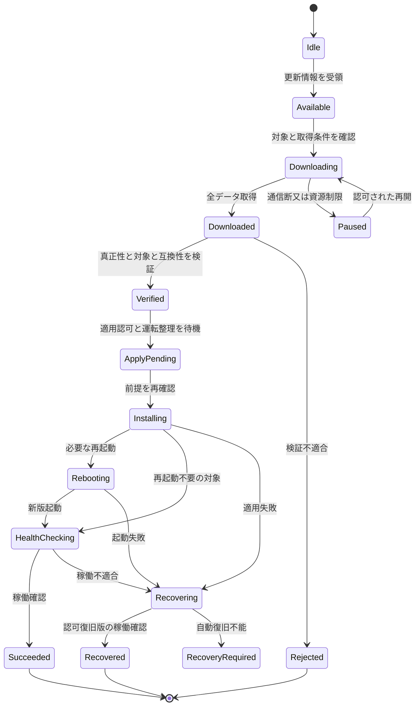

# II-11 FW取得・検証・適用・復旧機能

[全体MOCへ](../../00_MOC.md#part-ii)

**本章の対象：** 配信と適用の分離、H/G更新、更新中断・起動不能からの復旧。

**記載区分：** 既存R7の有効な記述とR6補完項を再配置。章構成・読み分けの案以外に、新しい実装・権限・数値・適合を確定していない。旧版に由来する具体値や規格参照は当時の確認範囲を引き継ぐ。

## II-11.1 通常のOTA

**移行元：** [R7旧13.3節](../../../../../30_references/baselines/R8_FIX001/sources/r7_snapshot/chapters/13_Fault_Recovery_OTA.md)。

更新前に整理できるワークフロー・設定を整理し、未完了要求・送信段階・権威・機器状態を記録する。H側更新成果物にG側FW・保護設定等を含めない。書込み権限、署名検証、必要なら鍵を分ける。

復帰時には更新イメージと設定版を照合し、最新機器状態・通常制御権・有効なプロファイルを再確認する。ログをそのままコマンド列として再生しない。正常終了できない電断・クラッシュを別に評価する。

## II-11.2 更新中断・起動不能・実機残留要求

**移行元：** [R7旧13.9.2節](../../../../../30_references/baselines/R8_FIX001/sources/r7_snapshot/chapters/13_Fault_Recovery_OTA.md)。

**補完項目ID：** `SLOT-R6-13-02`。**対応観点：** C18, C20, C23（[レビューA1](../../../../../30_references/baselines/R8_FIX001/sources/review/R5_Coverage_Review_A1.md)）。

R5の既存原則は保持するが、この項の全対象・具体条件・規範参照は未確定。

**本項に記載する仕様項目：**

- 更新の段階と停止範囲。
- 電断・破損・旧版復帰・起動確認。
- 通常要求の機器内保持と再認可。

**本項の完成判定：** 更新・復旧プロファイルと各障害点の期待状態を確定する。A/B領域等の方式は資料確認なく採用しない。

**具体的な不足：** [OQ-R6-13-02](II-11_Firmware_Update.md#oq-r6-13-02)。採用値・参照版・対象外理由は回答後に本項又は版指定の規範別冊へ反映する。

## II-11.3 FW配信・更新の責任を分ける

**移行元：** [R7旧20.11節](../../../../../30_references/baselines/R8_FIX001/sources/r7_snapshot/chapters/20_Northbound_Monitoring_FW.md)。

| 責務 | 担当案 | 注意 |
|---|---|---|
| 配布物の作成・承認／署名 | リリース権限を持つ主体 | 配信サーバの接続資格と同一の信頼でよいとはしない |
| FW画像・メタデータ配送 | FW配信サーバ | 同一クラウド基盤も可。配送成功は適用成功ではない |
| 更新対象・適用時期の運用要求 | 上位サーバ又は認可ローカル操作 | 自動更新、確認要求、保守時間は製品方針で確定 |
| 配布物検証・最終適用可否 | GW Update Manager | 外部からの『強制』だけで検証や領域境界を解除しない |
| 適用・起動・稼働確認・復旧 | GW更新機構及び必要な起動機構 | A/B等の具体方式は未確定。成功・復旧・復旧不能を区別 |

上記の分担はRFC 9019／9124を補助参考とした設計案。[外部参考](../../../../../30_references/baselines/R8_FIX001/sources/R2_External_References.md)。SUIT等の完全実装を要求するものではない。

最低限の検証対象は、配布物・メタデータの真正性と完全性、対応機種・HW・現在FW／依存版、対象コンポーネントと更新領域、許可された更新系列、サイズ、保存容量、適用前条件とする。配信URLや『最新版』という名称を認可の根拠にしない。通信路の認証と配布物の認証を分け、信頼できるメタデータと画像を対応付ける。

通常H側の更新権限でG側FW・保護設定へ書けないことを維持する。FW配信サーバがG側用配布物も保有する場合でも、H側キーや経路では適用できない。接続PCS／G側のFW更新はユーザーから対象と明示されていないため、通常GW更新への自動包含はしない。対象範囲はSYS-TBD-018で確定する。

復旧用の旧版も無条件に許すのではなく、信頼された承認・安全な更新系列・設定schema互換の範囲で認可する。耐ロールバックを無視した任意ダウングレードと、事前に定義した復旧の両方を『ロールバック』だけで曖昧にしない。実現する機構はHW条件を踏まえて決める。

## II-11.4 FW更新の状態と障害

**移行元：** [R7旧20.12節](../../../../../30_references/baselines/R8_FIX001/sources/r7_snapshot/chapters/20_Northbound_Monitoring_FW.md)。

例示状態機械であり、既存更新実装を確認したものではない。各遷移の永続化・再開可否・取消し可能点・上位通知を確定する。取得だけの障害で稼働中の通常運転を停止させない。適用開始後の中断を取得中断と同じ扱いにしない。ダウンロード済み配布物がある場合の上位断中の適用許可は、事前運用ポリシーと現在認可の有効性に従い判断する。

容量・CPU・帯域の予算を通常通信と分け、取得集中によるG側通信への干渉を評価する。Web資産、API、設定schema、更新機構の互換性をリリース契約に含める。アプリ又はWebの旧版で未知の操作を送らず、非互換時は更新要求・限定表示・読取専用等の規定処置とする。

## II-11.5 更新・復元・無線変更と方式

**移行元：** [R7旧20.20節](../../../../../30_references/baselines/R8_FIX001/sources/r7_snapshot/chapters/20_Northbound_Monitoring_FW.md)。

H側FW配信では方式binding、G側スケジュール原本・時刻・資格情報・FWを変更しない。GW_MANAGED用のG側更新が必要なら別の対象・承認・適用条件・復旧契約として管理し、本章の通常H側更新へ同梱しない。サーバ筐体は共用可能でも論理権限を分ける。

AP／STA切替・ネットワーク設定・GW再起動がG側サーバ通信又はPCS必須通信を止めるなら、通常Web接続変更として無条件許可しない。PCS_DIRECTでもPCSが使う共有ルータ等の影響は別評価する。監視経路の障害を理由に出力制御の方式を自動変更しない。

## II-11.6 FW対象・配信・適用・互換・復旧

**移行元：** [R7旧20.22.2節](../../../../../30_references/baselines/R8_FIX001/sources/r7_snapshot/chapters/20_Northbound_Monitoring_FW.md)。

**補完項目ID：** `SLOT-R6-20-04`。**対応観点：** C20, C34（[レビューA1](../../../../../30_references/baselines/R8_FIX001/sources/review/R5_Coverage_Review_A1.md)）。

R5の既存原則は保持するが、この項の全対象・具体条件・規範参照は未確定。

**本項に記載する仕様項目：**

- 画像種別・HW/FW対象・H/G範囲。
- 署名/承認・互換・容量・適用条件。
- 中断・起動確認・復旧・通知。

**本項の完成判定：** 更新プロファイルを画像/対象/版/認可/段階/復旧条件で確定し、一般H更新からG変更を除外する。

**具体的な不足：** [OQ-R6-20-04](II-11_Firmware_Update.md#oq-r6-20-04)。採用値・参照版・対象外理由は回答後に本項又は版指定の規範別冊へ反映する。

## Open Questions — 本ノートの完成に必要な確認

以下が本章で回答を管理する質問。関連台帳は参照ビューであり、承認や数値を二重管理しない。

### OQ-R6-13-02 — 更新中断・起動不能・実機残留要求

**対象項：** [SLOT-R6-13-02](II-11_Firmware_Update.md#slot-r6-13-02)。状態：**OPEN**。

**質問：** FW適用中断や起動不能から何を条件に復旧するか。H/G更新範囲、復帰先版、残る機器指令と保存データの処置は何か。

**必要資料・完了条件：** 更新・復旧プロファイルと各障害点の期待状態を確定する。A/B領域等の方式は資料確認なく採用しない。

**決定担当：** 未割当（候補：更新・G側・保守設計）。承認者：未定。

**確定時点：** G3 — 該当する受入／適合性評価の実施前（提案）。回答期限：未定。

**未解決時の制約：** 「更新中断・起動不能・実機残留要求」を対象構成の確定保証・実装受入根拠として使用しない。

**関連する既存ID：** SYS-TBD-018, TBD-007, PAR-UP-10, PAR-UP-12。

**回答：** 未記入。**決定記録：** 未記入。

### OQ-R6-20-04 — FW対象・配信・適用・互換・復旧

**対象項：** [SLOT-R6-20-04](II-11_Firmware_Update.md#slot-r6-20-04)。状態：**OPEN**。

**質問：** FW配信が扱う対象はH側のみか、独立G保守を含む別配布か。画像形式・検証・適用条件・旧版復帰と各画面の成功判定をどう定めるか。

**必要資料・完了条件：** 更新プロファイルを画像/対象/版/認可/段階/復旧条件で確定し、一般H更新からG変更を除外する。

**決定担当：** 未割当（候補：FW更新・セキュリティ・運用設計）。承認者：未定。

**確定時点：** G2 — 該当詳細設計・実装契約の固定前（提案）。回答期限：未定。

**未解決時の制約：** 「FW対象・配信・適用・互換・復旧」を対象構成の確定保証・実装受入根拠として使用しない。

**関連する既存ID：** SYS-TBD-018, SYS-TBD-023, PAR-UP-10, PAR-UP-12。

**回答：** 未記入。**決定記録：** 未記入。
