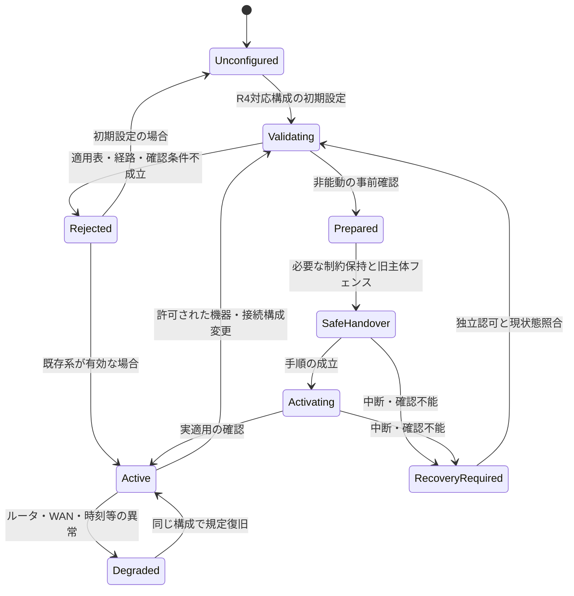

# V-02 施工・初期設定・試運転・引渡し

[全体MOCへ](../../00_MOC.md#part-v)

**本章の対象：** 配線・登録・計測対応、構成有効化、切替中断、利用者引渡し。

**記載区分：** 既存R7の有効な記述とR6補完項を再配置。章構成・読み分けの案以外に、新しい実装・権限・数値・適合を確定していない。旧版に由来する具体値や規格参照は当時の確認範囲を引き継ぐ。

## 本章の責務と他章との境界

設置ごとに、承認対象の構成プロファイル版と実個体・配線・計測対応・設定を関連付ける。代表図があることだけで任意機種を有効化しない。構成変更は通常利用者設定と区別し、旧主体停止と新主体適用を確認する。

施工手順書は操作順を詳細化するが、本書の対応構成や操作権限を追加しない。

## V-02.1 方式選択は系統構成変更

**移行元：** [R7旧12.6節](../../../../../30_references/baselines/R8_FIX001/sources/r7_snapshot/chapters/12_Configuration_Lifecycle.md)。

PCS_DIRECT／GW_MANAGEDの選択、対象scope、ID・容量基準、所有者・PCS対応は系統制御に影響する設定であり、一般の運転モード変更とは別である。製造・初期施工・保守の認可された変更経路を使う案とする。Web／上位から保守要求を配送する場合も独立認可を要し、一般Configuration Serviceの設定書込み権限では有効化できない。

desired/configured/activeの各モード、設定版、切替Job、適用確認を別々に管理する。変更許可・技術的互換性・必要な対外手続き・実機確認が完了するまで有効化しない。無停止切替は既定保証ではない。具体遷移は[旧21章の再配置先](../../appendices/Chapter_Migration_Map.md#old-ch-21)。H側FW更新・一般リストア・初期化が方式や系統資格情報を変更／消去しないよう、操作scopeと復旧手順を規定する。

## V-02.2 ルータ接続と構成変更の制限

**移行元：** [R7旧12.7節](../../../../../30_references/baselines/R8_FIX001/sources/r7_snapshot/chapters/12_Configuration_Lifecycle.md)。

設定の認可はR4適用表を超える方式を許す根拠ではない。ルータ情報、SSID、DHCP／DNS、経路、GWのAP／STA動作に影響する変更ではG側取得・PCS自律取得への波及を確認する。GWからルータの全設定を管理できるとは仮定しない。直接Web接続はルータ非経由の出力制御回線にしない。

## V-02.3 SYS-UC-25：施工・保守での対応構成の選択・変更

**移行元：** [R7旧21.6節](../../../../../30_references/baselines/R8_FIX001/sources/r7_snapshot/chapters/21_Grid_Connection_Selection.md)。

R4では、同一PCSの任意なPCS_DIRECT↔GW_MANAGED切替を製品要件としない。R3の管理切替手順は、**変更前後とも適用表に一致する機器交換・接続構成変更**をメーカー／保守手順が許す場合の条件付き契約として維持する。初期施工のみの対応でも、対応機種・製品要件で判断する。

| 段階 | 主な処理 | 不成立時 |
|---|---|---|
| 申請 | 実機ID、旧新接続種別・mode・scope、期待世代、認可主体・理由を登録 | 不明・一般権限・旧世代を拒否 |
| 事前検証 | R4適用表、ルータ経路、PCS取得能力又はGW必須指示、必要手続きを確認 | 適用外を保守権限で特例許可しない |
| 非能動準備 | 許可された機器手順で時刻・保存・接続・原本を確認 | 旧系の規定動作を維持 |
| 引継ぎ | 保持制約又は必要停止を成立させ旧主体を停止・フェンス | 新主体を無条件に有効化しない |
| 適用確認 | 構成世代を更新し、新しい対象機器・経路の適用を確認 | 不明・要復旧として記録 |
| 確定 | active状態を更新。H側は現状態で通常要求を再調停 | 古いログ・設定を盲目的再生しない |

サーバ・PCSの登録変更、旧取得の停止、新主体の確認手段は未確定。機器が切替をサポートしない場合はオンライン変更を提供しない。通信を跨ぐ切替が単一DB transactionで原子的に完了するとはしない。

## V-02.4 構成の有効化・復旧状態

**移行元：** [R7旧21.7節](../../../../../30_references/baselines/R8_FIX001/sources/r7_snapshot/chapters/21_Grid_Connection_Selection.md)。

Modeの異なる自動遷移は存在しない。modeは21.1の構成表で決まる属性であり、この状態機械の状態遷移だけで別方式へ変わらない。未設定・結果不明から無制限運転を許さず、機器別の安全・保護契約を適用する。

## V-02.5 施工・保守の構成変更と故障時復旧

**移行元：** [R7旧21.13.2節](../../../../../30_references/baselines/R8_FIX001/sources/r7_snapshot/chapters/21_Grid_Connection_Selection.md)。

**補完項目ID：** `SLOT-R6-21-02`。**対応観点：** C09, C29, C34（[レビューA1](../../../../../30_references/baselines/R8_FIX001/sources/review/R5_Coverage_Review_A1.md)）。

R5の既存原則は保持するが、この項の全対象・具体条件・規範参照は未確定。

**本項に記載する仕様項目：**

- 許可された機器接続の変更・scope一意性。
- 旧主体停止/新主体適用・途中電断。
- 必要手続き・復旧・実機確認。

**本項の完成判定：** 機器別変更プロファイル、必要手続き、途中失敗の回復表を確定する。自由なmode切替・自動フェイルオーバーは追加しない。

**具体的な不足：** [OQ-R6-21-02](V-02_Commissioning_Handover.md#oq-r6-21-02)。採用値・参照版・対象外理由は回答後に本項又は版指定の規範別冊へ反映する。

## V-02.6 ネットワーク・機器・計測点の初期設定

**移行元：** [R7旧26.2.1節](../../../../../30_references/baselines/R8_FIX001/sources/r7_snapshot/chapters/26_Manufacturing_Commissioning_Retirement.md)。

**補完項目ID：** `SLOT-R6-26-03`。**対応観点：** C10, C29（[レビューA1](../../../../../30_references/baselines/R8_FIX001/sources/review/R5_Coverage_Review_A1.md)）。

R5の既存原則は保持するが、この項の全対象・具体条件・規範参照は未確定。

**本項に記載する仕様項目：**

- 住宅/GW/利用者の登録。
- ルータ/直接Web/認証の設定。
- 物理機器と回路/計測点/取得主体の照合。

**本項の完成判定：** 施工UCを初期接続から構成承認まで完結させ、チェック項目・失敗時戻り先・記録・引渡し条件を定める。

**具体的な不足：** [OQ-R6-26-03](V-02_Commissioning_Handover.md#oq-r6-26-03)。採用値・参照版・対象外理由は回答後に本項又は版指定の規範別冊へ反映する。

## V-02.7 試運転・利用者引渡し・教育

**移行元：** [R7旧26.2.2節](../../../../../30_references/baselines/R8_FIX001/sources/r7_snapshot/chapters/26_Manufacturing_Commissioning_Retirement.md)。

**補完項目ID：** `SLOT-R6-26-04`。**対応観点：** C02, C29, C32（[レビューA1](../../../../../30_references/baselines/R8_FIX001/sources/review/R5_Coverage_Review_A1.md)）。

R5の既存原則は保持するが、この項の全対象・具体条件・規範参照は未確定。

**本項に記載する仕様項目：**

- 観測・通常操作・取得状態の確認。
- 異常/通信断・未公開情報の説明。
- 利用者権限・説明資料・検収。

**本項の完成判定：** 試運転/引渡し条件表を安全・受入仕様へ対応付け、施工手順と利用者説明の文書ID/版を確定する。

**具体的な不足：** [OQ-R6-26-04](V-02_Commissioning_Handover.md#oq-r6-26-04)。採用値・参照版・対象外理由は回答後に本項又は版指定の規範別冊へ反映する。

## Open Questions — 本ノートの完成に必要な確認

以下が本章で回答を管理する質問。関連台帳は参照ビューであり、承認や数値を二重管理しない。

### OQ-R6-21-02 — 施工・保守の構成変更と故障時復旧

**対象項：** [SLOT-R6-21-02](V-02_Commissioning_Handover.md#slot-r6-21-02)。状態：**OPEN**。

**質問：** 構成変更をどの施工・保守手順で認可し、新旧主体の停止/適用を何で確認するか。中断時の保持状態・時間条件・ロールバック条件は何か。

**必要資料・完了条件：** 機器別変更プロファイル、必要手続き、途中失敗の回復表を確定する。自由なmode切替・自動フェイルオーバーは追加しない。

**決定担当：** 未割当（候補：施工・G側・認証/保守担当）。承認者：未定。

**確定時点：** G3 — 該当する受入／適合性評価の実施前（提案）。回答期限：未定。

**未解決時の制約：** 「施工・保守の構成変更と故障時復旧」を対象構成の確定保証・実装受入根拠として使用しない。

**関連する既存ID：** SYS-TBD-026, SYS-TBD-027, SYS-TBD-028, PAR-GSEL-01, PAR-GSEL-04。

**回答：** 未記入。**決定記録：** 未記入。

### OQ-R6-26-03 — ネットワーク・機器・計測点の初期設定

**対象項：** [SLOT-R6-26-03](V-02_Commissioning_Handover.md#slot-r6-26-03)。状態：**OPEN**。

**質問：** 施工者はどの順序で住宅・GW・機器・計測点を登録するか。EL自律取得/RS-485 GW管理とルータ経路をどう確認し、未完了時に何を禁止するか。

**必要資料・完了条件：** 施工UCを初期接続から構成承認まで完結させ、チェック項目・失敗時戻り先・記録・引渡し条件を定める。

**決定担当：** 未割当（候補：施工・ネットワーク・機器担当）。承認者：未定。

**確定時点：** G2 — 該当詳細設計・実装契約の固定前（提案）。回答期限：未定。

**未解決時の制約：** 「ネットワーク・機器・計測点の初期設定」を対象構成の確定保証・実装受入根拠として使用しない。

**関連する既存ID：** SYS-TBD-026, SYS-TBD-031, SYS-TBD-034。

**回答：** 未記入。**決定記録：** 未記入。

### OQ-R6-26-04 — 試運転・利用者引渡し・教育

**対象項：** [SLOT-R6-26-04](V-02_Commissioning_Handover.md#slot-r6-26-04)。状態：**OPEN**。

**質問：** 現地試運転では何を確認し、どの記録で利用開始を許すか。非公開のPCS状態や通信断時制限を利用者へどう説明し、引渡しを確認するか。

**必要資料・完了条件：** 試運転/引渡し条件表を安全・受入仕様へ対応付け、施工手順と利用者説明の文書ID/版を確定する。

**決定担当：** 未割当（候補：施工・製品企画・QA）。承認者：未定。

**確定時点：** G4 — 製品リリース・出荷／運用移行判断前（提案）。回答期限：未定。

**未解決時の制約：** 「試運転・利用者引渡し・教育」を対象構成の確定保証・実装受入根拠として使用しない。

**関連する既存ID：** SYS-TBD-029, SYS-TBD-027。

**回答：** 未記入。**決定記録：** 未記入。
