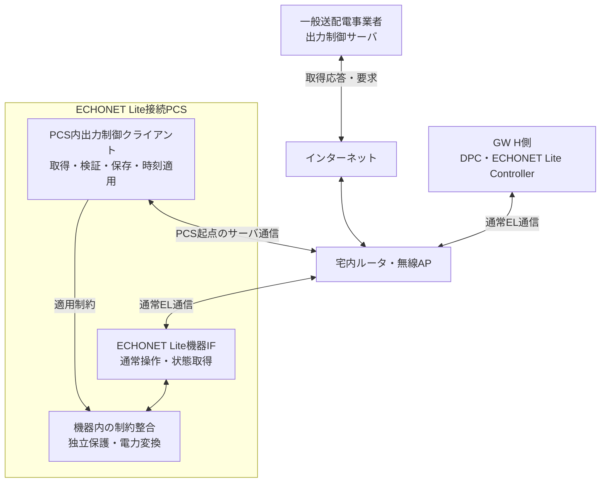
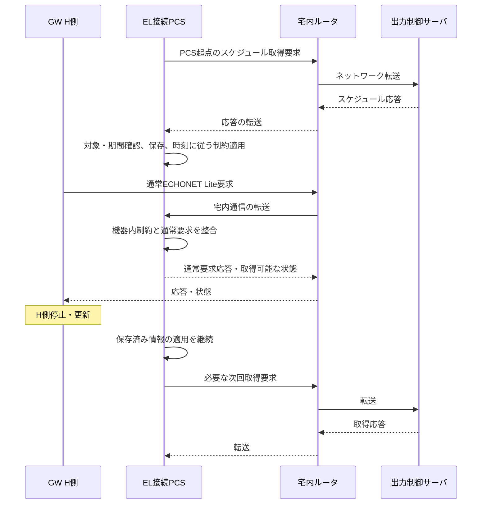

# III-08 出力制御サーバ—取得クライアントインターフェース

[全体MOCへ](../../00_MOC.md#part-iii)

**本章の対象：** GW G側とEL PCS自身の二つの通信終端、すべて宅内ルータ経由。

**記載区分：** 既存R7の有効な記述とR6補完項を再配置。章構成・読み分けの案以外に、新しい実装・権限・数値・適合を確定していない。旧版に由来する具体値や規格参照は当時の確認範囲を引き継ぐ。

## 本章の責務と他章との境界

取得終端は2つに分ける。**EL接続PCS内クライアント ⇄ 宅内ルータ ⇄ インターネット ⇄ 一般送配電事業者サーバ**、および **GW G側クライアント ⇄ 宅内ルータ ⇄ インターネット ⇄ 同サーバ**。

既存IF-GRID-01の二適用プロファイルとして識別し、新しい方式を追加しない。どちらも機器側クライアントが取得要求を行い、応答は逆経路で戻る。対象登録・資格情報・伝送仕様・時刻・保存・失効の実値は適用資料に従い確定する。

スケジュールの動作責任はI-07／II-08、PCS自律取得は外部機器への依存条件、通信障害の全体影響はI-08。GW非経由を宅内ルータ非経由へ読み替えない。

## 本章の既存IFと確定状況

### IF-GRID-01 — 宅内ルータ経由の出力制御取得

| 項目 | 契約・確認状態 |
|---|---|
| 両端 | EL接続PCS内OCU又はRS-485用GW G側 ⇄ 一般送配電事業者 出力制御サーバ |
| 交換情報 | スケジュール等の取得・応答 |
| 成立条件 | 全通信は宅内ルータ経由。EL接続PCSだけがGW非経由で自律取得。RS-485 PCSはGW G側が取得・管理。同一scopeの二重能動適用を禁止 |
| 開始主体 | PCS_GRID_CLIENT_OR_GW_GRID_CLIENT |
| プロトコル・版・ポート | 未確定。既存台帳のnullを無制約と解釈しない |
| 認証・認可 | 未確定の接続プロファイルと役割・操作表を対応付ける |
| schema・値域・状態・時間 | 機器／サービスプロファイルで確定する |
| 再送・重複・失敗・復旧 | 正常・異常・結果不明を区別した契約へ展開する |
| 互換性・負荷・監査・受入 | 対象版とパラメータ・要求・試験へリンクする |

## III-08.1 EL接続PCSの自律取得と通常EL通信

**移行元：** [R7旧21.2節](../../sources/r7_snapshot/chapters/21_Grid_Connection_Selection.md)。

同じルータを通る二つの通信を区別する。

| 通信 | 始点・終点 | 意味 |
|---|---|---|
| 出力制御情報取得 | PCS内クライアント ↔ 出力制御サーバ | PCS自身が開始する取得要求と応答。サーバ通信仕様はTBD |
| 通常EL操作・観測 | GWのController ↔ PCSのEL機器IF | 許可された通常操作と公開状態。スケジュール原本変更ではない |

GWはPCSの取得要求の代理作成、サーバ応答の必須転送、PCS用スケジュール原本の管理をしない。PCSからサーバへの経路に、GWのNAT・ブリッジ・HTTPプロキシ等を必須にしない。宅内ルータが転送することと、GWがアプリケーション処理を代行することを混同しない。

### SYS-UC-23：ルータ経由のPCS取得と通常要求の共存

ルータはアプリケーションのスケジュール承認者ではない。図中の転送はネットワーク経路の説明であり、ルータがELやスケジュールをアプリケーション終端する実装要求ではない。共有ルータ・PCS電源等が健全な条件でGW非依存を検証する。取得版・適用状態がPCSから非公開なら、GWはNOT_EXPOSED／UNKNOWNと報告する。

## Open Questions — 本ノートの完成に必要な確認

### 他章で回答する関連質問

| OQ・正本章 | 残る判断 | 完了条件 |
|---|---|---|
| [OQ-R6-10-01](../V_Lifecycle/V-04_Compliance.md#oq-r6-10-01) | 対象エリア・連系契約・設備範囲・正式仕様の版は何か。取得・保持・適用・期限切れ・通信異常時の値と条件は何か。 | 選択方式ごとの系統接続プロファイルに正式資料・適用範囲・値・確認者を登録する。 |
| [OQ-R6-15-02](../IV_Quality/IV-07_Isolation_Shared_Resources.md#oq-r6-15-02) | 非干渉を説明する入力・負荷・故障条件と比較Baselineは何か。共有ルータ・電源・OS変更をどの評価へ含め、誰が判断するか。 | 前提条件、各変更区分、必要な資料と試験の一覧をメーカー/評価担当と整理する。試験免除の確約にはしない。 |
| [OQ-R6-21-01](../I_System/I-05_Configurations.md#oq-r6-21-01) | EL接続PCSの自律取得能力・プロトコル・資格情報の管理仕様は何か。RS-485のGW管理と併せて、どの型式/版で実経路・公開状態を確認できるか。 | 機器接続別の取得プロファイルと管理主体、公開項目の根拠を登録する。非公開はNOT_EXPOSEDと明記する。 |
