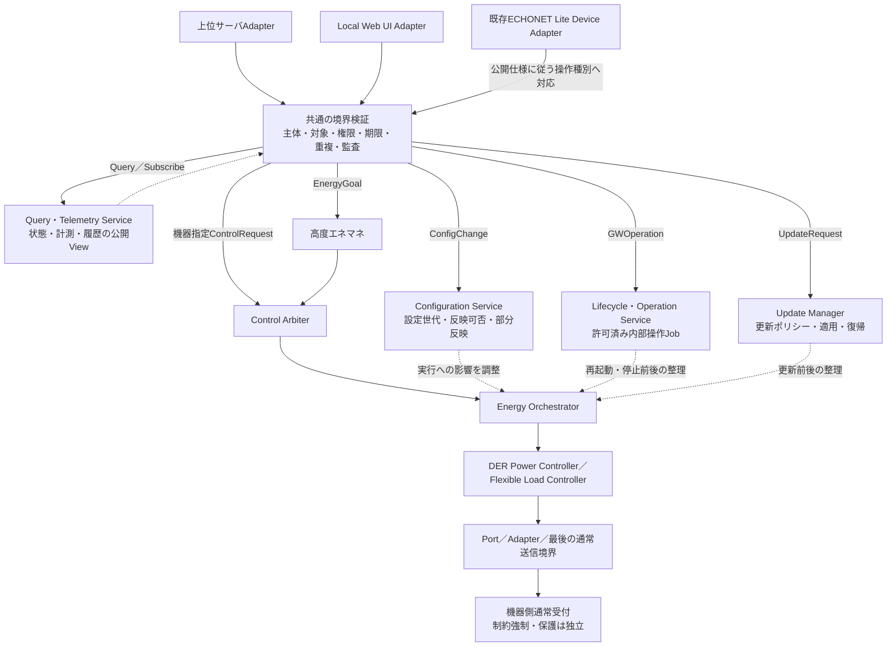

# II-01 GW論理構成・H/G責務・状態所有者

[全体MOCへ](../../00_MOC.md#part-ii)

**本章の対象：** GW内の配賦、状態の正本、固定送信所有者、配置未決事項。

**記載区分：** 既存R7の有効な記述とR6補完項を再配置。章構成・読み分けの案以外に、新しい実装・権限・数値・適合を確定していない。旧版に由来する具体値や規格参照は当時の確認範囲を引き継ぐ。

## 本章の責務と他章との境界

本章はSPK-GW製品内の論理責務・状態正本・実行所有者を扱う。H/Gは実装上の別CPU・別OSを確定した表記ではない。プロセス配置の詳細は構造設計へ配賦し、システム成立に必要な依存禁止・更新境界は本書に残す。

GWのH側が他社EL機器を通常操作すること、GWのG側がRS-485 PCSのスケジュール取得・適用を行うことを分離する。PCS独立保護をH側のアルゴリズムへ移さない。

## II-01.1 GW内の用途別経路

**移行元：** [R7旧2.3節](../../sources/r7_snapshot/chapters/02_System_Context.md)。

QueryはArbiterやDPCの運転権を取得する操作ではない。必要時の実機再取得は、取得能力・優先度・頻度を持つ観測契約で処理する。内部操作が機器を運転させる場合、その部分だけを通常運転のArbiter→Orchestrator経路へ委譲する。設定変更と更新は各所有者で認可・状態遷移を管理し、運転との資源競合を協調する。ここでも箱は論理責務であり、専用プロセスの追加を義務付けない。

## II-01.2 RS-485経路の確定点と残る設計

**移行元：** [R7旧2.5節](../../sources/r7_snapshot/chapters/02_System_Context.md)。

今回、RS-485接続PCSの出力制御はGW管理方式へ配賦する。必須指示・必要監視を含むため、全経路をNORMAL_OPERATION_ONLYとすることはできない。通常通信との共用方法、送信所有者、電文、CPU／OS／driver、再初期化・更新範囲は未確定である。既存実装がG側非干渉要件を満たすという実績ではない。

GWがRS-485 PCSを仮想ELオブジェクトとして外部公開しても、実PCSの通信経路・取得主体を変更しない。両IFを備える物理PCSは接続プロファイルで選択済み経路と取得主体を確認する。検出順序で自動分類しない。

## II-01.3 責務契約

**移行元：** [R7旧3.1節](../../sources/r7_snapshot/chapters/03_Responsibilities.md)。

| 要素 | 担当 | 担当外 |
|---|---|---|
| Cloud／UI／外部HEMS Adapter | 認証情報、形式変換、公開応答・通知 | 機器直接送信、制約解除 |
| 要求受付Usecase | actorの操作権限、期限、重複、形式、対象確認 | 家庭全体の最適化、最終出力強制 |
| 高度エネマネ | 予測、計画案、費用・快適性・SoC等の評価と再計画 | 通常制御権を飛び越えた機器操作 |
| Control Arbiter | 通常運転の採否・優先関係・Lease・競合scope・epoch | 電力会社スケジュール原本、系統保護 |
| Energy Orchestrator | 許可後の計画進行、順序・並行度、部分失敗、再計画連携 | 電文解析、個別機器の保護判定 |
| DER Power Controller | 能力確認、状態遷移、DER操作系列、要求と観測の照合 | 家庭全体の目標配分、G側設定変更 |
| Flexible Load Controller | 充電専用EV・給湯・空調等の操作・状態確認 | 発電側出力制御の唯一の成立責任 |
| Measurement／Device State Service | HEMS用観測の正規化・品質・鮮度・集約 | G側必須計測の唯一の提供者 |
| Device Adapter／Transport | 機器差分、プロトコル変換、トランザクション・送信境界検査 | actor別の独自優先順位・代替計画 |
| 機器側通常受付・運転制御 | 受けた要求を機器・系統制約内で実行 | HEMSの経済計画の代行 |
| 出力制御ユニット／系統連系保護 | 添付のそれぞれの独立責務 | HEMSの応答待ち |

通常の発電抑制要求などが機器の確認済みAPIに含まれることはあるが、電力会社スケジュール原本の変更とは区別する。DER Power Controllerは「すべての機器を最終制御するController」ではない。

## II-01.4 状態の正本

**移行元：** [R7旧3.2節](../../sources/r7_snapshot/chapters/03_Responsibilities.md)。

| 状態 | 所有者 | 他要素の利用 |
|---|---|---|
| 計画案・評価モデル | 高度エネマネ | 許可された計画の実行はOrchestratorへ |
| 通常制御権・Lease・epoch | Control Arbiter | 送信前確認に使う |
| 採用されたEnergy Planと進行 | Energy Orchestrator | DPC等は担当ステップ結果を報告 |
| 個別DER実行状態 | DER Power Controller | 上位はイベント／読出しで参照 |
| 通信トランザクション | Adapter／Transport | 意味的結果へ変換 |
| HEMS用観測値・品質 | Measurement／Device State Service | 計画・表示は鮮度を考慮 |
| スケジュール原本 | 出力制御ユニット | HEMSはコピー又は公開状態のみ |
| 保護設定・保護状態 | 適用される機器側 | HEMSから変更しない |
| 実際の機器状態 | 実機 | キャッシュが実機の正本になることはない |

## II-01.5 一意性と分散配置

**移行元：** [R7旧3.3節](../../sources/r7_snapshot/chapters/03_Responsibilities.md)。

同一resource／競合するconversion_groupに対し、一つの論理的権威と現在有効な実行系列を定める。Arbiterの論理的一元性は、全処理を一つのCOREプロセスへ置く要求ではない。資源群ごとに配置するなら重複scopeと権威移譲を規定する。

Orchestratorはワークフロー、DPCは資源の操作系列、Transportは通信再送を所有する。各層で同じ失敗を独立に無制限リトライ・補償しない。別機器への代替は上位再計画として処理する。

## II-01.6 Blackboard・既存構造

**移行元：** [R7旧3.4節](../../sources/r7_snapshot/chapters/03_Responsibilities.md)。

BlackboardはStateRepository等のPortの背後に置く。State更新とCommand発行を分離し、共有変数の書換えだけで暗黙の機器Setを発生させない。既存実装にその経路がある場合、移行対象の書込み点として記録する。

レイヤーは依存方向を示す。DomainはLinux、ECHONET Lite、RS-485電文、Blackboardの具体実装に依存させず、Adapterで接続する。これは本書で全プロセス構成を確定することを意味しない。

## II-01.7 設定調停との区別

**移行元：** [R7旧3.5節](../../sources/r7_snapshot/chapters/03_Responsibilities.md)。

通常運転要求の競合調停と、設定変更の可否・反映タイミングの調停は別責務とする。状態変更を伴う設定は更新可能状態と設定世代を確認する。重大障害への対応も独立した復旧Usecaseとして認可し、通常設定のpriorityを上げて保護設定を書き換える経路にしない。

## II-01.8 北向き管理の論理責務と状態正本

**移行元：** [R7旧3.6節](../../sources/r7_snapshot/chapters/03_Responsibilities.md)。

| 責務案 | 所有する情報・進行 | 所有しないもの |
|---|---|---|
| Local Web UI Service | 画面資産・ローカルセッション・API変換 | 通常制御権・実機状態の正本 |
| Upper Server Adapter | 認証済み接続・配送相関・有限な再接続 | 利用者の自己申告priority・万能管理権 |
| Query・Telemetry Service | 公開View・アクセス範囲・購読・品質 | 実機・設定所有者の原本そのもの |
| Configuration Service | 要求／保存／有効設定版、反映進行 | 保護設定等のG側原本 |
| Lifecycle・Operation Service | 許可内部操作Job、前提・競合・完了 | 任意shell、G側への無認可リセット |
| Update Manager | 対象配布物、適用可否、更新Job、稼働確認・復旧 | 配信サーバからの無制限な領域書込み |

これらは既存のCore／各プロセスへ配賦し得る論理責務であり、新しいプロセス数を確定しない。エネルギー計画はEnergy Orchestrator、設定は設定調停、内部操作・更新は各ライフサイクル所有者が進行を持つ。相互に影響するscopeについて実行枠と手順を協調し、全部の操作をDPCへ集めない。

クラウドの希望値・履歴とGWで現在有効な設定／状態は別であり、Webとアプリは同じ公開意味論を使う。詳細は[第20章](../III_Interfaces/III-02_Cloud_GW.md#iii-02)。

## II-01.9 出力制御所有者の選択

**移行元：** [R7旧3.7節](../../sources/r7_snapshot/chapters/03_Responsibilities.md)。

スケジュール原本・適用状態の正本は、PCS_DIRECTではPCS内出力制御機能、GW_MANAGEDではGW G側である。H側のDPC／Measurement Service／Query Serviceが正本になるのではない。G側の取得・保存・時計・制約適用・PCS通信・必須監視は一続きの責務として配賦する。

制御scopeと接続方式のbinding、切替Job、grid_control_epochの有効状態は独立した系統構成管理の所有者が持つ。通常Arbiterのepochとは別名前空間にする。上位管理・Web・アプリは認可された読取コピーを表示する。保護責務は選択で移動しない。

## II-01.10 通常EL通信の共通窓口と意味的担当

**移行元：** [R7旧3.9節](../../sources/r7_snapshot/chapters/03_Responsibilities.md)。

DPCはPV・蓄電池等の通常操作、FLCは空調・給湯等の通常操作、Measurement／Device State Serviceは計測・状態の取得と品質管理を担当する。これらが利用するECHONET Lite Controller／機器別Adapterと、H側LAN接続・宅内ルータ・実機IFの往復経路を[第2.1節](../I_System/I-04_System_Context.md#fig-02-01-el)に明示した。通信Controllerは運転優先度や出力制御スケジュールの所有者ではない。

## II-01.11 実装配賦・状態所有者一覧

**移行元：** [R7旧3.10.1節](../../sources/r7_snapshot/chapters/03_Responsibilities.md)。

**補完項目ID：** `SLOT-R6-03-01`。**対応観点：** C06, C13（[レビューA1](../../sources/review/R5_Coverage_Review_A1.md)）。

R5の既存原則は保持するが、この項の全対象・具体条件・規範参照は未確定。

**本項に記載する仕様項目：**

- 論理責務→既存プロセス/新規モジュール。
- 正本の更新主体・参照先。
- 起動依存・故障/再起動範囲。

**本項の完成判定：** 論理責務・状態正本・実装配賦表と全実機書込点の対応をレビューする。全責務のCore集約は前提にしない。

**具体的な不足：** [OQ-R6-03-01](#oq-r6-03-01)。採用値・参照版・対象外理由は回答後に本項又は版指定の規範別冊へ反映する。

## II-01.12 接続方式と実行配置を分ける

**移行元：** [R7旧15.1節](../../sources/r7_snapshot/chapters/15_Deployment_Isolation.md)。

| 接続方式 | R4の位置付け | 出力制御の取得・管理・PCS指示 | 実配置の判断 |
|---|---|---|---|
| PCS_DIRECT | EL接続PCSに限定 | PCS内の出力制御機能、全通信は宅内ルータ経由 | GW非経由の取得・通常EL制御を分離して確認 |
| GW_MANAGED | RS-485接続PCSの方式 | GW G側が宅内ルータ経由で取得しRS-485へ指示 | 独立CPU等又は同一CPUの分離を比較・評価し確定 |

「両方式を機器接続別の対応表内で選べる」が現在の要求であり、特定機種での実装・認証・無停止切替の承認ではない。原典配置案AはPCSメーカー側（内蔵又は外付け）という広い配置、案BはGW内G側という配置候補である。外付けOCUをPCS本体への直接接続と偽って登録しない。R3のPCS_DIRECT例はPCS内蔵の場合を対象とし、外付け構成が必要なら別の派生プロファイルとして明示評価する。

GW_MANAGEDのG側を独立CPU／独立更新単位にする案は有力だが、一律必須又はJET免除条件とはしない。同一CPU／OS案も、カーネル・メモリ・driver・clock・reset・更新の共有依存と非干渉の立証負担を明示して評価する。接続方式の選択だけでCPU配置は決まらない。

## II-01.13 RS-485の配置判断

**移行元：** [R7旧15.4節](../../sources/r7_snapshot/chapters/15_Deployment_Isolation.md)。

PCS_DIRECTはEL接続PCSに限定し、H側DPC／ECHONET Lite Adapterから通常受付へ接続する。RS-485 AdapterをPCS_DIRECTへ割り当てるR3の例は現在の適用外である。通信基盤の共通原因は別に評価する。

既存RS-485サービスがスケジュール実行、必須制御電文、必要計測、PCS接続維持も担う場合、そのサービスを停止するHEMS更新と独立運転は両立しない。分離要件未達として記録し、独立所有サービス・G側実装への配賦とGW_MANAGEDの成立条件を評価する。単に図の箱の名前を変えてPASSにしない。

## II-01.14 配置を固定するレビュー条件

**移行元：** [R7旧15.5節](../../sources/r7_snapshot/chapters/15_Deployment_Isolation.md)。

対象型式・通信仕様・route_role、最終制約の所有者、必要な計測・時刻・保持、通常APIの非迂回、HEMS停止／更新／負荷時の動作、認証構成との対応が記録された場合に配置を承認候補とする。現行コード・HW調査がないため、両方式の選択仕様を持つが、特定配備の適合済み、G側別CPU実装確定、全機能CORE配置のいずれも意味しない。

## II-01.15 GW_MANAGEDのPCS送信所有者

**移行元：** [R7旧15.7節](../../sources/r7_snapshot/chapters/15_Deployment_Isolation.md)。

同じRS-485ポート・セッション・設定レジスタを共用する場合、G側が最後の送信所有者となり、通常要求を固定契約で受けて制約内でPCSへ反映する案を採用候補とする。DPCとG側が別々に同じレジスタを上書きする構成は禁止する。PCS側に独立した制約チャネルと通常運転チャネルがあり、機器内で非迂回が確認される構成なら、独立した通常Portを許す。

前者の必須電文・再試行・監視・資源予約はH側更新の停止対象にしない。後者でも共有バス・NIC・電源・熱の干渉は評価する。図の二つの通常ルートを同一資源に同時使用する権限と解釈しない。

## II-01.16 G側実装と共有資源の依存表

**移行元：** [R7旧15.9.1節](../../sources/r7_snapshot/chapters/15_Deployment_Isolation.md)。

**補完項目ID：** `SLOT-R6-15-01`。**対応観点：** C06, C13, C17（[レビューA1](../../sources/review/R5_Coverage_Review_A1.md)）。

R5の既存原則は保持するが、この項の全対象・具体条件・規範参照は未確定。

**本項に記載する仕様項目：**

- CPU/OS/NIC/電源/reset/時計/保存/driver。
- PCS必須指令・計測・ポート所有。
- H限定停止とGW電断の区別。

**本項の完成判定：** 配備・依存・更新単位・故障注入点の台帳を実HW/OS/PCS資料で埋め、成立と未達を分類する。

**具体的な不足：** [OQ-R6-15-01](#oq-r6-15-01)。採用値・参照版・対象外理由は回答後に本項又は版指定の規範別冊へ反映する。

## Open Questions — 本ノートの完成に必要な確認

以下が本章で回答を管理する質問。関連台帳は参照ビューであり、承認や数値を二重管理しない。

### OQ-R6-03-01 — 実装配賦・状態所有者一覧

**対象項：** [SLOT-R6-03-01](#slot-r6-03-01)。状態：**OPEN**。

**質問：** Arbiter、Orchestrator、DPC/FLC、Measurement、設定・更新・G側を誰が実装し、どの状態の唯一の更新者となるか。既存Core以外の処理はどこへ配賦するか。

**必要資料・完了条件：** 論理責務・状態正本・実装配賦表と全実機書込点の対応をレビューする。全責務のCore集約は前提にしない。

**決定担当：** 未割当（候補：システム・ソフト構造設計）。承認者：未定。

**確定時点：** G1 — 該当する構造・HW・安全・セキュリティ境界の設計固定前（提案）。回答期限：未定。

**未解決時の制約：** 「実装配賦・状態所有者一覧」を対象構成の確定保証・実装受入根拠として使用しない。

**関連する既存ID：** TBD-010, SYS-TBD-001。

**回答：** 未記入。**決定記録：** 未記入。

### OQ-R6-15-01 — G側実装と共有資源の依存表

**対象項：** [SLOT-R6-15-01](#slot-r6-15-01)。状態：**OPEN**。

**質問：** GW_MANAGEDのG側を実際にどこへ配置するか。H側停止・更新に共倒れする資源は何か。独立通常チャネルを採用するなら非迂回を何で確認するか。

**必要資料・完了条件：** 配備・依存・更新単位・故障注入点の台帳を実HW/OS/PCS資料で埋め、成立と未達を分類する。

**決定担当：** 未割当（候補：HW・OS・G側・既存製品担当）。承認者：未定。

**確定時点：** G1 — 該当する構造・HW・安全・セキュリティ境界の設計固定前（提案）。回答期限：未定。

**未解決時の制約：** 「G側実装と共有資源の依存表」を対象構成の確定保証・実装受入根拠として使用しない。

**関連する既存ID：** SYS-TBD-003, SYS-TBD-025, TBD-011。

**回答：** 未記入。**決定記録：** 未記入。
