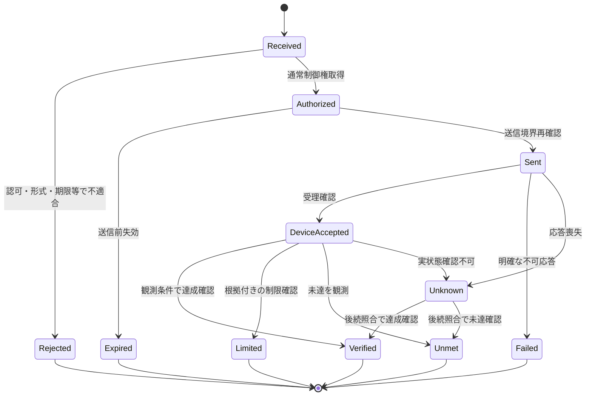

# II-03 要求受付・通常制御権・実行調整

[全体MOCへ](../../00_MOC.md#part-ii)

**本章の対象：** 用途別振分け、Arbiter、Orchestrator、世代・期限・受理と達成。

**記載区分：** 既存R7の有効な記述とR6補完項を再配置。章構成・読み分けの案以外に、新しい実装・権限・数値・適合を確定していない。旧版に由来する具体値や規格参照は当時の確認範囲を引き継ぐ。

## II-03.1 意味論を固定する

**移行元：** [R7旧5.1節](../../sources/r7_snapshot/chapters/05_Control_Contracts.md)。

添付の`spkgw.control-request/v1`、`spkgw.control-authority/v1`等はDomain契約例であり、標準のECHONET Lite電文ではない。C構造体、IPC、JSON等を確定する前に、操作の意味・対象・単位・符号・期限・権限・結果を固定する。

| 契約 | 必須とする意味 | 備考 |
|---|---|---|
| EnergyGoal | 目的・対象時間・拘束条件・要求元 | 機器配分が必要ならEMSへ |
| ControlRequest | request/correlation、actor、resource/group/PCC、operation、値、期間、idempotency、policy_class | 送信者の数値priorityだけで優先度を決めない |
| ControlAuthority | authority、resource_scope、holder、epoch、期限、許可操作、policy_revision | 最後の共通送信境界でも確認 |
| Capability | 実在する操作、値域、最小更新間隔、失効・理由取得能力、profile | 未確認はUNKNOWN／EXAMPLE扱い |
| ConstraintObservation | source、quantity、scope、基準、上限、有効時刻、品質、強制所有者 | READ_ONLY_MIRROR、原本ではない |
| ExecutionResult | 要求・権威・対象、受理段階、観測条件、達成／制限／未達／不明 | 達成とプロトコル応答を分離 |

具体スキーマの必須項目・列挙・互換性は別レビュー対象である。添付の例示値やIDを製品設定として登録しない。

## II-03.2 操作の区別

**移行元：** [R7旧5.2節](../../sources/r7_snapshot/chapters/05_Control_Contracts.md)。

`REQUEST_ACTIVE_POWER`の目標値、通常運転の電力上限、運転モード、スケジュール要求、解除は意味が異なる。本書の具体化案として、operationと操作プロファイルで区別し、未対応の電力目標を黙って電力上限へ変換して成功にしない。許可された代替がある場合は結果に明示する。

通常APIに保護閾値変更、出力制御解除、スケジュール原本設定、G側時計設定、発電所ID変更、認証側FW書込みを公開しない。モードAPIにも許可リストを持たせ、任意の数値で自立・再連系・系統支援へ移れる仕様にしない。

## II-03.3 権威・期限と送信境界

**移行元：** [R7旧5.3節](../../sources/r7_snapshot/chapters/05_Control_Contracts.md)。

Arbiterの採否判定後にも権威交代は起こり得る。DPCで実行前確認し、最後の共通送信境界でepoch・対象・期限を再確認する。旧世代の待機操作は送信しない。Adapterはこの契約検査を行ってよいが、独自の運転優先ポリシーを作らない。

すでに送信した電文、機器内キュー、機器が保持する設定はGWのepochで完全取消しできるとは限らない。取消し可能範囲を区別し、機器状態を照合して現在の権威で補正する。内部Leaseによるexactly-once又は機器自動停止は保証しない。

外部予定時刻・期限はタイムゾーン付き実時刻、経過時間は単調時計を用いる設計を継承する。再起動時に旧単調時計や旧権威をそのまま復元しない。G側時計は別に管理する。

## II-03.4 実行状態

**移行元：** [R7旧5.4節](../../sources/r7_snapshot/chapters/05_Control_Contracts.md)。

この図は添付のモデルを継承する。Unknownは自動的にFailed／再試行へ落とさない。Unknownの保持期限・手動エスカレーション・未解決終端の形式は本書で勝手に追加確定せず、SYS-TBD-008で決める。

| 区別 | 規定 |
|---|---|
| 受理と達成 | 応答が受理か、反映か、運転到達かを操作ごとに対応付ける |
| Verified | 測定点・許容差・確認窓の条件内での確認。永久達成ではない |
| LimitedとUnmet | 制限理由が取得できた場合のみLimited。低出力から原因を断定しない |
| Expiredと機器停止 | GWの実行権限失効は実機の停止確認ではない |
| Timeoutと不実行 | 応答喪失時に機器が実行済みの可能性を残す |

## II-03.5 要求と観測の対応：追加の具体化案

**移行元：** [R7旧5.5節](../../sources/r7_snapshot/chapters/05_Control_Contracts.md)。

要求値、送信値、読み戻した設定、実運転状態、実測値を分け、値が得られない段階はUNKNOWNとして記録する。単位・符号・時刻基準を各値に結び付ける。相関IDは因果の追跡に用いるが、同時刻に同値が観測されたことだけで他の操作元の関与を否定しない。

通知の重複・順序逆転・遅延応答はrequest/correlation/epochで整合させ、旧応答で旧権威を復活させない。冪等キーの保存期間・再利用条件・再起動後の有効範囲は未確定パラメータとして管理する。

## II-03.6 優先関係・同順位・取消し・並行実行

**移行元：** [R7旧5.11.1節](../../sources/r7_snapshot/chapters/05_Control_Contracts.md)。

**補完項目ID：** `SLOT-R6-05-01`。**対応観点：** C07, C13（[レビューA1](../../sources/review/R5_Coverage_Review_A1.md)）。

R5の既存原則は保持するが、この項の全対象・具体条件・規範参照は未確定。

**本項に記載する仕様項目：**

- 主体×操作×競合scope。
- 同順位・部分許可・Lease。
- 取消し・補償・最後の送信境界。

**本項の完成判定：** 通常操作の優先表、同時実行許可表、要求失効と補償の決定表を機器能力と対応付ける。

**具体的な不足：** [OQ-R6-05-01](#oq-r6-05-01)。採用値・参照版・対象外理由は回答後に本項又は版指定の規範別冊へ反映する。

## II-03.7 結果・確認窓・不明状態の終端

**移行元：** [R7旧5.11.2節](../../sources/r7_snapshot/chapters/05_Control_Contracts.md)。

**補完項目ID：** `SLOT-R6-05-02`。**対応観点：** C07, C22（[レビューA1](../../sources/review/R5_Coverage_Review_A1.md)）。

R5の既存原則は保持するが、この項の全対象・具体条件・規範参照は未確定。

**本項に記載する仕様項目：**

- 受理/送信/機器受理/達成の条件。
- 許容差・評価窓・理由の根拠。
- Unknownの再確認・終端・通知。

**本項の完成判定：** 操作別結果判定表とUnknownの再照合・終端方針を定義し、APIとUIの同一意味を確認する。

**具体的な不足：** [OQ-R6-05-02](#oq-r6-05-02)。採用値・参照版・対象外理由は回答後に本項又は版指定の規範別冊へ反映する。

## II-03.8 部分失敗と補償

**移行元：** [R7旧6.4節](../../sources/r7_snapshot/chapters/06_Usecases.md)。

複数機器に対する一つの計画は、要求がまとめて許可されても実機操作まで同時に成功するとは限らない。許可単位・実行順序・並行度を定義し、成功したステップ、受理のみ、結果不明、未送信をOrchestratorが管理する。

補償は、現在の権威・制約・機器状態で許される新しい操作として発行する。実行不明の操作を未実行と仮定して他機器へ二重に配分しない。再計画の責任はEMS、進行・補償管理はOrchestrator、機器単位の状態照合はDPCに置く。

## Open Questions — 本ノートの完成に必要な確認

以下が本章で回答を管理する質問。関連台帳は参照ビューであり、承認や数値を二重管理しない。

### OQ-R6-05-01 — 優先関係・同順位・取消し・並行実行

**対象項：** [SLOT-R6-05-01](#slot-r6-05-01)。状態：**OPEN**。

**質問：** 利用者、本体操作、各クラウド、既存運転、高度エネマネが競合するとき、操作別の優先順位と同順位処理をどう決めるか。途中実行の取消しをどこまで保証するか。

**必要資料・完了条件：** 通常操作の優先表、同時実行許可表、要求失効と補償の決定表を機器能力と対応付ける。

**決定担当：** 未割当（候補：制御設計・製品企画）。承認者：未定。

**確定時点：** G2 — 該当詳細設計・実装契約の固定前（提案）。回答期限：未定。

**未解決時の制約：** 「優先関係・同順位・取消し・並行実行」を対象構成の確定保証・実装受入根拠として使用しない。

**関連する既存ID：** TBD-009, TBD-007, PAR-AUTH-01。

**回答：** 未記入。**決定記録：** 未記入。

### OQ-R6-05-02 — 結果・確認窓・不明状態の終端

**対象項：** [SLOT-R6-05-02](#slot-r6-05-02)。状態：**OPEN**。

**質問：** 各操作の達成をどの計測点・許容差・確認時間で判定するか。応答や観測がない場合にUnknownを何時まで保持し、何を利用者へ返すか。

**必要資料・完了条件：** 操作別結果判定表とUnknownの再照合・終端方針を定義し、APIとUIの同一意味を確認する。

**決定担当：** 未割当（候補：制御・測定・UI設計）。承認者：未定。

**確定時点：** G3 — 該当する受入／適合性評価の実施前（提案）。回答期限：未定。

**未解決時の制約：** 「結果・確認窓・不明状態の終端」を対象構成の確定保証・実装受入根拠として使用しない。

**関連する既存ID：** SYS-TBD-008, TBD-008, PAR-RESULT-01, PAR-RESULT-02。

**回答：** 未記入。**決定記録：** 未記入。

### 他章で回答する関連質問

| OQ・正本章 | 残る判断 | 完了条件 |
|---|---|---|
| [OQ-R6-03-01](II-01_GW_Architecture.md#oq-r6-03-01) | Arbiter、Orchestrator、DPC/FLC、Measurement、設定・更新・G側を誰が実装し、どの状態の唯一の更新者となるか。既存Core以外の処理はどこへ配賦するか。 | 論理責務・状態正本・実装配賦表と全実機書込点の対応をレビューする。全責務のCore集約は前提にしない。 |
