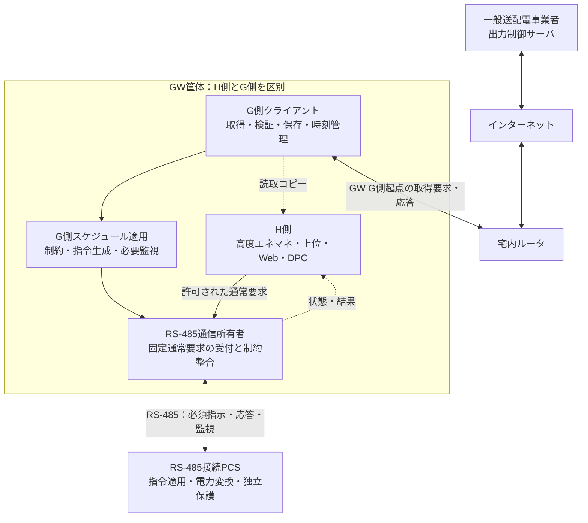
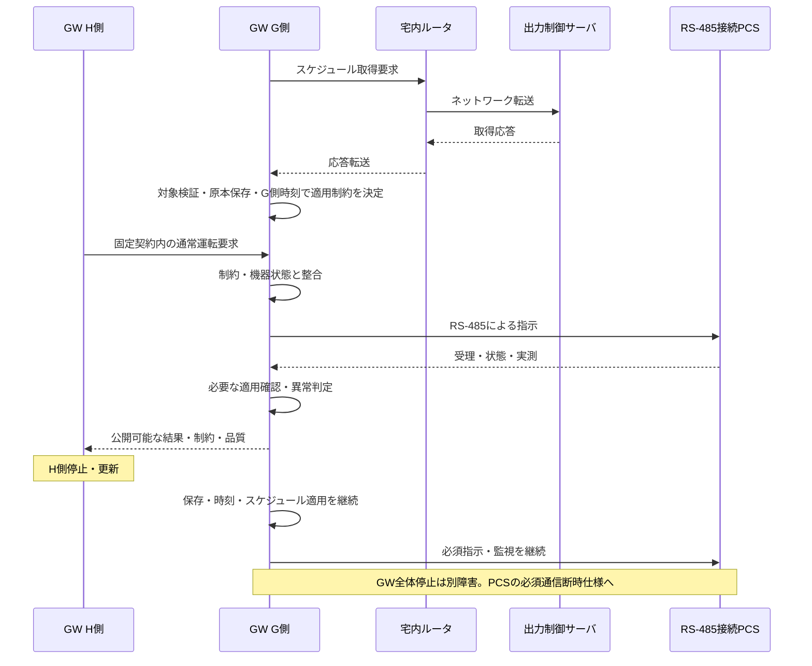

# II-08 GW G側の出力制御機能

[全体MOCへ](../../00_MOC.md#part-ii)

**本章の対象：** RS-485対象の取得・検証・保存・時刻適用・指示・必須監視。

**記載区分：** 既存R7の有効な記述とR6補完項を再配置。章構成・読み分けの案以外に、新しい実装・権限・数値・適合を確定していない。旧版に由来する具体値や規格参照は当時の確認範囲を引き継ぐ。

## 本章の責務と他章との境界

本章のGW実装責任は **RS-485接続PCSを対象とするGW_MANAGED** に限って配賦する。サーバ取得・検証・保存・時刻管理・スケジュール適用・PCS指示・必須監視をG側で担う。単なるHTTP転送機能ではない。

EL接続PCSではPCS自身が取得・保存・適用し、GWは代理取得しない。二方式の共通要求を下記で参照しても、EL側の機能をGWの実装要求へ置き換えない。H/G内部契約はIII-01、取得通信はIII-08、PCS通信はIII-07。

## II-08.1 出力制御ユニットの契約

**移行元：** [R7旧10.2節](../../sources/r7_snapshot/chapters/10_Grid_Protection.md)。

| 機能 | システム依存要求 | HEMS側の扱い |
|---|---|---|
| 接続開始・取得 | 適用する方式で対象情報を取得 | 必須プロキシ／HTTPリレーにならない |
| 対象確認・検証 | 設備・容量根拠・期間・形式等を確認 | HEMSが対象ID・容量根拠を無権限変更しない |
| 永続保持 | 必要スケジュール・状態を保持し復旧 | HEMS DB／OTAだけに依存しない |
| 時刻適用 | 出力制御用時刻に従い適用 | HEMS時刻修正をG側へ伝播しない |
| 制約出力 | quantity・scope・容量基準を特定して渡す | 読取コピーは計画補助のみ |
| 状態・異常 | 仕様に従う縮退・通知 | コピー欠損を制約なしとしない |

通常クラウドと出力制御配信経路を混同しない。配信事業者を経由する構成を採用する場合は、その実経路を接続プロファイルに登録する。必須通信資源がHEMS更新で停止する構成なら分離成立を宣言しない。

## II-08.2 RS-485接続PCSのGW管理

**移行元：** [R7旧21.3節](../../sources/r7_snapshot/chapters/21_Grid_Connection_Selection.md)。

GW G側が取得・管理主体であり、単なるファイル転送機能ではない。PCSからサーバへの独自取得経路は本構成にない。RS-485上の具体電文、応答意味、設定順序、周期は未確定であり、Modbus等を仮定しない。

### SYS-UC-24：GW取得・管理からRS-485指示まで

H側が通常PCS書込みを後から上書きして制約を解除できない所有構造にする。G側のネットワーク・RS-485通信をH側プロセスに依存させない。別CPUか同一CPUかは未確定であり、共通OS・NIC・reset・電源・driverの影響を評価する。

## Open Questions — 本ノートの完成に必要な確認

### 他章で回答する関連質問

| OQ・正本章 | 残る判断 | 完了条件 |
|---|---|---|
| [OQ-R6-10-01](../V_Lifecycle/V-04_Compliance.md#oq-r6-10-01) | 対象エリア・連系契約・設備範囲・正式仕様の版は何か。取得・保持・適用・期限切れ・通信異常時の値と条件は何か。 | 選択方式ごとの系統接続プロファイルに正式資料・適用範囲・値・確認者を登録する。 |
| [OQ-R6-10-02](../I_System/I-07_Responsibilities_Constraints.md#oq-r6-10-02) | 対象PCSの通常操作で出力制約や保護を上書きできない根拠は何か。独立計測・保護復帰・必要通信を誰が担い、H停止時に何を維持するか。 | メーカー説明・機能分担・許可操作・適用評価の記録をそろえ、必要な受入条件を[旧17章の再配置先](../../appendices/Chapter_Migration_Map.md#old-ch-17)へ配賦する。 |
| [OQ-R6-15-01](II-01_GW_Architecture.md#oq-r6-15-01) | GW_MANAGEDのG側を実際にどこへ配置するか。H側停止・更新に共倒れする資源は何か。独立通常チャネルを採用するなら非迂回を何で確認するか。 | 配備・依存・更新単位・故障注入点の台帳を実HW/OS/PCS資料で埋め、成立と未達を分類する。 |
| [OQ-R6-21-01](../I_System/I-05_Configurations.md#oq-r6-21-01) | EL接続PCSの自律取得能力・プロトコル・資格情報の管理仕様は何か。RS-485のGW管理と併せて、どの型式/版で実経路・公開状態を確認できるか。 | 機器接続別の取得プロファイルと管理主体、公開項目の根拠を登録する。非公開はNOT_EXPOSEDと明記する。 |
