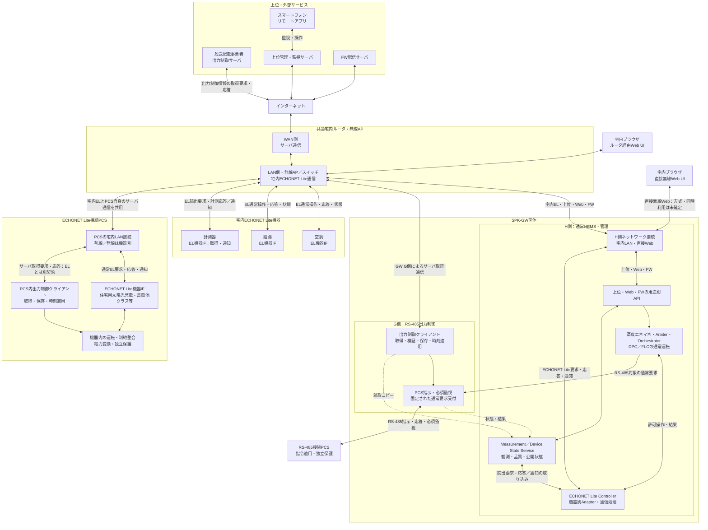
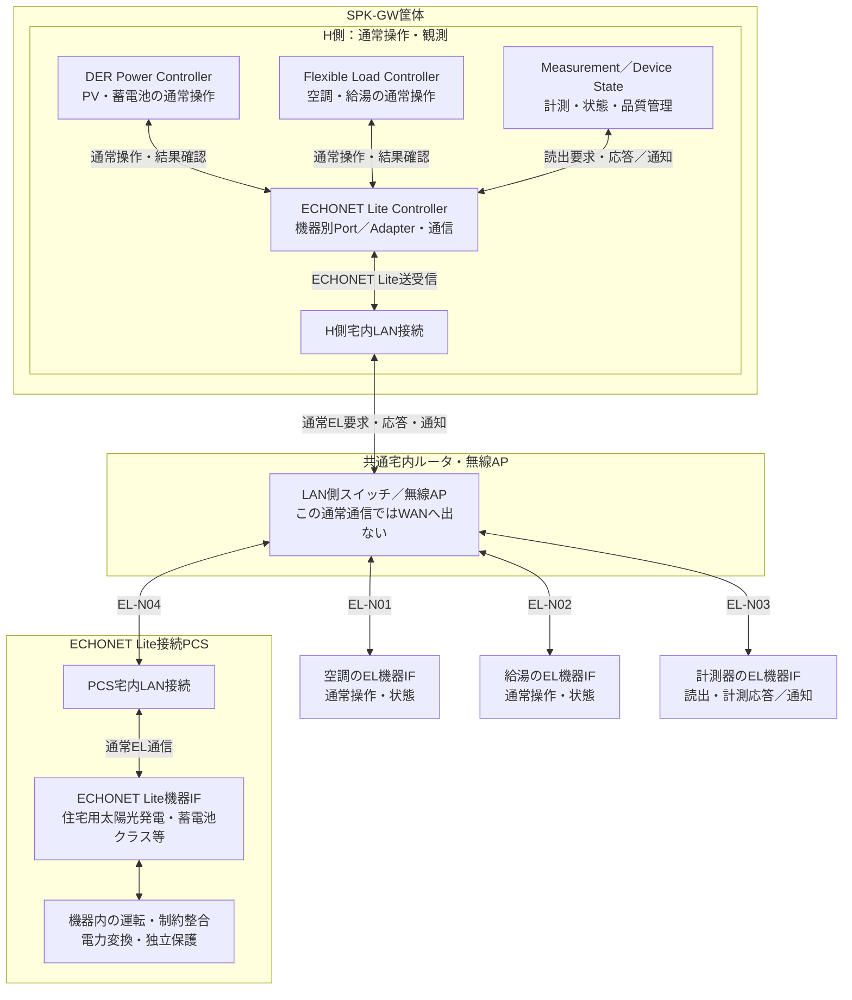

# I-04 システムコンテキスト・ネットワーク接続

[全体MOCへ](../../00_MOC.md#part-i)

**本章の対象：** 外部サービス、宅内ルータ、GW、両PCS、EL負荷・計測器の全体図と接続拡大図。

**記載区分：** 既存R7の有効な記述とR6補完項を再配置。章構成・読み分けの案以外に、新しい実装・権限・数値・適合を確定していない。旧版に由来する具体値や規格参照は当時の確認範囲を引き継ぐ。

## 本章の責務と他章との境界

本章は物理ネットワークと論理通信終端を区別した全体コンテキストを所有する。図は既存R5以降の資産を保持する。すべての出力制御サーバ取得は宅内ルータ経由であり、GWを介さず取得するのはECHONET Lite接続PCS自身だけである。

通常ELの共通経路は **H側EL Controller ⇄ H側宅内LAN接続 ⇄ ルータのLAN／AP・スイッチ ⇄ PCS・空調・給湯・計測器のEL機器IF**。LANのスイッチングとWANルーティングを同一視しない。詳細契約はPart IIIへ配賦する。

## I-04.1 システムコンテキスト：共通宅内ルータを明示

**移行元：** [R7旧2.1節](../../sources/r7_snapshot/chapters/02_System_Context.md)。

**H側のECHONET Lite Controllerは、H側の宅内LAN接続 → 共通宅内ルータのLAN側・無線AP／スイッチ → 各機器のECHONET Lite機器IFという往復経路で、空調・給湯・計測器と、PV・蓄電池クラス等を公開するPCSに接続する。** PCS自身の出力制御スケジュール取得は、この通常EL通信とは別の契約・責任主体である。

R4の「EL Controllerと空調・給湯・計測器の間だけを直結表示する線」を廃止し、全体図と拡大図で同じ接続経路を示す。以下は共通宅内LANの代表構成を明示したものであり、既存のWi-SUN等のプロファイルを本図のルータLAN経由へ無条件に置換する改訂ではない。個別媒体・接続方式は既存の機器プロファイルで確認する。

### 全体構成

[拡大表示用SVG](../../diagrams/02_01_System_Context.svg)／[PNG](../../diagrams/02_01_System_Context.png)／[編集用Mermaid](../../diagrams/02_01_System_Context.mmd)

図の双方向実線は通信又は要求・応答の往復、単方向実線は内部の処理・指令依存、破線は公開状態・読取コピーを表す。通常EL通信もPCS自身のサーバ通信も物理ネットワークを共有するが、通信の終端を同一視しない。

本図の宅内ルータは、**LAN側のスイッチ・無線APと、WAN側のインターネット接続を分けて表示**している。宅内EL通信はLAN側で各機器へ到達する経路であり、出力制御サーバや上位クラウドを経由しない。全ELフレームのIPルーティングを義務付ける図ではない。NIC数、無線／有線、物理ポート、共有スタック・OS配置は未確定である。

**出力制御サーバとPCS又はGWが、宅内ルータを飛び越えて接続する経路はない。** EL接続PCSの自律取得では、GWを取得代理にも必須IP転送器にも使わない。ルータは通信中継だけを担い、スケジュールの検証・保存・適用責任はPCS又はGW G側に残る。

端末–GWの直接無線Webは、通常EL機器接続とは別のローカル経路である。出力制御サーバのルータ非経由回線でも、全EL機器をGWの直接無線へ収容する構成でもない。SoftAP／Wi-Fi Direct、AP＋STA同時動作、Web資産の配置はSYS-TBD-014／015で確認する。

### H側ECHONET Lite Controllerから各機器への接続拡大

[拡大表示用SVG](../../diagrams/02_01_EL_Connections.svg)／[PNG](../../diagrams/02_01_EL_Connections.png)／[編集用Mermaid](../../diagrams/02_01_EL_Connections.mmd)

**図のDPC／FLC入力は、通常運転の受付・Arbiter・Orchestratorで許可された要求である。** ここでは上位の調停経路を省略し、機器への送受信経路に焦点を当てる。Measurement／Device State Serviceは計測取得・品質管理の担当であり、計測器をFLC配下の運転Actuatorとして扱わない。

「ECHONET Lite Controller」は通信上のController役割を示す。DPC・FLC・Measurementから利用される機器別Port／Adapterと通信処理の論理的なまとまりであり、単一プロセス・単一ソケット・専用NICへの集約を確定しない。Controller側の通信応答・通知は、要求の相関・対象機器を確認して、DPC／FLCの結果確認及びMeasurement／Device Stateの観測取り込みへ戻す。

この拡大図は宅内の通常EL通信だけを示す。PCS内出力制御クライアントとサーバへの別経路は図2.1.1及び経路表のGRID-EL-PCSを参照する。

PCSの箱は一つの物理構成の例である。「住宅用太陽光発電クラス」「蓄電池クラス」は公開され得る論理機器クラスであり、その数だけ独立PCSが存在する、全PCSが両クラスを公開する、全プロパティに対応するという意味ではない。物理機器・EOJ・resource・conversion_groupの対応は[第04章](I-05_Configurations.md#i-05)で管理する。

### 通信経路と担当責務の対応

下表のELはECHONET Liteを指す。応答は要求と逆方向、機器が対応する通知は機器から同じ宅内接続を通ってControllerへ届く。全機器に通知機能や書込み能力があるとは仮定しない。

| 経路ID | 対象・用途 | H側の意味的な担当 | 要求の往路 | 応答・通知と結果の戻り先 |
|---|---|---|---|---|
| EL-N01 | 空調の通常操作・状態確認 | FLC。観測品質はMeasurement／Device State | FLC → EL Controller → H側LAN接続 → 宅内ルータLAN／AP → 空調EL機器IF | 空調 → 同じ宅内経路を逆順 → EL Controller → FLCの結果確認／観測サービス |
| EL-N02 | 給湯の通常操作・状態確認 | FLC。観測品質はMeasurement／Device State | FLC → EL Controller → H側LAN接続 → 宅内ルータLAN／AP → 給湯EL機器IF | 給湯 → 同じ宅内経路を逆順 → EL Controller → FLCの結果確認／観測サービス |
| EL-N03 | 計測器の読出・計測通知 | Measurement／Device State | 観測サービス → EL Controller → H側LAN接続 → 宅内ルータLAN／AP → 計測器EL機器IF | 計測器 → 同じ宅内経路を逆順 → EL Controller → 観測サービス。DPC/FLCの運転命令とは分ける |
| EL-N04 | PV・蓄電池等のPCS通常操作・状態確認 | DPC。観測品質はMeasurement／Device State | DPC → EL Controller → H側LAN接続 → 宅内ルータLAN／AP → PCSのLAN接続 → PCSのEL機器IF | PCS EL機器IF → 同じ宅内経路を逆順 → EL Controller → DPCの結果確認／観測サービス |
| GRID-EL-PCS | EL接続PCSの出力制御情報取得 | PCS内出力制御クライアント。H側は取得主体でない | PCSクライアント → PCSのLAN接続 → 宅内ルータLAN側 → WAN側 → インターネット → 出力制御サーバ | サーバ → インターネット → ルータWAN側 → LAN側 → PCSのLAN接続 → PCSクライアント。GW非経由 |
| GRID-RS-GW | RS-485接続PCS用の出力制御情報取得 | GW G側 | GW G側 → 宅内ルータLAN側 → WAN側 → インターネット → 出力制御サーバ | サーバ → 同じネットワーク経路を逆順 → GW G側。適用指示・必須監視はRS-485でPCSへ |

**EL-N04とGRID-EL-PCSは、同じPCS・LAN接続・宅内ルータを使っていても別通信である。** EL ControllerはPCS内の出力制御クライアントへスケジュールを代理取得・転送しない。PCSの通常EL応答を受信できたことだけで、PCS自身のサーバ取得成功やスケジュール適用を判定しない。

この対応表を機械可読化したものは[通常EL経路台帳](../../data/echonet_normal_routes.json)。既存の[出力制御経路台帳](../../data/grid_network_routes.json)はR4から変更しない。公開プロパティ、通信頻度、媒体、宛先、認証・暗号化方式は既存プロファイル／TBDに従い、本改訂では新たに決定しない。

## I-04.2 経路・役割・現在の対応範囲

**移行元：** [R7旧2.2節](../../sources/r7_snapshot/chapters/02_System_Context.md)。

| 接続用途 | 通信経路 | アプリケーション責任主体 |
|---|---|---|
| EL接続PCSの出力制御情報取得 | PCS → 宅内ルータ → インターネット → 出力制御サーバ。応答は逆順 | PCS内の出力制御機能。GWは非経由 |
| RS-485接続PCS用の情報取得 | GW G側 → 宅内ルータ → インターネット → 出力制御サーバ。応答は逆順 | GW G側 |
| RS-485接続PCSへの出力指示 | GW G側 → RS-485 → PCS。状態・応答は逆順 | G側の必須指令・監視とPCS機器制御 |
| 空調・給湯の通常操作・観測 | H側FLC ↔ EL Controller ↔ H側LAN接続 ↔ 宅内ルータLAN／AP ↔ 空調・給湯のEL機器IF | FLC・EL Adapter／Controller・機器側通常受付 |
| 計測器の読出・計測通知 | H側Measurement／Device State ↔ EL Controller ↔ H側LAN接続 ↔ 宅内ルータLAN／AP ↔ 計測器のEL機器IF | 観測サービス・EL Adapter／Controller・計測器 |
| EL接続PCSの通常操作・観測 | H側DPC ↔ EL Controller ↔ H側LAN接続 ↔ 宅内ルータLAN／AP ↔ PCSのLAN接続 ↔ PCSのEL機器IF | DPC・EL Adapter／Controller・機器側通常受付 |
| 上位監視・設定・内部機能操作 | GW H側 ↔ 宅内ルータ ↔ インターネット ↔ 上位サーバ | 用途別APIと各状態所有者 |
| FW配信 | GW更新機能 ↔ 宅内ルータ ↔ インターネット ↔ FWサーバ | 配布・検証・適用を別責務化 |
| 宅内Web | 端末 ↔ GW直接無線、又は端末 ↔ 宅内ルータ ↔ GW | Local Web／ローカル認可 |
| リモートアプリ | スマートフォン ↔ クラウド ↔ インターネット ↔ 宅内ルータ ↔ GW | クラウドとGW用途別API |

通常EL通信とPCSサーバ通信は、同じ物理NIC・ルータを使う場合でも別契約である。サーバ通信がECHONET Liteそのものであるとは規定しない。PCSネットワーク接続の存在、クラス検出、通常Setの成功だけで、独立したサーバ取得・保存・適用が確認できたとしない。

| 外部要素 | 追加・維持する責任境界 |
|---|---|
| 一般送配電事業者サーバ | 取得対象のスケジュール情報。H側通常APIの権限には統合しない |
| FW配信サーバ | 配布物とメタデータ。配信成功を適用許可としない |
| 上位管理・監視サーバ | 許可設定・内部操作・状態公開・アプリ仲介。任意shell／DB／保護設定を開放しない |
| 宅内Web UI／アプリ | 操作受付・達成・設定反映・不明を区別。同一LANだから管理者とはしない |
| 宅内ルータ／AP | 全出力制御取得経路の共通依存。停止・混雑・設定変更時の挙動を評価する |

メーカーの上位クラウドとFW配信サーバの物理共置を禁止しないが、役割・権限・配布承認・障害・更新の責任は区別する。ルータ障害対策として別回線、GW代理取得、テザリング、自動方式切替を暗黙に追加しない。

## I-04.3 ルータ共有の障害範囲

**移行元：** [R7旧2.7節](../../sources/r7_snapshot/chapters/02_System_Context.md)。

GW非経由とはGW障害からの責務・経路分離であり、ルータやWANまで別系統という意味ではない。WAN断ではLANが残る場合と、ルータ全停止でLAN/APも失う場合を分ける。RS-485はルータを介さない機器間リンクだが、GW・PCS電源と実装が健全な条件でのみ継続できる。保持済みスケジュール、有効期限、時刻、必須通信異常の動作は[第13章](../II_GW/II-10_Fault_Alarm_Diagnostics.md#ii-10)と[旧21章の再配置先](../../appendices/Chapter_Migration_Map.md#old-ch-21)で定義する。

## I-04.4 実ネットワークと接続先の実体

**移行元：** [R7旧2.8.1節](../../sources/r7_snapshot/chapters/02_System_Context.md)。

**補完項目ID：** `SLOT-R6-02-01`。**対応観点：** C04, C12（[レビューA1](../../sources/review/R5_Coverage_Review_A1.md)）。

全出力制御サーバ通信は宅内ルータ経由。EL接続PCSは自律取得、RS-485接続PCSはGW G側管理というR5条件を維持する。

**本項に記載する仕様項目：**

- 宅内ルータLAN/WANとGW H/G・PCSの接続。
- 有線/無線・同一LAN・発見条件。
- 上位とFW配信の事業主体・停止範囲。

**本項の完成判定：** 設置配線・ネットワークプロファイルとサービス責任表を確定し、R5の図の各端点を実接続先に対応付ける。

**具体的な不足：** [OQ-R6-02-01](#oq-r6-02-01)。採用値・参照版・対象外理由は回答後に本項又は版指定の規範別冊へ反映する。

## I-04.5 宅内直接Webとルータ接続の成立条件

**移行元：** [R7旧2.8.2節](../../sources/r7_snapshot/chapters/02_System_Context.md)。

**補完項目ID：** `SLOT-R6-02-02`。**対応観点：** C02, C12, C24（[レビューA1](../../sources/review/R5_Coverage_Review_A1.md)）。

R5の既存原則は保持するが、この項の全対象・具体条件・規範参照は未確定。

**本項に記載する仕様項目：**

- 直接無線方式・AP/STA能力。
- Web資産の配置・名前解決。
- 同時稼働・WAN断・LAN断の利用可能範囲。

**本項の完成判定：** 直接接続/宅内ルータ/リモートの構成別機能表と到達・再接続の確認方法を定義する。

**具体的な不足：** [OQ-R6-02-02](#oq-r6-02-02)。採用値・参照版・対象外理由は回答後に本項又は版指定の規範別冊へ反映する。

## I-04.6 宅内ルータの責務と取得所有者

**移行元：** [R7旧3.8節](../../sources/r7_snapshot/chapters/03_Responsibilities.md)。

ルータは全サーバ取得通信の経由点であり、スケジュール所有者ではない。EL接続PCSはPCS内機能、RS-485接続PCSはGW G側が原本を所有する。GW H側は両方の読取Viewを集約できるが、EL接続PCS用の代理取得者にならない。

## Open Questions — 本ノートの完成に必要な確認

以下が本章で回答を管理する質問。関連台帳は参照ビューであり、承認や数値を二重管理しない。

### OQ-R6-02-01 — 実ネットワークと接続先の実体

**対象項：** [SLOT-R6-02-01](#slot-r6-02-01)。状態：**OPEN**。

**質問：** 対象住宅のGW H/G、EL接続PCS、通常EL機器はどのLAN・AP・有線ポートへ接続するか。ルータの必要条件と外部サービスの運用責任は何か。

**必要資料・完了条件：** 設置配線・ネットワークプロファイルとサービス責任表を確定し、R5の図の各端点を実接続先に対応付ける。

**決定担当：** 未割当（候補：ネットワーク・製品運用・施工設計）。承認者：未定。

**確定時点：** G1 — 該当する構造・HW・安全・セキュリティ境界の設計固定前（提案）。回答期限：未定。

**未解決時の制約：** 「実ネットワークと接続先の実体」を対象構成の確定保証・実装受入根拠として使用しない。

**関連する既存ID：** SYS-TBD-012, SYS-TBD-031, PAR-GNET-01。

**回答：** 未記入。**決定記録：** 未記入。

### OQ-R6-02-02 — 宅内直接Webとルータ接続の成立条件

**対象項：** [SLOT-R6-02-02](#slot-r6-02-02)。状態：**OPEN**。

**質問：** 直接無線Webはどの無線方式を使うか。ルータ接続と同時利用できるか。クラウド断でも利用できる画面と認証条件は何か。

**必要資料・完了条件：** 直接接続/宅内ルータ/リモートの構成別機能表と到達・再接続の確認方法を定義する。

**決定担当：** 未割当（候補：無線・Web・セキュリティ設計）。承認者：未定。

**確定時点：** G1 — 該当する構造・HW・安全・セキュリティ境界の設計固定前（提案）。回答期限：未定。

**未解決時の制約：** 「宅内直接Webとルータ接続の成立条件」を対象構成の確定保証・実装受入根拠として使用しない。

**関連する既存ID：** SYS-TBD-014, SYS-TBD-015, PAR-UP-08。

**回答：** 未記入。**決定記録：** 未記入。
