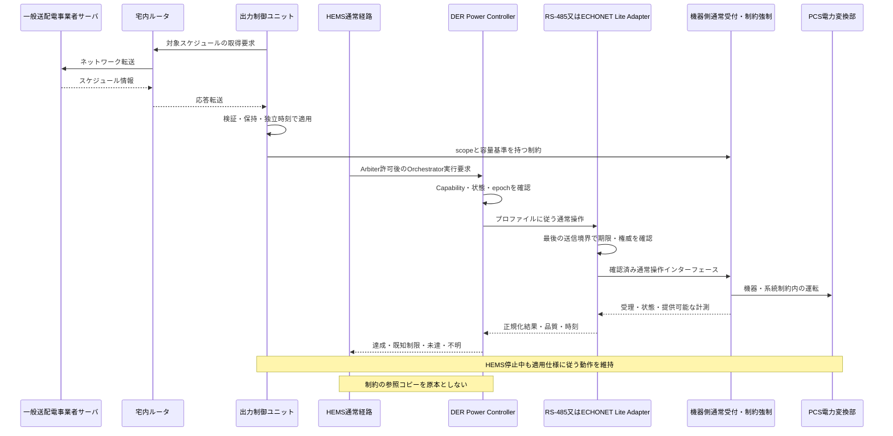
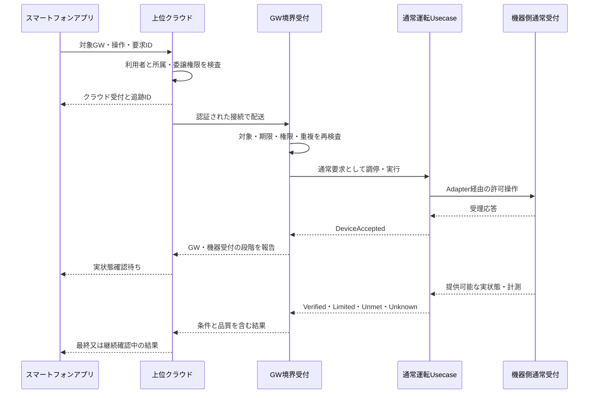
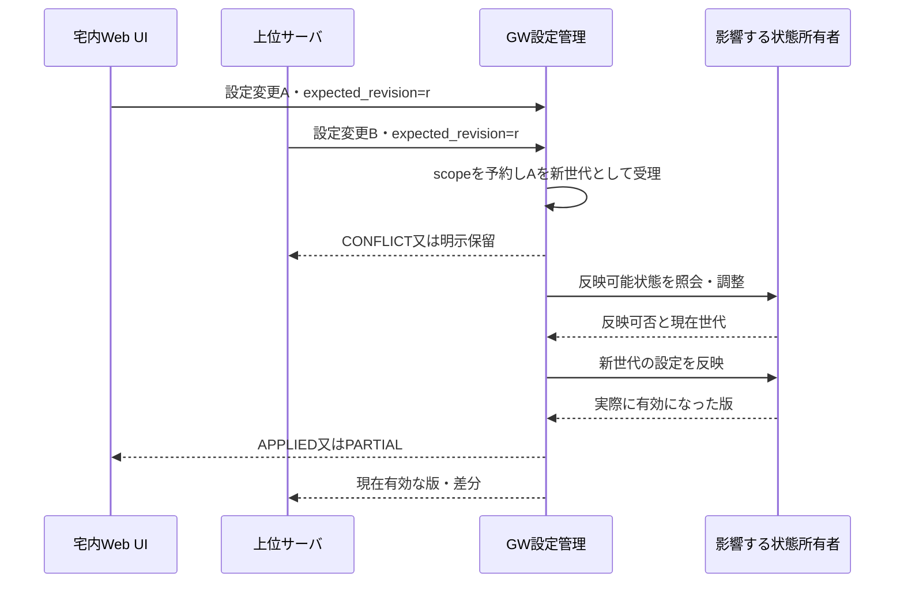
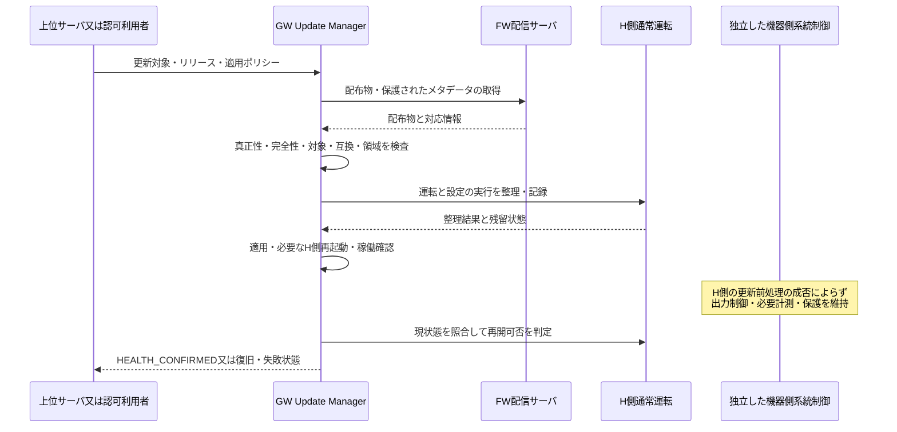

# I-06 システムユースケース・横断振る舞い

[全体MOCへ](../../00_MOC.md#part-i)

**本章の対象：** 正常・代替・異常・同時事象、上位から実機までのエンドツーエンド動作。

**記載区分：** 既存R7の有効な記述とR6補完項を再配置。章構成・読み分けの案以外に、新しい実装・権限・数値・適合を確定していない。旧版に由来する具体値や規格参照は当時の確認範囲を引き継ぐ。

## I-06.1 原典UCの継承

**移行元：** [R7旧6.1節](../../sources/r7_snapshot/chapters/06_Usecases.md)。

UC-01〜07の目的・責務・経路を維持する。以下はシステム仕様形式への展開であり、特定実機で成立済みという記録ではない。機器設定順序、完了閾値、許容時間はプロファイルを参照する。

| ID | 起点・前提 | 正常な振る舞い | 代替・異常・終了条件 |
|---|---|---|---|
| UC-01 | クラウドから家庭全体のEnergyGoal。対象時間・権限・Capabilityが有効 | 受付→EMS計画案→Arbiter資源権威→Orchestrator→DPC/FLC→各実機。観測から計画評価し結果を通知 | 全体／部分不許可は再計画。操作は物理的に原子的でない。部分達成と残差を報告 |
| UC-02 | 特定DERへの直接的な通常要求 | 受付→Arbiter→Orchestrator→DPC→Adapter→通常受付。DPCが状態・実測を照合 | 最適化を省略しても調停は省略しない。受理と達成を分離。Unsupported／Unknownを明示 |
| UC-03 | 時刻・計測・予測更新による自律HEMS | EMSが目標・計画案を作りUC-01と同じ通常権威経路で実行 | 内部トリガーを無条件の最高優先にしない。観測欠損時は適用戦略を縮退 |
| UC-04 | 電力会社のスケジュール制約と通常要求が共存 | OCUが独立して取得・保存・適用。機器側が通常要求と制約を整合し運転 | HEMSの許可・応答を待たない。制限理由が取得できないときは推測しない |
| UC-05 | 機器制限・故障・本体操作で計画から逸脱 | Adapter観測→DPCの不一致評価→Orchestratorの部分状態→EMS再計画→Arbiter再認可 | 過去値への無条件復帰・無限設定綱引きをしない。理由不明はUNKNOWN |
| UC-06 | HEMSのOTA・再起動 | 可能な範囲で通常実行を整理し更新。G側は独立動作。復帰後状態照合し再調停 | 正常終了前処理なしのクラッシュも評価。旧ログをコマンド列として再生しない |
| UC-07 | 電気的異常による保護 | 独立計測→機器側保護→停止／必要な解列。公開状態をHEMSへ | HEMSの権威・承認を待たない。復帰条件を通常APIで解除しない |

## I-06.2 UC-04：通常操作と出力制御の同時実行

**移行元：** [R7旧6.2節](../../sources/r7_snapshot/chapters/06_Usecases.md)。

図のSはEL接続PCS内の取得機能又はRS-485用GW G側に対応する。詳細な物理・ネットワーク経路は[旧21章の再配置先](../../appendices/Chapter_Migration_Map.md#old-ch-21)の二つの図を適用する。RS-485とECHONET Liteの双方について、通常操作の共通意味論を検証する。ただし操作能力・待ち時間・機器内の確認方法まで同一とはしない。制御対象が別々の装置に分散する場合は各対応構成へ展開する。

## I-06.3 本書で追加したUC：USER_CONTEXT_DERIVED／SYSTEM_SPEC_PROPOSAL

**移行元：** [R7旧6.3節](../../sources/r7_snapshot/chapters/06_Usecases.md)。

| ID | 追加するシナリオ | 主要な要求 | 検証 |
|---|---|---|---|
| SYS-UC-08 | 既存RS-485 PCSへの通常要求・観測 | 既存プロトコルの意味を保ち、共通ControlRequest／結果へ対応付ける。生電文迂回を禁止 | SYS-T01、SYS-T02 |
| SYS-UC-09 | 同一意味の要求を他社ECHONET Lite機器へ実行 | 実装能力・許可間隔に基づき変換。電力目標と電力上限を取り違えない | SYS-T02、T10〜T12 |
| SYS-UC-10 | 外部HEMSがGWのDevice側公開を操作 | 公開対象と実資源を対応付け、通常受付・調停を通す。標準プロトコル上の応答と非同期結果を区別 | SYS-T03 |
| SYS-UC-11 | RS-485と他社機器の混在計画 | 機器ごとの時間・能力差と部分実行を管理。同じ物理量を二重計上しない | SYS-T04、T09、T13 |
| SYS-UC-12 | 制御中の通常設定変更と障害復旧変更 | 通常変更は可否・保留・反映時点を判断。復旧変更は独立Usecaseとして認可 | SYS-T06 |
| SYS-UC-13 | 同一資源の通信経路切替／装置交換 | 自動切替は必須機能にしない。採用時は旧経路の権威と残留要求を照合してから新経路へ | SYS-T07、T07、T17 |
| SYS-UC-14 | 計測保存・抽出の欠測／容量異常 | 欠測をゼロ化せず、短期制御と長期履歴の対象を区別。保存異常で系統制御を止めない | SYS-T08、T15 |
| SYS-UC-15 | HEMS機能を無効化して既存運転を継続 | 自律EMS停止とGW全停止を分け、既存通常制御と観測の適用範囲を確認 | SYS-T01 |

## I-06.4 ユースケース記述の完成条件

**移行元：** [R7旧6.5節](../../sources/r7_snapshot/chapters/06_Usecases.md)。

トリガー、対象構成、前提、受付条件、権威、順序、出力・状態、異常分岐、タイミング参照、ログ、検証IDを持つ。未確定の待ち時間等はPAR-*へリンクする。UC説明の例示値を合否閾値へ流用しない。

## I-06.5 上位サービス・UIのユースケース

**移行元：** [R7旧6.6節](../../sources/r7_snapshot/chapters/06_Usecases.md)。

既存UCのIDと責務を維持し、新規SYS-UC-16〜SYS-UC-22を[第20章](../III_Interfaces/III-02_Cloud_GW.md#iii-02)に記載する。宅内Web監視、アプリ遠隔操作、同時設定変更、GW内部操作、FW取得・適用、上位不通・復旧、ネットワーク設定変更を対象とする。GW自身の操作とPCSの運転要求を区別する。

同じ意味の通常運転要求はWeb／アプリ／上位サービスの入口で形式変換されても本章の調停・実行を通る。ローカル端末というだけで常に最優先とはしない。認可された利用者と機能・設備scopeからポリシーを決める。

## I-06.6 R3追加ユースケースの所在

**移行元：** [R7旧6.9節](../../sources/r7_snapshot/chapters/06_Usecases.md)。

[第21章](I-05_Configurations.md#i-05)にEL接続PCS自律取得（SYS-UC-23）、GW取得・管理・PCS指示（SYS-UC-24）、施工・保守での方式選択／変更（SYS-UC-25）を追加する。既存UCの通常運転経路は維持する。UC-04等の出力制御ユニットは選択プロファイルの所有者へ配賦し、H側への依存は追加しない。

## I-06.7 ルータを含む取得の往復

**移行元：** [R7旧6.10節](../../sources/r7_snapshot/chapters/06_Usecases.md)。

SYS-UC-23はEL接続PCS→宅内ルータ→サーバと逆向き応答、SYS-UC-24はGW G側→宅内ルータ→サーバと逆向き応答→RS-485指示である。[旧21章の再配置先](../../appendices/Chapter_Migration_Map.md#old-ch-21)にルータを含む両シーケンスを掲載する。サーバからの情報方向をサーバ起点push接続と混同しない。

## I-06.8 機能とUCの双方向対応

**移行元：** [R7旧6.11.1節](../../sources/r7_snapshot/chapters/06_Usecases.md)。

**補完項目ID：** `SLOT-R6-06-01`。**対応観点：** C05, C08, C32（[レビューA1](../../sources/review/R5_Coverage_Review_A1.md)）。

R5の既存原則は保持するが、この項の全対象・具体条件・規範参照は未確定。

**本項に記載する仕様項目：**

- 機能IDとUC ID。
- 入力・トリガー・開始/終了・前後状態。
- 正常/代替/異常/取消しと結果通知。

**本項の完成判定：** 機能→UC→SYS→確認方法の双方向表を完成し、各UCに前提・結果・例外を記載する。

**具体的な不足：** [OQ-R6-06-01](#oq-r6-06-01)。採用値・参照版・対象外理由は回答後に本項又は版指定の規範別冊へ反映する。

## I-06.9 横断条件・同時事象・利用場面

**移行元：** [R7旧6.11.2節](../../sources/r7_snapshot/chapters/06_Usecases.md)。

**補完項目ID：** `SLOT-R6-06-02`。**対応観点：** C02, C08, C09（[レビューA1](../../sources/review/R5_Coverage_Review_A1.md)）。

R5の既存原則は保持するが、この項の全対象・具体条件・規範参照は未確定。

**本項に記載する仕様項目：**

- 更新中の出力制御と設定変更。
- 初回起動・施工と監視。
- 通信断・権威交代・再接続の順序。

**本項の完成判定：** 横断シナリオ表を作成し、担当・順序・観測・タイムアウト・失敗後状態を指定する。

**具体的な不足：** [OQ-R6-06-02](#oq-r6-06-02)。採用値・参照版・対象外理由は回答後に本項又は版指定の規範別冊へ反映する。

## I-06.10 代表ユースケース

**移行元：** [R7旧20.13節](../../sources/r7_snapshot/chapters/20_Northbound_Monitoring_FW.md)。

### SYS-UC-16：宅内Web UIで監視する

ブラウザが直接又はルータ経由でGWへ接続し、ローカル認証後に権限内の状態Viewを取得する。クラウド不通でも、当該ローカルネットワークとGWが稼働する範囲で基本監視を行う。状態不明・古いデータ・接続不能を区別し、過剰な実機読出しを発生させない。

### SYS-UC-17：アプリからリモート操作する

通常運転UsecaseはArbiter→Orchestrator→DPC/FLCをまとめた表記である。上位サーバが停止しても機器側保護は継続し、完了結果の配送不能と機器操作未実行を混同しない。

### SYS-UC-18：クラウドとWeb UIの設定変更が競合する

本図ではAが先に確定する例だが、ローカルが常に優先する規則ではない。決めるのは操作者の権限、競合scope、反映条件及び運用ポリシーであり、到着経路だけで優先度を付与しない。

### SYS-UC-19：GW内部機能を操作する

上位サーバから再探索等の操作を受け、許可リスト・状態・競合を確認してJobを発行する。GW応答喪失時はJob IDで復帰後に照会し、同じ再起動を無条件に繰り返さない。機器運転が必要な部分は通常制御へ委譲し、診断経路から生電文を注入しない。

### SYS-UC-20：FW配信サーバから取得・適用する

配信サーバは画像を送るだけで直接適用しない。署名・対象領域の検査に失敗した画像は、管理者操作でも通常経路から適用できない。

### SYS-UC-21：上位不通・再接続

ローカル監視と利用可能な自律制御を継続し、リモート画面にはオフラインと最終観測を表示する。結果・イベントの保持には上限を設ける。再接続時は世代と現在状態を同期し、期限切れ・旧所有者・競合した設定を破棄又は再承認へ送る。

### SYS-UC-22：通信設定変更後に応答経路を失う

適用前に変更Jobを記録し、確認チャネルと復旧方針を決める。新経路確認が得られない場合は、当該設定で許された復旧手順へ移行する。G側への影響が判明した共有資源の変更を、ローカル画面の便利機能として無条件実行しない。

## Open Questions — 本ノートの完成に必要な確認

以下が本章で回答を管理する質問。関連台帳は参照ビューであり、承認や数値を二重管理しない。

### OQ-R6-06-01 — 機能とUCの双方向対応

**対象項：** [SLOT-R6-06-01](#slot-r6-06-01)。状態：**OPEN**。

**質問：** 採用した全機能に代表UCがあるか。既存RS-485監視、内部操作、設定、FW、各EMS戦略に未記載の正常・異常系列はないか。

**必要資料・完了条件：** 機能→UC→SYS→確認方法の双方向表を完成し、各UCに前提・結果・例外を記載する。

**決定担当：** 未割当（候補：要求・システム設計・テスト設計）。承認者：未定。

**確定時点：** G2 — 該当詳細設計・実装契約の固定前（提案）。回答期限：未定。

**未解決時の制約：** 「機能とUCの双方向対応」を対象構成の確定保証・実装受入根拠として使用しない。

**関連する既存ID：** SYS-TBD-011。

**回答：** 未記入。**決定記録：** 未記入。

### OQ-R6-06-02 — 横断条件・同時事象・利用場面

**対象項：** [SLOT-R6-06-02](#slot-r6-06-02)。状態：**OPEN**。

**質問：** クラウド設定と宅内操作、FW更新と系統スケジュール切替、機器離脱と再計画が同時に発生したとき、どの系列を受入対象にするか。

**必要資料・完了条件：** 横断シナリオ表を作成し、担当・順序・観測・タイムアウト・失敗後状態を指定する。

**決定担当：** 未割当（候補：システム・結合テスト設計）。承認者：未定。

**確定時点：** G3 — 該当する受入／適合性評価の実施前（提案）。回答期限：未定。

**未解決時の制約：** 「横断条件・同時事象・利用場面」を対象構成の確定保証・実装受入根拠として使用しない。

**関連する既存ID：** SYS-TBD-009, SYS-TBD-018, SYS-TBD-032。

**回答：** 未記入。**決定記録：** 未記入。
