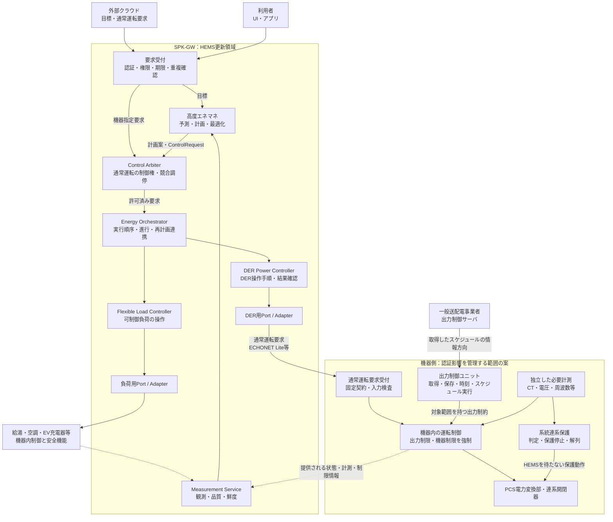

# 推奨最終形 — 二つの指令経路と機器側の最終制御

## 1. 設計の結論

**HEMSの通常運転要求を扱う系と、系統連系保護・電力会社の遠隔出力制御を成立させる系を分離する。両者は、機器側の運転制御で整合させる。**

ユーザー合意は、HEMS側の名称を `DER Power Controller` とすること、およびHEMS／高度エネマネの更新が系統連系保護・遠隔出力制御に影響しない構造を目指すことです。以下の具体配置・インターフェースは推奨案であり、未承認の詳細設計を含みます。

## 2. 全体図

図の実線は指令・情報の依存方向、破線は観測の戻りです。**電力配線でも、OSプロセス配置図でもありません。** 電力会社からの矢印は情報の向きであり、公開PCS仕様のスケジュール通信は機器側から接続を開始する方式です。[S05](12_Sources.md#s05)

`G`は論理的な説明枠です。実際のPCS、出力制御装置、計測器、型式、ソフトウェア版のどこまでが認証登録・試験対象かを個別に確認します。箱に「認証」と書くだけで認証範囲を成立させた扱いにはしません。

## 3. 三つの異なる責務

### HEMS側：通常運転要求の作成と実行

経済性、自家消費、充電期限、ユーザー快適性等の目標を、利用可能な機器操作に展開します。クラウドの要求や利用者の操作と競合した場合は、通常運転の制御権を調停します。

### 遠隔出力制御側：電力会社の制約を実行

電力会社のスケジュール、対象容量・対象設備、時刻、有効期間に従って出力を制限します。HEMSが停止しても、この機能を実行するための資源・計測・機器通信を失わせません。

### 系統連系保護側：電気的異常への保護

機器側の電圧・周波数その他必要な情報から保護動作を成立させます。HEMSやクラウドの確認を待ちません。遠隔出力制御の30分スケジュール処理と、系統連系保護の動作時間を混同しません。

この分離は設計提案です。適用される試験項目・動作条件は、JETと機器メーカーが確認する仕様に従います。[S02](12_Sources.md#s02) [S05](12_Sources.md#s05)

## 4. 推奨する配置の優先順位

**第一候補は、PCSメーカー側の確認済み出力制御構成に系統制御を残し、SPK-GWを通常運転要求のクライアントにすること**です。これにより、HEMS内に電力会社通信・スケジュール管理・保護判定を再実装しません。

独自の出力制御装置が製品要件上必要な場合は、SPK-GW内部でも別CPU・別更新単位のGrid Control Unitを候補にします。この場合は新たな認証構成・装置間通信・障害時動作を評価対象として扱い、単なるHEMS追加機能とは見なしません。

いずれの場合も、外部からの通常運転要求が機器内制約を迂回できないことが前提です。**認証済みPCSに任意のHEMSを接続しただけで、その組合せまで自動的に認証されたとは扱いません。** [S02](12_Sources.md#s02) [S03](12_Sources.md#s03)

## 5. 認証影響分離境界の意味

正式設計名の候補を **Certification Isolation Boundary（認証影響分離境界）** とします。会話上の旧呼称 `Certification Firewall` は同じ設計意図を表しますが、ネットワークファイアウォールやJETの制度名ではありません。

境界を越えるのは、許可された通常運転要求と、公開可能な状態・計測です。HEMSには保護設定、スケジュール原本、発電所ID、出力制御容量の根拠値、認証側時刻、認証側FWを変更する権限を与えません。必要な保守操作は独立した保守経路に分けます。

## 6. この設計が保証しようとするもの

HEMSを更新すると、充放電時刻や目標電力は変わり得ます。一方で、許された入力・負荷・故障条件の集合に対し、機器側の制約強制と保護が維持されることを確認します。

$$
\forall h\in\mathcal{H}_{\mathrm{allowed}},\qquad
\operatorname{GridCompliance}(G,h,\theta)=\mathrm{true}
$$

`G`は認証影響を管理する実装、`h`は契約で許されたHEMS入力・障害系列、`θ`は接続構成と環境条件です。無制限の物理故障や任意のハードウェア変更まで含めた数学的保証を主張する式ではありません。成立条件と試験範囲を [要求・受入試験](10_Requirements_Tests.md) で明示します。

## 7. 読み違えを防ぐ要点

| 読み違え | この設計の扱い |
|---|---|
| DER Power Controllerが全機器を最終制御する | DERの通常運転手順を担当。負荷・観測・系統保護は別責務 |
| 電力会社もArbiterの一利用者 | 電力会社制約の強制経路はArbiterの外。参照コピーのみHEMSへ |
| 全機能をCOREプロセスに置く | 論理責務と配置は別。資源ごとの権威・実行所有者を明確化 |
| HEMSを停止すると全機器も停止する | 通常要求の継続／失効は機器仕様次第。系統制御の独立性とは別問題 |
| HEMSは負荷だけ制御できる | 固定された通常運転インターフェースを通じ、PV・蓄電池・V2H等も制御できる |

関連： [責務](02_Responsibilities.md)／[指令経路](03_Command_Flows.md)／[JET](04_JET_Isolation.md)／[電力制約](07_Power_Constraints.md)
