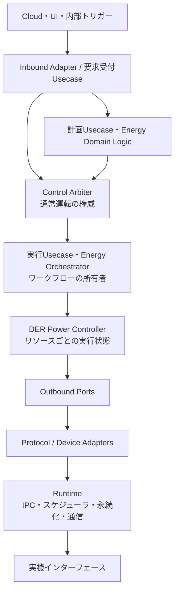

# 責務・レイヤー・状態所有権

## 1. レイヤーをプロセスと混同しない

ここでのレイヤーは依存関係と責務を表します。既存プロジェクトの方針も、Domain・Port・Capabilityの共通化と、Process配置の分離です。[P01](12_Sources.md#p01)

上図は主な呼出・実行経路です。コード依存では、AdapterがPort契約を実装し、DomainはLinux、ECHONET Lite、Blackboardの具体実装を参照しない構造を採用します。

## 2. コンポーネントの契約

| 要素 | 担当すること | 担当しないこと |
|---|---|---|
| Cloud / UI Adapter | 外部認証、要求形式の変換、応答・イベント通知 | 電力会社制約の解除、機器への迂回送信 |
| 要求受付Usecase | 操作権限、期限、重複、構文、対象確認 | 最適な機器配分の計算や最終出力強制 |
| 高度エネマネ | 予測、電力計画、快適性・費用・SoC等の最適化 | 制御権を飛び越えた機器操作 |
| Control Arbiter | 通常運転の採否、優先関係、Lease、対象競合、権威世代 | 電力会社スケジュールの実行、系統保護 |
| Energy Orchestrator | 複数機器の順序・並行度・進行・部分失敗・再計画連携 | 通信プロトコル解析、個別PCSの保護判定 |
| DER Power Controller | 機器能力確認、運転遷移、操作系列、目標と観測の照合 | 家庭全体の目標最適化、系統制約原本の変更 |
| Flexible Load Controller | 充電専用EV・給湯・空調等の運転手順と状態確認 | 発電側の出力制御成立責任 |
| Measurement Service | 計測の取り込み、単位・符号、鮮度・品質・集約 | 認証側計測の唯一の供給元になること |
| Device Adapter | プロトコル変換、機器差分、要求応答の対応付け | Cloud A/Bの権限・優先度を独自に判断すること |
| 機器側運転制御 | 受け付けた要求を機器・系統制約内で実行 | HEMS側の経済計画の代行 |

既存ノートのECHONET Lite Capabilityは通信機能を担い、制御優先度は持たせない方針です。本案もこの分担を維持します。[P01](12_Sources.md#p01)

## 3. DER Power Controllerが実行すること

一つの `requestPower(2 kW)` は、実機に対して一つの電文とは限りません。DPCは機器プロファイルから、対応モード、設定順序、最小更新間隔、現在状態、復帰方法を確認します。

実行は概ね「権威再確認 → 状態確認 → 操作系列作成 → 設定 → 応答確認 → 実状態確認 → 結果報告」です。機器に存在しない機能を、クラス名から推測して実行しません。

`DER Power Controller`という名称であっても、すべての接続機器に連続的なP/Q設定があるとは想定しません。モード指定しかできない機器、メーカー固有の待ち時間がある機器、観測のみの機器をCapabilityの違いとして表現します。

## 4. 実行権威と実行所有者を一意にする

**同一の制御対象・競合範囲について、一つの論理的権威と一つの現在有効な実行系列を持つ**設計を推奨します。

`Control Arbiter`は論理的に一元化しますが、全資源を一つのOSプロセスへ集める必要はありません。例えば資源群ごとのArbiterを配置し、上位の調停契約で重複範囲をなくす構成も可能です。ただし、同一Hybrid PCSをPVオブジェクトと蓄電池オブジェクトに分けて別々に排他制御してはいけません。

Orchestratorは家庭全体の計画進行を、DPCは対象リソースの操作系列を所有します。各AdapterやPollerが独自に「計画失敗時は別の機器を動かす」と判断すると、ワークフロー所有者が分裂します。

## 5. 状態の所有者

| 状態 | 正本の所有者 | 他領域の扱い |
|---|---|---|
| 通常運転の制御権・Lease・epoch | Control Arbiter | 実行前検査用の参照・トークン |
| Energy Planとステップ進行 | Energy Orchestrator | DPCは自分の実行結果を報告 |
| 個別DER実行状態 | DER Power Controller | 上位はイベント／読出で参照 |
| 通信トランザクション | Adapter / Transport | 上位は意味的結果に変換して受領 |
| HEMS用観測値と品質 | Measurement / Device State Service | 計画は鮮度と欠損を考慮 |
| 電力会社スケジュール原本 | 出力制御ユニット | HEMSには読取コピーまたは状態のみ |
| 保護設定と保護状態 | 適用される機器側制御 | HEMSから変更しない |
| 機器の実際の状態 | 実機 | GWキャッシュを実機の正本と誤認しない |

Blackboardを利用する場合も、Portの背後に置きます。通常運転コマンドを複数プロセスが自由に書き込む「共有変数の副作用」で実行しないようにします。

## 6. 二つの調停を区別する

運転要求の競合調停と、設定更新によるプロセス状態遷移の調停は、関係しますが同じ責務ではありません。設定変更が実行中の制御へ影響するときは、対象Capabilityの更新可能状態を確認し、変更世代を記録します。

緊急障害対応で通常の設定更新待ちを破る場合も、許可された復旧Usecaseを明示します。通常設定APIに高いpriorityを付ければ系統設定まで変更できる構造にはしません。

## 7. リトライ・補償の所有者

通信の再送と、操作全体の再実行と、家庭全体の再計画を別々にします。再送を行う層は契約で定め、同じ要求に複数層が無制限再送を重ねないようにします。

部分実行後の補償は「昔の値を無条件に戻す」ことではありません。現在の制御権・系統制約・機器状態で改めて許される操作を発行します。故障した機器への設定リトライと、別機器を使う再計画を混同しません。

関連： [契約](06_Contracts.md)／[機器トポロジー](05_Device_Classes.md)／[移行](11_Migration_Decisions.md)
