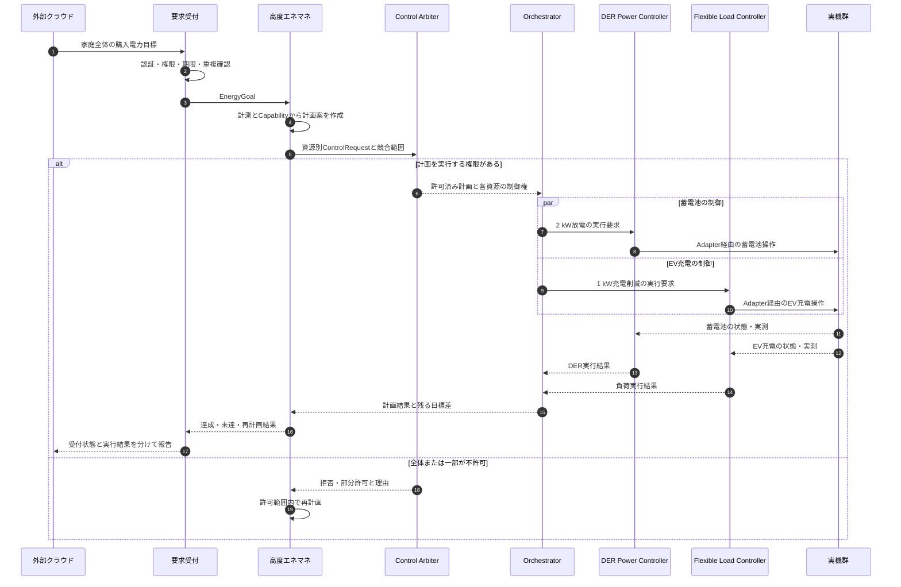
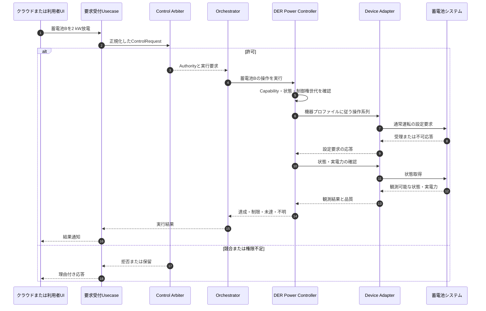
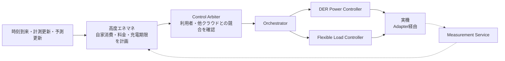
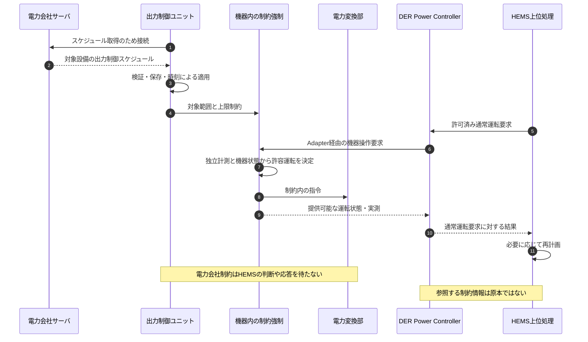
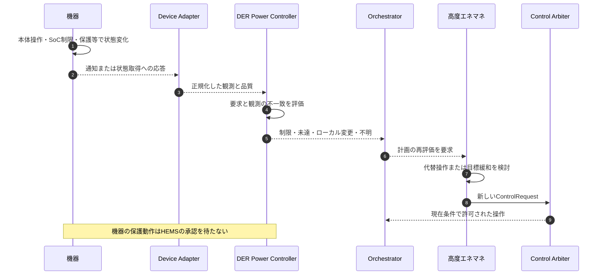
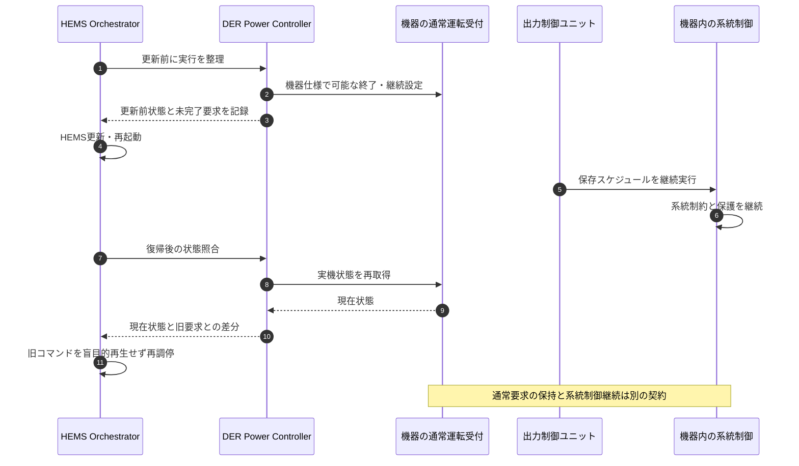
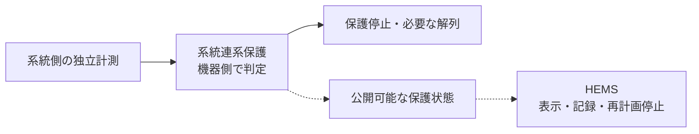

# 指令経路 — クラウド・HEMS・電力会社・各機器のユースケース

## 0. 図の前提

以下は設計案のユースケースです。各機器が対応する操作・時刻制約・通信断時動作は [機器プロファイル](templates/Device_Profile.md) で確定させます。図中の `Adapter経由` は、通常運転の通信経路です。系統制約を迂回する裏口ではありません。

## UC-01：クラウドから家庭全体の目標を受信

例：「17～18時の購入電力を3 kW以下にしたい」。現在の購入電力が6 kWなら、HEMSは蓄電池2 kW放電とEV充電1 kW削減の計画を候補にできます。これは説明用の定常計算であり、機器の可用性や制約を確認して採用します。

複数機器の操作は物理的に原子的ではありません。図の並行実行は、順序・電力過渡が許される場合の例です。必要なら「充電削減を確認してから放電開始」等の順序へ変更します。採用する順序はOrchestratorが所有します。

## UC-02：特定のDERへの直接的な通常運転要求

例：「蓄電池Bを2 kWで放電」。機器選定の最適化は省略できますが、通常運転の権限・競合確認は省略しません。

ECHONET Lite蓄電池AIFでは、Set_Resは受理応答であり、物理動作の完了通知ではありません。[S07](12_Sources.md#s07) 本設計では、受理と達成を別ステータスで管理します。

## UC-03：クラウドを使わない自律的な高度エネマネ

自律HEMSも一つの通常運転要求元です。「内部の処理だから常に最高優先」とはしません。優先関係は制御ポリシーに定義します。

## UC-04：電力会社の出力制御とHEMS要求が同時に存在

公開PCS仕様は、スケジュールによる出力制御ユニットとPCSの構成を定義しています。[S05](12_Sources.md#s05) この図はそれに通常運転経路を併存させる設計案であり、特定メーカー機器の実装図ではありません。

## UC-05：機器側制限・本体操作・故障によって計画が成立しなくなる

機器の出力が小さいだけでは、電力会社の出力制御、熱制限、SoC制限、日射不足、ユーザー操作のどれが原因か確定できません。理由が取得できないときは `reason=UNKNOWN` として報告し、推測を確定原因として記録しません。

利用者の本体操作をHEMSが無条件に上書きし続けないように、ローカル操作検知後の扱いを制御ポリシーと機器プロファイルに定義します。

## UC-06：HEMSのOTA・再起動

正常なOTAでは更新前整理を行えますが、電源断・クラッシュ時には実行できません。したがって、OTA前処理だけを安全根拠にせず、機器側の通信断・要求残留動作を評価します。

## UC-07：系統異常による保護動作

これは上位から届く通常運転要求ではありません。HEMSを通過させず、保護の成立後に状態を参照します。復帰や再連系も適用仕様の管理下とし、HEMSの通常操作APIで強制解除しません。

関連： [契約](06_Contracts.md)／[障害](08_Deployment_Failures_OTA.md)／[試験](10_Requirements_Tests.md)
