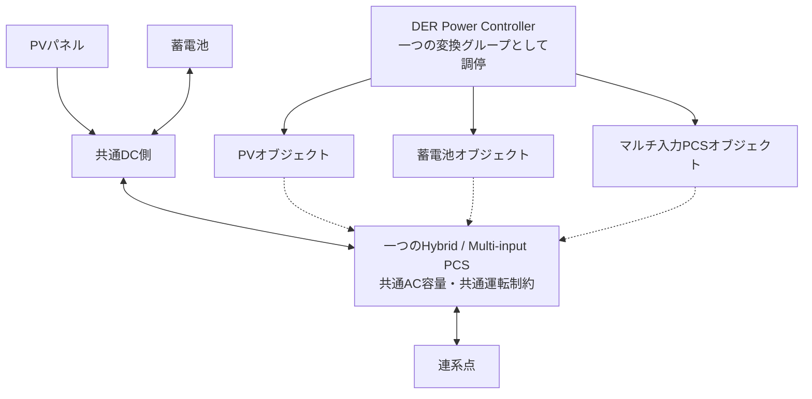

# 機器分類 — ECHONET Lite・制御責務・出力制御対象を分ける

## 1. 四つの独立した分類軸

機器型名やECHONET Liteクラスから、電力会社の制御対象やJETの適用を自動決定しません。次の四軸を別の属性として管理します。

| 軸 | 問うこと |
|---|---|
| 通信上の機器クラス | どのEOJ・プロパティ・AIFを公開しているか |
| 実行できるCapability | どのモード、電力設定、計測、更新頻度を実機が提供するか |
| 系統・契約上の制約 | どの連系点・設備・容量・契約に、どの出力制御が適用されるか |
| 認証上の構成 | どの型式・装置・計測器・ソフトウェア版の組合せを確認しているか |

HEMSが制御できる集合と、電力会社による出力制御対象の集合は部分的に重なります。いずれかが他方を必ず包含すると仮定しません。

## 2. ECHONET Liteで扱う候補

以下のコードは**2バイトのクラス識別子**です。EOJはインスタンスコードを加えた3バイトで、例として蓄電池の第1インスタンスは `0x027D01` です。クラス識別子をそのまま完全なEOJと呼ばないようにします。[S08](12_Sources.md#s08)

| 機器・オブジェクト | クラス | 本プロジェクトでの主担当 | 初期方針・留意点 |
|---|---:|---|---|
| 住宅用太陽光発電 | `0x0279` | DER Power Controller | 発電状態・対応する通常運転操作。制限操作の能力は個別確認 |
| 燃料電池 | `0x027C` | DER Power Controller | 起動停止・追従制約・熱利用を考慮。連続P指令を前提にしない |
| 蓄電池 | `0x027D` | DER Power Controller | 充放電、SoC、対応モード・設定待ち時間を管理 |
| 電気自動車充放電器 | `0x027E` | DER Power Controller | 接続状態、充放電能力、車両条件、逆潮流条件を確認 |
| エンジンコージェネレーション | `0x027F` | DER Power Controllerの拡張候補 | 発電と熱需要の結合、運転遷移制約を確認 |
| 電気自動車充電器 | `0x02A1` | Flexible Load Controller | 充電専用として分類。蓄電・発電操作と混同しない |
| 家庭用小型風力発電 | `0x02A2` | DER Power Controllerの拡張候補 | クラスの存在と接続製品の可用性は別 |
| マルチ入力PCS | `0x02A5` | DER Power Controllerのグループ管理 | PV・蓄電池等と重複して独立PCSとして数えない |
| 周波数制御 | `0x02A7` | 条件付き拡張Capability | 独立したエネルギー源ではない。系統支援・認証影響の確認が必要 |
| 低圧スマート電力量メータ | `0x0288` | Measurement Service | 観測用。通常の発電・充放電Actuatorではない |
| 分電盤メータリング | `0x0287` | Measurement Service | 計測点・合算範囲を管理 |
| DER電力量メータ | `0x028E` | Measurement Service | DER計測の対象・方向・重複を管理 |
| 給湯機・空調・その他可制御負荷 | 機器別 | Flexible Load Controller | 温度、運転時刻、快適性等を含む制約付き負荷 |

クラスの存在・番号はRelease R rev.4で確認しました。右側の責務配分・優先順位は本プロジェクトの設計案です。[S08](12_Sources.md#s08)

「充電専用機器をFlexible Loadと呼ぶ」のは本プロジェクト内の整理であり、他の制度・研究分野で充電器をDERに含める用語法を否定するものではありません。

## 3. 電力会社の出力制御対象としての分類

「電力会社の出力制御」は、ここでは一般送配電事業者による発電・放電出力等の制約を指します。小売電気事業者やアグリゲータの需要調整依頼とは区別します。

| 分類 | 確認する適用条件 | HEMS設計上の扱い |
|---|---|---|
| 太陽光PCS | エリア、接続時期、契約、発電所規模、制御方式 | 主要な確認対象。全住宅PVが同じ適用とはしない |
| 風力設備・風車制御・SCADA | 接続条件、規模、遠隔制御装置構成 | 家庭用対象外でも拡張モデルでは扱えるようにする |
| 蓄電池PCS | 逆潮流、契約容量、発電設備との構成、制御方式 | 充電・放電と系統制約の関係を分離して確認 |
| V2H／V2G | 車両からの逆潮流可否、設備の扱い、認証・接続条件 | 一律適用と決めない。未知ならUNKNOWN |
| 燃料電池・エンジン／CHP | 燃種・契約・非逆潮流／逆潮流・混雑制約等 | PV型スケジュール制御と同一視しない |
| 水力・地熱・バイオマス等 | 給電・接続・混雑処理の方式、制御設備要件 | 家庭HEMS初期範囲の外。別制度・別実装の可能性を保持 |
| 大規模火力・原子力等 | 発電所の給電・運用体系 | 一般的なSPK-GWの接続機器対象外 |
| 充電専用EV・給湯・空調等 | DR・需要制御・契約電力等の別要件 | 発電側遠隔出力制御とは別。ただし負荷変化で逆潮流に影響する |

この表は全国共通の適用判定表ではなく、**確認すべき条件の分類**です。大規模電源の給電順序や全国全契約の適用を本パッケージで網羅的に調査したものではありません。

### 公開資料の具体例：東京電力PG

東京電力PGの現行案内にある「今後新増設される設備のオンライン制御設備設置対象」の表では、需給バランス制約について太陽光・蓄電池は契約容量10 kW以上、風力は対象として示され、水力・地熱・バイオマスは同表の対象外です。系統容量制約側は燃種による区分なしとされています。[S04](12_Sources.md#s04)

これは**特定エリア・表の適用条件に限った例**です。「10 kW未満なら系統連系保護も不要」「水力等は一切出力制御を受けない」「全エリアの既設設備も同じ」とは読み替えません。

## 4. ハイブリッド機器を重複管理しない

実線の上側は電力経路、下側は論理操作の関係です。通信オブジェクトが三つ存在しても、AC電力変換器が三台存在するとは限りません。

`physical_device_id`、`resource_id`、`conversion_group_id`、`connection_point_id`、`eoj`を別に持ちます。能力上限・排他制御・計測の集計は、適切なグループへ結び付けます。

## 5. 機器追加時の登録条件

新しいクラスを検出しても、自動的に書込み可能にしません。少なくとも次の情報を機器プロファイルへ登録します。

| 項目 | 内容 |
|---|---|
| Identity | メーカー・型式・ソフト版・EOJ・接続先識別 |
| Capability | 読取／書込プロパティ、対応モード、P/Q可否、待ち時間 |
| Topology | 物理装置、変換グループ、計測範囲、連系点 |
| GridApplicability | APPLICABLE / NOT_APPLICABLE / UNKNOWN、根拠と確認者 |
| CertificationProfile | 登録構成、対応機器、適用試験版、許可操作範囲 |
| FailureProfile | 通信断時、最後の要求保持、復帰、本体操作時の扱い |

`UNKNOWN`は無制限運転を許可する値ではありません。不明事項の内容に応じ、読取専用や確認済みの限定操作へ機能を落とします。ただし、無差別に停止指令を送ることも避け、機器ごとの安全な運転方針を定めます。

関連： [機器プロファイル](templates/Device_Profile.md)／[電力制約](07_Power_Constraints.md)／[契約](06_Contracts.md)
