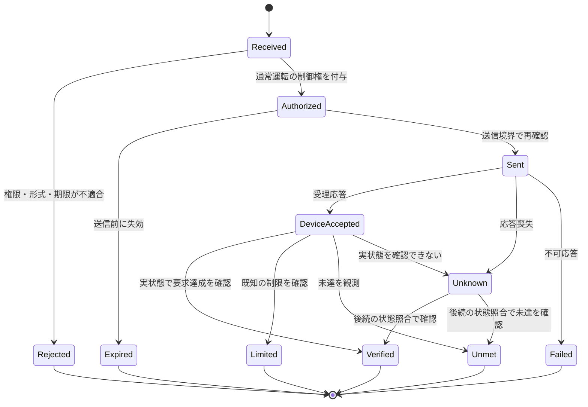

# 通常運転要求・制御権・Capability・結果の契約

## 1. 契約の位置付け

以下はSPK-GW内部のDomain契約案です。**ECHONET Liteの標準電文形式ではありません。** 実機への変換はAdapterと機器プロファイルで行います。

固定するのは、操作の意味、対象、単位・符号、失効条件、権限、結果の意味です。「JSONを使うから固定契約になる」とは考えず、IPC方式やCの型定義に依存しない意味論を先に決めます。

## 2. 通常運転要求の例

```json
{
  "schema": "spkgw.control-request/v1",
  "request_id": "example-request-001",
  "correlation_id": "example-plan-001",
  "source": {"kind": "HEMS", "actor_id": "local-optimizer"},
  "target": {
    "resource_id": "battery-01",
    "conversion_group_id": "hybrid-pcs-01",
    "connection_point_id": "home-pcc"
  },
  "operation": "REQUEST_ACTIVE_POWER",
  "requested_power_w": 2000,
  "power_sign_convention": "positive_to_ac_bus",
  "valid_from": "2026-10-06T17:00:00+09:00",
  "expires_at": "2026-10-06T17:05:00+09:00",
  "idempotency_key": "example-plan-001-step-02",
  "policy_class": "ECONOMIC_OPTIMIZATION"
}
```

数値・日時・IDは説明例です。実要求を作成したものではありません。送信者が数値priorityを指定しただけで採用優先度を決定せず、認証済みactorと操作範囲からHEMS側のポリシーで導きます。

## 3. 制御権と失効

```json
{
  "schema": "spkgw.control-authority/v1",
  "authority_id": "example-authority-013",
  "resource_scope": ["hybrid-pcs-01"],
  "holder": "energy-orchestrator",
  "epoch": 13,
  "expires_at": "2026-10-06T17:05:00+09:00",
  "allowed_operations": ["REQUEST_ACTIVE_POWER"],
  "policy_revision": "example-policy-r1"
}
```

`epoch`は権威交代を識別する世代です。Arbiterが許可した直後に別の要求へ制御権が移る可能性があるため、DPCだけでなく**最後の共通送信境界**でも世代・対象・失効を確認する設計を推奨します。送信待ちキューに残った古い操作を除去します。

この送信境界のチェックはHEMS内部の通常運転権威の検査であり、Adapterに独自の優先順位ポリシーを持たせることとは違います。

ただし、実機がepochを理解しない場合、すでに送信した古い電文や実機の内部キューまで完全に取り消せるわけではありません。実機の状態を再取得し、必要な再調停と安全な補正操作を行います。**内部Leaseだけで分散系の完全なexactly-onceや機器側の自動停止を保証しません。**

## 4. 時刻と期限の二層化

外部の予定時刻・有効期限はタイムゾーンを含む実時刻で受け付けます。実行中の経過時間・タイムアウトは、時計補正の影響を受けない単調時計を用いて管理する設計を推奨します。

G側の出力制御スケジュール用時計は独立管理します。HEMSの時刻修正がG側のスケジュールを早めたり遅らせたりするAPIを作りません。

HEMS再起動で単調時計の基準が変わったときは、旧権威や期限をそのまま復元せず、実時刻の妥当性と実機状態を確認して新しい世代で再調停します。

## 5. Capabilityの例

```json
{
  "schema": "spkgw.der-capability/v1",
  "resource_id": "battery-01",
  "conversion_group_id": "hybrid-pcs-01",
  "operations": ["READ_STATE", "REQUEST_MODE", "REQUEST_ACTIVE_POWER"],
  "power_sign_convention": "positive_to_ac_bus",
  "nominal_power_bounds_w": {"min": -3000, "max": 3000},
  "reactive_power_control": "NOT_SUPPORTED",
  "power_set_min_interval_s": 60,
  "device_request_expiry": "NOT_SUPPORTED",
  "reason_telemetry": "PARTIAL",
  "profile_id": "example-profile-battery-aif130",
  "profile_status": "EXAMPLE_NOT_VALIDATED"
}
```

この例の60秒は、公開蓄電池AIF Ver.1.30の充放電電力設定に関する再設定待ち時間を踏まえた説明値です。同AIFの電力設定プロパティはオプションであり、全機器が対応するとは限りません。全プロパティ・全クラスに60秒を一律適用する意味でもありません。[S07](12_Sources.md#s07)

設計として、以下を別の周期にします。

$$
T_{\mathrm{plan}},\quad T_{\mathrm{measurement}},\quad
T_{\mathrm{command},i,o},\quad T_{\mathrm{grid-control}}
$$

計画計算を1秒周期にしても、機器 `i` の操作 `o` が1秒周期で設定可能になるわけではありません。DPCは待ち時間中の要求を整理し、失効・優先度変更を確認したうえで最新の許可済み要求を送ります。物理応答が追い付かない目標は未達として扱います。

## 6. 制約の参照モデル

```json
{
  "schema": "spkgw.constraint-observation/v1",
  "constraint_id": "example-grid-constraint-01",
  "source": "UTILITY_OUTPUT_CONTROL",
  "scope_kind": "CONNECTION_POINT",
  "scope_id": "home-pcc",
  "quantity": "ACTIVE_POWER_EXPORT",
  "upper_bound_w": 2000,
  "basis_profile_id": "example-interconnection-profile",
  "observed_at": "2026-10-06T12:00:00+09:00",
  "valid_until": "2026-10-06T12:30:00+09:00",
  "quality": "VALID",
  "enforcement_owner": "device-grid-domain",
  "access": "READ_ONLY_MIRROR"
}
```

これはHEMSが計画に使うコピーです。期限切れになったら「制約なし」へ自動変換しません。機器側が保持する正本とHEMS側観測の鮮度を別に管理します。

実際の制約がPCS出力に掛かるのか、連系点逆潮流に掛かるのか、容量の分母が何かは接続・制御方式のプロファイルで決定します。すべてを `limit_percent × 機器定格` と決め打ちしません。

## 7. 実行結果の意味



この図は内部モデルの一例です。`Verified`も「測定点・許容差・確認窓の条件で確認できた」という意味であり、永続的な目標達成や標準プロトコルによる完了通知ではありません。

| 状態 | 意味 |
|---|---|
| Received | GWが要求を受け付けた |
| Authorized | 通常運転の制御権を得た |
| Sent | 実機への通信を送信した |
| DeviceAccepted | 実機の受理を確認した |
| Verified | 定義した観測条件で要求達成を確認した |
| Limited | 取得可能な根拠により制限理由を確認できた |
| Unmet | 目標との差はあるが、必ずしも理由は特定できない |
| Unknown | 実行有無・結果を確定できない |
| Expired | 実行権限・要求が失効した。実機停止の意味ではない |

成功したか不明な操作を、確認なしで繰り返さないようにします。遅延応答によって旧権威を復活させません。通知の重複や順序逆転もcorrelation IDと世代で整理します。

## 8. 境界を越えて禁止する操作

通常HEMSのAPIには `setProtectionParameter`、`disableCurtailment`、`setUtilitySchedule`、`setGridClock`、`setPlantId`、`writeCertifiedFirmware` 等を公開しません。

`requestMode`にも許可リストが必要です。停止・自立・再連系・系統支援等をすべて同じ「モード値の変更」として開放すると、固定APIの形を保ちながら意味上の境界を破ることがあります。

関連： [JET](04_JET_Isolation.md)／[電力制約](07_Power_Constraints.md)／[試験](10_Requirements_Tests.md)
