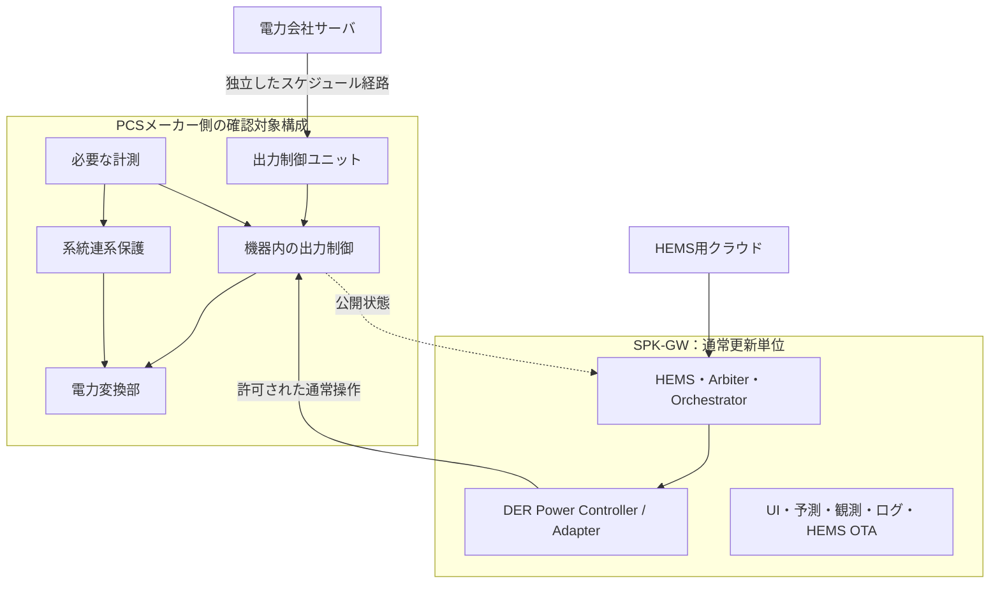
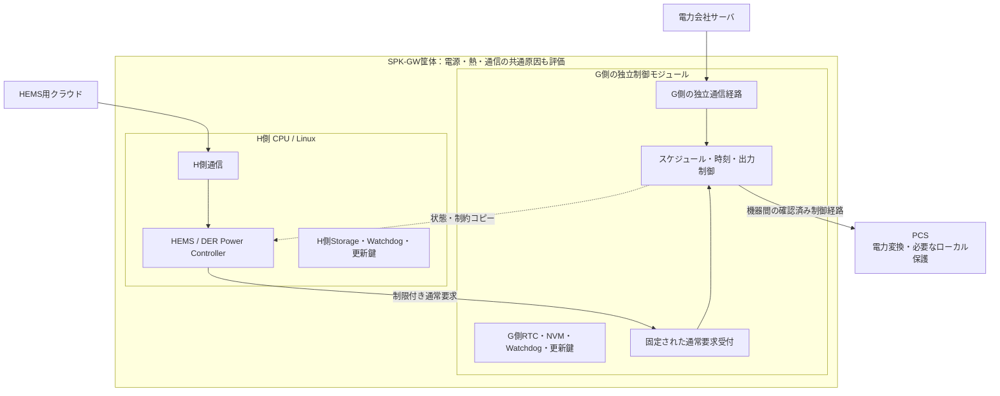

# 配置・障害分離・OTA更新

## 1. 配置案A：系統制御をPCSメーカー側へ残す

**推奨する基準案**です。SPK-GWは通常運転のクライアントとなり、系統制御の必須部分を所有しません。

PCS本体に出力制御ユニットが内蔵される場合と、外付け装置の場合の両方を許容します。図は別箱を必須とするものではありません。

長所は認証影響の説明対象を小さくしやすいことです。代償はメーカー側API・対応組合せ・制御周期に制限されることです。メーカー未対応の機能をHEMSから直接補って、認証の前提を変えないようにします。

## 2. 配置案B：同一筐体内に独立Grid Control Unitを設ける

製品自身が電力会社の出力制御装置を担う必要がある場合の候補です。配置案Aより自社責務と評価範囲が増えます。

G側CPUを設けても、PCS内部の高速な保護・電力変換制御をすべてそのCPUへ移すという意味ではありません。どの装置がどの保護・出力制御を担うかを構成として定義します。

## 3. 同一CPU・同一OSでの分離案

モジュール、プロセス、コンテナ、権限、CPU予約等で論理分離する選択肢はあります。ただし共通カーネル、メモリ圧迫、ドライバ、ネットワークスタック、全体reset等による干渉を追加で説明する必要があります。

本目的では、同一CPU案を禁止とするのではなく、**非影響の立証負担が大きい選択肢**として扱います。物理分離だけでも電源・熱・共有ネットワークの影響が残るため、いずれの案も試験が必要です。

## 4. 障害分類

| 障害 | 維持・変更すべき動作 | 注意 |
|---|---|---|
| HEMSプロセス停止・再起動 | G側のスケジュール・制約・保護は継続 | 通常要求の継続・失効は実機仕様で別途定義 |
| HEMSと機器の通常操作リンク断 | 新しい通常要求を送らず状態を不明扱い | その断線だけをG側内部通信異常とみなさない |
| 電力会社サーバとの通信断 | 取得済みスケジュール等、適用仕様の縮退へ | 100%出力へ無条件復帰しない |
| 出力制御ユニットとPCSの必須通信断 | 適用される出力制御異常時動作 | 公開仕様の内部通信異常時停止条件を確認 |
| G側の計測異常・時刻異常 | G側で異常を検出し規定動作 | HEMSの推定値で勝手に置換しない |
| HEMS用計測の欠落・遅延 | 最適化を縮退し、値の品質を表示 | G側計測を止めない |
| 機器保護作動 | HEMSの制御権に関係なく保護動作 | 通常APIで保護解除を強制しない |
| 共通電源喪失 | 各装置の停電時仕様・保護に従う | HEMS分離だけで系全体の継続運転を保証しない |

公開PCS仕様の「広義PCS内部通信異常時、5分以内に出力停止」は、その定義に該当する通信経路の話です。任意のHEMS通信断や保護装置の高速動作時間へ一般化しません。[S05](12_Sources.md#s05)

## 5. 共通資源に対する確認

独立CPUでも、次の依存が残らないかを確認します。

| 共通資源 | 失敗例 | 対応方針 |
|---|---|---|
| 電源・reset | HEMS高負荷やwatchdogでG側もreset | 電源余裕、reset範囲、brownout、起動順序を評価 |
| 温度 | 最適化の高負荷でG側の動作環境が悪化 | 熱設計・最大負荷試験・負荷制限 |
| NIC・スイッチ・帯域 | HEMS通信集中で出力制御の通信が遅延 | 経路分離、帯域制限、優先制御、障害時仕様 |
| Storage・更新 | HEMS OTAでG側データを破壊 | 別領域・別権限・書込保護・独立復旧 |
| 時計 | HEMSの時刻変更がスケジュールへ波及 | G側時計の独立管理 |
| 保守インターフェース | HEMS資格情報から保護設定変更が可能 | 権限・認証情報・操作経路を分離 |

家庭用ルータが共通でも、HEMSを必須プロキシにしない設計は可能です。ただしルータ停止時にG側がどう動くかは、外部通信断として評価します。「通信経路独立」を物理的な完全無故障と読み替えません。

## 6. OTAの責務分離

HEMSとG側は、更新成果物、書込み権限、署名検証、必要なら署名鍵、ロールバック基準を分けることを推奨します。HEMS用更新パッケージにG側FWや保護設定を含めません。

HEMS更新前の制御整理は、通常運転の残留要求や利用者影響を減らす処理です。G側の継続性をHEMSの正常終了に依存させません。

復帰時は、最新機器状態を取得し、旧要求・旧Lease・未完了ワークフローと照合します。旧ログをそのままコマンド列として再生しません。必要な操作は現在の権威・制約で再認可します。

## 7. HEMS停止時に機器側が要求を保持する問題

機器に有効期限付き要求の機能がなければ、HEMSのLeaseが切れても実機の放電やモードが残る可能性があります。これは「系統制約を守れるか」と「利用者が意図した期限で運転を終えるか」という二つの異なる受入条件です。

対応は、機器側タイムアウト・機器内スケジュール・エネルギー／SoC上限等の確認済み機能を使う、要求できる運転モードを制限する、停止継続性が必要な用途では対応機器を限定する等です。機器側にない機能を内部ソフト契約だけで実現したと扱いません。

## 8. 通信方式・セキュリティとの接続

IPv4、IPv6、Wi-SUN等の配置差と、平文／認証・暗号化を使う接続の違いは、Transport／Security Adapterのコンテキストで管理する方針とします。特定規格・全機器で同じ暗号方式が標準提供されると仮定しません。

認証済み接続と未認証接続の識別を失わせず、機器プロファイルの許可操作へ結びます。データを復号した後に共通処理へ流す場合も、機器識別・認証状態・受信経路・鮮度を保持します。

これはHEMS側のセキュリティ設計案です。系統連系認証だけでサイバーセキュリティやJC-STAR等への適合が完了するとは扱わず、別の要求・評価として管理します。

関連： [JET](04_JET_Isolation.md)／[契約](06_Contracts.md)／[試験](10_Requirements_Tests.md)
