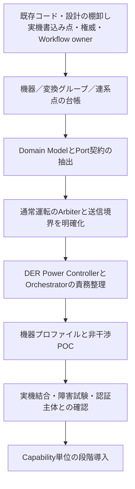

# 設計判断・未確定事項・As-Isからの移行

## 1. 判断の状態を分ける

| ID | 内容 | 状態 |
|---|---|---|
| DEC-001 | HEMS側の旧PCS ControllerをDER Power Controllerへ改名 | ユーザー合意。会話上2026-10-05 |
| DEC-002 | HEMS／高度エネマネの更新と系統連系保護・遠隔出力制御の影響を分離する | ユーザーの設計目標 |
| DEC-003 | 通常運転要求と電力会社の制約を別経路にする | 本パッケージの推奨案 |
| DEC-004 | 基準案はPCSメーカー側の確認済み系統制御を利用する | 本パッケージの推奨案。機器・製品要求で要確認 |
| DEC-005 | 通常運転のArbiterと機器側の最終制約強制を分ける | 本パッケージの推奨案 |
| DEC-006 | Certification Isolation Boundaryを正式設計名候補とする | 命名提案。JETの正式名称ではない |
| DEC-007 | DER／Flexible Load／Measurementの責務を分ける | 本パッケージの推奨案 |
| DEC-008 | 変換グループと連系点を独立してモデル化する | 本パッケージの推奨案 |
| DEC-009 | 物理CPU分離・筐体内外の配置 | 未確定。案A／案B／同一CPUの比較が必要 |
| DEC-010 | 将来のJET変更審査を説明だけで済ませられること | 未確定。保証・承認事項ではない |

## 2. 未確定事項と解消条件

| ID | 未確定事項 | 確認する相手・資料／完了条件 |
|---|---|---|
| TBD-001 | 初期接続するPV・蓄電池・V2H・燃料電池の型式とFW | 製品計画、メーカー資料、実機。機器プロファイルを登録 |
| TBD-002 | 各機器の通常操作が出力制御を迂回しないか | メーカーの設計説明・試験。API／モード／例外経路を確定 |
| TBD-003 | 電力会社の適用方式・容量基準・対象設備範囲 | 対象一般送配電事業者と接続契約。設備／連系点を特定 |
| TBD-004 | JET登録構成・変更申請主体・適用版 | メーカー／認証主体／JET。2026-10改正との関係を確認 |
| TBD-005 | G側をPCS外部へ新設する必要性 | 全体制約を強制できるかを確認し、配置案を選択 |
| TBD-006 | 系統制御用CT・計測範囲・故障時動作 | 配線図、対応計測器、認証構成で確定 |
| TBD-007 | HEMS停止時の通常要求保持・失効 | 機器仕様と実機。用途ごとのSLAと制限を決定 |
| TBD-008 | 各操作の最小更新間隔・実応答 | AIF／メーカー／実機。1秒要求は対象ごとに可否判定 |
| TBD-009 | 複数クラウド・本体UI・純正アプリの競合 | 運用・機器側優先関係・設置条件で確定 |
| TBD-010 | As-Isの実際の権威・ワークフロー所有者・迂回経路 | 既存コード・設計を調査し、マップを作成 |
| TBD-011 | HEMSとG側で共有するCPU・NIC・電源・reset等 | ハードウェア／OS設計と故障評価で確定 |
| TBD-012 | 認証・暗号化対応機器と従来機器の混在方式 | 通信設計・メーカー仕様・セキュリティ要求で確定 |
| TBD-013 | JETへ提出する非影響説明と必要試験の範囲 | 事前相談により文書化。社内判断だけで確定しない |
| TBD-014 | 運用ログ保持期間・個人情報・障害解析アクセス | 製品運用要求で確定 |

## 3. As-Isに関して分かっていることと調査の限界

既存ノートはBlackboard、StateRepositoryPort、ControlRequest、Control Arbiter、Domain Logic、Ports and Adaptersの分離を検討しています。[P01](12_Sources.md#p01) 会話では、Application・Usecase・Orchestration・Arbiter相当の処理がCore以外の各プロセスにも存在する、と報告されています。

**今回、既存製品のソースコードや全プロセス配置を再監査したわけではありません。** 単に「すべてがCoreにある」「中央集約すれば解決する」としてTo-Beへ移行しません。

最初に調べるのは、どのプロセスがどの状態・権威・ワークフローを所有し、どこから実機への書込みが出るかです。既存Saga的な協調処理がある場合も、責任者、相関ID、補償、重複排除を明示して評価します。

## 4. 段階移行

移行中は「旧経路も新経路も同じ機器に書き込める」状態を管理します。移行対象資源ごとに書込み所有者を切り替え、旧Pollerからの設定上書きや二重再送を防ぎます。

## 5. EOL旧製品へのバックポート

既存の移行戦略は、旧ハードウェアを全面改修せず、Domain Logic、Domain Model、Port契約、テスト、Capabilityを共通資産にする方針です。BlackboardやProcess構成そのものを共通化する必要はありません。[P02](12_Sources.md#p02)

新機能を旧系へ戻す場合は、Legacy Blackboard AdapterやDevice Adapterの背後に旧実装を置きます。ただし、旧系が本ノートの分離条件を満たさないなら、新系と同じJET非影響説明・運転保証ができると扱いません。プラットフォーム別に対応範囲を明示します。

## 6. 次の設計レビューで決めること

最初のレビューでは、対象機器と接続条件、配置案A／B、G側の範囲、通常操作API、初期対応Capabilityを確定させます。続いて権威・実行所有者マップ、プロセス配置、機器プロファイル、受入閾値を決定します。

本ノートの要求ID・TBDを、システム仕様書、USDM、構造設計、試験仕様へ追跡可能に展開します。外部仕様には利用者・クラウドが観測できる振る舞いを記し、CPUやPort配置等の内部実装とは分けます。

関連： [要求・試験](10_Requirements_Tests.md)／[責務](02_Responsibilities.md)／[出典](12_Sources.md)
