# SPK-GW_HEMS 推奨最終形 — 統合ノート

本書は分割ノートの内容を連結した参照用統合版です。**設計案・未記入テンプレートであり、実装・実機試験・JET承認の完了を示しません。** 確認基準日は2026年10月6日です。分割版を編集した場合、この統合版にも自動では反映されないため、再生成または明示的な同期が必要です。

HEMS側の名称は **DER Power Controller**。通常運転要求の経路と、電力会社の遠隔出力制御・系統連系保護の成立経路を分離します。

## 目次
- [推奨最終形 — 二つの指令経路と機器側の最終制御](#note-01-architecture)
- [責務・レイヤー・状態所有権](#note-02-responsibilities)
- [指令経路 — クラウド・HEMS・電力会社・各機器のユースケース](#note-03-command-flows)
- [JET認証影響分離 — 変更手続きと非干渉の説明](#note-04-jet-isolation)
- [機器分類 — ECHONET Lite・制御責務・出力制御対象を分ける](#note-05-device-classes)
- [通常運転要求・制御権・Capability・結果の契約](#note-06-contracts)
- [電力制約モデル — PCS単体・変換グループ・連系点](#note-07-power-constraints)
- [配置・障害分離・OTA更新](#note-08-deployment-failures-ota)
- [問題点・できなくなること・対応策](#note-09-risks-alternatives)
- [アーキテクチャ要求・受入試験・証跡](#note-10-requirements-tests)
- [設計判断・未確定事項・As-Isからの移行](#note-11-migration-decisions)
- [テンプレート — HEMSリリースの変更影響評価](#note-release-impact-checklist)
- [テンプレート — DER機器・接続・認証プロファイル](#note-device-profile)
- [出典・確認範囲・過去説明からの補正](#note-12-sources)


---

<a id="note-01-architecture"></a>

# 推奨最終形 — 二つの指令経路と機器側の最終制御

## 1. 設計の結論

**HEMSの通常運転要求を扱う系と、系統連系保護・電力会社の遠隔出力制御を成立させる系を分離する。両者は、機器側の運転制御で整合させる。**

ユーザー合意は、HEMS側の名称を `DER Power Controller` とすること、およびHEMS／高度エネマネの更新が系統連系保護・遠隔出力制御に影響しない構造を目指すことです。以下の具体配置・インターフェースは推奨案であり、未承認の詳細設計を含みます。

## 2. 全体図

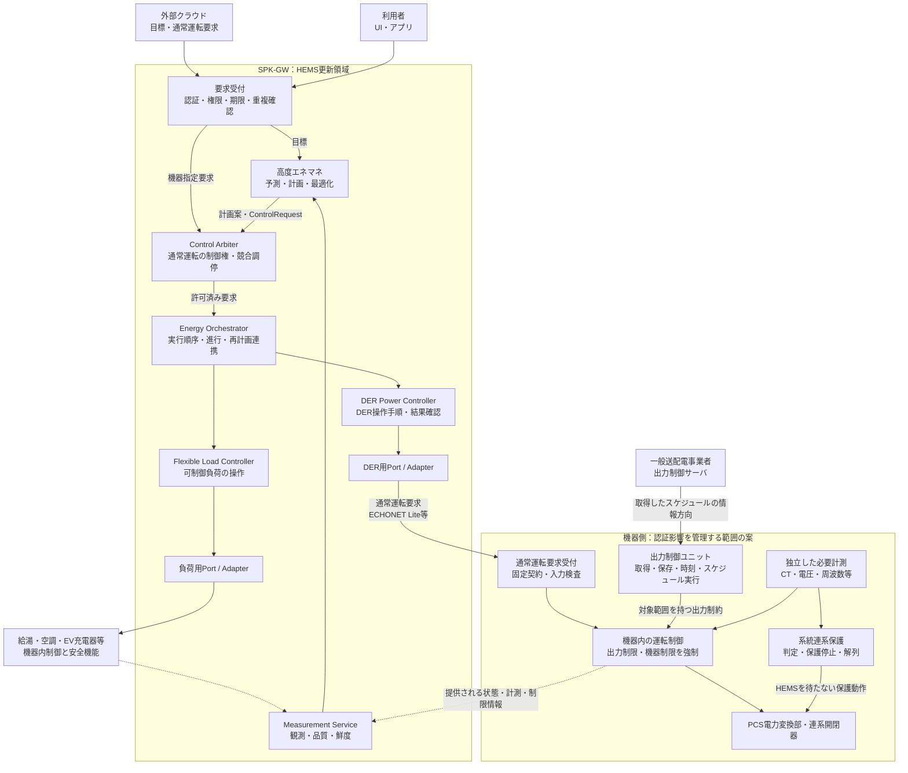

図の実線は指令・情報の依存方向、破線は観測の戻りです。**電力配線でも、OSプロセス配置図でもありません。** 電力会社からの矢印は情報の向きであり、公開PCS仕様のスケジュール通信は機器側から接続を開始する方式です。[S05](#s05)

`G`は論理的な説明枠です。実際のPCS、出力制御装置、計測器、型式、ソフトウェア版のどこまでが認証登録・試験対象かを個別に確認します。箱に「認証」と書くだけで認証範囲を成立させた扱いにはしません。

## 3. 三つの異なる責務

### HEMS側：通常運転要求の作成と実行

経済性、自家消費、充電期限、ユーザー快適性等の目標を、利用可能な機器操作に展開します。クラウドの要求や利用者の操作と競合した場合は、通常運転の制御権を調停します。

### 遠隔出力制御側：電力会社の制約を実行

電力会社のスケジュール、対象容量・対象設備、時刻、有効期間に従って出力を制限します。HEMSが停止しても、この機能を実行するための資源・計測・機器通信を失わせません。

### 系統連系保護側：電気的異常への保護

機器側の電圧・周波数その他必要な情報から保護動作を成立させます。HEMSやクラウドの確認を待ちません。遠隔出力制御の30分スケジュール処理と、系統連系保護の動作時間を混同しません。

この分離は設計提案です。適用される試験項目・動作条件は、JETと機器メーカーが確認する仕様に従います。[S02](#s02) [S05](#s05)

## 4. 推奨する配置の優先順位

**第一候補は、PCSメーカー側の確認済み出力制御構成に系統制御を残し、SPK-GWを通常運転要求のクライアントにすること**です。これにより、HEMS内に電力会社通信・スケジュール管理・保護判定を再実装しません。

独自の出力制御装置が製品要件上必要な場合は、SPK-GW内部でも別CPU・別更新単位のGrid Control Unitを候補にします。この場合は新たな認証構成・装置間通信・障害時動作を評価対象として扱い、単なるHEMS追加機能とは見なしません。

いずれの場合も、外部からの通常運転要求が機器内制約を迂回できないことが前提です。**認証済みPCSに任意のHEMSを接続しただけで、その組合せまで自動的に認証されたとは扱いません。** [S02](#s02) [S03](#s03)

## 5. 認証影響分離境界の意味

正式設計名の候補を **Certification Isolation Boundary（認証影響分離境界）** とします。会話上の旧呼称 `Certification Firewall` は同じ設計意図を表しますが、ネットワークファイアウォールやJETの制度名ではありません。

境界を越えるのは、許可された通常運転要求と、公開可能な状態・計測です。HEMSには保護設定、スケジュール原本、発電所ID、出力制御容量の根拠値、認証側時刻、認証側FWを変更する権限を与えません。必要な保守操作は独立した保守経路に分けます。

## 6. この設計が保証しようとするもの

HEMSを更新すると、充放電時刻や目標電力は変わり得ます。一方で、許された入力・負荷・故障条件の集合に対し、機器側の制約強制と保護が維持されることを確認します。

$$
\forall h\in\mathcal{H}_{\mathrm{allowed}},\qquad
\operatorname{GridCompliance}(G,h,\theta)=\mathrm{true}
$$

`G`は認証影響を管理する実装、`h`は契約で許されたHEMS入力・障害系列、`θ`は接続構成と環境条件です。無制限の物理故障や任意のハードウェア変更まで含めた数学的保証を主張する式ではありません。成立条件と試験範囲を [要求・受入試験](#note-10-requirements-tests) で明示します。

## 7. 読み違えを防ぐ要点

| 読み違え | この設計の扱い |
|---|---|
| DER Power Controllerが全機器を最終制御する | DERの通常運転手順を担当。負荷・観測・系統保護は別責務 |
| 電力会社もArbiterの一利用者 | 電力会社制約の強制経路はArbiterの外。参照コピーのみHEMSへ |
| 全機能をCOREプロセスに置く | 論理責務と配置は別。資源ごとの権威・実行所有者を明確化 |
| HEMSを停止すると全機器も停止する | 通常要求の継続／失効は機器仕様次第。系統制御の独立性とは別問題 |
| HEMSは負荷だけ制御できる | 固定された通常運転インターフェースを通じ、PV・蓄電池・V2H等も制御できる |

関連： [責務](#note-02-responsibilities)／[指令経路](#note-03-command-flows)／[JET](#note-04-jet-isolation)／[電力制約](#note-07-power-constraints)


---

<a id="note-02-responsibilities"></a>

# 責務・レイヤー・状態所有権

## 1. レイヤーをプロセスと混同しない

ここでのレイヤーは依存関係と責務を表します。既存プロジェクトの方針も、Domain・Port・Capabilityの共通化と、Process配置の分離です。[P01](#p01)

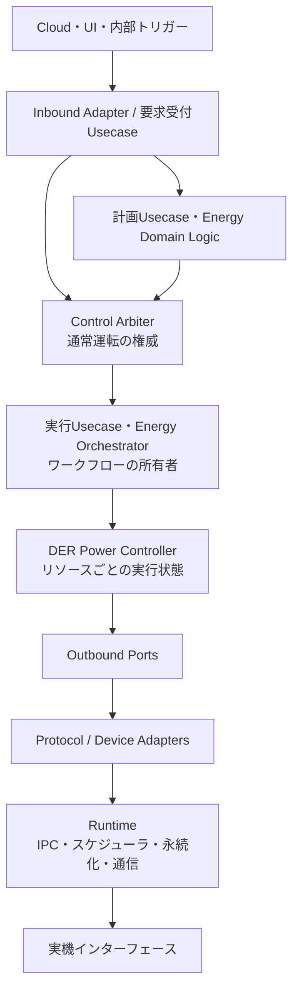

上図は主な呼出・実行経路です。コード依存では、AdapterがPort契約を実装し、DomainはLinux、ECHONET Lite、Blackboardの具体実装を参照しない構造を採用します。

## 2. コンポーネントの契約

| 要素 | 担当すること | 担当しないこと |
|---|---|---|
| Cloud / UI Adapter | 外部認証、要求形式の変換、応答・イベント通知 | 電力会社制約の解除、機器への迂回送信 |
| 要求受付Usecase | 操作権限、期限、重複、構文、対象確認 | 最適な機器配分の計算や最終出力強制 |
| 高度エネマネ | 予測、電力計画、快適性・費用・SoC等の最適化 | 制御権を飛び越えた機器操作 |
| Control Arbiter | 通常運転の採否、優先関係、Lease、対象競合、権威世代 | 電力会社スケジュールの実行、系統保護 |
| Energy Orchestrator | 複数機器の順序・並行度・進行・部分失敗・再計画連携 | 通信プロトコル解析、個別PCSの保護判定 |
| DER Power Controller | 機器能力確認、運転遷移、操作系列、目標と観測の照合 | 家庭全体の目標最適化、系統制約原本の変更 |
| Flexible Load Controller | 充電専用EV・給湯・空調等の運転手順と状態確認 | 発電側の出力制御成立責任 |
| Measurement Service | 計測の取り込み、単位・符号、鮮度・品質・集約 | 認証側計測の唯一の供給元になること |
| Device Adapter | プロトコル変換、機器差分、要求応答の対応付け | Cloud A/Bの権限・優先度を独自に判断すること |
| 機器側運転制御 | 受け付けた要求を機器・系統制約内で実行 | HEMS側の経済計画の代行 |

既存ノートのECHONET Lite Capabilityは通信機能を担い、制御優先度は持たせない方針です。本案もこの分担を維持します。[P01](#p01)

## 3. DER Power Controllerが実行すること

一つの `requestPower(2 kW)` は、実機に対して一つの電文とは限りません。DPCは機器プロファイルから、対応モード、設定順序、最小更新間隔、現在状態、復帰方法を確認します。

実行は概ね「権威再確認 → 状態確認 → 操作系列作成 → 設定 → 応答確認 → 実状態確認 → 結果報告」です。機器に存在しない機能を、クラス名から推測して実行しません。

`DER Power Controller`という名称であっても、すべての接続機器に連続的なP/Q設定があるとは想定しません。モード指定しかできない機器、メーカー固有の待ち時間がある機器、観測のみの機器をCapabilityの違いとして表現します。

## 4. 実行権威と実行所有者を一意にする

**同一の制御対象・競合範囲について、一つの論理的権威と一つの現在有効な実行系列を持つ**設計を推奨します。

`Control Arbiter`は論理的に一元化しますが、全資源を一つのOSプロセスへ集める必要はありません。例えば資源群ごとのArbiterを配置し、上位の調停契約で重複範囲をなくす構成も可能です。ただし、同一Hybrid PCSをPVオブジェクトと蓄電池オブジェクトに分けて別々に排他制御してはいけません。

Orchestratorは家庭全体の計画進行を、DPCは対象リソースの操作系列を所有します。各AdapterやPollerが独自に「計画失敗時は別の機器を動かす」と判断すると、ワークフロー所有者が分裂します。

## 5. 状態の所有者

| 状態 | 正本の所有者 | 他領域の扱い |
|---|---|---|
| 通常運転の制御権・Lease・epoch | Control Arbiter | 実行前検査用の参照・トークン |
| Energy Planとステップ進行 | Energy Orchestrator | DPCは自分の実行結果を報告 |
| 個別DER実行状態 | DER Power Controller | 上位はイベント／読出で参照 |
| 通信トランザクション | Adapter / Transport | 上位は意味的結果に変換して受領 |
| HEMS用観測値と品質 | Measurement / Device State Service | 計画は鮮度と欠損を考慮 |
| 電力会社スケジュール原本 | 出力制御ユニット | HEMSには読取コピーまたは状態のみ |
| 保護設定と保護状態 | 適用される機器側制御 | HEMSから変更しない |
| 機器の実際の状態 | 実機 | GWキャッシュを実機の正本と誤認しない |

Blackboardを利用する場合も、Portの背後に置きます。通常運転コマンドを複数プロセスが自由に書き込む「共有変数の副作用」で実行しないようにします。

## 6. 二つの調停を区別する

運転要求の競合調停と、設定更新によるプロセス状態遷移の調停は、関係しますが同じ責務ではありません。設定変更が実行中の制御へ影響するときは、対象Capabilityの更新可能状態を確認し、変更世代を記録します。

緊急障害対応で通常の設定更新待ちを破る場合も、許可された復旧Usecaseを明示します。通常設定APIに高いpriorityを付ければ系統設定まで変更できる構造にはしません。

## 7. リトライ・補償の所有者

通信の再送と、操作全体の再実行と、家庭全体の再計画を別々にします。再送を行う層は契約で定め、同じ要求に複数層が無制限再送を重ねないようにします。

部分実行後の補償は「昔の値を無条件に戻す」ことではありません。現在の制御権・系統制約・機器状態で改めて許される操作を発行します。故障した機器への設定リトライと、別機器を使う再計画を混同しません。

関連： [契約](#note-06-contracts)／[機器トポロジー](#note-05-device-classes)／[移行](#note-11-migration-decisions)


---

<a id="note-03-command-flows"></a>

# 指令経路 — クラウド・HEMS・電力会社・各機器のユースケース

## 0. 図の前提

以下は設計案のユースケースです。各機器が対応する操作・時刻制約・通信断時動作は [機器プロファイル](#note-device-profile) で確定させます。図中の `Adapter経由` は、通常運転の通信経路です。系統制約を迂回する裏口ではありません。

## UC-01：クラウドから家庭全体の目標を受信

例：「17～18時の購入電力を3 kW以下にしたい」。現在の購入電力が6 kWなら、HEMSは蓄電池2 kW放電とEV充電1 kW削減の計画を候補にできます。これは説明用の定常計算であり、機器の可用性や制約を確認して採用します。

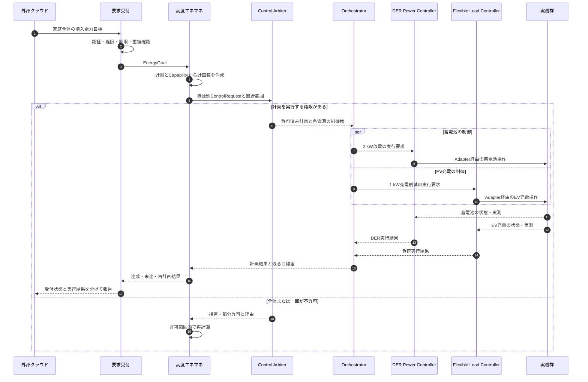

複数機器の操作は物理的に原子的ではありません。図の並行実行は、順序・電力過渡が許される場合の例です。必要なら「充電削減を確認してから放電開始」等の順序へ変更します。採用する順序はOrchestratorが所有します。

## UC-02：特定のDERへの直接的な通常運転要求

例：「蓄電池Bを2 kWで放電」。機器選定の最適化は省略できますが、通常運転の権限・競合確認は省略しません。

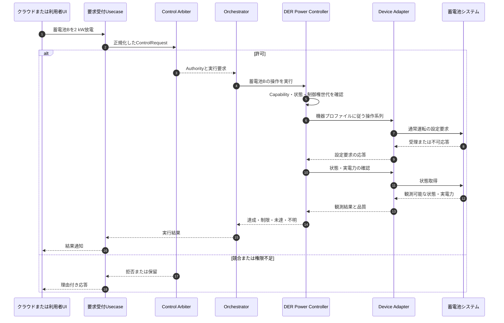

ECHONET Lite蓄電池AIFでは、Set_Resは受理応答であり、物理動作の完了通知ではありません。[S07](#s07) 本設計では、受理と達成を別ステータスで管理します。

## UC-03：クラウドを使わない自律的な高度エネマネ

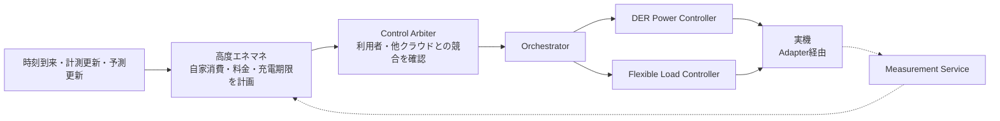

自律HEMSも一つの通常運転要求元です。「内部の処理だから常に最高優先」とはしません。優先関係は制御ポリシーに定義します。

## UC-04：電力会社の出力制御とHEMS要求が同時に存在

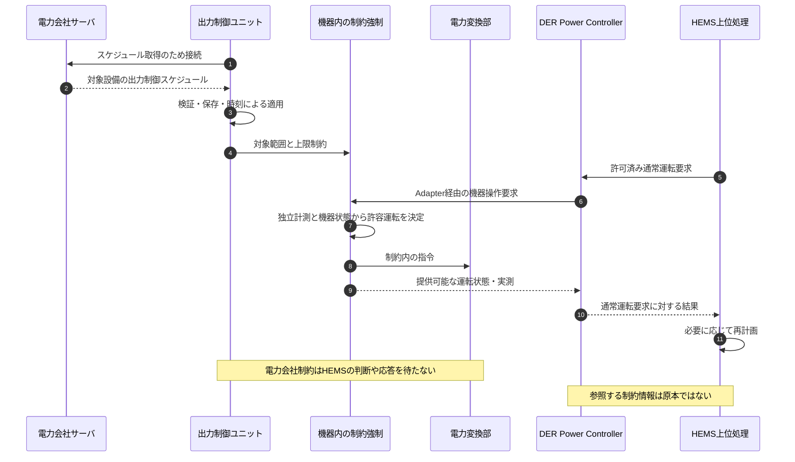

公開PCS仕様は、スケジュールによる出力制御ユニットとPCSの構成を定義しています。[S05](#s05) この図はそれに通常運転経路を併存させる設計案であり、特定メーカー機器の実装図ではありません。

## UC-05：機器側制限・本体操作・故障によって計画が成立しなくなる

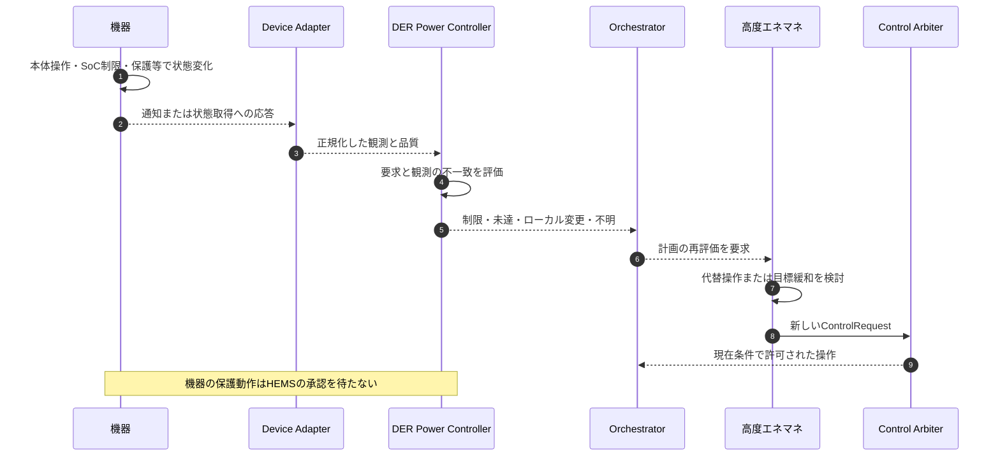

機器の出力が小さいだけでは、電力会社の出力制御、熱制限、SoC制限、日射不足、ユーザー操作のどれが原因か確定できません。理由が取得できないときは `reason=UNKNOWN` として報告し、推測を確定原因として記録しません。

利用者の本体操作をHEMSが無条件に上書きし続けないように、ローカル操作検知後の扱いを制御ポリシーと機器プロファイルに定義します。

## UC-06：HEMSのOTA・再起動

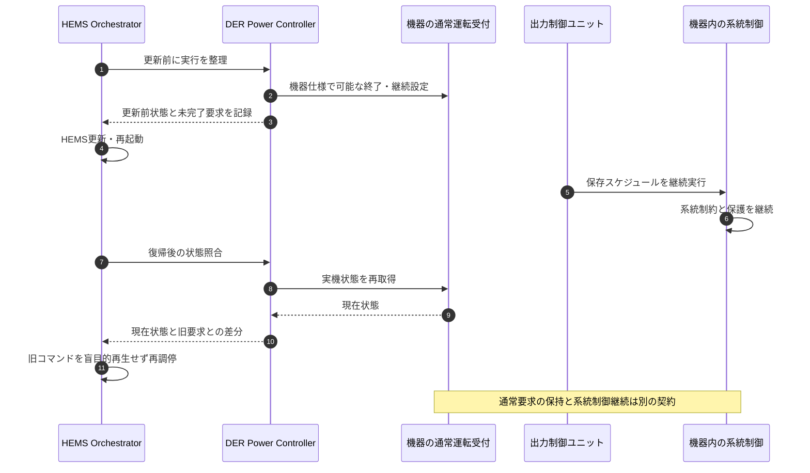

正常なOTAでは更新前整理を行えますが、電源断・クラッシュ時には実行できません。したがって、OTA前処理だけを安全根拠にせず、機器側の通信断・要求残留動作を評価します。

## UC-07：系統異常による保護動作

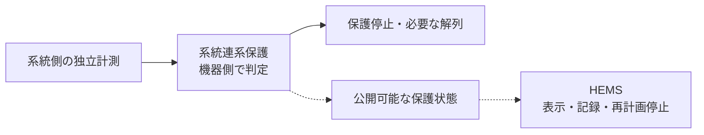

これは上位から届く通常運転要求ではありません。HEMSを通過させず、保護の成立後に状態を参照します。復帰や再連系も適用仕様の管理下とし、HEMSの通常操作APIで強制解除しません。

関連： [契約](#note-06-contracts)／[障害](#note-08-deployment-failures-ota)／[試験](#note-10-requirements-tests)


---

<a id="note-04-jet-isolation"></a>

# JET認証影響分離 — 変更手続きと非干渉の説明

## 1. 目標の正確な表現

目指すのは「HEMS更新に関して系統連系保護・遠隔出力制御への非影響を説明でき、JETが必要とする変更手続きの中で、追加試験の削減を判断できる状態」です。

**将来の変更すべてを説明だけで必ず完了できる、という保証ではありません。** JET公開手引き第4節は、登録内容やソフトウェア管理番号等の変更を事前相談し、必要な届出・確認試験を判断する手順を示しています。[S03](#s03)

## 2. 「JET認証」と呼ぶ範囲を固定する

本ノートの中心は **系統連系保護装置等認証** と、その遠隔出力制御に関係する評価です。ECHONET Lite規格適合・AIF、電気製品の遠隔操作安全、サイバーセキュリティに関する別の評価をまとめて「JET取得済み」で済ませません。[S02](#s02) [S06](#s06)

認証構成台帳には、少なくとも申請主体、登録番号、狭義PCS、出力制御装置、必要計測器、機器間接続、ソフトウェア識別、対応する通常運転インターフェースを関連付けることを推奨します。これは本プロジェクトの構成管理案であり、正式な申請項目はJETと確認します。

## 3. 2026年10月の確認事項

JETは2026年10月1日、遠隔出力制御試験 **JETGR0004-1-2.2** 等の改正を公表しました。通知は蓄電池等を含む発電システムへの適用範囲拡大と測定方法の改正を含みます。[S01](#s01)

本パッケージでは通知のみを確認しています。試験方法本文、対象製品への適用日、経過措置、既存認証との関係は要確認です。以前の会話の版番号を現行版として固定せず、実際の申請・変更相談で適用版を決定します。

## 4. 認証影響分離の設計条件

| 分離する対象 | 推奨する構造 | 説明する根拠 |
|---|---|---|
| 制御経路 | 電力会社スケジュールと保護がHEMSを通らない | 指令依存図、障害時シーケンス |
| 通常運転入力 | 機器側で範囲・モード・頻度・権限等を制限 | API契約、入力妥当性試験 |
| 計測 | 系統制御の必須計測をHEMSに依存させない | 計測配線・鮮度管理・故障時動作 |
| 実行資源 | 別装置または別CPU等で干渉を抑制 | CPU・メモリ・通信・電源等の負荷評価 |
| 時計・永続状態 | 制御スケジュール、時刻、設定原本を独立管理 | 保存・復旧・時刻異常試験 |
| 更新権限 | HEMS更新がG側FW・設定へ書き込めない | 署名鍵・権限・更新経路・イメージ差分 |
| 再起動 | HEMSのwatchdogがG側をリセットしない | リセット配線、復帰試験 |
| 保守 | 通常制御とは別の認可経路 | 操作権限表、監査ログ、手順 |

**これらは非影響を説明しやすくするための設計提案です。JETがこの表の全項目を公開手引きで一律必須としている、とは主張しません。**

以前の説明ではCPU物理分離等を2025年版手引きの明示要求として扱いましたが、今回確認した同手引き第4節は変更手続きの一般規定です。本ノートは物理分離・非干渉試験を、規定の引用ではなく設計側の提案として整理し直しています。[S03](#s03)

## 5. 変更区分の考え方

| 変更例 | 本設計での初期分類 | 必要な扱い |
|---|---|---|
| HEMS画面の説明文のみ | 非影響候補 | ビルド・依存部品・更新範囲の差分を確認 |
| 料金最適化アルゴリズム | 非影響候補 | 出力する要求が既存契約・頻度・対象範囲内かを評価 |
| DERの操作系列・再送方式 | 境界影響の可能性あり | 入力頻度・モード遷移・残留要求・復帰を再評価 |
| ECHONET Lite Adapterの更新 | 境界影響の可能性あり | 電文・待ち時間・機器互換性・故障負荷を確認 |
| 新しい蓄電池・V2Hへの対応 | 構成影響の可能性あり | 対応組合せ・制約範囲・試験プロファイルを確認 |
| 認証側FW・時刻・保護設定変更 | 認証影響側の変更 | 認証主体とJETの変更手続きへ |
| 共通OS・NIC・電源・reset変更 | 共通基盤影響 | HEMS機能変更だけとして処理しない |
| 有効・無効電力制御や系統支援機能の追加 | 新しい操作範囲 | 元の認証・インターフェース範囲を超える可能性を確認 |

「非影響候補」は無審査で配布してよいという意味ではありません。申請主体、既存登録内容、変更内容に応じて事前相談・資料提出の扱いを確認します。

## 6. 何をもって非干渉とするか

正常な通常運転要求、最大頻度、破損入力、連続再接続、HEMS停止、OTA、負荷変動等に対し、G側が所定の性能・失敗時動作を維持することを確認します。

比較対象は、同じスケジュールと同じ機器条件での制約適用、保護の独立性、許容応答時間、障害遷移等です。HEMSが別の正常計画を出した結果、実発電・放電量が変わること自体を不具合にはしません。

初回評価から通常運転APIの範囲を明示し、その範囲内の入力を防御的に受け付ける構造にします。新しいAPI、対象機器、制約範囲、頻度条件を追加したときは、その前提を再評価します。

## 7. 証跡パッケージの推奨内容

更新前後の構成台帳、変更差分、契約互換性、認証影響側バイナリ・設定の不変確認、非干渉試験結果、既知制約、ロールバック手順、JET／メーカーとの判断記録を一つのリリースIDで結びます。

ハッシュが同じことはバイナリ不変の証拠になりますが、共有資源負荷、周囲温度、ネットワーク構成等が不変である証明にはなりません。構造・条件・試験結果を併せて説明します。

テンプレート： [Release_Impact_Checklist.md](#note-release-impact-checklist)

## 8. HEMSを認証範囲外に置く場合も残る確認

別筐体の市販HEMSとして扱える場合でも、接続先PCSの通常操作ポートが出力制御を迂回しないか、許容される機器構成か、同一資源を別クラウドが同時操作しないかを確認します。

また、機器メーカーが認証申請主体である場合は、SPK-GW開発者だけで変更要否を決めず、メーカーの構成・変更管理に接続します。認証の境界と、実際の制御責任の境界を一致させるための作業です。

関連： [配置・OTA](#note-08-deployment-failures-ota)／[問題点](#note-09-risks-alternatives)／[試験](#note-10-requirements-tests)


---

<a id="note-05-device-classes"></a>

# 機器分類 — ECHONET Lite・制御責務・出力制御対象を分ける

## 1. 四つの独立した分類軸

機器型名やECHONET Liteクラスから、電力会社の制御対象やJETの適用を自動決定しません。次の四軸を別の属性として管理します。

| 軸 | 問うこと |
|---|---|
| 通信上の機器クラス | どのEOJ・プロパティ・AIFを公開しているか |
| 実行できるCapability | どのモード、電力設定、計測、更新頻度を実機が提供するか |
| 系統・契約上の制約 | どの連系点・設備・容量・契約に、どの出力制御が適用されるか |
| 認証上の構成 | どの型式・装置・計測器・ソフトウェア版の組合せを確認しているか |

HEMSが制御できる集合と、電力会社による出力制御対象の集合は部分的に重なります。いずれかが他方を必ず包含すると仮定しません。

## 2. ECHONET Liteで扱う候補

以下のコードは**2バイトのクラス識別子**です。EOJはインスタンスコードを加えた3バイトで、例として蓄電池の第1インスタンスは `0x027D01` です。クラス識別子をそのまま完全なEOJと呼ばないようにします。[S08](#s08)

| 機器・オブジェクト | クラス | 本プロジェクトでの主担当 | 初期方針・留意点 |
|---|---:|---|---|
| 住宅用太陽光発電 | `0x0279` | DER Power Controller | 発電状態・対応する通常運転操作。制限操作の能力は個別確認 |
| 燃料電池 | `0x027C` | DER Power Controller | 起動停止・追従制約・熱利用を考慮。連続P指令を前提にしない |
| 蓄電池 | `0x027D` | DER Power Controller | 充放電、SoC、対応モード・設定待ち時間を管理 |
| 電気自動車充放電器 | `0x027E` | DER Power Controller | 接続状態、充放電能力、車両条件、逆潮流条件を確認 |
| エンジンコージェネレーション | `0x027F` | DER Power Controllerの拡張候補 | 発電と熱需要の結合、運転遷移制約を確認 |
| 電気自動車充電器 | `0x02A1` | Flexible Load Controller | 充電専用として分類。蓄電・発電操作と混同しない |
| 家庭用小型風力発電 | `0x02A2` | DER Power Controllerの拡張候補 | クラスの存在と接続製品の可用性は別 |
| マルチ入力PCS | `0x02A5` | DER Power Controllerのグループ管理 | PV・蓄電池等と重複して独立PCSとして数えない |
| 周波数制御 | `0x02A7` | 条件付き拡張Capability | 独立したエネルギー源ではない。系統支援・認証影響の確認が必要 |
| 低圧スマート電力量メータ | `0x0288` | Measurement Service | 観測用。通常の発電・充放電Actuatorではない |
| 分電盤メータリング | `0x0287` | Measurement Service | 計測点・合算範囲を管理 |
| DER電力量メータ | `0x028E` | Measurement Service | DER計測の対象・方向・重複を管理 |
| 給湯機・空調・その他可制御負荷 | 機器別 | Flexible Load Controller | 温度、運転時刻、快適性等を含む制約付き負荷 |

クラスの存在・番号はRelease R rev.4で確認しました。右側の責務配分・優先順位は本プロジェクトの設計案です。[S08](#s08)

「充電専用機器をFlexible Loadと呼ぶ」のは本プロジェクト内の整理であり、他の制度・研究分野で充電器をDERに含める用語法を否定するものではありません。

## 3. 電力会社の出力制御対象としての分類

「電力会社の出力制御」は、ここでは一般送配電事業者による発電・放電出力等の制約を指します。小売電気事業者やアグリゲータの需要調整依頼とは区別します。

| 分類 | 確認する適用条件 | HEMS設計上の扱い |
|---|---|---|
| 太陽光PCS | エリア、接続時期、契約、発電所規模、制御方式 | 主要な確認対象。全住宅PVが同じ適用とはしない |
| 風力設備・風車制御・SCADA | 接続条件、規模、遠隔制御装置構成 | 家庭用対象外でも拡張モデルでは扱えるようにする |
| 蓄電池PCS | 逆潮流、契約容量、発電設備との構成、制御方式 | 充電・放電と系統制約の関係を分離して確認 |
| V2H／V2G | 車両からの逆潮流可否、設備の扱い、認証・接続条件 | 一律適用と決めない。未知ならUNKNOWN |
| 燃料電池・エンジン／CHP | 燃種・契約・非逆潮流／逆潮流・混雑制約等 | PV型スケジュール制御と同一視しない |
| 水力・地熱・バイオマス等 | 給電・接続・混雑処理の方式、制御設備要件 | 家庭HEMS初期範囲の外。別制度・別実装の可能性を保持 |
| 大規模火力・原子力等 | 発電所の給電・運用体系 | 一般的なSPK-GWの接続機器対象外 |
| 充電専用EV・給湯・空調等 | DR・需要制御・契約電力等の別要件 | 発電側遠隔出力制御とは別。ただし負荷変化で逆潮流に影響する |

この表は全国共通の適用判定表ではなく、**確認すべき条件の分類**です。大規模電源の給電順序や全国全契約の適用を本パッケージで網羅的に調査したものではありません。

### 公開資料の具体例：東京電力PG

東京電力PGの現行案内にある「今後新増設される設備のオンライン制御設備設置対象」の表では、需給バランス制約について太陽光・蓄電池は契約容量10 kW以上、風力は対象として示され、水力・地熱・バイオマスは同表の対象外です。系統容量制約側は燃種による区分なしとされています。[S04](#s04)

これは**特定エリア・表の適用条件に限った例**です。「10 kW未満なら系統連系保護も不要」「水力等は一切出力制御を受けない」「全エリアの既設設備も同じ」とは読み替えません。

## 4. ハイブリッド機器を重複管理しない

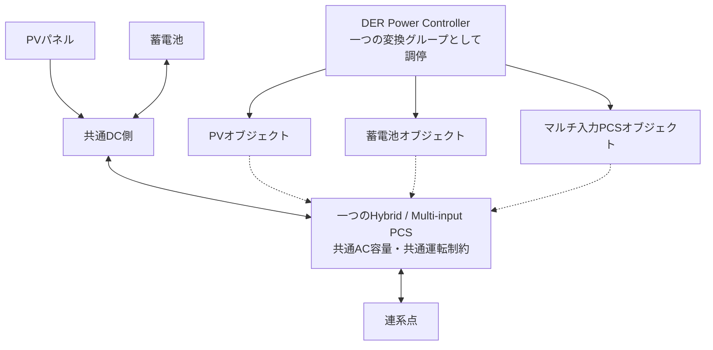

実線の上側は電力経路、下側は論理操作の関係です。通信オブジェクトが三つ存在しても、AC電力変換器が三台存在するとは限りません。

`physical_device_id`、`resource_id`、`conversion_group_id`、`connection_point_id`、`eoj`を別に持ちます。能力上限・排他制御・計測の集計は、適切なグループへ結び付けます。

## 5. 機器追加時の登録条件

新しいクラスを検出しても、自動的に書込み可能にしません。少なくとも次の情報を機器プロファイルへ登録します。

| 項目 | 内容 |
|---|---|
| Identity | メーカー・型式・ソフト版・EOJ・接続先識別 |
| Capability | 読取／書込プロパティ、対応モード、P/Q可否、待ち時間 |
| Topology | 物理装置、変換グループ、計測範囲、連系点 |
| GridApplicability | APPLICABLE / NOT_APPLICABLE / UNKNOWN、根拠と確認者 |
| CertificationProfile | 登録構成、対応機器、適用試験版、許可操作範囲 |
| FailureProfile | 通信断時、最後の要求保持、復帰、本体操作時の扱い |

`UNKNOWN`は無制限運転を許可する値ではありません。不明事項の内容に応じ、読取専用や確認済みの限定操作へ機能を落とします。ただし、無差別に停止指令を送ることも避け、機器ごとの安全な運転方針を定めます。

関連： [機器プロファイル](#note-device-profile)／[電力制約](#note-07-power-constraints)／[契約](#note-06-contracts)


---

<a id="note-06-contracts"></a>

# 通常運転要求・制御権・Capability・結果の契約

## 1. 契約の位置付け

以下はSPK-GW内部のDomain契約案です。**ECHONET Liteの標準電文形式ではありません。** 実機への変換はAdapterと機器プロファイルで行います。

固定するのは、操作の意味、対象、単位・符号、失効条件、権限、結果の意味です。「JSONを使うから固定契約になる」とは考えず、IPC方式やCの型定義に依存しない意味論を先に決めます。

## 2. 通常運転要求の例

```json
{
  "schema": "spkgw.control-request/v1",
  "request_id": "example-request-001",
  "correlation_id": "example-plan-001",
  "source": {"kind": "HEMS", "actor_id": "local-optimizer"},
  "target": {
    "resource_id": "battery-01",
    "conversion_group_id": "hybrid-pcs-01",
    "connection_point_id": "home-pcc"
  },
  "operation": "REQUEST_ACTIVE_POWER",
  "requested_power_w": 2000,
  "power_sign_convention": "positive_to_ac_bus",
  "valid_from": "2026-10-06T17:00:00+09:00",
  "expires_at": "2026-10-06T17:05:00+09:00",
  "idempotency_key": "example-plan-001-step-02",
  "policy_class": "ECONOMIC_OPTIMIZATION"
}
```

数値・日時・IDは説明例です。実要求を作成したものではありません。送信者が数値priorityを指定しただけで採用優先度を決定せず、認証済みactorと操作範囲からHEMS側のポリシーで導きます。

## 3. 制御権と失効

```json
{
  "schema": "spkgw.control-authority/v1",
  "authority_id": "example-authority-013",
  "resource_scope": ["hybrid-pcs-01"],
  "holder": "energy-orchestrator",
  "epoch": 13,
  "expires_at": "2026-10-06T17:05:00+09:00",
  "allowed_operations": ["REQUEST_ACTIVE_POWER"],
  "policy_revision": "example-policy-r1"
}
```

`epoch`は権威交代を識別する世代です。Arbiterが許可した直後に別の要求へ制御権が移る可能性があるため、DPCだけでなく**最後の共通送信境界**でも世代・対象・失効を確認する設計を推奨します。送信待ちキューに残った古い操作を除去します。

この送信境界のチェックはHEMS内部の通常運転権威の検査であり、Adapterに独自の優先順位ポリシーを持たせることとは違います。

ただし、実機がepochを理解しない場合、すでに送信した古い電文や実機の内部キューまで完全に取り消せるわけではありません。実機の状態を再取得し、必要な再調停と安全な補正操作を行います。**内部Leaseだけで分散系の完全なexactly-onceや機器側の自動停止を保証しません。**

## 4. 時刻と期限の二層化

外部の予定時刻・有効期限はタイムゾーンを含む実時刻で受け付けます。実行中の経過時間・タイムアウトは、時計補正の影響を受けない単調時計を用いて管理する設計を推奨します。

G側の出力制御スケジュール用時計は独立管理します。HEMSの時刻修正がG側のスケジュールを早めたり遅らせたりするAPIを作りません。

HEMS再起動で単調時計の基準が変わったときは、旧権威や期限をそのまま復元せず、実時刻の妥当性と実機状態を確認して新しい世代で再調停します。

## 5. Capabilityの例

```json
{
  "schema": "spkgw.der-capability/v1",
  "resource_id": "battery-01",
  "conversion_group_id": "hybrid-pcs-01",
  "operations": ["READ_STATE", "REQUEST_MODE", "REQUEST_ACTIVE_POWER"],
  "power_sign_convention": "positive_to_ac_bus",
  "nominal_power_bounds_w": {"min": -3000, "max": 3000},
  "reactive_power_control": "NOT_SUPPORTED",
  "power_set_min_interval_s": 60,
  "device_request_expiry": "NOT_SUPPORTED",
  "reason_telemetry": "PARTIAL",
  "profile_id": "example-profile-battery-aif130",
  "profile_status": "EXAMPLE_NOT_VALIDATED"
}
```

この例の60秒は、公開蓄電池AIF Ver.1.30の充放電電力設定に関する再設定待ち時間を踏まえた説明値です。同AIFの電力設定プロパティはオプションであり、全機器が対応するとは限りません。全プロパティ・全クラスに60秒を一律適用する意味でもありません。[S07](#s07)

設計として、以下を別の周期にします。

$$
T_{\mathrm{plan}},\quad T_{\mathrm{measurement}},\quad
T_{\mathrm{command},i,o},\quad T_{\mathrm{grid-control}}
$$

計画計算を1秒周期にしても、機器 `i` の操作 `o` が1秒周期で設定可能になるわけではありません。DPCは待ち時間中の要求を整理し、失効・優先度変更を確認したうえで最新の許可済み要求を送ります。物理応答が追い付かない目標は未達として扱います。

## 6. 制約の参照モデル

```json
{
  "schema": "spkgw.constraint-observation/v1",
  "constraint_id": "example-grid-constraint-01",
  "source": "UTILITY_OUTPUT_CONTROL",
  "scope_kind": "CONNECTION_POINT",
  "scope_id": "home-pcc",
  "quantity": "ACTIVE_POWER_EXPORT",
  "upper_bound_w": 2000,
  "basis_profile_id": "example-interconnection-profile",
  "observed_at": "2026-10-06T12:00:00+09:00",
  "valid_until": "2026-10-06T12:30:00+09:00",
  "quality": "VALID",
  "enforcement_owner": "device-grid-domain",
  "access": "READ_ONLY_MIRROR"
}
```

これはHEMSが計画に使うコピーです。期限切れになったら「制約なし」へ自動変換しません。機器側が保持する正本とHEMS側観測の鮮度を別に管理します。

実際の制約がPCS出力に掛かるのか、連系点逆潮流に掛かるのか、容量の分母が何かは接続・制御方式のプロファイルで決定します。すべてを `limit_percent × 機器定格` と決め打ちしません。

## 7. 実行結果の意味

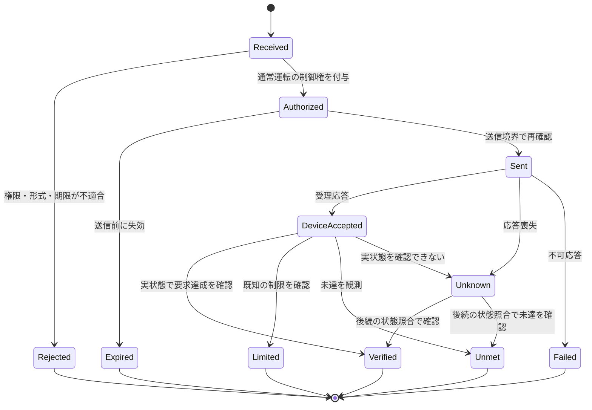

この図は内部モデルの一例です。`Verified`も「測定点・許容差・確認窓の条件で確認できた」という意味であり、永続的な目標達成や標準プロトコルによる完了通知ではありません。

| 状態 | 意味 |
|---|---|
| Received | GWが要求を受け付けた |
| Authorized | 通常運転の制御権を得た |
| Sent | 実機への通信を送信した |
| DeviceAccepted | 実機の受理を確認した |
| Verified | 定義した観測条件で要求達成を確認した |
| Limited | 取得可能な根拠により制限理由を確認できた |
| Unmet | 目標との差はあるが、必ずしも理由は特定できない |
| Unknown | 実行有無・結果を確定できない |
| Expired | 実行権限・要求が失効した。実機停止の意味ではない |

成功したか不明な操作を、確認なしで繰り返さないようにします。遅延応答によって旧権威を復活させません。通知の重複や順序逆転もcorrelation IDと世代で整理します。

## 8. 境界を越えて禁止する操作

通常HEMSのAPIには `setProtectionParameter`、`disableCurtailment`、`setUtilitySchedule`、`setGridClock`、`setPlantId`、`writeCertifiedFirmware` 等を公開しません。

`requestMode`にも許可リストが必要です。停止・自立・再連系・系統支援等をすべて同じ「モード値の変更」として開放すると、固定APIの形を保ちながら意味上の境界を破ることがあります。

関連： [JET](#note-04-jet-isolation)／[電力制約](#note-07-power-constraints)／[試験](#note-10-requirements-tests)


---

<a id="note-07-power-constraints"></a>

# 電力制約モデル — PCS単体・変換グループ・連系点

## 1. 制約を掛ける場所を先に決める

本章の式は設計用のモデルです。適用する契約・PCS仕様・試験条件の代わりにはなりません。

最低限、制約には「量」「単位・符号」「対象範囲」「容量基準」「有効時間」「強制する所有者」を持たせます。同じ2 kWでも、蓄電池の放電上限と住宅全体の逆潮流上限では意味が違います。

| 制約範囲 | 例 |
|---|---|
| RESOURCE | 特定蓄電池の充放電可能電力 |
| CONVERSION_GROUP | Hybrid PCS共通のAC容量や同時動作制限 |
| CONNECTION_POINT | 家庭・発電所の連系点における逆潮流 |
| PROTECTION_DOMAIN | 保護停止・解列が作用する設備範囲 |

## 2. 符号を統一する

交流側の同じ計測基準にそろえ、DERから家庭のACバスへ出る電力を正とします。蓄電池・V2Hは放電が正、充電が負です。負荷消費は正の大きさで表します。

$$
p_{\mathrm{PCC}}(t)
 = \sum_{i\in\mathcal{D}} p_i(t) - p_{\mathrm{load}}(t)
$$

$$
p_{\mathrm{export}} = \max(p_{\mathrm{PCC}},0),\qquad
p_{\mathrm{import}} = \max(-p_{\mathrm{PCC}},0)
$$

損失を明示する場合は同じ基準点で追加します。PCSのDC側発電量とAC側出力を重複加算しません。家庭全体メータと分岐メータを同時に足して二重計上することも避けます。

## 3. 単純なminでよいのは同じ量・同じ対象の上限同士だけ

同じPCSの同じ有効電力に対する上限であれば、複数上限の最小値を取るモデルが使えます。しかし充電を負とする双方向機器、合計逆潮流、無効電力、SoC、運転モードを一つのスカラーのminに押し込めません。

定常計画の例として、

$$
p_i^{\min}(x_i) \le p_i \le p_i^{\max}(x_i),
\qquad p_i^2+q_i^2 \le S_i^2
$$

$$
-\bar p_{\mathrm{import}} \le p_{\mathrm{PCC}}
\le \bar p_{\mathrm{export}}
$$

$$
\mathrm{SoC}_i^{\min}\le \mathrm{SoC}_i \le \mathrm{SoC}_i^{\max}
$$

等を組み合わせます。`x_i`には温度、接続状態、モード、機器側許容値等を含めます。P/Qを設定できない機器については、Qを最適化変数として操作可能だと仮定しません。

これをHEMSが使って計画を良くしても、機器側の制約強制を省略しないのが本構成の要点です。

## 4. 複数機器の例

同じ連系点において、PVが4 kW、蓄電池放電が2 kW、家庭負荷が1 kWなら、損失を無視した逆潮流は5 kWです。

$$
p_{\mathrm{PCC}}=4+2-1=5\ \mathrm{kW}
$$

連系点上限が2 kWなら、この組合せは定常条件で不適合です。各PCSに「それぞれ2 kWまで」を設定するだけでは、合計の保証になりません。

このような**連系点全体を拘束する構成**を採用する場合は、必要な計測・全対象PCSへの強制経路が、HEMSの稼働や通常運転計画に依存せず成立することを確認します。

複数メーカーのPCSが独立し、どの装置も全体を強制できない場合は、対応するサイト制御装置を導入する、適用される方式に従い独立上限へ保守的に分配する、組合せを製品サポート外にする等を検討します。HEMSのソフト上の合計値だけを、系統適合の唯一の根拠にはしません。

## 5. 出力制御中の自家消費と負荷の変化

公開PCS仕様では、余剰買取で自家消費を制限しない考え方が示されています。ただし、実機が0%時に自家消費を継続できるか、発電停止方式かは確認が必要です。[S05](#s05)

例えばHEMSが蓄電池充電や給湯で余剰を吸収しても、EVの離脱や給湯停止で消費は急減します。**その負荷が継続することを出力制御成立の前提にしない**構造にします。

充電が可能であることと、無制限の充電が許可されることも別です。購入側容量、配線容量、機器上限、SoC、温度、利用者の予約等の制約を守ります。

## 6. 過渡応答と許容差

物理機器には測定遅延、通信遅延、応答時間、規定の出力変化率があります。静的な式を示しただけで、負荷が瞬時に切れた時点も含めて厳密に `p_export ≤ limit` が常時成立すると主張しません。

実際の適合は、接続プロファイル `Π` の規定する評価窓、応答、許容差、異常時動作に対して判定します。

$$
\operatorname{Conforms}_{\Pi}
  \bigl(p_{\mathrm{PCC}}(\cdot),\,u_{\mathrm{grid}}(\cdot),\,x(\cdot)\bigr)
$$

通常計画では制御余裕 `m ≥ 0` を設け、

$$
p_{\mathrm{PCC,plan}}\le \bar p_{\mathrm{export}}-m
$$

とする方法がありますが、余裕だけで保証するのではなく、遅延・変動幅・強制能力の評価と組み合わせます。`m`の値は本ノートでは決定しません。

また、遠隔出力制御に定められた出力変化の条件を、すべての蓄電池操作や保護停止の共通ランプ制限として流用しません。[S05](#s05)

## 7. 保護は最適化の制約計算に閉じ込めない

機器側の安全・保護状態は、必要時に通常の出力追従処理より優先して停止・解列を行います。HEMSの最適化問題が解けること、通信が返ること、`min()`の計算が終わることを待つ構造にはしません。

HEMS側には、通常運転要求を作るための利用可能範囲と状態を公開できればよく、保護閾値の書換え能力まで公開する必要はありません。

## 8. 高度エネマネの自由度

HEMSは許された操作範囲で、購入費用、抑制による未利用エネルギー、蓄電池劣化、快適性逸脱等を評価できます。

$$
\min J
= C_{\mathrm{energy}} + \lambda_E E_{\mathrm{unused}}
+ \lambda_D D_{\mathrm{battery}}
+ \lambda_C C_{\mathrm{comfort}}
$$

各重みとモデルは製品方針です。連系点制約等を計画段階で考慮し、実行段階では機器側の確定した制約強制を通します。この役割分担により、予測・最適化の更新と系統制御の評価範囲を分けやすくします。

関連： [全体](#note-01-architecture)／[機器分類](#note-05-device-classes)／[試験](#note-10-requirements-tests)


---

<a id="note-08-deployment-failures-ota"></a>

# 配置・障害分離・OTA更新

## 1. 配置案A：系統制御をPCSメーカー側へ残す

**推奨する基準案**です。SPK-GWは通常運転のクライアントとなり、系統制御の必須部分を所有しません。

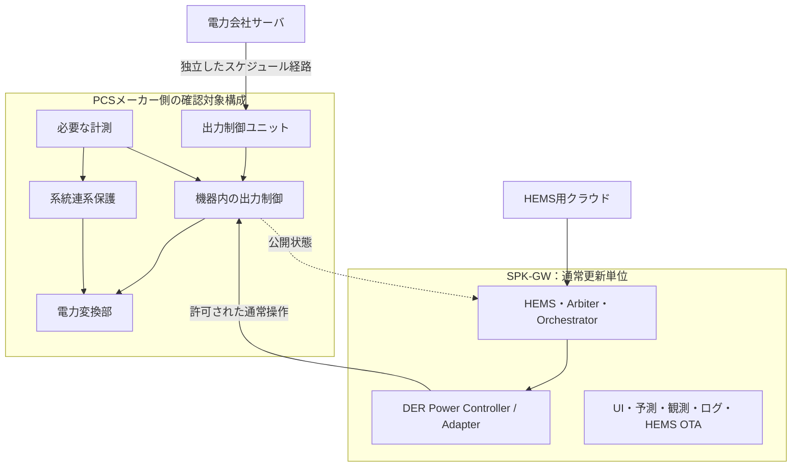

PCS本体に出力制御ユニットが内蔵される場合と、外付け装置の場合の両方を許容します。図は別箱を必須とするものではありません。

長所は認証影響の説明対象を小さくしやすいことです。代償はメーカー側API・対応組合せ・制御周期に制限されることです。メーカー未対応の機能をHEMSから直接補って、認証の前提を変えないようにします。

## 2. 配置案B：同一筐体内に独立Grid Control Unitを設ける

製品自身が電力会社の出力制御装置を担う必要がある場合の候補です。配置案Aより自社責務と評価範囲が増えます。

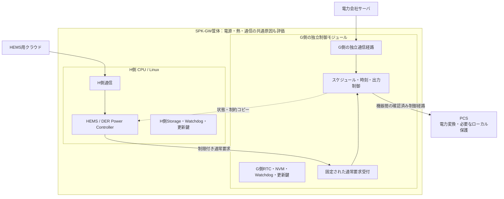

G側CPUを設けても、PCS内部の高速な保護・電力変換制御をすべてそのCPUへ移すという意味ではありません。どの装置がどの保護・出力制御を担うかを構成として定義します。

## 3. 同一CPU・同一OSでの分離案

モジュール、プロセス、コンテナ、権限、CPU予約等で論理分離する選択肢はあります。ただし共通カーネル、メモリ圧迫、ドライバ、ネットワークスタック、全体reset等による干渉を追加で説明する必要があります。

本目的では、同一CPU案を禁止とするのではなく、**非影響の立証負担が大きい選択肢**として扱います。物理分離だけでも電源・熱・共有ネットワークの影響が残るため、いずれの案も試験が必要です。

## 4. 障害分類

| 障害 | 維持・変更すべき動作 | 注意 |
|---|---|---|
| HEMSプロセス停止・再起動 | G側のスケジュール・制約・保護は継続 | 通常要求の継続・失効は実機仕様で別途定義 |
| HEMSと機器の通常操作リンク断 | 新しい通常要求を送らず状態を不明扱い | その断線だけをG側内部通信異常とみなさない |
| 電力会社サーバとの通信断 | 取得済みスケジュール等、適用仕様の縮退へ | 100%出力へ無条件復帰しない |
| 出力制御ユニットとPCSの必須通信断 | 適用される出力制御異常時動作 | 公開仕様の内部通信異常時停止条件を確認 |
| G側の計測異常・時刻異常 | G側で異常を検出し規定動作 | HEMSの推定値で勝手に置換しない |
| HEMS用計測の欠落・遅延 | 最適化を縮退し、値の品質を表示 | G側計測を止めない |
| 機器保護作動 | HEMSの制御権に関係なく保護動作 | 通常APIで保護解除を強制しない |
| 共通電源喪失 | 各装置の停電時仕様・保護に従う | HEMS分離だけで系全体の継続運転を保証しない |

公開PCS仕様の「広義PCS内部通信異常時、5分以内に出力停止」は、その定義に該当する通信経路の話です。任意のHEMS通信断や保護装置の高速動作時間へ一般化しません。[S05](#s05)

## 5. 共通資源に対する確認

独立CPUでも、次の依存が残らないかを確認します。

| 共通資源 | 失敗例 | 対応方針 |
|---|---|---|
| 電源・reset | HEMS高負荷やwatchdogでG側もreset | 電源余裕、reset範囲、brownout、起動順序を評価 |
| 温度 | 最適化の高負荷でG側の動作環境が悪化 | 熱設計・最大負荷試験・負荷制限 |
| NIC・スイッチ・帯域 | HEMS通信集中で出力制御の通信が遅延 | 経路分離、帯域制限、優先制御、障害時仕様 |
| Storage・更新 | HEMS OTAでG側データを破壊 | 別領域・別権限・書込保護・独立復旧 |
| 時計 | HEMSの時刻変更がスケジュールへ波及 | G側時計の独立管理 |
| 保守インターフェース | HEMS資格情報から保護設定変更が可能 | 権限・認証情報・操作経路を分離 |

家庭用ルータが共通でも、HEMSを必須プロキシにしない設計は可能です。ただしルータ停止時にG側がどう動くかは、外部通信断として評価します。「通信経路独立」を物理的な完全無故障と読み替えません。

## 6. OTAの責務分離

HEMSとG側は、更新成果物、書込み権限、署名検証、必要なら署名鍵、ロールバック基準を分けることを推奨します。HEMS用更新パッケージにG側FWや保護設定を含めません。

HEMS更新前の制御整理は、通常運転の残留要求や利用者影響を減らす処理です。G側の継続性をHEMSの正常終了に依存させません。

復帰時は、最新機器状態を取得し、旧要求・旧Lease・未完了ワークフローと照合します。旧ログをそのままコマンド列として再生しません。必要な操作は現在の権威・制約で再認可します。

## 7. HEMS停止時に機器側が要求を保持する問題

機器に有効期限付き要求の機能がなければ、HEMSのLeaseが切れても実機の放電やモードが残る可能性があります。これは「系統制約を守れるか」と「利用者が意図した期限で運転を終えるか」という二つの異なる受入条件です。

対応は、機器側タイムアウト・機器内スケジュール・エネルギー／SoC上限等の確認済み機能を使う、要求できる運転モードを制限する、停止継続性が必要な用途では対応機器を限定する等です。機器側にない機能を内部ソフト契約だけで実現したと扱いません。

## 8. 通信方式・セキュリティとの接続

IPv4、IPv6、Wi-SUN等の配置差と、平文／認証・暗号化を使う接続の違いは、Transport／Security Adapterのコンテキストで管理する方針とします。特定規格・全機器で同じ暗号方式が標準提供されると仮定しません。

認証済み接続と未認証接続の識別を失わせず、機器プロファイルの許可操作へ結びます。データを復号した後に共通処理へ流す場合も、機器識別・認証状態・受信経路・鮮度を保持します。

これはHEMS側のセキュリティ設計案です。系統連系認証だけでサイバーセキュリティやJC-STAR等への適合が完了するとは扱わず、別の要求・評価として管理します。

関連： [JET](#note-04-jet-isolation)／[契約](#note-06-contracts)／[試験](#note-10-requirements-tests)


---

<a id="note-09-risks-alternatives"></a>

# 問題点・できなくなること・対応策

## 1. 機能性と分離のトレードオフ

認証影響分離は、高度エネマネを禁止する設計ではありません。ただし、HEMSが任意の内部パラメータや保護機能まで変更する自由は失います。その代わりに、通常運転APIの内側で最適化を継続しやすくします。

本章は設計リスクの分析であり、特定機器で問題が実測されたという報告ではありません。

## 2. できなくなること・条件付きになること

| 操作・要求 | 扱い | 対応策 |
|---|---|---|
| HEMSから電力会社の出力制御を解除 | 禁止 | その制約内で購入・充電・負荷計画を再最適化 |
| HEMSから保護設定や再連系条件を変更 | 通常APIでは禁止 | 必要な変更は独立保守・認証影響変更手続きへ |
| HEMSの高priorityで機器の上限を突破 | 禁止 | 上限内の要求へ再計画。保護側は通常Arbiterの対象外 |
| 未確認のPCS内部レジスタを直接操作 | 禁止 | 確認済み通常運転APIまたはメーカーとの設計変更 |
| 全ECHONET Lite機器を毎秒Set | 保証しない | 操作ごとの能力・待ち時間で送信を制約。高速用途は機器選定から確認 |
| Hybrid PCSの各EOJへ独立した権威を付与 | 共通資源の競合があれば不可 | 変換グループ単位で排他・配分 |
| HEMSだけで複数PCSの系統制約を保証 | 今回の分離目標では不可 | 対応する機器側／サイト側の強制構成を確保 |
| 新しい系統支援・自立・V2G機能を自由追加 | 既存APIと認証範囲内に限る | 追加機能の接続・保護・試験範囲を別レビュー |
| HEMS停止時に必ず通常運転も即停止 | 実機能力がない場合は保証不可 | 機器内タイムアウト等の採用、用途・機種制限 |
| 受理応答だけでクラウドへ「目標達成」と返す | 不可 | 実測と品質を確認し、受理・達成・不明を分離 |

## 3. 制約を守るために負荷を使うときの落とし穴

EV充電や給湯による余剰吸収はHEMSの有用な機能です。しかし、接続解除、満充電、湯温上限、本体操作、故障で負荷は減ります。

HEMSが「この負荷を動かしているから逆潮流上限を満たす」と計画することはできても、**その負荷の継続を系統制御の唯一の成立条件にしません**。急変を認証影響側の計測・制御で処理できない構成なら、保守的な上限や対応機器の限定が必要です。

## 4. 固定APIでも変更影響は残る

API名とJSON形式が変わらなくても、要求頻度、同時接続数、モード切替の連続、再送、送信量は変わり得ます。その結果、PCSや出力制御装置の処理負荷・遅延・状態遷移に影響する可能性があります。

API契約には構文だけでなく、許可値、操作遷移、更新間隔、最大バースト、接続・再接続回数、エラー時動作、版交渉を含めます。上限値はメーカー仕様と実測・評価に基づいて決定します。

## 5. デバイスが提供しない情報は推定と区別する

出力制限の理由、現在適用中の電力会社上限、電力制御の完了、内部キュー状態等が、すべての機器から得られるとは限りません。

その場合は、観測された実電力と目標との差を報告し、理由を不明とします。推定値を使う場合は推定と明示し、認証側制御の原本として利用しません。確認できない要件についてはSLAを限定します。

## 6. 分散Arbiterと分散Orchestratorのリスク

| 失敗パターン | 防止方針 |
|---|---|
| 同じ装置を二つのプロセスが自分の所有物と認識 | resource／group scopeと権威所有者を一意化 |
| 古い権威のSetがキューから遅れて出る | epoch・期限の再検査、キュー無効化、実機状態照合 |
| 複数プロセスが同じ失敗を補償する | Workflow ownerと補償の単一責任を記録 |
| Adapterが高priorityと判断して迂回実行 | 優先政策はArbiterに限定。送信境界は契約検査のみ |
| Blackboardの値変更が暗黙に機器操作になる | CommandとStateを分離し、明示Usecaseを通す |
| 二つのクラウドが別経路で同じPCSを操作 | 設置・ネットワーク・機器機能を含めた権威設計 |

外部の別HEMSやメーカー純正クラウドが機器を直接操作できる場合、SPK-GW内部の排他だけでは完全なSingle Writerになりません。共存可能な機器側優先関係、排他機能、設置制約、本体変更検出を確認します。

## 7. 物理分離のコスト

別CPU・RTC・Flash・NIC等はBOM、電力、配線、製造検査、保守点数、FW管理を増やします。メーカー側に既存の出力制御構成があるなら、それを使う方が自社設計責務を小さくできる場合があります。

一方、各機器の通常APIが弱く、サイト全体を制限できない構成では、外付けまたは内蔵の独立制御装置が必要になることがあります。認証工数だけを理由に、成立しない分離を選ばないようにします。

## 8. 認証側の更新を永遠に禁止しない

G側にも不具合修正、セキュリティ対応、規格改正、部品変更が発生し得ます。HEMSとは別の変更審査・試験・配布経路を設け、管理された更新を可能にします。

「固定」とは無保守を意味しません。HEMSの機能追加に巻き込まれず、変更の理由と影響を独立して説明できることを意味します。

## 9. 残る重要な未確定事項

対象機器型式、通常操作APIの制約、対応する認証構成、サイト全体の制約範囲、必要な計測器、G側配置、要求残留時の動作、JETの個別判断は未確定です。これらは [11_Migration_Decisions.md](#note-11-migration-decisions) のTBDとして管理します。

関連： [配置案](#note-08-deployment-failures-ota)／[要求・試験](#note-10-requirements-tests)


---

<a id="note-10-requirements-tests"></a>

# アーキテクチャ要求・受入試験・証跡

## 1. この章の状態

以下は**設計要求案と未実施の試験計画**です。JET公式の試験項目一覧ではありません。本章のテストを実施しただけで認証を取得できる、という意味ではありません。

性能閾値・許容差・応答時間は、適用する規格・機器プロファイル・製品要求の確定後に固定します。未確定値をゼロや無制限で代用しません。

## 2. 要求一覧

| ID | 要求案 | 主な確認方法 |
|---|---|---|
| ARCH-001 | HEMS側のDER操作実行責務をDER Power Controllerとして定義する | 責務・依存図レビュー |
| ARCH-002 | 電力会社のスケジュール実行経路をHEMSのArbiter／Orchestratorに依存させない | T01、T02 |
| ARCH-003 | 系統連系保護はHEMSの動作・応答・承認に依存しない | T03 |
| ARCH-004 | 通常運転APIから系統制約・保護設定・G側時刻等を書き換えられない | T04、T05 |
| ARCH-005 | 系統制御に必要な計測・保存・時刻・復旧はHEMS停止時にも成立する | T01、T06 |
| ARCH-006 | 通常運転の制御権を対象資源と変換グループに結び付ける | T07、T08 |
| ARCH-007 | 送信時に要求期限と権威世代を検査し、古い待ち要求を破棄する | T07 |
| ARCH-008 | 複数機器計画のWorkflow ownerと部分失敗時の動作を定める | T09 |
| ARCH-009 | ECHONET Lite Adapterが独自の運転優先度を持たない | コード・契約レビュー、T07 |
| ARCH-010 | 機器能力・操作頻度・対応するモードを機器プロファイルで管理する | T10、T11 |
| ARCH-011 | 受理・物理動作・目標達成・不明を区別して通知する | T12 |
| ARCH-012 | 機器単体・変換グループ・連系点制約を別のscopeで扱う | T08、T13 |
| ARCH-013 | 制約情報の欠損・期限切れを無制限として扱わない | T06、T14 |
| ARCH-014 | 負荷の急変・EV離脱でも、適用する系統条件を満たす構成を採用する | T13 |
| ARCH-015 | HEMSのCPU・通信・メモリ等の負荷でG側の性能を破らない | T15 |
| ARCH-016 | HEMS OTAの署名・権限・イメージからG側を書き換えられない | T04、T16 |
| ARCH-017 | HEMS再起動後に旧要求を盲目的に再送しない | T16、T17 |
| ARCH-018 | 通常要求の機器側保持・失効を仕様として明示する | T17 |
| ARCH-019 | 本体操作・別制御元との共存を定義し、無条件な設定綱引きを防ぐ | T18 |
| ARCH-020 | JET・接続条件・AIF・ソフトウェア版の対応を構成台帳で追跡する | T19 |
| ARCH-021 | HEMS／G側の共通電源・reset・通信・熱の影響を評価する | T15、T16 |
| ARCH-022 | HEMSの変更について、境界内の契約と動作前提を逸脱しないことを確認する | T19、変更影響評価 |
| ARCH-023 | 保護動作と遠隔出力制御の時間条件を別々に定義する | T02、T03、T13 |
| ARCH-024 | ログに要求ID、権威世代、計測品質、時刻、対象scopeを残す | T12、T19 |

## 3. 試験シナリオ案

| ID | 条件・故障注入 | 主な観測・合否の考え方 |
|---|---|---|
| T01 | HEMS停止・プロセスkill・再起動・物理切離し | G側のスケジュール実行、必要計測、保護が適用仕様内で成立する |
| T02 | 電力会社通信断、保存済みスケジュール、有効期限境界 | 適用プロファイルの縮退・更新・失効処理に従う |
| T03 | HEMS高負荷中に系統異常を模擬 | 保護動作の独立性と規定の動作条件を確認。安全設備・専門環境で実施 |
| T04 | HEMS資格情報・OTA経路からG側設定／FWへの書込みを試行 | 認可されない。操作ログを残す |
| T05 | 過大値、負値、未対応モード、破損電文、旧版、最大頻度 | 許可範囲外入力が拒否または定義済み動作となり、制約強制を破らない |
| T06 | HEMS時計異常、計測停止、G側時計／保存異常を個別注入 | 独立性、異常検出、適用されるG側動作を確認 |
| T07 | 権威交代直前の送信待ち、Lease失効、旧応答到来 | 旧要求が新規に送信されない。すでに送信済み分は実機状態で照合する |
| T08 | 同じHybrid PCSの複数EOJへ競合要求 | グループ資源の容量・排他を破らず、二重計上しない |
| T09 | 複数機器計画の一部のみ受理・実行 | 部分状態を保持し、二重補償をせず、現在条件で再計画する |
| T10 | 未対応プロパティ・機器版変更・Capability欠損 | 推測で書込みを開始しない。用途に応じて限定・読取専用等へ |
| T11 | 高頻度の計画変更を入力 | 機器／操作の最小更新間隔を守り、期限切れ要求を間引く |
| T12 | Set受理後に出力未達、応答だけ消失、計測だけ消失 | Accepted／Verified／Unmet／Unknown等を正しく分離する |
| T13 | PV＋蓄電池＋V2H、負荷遮断、EV離脱、変換器制限 | 連系点・機器・グループと過渡評価条件で適合判定する |
| T14 | HEMS参照用制約が古い・不明・取得不能 | G側制約を緩和せず、HEMSが明示した縮退方針で動作する |
| T15 | CPU最大負荷、メモリ圧迫、帯域集中、温度・電源条件 | G側の時間・通信・電力制御・保護性能が範囲内にある |
| T16 | OTA中断、H側watchdog、ロールバック、電源断復帰 | G側の不正変更を防止。共有故障とH側限定故障を区別する |
| T17 | HEMS停止時に実機が最後の通常要求を保持 | 期限・SoC・運転残留の仕様と利用者要求の整合を確認する |
| T18 | 本体操作・メーカークラウドとの同時操作 | 定義した優先関係・共存条件に従い、設定の無限上書きを起こさない |
| T19 | リリース前後の構成・依存・要求・結果を照合 | 変更影響と適用試験版を追跡でき、未確定事項が隠されていない |

「物理切離し」はHEMSが任意の通常運転クライアントである配置を想定します。構成上HEMSが必須の計測・通信・出力制御を担っていると分かった場合は、試験を形式的にPASSにせず、分離要件未達として扱います。

## 4. 検証レベルを分ける

| 段階 | 確認すること | 今回の実施状態 |
|---|---|---|
| 文書QA | リンク、UTF-8、構造、ZIP整合性 | 同梱DOCUMENT_QAを参照 |
| Domain単体／POC | 権威、期限、計画、合算、状態遷移 | 未実施 |
| Protocol／機器シミュレータ | 応答・遅延・欠損・操作待ち時間 | 未実施 |
| 実機結合／HIL | 実電力、過渡、保護、通信断、残留要求 | 未実施 |
| メーカー／JET等の適用評価 | 認証構成と正式な合否条件 | 未実施・要協議 |

POCはIn-memory Transport、FakeClock、疑似計測、FakeDeviceCommandPort等で開始できます。POCでアーキテクチャを確認することと、実際のPCS保護・適合性を実証することは別です。既存To-Beのテスト容易性方針を継承します。[P01](#p01)

## 5. 試験記録の最低限の項目

テストID、要求ID、対象型式とソフト版、接続図、適用プロファイル、設定値、時計基準、故障注入条件、要求系列、計測品質、波形／イベント、合否閾値、結果、評価者を同一run IDに関連付けます。

`PASS`だけではなく、どの範囲で合格かを残します。未実施・対象外・結果不明を区別し、対象外の根拠を記録します。

## 6. リリースの判断境界

通常HEMS更新として扱えるかの確認、製品品質上のリリース可否、認証主体／JETの変更判断は別の承認境界です。内部テスト合格をJETの承認と読み替えず、JET相談済みを製品実機検証完了と読み替えません。

関連： [変更影響テンプレート](#note-release-impact-checklist)／[未確定事項](#note-11-migration-decisions)


---

<a id="note-11-migration-decisions"></a>

# 設計判断・未確定事項・As-Isからの移行

## 1. 判断の状態を分ける

| ID | 内容 | 状態 |
|---|---|---|
| DEC-001 | HEMS側の旧PCS ControllerをDER Power Controllerへ改名 | ユーザー合意。会話上2026-10-05 |
| DEC-002 | HEMS／高度エネマネの更新と系統連系保護・遠隔出力制御の影響を分離する | ユーザーの設計目標 |
| DEC-003 | 通常運転要求と電力会社の制約を別経路にする | 本パッケージの推奨案 |
| DEC-004 | 基準案はPCSメーカー側の確認済み系統制御を利用する | 本パッケージの推奨案。機器・製品要求で要確認 |
| DEC-005 | 通常運転のArbiterと機器側の最終制約強制を分ける | 本パッケージの推奨案 |
| DEC-006 | Certification Isolation Boundaryを正式設計名候補とする | 命名提案。JETの正式名称ではない |
| DEC-007 | DER／Flexible Load／Measurementの責務を分ける | 本パッケージの推奨案 |
| DEC-008 | 変換グループと連系点を独立してモデル化する | 本パッケージの推奨案 |
| DEC-009 | 物理CPU分離・筐体内外の配置 | 未確定。案A／案B／同一CPUの比較が必要 |
| DEC-010 | 将来のJET変更審査を説明だけで済ませられること | 未確定。保証・承認事項ではない |

## 2. 未確定事項と解消条件

| ID | 未確定事項 | 確認する相手・資料／完了条件 |
|---|---|---|
| TBD-001 | 初期接続するPV・蓄電池・V2H・燃料電池の型式とFW | 製品計画、メーカー資料、実機。機器プロファイルを登録 |
| TBD-002 | 各機器の通常操作が出力制御を迂回しないか | メーカーの設計説明・試験。API／モード／例外経路を確定 |
| TBD-003 | 電力会社の適用方式・容量基準・対象設備範囲 | 対象一般送配電事業者と接続契約。設備／連系点を特定 |
| TBD-004 | JET登録構成・変更申請主体・適用版 | メーカー／認証主体／JET。2026-10改正との関係を確認 |
| TBD-005 | G側をPCS外部へ新設する必要性 | 全体制約を強制できるかを確認し、配置案を選択 |
| TBD-006 | 系統制御用CT・計測範囲・故障時動作 | 配線図、対応計測器、認証構成で確定 |
| TBD-007 | HEMS停止時の通常要求保持・失効 | 機器仕様と実機。用途ごとのSLAと制限を決定 |
| TBD-008 | 各操作の最小更新間隔・実応答 | AIF／メーカー／実機。1秒要求は対象ごとに可否判定 |
| TBD-009 | 複数クラウド・本体UI・純正アプリの競合 | 運用・機器側優先関係・設置条件で確定 |
| TBD-010 | As-Isの実際の権威・ワークフロー所有者・迂回経路 | 既存コード・設計を調査し、マップを作成 |
| TBD-011 | HEMSとG側で共有するCPU・NIC・電源・reset等 | ハードウェア／OS設計と故障評価で確定 |
| TBD-012 | 認証・暗号化対応機器と従来機器の混在方式 | 通信設計・メーカー仕様・セキュリティ要求で確定 |
| TBD-013 | JETへ提出する非影響説明と必要試験の範囲 | 事前相談により文書化。社内判断だけで確定しない |
| TBD-014 | 運用ログ保持期間・個人情報・障害解析アクセス | 製品運用要求で確定 |

## 3. As-Isに関して分かっていることと調査の限界

既存ノートはBlackboard、StateRepositoryPort、ControlRequest、Control Arbiter、Domain Logic、Ports and Adaptersの分離を検討しています。[P01](#p01) 会話では、Application・Usecase・Orchestration・Arbiter相当の処理がCore以外の各プロセスにも存在する、と報告されています。

**今回、既存製品のソースコードや全プロセス配置を再監査したわけではありません。** 単に「すべてがCoreにある」「中央集約すれば解決する」としてTo-Beへ移行しません。

最初に調べるのは、どのプロセスがどの状態・権威・ワークフローを所有し、どこから実機への書込みが出るかです。既存Saga的な協調処理がある場合も、責任者、相関ID、補償、重複排除を明示して評価します。

## 4. 段階移行

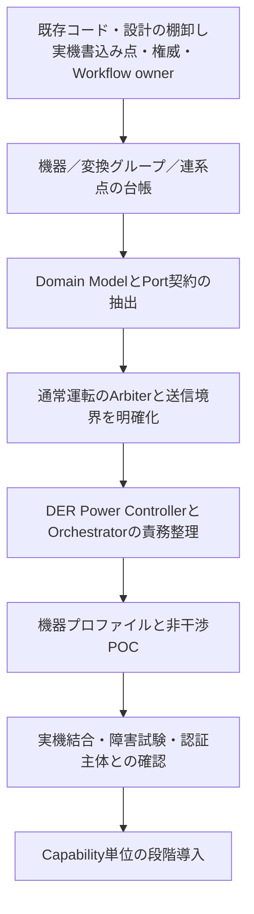

移行中は「旧経路も新経路も同じ機器に書き込める」状態を管理します。移行対象資源ごとに書込み所有者を切り替え、旧Pollerからの設定上書きや二重再送を防ぎます。

## 5. EOL旧製品へのバックポート

既存の移行戦略は、旧ハードウェアを全面改修せず、Domain Logic、Domain Model、Port契約、テスト、Capabilityを共通資産にする方針です。BlackboardやProcess構成そのものを共通化する必要はありません。[P02](#p02)

新機能を旧系へ戻す場合は、Legacy Blackboard AdapterやDevice Adapterの背後に旧実装を置きます。ただし、旧系が本ノートの分離条件を満たさないなら、新系と同じJET非影響説明・運転保証ができると扱いません。プラットフォーム別に対応範囲を明示します。

## 6. 次の設計レビューで決めること

最初のレビューでは、対象機器と接続条件、配置案A／B、G側の範囲、通常操作API、初期対応Capabilityを確定させます。続いて権威・実行所有者マップ、プロセス配置、機器プロファイル、受入閾値を決定します。

本ノートの要求ID・TBDを、システム仕様書、USDM、構造設計、試験仕様へ追跡可能に展開します。外部仕様には利用者・クラウドが観測できる振る舞いを記し、CPUやPort配置等の内部実装とは分けます。

関連： [要求・試験](#note-10-requirements-tests)／[責務](#note-02-responsibilities)／[出典](#note-12-sources)


---

<a id="note-release-impact-checklist"></a>

# テンプレート — HEMSリリースの変更影響評価

> 未記入テンプレートです。チェックが付いていない項目を合格と扱わないでください。JET公式様式ではありません。

## 1. 識別と評価主体

| 項目 | 記入欄 |
|---|---|
| Release ID / 更新日 | TBD |
| 更新前／更新後HEMS版 | TBD |
| 評価対象機種・ハードウェア版 | TBD |
| G側構成・FW・設定識別 | TBD |
| 認証登録番号・申請主体 | TBD |
| 対応機器プロファイル | TBD |
| 評価担当・レビュー担当 | TBD |
| 適用規格／試験版 | TBD |

## 2. 変更内容

変更目的、変更モジュール、共通ライブラリ・OS・ドライバへの影響、要求頻度・対象モード・対象機器の変化を記載します。

**記入：TBD**

## 3. 差分確認

- [ ] HEMS変更範囲とG側変更範囲を分けた。
- [ ] G側のバイナリ・設定・ハードウェア・接続構成の差分を確認した。
- [ ] 通常APIの意味・許可値・モード・頻度・プロトコル版の差分を確認した。
- [ ] CPU・メモリ・帯域・電源・熱・reset等の共通資源への影響を確認した。
- [ ] 機器側の要求保持・本体操作・別クラウドとの共存条件を確認した。
- [ ] 初回評価で認めた前提範囲内かを判定した。

## 4. 非影響の説明

| 観点 | 前提 | 変更の有無 | 根拠・試験ID | 未解決事項 |
|---|---|---|---|---|
| 電力会社スケジュールの経路 | TBD | TBD | TBD | TBD |
| 系統連系保護 | TBD | TBD | TBD | TBD |
| 必要計測・時計・永続状態 | TBD | TBD | TBD | TBD |
| 通常要求の入力境界 | TBD | TBD | TBD | TBD |
| 実行負荷とタイミング | TBD | TBD | TBD | TBD |
| 通信断・OTA・再起動 | TBD | TBD | TBD | TBD |
| 接続機器・変換グループ | TBD | TBD | TBD | TBD |

## 5. 試験結果

| Run ID | 試験ID | 条件・対象版 | 結果 | 証跡 | 評価者 |
|---|---|---|---|---|---|
| TBD | TBD | TBD | NOT_RUN | TBD | TBD |

結果は `PASS / FAIL / NOT_RUN / NOT_APPLICABLE / INCONCLUSIVE` 等で区別し、対象外には根拠を付けます。

## 6. 認証・変更手続き

- [ ] 認証申請主体・機器メーカーへの相談要否を確認した。
- [ ] JETへの事前相談・届出・確認試験の必要性について、根拠となる判断記録を保管した。
- [ ] 社内の非影響判断を、JETの判断として記載していない。
- [ ] 必要な認証手続き完了と製品リリース承認を別々に確認した。

**相談日／相手／判断内容／記録：TBD**

## 7. 更新・復旧

更新対象、署名／権限、G側書込禁止、ロールバック、異常中断、復帰時の実機状態照合、旧要求無効化を記載します。

**記入：TBD**

## 8. 判定

**社内評価：TBD**  
**メーカー／認証主体の判断：TBD**  
**JETの判断が必要な場合の記録：TBD**  
**製品リリース承認：TBD**

参照： [JET認証影響分離](#note-04-jet-isolation)／[要求・試験](#note-10-requirements-tests)


---

<a id="note-device-profile"></a>

# テンプレート — DER機器・接続・認証プロファイル

> 未記入テンプレートです。例示したフィールド名はSPK-GWの内部管理案であり、ECHONET Liteの標準データ形式ではありません。

## 1. 物理装置と通信識別

| 項目 | 記入欄 |
|---|---|
| Profile ID / revision | TBD |
| メーカー・型式・ハードウェア版・FW版 | TBD |
| physical_device_id | TBD |
| resource_id | TBD |
| conversion_group_id | TBD |
| connection_point_id | TBD |
| クラス識別子／EOJ／インスタンス | TBD |
| ECHONET Lite版・APPENDIX版・AIF版 | TBD |
| 接続Transport・セキュリティ状態 | TBD |

## 2. 操作能力

| 操作 | 対応 | 許可範囲・単位・符号 | 更新待ち時間 | 実行確認方法 |
|---|---|---|---|---|
| 状態取得 | UNKNOWN | TBD | TBD | TBD |
| 運転モード要求 | UNKNOWN | TBD | TBD | TBD |
| 充放電電力要求 | UNKNOWN | TBD | TBD | TBD |
| PV出力制限要求 | UNKNOWN | TBD | TBD | TBD |
| Q／力率制御 | UNKNOWN | TBD | TBD | TBD |
| 要求の機器側期限 | UNKNOWN | TBD | TBD | TBD |
| 制限理由の取得 | UNKNOWN | TBD | TBD | TBD |

検出したSetプロパティマップ、メーカー資料、実機確認を結びます。`UNKNOWN`を`SUPPORTED`へ自動変換しません。

## 3. トポロジーと制約範囲

計測点、AC／DC基準、共通PCS容量、同時動作可能範囲、排他モード、連系点の合算対象を記載します。

**構成図／記入：TBD**

## 4. 系統・契約上の適用

| 項目 | 記入欄 |
|---|---|
| 一般送配電事業者・接続エリア | TBD |
| 接続契約・設備規模・逆潮流の可否 | TBD |
| 制約種別・容量の根拠 | TBD |
| 制約scope（機器／グループ／連系点） | TBD |
| GridApplicability | UNKNOWN |
| 判定根拠・確認日・確認者 | TBD |
| 自家消費継続・0%時の運転 | TBD |
| 過渡応答・許容差・評価窓 | TBD |

## 5. 認証・強制経路

| 項目 | 記入欄 |
|---|---|
| 認証登録番号・申請主体 | TBD |
| 対象PCS・出力制御装置・計測器 | TBD |
| 対象ソフトウェア識別・組合せ | TBD |
| 通常操作が制約を迂回しない根拠 | TBD |
| 適用試験方法の版 | TBD |
| HEMS停止時に継続するG側機能 | TBD |
| JET／メーカーとの確認記録 | TBD |

## 6. 障害・本体操作・競合

| 条件 | 実機の動作 | HEMSの動作 | 受入可否・根拠 |
|---|---|---|---|
| HEMS通信断 | TBD | TBD | TBD |
| 旧通常要求の保持 | TBD | TBD | TBD |
| 電力会社通信断 | TBD | TBD | TBD |
| G側内部通信断 | TBD | TBD | TBD |
| 計測／時刻異常 | TBD | TBD | TBD |
| 本体操作・純正アプリ操作 | TBD | TBD | TBD |
| HEMS OTA・復帰 | TBD | TBD | TBD |
| EV離脱・負荷急減 | TBD | TBD | TBD |

## 7. サポートする用途と制限

対応する通常運転Usecase、非対応機能、更新周期、未達・不明時の通知、必要な設置条件を記載します。

**記入：TBD**

## 8. 評価状態

**資料確認：TBD**  
**シミュレータ試験：NOT_RUN**  
**実機試験：NOT_RUN**  
**認証構成確認：TBD**  
**製品対応判定：TBD**

参照： [機器分類](#note-05-device-classes)／[契約](#note-06-contracts)／[電力制約](#note-07-power-constraints)


---

<a id="note-12-sources"></a>

# 出典・確認範囲・過去説明からの補正

## 1. 読み方

確認基準日は **2026-10-06** です。`Sxx`は公開一次資料、`Pxx`は検索で確認したプロジェクト関連の既存ノート、`C01`はこの会話におけるユーザーの明示内容です。

公開資料は要点の確認に使用し、原本PDFはZIPへ同梱していません。設計図、責務配分、内部契約、リスク分析、要求・試験案は本パッケージでの設計提案です。公開規格の条文そのものと混同しないようにします。

<a id="s01"></a>
## S01 — JET 2026年10月1日 試験方法改正通知

- 発行元：一般財団法人 電気安全環境研究所（JET）
- 資料：系統連系保護装置等認証の試験方法改正に関する通知
- 公表日：2026-10-01
- 原本：<https://www.jet.or.jp/new/new496.html>

遠隔出力制御試験 `JETGR0004-1-2.2` 等の改正を確認しました。蓄電池等を含む発電システムへの適用範囲拡大と測定方法改正が示されています。

**限界：改正通知を確認したもので、試験方法本文を全条項確認したものではありません。対象機種、経過措置、申請に使う版、旧認証への適用は個別に確認します。**

<a id="s02"></a>
## S02 — JET 系統連系保護装置等認証

- 発行元：JET
- 原本：<https://www.jet.or.jp/renewable/power_conditioner/protection/>
- 確認箇所：認証制度の概要、認証製品の設計変更・ソフトウェア変更に関する案内

本パッケージでいうJET評価の制度を特定し、認証取得による連系確認の扱いと、変更に対する事前相談の考え方を確認しました。

**限界：登録済みの特定PCSとSPK-GWの組合せを承認した資料ではありません。**

<a id="s03"></a>
## S03 — JET 系統連系保護装置等認証の手引き（2025年5月）

- 発行元：JET
- 原本：<https://www.jet.or.jp/common/data/products/protection/tebiki_202505.pdf>
- 確認箇所：第4節「変更」に関する部分（PDFの5ページ目）

登録内容・ソフトウェア管理番号等の変更について、事前相談、必要な届出、確認試験の判断を行う手順を確認しました。該当ページは画像表示でも確認しています。

**限界：CPU分離等を満たせば常に試験免除となる、という個別保証は確認していません。本ノートの非干渉設計・証跡項目は提案です。**

<a id="s04"></a>
## S04 — 東京電力PG 出力制御について

- 発行元：東京電力パワーグリッド
- 原本：<https://www.tepco.co.jp/pg/consignment/access/outputcontrol.html>
- 確認箇所：需給バランス／系統容量制約、今後新増設される設備のオンライン制御設備設置対象、伝送仕様書の案内

特定エリアにおける設備設置対象の具体例と、制約の種類による違いを確認しました。

**限界：全国・全既設契約に適用する統一表ではありません。水力等が同表の対象外であることは、あらゆる給電・出力抑制の対象外という意味ではありません。**

<a id="s05"></a>
## S05 — 東京電力PG 出力制御機能付PCS等の技術仕様書（66 kV未満）

- 発行元：東京電力パワーグリッド
- 原本：<https://www.tepco.co.jp/pg/consignment/access/pdf/hlv_gijutsushiyosyo.pdf>
- 確認版：2023-06-30改定の公開資料
- 確認箇所：広義／狭義PCS、スケジュール方式、連系点・自家消費、異常時動作等

スケジュールの取得・保持とPCS制御、余剰買取時の考え方、外部通信断と内部通信異常の区別を確認しました。数値・異常時動作を含む該当ページは画像表示でも確認しています。

**限界：機器ベンダーの実装詳細・伝送仕様書・全国全契約の共通要件ではありません。資料中の周期・応答・許容差はその適用条件で用い、一般的なHEMSの全操作へ流用しません。**

<a id="s06"></a>
## S06 — ECHONETコンソーシアム 規格書公開ページ

- 発行元：ECHONETコンソーシアム
- 原本：<https://echonet.jp/spec_g/>
- 確認：ECHONET Lite仕様書、APPENDIX、各機器のAIFの公開版一覧

確認時の公開一覧には、ECHONET Lite Ver.1.14、APPENDIX Release R rev.4、蓄電池AIF Ver.1.30、EV充放電器・充電器AIF Ver.1.41等が掲載されています。

**限界：最新公開版と、既設機器が実装・適合している版は同じとは限りません。機器プロファイルへ実際の対応版を記録します。**

<a id="s07"></a>
## S07 — 蓄電池・HEMSコントローラ間 AIF仕様書 Ver.1.30

- 発行元：ECHONETコンソーシアム
- 資料日付：2024-01-26
- 原本：<https://echonet.jp/wp/wp-content/uploads/pdf/General/Standard/AIF/sb/sb_aif_ver1.30.pdf>
- 確認箇所：Set受理応答、表3-2、充放電電力設定の更新待ち時間

Set_Resが受理応答であること、充放電電力設定プロパティがオプションであること、その再設定待ち時間が60秒以上であることを確認しました。表3-2は画像表示でも確認しています。

**限界：全プロパティの更新間隔が60秒という意味ではなく、すべての蓄電池が電力設定に対応する保証でもありません。**

<a id="s08"></a>
## S08 — ECHONET機器オブジェクト詳細規定 Release R rev.4

- 発行元：ECHONETコンソーシアム
- 公開ページ：<https://echonet.jp/spec_object_rr4/>
- 原本：<https://echonet.jp/wp/wp-content/uploads/pdf/General/Standard/Release/Release_R/Appendix_Release_R_r4.pdf>
- 確認版の日付：2025-09-26
- 確認箇所：クラス一覧（印刷ページ3-136、3-137付近）

PV、燃料電池、蓄電池、EV充放電器、エンジンコージェネレーション、EV充電器、小型風力、マルチ入力PCS、周波数制御、各種電力量メータのクラスを確認しました。クラス表は画像表示でも確認しています。

**限界：クラスの定義は、市販接続機器の存在・全操作への対応・JETの適用を意味しません。**

<a id="s09"></a>
## S09 — 周波数制御対応PCS・HEMSコントローラ間 AIF仕様書 Ver.1.00

- 発行元：ECHONETコンソーシアム
- 資料日付：2025-03-14
- 原本：<https://echonet.jp/wp/wp-content/uploads/pdf/General/Standard/AIF/fr/fr_aif_ver.1.00.pdf>
- 確認箇所：システム構成・必須オブジェクトの説明

周波数制御クラスと機器構成に関するAIFがあることを確認しました。

**限界：HEMSから任意の保護設定・系統支援パラメータを自由変更できる根拠として用いません。本パッケージでは条件付きの将来拡張として扱います。**

<a id="p01"></a>
## P01 — 既存To-Beアーキテクチャノート

- 既存ファイル名：`04_target_to_be_architecture.md`
- 検索で確認した版：version 1
- 確認箇所：基本設計原則、Blackboard、状態所有権、HEMS Capability、ECHONET Lite Capability、プロセス分割、API契約、代表シナリオ
- 取得面：この会話で利用可能なLibrary検索結果

ControlRequest、明示的な制御権、Ports and Adapters、State Owner、CapabilityとProcess配置の分離を継承しました。

**限界：既存コードの最新状態を示すものではありません。文書との一致を今回コード監査したものでもありません。** 元ファイルはこのZIPへ複製していません。

<a id="p02"></a>
## P02 — 既存の新旧プラットフォーム移行戦略

- 既存ファイル名：`05_MIGRATION_STRATEGY.md`
- 検索で確認した版：version 1
- 確認箇所：前提、共通化対象、旧系バックポート、DeploymentとDomainの分離、段階移行
- 取得面：この会話で利用可能なLibrary検索結果

EOL旧プラットフォームの全面改修を目的とせず、Domain・Port・テスト・Capabilityを共通資産とし、旧系差分をAdapterで吸収する方針を継承しました。

**限界：個々の旧製品で本パッケージの分離要件を満たせるかは未確認です。**

<a id="c01"></a>
## C01 — この会話における明示合意・設計目標

ユーザーが `PCS Controller` から `DER Power Controller` への改名に同意し、HEMS／高度エネマネと系統連系保護・遠隔出力制御の非影響構造を目標にしています。本パッケージの詳細図・配置・型式・CPU配置・試験結果まで承認されたという意味ではありません。

## 2. 過去説明から補正した事項

| 過去説明で誤解を招き得る点 | 本パッケージでの扱い |
|---|---|
| 固定APIやCPU分離ならJET試験免除が確約される | 個別判断。提案の証跡と正式な要求を区別 |
| CPU物理分離等が2025手引き第4節の具体的明示要件 | 同節で確認できたのは一般的変更手続き。設計提案として再整理 |
| 遠隔出力制御試験の旧版が現行 | 2026-10-01改正通知を反映。詳細適用は要確認 |
| 出力制御は一つのmin計算で常時完全保証できる | scope・符号・複数資源・過渡・許容差・保護状態を分離 |
| 二つのHEMS版でPCS実出力が同一である必要 | 正常要求の違いによる出力変更は許容。制約適合を維持 |
| クラスが定義されていれば全機器を同じように操作可能 | クラスとCapabilityを別管理 |
| 2バイトのクラス識別子を完全なEOJとして表記 | インスタンスを含む3バイトEOJと区別 |
| EV充電器・給湯器等はどの種類の電力調整にも無関係 | 発電側遠隔出力制御と、DR／需要調整を区別 |
| 全地域・全契約で10 kWを一律適用 | エリア・契約・設備構成の条件付きとして扱う |
| HEMS内部Leaseで実機が自動的に停止する | 実機側タイムアウト能力を別途確認 |

## 3. 調査範囲外・未確認

JETの有償／個別提供される試験方法本文、電力会社の個別伝送仕様、具体的機器の認証登録・対応組合せ・通信仕様、各エリア全既設契約の適用、実機波形・保護動作、コード実装を網羅していません。

これらを必要に応じて取得・評価し、本ノートのTBD・プロファイル・試験条件へ反映します。取得できていない資料の内容を推測で仕様として固定しません。
