# SPK-GW_HEMS システム仕様書 R7

5部の入口と全体21／GW32機能群を追加。既存27詳細章・124 SYS要求・69試験・85 OQを保持。機能採否・権限・構成適合は未承認。前回の5部構成案を入口として実ファイル化したが、詳細章は物理移動・改番していない。

[編集ガイド](01_Completion_Guide.md) ／ [MOC](00_MOC.md)

## 目次

- [I_System_Specification](#part-i)
- [II_GW_Product_Specification](#part-ii)
- [III_Boundary_Interfaces](#part-iii)
- [IV_Quality_Constraints](#part-iv)
- [V_Lifecycle_Verification](#part-v)
- [01_Scope_Baseline](#ch-01)
- [02_System_Context](#ch-02)
- [03_Responsibilities](#ch-03)
- [04_Configurations_Profiles](#ch-04)
- [05_Control_Contracts](#ch-05)
- [06_Usecases](#ch-06)
- [07_DER_Connections](#ch-07)
- [08_Advanced_EMS_Loads](#ch-08)
- [09_Measurement_Data](#ch-09)
- [10_Grid_Protection](#ch-10)
- [11_Power_Constraints](#ch-11)
- [12_Configuration_Lifecycle](#ch-12)
- [13_Fault_Recovery_OTA](#ch-13)
- [14_Performance_Security](#ch-14)
- [15_Deployment_Isolation](#ch-15)
- [16_Certification_Change](#ch-16)
- [17_Verification](#ch-17)
- [18_Migration](#ch-18)
- [19_Open_Issues_Sources](#ch-19)
- [20_Northbound_Monitoring_FW](#ch-20)
- [21_Grid_Connection_Selection](#ch-21)
- [22_Physical_Electrical_Installation](#ch-22)
- [23_Environment_EMC_Transport](#ch-23)
- [24_Product_Remote_Safety](#ch-24)
- [25_Reliability_Availability_Maintainability](#ch-25)
- [26_Manufacturing_Commissioning_Retirement](#ch-26)
- [27_Security_Privacy_Lifecycle](#ch-27)
- [Change_Summary](#ap-change-summary)
- [Requirements_Catalog](#ap-requirements-catalog)
- [Traceability](#ap-traceability)
- [Test_Profiles](#ap-test-profiles)
- [Open_Issues](#ap-open-issues)
- [Parameter_Register](#ap-parameter-register)
- [Device_Profile_Extended](#ap-device-profile-extended)
- [Deployment_Binding](#ap-deployment-binding)
- [Release_Impact_Addendum](#ap-release-impact-addendum)
- [External_Interface_Register](#ap-external-interface-register)
- [Northbound_Operation_Catalog](#ap-northbound-operation-catalog)
- [R2_Review_Checklist](#ap-r2-review-checklist)
- [R3_Decision_Changes](#ap-r3-decision-changes)
- [Grid_Connection_Profile](#ap-grid-connection-profile)
- [R3_Review_Checklist](#ap-r3-review-checklist)
- [R4_Decision_Changes](#ap-r4-decision-changes)
- [R4_Review_Checklist](#ap-r4-review-checklist)
- [R5_Diagram_Changes](#ap-r5-diagram-changes)
- [Product_Function_Matrix](#ap-product-function-matrix)
- [Normative_References_Glossary](#ap-normative-references-glossary)
- [Interface_Contract_Detail](#ap-interface-contract-detail)
- [Data_Dictionary](#ap-data-dictionary)
- [Configuration_Register](#ap-configuration-register)
- [State_Permission_Matrix](#ap-state-permission-matrix)
- [UI_Alarm_Register](#ap-ui-alarm-register)
- [Quality_Acceptance_Profiles](#ap-quality-acceptance-profiles)
- [R6_Change_Summary](#ap-r6-change-summary)
- [Coverage_Completion_Map](#ap-coverage-completion-map)
- [Open_Question_Register](#ap-open-question-register)
- [Functional_Allocation](#ap-functional-allocation)
- [Role_Function_Access](#ap-role-function-access)
- [Configuration_Patterns](#ap-configuration-patterns)
- [R7_Change_Summary](#ap-r7-change-summary)

---

# I. システム全体仕様

**文書状態：DRAFT_FOR_REVIEW。** 機能の一覧化・配賦整理であり、実装・機能採用・権限付与・対応機器の承認ではない。R6の27詳細章・124 SYS要求・69試験・85 OQは維持する。

## I.1 対象と読み方

住宅設備・GW・クラウド・端末・宅内ネットワークを含め、全体として何ができるかと誰が実現するかを記載する。GWに実装しないPCSの自律取得・系統保護、スマートフォン／クラウドの役割も全体機能に含める。

システム全体の一覧とGW一覧は二重記載ではなく、上位機能から各要素への配賦関係である。`S-FN-*`／`GW-FN-*`は本一覧の識別子で、既存`SYS-*`要求の改番や承認済みUSDMの新設ではない。

## I.2 システム全体の機能（要件）一覧

**21機能群。既存R6から抽出した設計・候補の一覧であり、既存実装の全機能棚卸し完了を意味しない。** 各行の詳細カードに適用条件・要求・OQを載せる。

| 全体機能ID | 機能（要求の要約） | 実現する要素 | 関係するGW機能 |
|---|---|---|---|
| [S-FN-001](#s-fn-001) | エネルギー・設備状態の把握：機器と計測器の状態・電力等を、品質・鮮度とともに把握する。 | 機器・計測器＋GW＋表示先 | [GW-FN-008](#gw-fn-008)、[GW-FN-009](#gw-fn-009)、[GW-FN-012](#gw-fn-012)、[GW-FN-016](#gw-fn-016) |
| [S-FN-002](#s-fn-002) | 宅内モニタリング・操作：宅内ブラウザから監視し、認可された操作と結果を確認する。 | 端末ブラウザ＋GW＋宅内LAN/AP（直接無線は別経路） | [GW-FN-001](#gw-fn-001)、[GW-FN-018](#gw-fn-018) |
| [S-FN-003](#s-fn-003) | リモートモニタリング・操作：スマートフォンアプリからクラウド経由で対象住宅を監視・操作する。 | アプリ＋クラウド＋宅内ルータ＋GW＋対象機器 | [GW-FN-001](#gw-fn-001)、[GW-FN-009](#gw-fn-009)、[GW-FN-017](#gw-fn-017)、[GW-FN-019](#gw-fn-019) |
| [S-FN-004](#s-fn-004) | PV・蓄電池等の通常運転：許可されたDER操作を実機へ届け、受理と観測による達成を区別する。 | GW＋PCS／DER | [GW-FN-001](#gw-fn-001)、[GW-FN-002](#gw-fn-002)、[GW-FN-003](#gw-fn-003)、[GW-FN-004](#gw-fn-004)、[GW-FN-010](#gw-fn-010)、[GW-FN-011](#gw-fn-011)、[GW-FN-012](#gw-fn-012) |
| [S-FN-005](#s-fn-005) | 空調・給湯等の負荷操作：快適性・機器安全を尊重して、採用された負荷操作を実行する。 | GW＋空調・給湯等 | [GW-FN-001](#gw-fn-001)、[GW-FN-002](#gw-fn-002)、[GW-FN-003](#gw-fn-003)、[GW-FN-005](#gw-fn-005)、[GW-FN-010](#gw-fn-010)、[GW-FN-012](#gw-fn-012) |
| [S-FN-006](#s-fn-006) | 高度エネマネ運転計画：自家消費・料金・購入電力・充電期限等の採用戦略で運転を計画する。 | GW＋対応機器＋採用時の外部情報源 | [GW-FN-002](#gw-fn-002)、[GW-FN-003](#gw-fn-003)、[GW-FN-004](#gw-fn-004)、[GW-FN-005](#gw-fn-005)、[GW-FN-006](#gw-fn-006) |
| [S-FN-007](#s-fn-007) | 計画評価・再計画：実績・制約・機器離脱・入力不足を踏まえ、再計画又は縮退を行う。 | GW＋機器状態／観測 | [GW-FN-003](#gw-fn-003)、[GW-FN-004](#gw-fn-004)、[GW-FN-005](#gw-fn-005)、[GW-FN-007](#gw-fn-007)、[GW-FN-008](#gw-fn-008)、[GW-FN-026](#gw-fn-026) |
| [S-FN-008](#s-fn-008) | 設備登録・接続構成管理：機器・物理設備・計測点・制御能力・版・接続を整合させる。 | GW＋機器＋認可された施工／管理主体 | [GW-FN-010](#gw-fn-010)、[GW-FN-011](#gw-fn-011)、[GW-FN-012](#gw-fn-012)、[GW-FN-029](#gw-fn-029)、[GW-FN-031](#gw-fn-031) |
| [S-FN-009](#s-fn-009) | 設定変更・保存・復元：許可した設定を世代管理し、希望・保存・有効状態と競合を区別する。 | 操作端末／上位＋GWの設定所有者 | [GW-FN-001](#gw-fn-001)、[GW-FN-017](#gw-fn-017)、[GW-FN-020](#gw-fn-020)、[GW-FN-021](#gw-fn-021)、[GW-FN-030](#gw-fn-030) |
| [S-FN-010](#s-fn-010) | GW内部機能の操作：認可された開始停止・再探索・再起動等をJobとして実行する。 | 利用主体／上位＋GW | [GW-FN-001](#gw-fn-001)、[GW-FN-017](#gw-fn-017)、[GW-FN-022](#gw-fn-022) |
| [S-FN-011](#s-fn-011) | FW配信・適用・復旧：配布物の承認・配送・検証・適用・復旧を別主体／段階で管理する。 | リリース承認主体＋FWサーバ＋GW | [GW-FN-023](#gw-fn-023)、[GW-FN-024](#gw-fn-024) |
| [S-FN-012](#s-fn-012) | RS-485 PCSの遠隔出力制御：GW G側が宅内ルータ経由でスケジュールを取得・管理し、RS-485でPCSへ指示する。 | 出力制御サーバ＋ルータ＋GW G側＋RS-485 PCS | [GW-FN-011](#gw-fn-011)、[GW-FN-014](#gw-fn-014)、[GW-FN-015](#gw-fn-015)、[GW-FN-028](#gw-fn-028) |
| [S-FN-013](#s-fn-013) | EL接続PCSの自律出力制御：PCS自身が宅内ルータ経由で取得・保存・適用する。GWを代理取得器にしない。 | 出力制御サーバ＋ルータ＋EL接続PCS | [GW-FN-016](#gw-fn-016)、[GW-FN-028](#gw-fn-028) |
| [S-FN-014](#s-fn-014) | PCS側の系統連系保護：機器側の独立した保護を成立させ、HEMSの応答・承認を待たない。 | PCS等の確認対象保護機能 | [GW-FN-016](#gw-fn-016)、[GW-FN-028](#gw-fn-028) |
| [S-FN-015](#s-fn-015) | 競合・通信断・停止・復旧の協調：通常要求の競合と、障害位置別の残留・失効・復旧を管理する。 | GW H/G＋PCS＋ネットワーク＋各サービス | [GW-FN-002](#gw-fn-002)、[GW-FN-003](#gw-fn-003)、[GW-FN-004](#gw-fn-004)、[GW-FN-007](#gw-fn-007)、[GW-FN-015](#gw-fn-015)、[GW-FN-020](#gw-fn-020)、[GW-FN-022](#gw-fn-022)、[GW-FN-024](#gw-fn-024)、[GW-FN-026](#gw-fn-026)、[GW-FN-032](#gw-fn-032) |
| [S-FN-016](#s-fn-016) | 警報・通知・診断：異常と操作結果を記録・通知し、公開範囲内で診断可能にする。 | GW＋クラウド／UI＋機器 | [GW-FN-008](#gw-fn-008)、[GW-FN-009](#gw-fn-009)、[GW-FN-016](#gw-fn-016)、[GW-FN-017](#gw-fn-017)、[GW-FN-019](#gw-fn-019)、[GW-FN-022](#gw-fn-022)、[GW-FN-025](#gw-fn-025) |
| [S-FN-017](#s-fn-017) | 履歴の保存・提出・利用：用途別のデータを保持し、期間・品質・欠測を明示して抽出する。 | GW＋採用するクラウド保存／利用先 | [GW-FN-008](#gw-fn-008)、[GW-FN-009](#gw-fn-009) |
| [S-FN-018](#s-fn-018) | 外部HEMSとの機器公開連携：GWがDevice側として許可する情報・操作を外部HEMSへ提供する。 | 外部HEMS＋GW＋実機対応 | [GW-FN-013](#gw-fn-013) |
| [S-FN-019](#s-fn-019) | 利用者識別・権限・所属管理：4種類の利用者に対して、認可・失効・対象範囲・監査を適用する。 | 利用者＋GW／クラウド／製造保守の各認可境界 | [GW-FN-001](#gw-fn-001)、[GW-FN-017](#gw-fn-017)、[GW-FN-025](#gw-fn-025)、[GW-FN-027](#gw-fn-027)、[GW-FN-028](#gw-fn-028)、[GW-FN-030](#gw-fn-030) |
| [S-FN-020](#s-fn-020) | 製造・施工・保守・交換・廃棄支援：個体識別から引渡し、交換、所有者変更、消去まで必要な支援を定義する。 | メーカー／メンテナンス／ユーザ＋GW＋支援基盤 | [GW-FN-010](#gw-fn-010)、[GW-FN-020](#gw-fn-020)、[GW-FN-022](#gw-fn-022)、[GW-FN-025](#gw-fn-025)、[GW-FN-027](#gw-fn-027)、[GW-FN-029](#gw-fn-029)、[GW-FN-030](#gw-fn-030)、[GW-FN-032](#gw-fn-032) |
| [S-FN-021](#s-fn-021) | 通信・周辺機器の構成と復旧：通信方式・USB等の採用条件、接続・故障・復旧を管理する。 | GW＋宅内ルータ＋周辺機器 | [GW-FN-021](#gw-fn-021)、[GW-FN-026](#gw-fn-026)、[GW-FN-031](#gw-fn-031) |

## I.3 システム利用者と機能範囲

| 利用者分類（確定） | 役割範囲の案（権限は未承認） |
|---|---|
| ユーザ | 所有・利用する住宅の監視、許可された通常運転・利用者設定 |
| メンテナンス | 委託された設備の施工・点検・診断・許可された復旧 |
| メーカー | 製品個体・リリース・配信・承認された保守の管理 |
| 開発者 | 開発・試験環境の検証と、別途認可された限定診断 |

4つは利用者の種類であり、権限の上下4段階ではない。メーカー又は開発者を全機能の管理者にしない。1人の複数役割、役割切替、兼任可否、委任対象・期限は未確定。施工者・運用者等のR6表現を新たな第5ロールとせず、4分類への対応を確認する。

本編はロールの定義、利用場面、機能群ごとの概要、通常APIからの禁止事項を保持する。詳細は[利用者別機能・操作権限別冊](#ap-role-function-access)を文書ID・版で規範参照する。手順書や画面非表示だけを認可の正本にしない。自動EMS、上位サービス、配信サービス等の機械主体は人の4分類とは別に識別する。

## I.4 機器構成パターン

| 構成ID／代表型 | 出力制御スケジュールの取得・適用主体 | 通常操作・観測 | 適合状態 |
|---|---|---|---|
| [CFG-RS RS-485接続PCS構成](#cfg-rs) | GW G側 | GW G側 ⇄ RS-485 ⇄ PCS | 型式・版・台数・共存条件は未確認 |
| [CFG-EL ECHONET Lite接続PCS構成](#cfg-el) | 各対象PCSの出力制御機能 | GW H側 EL Controller ⇄ 宅内LAN/AP ⇄ PCS EL機器IF | 型式・版・台数・共存条件は未確認 |
| [CFG-MIX RS-485＋ECHONET Lite PCS混在構成](#cfg-mix) | RS-485対象はGW G側、EL対象は当該PCS | RS-485必須指令経路とEL通常操作経路を独立識別 | 型式・版・台数・共存条件は未確認 |

本編に責務・経路が異なる代表パターンを残す。メーカー・型式・FW・台数・配線・プロパティ差の全組合せは[構成パターン別冊](#ap-configuration-patterns)に展開する。構成別の対応機能は「あり／なし」だけでなく、条件付き・非対応・未確認を分ける。

すべての出力制御サーバ通信は宅内ルータ経由。EL接続PCSだけがGW非経由で取得し、RS-485接続PCSはGW G側が取得・管理・指示する。これを単なる選択メニューで入替えない。

## I.5 既存詳細章との対応

| 既存章 | 扱う内容 |
|---|---|
| [01. 文書管理・適用範囲・仕様の確定度](#ch-01) | 文書管理・適用範囲・仕様の確定度 |
| [02. 外部サービス・宅内接続を含むシステム構成](#ch-02) | 外部サービス・宅内接続を含むシステム構成 |
| [04. 製品構成・機器分類・接続プロファイル](#ch-04) | 製品構成・機器分類・接続プロファイル |
| [06. システムユースケース・横断振る舞い](#ch-06) | システムユースケース・横断振る舞い |
| [10. 一般送配電事業者・遠隔出力制御・系統連系保護](#ch-10) | 一般送配電事業者・遠隔出力制御・系統連系保護 |
| [11. 電力制約・トポロジー・過渡条件](#ch-11) | 電力制約・トポロジー・過渡条件 |
| [21. 出力制御接続方式の選択・責務・切替](#ch-21) | 出力制御接続方式の選択・責務・切替 |

## I.6 全体機能の適用条件・根拠カード

### S-FN-001 — エネルギー・設備状態の把握

機器と計測器の状態・電力等を、品質・鮮度とともに把握する。

**適用条件：** 対応する計測能力と計測点が確定する構成

**実現責任：** 機器・計測器＋GW＋表示先

**根拠状態：** `R6_DESIGN_DRAFT`。採用リリース・実装確認・正式USDM対応は未確定。

**関係するGW機能（実装責任は別途確認）：** [GW-FN-008](#gw-fn-008) ／ [GW-FN-009](#gw-fn-009) ／ [GW-FN-012](#gw-fn-012) ／ [GW-FN-016](#gw-fn-016)

**関連SYS要求：** [SYS-CAP-001](#ap-requirements-catalog)、[SYS-DATA-001](#ap-requirements-catalog)、[SYS-DATA-002](#ap-requirements-catalog)、[SYS-EL-001](#ap-requirements-catalog)、[SYS-GNET-004](#ap-requirements-catalog)、[SYS-GNET-007](#ap-requirements-catalog)、[SYS-GSEL-013](#ap-requirements-catalog)、[SYS-GSEL-014](#ap-requirements-catalog)、[SYS-MEAS-001](#ap-requirements-catalog)、[SYS-MEAS-002](#ap-requirements-catalog)、[SYS-NORTH-006](#ap-requirements-catalog)、[SYS-STATE-001](#ap-requirements-catalog)、[SYS-STATE-002](#ap-requirements-catalog)

**根拠本文：** [02_System_Context](#ch-02) [09_Measurement_Data](#ch-09) [11_Power_Constraints](#ch-11)

**残る確認：** [OQ-R6-09-01](#oq-r6-09-01)

### S-FN-002 — 宅内モニタリング・操作

宅内ブラウザから監視し、認可された操作と結果を確認する。

**適用条件：** 直接無線／ルータ経由。採用条件は個別確定

**実現責任：** 端末ブラウザ＋GW＋宅内LAN/AP（直接無線は別経路）

**根拠状態：** `R6_DESIGN_DRAFT`。採用リリース・実装確認・正式USDM対応は未確定。

**関係するGW機能（実装責任は別途確認）：** [GW-FN-001](#gw-fn-001) ／ [GW-FN-018](#gw-fn-018)

**関連SYS要求：** [SYS-GNET-010](#ap-requirements-catalog)、[SYS-NORTH-001](#ap-requirements-catalog)、[SYS-NORTH-002](#ap-requirements-catalog)、[SYS-NORTH-007](#ap-requirements-catalog)、[SYS-REQ-001](#ap-requirements-catalog)、[SYS-UI-001](#ap-requirements-catalog)、[SYS-UI-002](#ap-requirements-catalog)、[SYS-UI-003](#ap-requirements-catalog)、[SYS-UI-004](#ap-requirements-catalog)、[SYS-UI-005](#ap-requirements-catalog)

**根拠本文：** [02_System_Context](#ch-02) [20_Northbound_Monitoring_FW](#ch-20)

**残る確認：** [OQ-R6-02-02](#oq-r6-02-02) ／ [OQ-R6-20-02](#oq-r6-20-02)

### S-FN-003 — リモートモニタリング・操作

スマートフォンアプリからクラウド経由で対象住宅を監視・操作する。

**適用条件：** GWはアプリの実装主体ではない

**実現責任：** アプリ＋クラウド＋宅内ルータ＋GW＋対象機器

**根拠状態：** `R6_DESIGN_DRAFT`。採用リリース・実装確認・正式USDM対応は未確定。

**関係するGW機能（実装責任は別途確認）：** [GW-FN-001](#gw-fn-001) ／ [GW-FN-009](#gw-fn-009) ／ [GW-FN-017](#gw-fn-017) ／ [GW-FN-019](#gw-fn-019)

**関連SYS要求：** [SYS-APP-001](#ap-requirements-catalog)、[SYS-APP-002](#ap-requirements-catalog)、[SYS-DATA-001](#ap-requirements-catalog)、[SYS-DATA-002](#ap-requirements-catalog)、[SYS-GWOP-001](#ap-requirements-catalog)、[SYS-NORTH-001](#ap-requirements-catalog)、[SYS-NORTH-002](#ap-requirements-catalog)、[SYS-NORTH-003](#ap-requirements-catalog)、[SYS-NORTH-004](#ap-requirements-catalog)、[SYS-NORTH-005](#ap-requirements-catalog)、[SYS-NORTH-006](#ap-requirements-catalog)、[SYS-NORTH-007](#ap-requirements-catalog)、[SYS-REQ-001](#ap-requirements-catalog)、[SYS-STATE-001](#ap-requirements-catalog)、[SYS-STATE-002](#ap-requirements-catalog)

**根拠本文：** [20_Northbound_Monitoring_FW](#ch-20)

**残る確認：** [OQ-R6-20-01](#oq-r6-20-01) ／ [OQ-R6-20-02](#oq-r6-20-02)

### S-FN-004 — PV・蓄電池等の通常運転

許可されたDER操作を実機へ届け、受理と観測による達成を区別する。

**適用条件：** RS-485／ELの能力と更新間隔を別確認

**実現責任：** GW＋PCS／DER

**根拠状態：** `R6_DESIGN_DRAFT`。採用リリース・実装確認・正式USDM対応は未確定。

**関係するGW機能（実装責任は別途確認）：** [GW-FN-001](#gw-fn-001) ／ [GW-FN-002](#gw-fn-002) ／ [GW-FN-003](#gw-fn-003) ／ [GW-FN-004](#gw-fn-004) ／ [GW-FN-010](#gw-fn-010) ／ [GW-FN-011](#gw-fn-011) ／ [GW-FN-012](#gw-fn-012)

**関連SYS要求：** [SYS-AUTH-001](#ap-requirements-catalog)、[SYS-AUTH-002](#ap-requirements-catalog)、[SYS-CAP-001](#ap-requirements-catalog)、[SYS-CAP-002](#ap-requirements-catalog)、[SYS-COEX-001](#ap-requirements-catalog)、[SYS-EL-001](#ap-requirements-catalog)、[SYS-GNET-004](#ap-requirements-catalog)、[SYS-GNET-012](#ap-requirements-catalog)、[SYS-NORTH-001](#ap-requirements-catalog)、[SYS-NORTH-002](#ap-requirements-catalog)、[SYS-NORTH-007](#ap-requirements-catalog)、[SYS-ORCH-001](#ap-requirements-catalog)、[SYS-REQ-001](#ap-requirements-catalog)、[SYS-RESP-001](#ap-requirements-catalog)、[SYS-RESULT-001](#ap-requirements-catalog)、[SYS-RESULT-002](#ap-requirements-catalog)、[SYS-RESULT-003](#ap-requirements-catalog)、[SYS-RETRY-001](#ap-requirements-catalog)、[SYS-ROUTE-001](#ap-requirements-catalog)、[SYS-RS-001](#ap-requirements-catalog)、[SYS-RS-002](#ap-requirements-catalog)、[SYS-RS-003](#ap-requirements-catalog)、[SYS-RS-005](#ap-requirements-catalog)、[SYS-RS-006](#ap-requirements-catalog)、[SYS-SEM-001](#ap-requirements-catalog)

**根拠本文：** [05_Control_Contracts](#ch-05) [07_DER_Connections](#ch-07)

**残る確認：** [OQ-R6-07-01](#oq-r6-07-01) ／ [OQ-R6-07-02](#oq-r6-07-02)

### S-FN-005 — 空調・給湯等の負荷操作

快適性・機器安全を尊重して、採用された負荷操作を実行する。

**適用条件：** 必要なELプロパティ・機器能力を確認

**実現責任：** GW＋空調・給湯等

**根拠状態：** `R6_DESIGN_DRAFT`。採用リリース・実装確認・正式USDM対応は未確定。

**関係するGW機能（実装責任は別途確認）：** [GW-FN-001](#gw-fn-001) ／ [GW-FN-002](#gw-fn-002) ／ [GW-FN-003](#gw-fn-003) ／ [GW-FN-005](#gw-fn-005) ／ [GW-FN-010](#gw-fn-010) ／ [GW-FN-012](#gw-fn-012)

**関連SYS要求：** [SYS-AUTH-001](#ap-requirements-catalog)、[SYS-AUTH-002](#ap-requirements-catalog)、[SYS-CAP-001](#ap-requirements-catalog)、[SYS-CAP-002](#ap-requirements-catalog)、[SYS-COEX-001](#ap-requirements-catalog)、[SYS-EL-001](#ap-requirements-catalog)、[SYS-GNET-004](#ap-requirements-catalog)、[SYS-GNET-012](#ap-requirements-catalog)、[SYS-LOAD-001](#ap-requirements-catalog)、[SYS-NORTH-001](#ap-requirements-catalog)、[SYS-NORTH-002](#ap-requirements-catalog)、[SYS-NORTH-007](#ap-requirements-catalog)、[SYS-ORCH-001](#ap-requirements-catalog)、[SYS-REQ-001](#ap-requirements-catalog)、[SYS-RETRY-001](#ap-requirements-catalog)、[SYS-ROUTE-001](#ap-requirements-catalog)

**根拠本文：** [08_Advanced_EMS_Loads](#ch-08)

**残る確認：** [OQ-R6-08-03](#oq-r6-08-03)

### S-FN-006 — 高度エネマネ運転計画

自家消費・料金・購入電力・充電期限等の採用戦略で運転を計画する。

**適用条件：** 候補戦略を初回必須としない

**実現責任：** GW＋対応機器＋採用時の外部情報源

**根拠状態：** `R6_DESIGN_DRAFT`。採用リリース・実装確認・正式USDM対応は未確定。

**関係するGW機能（実装責任は別途確認）：** [GW-FN-002](#gw-fn-002) ／ [GW-FN-003](#gw-fn-003) ／ [GW-FN-004](#gw-fn-004) ／ [GW-FN-005](#gw-fn-005) ／ [GW-FN-006](#gw-fn-006)

**関連SYS要求：** [SYS-AUTH-001](#ap-requirements-catalog)、[SYS-AUTH-002](#ap-requirements-catalog)、[SYS-COEX-001](#ap-requirements-catalog)、[SYS-CONST-001](#ap-requirements-catalog)、[SYS-EMS-001](#ap-requirements-catalog)、[SYS-LOAD-001](#ap-requirements-catalog)、[SYS-ORCH-001](#ap-requirements-catalog)、[SYS-RESP-001](#ap-requirements-catalog)、[SYS-RESULT-001](#ap-requirements-catalog)、[SYS-RESULT-002](#ap-requirements-catalog)、[SYS-RESULT-003](#ap-requirements-catalog)、[SYS-RETRY-001](#ap-requirements-catalog)、[SYS-SEM-001](#ap-requirements-catalog)

**根拠本文：** [08_Advanced_EMS_Loads](#ch-08)

**残る確認：** [OQ-R6-08-01](#oq-r6-08-01) ／ [OQ-R6-08-02](#oq-r6-08-02)

### S-FN-007 — 計画評価・再計画

実績・制約・機器離脱・入力不足を踏まえ、再計画又は縮退を行う。

**適用条件：** 達成条件と原因不明の扱いを区別

**実現責任：** GW＋機器状態／観測

**根拠状態：** `R6_DESIGN_DRAFT`。採用リリース・実装確認・正式USDM対応は未確定。

**関係するGW機能（実装責任は別途確認）：** [GW-FN-003](#gw-fn-003) ／ [GW-FN-004](#gw-fn-004) ／ [GW-FN-005](#gw-fn-005) ／ [GW-FN-007](#gw-fn-007) ／ [GW-FN-008](#gw-fn-008) ／ [GW-FN-026](#gw-fn-026)

**関連SYS要求：** [SYS-CONST-001](#ap-requirements-catalog)、[SYS-EMS-001](#ap-requirements-catalog)、[SYS-EXPIRY-001](#ap-requirements-catalog)、[SYS-FAULT-001](#ap-requirements-catalog)、[SYS-GNET-005](#ap-requirements-catalog)、[SYS-LOAD-001](#ap-requirements-catalog)、[SYS-MEAS-001](#ap-requirements-catalog)、[SYS-MEAS-002](#ap-requirements-catalog)、[SYS-ORCH-001](#ap-requirements-catalog)、[SYS-RESP-001](#ap-requirements-catalog)、[SYS-RESULT-001](#ap-requirements-catalog)、[SYS-RESULT-002](#ap-requirements-catalog)、[SYS-RESULT-003](#ap-requirements-catalog)、[SYS-RETRY-001](#ap-requirements-catalog)、[SYS-SEM-001](#ap-requirements-catalog)、[SYS-STATE-001](#ap-requirements-catalog)、[SYS-STATE-002](#ap-requirements-catalog)

**根拠本文：** [06_Usecases](#ch-06) [08_Advanced_EMS_Loads](#ch-08) [13_Fault_Recovery_OTA](#ch-13)

**残る確認：** [OQ-R6-08-02](#oq-r6-08-02)

### S-FN-008 — 設備登録・接続構成管理

機器・物理設備・計測点・制御能力・版・接続を整合させる。

**適用条件：** 検出だけで全操作対応にしない

**実現責任：** GW＋機器＋認可された施工／管理主体

**根拠状態：** `R6_DESIGN_DRAFT`。採用リリース・実装確認・正式USDM対応は未確定。

**関係するGW機能（実装責任は別途確認）：** [GW-FN-010](#gw-fn-010) ／ [GW-FN-011](#gw-fn-011) ／ [GW-FN-012](#gw-fn-012) ／ [GW-FN-029](#gw-fn-029) ／ [GW-FN-031](#gw-fn-031)

**関連SYS要求：** [SYS-CAP-001](#ap-requirements-catalog)、[SYS-CAP-002](#ap-requirements-catalog)、[SYS-EL-001](#ap-requirements-catalog)、[SYS-GNET-004](#ap-requirements-catalog)、[SYS-GNET-012](#ap-requirements-catalog)、[SYS-GSEL-019](#ap-requirements-catalog)、[SYS-MIG-002](#ap-requirements-catalog)、[SYS-ROUTE-001](#ap-requirements-catalog)、[SYS-RS-001](#ap-requirements-catalog)、[SYS-RS-002](#ap-requirements-catalog)、[SYS-RS-003](#ap-requirements-catalog)、[SYS-RS-005](#ap-requirements-catalog)、[SYS-RS-006](#ap-requirements-catalog)、[SYS-SEC-001](#ap-requirements-catalog)、[SYS-SVC-001](#ap-requirements-catalog)

**根拠本文：** [04_Configurations_Profiles](#ch-04) [07_DER_Connections](#ch-07) [26_Manufacturing_Commissioning_Retirement](#ch-26)

**残る確認：** [OQ-R6-04-02](#oq-r6-04-02) ／ [OQ-R6-04-03](#oq-r6-04-03)

### S-FN-009 — 設定変更・保存・復元

許可した設定を世代管理し、希望・保存・有効状態と競合を区別する。

**適用条件：** G側系統設定は通常設定と別契約

**実現責任：** 操作端末／上位＋GWの設定所有者

**根拠状態：** `R6_DESIGN_DRAFT`。採用リリース・実装確認・正式USDM対応は未確定。

**関係するGW機能（実装責任は別途確認）：** [GW-FN-001](#gw-fn-001) ／ [GW-FN-017](#gw-fn-017) ／ [GW-FN-020](#gw-fn-020) ／ [GW-FN-021](#gw-fn-021) ／ [GW-FN-030](#gw-fn-030)

**関連SYS要求：** [SYS-APP-003](#ap-requirements-catalog)、[SYS-CFG-001](#ap-requirements-catalog)、[SYS-CFG-002](#ap-requirements-catalog)、[SYS-CFG-003](#ap-requirements-catalog)、[SYS-CFG-004](#ap-requirements-catalog)、[SYS-CFG-005](#ap-requirements-catalog)、[SYS-CFG-006](#ap-requirements-catalog)、[SYS-GNET-006](#ap-requirements-catalog)、[SYS-GSEL-019](#ap-requirements-catalog)、[SYS-GWOP-001](#ap-requirements-catalog)、[SYS-NORTH-001](#ap-requirements-catalog)、[SYS-NORTH-002](#ap-requirements-catalog)、[SYS-NORTH-003](#ap-requirements-catalog)、[SYS-NORTH-004](#ap-requirements-catalog)、[SYS-NORTH-005](#ap-requirements-catalog)、[SYS-NORTH-007](#ap-requirements-catalog)、[SYS-REQ-001](#ap-requirements-catalog)、[SYS-STATE-001](#ap-requirements-catalog)

**根拠本文：** [12_Configuration_Lifecycle](#ch-12) [20_Northbound_Monitoring_FW](#ch-20)

**残る確認：** [OQ-R6-12-02](#oq-r6-12-02) ／ [OQ-R6-12-03](#oq-r6-12-03) ／ [OQ-R6-12-04](#oq-r6-12-04)

### S-FN-010 — GW内部機能の操作

認可された開始停止・再探索・再起動等をJobとして実行する。

**適用条件：** 任意shell・内部RPCの無制限公開ではない

**実現責任：** 利用主体／上位＋GW

**根拠状態：** `R6_DESIGN_DRAFT`。採用リリース・実装確認・正式USDM対応は未確定。

**関係するGW機能（実装責任は別途確認）：** [GW-FN-001](#gw-fn-001) ／ [GW-FN-017](#gw-fn-017) ／ [GW-FN-022](#gw-fn-022)

**関連SYS要求：** [SYS-GWOP-001](#ap-requirements-catalog)、[SYS-GWOP-002](#ap-requirements-catalog)、[SYS-NORTH-001](#ap-requirements-catalog)、[SYS-NORTH-002](#ap-requirements-catalog)、[SYS-NORTH-003](#ap-requirements-catalog)、[SYS-NORTH-004](#ap-requirements-catalog)、[SYS-NORTH-005](#ap-requirements-catalog)、[SYS-NORTH-007](#ap-requirements-catalog)、[SYS-REQ-001](#ap-requirements-catalog)、[SYS-STATE-001](#ap-requirements-catalog)

**根拠本文：** [20_Northbound_Monitoring_FW](#ch-20)

**残る確認：** [OQ-R6-20-01](#oq-r6-20-01)

### S-FN-011 — FW配信・適用・復旧

配布物の承認・配送・検証・適用・復旧を別主体／段階で管理する。

**適用条件：** 対象領域とG側独立更新を別管理

**実現責任：** リリース承認主体＋FWサーバ＋GW

**根拠状態：** `R6_DESIGN_DRAFT`。採用リリース・実装確認・正式USDM対応は未確定。

**関係するGW機能（実装責任は別途確認）：** [GW-FN-023](#gw-fn-023) ／ [GW-FN-024](#gw-fn-024)

**関連SYS要求：** [SYS-FW-001](#ap-requirements-catalog)、[SYS-FW-002](#ap-requirements-catalog)、[SYS-FW-003](#ap-requirements-catalog)、[SYS-FW-004](#ap-requirements-catalog)、[SYS-FW-005](#ap-requirements-catalog)、[SYS-OTA-001](#ap-requirements-catalog)、[SYS-OTA-002](#ap-requirements-catalog)

**根拠本文：** [13_Fault_Recovery_OTA](#ch-13) [20_Northbound_Monitoring_FW](#ch-20)

**残る確認：** [OQ-R6-20-04](#oq-r6-20-04)

### S-FN-012 — RS-485 PCSの遠隔出力制御

GW G側が宅内ルータ経由でスケジュールを取得・管理し、RS-485でPCSへ指示する。

**適用条件：** GW_MANAGED。H側通常EMSから独立

**実現責任：** 出力制御サーバ＋ルータ＋GW G側＋RS-485 PCS

**根拠状態：** `R6_DESIGN_DRAFT`。採用リリース・実装確認・正式USDM対応は未確定。

**関係するGW機能（実装責任は別途確認）：** [GW-FN-011](#gw-fn-011) ／ [GW-FN-014](#gw-fn-014) ／ [GW-FN-015](#gw-fn-015) ／ [GW-FN-028](#gw-fn-028)

**関連SYS要求：** [SYS-BOUND-001](#ap-requirements-catalog)、[SYS-GNET-001](#ap-requirements-catalog)、[SYS-GNET-003](#ap-requirements-catalog)、[SYS-GRID-001](#ap-requirements-catalog)、[SYS-GRID-003](#ap-requirements-catalog)、[SYS-GSEL-001](#ap-requirements-catalog)、[SYS-GSEL-004](#ap-requirements-catalog)、[SYS-GSEL-005](#ap-requirements-catalog)、[SYS-GSEL-006](#ap-requirements-catalog)、[SYS-GSEL-011](#ap-requirements-catalog)、[SYS-GSEL-012](#ap-requirements-catalog)、[SYS-OTA-001](#ap-requirements-catalog)、[SYS-RS-001](#ap-requirements-catalog)、[SYS-RS-002](#ap-requirements-catalog)、[SYS-RS-003](#ap-requirements-catalog)、[SYS-RS-005](#ap-requirements-catalog)、[SYS-RS-006](#ap-requirements-catalog)

**根拠本文：** [10_Grid_Protection](#ch-10) [21_Grid_Connection_Selection](#ch-21)

**残る確認：** [OQ-R6-10-01](#oq-r6-10-01) ／ [OQ-R6-21-01](#oq-r6-21-01)

### S-FN-013 — EL接続PCSの自律出力制御

PCS自身が宅内ルータ経由で取得・保存・適用する。GWを代理取得器にしない。

**適用条件：** PCS_DIRECTはEL接続PCSのみ。GW配賦は参照・非迂回支援

**実現責任：** 出力制御サーバ＋ルータ＋EL接続PCS

**根拠状態：** `R6_DESIGN_DRAFT`。採用リリース・実装確認・正式USDM対応は未確定。

**関係するGW機能（実装責任は別途確認）：** [GW-FN-016](#gw-fn-016) ／ [GW-FN-028](#gw-fn-028)

**関連SYS要求：** [SYS-BOUND-001](#ap-requirements-catalog)、[SYS-GNET-002](#ap-requirements-catalog)、[SYS-GNET-004](#ap-requirements-catalog)、[SYS-GNET-007](#ap-requirements-catalog)、[SYS-GRID-001](#ap-requirements-catalog)、[SYS-GSEL-004](#ap-requirements-catalog)、[SYS-GSEL-006](#ap-requirements-catalog)、[SYS-GSEL-013](#ap-requirements-catalog)、[SYS-GSEL-014](#ap-requirements-catalog)、[SYS-OTA-001](#ap-requirements-catalog)

**根拠本文：** [10_Grid_Protection](#ch-10) [21_Grid_Connection_Selection](#ch-21)

**残る確認：** [OQ-R6-21-01](#oq-r6-21-01)

### S-FN-014 — PCS側の系統連系保護

機器側の独立した保護を成立させ、HEMSの応答・承認を待たない。

**適用条件：** GWは状態参照と迂回防止のみ。保護そのものはGW機能に数えない

**実現責任：** PCS等の確認対象保護機能

**根拠状態：** `R6_DESIGN_DRAFT`。採用リリース・実装確認・正式USDM対応は未確定。

**関係するGW機能（実装責任は別途確認）：** [GW-FN-016](#gw-fn-016) ／ [GW-FN-028](#gw-fn-028)

**関連SYS要求：** [SYS-BOUND-001](#ap-requirements-catalog)、[SYS-GNET-004](#ap-requirements-catalog)、[SYS-GNET-007](#ap-requirements-catalog)、[SYS-GRID-002](#ap-requirements-catalog)、[SYS-GSEL-004](#ap-requirements-catalog)、[SYS-GSEL-006](#ap-requirements-catalog)、[SYS-GSEL-013](#ap-requirements-catalog)、[SYS-GSEL-014](#ap-requirements-catalog)、[SYS-OTA-001](#ap-requirements-catalog)

**根拠本文：** [10_Grid_Protection](#ch-10) [15_Deployment_Isolation](#ch-15)

**残る確認：** [OQ-R6-10-02](#oq-r6-10-02)

### S-FN-015 — 競合・通信断・停止・復旧の協調

通常要求の競合と、障害位置別の残留・失効・復旧を管理する。

**適用条件：** H停止・GW全体停止・ルータ停止を分離

**実現責任：** GW H/G＋PCS＋ネットワーク＋各サービス

**根拠状態：** `R6_DESIGN_DRAFT`。採用リリース・実装確認・正式USDM対応は未確定。

**関係するGW機能（実装責任は別途確認）：** [GW-FN-002](#gw-fn-002) ／ [GW-FN-003](#gw-fn-003) ／ [GW-FN-004](#gw-fn-004) ／ [GW-FN-007](#gw-fn-007) ／ [GW-FN-015](#gw-fn-015) ／ [GW-FN-020](#gw-fn-020) ／ [GW-FN-022](#gw-fn-022) ／ [GW-FN-024](#gw-fn-024) ／ [GW-FN-026](#gw-fn-026) ／ [GW-FN-032](#gw-fn-032)

**関連SYS要求：** [SYS-AUTH-001](#ap-requirements-catalog)、[SYS-AUTH-002](#ap-requirements-catalog)、[SYS-CAP-002](#ap-requirements-catalog)、[SYS-CFG-001](#ap-requirements-catalog)、[SYS-CFG-002](#ap-requirements-catalog)、[SYS-CFG-004](#ap-requirements-catalog)、[SYS-CFG-005](#ap-requirements-catalog)、[SYS-COEX-001](#ap-requirements-catalog)、[SYS-CONST-001](#ap-requirements-catalog)、[SYS-EMS-001](#ap-requirements-catalog)、[SYS-EXPIRY-001](#ap-requirements-catalog)、[SYS-FAULT-001](#ap-requirements-catalog)、[SYS-FW-003](#ap-requirements-catalog)、[SYS-FW-004](#ap-requirements-catalog)、[SYS-GNET-003](#ap-requirements-catalog)、[SYS-GNET-005](#ap-requirements-catalog)、[SYS-GSEL-004](#ap-requirements-catalog)、[SYS-GSEL-005](#ap-requirements-catalog)、[SYS-GSEL-011](#ap-requirements-catalog)、[SYS-GSEL-012](#ap-requirements-catalog)、[SYS-GWOP-001](#ap-requirements-catalog)、[SYS-GWOP-002](#ap-requirements-catalog)、[SYS-ORCH-001](#ap-requirements-catalog)、[SYS-OTA-001](#ap-requirements-catalog)、[SYS-OTA-002](#ap-requirements-catalog)、[SYS-RESP-001](#ap-requirements-catalog)、[SYS-RESULT-001](#ap-requirements-catalog)、[SYS-RESULT-002](#ap-requirements-catalog)、[SYS-RESULT-003](#ap-requirements-catalog)、[SYS-RETRY-001](#ap-requirements-catalog)、[SYS-SEM-001](#ap-requirements-catalog)

**根拠本文：** [05_Control_Contracts](#ch-05) [13_Fault_Recovery_OTA](#ch-13) [21_Grid_Connection_Selection](#ch-21)

**残る確認：** [OQ-R6-05-01](#oq-r6-05-01) ／ [OQ-R6-13-01](#oq-r6-13-01)

### S-FN-016 — 警報・通知・診断

異常と操作結果を記録・通知し、公開範囲内で診断可能にする。

**適用条件：** 情報の鮮度・権限・通知先を個別確定

**実現責任：** GW＋クラウド／UI＋機器

**根拠状態：** `R6_DESIGN_DRAFT`。採用リリース・実装確認・正式USDM対応は未確定。

**関係するGW機能（実装責任は別途確認）：** [GW-FN-008](#gw-fn-008) ／ [GW-FN-009](#gw-fn-009) ／ [GW-FN-016](#gw-fn-016) ／ [GW-FN-017](#gw-fn-017) ／ [GW-FN-019](#gw-fn-019) ／ [GW-FN-022](#gw-fn-022) ／ [GW-FN-025](#gw-fn-025)

**関連SYS要求：** [SYS-APP-001](#ap-requirements-catalog)、[SYS-APP-002](#ap-requirements-catalog)、[SYS-DATA-001](#ap-requirements-catalog)、[SYS-DATA-002](#ap-requirements-catalog)、[SYS-GNET-004](#ap-requirements-catalog)、[SYS-GNET-007](#ap-requirements-catalog)、[SYS-GSEL-013](#ap-requirements-catalog)、[SYS-GSEL-014](#ap-requirements-catalog)、[SYS-GWOP-001](#ap-requirements-catalog)、[SYS-GWOP-002](#ap-requirements-catalog)、[SYS-LOG-001](#ap-requirements-catalog)、[SYS-MEAS-001](#ap-requirements-catalog)、[SYS-MEAS-002](#ap-requirements-catalog)、[SYS-NORTH-001](#ap-requirements-catalog)、[SYS-NORTH-002](#ap-requirements-catalog)、[SYS-NORTH-003](#ap-requirements-catalog)、[SYS-NORTH-004](#ap-requirements-catalog)、[SYS-NORTH-005](#ap-requirements-catalog)、[SYS-NORTH-006](#ap-requirements-catalog)、[SYS-STATE-001](#ap-requirements-catalog)、[SYS-STATE-002](#ap-requirements-catalog)

**根拠本文：** [09_Measurement_Data](#ch-09) [13_Fault_Recovery_OTA](#ch-13) [20_Northbound_Monitoring_FW](#ch-20)

**残る確認：** [OQ-R6-20-03](#oq-r6-20-03)

### S-FN-017 — 履歴の保存・提出・利用

用途別のデータを保持し、期間・品質・欠測を明示して抽出する。

**適用条件：** 保持期間・形式・制度対象は未決

**実現責任：** GW＋採用するクラウド保存／利用先

**根拠状態：** `R6_DESIGN_DRAFT`。採用リリース・実装確認・正式USDM対応は未確定。

**関係するGW機能（実装責任は別途確認）：** [GW-FN-008](#gw-fn-008) ／ [GW-FN-009](#gw-fn-009)

**関連SYS要求：** [SYS-DATA-001](#ap-requirements-catalog)、[SYS-DATA-002](#ap-requirements-catalog)、[SYS-MEAS-001](#ap-requirements-catalog)、[SYS-MEAS-002](#ap-requirements-catalog)、[SYS-NORTH-006](#ap-requirements-catalog)、[SYS-STATE-001](#ap-requirements-catalog)、[SYS-STATE-002](#ap-requirements-catalog)

**根拠本文：** [09_Measurement_Data](#ch-09)

**残る確認：** [OQ-R6-09-02](#oq-r6-09-02) ／ [OQ-R6-09-03](#oq-r6-09-03)

### S-FN-018 — 外部HEMSとの機器公開連携

GWがDevice側として許可する情報・操作を外部HEMSへ提供する。

**適用条件：** 仮想EL公開でRS-485 PCSの取得主体を変更しない

**実現責任：** 外部HEMS＋GW＋実機対応

**根拠状態：** `R6_DESIGN_DRAFT`。採用リリース・実装確認・正式USDM対応は未確定。

**関係するGW機能（実装責任は別途確認）：** [GW-FN-013](#gw-fn-013)

**関連SYS要求：** [SYS-EL-001](#ap-requirements-catalog)、[SYS-EL-002](#ap-requirements-catalog)、[SYS-GNET-012](#ap-requirements-catalog)

**根拠本文：** [07_DER_Connections](#ch-07) [20_Northbound_Monitoring_FW](#ch-20)

**残る確認：** [OQ-R6-07-02](#oq-r6-07-02)

### S-FN-019 — 利用者識別・権限・所属管理

4種類の利用者に対して、認可・失効・対象範囲・監査を適用する。

**適用条件：** 4分類は今回確定。具体権限・委譲は未承認

**実現責任：** 利用者＋GW／クラウド／製造保守の各認可境界

**根拠状態：** `R6_DESIGN_PLUS_USER_CONFIRMED_ROLE_SET`。採用リリース・実装確認・正式USDM対応は未確定。

**関係するGW機能（実装責任は別途確認）：** [GW-FN-001](#gw-fn-001) ／ [GW-FN-017](#gw-fn-017) ／ [GW-FN-025](#gw-fn-025) ／ [GW-FN-027](#gw-fn-027) ／ [GW-FN-028](#gw-fn-028) ／ [GW-FN-030](#gw-fn-030)

**関連SYS要求：** [SYS-APP-003](#ap-requirements-catalog)、[SYS-BOUND-001](#ap-requirements-catalog)、[SYS-CFG-003](#ap-requirements-catalog)、[SYS-GSEL-004](#ap-requirements-catalog)、[SYS-GSEL-006](#ap-requirements-catalog)、[SYS-GSEL-019](#ap-requirements-catalog)、[SYS-GWOP-001](#ap-requirements-catalog)、[SYS-LOG-001](#ap-requirements-catalog)、[SYS-NORTH-001](#ap-requirements-catalog)、[SYS-NORTH-002](#ap-requirements-catalog)、[SYS-NORTH-003](#ap-requirements-catalog)、[SYS-NORTH-004](#ap-requirements-catalog)、[SYS-NORTH-005](#ap-requirements-catalog)、[SYS-NORTH-007](#ap-requirements-catalog)、[SYS-OTA-001](#ap-requirements-catalog)、[SYS-REQ-001](#ap-requirements-catalog)、[SYS-SEC-001](#ap-requirements-catalog)、[SYS-STATE-001](#ap-requirements-catalog)

**根拠本文：** [01_Scope_Baseline](#ch-01) [20_Northbound_Monitoring_FW](#ch-20) [27_Security_Privacy_Lifecycle](#ch-27)

**残る確認：** [OQ-R6-01-01](#oq-r6-01-01) ／ [OQ-R6-27-02](#oq-r6-27-02)

### S-FN-020 — 製造・施工・保守・交換・廃棄支援

個体識別から引渡し、交換、所有者変更、消去まで必要な支援を定義する。

**適用条件：** 詳細機能はR6補完対象。製造試験設備等をGW内部と混同しない

**実現責任：** メーカー／メンテナンス／ユーザ＋GW＋支援基盤

**根拠状態：** `R6_COMPLETION_CANDIDATE`。採用リリース・実装確認・正式USDM対応は未確定。

**関係するGW機能（実装責任は別途確認）：** [GW-FN-010](#gw-fn-010) ／ [GW-FN-020](#gw-fn-020) ／ [GW-FN-022](#gw-fn-022) ／ [GW-FN-025](#gw-fn-025) ／ [GW-FN-027](#gw-fn-027) ／ [GW-FN-029](#gw-fn-029) ／ [GW-FN-030](#gw-fn-030) ／ [GW-FN-032](#gw-fn-032)

**関連SYS要求：** [SYS-APP-003](#ap-requirements-catalog)、[SYS-CAP-001](#ap-requirements-catalog)、[SYS-CAP-002](#ap-requirements-catalog)、[SYS-CFG-001](#ap-requirements-catalog)、[SYS-CFG-002](#ap-requirements-catalog)、[SYS-CFG-003](#ap-requirements-catalog)、[SYS-CFG-004](#ap-requirements-catalog)、[SYS-CFG-005](#ap-requirements-catalog)、[SYS-GNET-012](#ap-requirements-catalog)、[SYS-GSEL-011](#ap-requirements-catalog)、[SYS-GSEL-019](#ap-requirements-catalog)、[SYS-GWOP-001](#ap-requirements-catalog)、[SYS-GWOP-002](#ap-requirements-catalog)、[SYS-LOG-001](#ap-requirements-catalog)、[SYS-NORTH-002](#ap-requirements-catalog)、[SYS-NORTH-005](#ap-requirements-catalog)、[SYS-NORTH-007](#ap-requirements-catalog)、[SYS-OTA-002](#ap-requirements-catalog)、[SYS-ROUTE-001](#ap-requirements-catalog)、[SYS-SEC-001](#ap-requirements-catalog)、[SYS-STATE-001](#ap-requirements-catalog)、[SYS-SVC-001](#ap-requirements-catalog)

**根拠本文：** [26_Manufacturing_Commissioning_Retirement](#ch-26) [27_Security_Privacy_Lifecycle](#ch-27)

**残る確認：** [OQ-R6-26-01](#oq-r6-26-01) ／ [OQ-R6-26-05](#oq-r6-26-05) ／ [OQ-R6-26-06](#oq-r6-26-06)

### S-FN-021 — 通信・周辺機器の構成と復旧

通信方式・USB等の採用条件、接続・故障・復旧を管理する。

**適用条件：** IPv4/IPv6・Wi-SUN・USBの全対応を未確認で宣言しない

**実現責任：** GW＋宅内ルータ＋周辺機器

**根拠状態：** `R6_CARRYOVER_SCOPE_TBD`。採用リリース・実装確認・正式USDM対応は未確定。

**関係するGW機能（実装責任は別途確認）：** [GW-FN-021](#gw-fn-021) ／ [GW-FN-026](#gw-fn-026) ／ [GW-FN-031](#gw-fn-031)

**関連SYS要求：** [SYS-CAP-001](#ap-requirements-catalog)、[SYS-CFG-006](#ap-requirements-catalog)、[SYS-EXPIRY-001](#ap-requirements-catalog)、[SYS-FAULT-001](#ap-requirements-catalog)、[SYS-GNET-005](#ap-requirements-catalog)、[SYS-GNET-006](#ap-requirements-catalog)、[SYS-MIG-002](#ap-requirements-catalog)、[SYS-RETRY-001](#ap-requirements-catalog)、[SYS-SEC-001](#ap-requirements-catalog)

**根拠本文：** [07_DER_Connections](#ch-07) [18_Migration](#ch-18) [22_Physical_Electrical_Installation](#ch-22)

**残る確認：** [OQ-R6-07-03](#oq-r6-07-03)

## Open Questions — 本ノートの完成に必要な確認

既存OQの正本は `data/completion_items.json`。本一覧は参照で、別の回答正本を作らない。4利用者の確定事項は `data/known_answers_r7.json` を併読する。承認・数値・適合を未確認で補完しない。

| OQ・正本章 | 具体的な質問／未回答部分 | 必要資料・完了条件 |
|---|---|---|
| [OQ-R6-04-01](#oq-r6-04-01) | 既存GWの全機能は何か。高度エネマネ追加後に維持・変更・廃止する機能と初回採用機能はどれか。候補ではなく採用済みとできる根拠は何か。 | 機能一覧を既存仕様・コード調査と突合し、候補機能の採否・対象リリース・非対応理由を機能表で承認する。 |
| [OQ-R6-01-01](#oq-r6-01-01) | 【一部回答済み】4分類の名称は今回確定。権限・委譲・環境等は未決。 初回製品で誰が利用・施工・管理・保守するか。各ロールの操作権限、本人確認、委譲と責任をどこまで分けるか。 | ロール×利用局面×操作範囲表を承認し、第20・26・27章へ対応付ける。 |
| [OQ-R6-04-02](#oq-r6-04-02) | 初回対応するPCS・空調・給湯・計測器・USB機器はどの型式/版か。全機能対応、観測のみ、非対応をどの組合せで保証するか。 | 機器プロファイルと製品構成表に実型式・版・操作・制限・確認資料を登録する。 |
| [OQ-R6-08-01](#oq-r6-08-01) | 自家消費、料金、ピーク、充電期限のどの戦略を初回採用するか。機器構成・入力欠損・手動変更に応じた開始/解除/再開条件は何か。 | 戦略ごとの採否と機能仕様を機能表・UCへ展開し、入力/結果/異常分岐の未定を除く。 |
| [OQ-R6-21-01](#oq-r6-21-01) | EL接続PCSの自律取得能力・プロトコル・資格情報の管理仕様は何か。RS-485のGW管理と併せて、どの型式/版で実経路・公開状態を確認できるか。 | 機器接続別の取得プロファイルと管理主体、公開項目の根拠を登録する。非公開はNOT_EXPOSEDと明記する。 |
| [OQ-R6-11-02](#oq-r6-11-02) | 異なる取得主体のPCSが同じ連系点にある場合、誰が全体制約を強制するか。負荷急変時に使う評価窓・許容差・応答条件と対応外組合せは何か。 | 混在構成の成立/非対応表、過渡評価プロファイル、必要な計測・強制経路を確定する。 |

---

# II. SPK-GW製品仕様

**文書状態：DRAFT_FOR_REVIEW。** 機能の一覧化・配賦整理であり、実装・機能採用・権限付与・対応機器の承認ではない。R6の27詳細章・124 SYS要求・69試験・85 OQは維持する。

## II.1 GW単体の保証範囲

本部はSPK-GW製品に配賦された振る舞いを列挙する。構成に応じたH/G双方を含む。論理機能を独立プロセス又は別CPUと断定しない。スマートフォンアプリの画面、PCS内の系統連系保護、EL接続PCSのサーバ取得はGW機能に移さない。

## II.2 SPK-GW製品の機能（要件）一覧

**32機能群。** 全体機能からGWへ割り当てる要求と支援・観測だけの関係を区別する。詳細操作・採用リリース・機器能力・数値・USDM確定は既存OQで継続する。

| GW機能ID | GWが提供する機能 | GW内の担当責務 | 上位全体機能 |
|---|---|---|---|
| [GW-FN-001](#gw-fn-001) | 要求受付・認証認可・用途別振分け | H側の境界API・Usecase | [S-FN-002](#s-fn-002)、[S-FN-003](#s-fn-003)、[S-FN-004](#s-fn-004)、[S-FN-005](#s-fn-005)、[S-FN-009](#s-fn-009)、[S-FN-010](#s-fn-010)、[S-FN-019](#s-fn-019) |
| [GW-FN-002](#gw-fn-002) | 通常制御権・競合調停 | H側 Control Arbiter | [S-FN-004](#s-fn-004)、[S-FN-005](#s-fn-005)、[S-FN-006](#s-fn-006)、[S-FN-015](#s-fn-015) |
| [GW-FN-003](#gw-fn-003) | 複数機器の実行進行・補償 | H側 Energy Orchestrator | [S-FN-004](#s-fn-004)、[S-FN-005](#s-fn-005)、[S-FN-006](#s-fn-006)、[S-FN-007](#s-fn-007)、[S-FN-015](#s-fn-015) |
| [GW-FN-004](#gw-fn-004) | DERの通常操作・達成確認 | H側 DER Power Controller | [S-FN-004](#s-fn-004)、[S-FN-006](#s-fn-006)、[S-FN-007](#s-fn-007)、[S-FN-015](#s-fn-015) |
| [GW-FN-005](#gw-fn-005) | 空調・給湯等の負荷操作 | H側 Flexible Load Controller | [S-FN-005](#s-fn-005)、[S-FN-006](#s-fn-006)、[S-FN-007](#s-fn-007) |
| [GW-FN-006](#gw-fn-006) | 高度エネマネの計画生成 | H側 Advanced EMS | [S-FN-006](#s-fn-006) |
| [GW-FN-007](#gw-fn-007) | 実績評価・再計画・入力不足時縮退 | H側 Advanced EMS／Orchestrator | [S-FN-007](#s-fn-007)、[S-FN-015](#s-fn-015) |
| [GW-FN-008](#gw-fn-008) | 計測・状態の取得正規化 | H側 Measurement／Device State | [S-FN-001](#s-fn-001)、[S-FN-007](#s-fn-007)、[S-FN-016](#s-fn-016)、[S-FN-017](#s-fn-017) |
| [GW-FN-009](#gw-fn-009) | 履歴保存・抽出・上位同期 | H側 Data／Telemetry | [S-FN-001](#s-fn-001)、[S-FN-003](#s-fn-003)、[S-FN-016](#s-fn-016)、[S-FN-017](#s-fn-017) |
| [GW-FN-010](#gw-fn-010) | 機器探索・登録・識別・能力管理 | H側 Device Inventory／Adapter | [S-FN-004](#s-fn-004)、[S-FN-005](#s-fn-005)、[S-FN-008](#s-fn-008)、[S-FN-020](#s-fn-020) |
| [GW-FN-011](#gw-fn-011) | RS-485 PCS通常操作・状態通信 | H側要求元＋G側／固定PCS通信所有者 | [S-FN-004](#s-fn-004)、[S-FN-008](#s-fn-008)、[S-FN-012](#s-fn-012) |
| [GW-FN-012](#gw-fn-012) | ECHONET Lite Controller | H側 ECHONET Lite Controller／Adapter | [S-FN-001](#s-fn-001)、[S-FN-004](#s-fn-004)、[S-FN-005](#s-fn-005)、[S-FN-008](#s-fn-008) |
| [GW-FN-013](#gw-fn-013) | ECHONET Lite Device側公開 | H側 ECHONET Lite Device Adapter | [S-FN-018](#s-fn-018) |
| [GW-FN-014](#gw-fn-014) | GW G側スケジュール取得・管理 | GW G側の出力制御機能 | [S-FN-012](#s-fn-012) |
| [GW-FN-015](#gw-fn-015) | GW G側の出力制御指示・必須監視 | GW G側＋確認済みPCS実行契約 | [S-FN-012](#s-fn-012)、[S-FN-015](#s-fn-015) |
| [GW-FN-016](#gw-fn-016) | PCS側の出力制御・保護状態の参照 | H側の観測・公開View | [S-FN-001](#s-fn-001)、[S-FN-013](#s-fn-013)、[S-FN-014](#s-fn-014)、[S-FN-016](#s-fn-016) |
| [GW-FN-017](#gw-fn-017) | 上位管理・監視サーバ接続 | H側 Northbound Adapter／API | [S-FN-003](#s-fn-003)、[S-FN-009](#s-fn-009)、[S-FN-010](#s-fn-010)、[S-FN-016](#s-fn-016)、[S-FN-019](#s-fn-019) |
| [GW-FN-018](#gw-fn-018) | 宅内Web UI提供・ローカルAPI | H側 Web／Local API | [S-FN-002](#s-fn-002) |
| [GW-FN-019](#gw-fn-019) | リモートアプリ用状態・結果連携 | H側上位API／クラウド向け公開View | [S-FN-003](#s-fn-003)、[S-FN-016](#s-fn-016) |
| [GW-FN-020](#gw-fn-020) | 設定管理・変更調停 | H側 Configuration／各状態所有者 | [S-FN-009](#s-fn-009)、[S-FN-015](#s-fn-015)、[S-FN-020](#s-fn-020) |
| [GW-FN-021](#gw-fn-021) | ネットワーク設定の変更・到達性復旧 | H側の認可されたNetwork Config | [S-FN-009](#s-fn-009)、[S-FN-021](#s-fn-021) |
| [GW-FN-022](#gw-fn-022) | 内部機能操作・ライフサイクルJob | H側 Lifecycle／Operation Service | [S-FN-010](#s-fn-010)、[S-FN-015](#s-fn-015)、[S-FN-016](#s-fn-016)、[S-FN-020](#s-fn-020) |
| [GW-FN-023](#gw-fn-023) | FW取得・配布物検証 | H側 Update Manager（対象領域は個別管理） | [S-FN-011](#s-fn-011) |
| [GW-FN-024](#gw-fn-024) | FW適用・稼働確認・復旧 | H側 Update Manager／独立したG更新の境界 | [S-FN-011](#s-fn-011)、[S-FN-015](#s-fn-015) |
| [GW-FN-025](#gw-fn-025) | 警報・監査・診断情報の公開 | H側 Logging／Diagnostics／Telemetry | [S-FN-016](#s-fn-016)、[S-FN-019](#s-fn-019)、[S-FN-020](#s-fn-020) |
| [GW-FN-026](#gw-fn-026) | 故障検出・再接続・結果再照合 | H側とG側それぞれの障害所有者 | [S-FN-007](#s-fn-007)、[S-FN-015](#s-fn-015)、[S-FN-021](#s-fn-021) |
| [GW-FN-027](#gw-fn-027) | 資格情報・所属・失効・認可の管理 | GW各認可境界／資格情報所有者 | [S-FN-019](#s-fn-019)、[S-FN-020](#s-fn-020) |
| [GW-FN-028](#gw-fn-028) | H/G境界の限定操作・不正入力拒否 | H/G境界と最終通常送信境界 | [S-FN-012](#s-fn-012)、[S-FN-013](#s-fn-013)、[S-FN-014](#s-fn-014)、[S-FN-019](#s-fn-019) |
| [GW-FN-029](#gw-fn-029) | 製造初期化・施工・試運転の機器側支援 | GW製造／施工用の限定機能（採否未決） | [S-FN-008](#s-fn-008)、[S-FN-020](#s-fn-020) |
| [GW-FN-030](#gw-fn-030) | バックアップ・初期化・交換・消去 | H側Config／保守・個別G保守の境界 | [S-FN-009](#s-fn-009)、[S-FN-019](#s-fn-019)、[S-FN-020](#s-fn-020) |
| [GW-FN-031](#gw-fn-031) | 複数通信・USB等の接続管理 | GW通信基盤／Transport／Security Adapter | [S-FN-008](#s-fn-008)、[S-FN-021](#s-fn-021) |
| [GW-FN-032](#gw-fn-032) | 起動・停止・操作開始条件の管理 | H側／G側の独立したLifecycle | [S-FN-015](#s-fn-015)、[S-FN-020](#s-fn-020) |

## II.3 機能要件と非機能要求のつなぎ方

IVに横断品質・制約をまとめるが、認証する・拒否する・記録する・復旧する等の必要な機構は本機能一覧にも現れる。例えば「認可機能」は本部の機能、「権限を持たない主体から保護する」という品質目標はIV、「許可操作・期限・対象・エラー」はIIIの契約に対応付ける。

非機能要求をIVへ隔離して関係を切らない。機能ごとに適用する性能、セキュリティ、安全、可用性等の要求IDを関連付ける。機能件数と要求件数は一致させない。

## II.4 利用者からの操作と自律機能

ユーザ／メンテナンス／メーカー／開発者に同じ機能の全操作を一括付与しない。監視、運転、設定、診断、更新適用、配布承認、系統保守を操作単位に分割する。

認可の判定と実行可能性は別である。提案する実行許可条件は、本人・機械主体の認証、役割の操作権限、対象住宅／機器のscope、環境・チャネル、機能採用、現在状態・Capability、期限と制御権の成立を組み合わせる。ルータ経由か直接Webかだけで権限を変えない。UIだけでなくGWの境界で拒否する。

詳細は[4利用者の機能・操作権限](#ap-role-function-access)。G側通常APIの禁止操作はどの利用者名でも解除できない。認可された専用保守は別契約として残す。

## II.5 既存詳細章との対応

| 既存章 | 扱う内容 |
|---|---|
| [03. 責務・レイヤー・状態所有権](#ch-03) | 責務・レイヤー・状態所有権 |
| [05. 通常運転要求・制御権・実行結果の契約](#ch-05) | 通常運転要求・制御権・実行結果の契約 |
| [07. DER制御・観測と方式別実行仕様](#ch-07) | DER制御・観測と方式別実行仕様 |
| [08. 高度エネマネ・Flexible Load・運転方針](#ch-08) | 高度エネマネ・Flexible Load・運転方針 |
| [09. 計測・状態・保存・外部公開](#ch-09) | 計測・状態・保存・外部公開 |
| [12. 設定管理・運用状態・ライフサイクル](#ch-12) | 設定管理・運用状態・ライフサイクル |
| [13. 障害・縮退・復旧・OTA](#ch-13) | 障害・縮退・復旧・OTA |
| [20. 上位管理・宅内Web UI・リモートアプリ・FW配信](#ch-20) | 上位管理・宅内Web UI・リモートアプリ・FW配信 |

## II.6 GW機能の適用条件・根拠カード

### GW-FN-001 — 要求受付・認証認可・用途別振分け

操作主体・対象・期限・重複を確認し、通常制御／設定／GW内部操作／情報取得／更新へ振り分ける。

**適用条件：** 対象機器・版・操作・状態・数値の確定後に適用

**実現責任：** H側の境界API・Usecase

**根拠状態：** `R6_DESIGN_DRAFT`。採用リリース・実装確認・正式USDM対応は未確定。

**上位の全体機能：** [S-FN-002](#s-fn-002) ／ [S-FN-003](#s-fn-003) ／ [S-FN-004](#s-fn-004) ／ [S-FN-005](#s-fn-005) ／ [S-FN-009](#s-fn-009) ／ [S-FN-010](#s-fn-010) ／ [S-FN-019](#s-fn-019)

**関連SYS要求：** [SYS-REQ-001](#ap-requirements-catalog)、[SYS-NORTH-001](#ap-requirements-catalog)、[SYS-NORTH-002](#ap-requirements-catalog)、[SYS-NORTH-007](#ap-requirements-catalog)

**根拠本文：** [05_Control_Contracts](#ch-05) [20_Northbound_Monitoring_FW](#ch-20) [27_Security_Privacy_Lifecycle](#ch-27)

**残る確認：** [OQ-R6-20-01](#oq-r6-20-01) ／ [OQ-R6-27-01](#oq-r6-27-01)

### GW-FN-002 — 通常制御権・競合調停

資源・変換グループの権限、優先関係、世代、期限を管理する。

**適用条件：** 対象機器・版・操作・状態・数値の確定後に適用

**実現責任：** H側 Control Arbiter

**根拠状態：** `R6_DESIGN_DRAFT`。採用リリース・実装確認・正式USDM対応は未確定。

**上位の全体機能：** [S-FN-004](#s-fn-004) ／ [S-FN-005](#s-fn-005) ／ [S-FN-006](#s-fn-006) ／ [S-FN-015](#s-fn-015)

**関連SYS要求：** [SYS-AUTH-001](#ap-requirements-catalog)、[SYS-AUTH-002](#ap-requirements-catalog)、[SYS-COEX-001](#ap-requirements-catalog)

**根拠本文：** [03_Responsibilities](#ch-03) [05_Control_Contracts](#ch-05) [13_Fault_Recovery_OTA](#ch-13)

**残る確認：** [OQ-R6-05-01](#oq-r6-05-01)

### GW-FN-003 — 複数機器の実行進行・補償

実行順序・部分成功・取消し・補償を一つの所有者で扱い、必要なら再計画へ戻す。

**適用条件：** 対象機器・版・操作・状態・数値の確定後に適用

**実現責任：** H側 Energy Orchestrator

**根拠状態：** `R6_DESIGN_DRAFT`。採用リリース・実装確認・正式USDM対応は未確定。

**上位の全体機能：** [S-FN-004](#s-fn-004) ／ [S-FN-005](#s-fn-005) ／ [S-FN-006](#s-fn-006) ／ [S-FN-007](#s-fn-007) ／ [S-FN-015](#s-fn-015)

**関連SYS要求：** [SYS-ORCH-001](#ap-requirements-catalog)、[SYS-RETRY-001](#ap-requirements-catalog)

**根拠本文：** [03_Responsibilities](#ch-03) [06_Usecases](#ch-06) [13_Fault_Recovery_OTA](#ch-13)

**残る確認：** [OQ-R6-06-01](#oq-r6-06-01) ／ [OQ-R6-06-02](#oq-r6-06-02)

### GW-FN-004 — DERの通常操作・達成確認

許可済みDER要求を機器別操作系列へ展開し、受理・達成・制限・不明を区別する。

**適用条件：** 対象機器・版・操作・状態・数値の確定後に適用

**実現責任：** H側 DER Power Controller

**根拠状態：** `R6_DESIGN_DRAFT`。採用リリース・実装確認・正式USDM対応は未確定。

**上位の全体機能：** [S-FN-004](#s-fn-004) ／ [S-FN-006](#s-fn-006) ／ [S-FN-007](#s-fn-007) ／ [S-FN-015](#s-fn-015)

**関連SYS要求：** [SYS-RESP-001](#ap-requirements-catalog)、[SYS-RESULT-001](#ap-requirements-catalog)、[SYS-RESULT-002](#ap-requirements-catalog)、[SYS-RESULT-003](#ap-requirements-catalog)、[SYS-SEM-001](#ap-requirements-catalog)

**根拠本文：** [05_Control_Contracts](#ch-05) [07_DER_Connections](#ch-07)

**残る確認：** [OQ-R6-05-02](#oq-r6-05-02) ／ [OQ-R6-07-01](#oq-r6-07-01) ／ [OQ-R6-07-02](#oq-r6-07-02)

### GW-FN-005 — 空調・給湯等の負荷操作

機器側安全・本体設定・利用可能能力を尊重して、許可済み負荷操作と結果確認を行う。

**適用条件：** 対象機器・版・操作・状態・数値の確定後に適用

**実現責任：** H側 Flexible Load Controller

**根拠状態：** `R6_DESIGN_DRAFT`。採用リリース・実装確認・正式USDM対応は未確定。

**上位の全体機能：** [S-FN-005](#s-fn-005) ／ [S-FN-006](#s-fn-006) ／ [S-FN-007](#s-fn-007)

**関連SYS要求：** [SYS-LOAD-001](#ap-requirements-catalog)

**根拠本文：** [08_Advanced_EMS_Loads](#ch-08)

**残る確認：** [OQ-R6-08-03](#oq-r6-08-03)

### GW-FN-006 — 高度エネマネの計画生成

計測・利用者条件・利用可能能力から運転計画を生成する。自家消費・料金・購入電力・充電期限等の採否は未決。

**適用条件：** 採用した戦略と、その必要Capabilityが成立する構成

**実現責任：** H側 Advanced EMS

**根拠状態：** `R6_DESIGN_DRAFT`。採用リリース・実装確認・正式USDM対応は未確定。

**上位の全体機能：** [S-FN-006](#s-fn-006)

**関連SYS要求：** [SYS-EMS-001](#ap-requirements-catalog)、[SYS-CONST-001](#ap-requirements-catalog)

**根拠本文：** [08_Advanced_EMS_Loads](#ch-08)

**残る確認：** [OQ-R6-08-01](#oq-r6-08-01) ／ [OQ-R6-08-02](#oq-r6-08-02)

### GW-FN-007 — 実績評価・再計画・入力不足時縮退

実績・機器離脱・制約変化を評価し、再計画又は明示した縮退へ移る。

**適用条件：** 対象機器・版・操作・状態・数値の確定後に適用

**実現責任：** H側 Advanced EMS／Orchestrator

**根拠状態：** `R6_DESIGN_DRAFT`。採用リリース・実装確認・正式USDM対応は未確定。

**上位の全体機能：** [S-FN-007](#s-fn-007) ／ [S-FN-015](#s-fn-015)

**関連SYS要求：** [SYS-EMS-001](#ap-requirements-catalog)、[SYS-CONST-001](#ap-requirements-catalog)、[SYS-RESULT-002](#ap-requirements-catalog)

**根拠本文：** [08_Advanced_EMS_Loads](#ch-08) [13_Fault_Recovery_OTA](#ch-13)

**残る確認：** [OQ-R6-08-02](#oq-r6-08-02)

### GW-FN-008 — 計測・状態の取得正規化

単位・符号・計測点・鮮度・品質を保持し、同一設備や量を二重計上しない。

**適用条件：** 対象機器・版・操作・状態・数値の確定後に適用

**実現責任：** H側 Measurement／Device State

**根拠状態：** `R6_DESIGN_DRAFT`。採用リリース・実装確認・正式USDM対応は未確定。

**上位の全体機能：** [S-FN-001](#s-fn-001) ／ [S-FN-007](#s-fn-007) ／ [S-FN-016](#s-fn-016) ／ [S-FN-017](#s-fn-017)

**関連SYS要求：** [SYS-MEAS-001](#ap-requirements-catalog)、[SYS-MEAS-002](#ap-requirements-catalog)、[SYS-STATE-001](#ap-requirements-catalog)、[SYS-STATE-002](#ap-requirements-catalog)

**根拠本文：** [09_Measurement_Data](#ch-09) [11_Power_Constraints](#ch-11)

**残る確認：** [OQ-R6-09-01](#oq-r6-09-01) ／ [OQ-R6-11-01](#oq-r6-11-01)

### GW-FN-009 — 履歴保存・抽出・上位同期

短期／長期／監査の用途別保存、欠測を含む抽出と再同期を行う。

**適用条件：** 対象機器・版・操作・状態・数値の確定後に適用

**実現責任：** H側 Data／Telemetry

**根拠状態：** `R6_DESIGN_DRAFT`。採用リリース・実装確認・正式USDM対応は未確定。

**上位の全体機能：** [S-FN-001](#s-fn-001) ／ [S-FN-003](#s-fn-003) ／ [S-FN-016](#s-fn-016) ／ [S-FN-017](#s-fn-017)

**関連SYS要求：** [SYS-DATA-001](#ap-requirements-catalog)、[SYS-DATA-002](#ap-requirements-catalog)、[SYS-NORTH-006](#ap-requirements-catalog)

**根拠本文：** [09_Measurement_Data](#ch-09) [20_Northbound_Monitoring_FW](#ch-20)

**残る確認：** [OQ-R6-09-02](#oq-r6-09-02) ／ [OQ-R6-09-03](#oq-r6-09-03)

### GW-FN-010 — 機器探索・登録・識別・能力管理

物理装置、資源、接続、機器オブジェクト、機器版の対応を管理し、不明能力の推測書込みをしない。

**適用条件：** 対象機器・版・操作・状態・数値の確定後に適用

**実現責任：** H側 Device Inventory／Adapter

**根拠状態：** `R6_DESIGN_DRAFT`。採用リリース・実装確認・正式USDM対応は未確定。

**上位の全体機能：** [S-FN-004](#s-fn-004) ／ [S-FN-005](#s-fn-005) ／ [S-FN-008](#s-fn-008) ／ [S-FN-020](#s-fn-020)

**関連SYS要求：** [SYS-CAP-001](#ap-requirements-catalog)、[SYS-CAP-002](#ap-requirements-catalog)、[SYS-ROUTE-001](#ap-requirements-catalog)、[SYS-GNET-012](#ap-requirements-catalog)

**根拠本文：** [04_Configurations_Profiles](#ch-04) [07_DER_Connections](#ch-07)

**残る確認：** [OQ-R6-04-02](#oq-r6-04-02) ／ [OQ-R6-04-03](#oq-r6-04-03)

### GW-FN-011 — RS-485 PCS通常操作・状態通信

既存通常操作と状態取得を維持し、G側必須指令との送信所有・負荷・非迂回契約に従って通信する。

**適用条件：** RS-485 PCS。H側からの無制限な生電文アクセスを意味しない

**実現責任：** H側要求元＋G側／固定PCS通信所有者

**根拠状態：** `R6_DESIGN_DRAFT`。採用リリース・実装確認・正式USDM対応は未確定。

**上位の全体機能：** [S-FN-004](#s-fn-004) ／ [S-FN-008](#s-fn-008) ／ [S-FN-012](#s-fn-012)

**関連SYS要求：** [SYS-RS-001](#ap-requirements-catalog)、[SYS-RS-002](#ap-requirements-catalog)、[SYS-RS-003](#ap-requirements-catalog)、[SYS-RS-005](#ap-requirements-catalog)、[SYS-RS-006](#ap-requirements-catalog)

**根拠本文：** [04_Configurations_Profiles](#ch-04) [07_DER_Connections](#ch-07) [15_Deployment_Isolation](#ch-15)

**残る確認：** [OQ-R6-07-01](#oq-r6-07-01) ／ [OQ-R6-15-01](#oq-r6-15-01)

### GW-FN-012 — ECHONET Lite Controller

H側LAN→宅内LAN/AP→PCS・空調・給湯・計測器のEL機器IFと、通常操作・観測の要求応答を行う。

**適用条件：** EL接続機器。PCS自身のサーバ取得とは別通信

**実現責任：** H側 ECHONET Lite Controller／Adapter

**根拠状態：** `R6_DESIGN_DRAFT`。採用リリース・実装確認・正式USDM対応は未確定。

**上位の全体機能：** [S-FN-001](#s-fn-001) ／ [S-FN-004](#s-fn-004) ／ [S-FN-005](#s-fn-005) ／ [S-FN-008](#s-fn-008)

**関連SYS要求：** [SYS-EL-001](#ap-requirements-catalog)、[SYS-GNET-004](#ap-requirements-catalog)、[SYS-CAP-001](#ap-requirements-catalog)

**根拠本文：** [02_System_Context](#ch-02) [07_DER_Connections](#ch-07)

**残る確認：** [OQ-R6-07-02](#oq-r6-07-02)

### GW-FN-013 — ECHONET Lite Device側公開

外部HEMSへ許可する機器情報・操作を公開し、内部の実機対応と応答の意味を保持する。

**適用条件：** 対象機器・版・操作・状態・数値の確定後に適用

**実現責任：** H側 ECHONET Lite Device Adapter

**根拠状態：** `R6_DESIGN_DRAFT`。採用リリース・実装確認・正式USDM対応は未確定。

**上位の全体機能：** [S-FN-018](#s-fn-018)

**関連SYS要求：** [SYS-EL-001](#ap-requirements-catalog)、[SYS-EL-002](#ap-requirements-catalog)、[SYS-GNET-012](#ap-requirements-catalog)

**根拠本文：** [07_DER_Connections](#ch-07) [20_Northbound_Monitoring_FW](#ch-20)

**残る確認：** [OQ-R6-07-02](#oq-r6-07-02)

### GW-FN-014 — GW G側スケジュール取得・管理

宅内ルータ経由で出力制御情報を取得・検証・保存し、適用時刻・有効性・資格情報を管理する。

**適用条件：** RS-485 PCS向けGW_MANAGED。EL PCSの代理取得には使用しない

**実現責任：** GW G側の出力制御機能

**根拠状態：** `R6_DESIGN_DRAFT`。採用リリース・実装確認・正式USDM対応は未確定。

**上位の全体機能：** [S-FN-012](#s-fn-012)

**関連SYS要求：** [SYS-GRID-001](#ap-requirements-catalog)、[SYS-GRID-003](#ap-requirements-catalog)、[SYS-GSEL-001](#ap-requirements-catalog)、[SYS-GSEL-005](#ap-requirements-catalog)、[SYS-GSEL-006](#ap-requirements-catalog)、[SYS-GNET-001](#ap-requirements-catalog)、[SYS-GNET-003](#ap-requirements-catalog)

**根拠本文：** [10_Grid_Protection](#ch-10) [21_Grid_Connection_Selection](#ch-21)

**残る確認：** [OQ-R6-10-01](#oq-r6-10-01) ／ [OQ-R6-21-01](#oq-r6-21-01)

### GW-FN-015 — GW G側の出力制御指示・必須監視

適用制約に従いRS-485 PCSへ指示し、必要な状態・通信異常を監視する。

**適用条件：** RS-485 PCS。H側停止とGW全体停止は別条件

**実現責任：** GW G側＋確認済みPCS実行契約

**根拠状態：** `R6_DESIGN_DRAFT`。採用リリース・実装確認・正式USDM対応は未確定。

**上位の全体機能：** [S-FN-012](#s-fn-012) ／ [S-FN-015](#s-fn-015)

**関連SYS要求：** [SYS-GSEL-004](#ap-requirements-catalog)、[SYS-GSEL-005](#ap-requirements-catalog)、[SYS-GSEL-011](#ap-requirements-catalog)、[SYS-GSEL-012](#ap-requirements-catalog)、[SYS-GNET-003](#ap-requirements-catalog)

**根拠本文：** [10_Grid_Protection](#ch-10) [15_Deployment_Isolation](#ch-15) [21_Grid_Connection_Selection](#ch-21)

**残る確認：** [OQ-R6-10-02](#oq-r6-10-02) ／ [OQ-R6-15-01](#oq-r6-15-01) ／ [OQ-R6-21-01](#oq-r6-21-01)

### GW-FN-016 — PCS側の出力制御・保護状態の参照

提供可能な制約・状態だけを参照する。非公開は不明とし、EL PCSの取得・適用やPCS保護そのものを代行しない。

**適用条件：** PCSが公開する情報の範囲内。OBSERVE_ONLYの配賦

**実現責任：** H側の観測・公開View

**根拠状態：** `R6_DESIGN_DRAFT`。採用リリース・実装確認・正式USDM対応は未確定。

**上位の全体機能：** [S-FN-001](#s-fn-001) ／ [S-FN-013](#s-fn-013) ／ [S-FN-014](#s-fn-014) ／ [S-FN-016](#s-fn-016)

**関連SYS要求：** [SYS-GSEL-013](#ap-requirements-catalog)、[SYS-GSEL-014](#ap-requirements-catalog)、[SYS-GNET-007](#ap-requirements-catalog)、[SYS-GNET-004](#ap-requirements-catalog)

**根拠本文：** [09_Measurement_Data](#ch-09) [10_Grid_Protection](#ch-10) [21_Grid_Connection_Selection](#ch-21)

**残る確認：** [OQ-R6-21-01](#oq-r6-21-01) ／ [OQ-R6-09-01](#oq-r6-09-01)

### GW-FN-017 — 上位管理・監視サーバ接続

認可された要求を用途別に配送し、状態・結果・内部情報の許可項目を公開する。

**適用条件：** 対象機器・版・操作・状態・数値の確定後に適用

**実現責任：** H側 Northbound Adapter／API

**根拠状態：** `R6_DESIGN_DRAFT`。採用リリース・実装確認・正式USDM対応は未確定。

**上位の全体機能：** [S-FN-003](#s-fn-003) ／ [S-FN-009](#s-fn-009) ／ [S-FN-010](#s-fn-010) ／ [S-FN-016](#s-fn-016) ／ [S-FN-019](#s-fn-019)

**関連SYS要求：** [SYS-NORTH-001](#ap-requirements-catalog)、[SYS-NORTH-002](#ap-requirements-catalog)、[SYS-NORTH-003](#ap-requirements-catalog)、[SYS-NORTH-004](#ap-requirements-catalog)、[SYS-NORTH-005](#ap-requirements-catalog)、[SYS-GWOP-001](#ap-requirements-catalog)、[SYS-STATE-001](#ap-requirements-catalog)

**根拠本文：** [20_Northbound_Monitoring_FW](#ch-20)

**残る確認：** [OQ-R6-20-01](#oq-r6-20-01) ／ [OQ-R6-20-05](#oq-r6-20-05)

### GW-FN-018 — 宅内Web UI提供・ローカルAPI

直接無線又は宅内ルータ経由の端末に、基本監視・許可操作を提供する。

**適用条件：** 直接方式・AP/STA同時動作・画面範囲は未決。サーバ回線の代替ではない

**実現責任：** H側 Web／Local API

**根拠状態：** `R6_DESIGN_DRAFT`。採用リリース・実装確認・正式USDM対応は未確定。

**上位の全体機能：** [S-FN-002](#s-fn-002)

**関連SYS要求：** [SYS-UI-001](#ap-requirements-catalog)、[SYS-UI-002](#ap-requirements-catalog)、[SYS-UI-003](#ap-requirements-catalog)、[SYS-UI-004](#ap-requirements-catalog)、[SYS-UI-005](#ap-requirements-catalog)、[SYS-GNET-010](#ap-requirements-catalog)

**根拠本文：** [02_System_Context](#ch-02) [20_Northbound_Monitoring_FW](#ch-20)

**残る確認：** [OQ-R6-02-02](#oq-r6-02-02) ／ [OQ-R6-20-02](#oq-r6-20-02)

### GW-FN-019 — リモートアプリ用状態・結果連携

GWはクラウドへ状態・操作結果を返す。スマートフォン画面やアプリ実装そのものをGW内機能にしない。

**適用条件：** 対象機器・版・操作・状態・数値の確定後に適用

**実現責任：** H側上位API／クラウド向け公開View

**根拠状態：** `R6_DESIGN_DRAFT`。採用リリース・実装確認・正式USDM対応は未確定。

**上位の全体機能：** [S-FN-003](#s-fn-003) ／ [S-FN-016](#s-fn-016)

**関連SYS要求：** [SYS-APP-001](#ap-requirements-catalog)、[SYS-APP-002](#ap-requirements-catalog)、[SYS-NORTH-006](#ap-requirements-catalog)、[SYS-STATE-002](#ap-requirements-catalog)

**根拠本文：** [20_Northbound_Monitoring_FW](#ch-20)

**残る確認：** [OQ-R6-20-02](#oq-r6-20-02) ／ [OQ-R6-20-05](#oq-r6-20-05)

### GW-FN-020 — 設定管理・変更調停

設定の希望・保存・有効状態、世代競合、反映可否、部分反映、通常と緊急復旧を区別する。

**適用条件：** 対象機器・版・操作・状態・数値の確定後に適用

**実現責任：** H側 Configuration／各状態所有者

**根拠状態：** `R6_DESIGN_DRAFT`。採用リリース・実装確認・正式USDM対応は未確定。

**上位の全体機能：** [S-FN-009](#s-fn-009) ／ [S-FN-015](#s-fn-015) ／ [S-FN-020](#s-fn-020)

**関連SYS要求：** [SYS-CFG-001](#ap-requirements-catalog)、[SYS-CFG-002](#ap-requirements-catalog)、[SYS-CFG-004](#ap-requirements-catalog)、[SYS-CFG-005](#ap-requirements-catalog)

**根拠本文：** [12_Configuration_Lifecycle](#ch-12) [20_Northbound_Monitoring_FW](#ch-20)

**残る確認：** [OQ-R6-12-02](#oq-r6-12-02) ／ [OQ-R6-12-03](#oq-r6-12-03)

### GW-FN-021 — ネットワーク設定の変更・到達性復旧

接続設定を変更し、適用結果と到達性を確認して規定された復旧へ移る。

**適用条件：** 対象機器・版・操作・状態・数値の確定後に適用

**実現責任：** H側の認可されたNetwork Config

**根拠状態：** `R6_DESIGN_DRAFT`。採用リリース・実装確認・正式USDM対応は未確定。

**上位の全体機能：** [S-FN-009](#s-fn-009) ／ [S-FN-021](#s-fn-021)

**関連SYS要求：** [SYS-CFG-006](#ap-requirements-catalog)、[SYS-GNET-006](#ap-requirements-catalog)

**根拠本文：** [12_Configuration_Lifecycle](#ch-12) [20_Northbound_Monitoring_FW](#ch-20)

**残る確認：** [OQ-R6-26-03](#oq-r6-26-03) ／ [OQ-R6-12-02](#oq-r6-12-02)

### GW-FN-022 — 内部機能操作・ライフサイクルJob

許可リスト内の探索・開始停止・再起動・診断等をJobとして処理し、高影響操作を調整する。

**適用条件：** 対象機器・版・操作・状態・数値の確定後に適用

**実現責任：** H側 Lifecycle／Operation Service

**根拠状態：** `R6_DESIGN_DRAFT`。採用リリース・実装確認・正式USDM対応は未確定。

**上位の全体機能：** [S-FN-010](#s-fn-010) ／ [S-FN-015](#s-fn-015) ／ [S-FN-016](#s-fn-016) ／ [S-FN-020](#s-fn-020)

**関連SYS要求：** [SYS-GWOP-001](#ap-requirements-catalog)、[SYS-GWOP-002](#ap-requirements-catalog)

**根拠本文：** [12_Configuration_Lifecycle](#ch-12) [20_Northbound_Monitoring_FW](#ch-20)

**残る確認：** [OQ-R6-20-01](#oq-r6-20-01)

### GW-FN-023 — FW取得・配布物検証

配信・承認・適用を分け、対象・完全性・互換性・系列を確認する。

**適用条件：** 対象機器・版・操作・状態・数値の確定後に適用

**実現責任：** H側 Update Manager（対象領域は個別管理）

**根拠状態：** `R6_DESIGN_DRAFT`。採用リリース・実装確認・正式USDM対応は未確定。

**上位の全体機能：** [S-FN-011](#s-fn-011)

**関連SYS要求：** [SYS-FW-001](#ap-requirements-catalog)、[SYS-FW-002](#ap-requirements-catalog)、[SYS-FW-005](#ap-requirements-catalog)

**根拠本文：** [13_Fault_Recovery_OTA](#ch-13) [20_Northbound_Monitoring_FW](#ch-20)

**残る確認：** [OQ-R6-20-04](#oq-r6-20-04)

### GW-FN-024 — FW適用・稼働確認・復旧

許可された更新を実行し、永続状態に基づいて復帰・旧要求照合を行う。H更新にG更新を混入させない。

**適用条件：** 対象機器・版・操作・状態・数値の確定後に適用

**実現責任：** H側 Update Manager／独立したG更新の境界

**根拠状態：** `R6_DESIGN_DRAFT`。採用リリース・実装確認・正式USDM対応は未確定。

**上位の全体機能：** [S-FN-011](#s-fn-011) ／ [S-FN-015](#s-fn-015)

**関連SYS要求：** [SYS-OTA-001](#ap-requirements-catalog)、[SYS-OTA-002](#ap-requirements-catalog)、[SYS-FW-003](#ap-requirements-catalog)、[SYS-FW-004](#ap-requirements-catalog)

**根拠本文：** [13_Fault_Recovery_OTA](#ch-13) [20_Northbound_Monitoring_FW](#ch-20)

**残る確認：** [OQ-R6-20-04](#oq-r6-20-04) ／ [OQ-R6-13-02](#oq-r6-13-02)

### GW-FN-025 — 警報・監査・診断情報の公開

故障・操作・品質・相関情報を記録し、許可された警報・診断情報を通知・抽出する。

**適用条件：** 対象機器・版・操作・状態・数値の確定後に適用

**実現責任：** H側 Logging／Diagnostics／Telemetry

**根拠状態：** `R6_DESIGN_DRAFT`。採用リリース・実装確認・正式USDM対応は未確定。

**上位の全体機能：** [S-FN-016](#s-fn-016) ／ [S-FN-019](#s-fn-019) ／ [S-FN-020](#s-fn-020)

**関連SYS要求：** [SYS-LOG-001](#ap-requirements-catalog)、[SYS-STATE-001](#ap-requirements-catalog)、[SYS-NORTH-005](#ap-requirements-catalog)

**根拠本文：** [09_Measurement_Data](#ch-09) [13_Fault_Recovery_OTA](#ch-13) [20_Northbound_Monitoring_FW](#ch-20)

**残る確認：** [OQ-R6-20-03](#oq-r6-20-03) ／ [OQ-R6-09-03](#oq-r6-09-03)

### GW-FN-026 — 故障検出・再接続・結果再照合

WAN/LAN/GW/RS-485等の障害位置を区別し、要求残留・期限・重複を照合して縮退・復旧する。

**適用条件：** 対象機器・版・操作・状態・数値の確定後に適用

**実現責任：** H側とG側それぞれの障害所有者

**根拠状態：** `R6_DESIGN_DRAFT`。採用リリース・実装確認・正式USDM対応は未確定。

**上位の全体機能：** [S-FN-007](#s-fn-007) ／ [S-FN-015](#s-fn-015) ／ [S-FN-021](#s-fn-021)

**関連SYS要求：** [SYS-FAULT-001](#ap-requirements-catalog)、[SYS-EXPIRY-001](#ap-requirements-catalog)、[SYS-RETRY-001](#ap-requirements-catalog)、[SYS-GNET-005](#ap-requirements-catalog)

**根拠本文：** [13_Fault_Recovery_OTA](#ch-13) [21_Grid_Connection_Selection](#ch-21)

**残る確認：** [OQ-R6-13-01](#oq-r6-13-01) ／ [OQ-R6-20-05](#oq-r6-20-05)

### GW-FN-027 — 資格情報・所属・失効・認可の管理

操作者と配送主体を区別し、所属変更・資格情報の更新失効・環境と対象範囲に従ってアクセスを制限する。

**適用条件：** 対象機器・版・操作・状態・数値の確定後に適用

**実現責任：** GW各認可境界／資格情報所有者

**根拠状態：** `R6_DESIGN_DRAFT`。採用リリース・実装確認・正式USDM対応は未確定。

**上位の全体機能：** [S-FN-019](#s-fn-019) ／ [S-FN-020](#s-fn-020)

**関連SYS要求：** [SYS-SEC-001](#ap-requirements-catalog)、[SYS-NORTH-002](#ap-requirements-catalog)、[SYS-NORTH-007](#ap-requirements-catalog)、[SYS-APP-003](#ap-requirements-catalog)

**根拠本文：** [14_Performance_Security](#ch-14) [20_Northbound_Monitoring_FW](#ch-20) [27_Security_Privacy_Lifecycle](#ch-27)

**残る確認：** [OQ-R6-27-02](#oq-r6-27-02) ／ [OQ-R6-27-03](#oq-r6-27-03) ／ [OQ-R6-27-04](#oq-r6-27-04)

### GW-FN-028 — H/G境界の限定操作・不正入力拒否

通常APIから保護設定・系統スケジュール原本等へ迂回させず、専用保守と通常権限を分ける。

**適用条件：** 対象機器・版・操作・状態・数値の確定後に適用

**実現責任：** H/G境界と最終通常送信境界

**根拠状態：** `R6_DESIGN_DRAFT`。採用リリース・実装確認・正式USDM対応は未確定。

**上位の全体機能：** [S-FN-012](#s-fn-012) ／ [S-FN-013](#s-fn-013) ／ [S-FN-014](#s-fn-014) ／ [S-FN-019](#s-fn-019)

**関連SYS要求：** [SYS-BOUND-001](#ap-requirements-catalog)、[SYS-GSEL-004](#ap-requirements-catalog)、[SYS-GSEL-006](#ap-requirements-catalog)、[SYS-OTA-001](#ap-requirements-catalog)

**根拠本文：** [05_Control_Contracts](#ch-05) [15_Deployment_Isolation](#ch-15) [27_Security_Privacy_Lifecycle](#ch-27)

**残る確認：** [OQ-R6-03-02](#oq-r6-03-02) ／ [OQ-R6-15-02](#oq-r6-15-02)

### GW-FN-029 — 製造初期化・施工・試運転の機器側支援

個体識別・初期設定・登録・引渡し確認に必要な機器側機能を定義する。詳細機能はR6補完対象。

**適用条件：** 対象機器・版・操作・状態・数値の確定後に適用

**実現責任：** GW製造／施工用の限定機能（採否未決）

**根拠状態：** `R6_COMPLETION_CANDIDATE`。採用リリース・実装確認・正式USDM対応は未確定。

**上位の全体機能：** [S-FN-008](#s-fn-008) ／ [S-FN-020](#s-fn-020)

**関連SYS要求：** [SYS-GSEL-019](#ap-requirements-catalog)、[SYS-SVC-001](#ap-requirements-catalog)

**根拠本文：** [26_Manufacturing_Commissioning_Retirement](#ch-26)

**残る確認：** [OQ-R6-26-01](#oq-r6-26-01) ／ [OQ-R6-26-02](#oq-r6-26-02) ／ [OQ-R6-26-03](#oq-r6-26-03) ／ [OQ-R6-26-04](#oq-r6-26-04)

### GW-FN-030 — バックアップ・初期化・交換・消去

設定復元の境界を保ち、交換・所有者変更・廃棄で対象データと資格を整理する。

**適用条件：** 対象機器・版・操作・状態・数値の確定後に適用

**実現責任：** H側Config／保守・個別G保守の境界

**根拠状態：** `R6_COMPLETION_CANDIDATE`。採用リリース・実装確認・正式USDM対応は未確定。

**上位の全体機能：** [S-FN-009](#s-fn-009) ／ [S-FN-019](#s-fn-019) ／ [S-FN-020](#s-fn-020)

**関連SYS要求：** [SYS-CFG-003](#ap-requirements-catalog)、[SYS-APP-003](#ap-requirements-catalog)、[SYS-GSEL-019](#ap-requirements-catalog)

**根拠本文：** [12_Configuration_Lifecycle](#ch-12) [26_Manufacturing_Commissioning_Retirement](#ch-26) [27_Security_Privacy_Lifecycle](#ch-27)

**残る確認：** [OQ-R6-12-04](#oq-r6-12-04) ／ [OQ-R6-26-05](#oq-r6-26-05) ／ [OQ-R6-26-06](#oq-r6-26-06)

### GW-FN-031 — 複数通信・USB等の接続管理

IPv4/IPv6・Wi-SUN・USB等の持越し要求について、搭載・有効・接続・認証・故障を区別する。

**適用条件：** 対象機器・版・操作・状態・数値の確定後に適用

**実現責任：** GW通信基盤／Transport／Security Adapter

**根拠状態：** `R6_CARRYOVER_SCOPE_TBD`。採用リリース・実装確認・正式USDM対応は未確定。

**上位の全体機能：** [S-FN-008](#s-fn-008) ／ [S-FN-021](#s-fn-021)

**関連SYS要求：** [SYS-SEC-001](#ap-requirements-catalog)、[SYS-CAP-001](#ap-requirements-catalog)、[SYS-MIG-002](#ap-requirements-catalog)

**根拠本文：** [07_DER_Connections](#ch-07) [18_Migration](#ch-18)

**残る確認：** [OQ-R6-07-03](#oq-r6-07-03) ／ [OQ-R6-18-01](#oq-r6-18-01)

### GW-FN-032 — 起動・停止・操作開始条件の管理

設定・時計・機器・旧要求の照合結果に応じ、監視・通常制御・自律制御を段階的に許可する。

**適用条件：** 対象機器・版・操作・状態・数値の確定後に適用

**実現責任：** H側／G側の独立したLifecycle

**根拠状態：** `R6_DESIGN_DRAFT`。採用リリース・実装確認・正式USDM対応は未確定。

**上位の全体機能：** [S-FN-015](#s-fn-015) ／ [S-FN-020](#s-fn-020)

**関連SYS要求：** [SYS-OTA-002](#ap-requirements-catalog)、[SYS-CAP-002](#ap-requirements-catalog)、[SYS-GSEL-011](#ap-requirements-catalog)

**根拠本文：** [12_Configuration_Lifecycle](#ch-12) [13_Fault_Recovery_OTA](#ch-13)

**残る確認：** [OQ-R6-12-01](#oq-r6-12-01) ／ [OQ-R6-13-02](#oq-r6-13-02)

## Open Questions — 本ノートの完成に必要な確認

既存OQの正本は `data/completion_items.json`。本一覧は参照で、別の回答正本を作らない。4利用者の確定事項は `data/known_answers_r7.json` を併読する。承認・数値・適合を未確認で補完しない。

| OQ・正本章 | 具体的な質問／未回答部分 | 必要資料・完了条件 |
|---|---|---|
| [OQ-R6-04-01](#oq-r6-04-01) | 既存GWの全機能は何か。高度エネマネ追加後に維持・変更・廃止する機能と初回採用機能はどれか。候補ではなく採用済みとできる根拠は何か。 | 機能一覧を既存仕様・コード調査と突合し、候補機能の採否・対象リリース・非対応理由を機能表で承認する。 |
| [OQ-R6-05-01](#oq-r6-05-01) | 利用者、本体操作、各クラウド、既存運転、高度エネマネが競合するとき、操作別の優先順位と同順位処理をどう決めるか。途中実行の取消しをどこまで保証するか。 | 通常操作の優先表、同時実行許可表、要求失効と補償の決定表を機器能力と対応付ける。 |
| [OQ-R6-07-01](#oq-r6-07-01) | 既存PCSの実プロトコル、電文/レジスタ、応答の意味、局数・配線条件は何か。通常操作とG側必須通信をどの送信者・予算で管理するか。 | PCS別接続仕様の版と電文対応を確定し、RS-485全書込点・最終送信境界・通信負荷表を登録する。 |
| [OQ-R6-07-02](#oq-r6-07-02) | 機器ごとのEL/AIF版・実装プロパティ・更新間隔は何か。GWのDevice側は何を公開し、RS-485資源や他社PCSとの対応と不可応答をどう定義するか。 | 対応するEL機器と操作・観測表を埋め、Controller/Device共存、公開能力の上限、未対応応答を確認する。 |
| [OQ-R6-20-01](#oq-r6-20-01) | 上位管理が読み書きする実項目と内部操作はどれか。プロトコル、公開schema、役割権限、完了通知・エラーをどう固定するか。 | 16件の論理IFを実契約へ展開し、公開操作台帳を実項目・権限・状態・結果へ対応付ける。 |
| [OQ-R6-01-01](#oq-r6-01-01) | 【一部回答済み】4分類の名称は今回確定。権限・委譲・環境等は未決。 初回製品で誰が利用・施工・管理・保守するか。各ロールの操作権限、本人確認、委譲と責任をどこまで分けるか。 | ロール×利用局面×操作範囲表を承認し、第20・26・27章へ対応付ける。 |
| [OQ-R6-19-01](#oq-r6-19-01) | 正式USDMの正本・IDは何か。124件のSYSと今回の補完項目を誰が要求へ対応付け、重複・不足・対象外を承認するか。 | USDM→機能→SYS/補完項目→設計→検証の対応を版付きで完成し、未記入を適合扱いしない。 |

---

# III. 境界インターフェース仕様

**文書状態：DRAFT_FOR_REVIEW。** 機能の一覧化・配賦整理であり、実装・機能採用・権限付与・対応機器の承認ではない。R6の27詳細章・124 SYS要求・69試験・85 OQは維持する。

## III.1 IF一覧と責務

新しいIF-IDへ改番せず、R6の16契約を参照する。複数段のアプリ→クラウド→GWを一つの通信セッションとみなさない。人の役割とサーバ接続の資格も分ける。

| 既存ID | 契約 | 両端・主体 | 主な情報 |
|---|---|---|---|
| [IF-NORTH-01](#ap-external-interface-register) | 通常運転の上位受付 | クラウド／外部HEMS／UI → GW通常要求受付 | EnergyGoal・ControlRequest・意味的結果 |
| [IF-NORMAL-01](#ap-external-interface-register) | 機器側通常受付 | GW通常制御 → 機器側通常受付 | 許可された通常操作と結果 |
| [IF-RS-01](#ap-external-interface-register) | RS-485 PCS接続 | GW通信所有者 → RS-485接続PCS | 電文・応答・計測 |
| [IF-EL-01](#ap-external-interface-register) | ECHONET Lite機器操作 | GW Controller Role → 他社機器 | 規格・プロファイルの操作と観測 |
| [IF-EL-02](#ap-external-interface-register) | ECHONET Lite GW公開 | 外部HEMS → GW Device Role | 公開機器オブジェクトへのアクセス |
| [IF-GRID-01](#ap-external-interface-register) | 宅内ルータ経由の出力制御取得 | EL接続PCS内OCU又はRS-485用GW G側 → 一般送配電事業者 出力制御サーバ | スケジュール等の取得・応答 |
| [IF-OBS-01](#ap-external-interface-register) | 観測の戻り | 機器／G側 → GW観測サービス | 公開可能な状態・計測・制約コピー |
| [IF-MAINT-01](#ap-external-interface-register) | 独立G側保守 | 独立認可主体 → G側／機器 | 許可された設定・FW保守 |
| [IF-UP-MGMT-01](#ap-external-interface-register) | 上位管理・監視 | 上位サーバ → GW管理境界 | 設定／内部Job／情報／結果／通常要求の配送 |
| [IF-LOCAL-DIRECT-01](#ap-external-interface-register) | 直接無線Web | 宅内ブラウザ → GW Web/API | 画面資産・状態・許可操作 |
| [IF-LOCAL-LAN-01](#ap-external-interface-register) | ルータ経由Web | 宅内ブラウザ → ルータ経由GW Web/API | 画面資産・状態・許可操作 |
| [IF-APP-CLOUD-01](#ap-external-interface-register) | リモートアプリ | スマートフォンアプリ → 上位クラウド | 利用者認証・所属・監視・操作結果 |
| [IF-FW-DIST-01](#ap-external-interface-register) | FW配送 | GW Update Manager → FW配信サーバ | 画像と保護されたメタデータ |
| [IF-FW-CTL-01](#ap-external-interface-register) | FW適用の運用契約 | 上位又は認可利用者 → GW Update Manager | 対象/配布物/方針の要求・Job状態 |
| [IF-GRID-02](#ap-external-interface-register) | GW G側からPCSへの出力制御契約 | GW G側 → RS-485接続PCSの確認済み出力制御受付 | scope付き制約又は制約適用済み指令・応答・適用監視 |
| [IF-GRID-03](#ap-external-interface-register) | R4対応表内の系統構成選択・適用確認 | 認可された系統保守主体 → 系統構成の所有者／PCS・GW G側 | 方式変更要求・期待世代・切替Job・実適用確認 |

## III.2 規範別冊の粒度

[IF台帳](#ap-external-interface-register)と[具体化項目](#ap-interface-contract-detail)を正本候補とする。主体、開始側、経路、形式、必須項目、認証認可、設定世代、期限・再送・冪等性、エラー、版、負荷上限、監査、試験条件を定義する。

通信IFだけでなく、H/G間の論理操作境界、観測の正本と参照、電源・信号・配線の物理境界も対応付ける。詳細実装のIPC方式・構造体までは本部で決めない。

## III.3 4利用者と操作権限

各操作に [Role_Function_Access](#ap-role-function-access) のポリシーIDを関連付ける。受信経路が信頼できることと、依頼者が対象操作を許可されることは別。クラウドの接続認証を、すべての依頼者の無制限権限へ変換しない。

## III.4 既存詳細章との対応

| 既存章 | 扱う内容 |
|---|---|
| [02. 外部サービス・宅内接続を含むシステム構成](#ch-02) | 外部サービス・宅内接続を含むシステム構成 |
| [03. 責務・レイヤー・状態所有権](#ch-03) | 責務・レイヤー・状態所有権 |
| [07. DER制御・観測と方式別実行仕様](#ch-07) | DER制御・観測と方式別実行仕様 |
| [15. 配置案・認証影響分離境界・共有資源](#ch-15) | 配置案・認証影響分離境界・共有資源 |
| [20. 上位管理・宅内Web UI・リモートアプリ・FW配信](#ch-20) | 上位管理・宅内Web UI・リモートアプリ・FW配信 |
| [21. 出力制御接続方式の選択・責務・切替](#ch-21) | 出力制御接続方式の選択・責務・切替 |
| [22. 物理・電気・機構・設置仕様](#ch-22) | 物理・電気・機構・設置仕様 |

## Open Questions — 本ノートの完成に必要な確認

既存OQの正本は `data/completion_items.json`。本一覧は参照で、別の回答正本を作らない。4利用者の確定事項は `data/known_answers_r7.json` を併読する。承認・数値・適合を未確認で補完しない。

| OQ・正本章 | 具体的な質問／未回答部分 | 必要資料・完了条件 |
|---|---|---|
| [OQ-R6-03-02](#oq-r6-03-02) | H内及びH/G APIの必須項目、エラー体系、旧版互換、頻度・キュー上限をどの契約に固定するか。G側が受ける通常要求の許可リストは何か。 | Internal IF契約を操作単位で埋め、正規/不正/過負荷/再起動の契約試験条件を定義する。 |
| [OQ-R6-07-01](#oq-r6-07-01) | 既存PCSの実プロトコル、電文/レジスタ、応答の意味、局数・配線条件は何か。通常操作とG側必須通信をどの送信者・予算で管理するか。 | PCS別接続仕様の版と電文対応を確定し、RS-485全書込点・最終送信境界・通信負荷表を登録する。 |
| [OQ-R6-07-02](#oq-r6-07-02) | 機器ごとのEL/AIF版・実装プロパティ・更新間隔は何か。GWのDevice側は何を公開し、RS-485資源や他社PCSとの対応と不可応答をどう定義するか。 | 対応するEL機器と操作・観測表を埋め、Controller/Device共存、公開能力の上限、未対応応答を確認する。 |
| [OQ-R6-20-01](#oq-r6-20-01) | 上位管理が読み書きする実項目と内部操作はどれか。プロトコル、公開schema、役割権限、完了通知・エラーをどう固定するか。 | 16件の論理IFを実契約へ展開し、公開操作台帳を実項目・権限・状態・結果へ対応付ける。 |
| [OQ-R6-27-03](#oq-r6-27-03) | 各IFの暗号・認証・接続先識別・セッション方式を何にするか。従来EL機器と認証対応機器の許可操作、復号後の文脈保持をどう規定するか。 | IF別セキュリティプロファイルを確定し、失敗/混在/失効/セッションの受入条件を定義する。新たな標準暗号を全機器へ仮定しない。 |

---

# IV. 横断品質・制約仕様

**文書状態：DRAFT_FOR_REVIEW。** 機能の一覧化・配賦整理であり、実装・機能採用・権限付与・対応機器の承認ではない。R6の27詳細章・124 SYS要求・69試験・85 OQは維持する。

## IV.1 適用範囲

性能、時間、容量、精度、信頼性、可用性、保守性、耐久性、安全、セキュリティ、プライバシー、物理・電気・設置・環境の要求を横断管理する。各要求にシステム全体／GW／PCS／IF／共有資源の適用対象を付ける。

## IV.2 機能と非機能要求の関係

I/IIの機能に対して品質・制約要求を関連付ける。同じログ記録でも、記録操作は機能、保持期間・改ざん耐性・容量は制約である。認可・失効・更新検証などの具体機構を、非機能という理由で機能一覧から除外しない。

役割名や文書の置き場所は試験免除の条件ではない。ソフト変更時には機能・IFの構文だけでなく、要求頻度、資源、設定、依存先、故障時の振る舞いへの影響を確認する。実際の認証変更判断は未実施。

## IV.3 既存詳細章との対応

| 既存章 | 扱う内容 |
|---|---|
| [10. 一般送配電事業者・遠隔出力制御・系統連系保護](#ch-10) | 一般送配電事業者・遠隔出力制御・系統連系保護 |
| [11. 電力制約・トポロジー・過渡条件](#ch-11) | 電力制約・トポロジー・過渡条件 |
| [14. 時間・性能・容量・セキュリティ](#ch-14) | 時間・性能・容量・セキュリティ |
| [15. 配置案・認証影響分離境界・共有資源](#ch-15) | 配置案・認証影響分離境界・共有資源 |
| [22. 物理・電気・機構・設置仕様](#ch-22) | 物理・電気・機構・設置仕様 |
| [23. 環境・EMC・静電気・輸送保管仕様](#ch-23) | 環境・EMC・静電気・輸送保管仕様 |
| [24. 製品安全・危険源・遠隔操作安全](#ch-24) | 製品安全・危険源・遠隔操作安全 |
| [25. 信頼性・可用性・保守性・耐久性](#ch-25) | 信頼性・可用性・保守性・耐久性 |
| [27. セキュリティ・プライバシー・資格情報ライフサイクル](#ch-27) | セキュリティ・プライバシー・資格情報ライフサイクル |

[パラメータ台帳](#ap-parameter-register)の既存50件を保持し、値を創作しない。[品質受入別冊](#ap-quality-acceptance-profiles)で対象構成・測定方法・合否を確定する。

## Open Questions — 本ノートの完成に必要な確認

既存OQの正本は `data/completion_items.json`。本一覧は参照で、別の回答正本を作らない。4利用者の確定事項は `data/known_answers_r7.json` を併読する。承認・数値・適合を未確認で補完しない。

| OQ・正本章 | 具体的な質問／未回答部分 | 必要資料・完了条件 |
|---|---|---|
| [OQ-R6-14-01](#oq-r6-14-01) | 1秒要求の対象と保証段階、接続台数、最悪負荷、遅延・精度・許容差は何か。どの測定点・統計条件で合否を判定するか。 | 50件の既存パラメータを必要な個別値へ展開し、構成・閾値・根拠・測定・判定を同じプロファイルへ固定する。 |
| [OQ-R6-15-02](#oq-r6-15-02) | 非干渉を説明する入力・負荷・故障条件と比較Baselineは何か。共有ルータ・電源・OS変更をどの評価へ含め、誰が判断するか。 | 前提条件、各変更区分、必要な資料と試験の一覧をメーカー/評価担当と整理する。試験免除の確約にはしない。 |
| [OQ-R6-25-01](#oq-r6-25-01) | H側更新、クラウド断、WAN断、G側故障別に、機能停止と復旧・データ損失をどの範囲まで許容するか。計画停止や外部要因をどう区分するか。 | 機能別品質表に前提・測定点・停止/復旧/損失限界を確定し、障害仕様・受入条件へ対応付ける。 |
| [OQ-R6-24-01](#oq-r6-24-01) | GW自身と接続PCS/空調/給湯を含め、想定危険源・予見される誤使用は何か。安全責任と適用する評価方法・規格は誰が決定するか。 | 危険源→原因→影響→防護主体→対策→検証→残留リスクの表を作り、製品安全担当が適用範囲をレビューする。 |
| [OQ-R6-27-01](#oq-r6-27-01) | どの資産と脅威を評価対象にするか。宅内/直接無線/上位/EL/RS-485/製造/保守の入口ごとに、対策と検証と残留リスクを誰が承認するか。 | 脅威→資産/境界→対策→要求→確認方法の表を作成し、採用するJC-STAR等の項目と区別して対応付ける。 |

---

# V. ライフサイクル・適合・検証

**文書状態：DRAFT_FOR_REVIEW。** 機能の一覧化・配賦整理であり、実装・機能採用・権限付与・対応機器の承認ではない。R6の27詳細章・124 SYS要求・69試験・85 OQは維持する。

## V.1 機能を採用・検証する条件

システム全体の目的とGW配賦を区別し、各構成・役割・操作・状態について、要求への適合と利用目的の成立を確認する。機能一覧掲載だけで初回採用、実装済み、認証済みとしない。

## V.2 必要な対応関係

`USDM／製品要求 → S-FN → GW-FN及び外部要素への配賦 → SYS要求・境界IF → 構成条件・権限条件 → 試験／レビュー／解析 → 判定・証拠`を管理する。

既存124 SYS要求の正式USDM対応と採用内容は未確定のまま。すべてを機能要件へ分類し直すものではない。機能に紐付かない管理・品質・適合要求は [配賦別冊](#ap-functional-allocation)で明示して後続レビューする。

## V.3 構成別・役割別の確認案

同じ機能について、許可／不許可ロール、他住宅、期限切れ委任、運転中、保守中、量産／開発環境、直接Web／上位／再送を組み合わせて確認する。IFの入り口だけでなくGW・対象機器での実際の処置を観測する。

代表構成ごとに取得主体、通常通信、保護責任、障害位置、HW/H/G/PCS版、対応機能を確認する。これは試験追加の提案であり、既存69試験の実施結果を変更しない。

## V.4 既存詳細章との対応

| 既存章 | 扱う内容 |
|---|---|
| [16. JET・認証構成・変更影響・リリース](#ch-16) | JET・認証構成・変更影響・リリース |
| [17. 要求・試験・受入条件・証跡](#ch-17) | 要求・試験・受入条件・証跡 |
| [18. As-Is・To-Be・差分・段階移行](#ch-18) | As-Is・To-Be・差分・段階移行 |
| [19. 設計判断・未確定事項・出典・レビュー](#ch-19) | 設計判断・未確定事項・出典・レビュー |
| [26. 製造・出荷・施工・引渡し・修理・廃棄](#ch-26) | 製造・出荷・施工・引渡し・修理・廃棄 |

## Open Questions — 本ノートの完成に必要な確認

既存OQの正本は `data/completion_items.json`。本一覧は参照で、別の回答正本を作らない。4利用者の確定事項は `data/known_answers_r7.json` を併読する。承認・数値・適合を未確認で補完しない。

| OQ・正本章 | 具体的な質問／未回答部分 | 必要資料・完了条件 |
|---|---|---|
| [OQ-R6-17-01](#oq-r6-17-01) | 既存69試験と追加項目を、どの構成と数値で判定するか。試験以外の確認方法を含め、要求ごとの合否基準と評価責任者は誰か。 | 受入プロファイルを実条件で記入し、各SYS/補完項目→方法→成果物の対応を完成する。実施状態はNOT_RUNと別管理する。 |
| [OQ-R6-17-02](#oq-r6-17-02) | 自家消費、充電期限、快適性、監視・操作について、どの住宅条件とシナリオで利用目的の達成を確認するか。未達や制限の説明が適切なことをどう判定するか。 | 目的別Validationシナリオを製品企画・利用者代表の確認へ回し、指標・条件・受入者を決める。 |
| [OQ-R6-19-01](#oq-r6-19-01) | 正式USDMの正本・IDは何か。124件のSYSと今回の補完項目を誰が要求へ対応付け、重複・不足・対象外を承認するか。 | USDM→機能→SYS/補完項目→設計→検証の対応を版付きで完成し、未記入を適合扱いしない。 |
| [OQ-R6-19-02](#oq-r6-19-02) | 各OQの実担当者、回答期限、提案G0〜G4の採否と正式レビュー日をどう定めるか。未決のまま許される作業と停止する判断はどこか。 | OQへ担当・期限・決定者を記入し、回答→根拠確認→承認→本文/台帳/テスト反映の閉鎖手順を合意する。 |
| [OQ-R6-26-07](#oq-r6-26-07) | 製品支援とクラウド/FW配信をいつまで継続するか。終了後に残すローカル機能と出力制御の条件、利用者周知・移行手段は何か。 | 支援・サービス終了時の機能/制約/通知/移行を製品方針と結び、GW機能と外部運用責務を分けて記載する。 |

---

# 01. 文書管理・適用範囲・仕様の確定度

根拠：[01_Architecture.md](sources/architecture/01_Architecture.md) ／ [11_Migration_Decisions.md](sources/architecture/11_Migration_Decisions.md) ／ [12_Sources.md](sources/architecture/12_Sources.md)。ユーザー明示事項・本書の具体化案は本文で区別する。

## 1.1 本書の位置付け

本書は、2026-10-06に提供されたアーキテクチャv1.0を基準に、先行会話のシステム仕様書案を改訂したレビュー用システム仕様である。アーキテクチャそのものを承認・改版するものではない。R2の上位サービス・宅内Web UI・スマートフォンアプリ・FW配信を維持し、R4では全出力制御サーバ通信を宅内ルータ経由とし、EL接続PCSのPCS自律取得、RS-485接続PCSのGW管理という対応構成へ限定する。新規の機能分担・運用契約は追加設計案であり、原典アーキテクチャv1.0は改版しない。

本編と規範候補の別冊を一式で読む。**DRAFT_FOR_REVIEWの「〜すること」は採用候補の要求文であり、実装済み・試験済み・製品の確定保証を意味しない。** 既存コード、実機、メーカーの認証登録内容は今回調査していない。JET・ECHONET Lite・一般送配電事業者資料は本改訂で再確認せず、原典の限界を引き継ぐ。FW設計の補助参考としてRFC 9019／9124を参照したが、適合規格として採用を確定していない。

## 1.2 入力と優先関係

| 入力 | 位置付け | 扱い |
|---|---|---|
| 今回添付の分割アーキテクチャv1.0 | 現在検討中の構造・用語・判断状態の基準 | 原文をsources/architectureへ変更せず保存 |
| 今回添付の統合MD | 同じアーキテクチャの参照ビュー | ZIP内90_All_In_One.mdとのバイト一致を確認 |
| ユーザー明示のRS-485接続PCSとECHONET Lite他社機器 | 実際の接続前提 | 下位接続・操作・観測の仕様へ明示的に展開 |
| システム仕様R1 | 今回の更新基準 | 要求60件及び原典ID・判断状態を保持する |
| 今回の外部サービス・UI追加要求 | R2の明示入力 | [CTX-R2](sources/USER_CONTEXT_R2.md)に原文と提案範囲を分けて保存する |
| システム仕様R2 | R3の更新基準 | 入力ZIPを保持し、変更した既存契約を差分台帳へ記録する |
| 二方式の選択要求 | 先行する機能要求 | [CTX-R3](sources/USER_CONTEXT_R3.md)。R4の適用条件で限定する |
| ルータ経由・対象限定 | 今回の最優先入力 | [CTX-R4](sources/USER_CONTEXT_R4.md)。R3の図と自由な組合せを改訂する |
| 本書で追加する詳細な契約・管理表 | システム仕様への具体化案 | SYSTEM_SPEC_PROPOSAL又はUSER_CONTEXT_DERIVEDとして識別 |

入力同士で未解消の差がある場合、黙って統合せずOpen Issueにする。今回、添付の統合版と分割パッケージの統合版は一致している。添付にはRS-485の具体記述がないため、その接続プロファイル・通信所有権はユーザー明示前提から追加した仕様案である。

## 1.3 更新の中心

**全出力制御サーバ通信は宅内ルータ経由とする。PCS_DIRECTはECHONET Lite接続PCSの自律取得、GW_MANAGEDはRS-485接続PCSのGW管理に限定する。** R2の案A優先を復活させず、R3の通信種別によらない方式選択も採用しない。型式・FW・接続契約・scope・認証構成を確認し、未選択を自動補完しない。

原典の配置案A/Bは配置の説明として履歴保持する。PCS_DIRECTはPCS内の出力制御機能がサーバへ接続する構成。GW_MANAGEDではGWのG側が取得・保存・時刻適用・PCS指示を所有する。GWのH側（通常HEMS）とは分離する。物理的な別CPU等を採用済みとはしない。

通常経路は「要求受付 → 必要なら高度エネマネ → Control Arbiter → Energy Orchestrator → DER Power Controller／Flexible Load Controller → Port／Adapter → 機器側通常受付」を維持する。電力会社スケジュールと保護はこの経路の一利用者にしない。詳細は[第21章](#ch-21)。

## 1.4 対象システムと製品境界

保証対象を次の三層へ分ける。

| 範囲 | 規定すること | 単独では主張できないこと |
|---|---|---|
| SPK-GW製品 | 要求受付、計画、通常制御、接続、観測、更新、診断 | 他社機器の内部実装・全組合せの認証適合 |
| 接続機器／出力制御構成 | 許可操作、機器側制約、独立計測、保護、異常時動作を契約として要求 | メーカー資料・確認なしの実装断定 |
| 設置システム全体 | 設備、変換グループ、連系点、接続プロファイルの組合せで成立を検証 | 通信疎通だけによる系統適合宣言 |

PCS_DIRECTの出力制御要求はPCS側依存仕様、GW_MANAGEDの取得・管理・PCS指示はGWのG側への実装要求として配賦する。両方式ともPCSの保護をH側へ移さず、対応機器・設置条件・メーカー確認・結合検証を要する。

## 1.5 状態・トレーサビリティ

| 状態／分類 | 意味 |
|---|---|
| USER_CONFIRMED | 添付でユーザー合意又は会話の明示事実とされている範囲だけ |
| SOURCE_DERIVED | 添付から直接引き継ぎ・具体化した仕様案 |
| USER_CONTEXT_DERIVED | RS-485等のユーザー明示事項から具体化した仕様案 |
| SYSTEM_SPEC_PROPOSAL | 本書で追加した管理・記述方式の案 |
| TBD／UNKNOWN | 未確定・未確認。ゼロ、無制限、対応済みに読み替えない |
| NOT_RUN | 試験未実施。文書QAのPASSと分離する |

ARCH-001〜024、T01〜T19、DEC-001〜010、TBD-001〜014は元IDを維持する。本書固有IDはSYS-*、SYS-T*、SYS-TBD-*、PAR-*等の別名前空間を使う。新しい要求IDの付与は既存USDMのID確定を意味しない。USDM正式対応は未確定として管理する。

## 1.6 周辺文書との関係

要求・理由はUSDM、製品外部への契約は外部仕様、本書はシステムの条件・責務・振る舞い・受入条件を扱う。プロセス配置・IPC・構造体等は構造／詳細設計へ展開する。ただし依存禁止、更新境界、状態正本、共有資源の非干渉は本書のシステム要求として残す。

既存議論の長期保存、設定変更調停、Controller／Device共存、IPv4／IPv6／Wi-SUN、セキュリティは章を残すが、添付にない容量・期間・全通信仕様・認証適用項目を確定値として補完しない。

## 1.7 R2のシステム境界拡張

構成対象はGW単体、接続機器、一般送配電事業者に加え、上位管理・監視サービス、FW配信サービス、宅内Webブラウザ、スマートフォンアプリ、宅内ルータを含む。クラウド・アプリの全内部設計を本書で確定せず、GWとの契約、端末表示、障害責任を**システム依存条件**として配賦する。外部サービス名は論理的役割であり、別の物理ホストを必須としない。

通常運転ControlRequestと、GW設定変更・内部機能操作・読出し・FW更新は別の操作種別である。後四者をすべてDER Power Controllerへ通す意味で「経路統一」を使わない。共通化するのは境界認証・認可・相関・監査と、各操作の正しい責務への配賦である。

## 1.8 R3の優先関係と変更記録

今回のCTX-R4をR3の一般的な選択条件より優先する。原典DEC-004の履歴を改ざんせず、[R4判断差分](#ap-r4-decision-changes)で現在の有効方針との関係を示す。SYS-DEPLOY-001、SYS-GRID-001及び関連配賦等を明示改訂し、旧文と新文を[data/revision_changes.json](data/revision_changes.json)へ記録する。原典ARCHの独立性目標は維持する。設置ごとの方式選択・切替条件は未承認の詳細案である。

<!-- R6:COMPLETION_ITEMS -->

> **R6の補完範囲：** 以下はレビューA1から追加した章節項の記入枠であり、数値・機種・機能採否・個別規格適用を推定した確定仕様ではない。各項末のリンクから、本章末尾の具体的な質問・必要資料・確定時点を確認できる。

**記入先・関連する規範候補別冊：** [用語集・規範参照の確定台帳](#ap-normative-references-glossary) ／ [製品全機能・構成マトリクス](#ap-product-function-matrix)

## 1.9 運用概念・利用者・成功条件

### 1.9.1 利用者・施工者・運用者・保守者の役割

**補完項目ID：** `SLOT-R6-01-01`。**対応観点：** C01, C02（[レビューA1](sources/review/R5_Coverage_Review_A1.md)）。

R5の既存原則は保持するが、この項の全対象・具体条件・規範参照は未確定。

**本項に記載する仕様項目：**

- 住宅所有者・居住者・設置業者・運用担当・認証側保守の識別。
- 利用場所・知識前提・操作チャネル。
- 委譲範囲・責任分界・契約主体。

**本項の完成判定：** ロール×利用局面×操作範囲表を承認し、第20・26・27章へ対応付ける。

**具体的な不足：** [OQ-R6-01-01](#oq-r6-01-01)。採用値・参照版・対象外理由は回答後に本項又は版指定の規範別冊へ反映する。

### 1.9.2 製品価値と対象外の判定

**補完項目ID：** `SLOT-R6-01-02`。**対応観点：** C01, C05, C32（[レビューA1](sources/review/R5_Coverage_Review_A1.md)）。

R5の既存原則は保持するが、この項の全対象・具体条件・規範参照は未確定。

**本項に記載する仕様項目：**

- 既存PCS制御維持・監視・高度エネマネの目的。
- 適用住宅と設備条件。
- 成功指標・利用者への約束・対象外。

**本項の完成判定：** 目的→機能→成功シナリオの対応表を作り、条件なしの省エネ率等を保証しない成功基準を第17章へ登録する。

**具体的な不足：** [OQ-R6-01-02](#oq-r6-01-02)。採用値・参照版・対象外理由は回答後に本項又は版指定の規範別冊へ反映する。

## 1.10 用語・規範文書と情報の優先関係

### 1.10.1 用語・略語・数値表記

**補完項目ID：** `SLOT-R6-01-03`。**対応観点：** C03（[レビューA1](sources/review/R5_Coverage_Review_A1.md)）。

R5の既存原則は保持するが、この項の全対象・具体条件・規範参照は未確定。

**本項に記載する仕様項目：**

- H/G・PCS_DIRECT・GW_MANAGED・DPC/FLC等の定義。
- 物理IDと論理ID・scopeの区別。
- 単位・丸め・用語の別名。

**本項の完成判定：** 用語集の版と責任者を決定し、本文・画面・IFで異なる意味の同語がないことをレビューする。

**具体的な不足：** [OQ-R6-01-03](#oq-r6-01-03)。採用値・参照版・対象外理由は回答後に本項又は版指定の規範別冊へ反映する。

### 1.10.2 規範別冊の版と仕様完成条件

**補完項目ID：** `SLOT-R6-01-04`。**対応観点：** C03, C31, C33（[レビューA1](sources/review/R5_Coverage_Review_A1.md)）。

R5の既存原則は保持するが、この項の全対象・具体条件・規範参照は未確定。

**本項に記載する仕様項目：**

- 文書ID・版・適用製品・条項。
- 要求と参考・提案の区別。
- 承認主体・変更手順・対象外の根拠。

**本項の完成判定：** 関連文書台帳に規範/参考を明示し、各項の採用・対象外・保留と、対応OQの判断記録をそろえる。

**具体的な不足：** [OQ-R6-01-04](#oq-r6-01-04)。採用値・参照版・対象外理由は回答後に本項又は版指定の規範別冊へ反映する。

<!-- R6:OPEN_QUESTIONS -->

## Open Questions — 本ノートを完成させるための未決事項

以下は本章の具体的な未決事項。**担当者・回答期限の日付・採用値・承認結果は未確定**である。担当ロールと確定ゲートは提案。回答を得ただけでは閉じず、根拠確認・決定・本文と関連台帳への反映を行う。
全体索引：[Open Question横断台帳](#ap-open-question-register)。各質問の編集正本は[data/completion_items.json](data/completion_items.json)。

### OQ-R6-01-01 — 利用者・施工者・運用者・保守者の役割

**対象項：** [1.9.1 利用者・施工者・運用者・保守者の役割](#slot-r6-01-01)

**質問：** 初回製品で誰が利用・施工・管理・保守するか。各ロールの操作権限、本人確認、委譲と責任をどこまで分けるか。

**必要資料・完了条件：** ロール×利用局面×操作範囲表を承認し、第20・26・27章へ対応付ける。

**決定担当：** 未割当（候補：製品企画・運用・セキュリティ）。承認者：未定。

**確定時点：** G0＝製品スコープ・機能採否・要求Baselineの承認前（提案）。回答期限の日付：未定。

**未解決時の制約：** 「利用者・施工者・運用者・保守者の役割」を対象構成の確定保証・実装受入根拠として使用しない。

**既存ID：** SYS-TBD-016, SYS-TBD-012。

**状態：** OPEN。**回答：** 未記入。**決定記録：** 未記入。

### OQ-R6-01-02 — 製品価値と対象外の判定

**対象項：** [1.9.2 製品価値と対象外の判定](#slot-r6-01-02)

**質問：** 既存運転維持、宅内監視、リモート操作、高度エネマネについて、どの条件で何を達成すれば商品として合格とするか。非対応用途は何か。

**必要資料・完了条件：** 目的→機能→成功シナリオの対応表を作り、条件なしの省エネ率等を保証しない成功基準を第17章へ登録する。

**決定担当：** 未割当（候補：製品企画・要求責任者）。承認者：未定。

**確定時点：** G0＝製品スコープ・機能採否・要求Baselineの承認前（提案）。回答期限の日付：未定。

**未解決時の制約：** 「製品価値と対象外の判定」を対象構成の確定保証・実装受入根拠として使用しない。

**既存ID：** SYS-TBD-005, SYS-TBD-011。

**状態：** OPEN。**回答：** 未記入。**決定記録：** 未記入。

### OQ-R6-01-03 — 用語・略語・数値表記

**対象項：** [1.10.1 用語・略語・数値表記](#slot-r6-01-03)

**質問：** 製品で使う用語、画面名、通信名、単位表記をどの辞書に統一するか。既存製品との同義語や禁止する曖昧語は何か。

**必要資料・完了条件：** 用語集の版と責任者を決定し、本文・画面・IFで異なる意味の同語がないことをレビューする。

**決定担当：** 未割当（候補：システム設計・製品企画）。承認者：未定。

**確定時点：** G1＝該当するアーキテクチャ・HW・安全境界の設計固定前（提案）。回答期限の日付：未定。

**未解決時の制約：** 「用語・略語・数値表記」を対象構成の確定保証・実装受入根拠として使用しない。

**既存ID：** 該当ID未付与。A1の補完指摘から追加した具体化項目。

**状態：** OPEN。**回答：** 未記入。**決定記録：** 未記入。

### OQ-R6-01-04 — 規範別冊の版と仕様完成条件

**対象項：** [1.10.2 規範別冊の版と仕様完成条件](#slot-r6-01-04)

**質問：** HW仕様、通信仕様、運用手順、USDMなど、完成時に参照する正本のID・版・承認者は何か。未決を残せる文書ゲートはどこか。

**必要資料・完了条件：** 関連文書台帳に規範/参考を明示し、各項の採用・対象外・保留と、対応OQの判断記録をそろえる。

**決定担当：** 未割当（候補：要求責任者・品質保証）。承認者：未定。

**確定時点：** G0＝製品スコープ・機能採否・要求Baselineの承認前（提案）。回答期限の日付：未定。

**未解決時の制約：** 「規範別冊の版と仕様完成条件」を対象構成の確定保証・実装受入根拠として使用しない。

**既存ID：** SYS-TBD-011。

**状態：** OPEN。**回答：** 未記入。**決定記録：** 未記入。

---

# 02. 外部サービス・宅内接続を含むシステム構成

根拠：[原典アーキテクチャ](sources/architecture/01_Architecture.md)、[R2の外部サービス要求](sources/USER_CONTEXT_R2.md)、[R3の二方式要求](sources/USER_CONTEXT_R3.md)、[今回のルータ・対象限定CTX-R4](sources/USER_CONTEXT_R4.md)。以下はR4の接続・取得主体を維持し、[CTX-R5](sources/USER_CONTEXT_R5.md)に従って通常ECHONET Lite経路を明示したR5構成。R3のルータ省略図と通信種別によらない方式選択は引き続き不採用とする。物理サーバ数、通信詳細、CPU配置、型式適合は未確定である。

## 2.1 システムコンテキスト：共通宅内ルータを明示

**H側のECHONET Lite Controllerは、H側の宅内LAN接続 → 共通宅内ルータのLAN側・無線AP／スイッチ → 各機器のECHONET Lite機器IFという往復経路で、空調・給湯・計測器と、PV・蓄電池クラス等を公開するPCSに接続する。** PCS自身の出力制御スケジュール取得は、この通常EL通信とは別の契約・責任主体である。

R4の「EL Controllerと空調・給湯・計測器の間だけを直結表示する線」を廃止し、全体図と拡大図で同じ接続経路を示す。以下は共通宅内LANの代表構成を明示したものであり、既存のWi-SUN等のプロファイルを本図のルータLAN経由へ無条件に置換する改訂ではない。個別媒体・接続方式は既存の機器プロファイルで確認する。

### 2.1.1 全体構成

[拡大表示用SVG](diagrams/02_01_System_Context.svg)／[PNG](diagrams/02_01_System_Context.png)／[編集用Mermaid](diagrams/02_01_System_Context.mmd)

図の双方向実線は通信又は要求・応答の往復、単方向実線は内部の処理・指令依存、破線は公開状態・読取コピーを表す。通常EL通信もPCS自身のサーバ通信も物理ネットワークを共有するが、通信の終端を同一視しない。

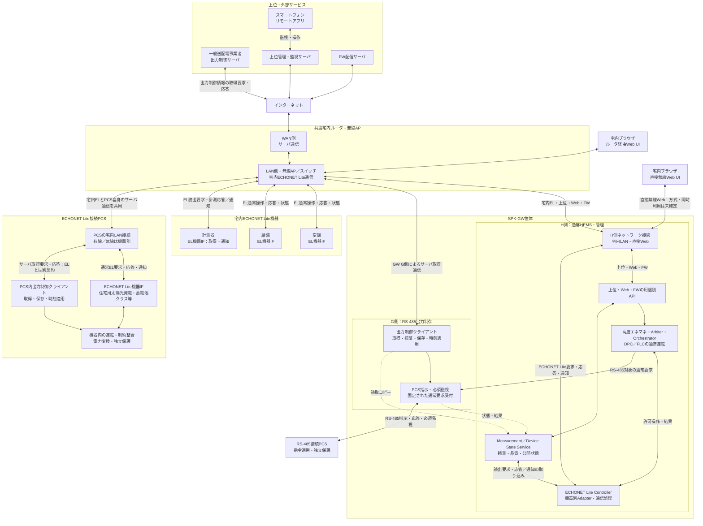

本図の宅内ルータは、**LAN側のスイッチ・無線APと、WAN側のインターネット接続を分けて表示**している。宅内EL通信はLAN側で各機器へ到達する経路であり、出力制御サーバや上位クラウドを経由しない。全ELフレームのIPルーティングを義務付ける図ではない。NIC数、無線／有線、物理ポート、共有スタック・OS配置は未確定である。

**出力制御サーバとPCS又はGWが、宅内ルータを飛び越えて接続する経路はない。** EL接続PCSの自律取得では、GWを取得代理にも必須IP転送器にも使わない。ルータは通信中継だけを担い、スケジュールの検証・保存・適用責任はPCS又はGW G側に残る。

端末–GWの直接無線Webは、通常EL機器接続とは別のローカル経路である。出力制御サーバのルータ非経由回線でも、全EL機器をGWの直接無線へ収容する構成でもない。SoftAP／Wi-Fi Direct、AP＋STA同時動作、Web資産の配置はSYS-TBD-014／015で確認する。

### 2.1.2 H側ECHONET Lite Controllerから各機器への接続拡大

[拡大表示用SVG](diagrams/02_01_EL_Connections.svg)／[PNG](diagrams/02_01_EL_Connections.png)／[編集用Mermaid](diagrams/02_01_EL_Connections.mmd)

**図のDPC／FLC入力は、通常運転の受付・Arbiter・Orchestratorで許可された要求である。** ここでは上位の調停経路を省略し、機器への送受信経路に焦点を当てる。Measurement／Device State Serviceは計測取得・品質管理の担当であり、計測器をFLC配下の運転Actuatorとして扱わない。

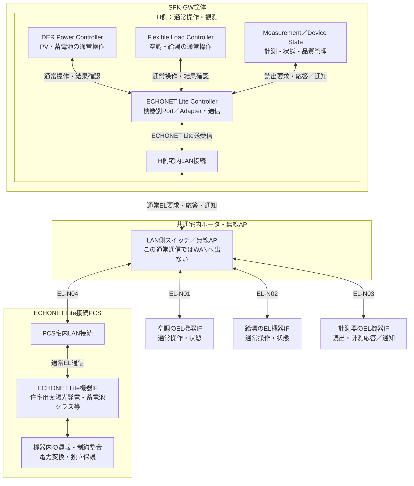

「ECHONET Lite Controller」は通信上のController役割を示す。DPC・FLC・Measurementから利用される機器別Port／Adapterと通信処理の論理的なまとまりであり、単一プロセス・単一ソケット・専用NICへの集約を確定しない。Controller側の通信応答・通知は、要求の相関・対象機器を確認して、DPC／FLCの結果確認及びMeasurement／Device Stateの観測取り込みへ戻す。

この拡大図は宅内の通常EL通信だけを示す。PCS内出力制御クライアントとサーバへの別経路は図2.1.1及び経路表のGRID-EL-PCSを参照する。

PCSの箱は一つの物理構成の例である。「住宅用太陽光発電クラス」「蓄電池クラス」は公開され得る論理機器クラスであり、その数だけ独立PCSが存在する、全PCSが両クラスを公開する、全プロパティに対応するという意味ではない。物理機器・EOJ・resource・conversion_groupの対応は[第04章](#ch-04)で管理する。

### 2.1.3 通信経路と担当責務の対応

下表のELはECHONET Liteを指す。応答は要求と逆方向、機器が対応する通知は機器から同じ宅内接続を通ってControllerへ届く。全機器に通知機能や書込み能力があるとは仮定しない。

| 経路ID | 対象・用途 | H側の意味的な担当 | 要求の往路 | 応答・通知と結果の戻り先 |
|---|---|---|---|---|
| EL-N01 | 空調の通常操作・状態確認 | FLC。観測品質はMeasurement／Device State | FLC → EL Controller → H側LAN接続 → 宅内ルータLAN／AP → 空調EL機器IF | 空調 → 同じ宅内経路を逆順 → EL Controller → FLCの結果確認／観測サービス |
| EL-N02 | 給湯の通常操作・状態確認 | FLC。観測品質はMeasurement／Device State | FLC → EL Controller → H側LAN接続 → 宅内ルータLAN／AP → 給湯EL機器IF | 給湯 → 同じ宅内経路を逆順 → EL Controller → FLCの結果確認／観測サービス |
| EL-N03 | 計測器の読出・計測通知 | Measurement／Device State | 観測サービス → EL Controller → H側LAN接続 → 宅内ルータLAN／AP → 計測器EL機器IF | 計測器 → 同じ宅内経路を逆順 → EL Controller → 観測サービス。DPC/FLCの運転命令とは分ける |
| EL-N04 | PV・蓄電池等のPCS通常操作・状態確認 | DPC。観測品質はMeasurement／Device State | DPC → EL Controller → H側LAN接続 → 宅内ルータLAN／AP → PCSのLAN接続 → PCSのEL機器IF | PCS EL機器IF → 同じ宅内経路を逆順 → EL Controller → DPCの結果確認／観測サービス |
| GRID-EL-PCS | EL接続PCSの出力制御情報取得 | PCS内出力制御クライアント。H側は取得主体でない | PCSクライアント → PCSのLAN接続 → 宅内ルータLAN側 → WAN側 → インターネット → 出力制御サーバ | サーバ → インターネット → ルータWAN側 → LAN側 → PCSのLAN接続 → PCSクライアント。GW非経由 |
| GRID-RS-GW | RS-485接続PCS用の出力制御情報取得 | GW G側 | GW G側 → 宅内ルータLAN側 → WAN側 → インターネット → 出力制御サーバ | サーバ → 同じネットワーク経路を逆順 → GW G側。適用指示・必須監視はRS-485でPCSへ |

**EL-N04とGRID-EL-PCSは、同じPCS・LAN接続・宅内ルータを使っていても別通信である。** EL ControllerはPCS内の出力制御クライアントへスケジュールを代理取得・転送しない。PCSの通常EL応答を受信できたことだけで、PCS自身のサーバ取得成功やスケジュール適用を判定しない。

この対応表を機械可読化したものは[通常EL経路台帳](data/echonet_normal_routes.json)。既存の[出力制御経路台帳](data/grid_network_routes.json)はR4から変更しない。公開プロパティ、通信頻度、媒体、宛先、認証・暗号化方式は既存プロファイル／TBDに従い、本改訂では新たに決定しない。

## 2.2 経路・役割・現在の対応範囲

| 接続用途 | 通信経路 | アプリケーション責任主体 |
|---|---|---|
| EL接続PCSの出力制御情報取得 | PCS → 宅内ルータ → インターネット → 出力制御サーバ。応答は逆順 | PCS内の出力制御機能。GWは非経由 |
| RS-485接続PCS用の情報取得 | GW G側 → 宅内ルータ → インターネット → 出力制御サーバ。応答は逆順 | GW G側 |
| RS-485接続PCSへの出力指示 | GW G側 → RS-485 → PCS。状態・応答は逆順 | G側の必須指令・監視とPCS機器制御 |
| 空調・給湯の通常操作・観測 | H側FLC ↔ EL Controller ↔ H側LAN接続 ↔ 宅内ルータLAN／AP ↔ 空調・給湯のEL機器IF | FLC・EL Adapter／Controller・機器側通常受付 |
| 計測器の読出・計測通知 | H側Measurement／Device State ↔ EL Controller ↔ H側LAN接続 ↔ 宅内ルータLAN／AP ↔ 計測器のEL機器IF | 観測サービス・EL Adapter／Controller・計測器 |
| EL接続PCSの通常操作・観測 | H側DPC ↔ EL Controller ↔ H側LAN接続 ↔ 宅内ルータLAN／AP ↔ PCSのLAN接続 ↔ PCSのEL機器IF | DPC・EL Adapter／Controller・機器側通常受付 |
| 上位監視・設定・内部機能操作 | GW H側 ↔ 宅内ルータ ↔ インターネット ↔ 上位サーバ | 用途別APIと各状態所有者 |
| FW配信 | GW更新機能 ↔ 宅内ルータ ↔ インターネット ↔ FWサーバ | 配布・検証・適用を別責務化 |
| 宅内Web | 端末 ↔ GW直接無線、又は端末 ↔ 宅内ルータ ↔ GW | Local Web／ローカル認可 |
| リモートアプリ | スマートフォン ↔ クラウド ↔ インターネット ↔ 宅内ルータ ↔ GW | クラウドとGW用途別API |

通常EL通信とPCSサーバ通信は、同じ物理NIC・ルータを使う場合でも別契約である。サーバ通信がECHONET Liteそのものであるとは規定しない。PCSネットワーク接続の存在、クラス検出、通常Setの成功だけで、独立したサーバ取得・保存・適用が確認できたとしない。

| 外部要素 | 追加・維持する責任境界 |
|---|---|
| 一般送配電事業者サーバ | 取得対象のスケジュール情報。H側通常APIの権限には統合しない |
| FW配信サーバ | 配布物とメタデータ。配信成功を適用許可としない |
| 上位管理・監視サーバ | 許可設定・内部操作・状態公開・アプリ仲介。任意shell／DB／保護設定を開放しない |
| 宅内Web UI／アプリ | 操作受付・達成・設定反映・不明を区別。同一LANだから管理者とはしない |
| 宅内ルータ／AP | 全出力制御取得経路の共通依存。停止・混雑・設定変更時の挙動を評価する |

メーカーの上位クラウドとFW配信サーバの物理共置を禁止しないが、役割・権限・配布承認・障害・更新の責任は区別する。ルータ障害対策として別回線、GW代理取得、テザリング、自動方式切替を暗黙に追加しない。

## 2.3 GW内の用途別経路

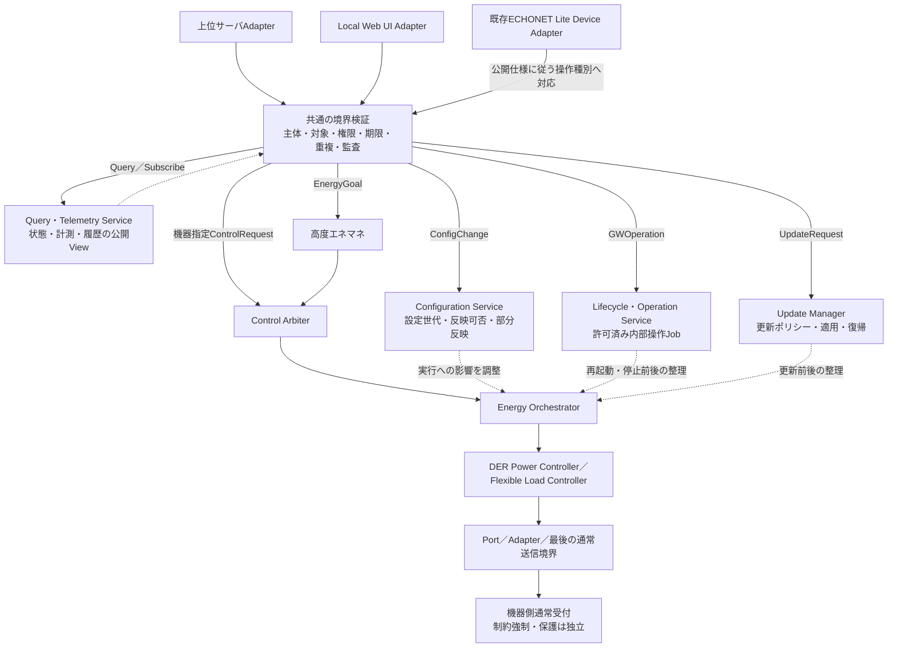

QueryはArbiterやDPCの運転権を取得する操作ではない。必要時の実機再取得は、取得能力・優先度・頻度を持つ観測契約で処理する。内部操作が機器を運転させる場合、その部分だけを通常運転のArbiter→Orchestrator経路へ委譲する。設定変更と更新は各所有者で認可・状態遷移を管理し、運転との資源競合を協調する。ここでも箱は論理責務であり、専用プロセスの追加を義務付けない。

## 2.4 独立する制御責務

| 経路 | 適用責務 | H側の役割 |
|---|---|---|
| 通常運転 | 受付 → 必要ならEMS → Arbiter → Orchestrator → DPC/FLC → Adapter／固定通常受付 | 制御要求・結果・観測 |
| EL接続PCSの出力制御 | PCS内の取得・時刻・保存・適用 → 機器制約 | 読取可能情報だけを参照。代理取得・適用しない |
| RS-485接続PCSの出力制御 | GW G側の取得・管理・適用 → RS-485 → PCS | 固定された通常要求・読取コピーだけ |
| 系統連系保護 | 必要な独立計測 → 機器側保護・解列・規定復帰 | 保護の承認を行わない |

## 2.5 RS-485経路の確定点と残る設計

今回、RS-485接続PCSの出力制御はGW管理方式へ配賦する。必須指示・必要監視を含むため、全経路をNORMAL_OPERATION_ONLYとすることはできない。通常通信との共用方法、送信所有者、電文、CPU／OS／driver、再初期化・更新範囲は未確定である。既存実装がG側非干渉要件を満たすという実績ではない。

GWがRS-485 PCSを仮想ELオブジェクトとして外部公開しても、実PCSの通信経路・取得主体を変更しない。両IFを備える物理PCSは接続プロファイルで選択済み経路と取得主体を確認する。検出順序で自動分類しない。

## 2.6 IF・識別子・互換性

IF-GRID-01に宅内ルータ必須と機器接続別の取得主体を明示する。IF-GRID-02は本構成のGW G側–RS-485 PCSの必須指令・監視契約。IF-EL-01は通常の機器操作・観測であり、サーバ取得とは分離する。R3のPCS_DIRECT識別子は保持するが、表示名は「PCS自律取得方式（宅内ルータ経由・GW非経由）」とする。

[外部IF台帳](#ap-external-interface-register)、[第21章](#ch-21)、[R4経路データ](data/grid_network_routes.json)を同時に適用する。新しいプロトコル、ポート、TLS設定等はこの変更から推定しない。

## 2.7 ルータ共有の障害範囲

GW非経由とはGW障害からの責務・経路分離であり、ルータやWANまで別系統という意味ではない。WAN断ではLANが残る場合と、ルータ全停止でLAN/APも失う場合を分ける。RS-485はルータを介さない機器間リンクだが、GW・PCS電源と実装が健全な条件でのみ継続できる。保持済みスケジュール、有効期限、時刻、必須通信異常の動作は[第13章](#ch-13)と第21章で定義する。

<!-- R6:COMPLETION_ITEMS -->

> **R6の補完範囲：** 以下はレビューA1から追加した章節項の記入枠であり、数値・機種・機能採否・個別規格適用を推定した確定仕様ではない。各項末のリンクから、本章末尾の具体的な質問・必要資料・確定時点を確認できる。

**記入先・関連する規範候補別冊：** [外部・内部IF契約の具体化項目](#ap-interface-contract-detail) ／ [機器プロファイル拡張テンプレート](#ap-device-profile-extended)

## 2.8 設置コンテキストの適用条件

### 2.8.1 実ネットワークと接続先の実体

**補完項目ID：** `SLOT-R6-02-01`。**対応観点：** C04, C12（[レビューA1](sources/review/R5_Coverage_Review_A1.md)）。

全出力制御サーバ通信は宅内ルータ経由。EL接続PCSは自律取得、RS-485接続PCSはGW G側管理というR5条件を維持する。

**本項に記載する仕様項目：**

- 宅内ルータLAN/WANとGW H/G・PCSの接続。
- 有線/無線・同一LAN・発見条件。
- 上位とFW配信の事業主体・停止範囲。

**本項の完成判定：** 設置配線・ネットワークプロファイルとサービス責任表を確定し、R5の図の各端点を実接続先に対応付ける。

**具体的な不足：** [OQ-R6-02-01](#oq-r6-02-01)。採用値・参照版・対象外理由は回答後に本項又は版指定の規範別冊へ反映する。

### 2.8.2 宅内直接Webとルータ接続の成立条件

**補完項目ID：** `SLOT-R6-02-02`。**対応観点：** C02, C12, C24（[レビューA1](sources/review/R5_Coverage_Review_A1.md)）。

R5の既存原則は保持するが、この項の全対象・具体条件・規範参照は未確定。

**本項に記載する仕様項目：**

- 直接無線方式・AP/STA能力。
- Web資産の配置・名前解決。
- 同時稼働・WAN断・LAN断の利用可能範囲。

**本項の完成判定：** 直接接続/宅内ルータ/リモートの構成別機能表と到達・再接続の確認方法を定義する。

**具体的な不足：** [OQ-R6-02-02](#oq-r6-02-02)。採用値・参照版・対象外理由は回答後に本項又は版指定の規範別冊へ反映する。

<!-- R6:OPEN_QUESTIONS -->

## Open Questions — 本ノートを完成させるための未決事項

以下は本章の具体的な未決事項。**担当者・回答期限の日付・採用値・承認結果は未確定**である。担当ロールと確定ゲートは提案。回答を得ただけでは閉じず、根拠確認・決定・本文と関連台帳への反映を行う。
全体索引：[Open Question横断台帳](#ap-open-question-register)。各質問の編集正本は[data/completion_items.json](data/completion_items.json)。

### OQ-R6-02-01 — 実ネットワークと接続先の実体

**対象項：** [2.8.1 実ネットワークと接続先の実体](#slot-r6-02-01)

**質問：** 対象住宅のGW H/G、EL接続PCS、通常EL機器はどのLAN・AP・有線ポートへ接続するか。ルータの必要条件と外部サービスの運用責任は何か。

**必要資料・完了条件：** 設置配線・ネットワークプロファイルとサービス責任表を確定し、R5の図の各端点を実接続先に対応付ける。

**決定担当：** 未割当（候補：ネットワーク・製品運用・施工設計）。承認者：未定。

**確定時点：** G1＝該当するアーキテクチャ・HW・安全境界の設計固定前（提案）。回答期限の日付：未定。

**未解決時の制約：** 「実ネットワークと接続先の実体」を対象構成の確定保証・実装受入根拠として使用しない。

**既存ID：** SYS-TBD-012, SYS-TBD-031, PAR-GNET-01。

**状態：** OPEN。**回答：** 未記入。**決定記録：** 未記入。

### OQ-R6-02-02 — 宅内直接Webとルータ接続の成立条件

**対象項：** [2.8.2 宅内直接Webとルータ接続の成立条件](#slot-r6-02-02)

**質問：** 直接無線Webはどの無線方式を使うか。ルータ接続と同時利用できるか。クラウド断でも利用できる画面と認証条件は何か。

**必要資料・完了条件：** 直接接続/宅内ルータ/リモートの構成別機能表と到達・再接続の確認方法を定義する。

**決定担当：** 未割当（候補：無線・Web・セキュリティ設計）。承認者：未定。

**確定時点：** G1＝該当するアーキテクチャ・HW・安全境界の設計固定前（提案）。回答期限の日付：未定。

**未解決時の制約：** 「宅内直接Webとルータ接続の成立条件」を対象構成の確定保証・実装受入根拠として使用しない。

**既存ID：** SYS-TBD-014, SYS-TBD-015, PAR-UP-08。

**状態：** OPEN。**回答：** 未記入。**決定記録：** 未記入。

---

# 03. 責務・レイヤー・状態所有権

根拠：[02_Responsibilities.md](sources/architecture/02_Responsibilities.md) ／ [09_Risks_Alternatives.md](sources/architecture/09_Risks_Alternatives.md) ／ [11_Migration_Decisions.md](sources/architecture/11_Migration_Decisions.md)。ユーザー明示事項・本書の具体化案は本文で区別する。

## 3.1 責務契約

| 要素 | 担当 | 担当外 |
|---|---|---|
| Cloud／UI／外部HEMS Adapter | 認証情報、形式変換、公開応答・通知 | 機器直接送信、制約解除 |
| 要求受付Usecase | actorの操作権限、期限、重複、形式、対象確認 | 家庭全体の最適化、最終出力強制 |
| 高度エネマネ | 予測、計画案、費用・快適性・SoC等の評価と再計画 | 通常制御権を飛び越えた機器操作 |
| Control Arbiter | 通常運転の採否・優先関係・Lease・競合scope・epoch | 電力会社スケジュール原本、系統保護 |
| Energy Orchestrator | 許可後の計画進行、順序・並行度、部分失敗、再計画連携 | 電文解析、個別機器の保護判定 |
| DER Power Controller | 能力確認、状態遷移、DER操作系列、要求と観測の照合 | 家庭全体の目標配分、G側設定変更 |
| Flexible Load Controller | 充電専用EV・給湯・空調等の操作・状態確認 | 発電側出力制御の唯一の成立責任 |
| Measurement／Device State Service | HEMS用観測の正規化・品質・鮮度・集約 | G側必須計測の唯一の提供者 |
| Device Adapter／Transport | 機器差分、プロトコル変換、トランザクション・送信境界検査 | actor別の独自優先順位・代替計画 |
| 機器側通常受付・運転制御 | 受けた要求を機器・系統制約内で実行 | HEMSの経済計画の代行 |
| 出力制御ユニット／系統連系保護 | 添付のそれぞれの独立責務 | HEMSの応答待ち |

通常の発電抑制要求などが機器の確認済みAPIに含まれることはあるが、電力会社スケジュール原本の変更とは区別する。DER Power Controllerは「すべての機器を最終制御するController」ではない。

## 3.2 状態の正本

| 状態 | 所有者 | 他要素の利用 |
|---|---|---|
| 計画案・評価モデル | 高度エネマネ | 許可された計画の実行はOrchestratorへ |
| 通常制御権・Lease・epoch | Control Arbiter | 送信前確認に使う |
| 採用されたEnergy Planと進行 | Energy Orchestrator | DPC等は担当ステップ結果を報告 |
| 個別DER実行状態 | DER Power Controller | 上位はイベント／読出しで参照 |
| 通信トランザクション | Adapter／Transport | 意味的結果へ変換 |
| HEMS用観測値・品質 | Measurement／Device State Service | 計画・表示は鮮度を考慮 |
| スケジュール原本 | 出力制御ユニット | HEMSはコピー又は公開状態のみ |
| 保護設定・保護状態 | 適用される機器側 | HEMSから変更しない |
| 実際の機器状態 | 実機 | キャッシュが実機の正本になることはない |

## 3.3 一意性と分散配置

同一resource／競合するconversion_groupに対し、一つの論理的権威と現在有効な実行系列を定める。Arbiterの論理的一元性は、全処理を一つのCOREプロセスへ置く要求ではない。資源群ごとに配置するなら重複scopeと権威移譲を規定する。

Orchestratorはワークフロー、DPCは資源の操作系列、Transportは通信再送を所有する。各層で同じ失敗を独立に無制限リトライ・補償しない。別機器への代替は上位再計画として処理する。

## 3.4 Blackboard・既存構造

BlackboardはStateRepository等のPortの背後に置く。State更新とCommand発行を分離し、共有変数の書換えだけで暗黙の機器Setを発生させない。既存実装にその経路がある場合、移行対象の書込み点として記録する。

レイヤーは依存方向を示す。DomainはLinux、ECHONET Lite、RS-485電文、Blackboardの具体実装に依存させず、Adapterで接続する。これは本書で全プロセス構成を確定することを意味しない。

## 3.5 設定調停との区別

通常運転要求の競合調停と、設定変更の可否・反映タイミングの調停は別責務とする。状態変更を伴う設定は更新可能状態と設定世代を確認する。重大障害への対応も独立した復旧Usecaseとして認可し、通常設定のpriorityを上げて保護設定を書き換える経路にしない。

## 3.6 R2追加：北向き管理の論理責務と状態正本

| 責務案 | 所有する情報・進行 | 所有しないもの |
|---|---|---|
| Local Web UI Service | 画面資産・ローカルセッション・API変換 | 通常制御権・実機状態の正本 |
| Upper Server Adapter | 認証済み接続・配送相関・有限な再接続 | 利用者の自己申告priority・万能管理権 |
| Query・Telemetry Service | 公開View・アクセス範囲・購読・品質 | 実機・設定所有者の原本そのもの |
| Configuration Service | 要求／保存／有効設定版、反映進行 | 保護設定等のG側原本 |
| Lifecycle・Operation Service | 許可内部操作Job、前提・競合・完了 | 任意shell、G側への無認可リセット |
| Update Manager | 対象配布物、適用可否、更新Job、稼働確認・復旧 | 配信サーバからの無制限な領域書込み |

これらは既存のCore／各プロセスへ配賦し得る論理責務であり、新しいプロセス数を確定しない。エネルギー計画はEnergy Orchestrator、設定は設定調停、内部操作・更新は各ライフサイクル所有者が進行を持つ。相互に影響するscopeについて実行枠と手順を協調し、全部の操作をDPCへ集めない。

クラウドの希望値・履歴とGWで現在有効な設定／状態は別であり、Webとアプリは同じ公開意味論を使う。詳細は[第20章](#ch-20)。

## 3.7 R3導入・R4適用：出力制御所有者の選択

スケジュール原本・適用状態の正本は、PCS_DIRECTではPCS内出力制御機能、GW_MANAGEDではGW G側である。H側のDPC／Measurement Service／Query Serviceが正本になるのではない。G側の取得・保存・時計・制約適用・PCS通信・必須監視は一続きの責務として配賦する。

制御scopeと接続方式のbinding、切替Job、grid_control_epochの有効状態は独立した系統構成管理の所有者が持つ。通常Arbiterのepochとは別名前空間にする。上位管理・Web・アプリは認可された読取コピーを表示する。保護責務は選択で移動しない。

## 3.8 R4：宅内ルータの責務と取得所有者

ルータは全サーバ取得通信の経由点であり、スケジュール所有者ではない。EL接続PCSはPCS内機能、RS-485接続PCSはGW G側が原本を所有する。GW H側は両方の読取Viewを集約できるが、EL接続PCS用の代理取得者にならない。

## 3.9 R5：通常EL通信の共通窓口と意味的担当

DPCはPV・蓄電池等の通常操作、FLCは空調・給湯等の通常操作、Measurement／Device State Serviceは計測・状態の取得と品質管理を担当する。これらが利用するECHONET Lite Controller／機器別Adapterと、H側LAN接続・宅内ルータ・実機IFの往復経路を[第2.1節](#fig-02-01-el)に明示した。通信Controllerは運転優先度や出力制御スケジュールの所有者ではない。

<!-- R6:COMPLETION_ITEMS -->

> **R6の補完範囲：** 以下はレビューA1から追加した章節項の記入枠であり、数値・機種・機能採否・個別規格適用を推定した確定仕様ではない。各項末のリンクから、本章末尾の具体的な質問・必要資料・確定時点を確認できる。

**記入先・関連する規範候補別冊：** [外部・内部IF契約の具体化項目](#ap-interface-contract-detail) ／ [配置・通信所有の台帳テンプレート](#ap-deployment-binding)

## 3.10 責務の規範配賦と内部IF

### 3.10.1 実装配賦・状態所有者一覧

**補完項目ID：** `SLOT-R6-03-01`。**対応観点：** C06, C13（[レビューA1](sources/review/R5_Coverage_Review_A1.md)）。

R5の既存原則は保持するが、この項の全対象・具体条件・規範参照は未確定。

**本項に記載する仕様項目：**

- 論理責務→既存プロセス/新規モジュール。
- 正本の更新主体・参照先。
- 起動依存・故障/再起動範囲。

**本項の完成判定：** 論理責務・状態正本・実装配賦表と全実機書込点の対応をレビューする。全責務のCore集約は前提にしない。

**具体的な不足：** [OQ-R6-03-01](#oq-r6-03-01)。採用値・参照版・対象外理由は回答後に本項又は版指定の規範別冊へ反映する。

### 3.10.2 H内・H/G境界契約の具体項目

**補完項目ID：** `SLOT-R6-03-02`。**対応観点：** C13（[レビューA1](sources/review/R5_Coverage_Review_A1.md)）。

R5の既存原則は保持するが、この項の全対象・具体条件・規範参照は未確定。

**本項に記載する仕様項目：**

- メッセージの必須/任意・型・世代。
- 認可・期限・エラー・互換性。
- キュー・応答・再起動中の扱い。

**本項の完成判定：** Internal IF契約を操作単位で埋め、正規/不正/過負荷/再起動の契約試験条件を定義する。

**具体的な不足：** [OQ-R6-03-02](#oq-r6-03-02)。採用値・参照版・対象外理由は回答後に本項又は版指定の規範別冊へ反映する。

<!-- R6:OPEN_QUESTIONS -->

## Open Questions — 本ノートを完成させるための未決事項

以下は本章の具体的な未決事項。**担当者・回答期限の日付・採用値・承認結果は未確定**である。担当ロールと確定ゲートは提案。回答を得ただけでは閉じず、根拠確認・決定・本文と関連台帳への反映を行う。
全体索引：[Open Question横断台帳](#ap-open-question-register)。各質問の編集正本は[data/completion_items.json](data/completion_items.json)。

### OQ-R6-03-01 — 実装配賦・状態所有者一覧

**対象項：** [3.10.1 実装配賦・状態所有者一覧](#slot-r6-03-01)

**質問：** Arbiter、Orchestrator、DPC/FLC、Measurement、設定・更新・G側を誰が実装し、どの状態の唯一の更新者となるか。既存Core以外の処理はどこへ配賦するか。

**必要資料・完了条件：** 論理責務・状態正本・実装配賦表と全実機書込点の対応をレビューする。全責務のCore集約は前提にしない。

**決定担当：** 未割当（候補：システム・ソフト構造設計）。承認者：未定。

**確定時点：** G1＝該当するアーキテクチャ・HW・安全境界の設計固定前（提案）。回答期限の日付：未定。

**未解決時の制約：** 「実装配賦・状態所有者一覧」を対象構成の確定保証・実装受入根拠として使用しない。

**既存ID：** TBD-010, SYS-TBD-001。

**状態：** OPEN。**回答：** 未記入。**決定記録：** 未記入。

### OQ-R6-03-02 — H内・H/G境界契約の具体項目

**対象項：** [3.10.2 H内・H/G境界契約の具体項目](#slot-r6-03-02)

**質問：** H内及びH/G APIの必須項目、エラー体系、旧版互換、頻度・キュー上限をどの契約に固定するか。G側が受ける通常要求の許可リストは何か。

**必要資料・完了条件：** Internal IF契約を操作単位で埋め、正規/不正/過負荷/再起動の契約試験条件を定義する。

**決定担当：** 未割当（候補：ソフトIF設計・G側設計）。承認者：未定。

**確定時点：** G2＝該当するIF・データ・操作等の詳細契約確定前（提案）。回答期限の日付：未定。

**未解決時の制約：** 「H内・H/G境界契約の具体項目」を対象構成の確定保証・実装受入根拠として使用しない。

**既存ID：** TBD-002, TBD-011, SYS-TBD-025, PAR-ISO-01。

**状態：** OPEN。**回答：** 未記入。**決定記録：** 未記入。

---

# 04. 製品構成・機器分類・接続プロファイル

根拠：[05_Device_Classes.md](sources/architecture/05_Device_Classes.md) ／ [06_Contracts.md](sources/architecture/06_Contracts.md) ／ [templates/Device_Profile.md](sources/architecture/templates/Device_Profile.md)。ユーザー明示事項・本書の具体化案は本文で区別する。

## 4.1 分類軸を分離する

| 軸 | 管理対象 | 他軸から自動決定しない事項 |
|---|---|---|
| 製品・配備 | HW、H/G版、PCS_DIRECT／GW_MANAGED、CPU配置、接続構成 | 認証・動作保証 |
| 通信 | RS-485の接続先／通信仕様、ECHONET Liteクラス・EOJ・版 | 全操作対応、電力会社の対象 |
| Capability | 実際の操作・値域・間隔・結果確認能力 | クラス名だけからの推測 |
| 系統・契約 | 設備範囲、連系点、容量の根拠、制御方式 | 一律の全国ルール |
| 認証構成 | 型式、装置、計測、FW、操作範囲、登録主体 | 任意GWとの組合せ適合 |
| 実行時状態 | 有効設定、接続、健全性、観測鮮度、制御権 | 不在・無効・障害を同じOFFにしない |

## 4.2 機器群と責務

PV・蓄電池・EV充放電器等のDER操作はDPC、充電専用EV・給湯・空調等はFlexible Load Controller、メータはMeasurement Serviceを基本とする。燃料電池・CHP・風力・周波数制御等は添付の候補／条件付き拡張をそのまま保持し、初回リリースの必須機能へ昇格しない。

クラスコードの一覧は原文05_Device_Classes.mdを参照する。本書では重複した「最新版クラス表」を別管理しない。RS-485機器にEOJの存在を要求せず、ECHONET Lite機器にRS-485アドレスを要求しない。

## 4.3 識別と共有資源

`physical_device_id`、`resource_id`、`conversion_group_id`、`connection_point_id`、通信endpointを別に持つ。同一Hybrid PCSのPV・蓄電池・PCSオブジェクトを三台の独立変換器として管理しない。容量、排他、計測集計は適切なscopeへ結び付ける。

本書での追加案として、通信endpointに`route_id`を設ける。複数経路で見える同一物理機器には、同一性を確認した根拠を保持する。探索結果だけで同一と推定して統合したり、別機器として二重制御したりしない。

## 4.4 接続プロファイルの最小内容

| 項目 | 共通 | RS-485固有／ECHONET Lite固有 |
|---|---|---|
| Identity | メーカー・型式・HW/FW・物理／論理資源 | バス・ポート・局番／ノード・EOJ |
| Protocol | 採用文書・版 | PCS通信仕様の名称／Lite・APPENDIX・AIFの実装版 |
| Operation | 意味・単位・符号・許可状態・頻度 | 電文・レジスタ／プロパティと操作系列 |
| Observation | 計測点・品質・時刻・更新間隔 | 取得手順・通知・読み戻し |
| Authority | scope・外部操作元・機器側排他 | 送信所有者と経路共存 |
| Expiry | 受付期限・機器内保持・解除 | 機器側タイムアウト／未対応の別 |
| Grid | 適用対象・強制所有者・通常API非迂回根拠 | route_role、機器内又は外付けの出力制御構成 |
| Certification | 登録主体・構成・適用版・確認記録 | 確認済みの接続組合せ |
| Evaluation | 資料確認・シミュレータ・実機・対応判定 | 未実施をNOT_RUNとする |

## 4.5 RS-485経路の分類：本書の具体化案

| route_role | 意味 | 配置・更新判断 |
|---|---|---|
| NORMAL_OPERATION_ONLY | HEMSの通常操作・観測だけを担う | RS-485接続PCSはGW_MANAGEDに限定する。機器が通常専用チャネルと必須系統チャネルを独立提供する場合だけ、通常チャネルの分離配置を第15.7節に従って評価する。必須経路全体を通常専用に分類しない |
| GRID_CONTROL_REQUIRED | 出力制御成立に必要な機器通信 | 通常HEMSの停止・更新に依存させない配置を評価 |
| SHARED_REQUIRES_REVIEW | 通常通信と必須系統通信を共用 | 固定所有者・資源予約・再起動範囲を確認。接続方式の選択だけで非干渉を自動認定しない |
| UNKNOWN | 実態未調査 | 認証影響分離・通常更新可の根拠に使わない |

この列挙は規格用語ではなく本書の台帳方式である。`UNKNOWN`から自動でNORMAL_OPERATION_ONLYへ移行しない。通信断試験の注入位置もこの分類と接続図へ結び付ける。

## 4.6 適用判定と不足情報

`GridApplicability = APPLICABLE / NOT_APPLICABLE / UNKNOWN`を添付どおり保持する。UNKNOWNの内容に応じ、読取専用や確認済みの限定操作へ縮退するが、一律に停止指令を送らない。停止自体が適切かも機器・用途で確認する。

初期接続型式、対応する高度エネマネ戦略、性能値、G側配置、認証登録範囲は未確定。製品構成ごとのサポート表を埋めるまで全組合せ対応を宣言しない。

## 4.7 R2追加：接続・サービス適用プロファイル

LOCAL_DIRECT、LOCAL_ROUTER、REMOTE_CLOUD、FW_DELIVERYを別の適用軸とする。AP／STA同時動作、直接接続方式、クラウド／FWサーバの同一基盤配置、アプリのローカル切替は未確定である。機器プロファイルと同様に、製品HW/FW、Web/API版、クラウドサービス版、アプリ互換、認可、接続開始方向、IPv4／IPv6と公開ポートの有無を対応付ける。

直接無線接続機能の搭載、有効設定、現在接続、インターネット到達、上位同期を別状態として管理する。詳細は[第02章](#ch-02)及び[IF台帳](#ap-external-interface-register)。

## 4.8 R3導入・R4適用：出力制御接続プロファイル

`grid_connection_mode`はEL接続PCS=PCS_DIRECT、RS-485接続PCS=GW_MANAGEDというR4の対応表で限定する。概念上は異なる属性だが、通信構成と方式の組合せは独立に自由選択できない。G側実配置、GridApplicability、CPU配置、通常HEMS有効設定は別途管理する。未設定はUNCONFIGUREDとして状態管理し、有効な接続方式値に自動変換しない。

設定単位は対象設備・変換グループ・連系点等の制約scopeで定義する案とし、同一scopeのスケジュール適用主体は一つにする。複数scopeの混在も、共通PCS・共通連系点で重複する制約／容量配分を評価したプロファイルに限る。詳細は[方式選択章](#ch-21)。

## 4.9 R4：物理機器と多重IFの分類

EL接続PCSだけがGW非経由取得の対象である。単なるELプロパティ検出、GWのDevice側による仮想公開、RS-485機器のEL表現を独立PCS取得とみなさない。両IF機器は物理ID・選択済み接続・scope・取得能力の確認でbindingを決める。R3設定はR4適用表で再評価する。

<!-- R6:COMPLETION_ITEMS -->

> **R6の補完範囲：** 以下はレビューA1から追加した章節項の記入枠であり、数値・機種・機能採否・個別規格適用を推定した確定仕様ではない。各項末のリンクから、本章末尾の具体的な質問・必要資料・確定時点を確認できる。

**記入先・関連する規範候補別冊：** [製品全機能・構成マトリクス](#ap-product-function-matrix) ／ [機器プロファイル拡張テンプレート](#ap-device-profile-extended)

## 4.10 製品全機能・対応構成マトリクス

### 4.10.1 既存・追加・変更・廃止機能の母集団

**補完項目ID：** `SLOT-R6-04-01`。**対応観点：** C04, C05（[レビューA1](sources/review/R5_Coverage_Review_A1.md)）。

R5の既存原則は保持するが、この項の全対象・具体条件・規範参照は未確定。

**本項に記載する仕様項目：**

- 機能ID・目的・根拠USDM。
- 変更区分と採用区分。
- Legacy/Next・HW/FW・機器・通信の適用。

**本項の完成判定：** 機能一覧を既存仕様・コード調査と突合し、候補機能の採否・対象リリース・非対応理由を機能表で承認する。

**具体的な不足：** [OQ-R6-04-01](#oq-r6-04-01)。採用値・参照版・対象外理由は回答後に本項又は版指定の規範別冊へ反映する。

### 4.10.2 機器・ソフトウェア・接続の対応組合せ

**補完項目ID：** `SLOT-R6-04-02`。**対応観点：** C04, C10（[レビューA1](sources/review/R5_Coverage_Review_A1.md)）。

R5の既存原則は保持するが、この項の全対象・具体条件・規範参照は未確定。

**本項に記載する仕様項目：**

- メーカー・型式・HW/FW。
- 読み書き能力・台数・必要計測。
- 認証構成と対象外組合せ。

**本項の完成判定：** 機器プロファイルと製品構成表に実型式・版・操作・制限・確認資料を登録する。

**具体的な不足：** [OQ-R6-04-02](#oq-r6-04-02)。採用値・参照版・対象外理由は回答後に本項又は版指定の規範別冊へ反映する。

## 4.11 探索・登録・接続能力のライフサイクル

### 4.11.1 探索・登録・解除・交換・同一性

**補完項目ID：** `SLOT-R6-04-03`。**対応観点：** C10, C34（[レビューA1](sources/review/R5_Coverage_Review_A1.md)）。

R5の既存原則は保持するが、この項の全対象・具体条件・規範参照は未確定。

**本項に記載する仕様項目：**

- 探索契機・周期・登録承認。
- 局番/EOJ変化・重複・多重IF。
- 交換・解除時の権威/履歴/接続の処理。

**本項の完成判定：** 探索/登録/交換/解除のUCと重複判定・書込解禁条件を定義し、旧設定移行の判定例を用意する。

**具体的な不足：** [OQ-R6-04-03](#oq-r6-04-03)。採用値・参照版・対象外理由は回答後に本項又は版指定の規範別冊へ反映する。

<!-- R6:OPEN_QUESTIONS -->

## Open Questions — 本ノートを完成させるための未決事項

以下は本章の具体的な未決事項。**担当者・回答期限の日付・採用値・承認結果は未確定**である。担当ロールと確定ゲートは提案。回答を得ただけでは閉じず、根拠確認・決定・本文と関連台帳への反映を行う。
全体索引：[Open Question横断台帳](#ap-open-question-register)。各質問の編集正本は[data/completion_items.json](data/completion_items.json)。

### OQ-R6-04-01 — 既存・追加・変更・廃止機能の母集団

**対象項：** [4.10.1 既存・追加・変更・廃止機能の母集団](#slot-r6-04-01)

**質問：** 既存GWの全機能は何か。高度エネマネ追加後に維持・変更・廃止する機能と初回採用機能はどれか。候補ではなく採用済みとできる根拠は何か。

**必要資料・完了条件：** 機能一覧を既存仕様・コード調査と突合し、候補機能の採否・対象リリース・非対応理由を機能表で承認する。

**決定担当：** 未割当（候補：製品企画・既存製品担当）。承認者：未定。

**確定時点：** G0＝製品スコープ・機能採否・要求Baselineの承認前（提案）。回答期限の日付：未定。

**未解決時の制約：** 「既存・追加・変更・廃止機能の母集団」を対象構成の確定保証・実装受入根拠として使用しない。

**既存ID：** SYS-TBD-005, SYS-TBD-011, TBD-010。

**状態：** OPEN。**回答：** 未記入。**決定記録：** 未記入。

### OQ-R6-04-02 — 機器・ソフトウェア・接続の対応組合せ

**対象項：** [4.10.2 機器・ソフトウェア・接続の対応組合せ](#slot-r6-04-02)

**質問：** 初回対応するPCS・空調・給湯・計測器・USB機器はどの型式/版か。全機能対応、観測のみ、非対応をどの組合せで保証するか。

**必要資料・完了条件：** 機器プロファイルと製品構成表に実型式・版・操作・制限・確認資料を登録する。

**決定担当：** 未割当（候補：機器接続・製品企画）。承認者：未定。

**確定時点：** G1＝該当するアーキテクチャ・HW・安全境界の設計固定前（提案）。回答期限の日付：未定。

**未解決時の制約：** 「機器・ソフトウェア・接続の対応組合せ」を対象構成の確定保証・実装受入根拠として使用しない。

**既存ID：** TBD-001, SYS-TBD-024, SYS-TBD-006。

**状態：** OPEN。**回答：** 未記入。**決定記録：** 未記入。

### OQ-R6-04-03 — 探索・登録・解除・交換・同一性

**対象項：** [4.11.1 探索・登録・解除・交換・同一性](#slot-r6-04-03)

**質問：** 探索した機器をいつ登録し、書込を許すか。交換・アドレス変更・多重IF・GW仮想EL公開をどう識別し、旧要求と履歴を扱うか。

**必要資料・完了条件：** 探索/登録/交換/解除のUCと重複判定・書込解禁条件を定義し、旧設定移行の判定例を用意する。

**決定担当：** 未割当（候補：機器接続・施工・データ設計）。承認者：未定。

**確定時点：** G2＝該当するIF・データ・操作等の詳細契約確定前（提案）。回答期限の日付：未定。

**未解決時の制約：** 「探索・登録・解除・交換・同一性」を対象構成の確定保証・実装受入根拠として使用しない。

**既存ID：** SYS-TBD-007, SYS-TBD-034, SYS-TBD-004。

**状態：** OPEN。**回答：** 未記入。**決定記録：** 未記入。

---

# 05. 通常運転要求・制御権・実行結果の契約

根拠：[06_Contracts.md](sources/architecture/06_Contracts.md) ／ [03_Command_Flows.md](sources/architecture/03_Command_Flows.md) ／ [09_Risks_Alternatives.md](sources/architecture/09_Risks_Alternatives.md)。ユーザー明示事項・本書の具体化案は本文で区別する。

## 5.1 意味論を固定する

添付の`spkgw.control-request/v1`、`spkgw.control-authority/v1`等はDomain契約例であり、標準のECHONET Lite電文ではない。C構造体、IPC、JSON等を確定する前に、操作の意味・対象・単位・符号・期限・権限・結果を固定する。

| 契約 | 必須とする意味 | 備考 |
|---|---|---|
| EnergyGoal | 目的・対象時間・拘束条件・要求元 | 機器配分が必要ならEMSへ |
| ControlRequest | request/correlation、actor、resource/group/PCC、operation、値、期間、idempotency、policy_class | 送信者の数値priorityだけで優先度を決めない |
| ControlAuthority | authority、resource_scope、holder、epoch、期限、許可操作、policy_revision | 最後の共通送信境界でも確認 |
| Capability | 実在する操作、値域、最小更新間隔、失効・理由取得能力、profile | 未確認はUNKNOWN／EXAMPLE扱い |
| ConstraintObservation | source、quantity、scope、基準、上限、有効時刻、品質、強制所有者 | READ_ONLY_MIRROR、原本ではない |
| ExecutionResult | 要求・権威・対象、受理段階、観測条件、達成／制限／未達／不明 | 達成とプロトコル応答を分離 |

具体スキーマの必須項目・列挙・互換性は別レビュー対象である。添付の例示値やIDを製品設定として登録しない。

## 5.2 操作の区別

`REQUEST_ACTIVE_POWER`の目標値、通常運転の電力上限、運転モード、スケジュール要求、解除は意味が異なる。本書の具体化案として、operationと操作プロファイルで区別し、未対応の電力目標を黙って電力上限へ変換して成功にしない。許可された代替がある場合は結果に明示する。

通常APIに保護閾値変更、出力制御解除、スケジュール原本設定、G側時計設定、発電所ID変更、認証側FW書込みを公開しない。モードAPIにも許可リストを持たせ、任意の数値で自立・再連系・系統支援へ移れる仕様にしない。

## 5.3 権威・期限と送信境界

Arbiterの採否判定後にも権威交代は起こり得る。DPCで実行前確認し、最後の共通送信境界でepoch・対象・期限を再確認する。旧世代の待機操作は送信しない。Adapterはこの契約検査を行ってよいが、独自の運転優先ポリシーを作らない。

すでに送信した電文、機器内キュー、機器が保持する設定はGWのepochで完全取消しできるとは限らない。取消し可能範囲を区別し、機器状態を照合して現在の権威で補正する。内部Leaseによるexactly-once又は機器自動停止は保証しない。

外部予定時刻・期限はタイムゾーン付き実時刻、経過時間は単調時計を用いる設計を継承する。再起動時に旧単調時計や旧権威をそのまま復元しない。G側時計は別に管理する。

## 5.4 実行状態

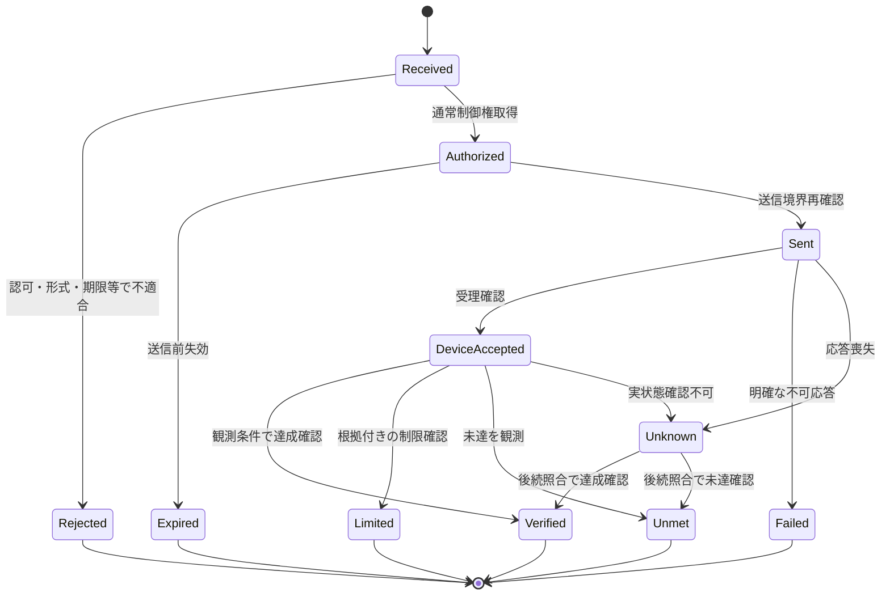

この図は添付のモデルを継承する。Unknownは自動的にFailed／再試行へ落とさない。Unknownの保持期限・手動エスカレーション・未解決終端の形式は本書で勝手に追加確定せず、SYS-TBD-008で決める。

| 区別 | 規定 |
|---|---|
| 受理と達成 | 応答が受理か、反映か、運転到達かを操作ごとに対応付ける |
| Verified | 測定点・許容差・確認窓の条件内での確認。永久達成ではない |
| LimitedとUnmet | 制限理由が取得できた場合のみLimited。低出力から原因を断定しない |
| Expiredと機器停止 | GWの実行権限失効は実機の停止確認ではない |
| Timeoutと不実行 | 応答喪失時に機器が実行済みの可能性を残す |

## 5.5 要求と観測の対応：追加の具体化案

要求値、送信値、読み戻した設定、実運転状態、実測値を分け、値が得られない段階はUNKNOWNとして記録する。単位・符号・時刻基準を各値に結び付ける。相関IDは因果の追跡に用いるが、同時刻に同値が観測されたことだけで他の操作元の関与を否定しない。

通知の重複・順序逆転・遅延応答はrequest/correlation/epochで整合させ、旧応答で旧権威を復活させない。冪等キーの保存期間・再利用条件・再起動後の有効範囲は未確定パラメータとして管理する。

## 5.9 R2追加：上位公開Envelopeと経路区分

上位・ローカルの共通境界ではrequest_id、主体／配送サービス、対象住宅・GW・所属世代、操作種別、scope、期限、idempotency_key、payload/schema版を必要な契約に合わせて検査する。フィールド名は案であり、既存ControlRequestの意味を置き換えない。

通常運転は本章の権威・実行結果へ対応させ、設定・内部操作・情報取得・FW更新は各担当Usecaseへ分ける。要求種類が違ってもG側禁止操作、監査、機器への迂回防止を共有する。クラウド受付／GW受付／機器受理／達成の区別は[第20章](#ch-20)による。

## 5.10 R3導入・R4適用：通常権威と系統構成世代の分離

通常ControlRequestのArbiter epochは、出力制御方式の切替権限を付与しない。GW_MANAGEDのG側はgrid_control_epoch・対象scope・スケジュール版を独立管理し、旧経路からの遅延要求を確認可能な最終境界で拒否する。実PCSがこの世代を理解しない場合は、送信元無効化、キュー処理、機器側設定確認・実状態照合で旧経路をフェンスする。内部番号を追加しただけで実機の排他やexactly-onceを保証しない。

<!-- R6:COMPLETION_ITEMS -->

> **R6の補完範囲：** 以下はレビューA1から追加した章節項の記入枠であり、数値・機種・機能採否・個別規格適用を推定した確定仕様ではない。各項末のリンクから、本章末尾の具体的な質問・必要資料・確定時点を確認できる。

**記入先・関連する規範候補別冊：** [外部・内部IF契約の具体化項目](#ap-interface-contract-detail) ／ [品質・利用目的・ライフサイクル受入の具体化項目](#ap-quality-acceptance-profiles)

## 5.11 操作別の調停と実行確定条件

### 5.11.1 優先関係・同順位・取消し・並行実行

**補完項目ID：** `SLOT-R6-05-01`。**対応観点：** C07, C13（[レビューA1](sources/review/R5_Coverage_Review_A1.md)）。

R5の既存原則は保持するが、この項の全対象・具体条件・規範参照は未確定。

**本項に記載する仕様項目：**

- 主体×操作×競合scope。
- 同順位・部分許可・Lease。
- 取消し・補償・最後の送信境界。

**本項の完成判定：** 通常操作の優先表、同時実行許可表、要求失効と補償の決定表を機器能力と対応付ける。

**具体的な不足：** [OQ-R6-05-01](#oq-r6-05-01)。採用値・参照版・対象外理由は回答後に本項又は版指定の規範別冊へ反映する。

### 5.11.2 結果・確認窓・不明状態の終端

**補完項目ID：** `SLOT-R6-05-02`。**対応観点：** C07, C22（[レビューA1](sources/review/R5_Coverage_Review_A1.md)）。

R5の既存原則は保持するが、この項の全対象・具体条件・規範参照は未確定。

**本項に記載する仕様項目：**

- 受理/送信/機器受理/達成の条件。
- 許容差・評価窓・理由の根拠。
- Unknownの再確認・終端・通知。

**本項の完成判定：** 操作別結果判定表とUnknownの再照合・終端方針を定義し、APIとUIの同一意味を確認する。

**具体的な不足：** [OQ-R6-05-02](#oq-r6-05-02)。採用値・参照版・対象外理由は回答後に本項又は版指定の規範別冊へ反映する。

<!-- R6:OPEN_QUESTIONS -->

## Open Questions — 本ノートを完成させるための未決事項

以下は本章の具体的な未決事項。**担当者・回答期限の日付・採用値・承認結果は未確定**である。担当ロールと確定ゲートは提案。回答を得ただけでは閉じず、根拠確認・決定・本文と関連台帳への反映を行う。
全体索引：[Open Question横断台帳](#ap-open-question-register)。各質問の編集正本は[data/completion_items.json](data/completion_items.json)。

### OQ-R6-05-01 — 優先関係・同順位・取消し・並行実行

**対象項：** [5.11.1 優先関係・同順位・取消し・並行実行](#slot-r6-05-01)

**質問：** 利用者、本体操作、各クラウド、既存運転、高度エネマネが競合するとき、操作別の優先順位と同順位処理をどう決めるか。途中実行の取消しをどこまで保証するか。

**必要資料・完了条件：** 通常操作の優先表、同時実行許可表、要求失効と補償の決定表を機器能力と対応付ける。

**決定担当：** 未割当（候補：制御設計・製品企画）。承認者：未定。

**確定時点：** G2＝該当するIF・データ・操作等の詳細契約確定前（提案）。回答期限の日付：未定。

**未解決時の制約：** 「優先関係・同順位・取消し・並行実行」を対象構成の確定保証・実装受入根拠として使用しない。

**既存ID：** TBD-009, TBD-007, PAR-AUTH-01。

**状態：** OPEN。**回答：** 未記入。**決定記録：** 未記入。

### OQ-R6-05-02 — 結果・確認窓・不明状態の終端

**対象項：** [5.11.2 結果・確認窓・不明状態の終端](#slot-r6-05-02)

**質問：** 各操作の達成をどの計測点・許容差・確認時間で判定するか。応答や観測がない場合にUnknownを何時まで保持し、何を利用者へ返すか。

**必要資料・完了条件：** 操作別結果判定表とUnknownの再照合・終端方針を定義し、APIとUIの同一意味を確認する。

**決定担当：** 未割当（候補：制御・測定・UI設計）。承認者：未定。

**確定時点：** G3＝該当する検証仕様・受入プロファイルの確定前（提案）。回答期限の日付：未定。

**未解決時の制約：** 「結果・確認窓・不明状態の終端」を対象構成の確定保証・実装受入根拠として使用しない。

**既存ID：** SYS-TBD-008, TBD-008, PAR-RESULT-01, PAR-RESULT-02。

**状態：** OPEN。**回答：** 未記入。**決定記録：** 未記入。

---

# 06. システムユースケース・横断振る舞い

根拠：[03_Command_Flows.md](sources/architecture/03_Command_Flows.md) ／ [06_Contracts.md](sources/architecture/06_Contracts.md) ／ [10_Requirements_Tests.md](sources/architecture/10_Requirements_Tests.md)。ユーザー明示事項・本書の具体化案は本文で区別する。

## 6.1 原典UCの継承

UC-01〜07の目的・責務・経路を維持する。以下はシステム仕様形式への展開であり、特定実機で成立済みという記録ではない。機器設定順序、完了閾値、許容時間はプロファイルを参照する。

| ID | 起点・前提 | 正常な振る舞い | 代替・異常・終了条件 |
|---|---|---|---|
| UC-01 | クラウドから家庭全体のEnergyGoal。対象時間・権限・Capabilityが有効 | 受付→EMS計画案→Arbiter資源権威→Orchestrator→DPC/FLC→各実機。観測から計画評価し結果を通知 | 全体／部分不許可は再計画。操作は物理的に原子的でない。部分達成と残差を報告 |
| UC-02 | 特定DERへの直接的な通常要求 | 受付→Arbiter→Orchestrator→DPC→Adapter→通常受付。DPCが状態・実測を照合 | 最適化を省略しても調停は省略しない。受理と達成を分離。Unsupported／Unknownを明示 |
| UC-03 | 時刻・計測・予測更新による自律HEMS | EMSが目標・計画案を作りUC-01と同じ通常権威経路で実行 | 内部トリガーを無条件の最高優先にしない。観測欠損時は適用戦略を縮退 |
| UC-04 | 電力会社のスケジュール制約と通常要求が共存 | OCUが独立して取得・保存・適用。機器側が通常要求と制約を整合し運転 | HEMSの許可・応答を待たない。制限理由が取得できないときは推測しない |
| UC-05 | 機器制限・故障・本体操作で計画から逸脱 | Adapter観測→DPCの不一致評価→Orchestratorの部分状態→EMS再計画→Arbiter再認可 | 過去値への無条件復帰・無限設定綱引きをしない。理由不明はUNKNOWN |
| UC-06 | HEMSのOTA・再起動 | 可能な範囲で通常実行を整理し更新。G側は独立動作。復帰後状態照合し再調停 | 正常終了前処理なしのクラッシュも評価。旧ログをコマンド列として再生しない |
| UC-07 | 電気的異常による保護 | 独立計測→機器側保護→停止／必要な解列。公開状態をHEMSへ | HEMSの権威・承認を待たない。復帰条件を通常APIで解除しない |

## 6.2 UC-04：通常操作と出力制御の同時実行

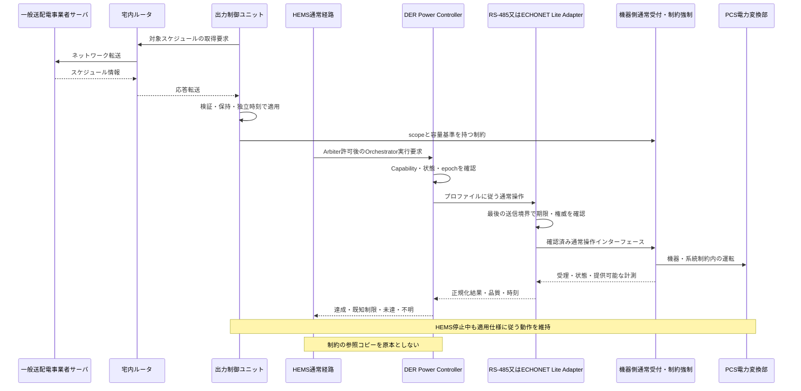

図のSはEL接続PCS内の取得機能又はRS-485用GW G側に対応する。詳細な物理・ネットワーク経路は第21章の二つの図を適用する。RS-485とECHONET Liteの双方について、通常操作の共通意味論を検証する。ただし操作能力・待ち時間・機器内の確認方法まで同一とはしない。制御対象が別々の装置に分散する場合は各対応構成へ展開する。

## 6.3 本書で追加したUC：USER_CONTEXT_DERIVED／SYSTEM_SPEC_PROPOSAL

| ID | 追加するシナリオ | 主要な要求 | 検証 |
|---|---|---|---|
| SYS-UC-08 | 既存RS-485 PCSへの通常要求・観測 | 既存プロトコルの意味を保ち、共通ControlRequest／結果へ対応付ける。生電文迂回を禁止 | SYS-T01、SYS-T02 |
| SYS-UC-09 | 同一意味の要求を他社ECHONET Lite機器へ実行 | 実装能力・許可間隔に基づき変換。電力目標と電力上限を取り違えない | SYS-T02、T10〜T12 |
| SYS-UC-10 | 外部HEMSがGWのDevice側公開を操作 | 公開対象と実資源を対応付け、通常受付・調停を通す。標準プロトコル上の応答と非同期結果を区別 | SYS-T03 |
| SYS-UC-11 | RS-485と他社機器の混在計画 | 機器ごとの時間・能力差と部分実行を管理。同じ物理量を二重計上しない | SYS-T04、T09、T13 |
| SYS-UC-12 | 制御中の通常設定変更と障害復旧変更 | 通常変更は可否・保留・反映時点を判断。復旧変更は独立Usecaseとして認可 | SYS-T06 |
| SYS-UC-13 | 同一資源の通信経路切替／装置交換 | 自動切替は必須機能にしない。採用時は旧経路の権威と残留要求を照合してから新経路へ | SYS-T07、T07、T17 |
| SYS-UC-14 | 計測保存・抽出の欠測／容量異常 | 欠測をゼロ化せず、短期制御と長期履歴の対象を区別。保存異常で系統制御を止めない | SYS-T08、T15 |
| SYS-UC-15 | HEMS機能を無効化して既存運転を継続 | 自律EMS停止とGW全停止を分け、既存通常制御と観測の適用範囲を確認 | SYS-T01 |

## 6.4 部分失敗と補償

複数機器に対する一つの計画は、要求がまとめて許可されても実機操作まで同時に成功するとは限らない。許可単位・実行順序・並行度を定義し、成功したステップ、受理のみ、結果不明、未送信をOrchestratorが管理する。

補償は、現在の権威・制約・機器状態で許される新しい操作として発行する。実行不明の操作を未実行と仮定して他機器へ二重に配分しない。再計画の責任はEMS、進行・補償管理はOrchestrator、機器単位の状態照合はDPCに置く。

## 6.5 ユースケース記述の完成条件

トリガー、対象構成、前提、受付条件、権威、順序、出力・状態、異常分岐、タイミング参照、ログ、検証IDを持つ。未確定の待ち時間等はPAR-*へリンクする。UC説明の例示値を合否閾値へ流用しない。

## 6.6 R2追加：上位サービス・UIのユースケース

既存UCのIDと責務を維持し、新規SYS-UC-16〜SYS-UC-22を[第20章](#ch-20)に記載する。宅内Web監視、アプリ遠隔操作、同時設定変更、GW内部操作、FW取得・適用、上位不通・復旧、ネットワーク設定変更を対象とする。GW自身の操作とPCSの運転要求を区別する。

同じ意味の通常運転要求はWeb／アプリ／上位サービスの入口で形式変換されても本章の調停・実行を通る。ローカル端末というだけで常に最優先とはしない。認可された利用者と機能・設備scopeからポリシーを決める。

## 6.9 R3追加ユースケースの所在

[第21章](#ch-21)にEL接続PCS自律取得（SYS-UC-23）、GW取得・管理・PCS指示（SYS-UC-24）、施工・保守での方式選択／変更（SYS-UC-25）を追加する。既存UCの通常運転経路は維持する。UC-04等の出力制御ユニットは選択プロファイルの所有者へ配賦し、H側への依存は追加しない。

## 6.10 R4：ルータを含む取得の往復

SYS-UC-23はEL接続PCS→宅内ルータ→サーバと逆向き応答、SYS-UC-24はGW G側→宅内ルータ→サーバと逆向き応答→RS-485指示である。第21章にルータを含む両シーケンスを掲載する。サーバからの情報方向をサーバ起点push接続と混同しない。

<!-- R6:COMPLETION_ITEMS -->

> **R6の補完範囲：** 以下はレビューA1から追加した章節項の記入枠であり、数値・機種・機能採否・個別規格適用を推定した確定仕様ではない。各項末のリンクから、本章末尾の具体的な質問・必要資料・確定時点を確認できる。

**記入先・関連する規範候補別冊：** [製品全機能・構成マトリクス](#ap-product-function-matrix) ／ [品質・利用目的・ライフサイクル受入の具体化項目](#ap-quality-acceptance-profiles)

## 6.11 全機能の正常・代替・異常シナリオ

### 6.11.1 機能とUCの双方向対応

**補完項目ID：** `SLOT-R6-06-01`。**対応観点：** C05, C08, C32（[レビューA1](sources/review/R5_Coverage_Review_A1.md)）。

R5の既存原則は保持するが、この項の全対象・具体条件・規範参照は未確定。

**本項に記載する仕様項目：**

- 機能IDとUC ID。
- 入力・トリガー・開始/終了・前後状態。
- 正常/代替/異常/取消しと結果通知。

**本項の完成判定：** 機能→UC→SYS→確認方法の双方向表を完成し、各UCに前提・結果・例外を記載する。

**具体的な不足：** [OQ-R6-06-01](#oq-r6-06-01)。採用値・参照版・対象外理由は回答後に本項又は版指定の規範別冊へ反映する。

### 6.11.2 横断条件・同時事象・利用場面

**補完項目ID：** `SLOT-R6-06-02`。**対応観点：** C02, C08, C09（[レビューA1](sources/review/R5_Coverage_Review_A1.md)）。

R5の既存原則は保持するが、この項の全対象・具体条件・規範参照は未確定。

**本項に記載する仕様項目：**

- 更新中の出力制御と設定変更。
- 初回起動・施工と監視。
- 通信断・権威交代・再接続の順序。

**本項の完成判定：** 横断シナリオ表を作成し、担当・順序・観測・タイムアウト・失敗後状態を指定する。

**具体的な不足：** [OQ-R6-06-02](#oq-r6-06-02)。採用値・参照版・対象外理由は回答後に本項又は版指定の規範別冊へ反映する。

<!-- R6:OPEN_QUESTIONS -->

## Open Questions — 本ノートを完成させるための未決事項

以下は本章の具体的な未決事項。**担当者・回答期限の日付・採用値・承認結果は未確定**である。担当ロールと確定ゲートは提案。回答を得ただけでは閉じず、根拠確認・決定・本文と関連台帳への反映を行う。
全体索引：[Open Question横断台帳](#ap-open-question-register)。各質問の編集正本は[data/completion_items.json](data/completion_items.json)。

### OQ-R6-06-01 — 機能とUCの双方向対応

**対象項：** [6.11.1 機能とUCの双方向対応](#slot-r6-06-01)

**質問：** 採用した全機能に代表UCがあるか。既存RS-485監視、内部操作、設定、FW、各EMS戦略に未記載の正常・異常系列はないか。

**必要資料・完了条件：** 機能→UC→SYS→確認方法の双方向表を完成し、各UCに前提・結果・例外を記載する。

**決定担当：** 未割当（候補：要求・システム設計・テスト設計）。承認者：未定。

**確定時点：** G2＝該当するIF・データ・操作等の詳細契約確定前（提案）。回答期限の日付：未定。

**未解決時の制約：** 「機能とUCの双方向対応」を対象構成の確定保証・実装受入根拠として使用しない。

**既存ID：** SYS-TBD-011。

**状態：** OPEN。**回答：** 未記入。**決定記録：** 未記入。

### OQ-R6-06-02 — 横断条件・同時事象・利用場面

**対象項：** [6.11.2 横断条件・同時事象・利用場面](#slot-r6-06-02)

**質問：** クラウド設定と宅内操作、FW更新と系統スケジュール切替、機器離脱と再計画が同時に発生したとき、どの系列を受入対象にするか。

**必要資料・完了条件：** 横断シナリオ表を作成し、担当・順序・観測・タイムアウト・失敗後状態を指定する。

**決定担当：** 未割当（候補：システム・結合テスト設計）。承認者：未定。

**確定時点：** G3＝該当する検証仕様・受入プロファイルの確定前（提案）。回答期限の日付：未定。

**未解決時の制約：** 「横断条件・同時事象・利用場面」を対象構成の確定保証・実装受入根拠として使用しない。

**既存ID：** SYS-TBD-009, SYS-TBD-018, SYS-TBD-032。

**状態：** OPEN。**回答：** 未記入。**決定記録：** 未記入。

---

# 07. DER制御・観測と方式別実行仕様

根拠：[02_Responsibilities.md](sources/architecture/02_Responsibilities.md) ／ [06_Contracts.md](sources/architecture/06_Contracts.md) ／ [08_Deployment_Failures_OTA.md](sources/architecture/08_Deployment_Failures_OTA.md) ／ [templates/Device_Profile.md](sources/architecture/templates/Device_Profile.md)。ユーザー明示事項・本書の具体化案は本文で区別する。

## 7.1 共通実行契約

DPCは権威再確認、機器状態取得、能力・頻度確認、操作系列作成、設定、応答確認、実状態確認、意味的結果報告を行う。1つの通常要求が1電文になるとは限らない。機器が提供しない連続P/Q指定、期限付き命令、制限理由取得等を仮定しない。

| 規定単位 | 共通仕様 | 機器・方式別仕様 |
|---|---|---|
| 操作 | モード／電力目標／上限制限／解除の意味 | 許可操作・実装の有無・事前状態 |
| 値 | 単位・符号・計測基準点・範囲の意味 | 分解能・丸め・変換手順・プロパティ |
| 手順 | 受付→実行→観測確認の状態 | 複数設定の順序・待ち時間・途中失敗 |
| 観測 | 値・品質・鮮度・状態の意味 | 取得周期、機器内更新、通知、読み戻し |
| 結果 | 受理／反映／達成／制限／未達／不明 | 応答が保証する段階と確認可能性 |
| 終了 | 要求期限と機器内運転保持の分離 | 機器内タイマ、通信断動作、解除能力 |

PV出力の通常制限も、機器が許す確認済み操作として扱う。電力会社の制限値原本をHEMSへ書換え開放することではない。

## 7.2 RS-485接続PCS：既存機能からの具体化

本節はユーザー明示前提に基づく追加仕様案である。RS-485上のプロトコル、レジスタ、FW、通信設定、応答時間は未提示。Modbus等の特定プロトコルを前提にしない。

| 項目 | 接続仕様で確定する事項 |
|---|---|
| 設備・局番 | 対応型式、物理設備とバス・ポート・アドレスの対応、交換時の識別 |
| 操作変換 | 共通operationからPCS固有命令への対応。未対応時は明示拒否 |
| 送信所有 | 現行Core／Poller等を含む全書込み元、最後の送信境界、同時アクセス制御 |
| 通信役割 | NORMAL_OPERATION_ONLY／GRID_CONTROL_REQUIRED／SHARED_REQUIRES_REVIEW／UNKNOWN |
| 時間と負荷 | 設定最小間隔、問い合わせ周期、応答期限、再試行、バス占有、接続台数 |
| 値と状態 | 受信値の意味、単位・符号・測定点、反映確認、機器内更新遅延 |
| 障害 | 無応答、破損、遅延応答、通信再初期化、再接続、機器設定残留 |
| 更新影響 | Driver／Adapter／共通OSの変更がどの通信とG側へ影響するか |

通常指令の入口を共通化しても、出力制御必須電文の所有権をArbiterへ移さない。旧書込み経路を残す移行期間では、同じ資源に対する旧・新の同時書込みを構成管理で防ぐ。RS-485の読み出し負荷も系統制御と資源を共有する可能性があるため評価する。

## 7.3 ECHONET Lite接続：他社機器のController側

Device／Capability検出、対象プロファイル選択、操作の可否、時間契約、実状態確認を規定する。プロパティの存在だけで製品としての対応を確定しない。採用するLite／APPENDIX／AIFの版は実機の対応版を記録する。

添付には蓄電池AIFの受理応答と特定電力設定の60秒の説明例があるが、これは本書の全機器共通閾値ではない。採用する対象操作と適用版を確認するまで、PAR-CMD-01は未確定とする。RS-485側の能力も同じとは見なさない。

## 7.4 外部HEMSに対するGWのDevice側：持越し要求

これは先行会話から維持する範囲であり、今回の添付だけでは全公開仕様を確定できない。GWがRS-485接続PCS等の情報・操作を公開する場合、公開オブジェクトと実resource/groupの対応をプロファイル化する。

外部Setを生のRS-485電文へ直送せず、通常受付・権威・実行契約へ正規化する。ECHONET Lite上で返す応答は採用規格の意味・時間契約に従い、内部の長時間の達成確認と無理に同一の同期応答にしない。標準が定めない任意ステータスをそのまま標準電文へ追加しない。結果の公開方法はIF-EL-02で決める。

Controller側とDevice側は役割を分け、自己公開の再発見による制御ループ、同一物理設備の重複、外部操作元との競合を試験する。

## 7.5 経路切替・透過性の限界

RS-485とECHONET Liteは意味的契約を共有するが、どちらへも自由に切り替えられるとはしない。機器同一性、操作同等性、権威、旧命令残留、計測基準、対応組合せを確認できた構成だけ切替を許可する。未確認の自動フェイルオーバーを初期仕様に加えない。

プロファイル変更や機器FW更新で操作能力が変わったときは再評価する。未知の機器へ既知型式の電文列を流用しない。

## 7.9 R3導入・R4適用：通常機器接続と系統制御接続の別契約

PCS_DIRECTの対象はEL接続PCSであり、GWからの通常ECHONET Lite操作・観測とPCS自身のルータ経由取得を分ける。RS-485接続PCSはGW_MANAGEDへ配賦するが、通常操作対応だけでは系統制御の必須通信に適合したとしない。IF-GRID-02で、出力制約又は制約を適用した指令、反映確認、実測・品質、通信断時処置を定義する。共用ポートの書込み所有者は第15章、具体電文・タイミングは機器プロファイルで確定する。

## 7.10 R4：ELサーバ取得と通常操作は別契約

EL接続PCS自身がルータ経由で取得する通信は、GW–PCSの通常EL契約とは別である。対象PCSの取得仕様・資格・時刻・保存・公開情報をメーカー資料で確認する。RS-485のGW管理は必須系統指示・監視を含み、一般H側のポート再初期化で失わせない。

## 7.11 R5：Controller側の接続を全対象へ明示

H側ECHONET Lite Controllerの接続対象はPCSに限らない。空調・給湯・計測器と、PV・蓄電池等のPCS公開クラスを、機器プロファイルに従って扱う。[第2.1.2項](#fig-02-01-el)と[往復経路表](#routes-02-01-el)に、H側LAN接続・共通宅内ルータLAN／AP・各機器IFを省略せず記載した。PCSの通常EL通信とPCS自身の出力制御サーバ取得は別契約であり、IF-EL-01とIF-GRID-01の責任を混合しない。

<!-- R6:COMPLETION_ITEMS -->

> **R6の補完範囲：** 以下はレビューA1から追加した章節項の記入枠であり、数値・機種・機能採否・個別規格適用を推定した確定仕様ではない。各項末のリンクから、本章末尾の具体的な質問・必要資料・確定時点を確認できる。

**記入先・関連する規範候補別冊：** [外部・内部IF契約の具体化項目](#ap-interface-contract-detail) ／ [機器プロファイル拡張テンプレート](#ap-device-profile-extended)

## 7.12 方式別の規範接続仕様

### 7.12.1 RS-485電文・接続条件・送信所有権

**補完項目ID：** `SLOT-R6-07-01`。**対応観点：** C10, C12, C13（[レビューA1](sources/review/R5_Coverage_Review_A1.md)）。

R5の既存原則は保持するが、この項の全対象・具体条件・規範参照は未確定。

**本項に記載する仕様項目：**

- PCS仕様名/版・電気条件・局番。
- 電文・応答意味・操作順序。
- 必須系統通信との共存・再試行。

**本項の完成判定：** PCS別接続仕様の版と電文対応を確定し、RS-485全書込点・最終送信境界・通信負荷表を登録する。

**具体的な不足：** [OQ-R6-07-01](#oq-r6-07-01)。採用値・参照版・対象外理由は回答後に本項又は版指定の規範別冊へ反映する。

### 7.12.2 ECHONET Lite Controller/Deviceの対象能力

**補完項目ID：** `SLOT-R6-07-02`。**対応観点：** C10, C12（[レビューA1](sources/review/R5_Coverage_Review_A1.md)）。

R5の既存原則は保持するが、この項の全対象・具体条件・規範参照は未確定。

**本項に記載する仕様項目：**

- 機器クラス/EOJ・採用版・プロパティマップ。
- Set/Get/通知と確認系列。
- 仮想公開と実機資源の対応。

**本項の完成判定：** 対応するEL機器と操作・観測表を埋め、Controller/Device共存、公開能力の上限、未対応応答を確認する。

**具体的な不足：** [OQ-R6-07-02](#oq-r6-07-02)。採用値・参照版・対象外理由は回答後に本項又は版指定の規範別冊へ反映する。

### 7.12.3 IPv4/IPv6・Wi-SUN・USB等の持越し要求

**補完項目ID：** `SLOT-R6-07-03`。**対応観点：** C12, C34（[レビューA1](sources/review/R5_Coverage_Review_A1.md)）。

R5の既存原則は保持するが、この項の全対象・具体条件・規範参照は未確定。

**本項に記載する仕様項目：**

- 採用媒体・USBドングル型式と利用目的。
- 経路バインド・認証文脈・優先度。
- 抜去・ハング・再挿入・復旧。

**本項の完成判定：** 持越し要求を採用/対象外へ仕分け、採用品の媒体・型式・状態遷移・資源上限を接続プロファイルへ登録する。

**具体的な不足：** [OQ-R6-07-03](#oq-r6-07-03)。採用値・参照版・対象外理由は回答後に本項又は版指定の規範別冊へ反映する。

<!-- R6:OPEN_QUESTIONS -->

## Open Questions — 本ノートを完成させるための未決事項

以下は本章の具体的な未決事項。**担当者・回答期限の日付・採用値・承認結果は未確定**である。担当ロールと確定ゲートは提案。回答を得ただけでは閉じず、根拠確認・決定・本文と関連台帳への反映を行う。
全体索引：[Open Question横断台帳](#ap-open-question-register)。各質問の編集正本は[data/completion_items.json](data/completion_items.json)。

### OQ-R6-07-01 — RS-485電文・接続条件・送信所有権

**対象項：** [7.12.1 RS-485電文・接続条件・送信所有権](#slot-r6-07-01)

**質問：** 既存PCSの実プロトコル、電文/レジスタ、応答の意味、局数・配線条件は何か。通常操作とG側必須通信をどの送信者・予算で管理するか。

**必要資料・完了条件：** PCS別接続仕様の版と電文対応を確定し、RS-485全書込点・最終送信境界・通信負荷表を登録する。

**決定担当：** 未割当（候補：PCSメーカー・GW通信設計）。承認者：未定。

**確定時点：** G2＝該当するIF・データ・操作等の詳細契約確定前（提案）。回答期限の日付：未定。

**未解決時の制約：** 「RS-485電文・接続条件・送信所有権」を対象構成の確定保証・実装受入根拠として使用しない。

**既存ID：** SYS-TBD-001, SYS-TBD-002, PAR-RS-01, PAR-RS-02, PAR-CMD-03。

**状態：** OPEN。**回答：** 未記入。**決定記録：** 未記入。

### OQ-R6-07-02 — ECHONET Lite Controller/Deviceの対象能力

**対象項：** [7.12.2 ECHONET Lite Controller/Deviceの対象能力](#slot-r6-07-02)

**質問：** 機器ごとのEL/AIF版・実装プロパティ・更新間隔は何か。GWのDevice側は何を公開し、RS-485資源や他社PCSとの対応と不可応答をどう定義するか。

**必要資料・完了条件：** 対応するEL機器と操作・観測表を埋め、Controller/Device共存、公開能力の上限、未対応応答を確認する。

**決定担当：** 未割当（候補：ECHONET Lite・機器接続設計）。承認者：未定。

**確定時点：** G2＝該当するIF・データ・操作等の詳細契約確定前（提案）。回答期限の日付：未定。

**未解決時の制約：** 「ECHONET Lite Controller/Deviceの対象能力」を対象構成の確定保証・実装受入根拠として使用しない。

**既存ID：** SYS-TBD-004, TBD-008, PAR-EL-01。

**状態：** OPEN。**回答：** 未記入。**決定記録：** 未記入。

### OQ-R6-07-03 — IPv4/IPv6・Wi-SUN・USB等の持越し要求

**対象項：** [7.12.3 IPv4/IPv6・Wi-SUN・USB等の持越し要求](#slot-r6-07-03)

**質問：** IPv4/IPv6、Wi-SUN、USB通信ドングル、USBバックアップ等をどの製品で採用するか。経路優先度、抜去・ハング時動作、認証あり/なし混在をどう規定するか。

**必要資料・完了条件：** 持越し要求を採用/対象外へ仕分け、採用品の媒体・型式・状態遷移・資源上限を接続プロファイルへ登録する。

**決定担当：** 未割当（候補：通信・組込み・製品企画）。承認者：未定。

**確定時点：** G1＝該当するアーキテクチャ・HW・安全境界の設計固定前（提案）。回答期限の日付：未定。

**未解決時の制約：** 「IPv4/IPv6・Wi-SUN・USB等の持越し要求」を対象構成の確定保証・実装受入根拠として使用しない。

**既存ID：** TBD-012, SYS-TBD-006, SYS-TBD-010。

**状態：** OPEN。**回答：** 未記入。**決定記録：** 未記入。

---

# 08. 高度エネマネ・Flexible Load・運転方針

根拠：[01_Architecture.md](sources/architecture/01_Architecture.md) ／ [03_Command_Flows.md](sources/architecture/03_Command_Flows.md) ／ [07_Power_Constraints.md](sources/architecture/07_Power_Constraints.md) ／ [09_Risks_Alternatives.md](sources/architecture/09_Risks_Alternatives.md)。ユーザー明示事項・本書の具体化案は本文で区別する。

## 8.1 高度エネマネの範囲

高度エネマネは経済性、自家消費、充電期限、利用者快適性、SoC等を考慮してEnergyGoalと計画案を扱う。実行は通常権威経路を通し、機器側制約強制を代替しない。予測・最適化の更新によって出力する通常要求が変わることは許されるが、既存APIの許可値・モード・頻度・構成条件を逸脱しない。

本書は最適化アルゴリズム、料金モデル、重みを固定しない。これらは製品要求又は戦略仕様として選択する。系統適合の唯一の根拠をHEMSの最適解に置かない。

## 8.2 機能分類→機能→振る舞い

| 機能分類 | 機能候補 | 振る舞いと成立条件 |
|---|---|---|
| エネルギー把握 | 発電・購入・逆潮流・消費・蓄電状態 | 基準点・符号・鮮度が確認できる値から評価 |
| 計画 | 自家消費、購入電力、料金、充電期限 | 必要Capability、利用者条件、参照制約がそろう範囲だけ計画 |
| DER実行 | PV・蓄電池・V2H等 | DPCへ許可済みの資源要求を渡す |
| 負荷実行 | 給湯・空調・充電専用EV等 | FLCへ快適性・温度・接続等を含む操作を渡す |
| 実績評価 | 達成、未達、部分実行、制限 | 要求、機器応答、観測、品質を区別 |
| 再計画 | 機器離脱、計測欠損、本体操作、制約変更 | 新しい要求は再度Arbiterで認可 |
| 既存運転共存 | 既存RS-485制御・通常監視 | 自律EMSの無効化と製品既存機能の停止を同一視しない |

候補機能を全て初期リリース必須としない。制度必須、製品独自、将来拡張、非対応を適用構成表で区別する。制度名だけから対応機器・保存期間・DR参加必須を導かない。

## 8.3 Flexible Loadの独立性

充電専用EV・給湯・空調は本プロジェクトの整理ではFLCが担当する。EV充放電器はDPC対象であり、機器名が似ていても同じ操作としない。負荷を動かして余剰を吸収する計画は許されるが、負荷継続を出力制御成立の唯一の条件にしない。

FLCは機器固有の安全・温度・本体設定・接続状態を尊重する。DPCとFLCの並行操作で生じる過渡はOrchestratorの順序仕様と機器側の独立制約で扱う。

## 8.4 入力不足と機能利用可否

利用可能能力は搭載、設定有効、必要機器存在、通信健全性、観測品質、操作プロファイル、認可の条件で判定する。どの不足で何を停止・限定・継続するかを戦略別に定義する。観測値不足をゼロ消費・制約なしと解釈しない。

クラウド不通時の自律運転、ユーザー手動操作後の再開時点、自動計画停止後の既存運転は製品方針として明記する。今回の資料だけでは継続期間・優先順位の具体値は決定しない。

## 8.5 系統制約を考慮する計画

参照コピーが有効なら計画時に制約を考慮する。コピーが欠損・期限切れなら、その条件に応じた限定戦略へ移行するが、機器側の正本を緩めない。機器から理由が得られなければ、実出力の低下を電力会社の抑制と断定せずUNKNOWNを保持する。

機器側又はサイト側で連系点制約を保証できない組合せを、HEMSが合計電力を計算できることだけで対応化しない。

<!-- R6:COMPLETION_ITEMS -->

> **R6の補完範囲：** 以下はレビューA1から追加した章節項の記入枠であり、数値・機種・機能採否・個別規格適用を推定した確定仕様ではない。各項末のリンクから、本章末尾の具体的な質問・必要資料・確定時点を確認できる。

**記入先・関連する規範候補別冊：** [製品全機能・構成マトリクス](#ap-product-function-matrix) ／ [品質・利用目的・ライフサイクル受入の具体化項目](#ap-quality-acceptance-profiles)

## 8.6 採用戦略の機能別仕様

### 8.6.1 高度エネマネ戦略の採否・適用・解除

**補完項目ID：** `SLOT-R6-08-01`。**対応観点：** C05, C11（[レビューA1](sources/review/R5_Coverage_Review_A1.md)）。

R5の既存原則は保持するが、この項の全対象・具体条件・規範参照は未確定。

**本項に記載する仕様項目：**

- 自家消費・購入電力・料金・期限の候補。
- 必要Capability・入力品質。
- 開始・停止・手動介入・再開。

**本項の完成判定：** 戦略ごとの採否と機能仕様を機能表・UCへ展開し、入力/結果/異常分岐の未定を除く。

**具体的な不足：** [OQ-R6-08-01](#oq-r6-08-01)。採用値・参照版・対象外理由は回答後に本項又は版指定の規範別冊へ反映する。

### 8.6.2 予測・計画・目標未達の扱い

**補完項目ID：** `SLOT-R6-08-02`。**対応観点：** C11, C22, C32（[レビューA1](sources/review/R5_Coverage_Review_A1.md)）。

R5の既存原則は保持するが、この項の全対象・具体条件・規範参照は未確定。

**本項に記載する仕様項目：**

- 料金/発電/需要予測の供給元と鮮度。
- 目的・制約・計画期間。
- 解なし・期限超過・再計画・評価。

**本項の完成判定：** 戦略入力辞書、計画・再計画条件、未達時動作、評価シナリオと受入指標を確定する。

**具体的な不足：** [OQ-R6-08-02](#oq-r6-08-02)。採用値・参照版・対象外理由は回答後に本項又は版指定の規範別冊へ反映する。

### 8.6.3 DER/負荷の個別操作と快適性条件

**補完項目ID：** `SLOT-R6-08-03`。**対応観点：** C11, C26（[レビューA1](sources/review/R5_Coverage_Review_A1.md)）。

R5の既存原則は保持するが、この項の全対象・具体条件・規範参照は未確定。

**本項に記載する仕様項目：**

- 蓄電池/PV/給湯/空調/充電の採用操作。
- 機器側安全・本体設定・温度/SoC。
- 不在機器・残留操作・利用者優先。

**本項の完成判定：** DPC/FLCの操作別機能表を機器プロファイルと安全評価へ対応付け、未対応機能を実装済みと扱わない。

**具体的な不足：** [OQ-R6-08-03](#oq-r6-08-03)。採用値・参照版・対象外理由は回答後に本項又は版指定の規範別冊へ反映する。

<!-- R6:OPEN_QUESTIONS -->

## Open Questions — 本ノートを完成させるための未決事項

以下は本章の具体的な未決事項。**担当者・回答期限の日付・採用値・承認結果は未確定**である。担当ロールと確定ゲートは提案。回答を得ただけでは閉じず、根拠確認・決定・本文と関連台帳への反映を行う。
全体索引：[Open Question横断台帳](#ap-open-question-register)。各質問の編集正本は[data/completion_items.json](data/completion_items.json)。

### OQ-R6-08-01 — 高度エネマネ戦略の採否・適用・解除

**対象項：** [8.6.1 高度エネマネ戦略の採否・適用・解除](#slot-r6-08-01)

**質問：** 自家消費、料金、ピーク、充電期限のどの戦略を初回採用するか。機器構成・入力欠損・手動変更に応じた開始/解除/再開条件は何か。

**必要資料・完了条件：** 戦略ごとの採否と機能仕様を機能表・UCへ展開し、入力/結果/異常分岐の未定を除く。

**決定担当：** 未割当（候補：エネルギーマネジメント・製品企画）。承認者：未定。

**確定時点：** G0＝製品スコープ・機能採否・要求Baselineの承認前（提案）。回答期限の日付：未定。

**未解決時の制約：** 「高度エネマネ戦略の採否・適用・解除」を対象構成の確定保証・実装受入根拠として使用しない。

**既存ID：** SYS-TBD-005, SYS-TBD-010, TBD-001。

**状態：** OPEN。**回答：** 未記入。**決定記録：** 未記入。

### OQ-R6-08-02 — 予測・計画・目標未達の扱い

**対象項：** [8.6.2 予測・計画・目標未達の扱い](#slot-r6-08-02)

**質問：** 採用戦略の予測データ・料金データはどこから取得し、どの品質まで使うか。最適解が得られない/期限に間に合わない場合、どの代替動作と通知にするか。

**必要資料・完了条件：** 戦略入力辞書、計画・再計画条件、未達時動作、評価シナリオと受入指標を確定する。

**決定担当：** 未割当（候補：EMS・データ・テスト設計）。承認者：未定。

**確定時点：** G2＝該当するIF・データ・操作等の詳細契約確定前（提案）。回答期限の日付：未定。

**未解決時の制約：** 「予測・計画・目標未達の扱い」を対象構成の確定保証・実装受入根拠として使用しない。

**既存ID：** PAR-PLAN-01, PAR-MEAS-02, SYS-TBD-006。

**状態：** OPEN。**回答：** 未記入。**決定記録：** 未記入。

### OQ-R6-08-03 — DER/負荷の個別操作と快適性条件

**対象項：** [8.6.3 DER/負荷の個別操作と快適性条件](#slot-r6-08-03)

**質問：** 空調・給湯・蓄電池等の何を操作するか。設定範囲、快適性、終了時の運転残留、本体操作尊重を機種別にどう制約するか。

**必要資料・完了条件：** DPC/FLCの操作別機能表を機器プロファイルと安全評価へ対応付け、未対応機能を実装済みと扱わない。

**決定担当：** 未割当（候補：機器制御・製品安全）。承認者：未定。

**確定時点：** G2＝該当するIF・データ・操作等の詳細契約確定前（提案）。回答期限の日付：未定。

**未解決時の制約：** 「DER/負荷の個別操作と快適性条件」を対象構成の確定保証・実装受入根拠として使用しない。

**既存ID：** TBD-007, TBD-009, TBD-001。

**状態：** OPEN。**回答：** 未記入。**決定記録：** 未記入。

---

# 09. 計測・状態・保存・外部公開

根拠：[02_Responsibilities.md](sources/architecture/02_Responsibilities.md) ／ [07_Power_Constraints.md](sources/architecture/07_Power_Constraints.md) ／ [10_Requirements_Tests.md](sources/architecture/10_Requirements_Tests.md) ／ [11_Migration_Decisions.md](sources/architecture/11_Migration_Decisions.md)。ユーザー明示事項・本書の具体化案は本文で区別する。

## 9.1 計測の意味と正本

Measurement ServiceはHEMS用の観測・品質・鮮度・集約を所有する。必要な系統制御用計測は機器側の独立経路で成立させる。HEMS計測の欠損時にG側の値を止めたり、G側計測異常をHEMS推定で無断置換したりしない。

| 定義項目 | 記録する内容 |
|---|---|
| 対象 | physical_device/resource/conversion_group/connection_point、観測元route |
| 量 | 電力／積算電力量／SoC／状態／制限情報等 |
| 基準 | AC／DC、計測点、合算範囲、正負、単位・scale |
| 時刻 | 実機の計測時刻、GW受信時刻、時計品質、取得時刻不明の別 |
| 品質 | 実測・機器推定・GW算出、VALID／STALE／MISSING／UNKNOWN等 |
| 利用 | 制御判断、表示、実績、監査、制度提出の用途 |
| 履歴 | 機器交換、設定世代、プロファイル版、計測点変更 |

品質の列挙・全フィールドは本書での具体化案。標準プロトコルのデータ形式と混同しない。受信時刻しか取得できない場合、実際の測定時刻として偽装せず、機器内更新周期と経路遅延を含む鮮度評価の前提を記録する。

## 9.2 二重計上と未取得

同一Hybrid PCSのPV、蓄電池、マルチ入力PCSの観測値を独立発電として加算しない。家庭全体と分岐の値、同じ機器のRS-485とECHONET Lite経路の値も、計測範囲とデータ正本を定める。

未取得・無効・欠測を数値0として制御へ入力しない。積算値のリセット、機器交換、時刻逆転などは欠測・境界イベントとして扱う規則を定める。具体的な補間・算出は推定としてラベル付けする。

## 9.3 保存区分：先行検討からの持越しを具体化した案

| 区分 | 用途 | 未確定事項 |
|---|---|---|
| Operational Store | 短期の制御判断・状態照合 | 保持長、取得・集計周期、上限容量 |
| Energy History／Compliance Dataset | 実績評価・必要な制度提出 | 対象制度・年度・粒度・保持期間・出力形式 |
| Control／Audit Log | 要求・権威・実行・判断の追跡 | 保存期間、アクセス権、個人情報、エクスポート |
| G側の原本・記録 | スケジュール・時刻・設定・規定の異常記録 | PCS_DIRECTはPCS側、GW_MANAGEDはGW G側。HEMS用DBへ統合しない |

すべてのデータを一律2年間保存する仕様にはしない。添付では保持期間がTBD-014であり、具体的な制度要件・製品運用を確認してPAR-DATA-*を決める。容量不足時の制御・計測・ログの優先関係と通知は、G側非干渉を守る範囲で定義する。

## 9.4 制御・監査記録

少なくとも要求ID、correlation、actor、authority/epoch、対象scope、操作、送信・受理・観測の段階、計測品質、実時刻、関連する経過時間、プロファイル版、結果と理由を関連付ける。未取得の制限理由を推測で確定記録しない。

機器応答の受信を実出力達成としてクラウドへ表示しない。ローカルUI、外部HEMS、メーカーAPIで公開できる項目と規格上の表現は別に対応付ける。公開情報の取得可能性が限られる機器はSLAと表示を限定する。

## 9.5 データ抽出と診断

期間、対象設備、集計粒度、欠測、単位・符号・時刻を含めてエクスポートできる仕様を候補とする。実際の形式・対象項目はIFと製品要求で確定する。診断用の生電文参照と、任意生電文の送信権限を同一にしない。秘密情報・個人情報の出力制限は運用要求と連携する。

## 9.6 R2追加：上位公開・同期・監視負荷

上位サーバへ公開するGW内部情報を製品状態、運用統計、許可診断に分類し、秘密情報・他住宅情報・不要な個人情報は除去する。生内部DBを公開APIの正本としない。

実機観測→GW受信→クラウド受信→アプリ表示の各時刻と品質を区別する。クラウドに保持された過去値はリモート履歴であり、実機現在値の確定証拠ではない。stream／boot世代／連番等で重複・逆転・欠落を扱い、再同期が必要な区間を表示する。保存期間と容量は未確定のまま台帳管理する。

複数ブラウザ・アプリの参照を共通Viewへ集約し、端末数に比例した無制限のRS-485／ECHONET Liteポーリングを避ける。Fresh Read、ログ、履歴抽出は有限ジョブとし、通常・系統側の時間予算を侵食しない。詳細は[第20章](#ch-20)。

## 9.9 R3導入・R4適用：方式・適用状態の公開

公開情報にconfigured_mode、active_mode、scope、schedule_owner、constraint_owner、接続／保持／適用状態、観測時刻、品質、切替Job状態を追加する。PCS_DIRECTでスケジュール版・内部状態を取得できない場合はUNKNOWN／NOT_EXPOSEDとし、GWキャッシュの推定で埋めない。H側表示停止はG側制御停止の証拠ではなく、GW通信成功もPCSの制約適用成功の証拠ではない。原本・資格情報・変更権限を監視APIへ漏らさない。

## 9.10 R4：ネットワーク状態の非推移性

GWのWAN接続、PCS通常EL応答、PCSサーバ取得・保持・適用、ルータ到達は別の観測項目とする。一つの正常状態から他を推定しない。ルータ停止時も保持された履歴と現在値の鮮度を区別する。PCSがサーバ取得状態を公開しなければNOT_EXPOSED、確認不能ならUNKNOWNとする。

## 9.11 R5：計測器と他機器の観測戻り

計測器の読出要求はMeasurement／Device State ServiceからEL Controller／Adapter・H側LAN接続・宅内ルータLAN／APを経由して対象EL機器IFへ送る。応答及び対応する通知は同じ宅内接続を戻り、相関・機器識別・品質を保って観測サービスへ取り込む。空調・給湯・PCSの観測も同じ通信窓口を利用するが、操作結果確認の意味的担当はFLC／DPCである。[第2.1節の拡大図](#fig-02-01-el)を参照する。

<!-- R6:COMPLETION_ITEMS -->

> **R6の補完範囲：** 以下はレビューA1から追加した章節項の記入枠であり、数値・機種・機能採否・個別規格適用を推定した確定仕様ではない。各項末のリンクから、本章末尾の具体的な質問・必要資料・確定時点を確認できる。

**記入先・関連する規範候補別冊：** [計測・状態・履歴データ辞書の具体化項目](#ap-data-dictionary) ／ [未確定パラメータ50件](#ap-parameter-register)

## 9.12 計測・状態のデータ辞書

### 9.12.1 実項目・型・単位・品質・計測点

**補完項目ID：** `SLOT-R6-09-01`。**対応観点：** C14, C22（[レビューA1](sources/review/R5_Coverage_Review_A1.md)）。

R5の既存原則は保持するが、この項の全対象・具体条件・規範参照は未確定。

**本項に記載する仕様項目：**

- 取得/算出/推定の別と元データ。
- 型・値域・符号・精度・丸め。
- 更新時刻・鮮度・欠測・Unknown。

**本項の完成判定：** 実項目ごとの辞書に型・単位・基準点・所有者・品質・利用先を記入し、二重計上をレビューする。

**具体的な不足：** [OQ-R6-09-01](#oq-r6-09-01)。採用値・参照版・対象外理由は回答後に本項又は版指定の規範別冊へ反映する。

## 9.13 保存・同期・抽出の規範契約

### 9.13.1 保存容量・集計・電断時完全性

**補完項目ID：** `SLOT-R6-09-02`。**対応観点：** C15, C22, C23（[レビューA1](sources/review/R5_Coverage_Review_A1.md)）。

R5の既存原則は保持するが、この項の全対象・具体条件・規範参照は未確定。

**本項に記載する仕様項目：**

- 短期/長期/監査の集合と保持期間。
- 集計境界・積算リセット・欠測補間。
- 電断損失・書込み寿命・満杯時。

**本項の完成判定：** 用途別保持表、容量・寿命計算、電断/満杯/時刻補正の期待結果を定義する。

**具体的な不足：** [OQ-R6-09-02](#oq-r6-09-02)。採用値・参照版・対象外理由は回答後に本項又は版指定の規範別冊へ反映する。

### 9.13.2 上位同期・履歴エクスポート・削除

**補完項目ID：** `SLOT-R6-09-03`。**対応観点：** C15, C21（[レビューA1](sources/review/R5_Coverage_Review_A1.md)）。

R5の既存原則は保持するが、この項の全対象・具体条件・規範参照は未確定。

**本項に記載する仕様項目：**

- 上位/端末/GWの正本と参照。
- 順序・重複・再同期・ページング。
- 抽出形式・アクセス・削除・匿名化適用。

**本項の完成判定：** 同期・抽出・消去仕様をデータ項目単位で確定し、欠測と取得不能をデータ0としないテストを定める。

**具体的な不足：** [OQ-R6-09-03](#oq-r6-09-03)。採用値・参照版・対象外理由は回答後に本項又は版指定の規範別冊へ反映する。

<!-- R6:OPEN_QUESTIONS -->

## Open Questions — 本ノートを完成させるための未決事項

以下は本章の具体的な未決事項。**担当者・回答期限の日付・採用値・承認結果は未確定**である。担当ロールと確定ゲートは提案。回答を得ただけでは閉じず、根拠確認・決定・本文と関連台帳への反映を行う。
全体索引：[Open Question横断台帳](#ap-open-question-register)。各質問の編集正本は[data/completion_items.json](data/completion_items.json)。

### OQ-R6-09-01 — 実項目・型・単位・品質・計測点

**対象項：** [9.12.1 実項目・型・単位・品質・計測点](#slot-r6-09-01)

**質問：** 公開・保存・制御利用する全データ項目は何か。AC/DC、電力/電力量、符号・精度・時刻・欠測・推定の表現をどう統一するか。

**必要資料・完了条件：** 実項目ごとの辞書に型・単位・基準点・所有者・品質・利用先を記入し、二重計上をレビューする。

**決定担当：** 未割当（候補：計測・データ・制御設計）。承認者：未定。

**確定時点：** G2＝該当するIF・データ・操作等の詳細契約確定前（提案）。回答期限の日付：未定。

**未解決時の制約：** 「実項目・型・単位・品質・計測点」を対象構成の確定保証・実装受入根拠として使用しない。

**既存ID：** TBD-006, SYS-TBD-010, PAR-MEAS-01, PAR-MEAS-02。

**状態：** OPEN。**回答：** 未記入。**決定記録：** 未記入。

### OQ-R6-09-02 — 保存容量・集計・電断時完全性

**対象項：** [9.13.1 保存容量・集計・電断時完全性](#slot-r6-09-02)

**質問：** どの項目をどの粒度/期間保存するか。電断で許す損失、積算リセット・機器交換、容量枯渇時の削除・警報はどうするか。

**必要資料・完了条件：** 用途別保持表、容量・寿命計算、電断/満杯/時刻補正の期待結果を定義する。

**決定担当：** 未割当（候補：データ・組込み・製品運用）。承認者：未定。

**確定時点：** G3＝該当する検証仕様・受入プロファイルの確定前（提案）。回答期限の日付：未定。

**未解決時の制約：** 「保存容量・集計・電断時完全性」を対象構成の確定保証・実装受入根拠として使用しない。

**既存ID：** SYS-TBD-010, TBD-014, PAR-DATA-01, PAR-DATA-02。

**状態：** OPEN。**回答：** 未記入。**決定記録：** 未記入。

### OQ-R6-09-03 — 上位同期・履歴エクスポート・削除

**対象項：** [9.13.2 上位同期・履歴エクスポート・削除](#slot-r6-09-03)

**質問：** オフライン中の履歴を何件/期間保持し、上位とどう整合するか。利用者へ出せる項目・形式と、修理/所有者変更で消す範囲は何か。

**必要資料・完了条件：** 同期・抽出・消去仕様をデータ項目単位で確定し、欠測と取得不能をデータ0としないテストを定める。

**決定担当：** 未割当（候補：クラウド・データ・プライバシー担当）。承認者：未定。

**確定時点：** G2＝該当するIF・データ・操作等の詳細契約確定前（提案）。回答期限の日付：未定。

**未解決時の制約：** 「上位同期・履歴エクスポート・削除」を対象構成の確定保証・実装受入根拠として使用しない。

**既存ID：** SYS-TBD-019, SYS-TBD-023, TBD-014, PAR-UP-06, PAR-UP-07。

**状態：** OPEN。**回答：** 未記入。**決定記録：** 未記入。

---

# 10. 一般送配電事業者・遠隔出力制御・系統連系保護

根拠：[01_Architecture.md](sources/architecture/01_Architecture.md) ／ [04_JET_Isolation.md](sources/architecture/04_JET_Isolation.md) ／ [08_Deployment_Failures_OTA.md](sources/architecture/08_Deployment_Failures_OTA.md) ／ [12_Sources.md](sources/architecture/12_Sources.md)。ユーザー明示事項・本書の具体化案は本文で区別する。

## 10.1 本章の適用範囲

本章は二方式共通の出力制御契約を定義する。PCS_DIRECTではPCS内の出力制御機能への依存仕様、GW_MANAGEDではGWのG側の取得・保存・時刻管理・適用・PCS指示への実装要求へ配賦する。PCS保護は両方式で独立する。GW_MANAGEDは単なるスケジュールの透過中継ではない。標準H側のArbiter／Orchestratorを出力制御の成立経路にしない。

数値・認証適用は添付の公開資料確認を引き継ぐが、今回原本を再確認していない。対象一般送配電事業者、契約、伝送仕様、機器・試験プロファイルの適用値を確定するまで、周期、出力変化条件、停止時間等を決め打ちしない。

## 10.2 出力制御ユニットの契約

| 機能 | システム依存要求 | HEMS側の扱い |
|---|---|---|
| 接続開始・取得 | 適用する方式で対象情報を取得 | 必須プロキシ／HTTPリレーにならない |
| 対象確認・検証 | 設備・容量根拠・期間・形式等を確認 | HEMSが対象ID・容量根拠を無権限変更しない |
| 永続保持 | 必要スケジュール・状態を保持し復旧 | HEMS DB／OTAだけに依存しない |
| 時刻適用 | 出力制御用時刻に従い適用 | HEMS時刻修正をG側へ伝播しない |
| 制約出力 | quantity・scope・容量基準を特定して渡す | 読取コピーは計画補助のみ |
| 状態・異常 | 仕様に従う縮退・通知 | コピー欠損を制約なしとしない |

通常クラウドと出力制御配信経路を混同しない。配信事業者を経由する構成を採用する場合は、その実経路を接続プロファイルに登録する。必須通信資源がHEMS更新で停止する構成なら分離成立を宣言しない。

## 10.3 最終制約と保護

機器側運転制御は通常要求と系統・機器制約を整合し、許容される運転を実行する。系統連系保護は必要な独立計測に基づき、HEMSの計画計算、Arbiter許可、クラウド応答を待たずに動作する。

保護の停止・解列と遠隔出力制御のスケジュール実行は、評価する時間条件・状態遷移を別に定義する。再連系や保護復帰を通常モードAPIで強制解除できる形にしない。

## 10.4 四つの通信・観測障害を区別する

| 障害位置 | 契約 |
|---|---|
| HEMSと機器の通常操作リンク断 | 新規通常要求を止め、結果不明・機器保持を管理。この断線だけでG側内部通信異常とみなさない |
| 出力制御サーバとの外部通信断 | 保持済み情報と適用仕様の縮退に従う。無条件100%出力復帰をしない |
| 出力制御ユニットとPCSの必須通信断 | 適用プロファイルで規定された制限・停止等へ。通常HEMSリンク断と別の試験点 |
| G側計測・時刻・保存異常 | G側で検出して規定動作。HEMS推定を勝手に原本へ置換しない |

添付が紹介する特定公開仕様の「内部通信異常時5分以内停止」を、全HEMS通信断や保護動作の共通値として採用しない。該当する経路と適用版をメーカー／認証主体と確認してからプロファイルへ登録する。

## 10.5 HEMS停止と通常要求の残留

HEMSが停止してもG側の出力制御・必要計測・時刻・保護は適用仕様内で成立させる。一方、直前の通常放電・運転モードの保持・解除・期限終了は機器能力に依存する。両者を別々の受入条件として試験する。

「系統制約は守られるが、利用者が指定した時刻に通常運転は終了しない」構成を、停止時契約に適合したと扱わない。用途に応じた機器内タイマ・スケジュール・エネルギー／SoC制限・対象機種制限を確認する。未確認なら該当用途の保証をしない。

## 10.6 R3導入・R4適用：配置によって変わる正本と責任

| 責務 | PCS_DIRECT | GW_MANAGED |
|---|---|---|
| サーバ接続・対象確認 | PCS内の出力制御機能 | GWのG側 |
| スケジュール正本・履歴・時刻 | PCS側 | GWのG側 |
| スケジュールから適用制約を決定 | PCS側 | GWのG側 |
| PCSへの制約・指令の適用 | PCS内部経路 | GW G側→確認済みPCS接続経路 |
| 機器状態・実出力の監視 | PCS内、公開情報をGWで参照 | 必要監視はG側で維持、H側へコピー |
| 通常エネマネ・上位／UI操作 | GW H側 | GW H側 |
| 電気的な保護・解列等 | PCS等の確認対象保護機能 | PCS等の確認対象保護機能 |

GW_MANAGEDでGWが算出するのは採用プロファイルの制約／指令であり、PCSの高速制御・保護をLinux HEMSへ移す意味ではない。設定値ACKだけで実出力適合としない。複数PCSに対する配分が必要ならG側の責務としてscope・容量根拠・過渡条件を定義する。

独立性の主張対象はH側の停止・更新である。GW全体喪失時にGWのG側が動き続けるとは主張せず、PCS側の必須通信断時動作と復帰を確認する。[第21章](#ch-21)の選択・切替・障害表を適用する。

## 10.7 R4：宅内ルータ必須と対象限定

全取得要求・応答は宅内ルータ経由。PCS_DIRECTはEL接続PCSの自律取得、GW_MANAGEDはRS-485接続PCSのGW取得・管理である。ルータはスケジュール保存・適用を担わない。上位サーバ不通、WAN断、ルータ全停止、LAN片側断、RS-485必須断を区別し、保存情報の期限・時刻・必要計測に従って同じ方式の規定動作を続ける。

<!-- R6:COMPLETION_ITEMS -->

> **R6の補完範囲：** 以下はレビューA1から追加した章節項の記入枠であり、数値・機種・機能採否・個別規格適用を推定した確定仕様ではない。各項末のリンクから、本章末尾の具体的な質問・必要資料・確定時点を確認できる。

**記入先・関連する規範候補別冊：** [R4機器接続別・ルータ経路プロファイル](#ap-grid-connection-profile) ／ [用語集・規範参照の確定台帳](#ap-normative-references-glossary)

## 10.8 適用する系統接続契約の具体化

### 10.8.1 エリア・契約・スケジュール仕様の版

**補完項目ID：** `SLOT-R6-10-01`。**対応観点：** C17, C31（[レビューA1](sources/review/R5_Coverage_Review_A1.md)）。

R5の既存原則は保持するが、この項の全対象・具体条件・規範参照は未確定。

**本項に記載する仕様項目：**

- 一般送配電事業者・設備scope・容量基準。
- 正式伝送仕様・取得/保持/時刻。
- 期限切れと必須通信異常。

**本項の完成判定：** 選択方式ごとの系統接続プロファイルに正式資料・適用範囲・値・確認者を登録する。

**具体的な不足：** [OQ-R6-10-01](#oq-r6-10-01)。採用値・参照版・対象外理由は回答後に本項又は版指定の規範別冊へ反映する。

### 10.8.2 通常API非迂回・保護・復帰の確認

**補完項目ID：** `SLOT-R6-10-02`。**対応観点：** C17, C26（[レビューA1](sources/review/R5_Coverage_Review_A1.md)）。

R5の既存原則は保持するが、この項の全対象・具体条件・規範参照は未確定。

**本項に記載する仕様項目：**

- 許可通常モードと禁止操作。
- 制約強制・独立計測・保護の主体。
- H停止/G停止/WAN断時の成立条件。

**本項の完成判定：** メーカー説明・機能分担・許可操作・適用評価の記録をそろえ、必要な受入条件を第17章へ配賦する。

**具体的な不足：** [OQ-R6-10-02](#oq-r6-10-02)。採用値・参照版・対象外理由は回答後に本項又は版指定の規範別冊へ反映する。

<!-- R6:OPEN_QUESTIONS -->

## Open Questions — 本ノートを完成させるための未決事項

以下は本章の具体的な未決事項。**担当者・回答期限の日付・採用値・承認結果は未確定**である。担当ロールと確定ゲートは提案。回答を得ただけでは閉じず、根拠確認・決定・本文と関連台帳への反映を行う。
全体索引：[Open Question横断台帳](#ap-open-question-register)。各質問の編集正本は[data/completion_items.json](data/completion_items.json)。

### OQ-R6-10-01 — エリア・契約・スケジュール仕様の版

**対象項：** [10.8.1 エリア・契約・スケジュール仕様の版](#slot-r6-10-01)

**質問：** 対象エリア・連系契約・設備範囲・正式仕様の版は何か。取得・保持・適用・期限切れ・通信異常時の値と条件は何か。

**必要資料・完了条件：** 選択方式ごとの系統接続プロファイルに正式資料・適用範囲・値・確認者を登録する。

**決定担当：** 未割当（候補：系統連系担当・PCSメーカー）。承認者：未定。

**確定時点：** G1＝該当するアーキテクチャ・HW・安全境界の設計固定前（提案）。回答期限の日付：未定。

**未解決時の制約：** 「エリア・契約・スケジュール仕様の版」を対象構成の確定保証・実装受入根拠として使用しない。

**既存ID：** TBD-003, TBD-004, PAR-GRID-01, PAR-GRID-02, PAR-GSEL-02。

**状態：** OPEN。**回答：** 未記入。**決定記録：** 未記入。

### OQ-R6-10-02 — 通常API非迂回・保護・復帰の確認

**対象項：** [10.8.2 通常API非迂回・保護・復帰の確認](#slot-r6-10-02)

**質問：** 対象PCSの通常操作で出力制約や保護を上書きできない根拠は何か。独立計測・保護復帰・必要通信を誰が担い、H停止時に何を維持するか。

**必要資料・完了条件：** メーカー説明・機能分担・許可操作・適用評価の記録をそろえ、必要な受入条件を第17章へ配賦する。

**決定担当：** 未割当（候補：PCSメーカー・G側・安全設計）。承認者：未定。

**確定時点：** G1＝該当するアーキテクチャ・HW・安全境界の設計固定前（提案）。回答期限の日付：未定。

**未解決時の制約：** 「通常API非迂回・保護・復帰の確認」を対象構成の確定保証・実装受入根拠として使用しない。

**既存ID：** TBD-002, TBD-006, SYS-TBD-003, PAR-GRID-03, PAR-GSEL-03。

**状態：** OPEN。**回答：** 未記入。**決定記録：** 未記入。

---

# 11. 電力制約・トポロジー・過渡条件

根拠：[05_Device_Classes.md](sources/architecture/05_Device_Classes.md) ／ [07_Power_Constraints.md](sources/architecture/07_Power_Constraints.md) ／ [09_Risks_Alternatives.md](sources/architecture/09_Risks_Alternatives.md)。ユーザー明示事項・本書の具体化案は本文で区別する。

## 11.1 制約のscope

添付の電力モデルを継承する。以下は設計・計画のモデルであり、接続契約や機器試験の代替ではない。

| scope | 対象 |
|---|---|
| RESOURCE | 特定蓄電池等の操作・状態依存の能力範囲 |
| CONVERSION_GROUP | Hybrid PCSの共通AC容量、同時動作、排他モード |
| CONNECTION_POINT | 住宅・発電所の連系点における電力等 |
| PROTECTION_DOMAIN | 保護停止・解列が作用する設備範囲 |

各制約にquantity、単位・符号、scope、容量基準、有効時間、enforcement_ownerを持たせる。未知の分母を機器定格で置換せず、すべてを「抑制率×PCS定格」に正規化しない。

## 11.2 電力収支

同じAC基準点へそろえ、DERからACバスへ出る電力を正、蓄電池・V2Hの充電を負、負荷消費を正の大きさとする。

$$
p_{\mathrm{PCC}}(t)=\sum_{i\in\mathcal D}p_i(t)-p_{\mathrm{load}}(t)
$$

$$
p_{\mathrm{export}}=\max(p_{\mathrm{PCC}},0),\qquad
p_{\mathrm{import}}=\max(-p_{\mathrm{PCC}},0)
$$

集合Dは重複しない実電力経路に対応付ける。同じHybrid PCSのPV、蓄電池、PCS総出力を同時加算しない。AC/DCや損失の基準が異なる場合、変換の根拠と品質を明示する。RS-485とECHONET Liteの取得値であることより、計測範囲が重要である。

## 11.3 機器能力と計画制約

$$
p_i^{\min}(x_i)\le p_i\le p_i^{\max}(x_i),\qquad
p_i^2+q_i^2\le S_i^2
$$

$$
-\bar p_{\mathrm{import}}\le p_{\mathrm{PCC}}\le\bar p_{\mathrm{export}}
$$

Qを操作できない機器ではQを自由な制御変数にしない。SoC、温度、接続、運転モード、共通変換容量等を条件として扱う。同じ量・同じscopeの上限制約以外を一つのminに押し込めない。

## 11.4 複数メーカー・複数PCS

複数PCSが同一連系点の制約を共有する場合、どの機器又はサイト装置が独立計測と強制経路を持つかを特定する。各PCSに同じ上限を設定するだけで合計上限を満たすとはしない。

全体制約を強制できない構成では、確認済みサイト制御の導入、適用方式が認める保守的な上限配分、組合せをサポート外とする方法を比較する。いずれを採るかは未確定。HEMS計画や負荷継続にだけ依存する案を、本分離目標の成立構成として採用しない。

## 11.5 過渡と評価

測定、通信、設定、物理応答、出力変化条件に遅延がある。すべての瞬間で厳密な静的上限を維持すると断定せず、適用プロファイルPiの評価窓・応答・許容差・異常時動作に対して適合を判定する。

$$
\operatorname{Conforms}_{\Pi}
\bigl(p_{\mathrm{PCC}}(\cdot),u_{\mathrm{grid}}(\cdot),x(\cdot)\bigr)
$$

計画余裕mを使う場合も値と根拠は未確定である。余裕だけで負荷遮断やEV離脱への適合を保証しない。保護動作の時間条件へ遠隔出力制御用のランプ条件を流用しない。

## 11.6 R4：混在する取得主体と共有連系点

同一宅内ルータ上のEL自律取得PCSと、RS-485を介するGW管理PCSが共通連系点を持つ場合も、ルータやH側EMSを合算制約の唯一の強制主体にしない。対象scope・容量分配・最終強制の成立を機器別に確認し、未成立な混在を製品対応済みとしない。

<!-- R6:COMPLETION_ITEMS -->

> **R6の補完範囲：** 以下はレビューA1から追加した章節項の記入枠であり、数値・機種・機能採否・個別規格適用を推定した確定仕様ではない。各項末のリンクから、本章末尾の具体的な質問・必要資料・確定時点を確認できる。

**記入先・関連する規範候補別冊：** [計測・状態・履歴データ辞書の具体化項目](#ap-data-dictionary) ／ [品質・利用目的・ライフサイクル受入の具体化項目](#ap-quality-acceptance-profiles)

## 11.7 電力モデルの適用プロファイル

### 11.7.1 基準点・容量・変換グループの対応

**補完項目ID：** `SLOT-R6-11-01`。**対応観点：** C14, C17（[レビューA1](sources/review/R5_Coverage_Review_A1.md)）。

R5の既存原則は保持するが、この項の全対象・具体条件・規範参照は未確定。

**本項に記載する仕様項目：**

- 物理配線・計測点・AC/DC。
- 機器定格/契約容量/PCS共用容量。
- 量・符号・scope・損失。

**本項の完成判定：** 配線図、制約表、データ辞書を同じ資源ID・基準点で突合し、合算/非合算の対象を確定する。

**具体的な不足：** [OQ-R6-11-01](#oq-r6-11-01)。採用値・参照版・対象外理由は回答後に本項又は版指定の規範別冊へ反映する。

### 11.7.2 混在設備・過渡・実出力の合否

**補完項目ID：** `SLOT-R6-11-02`。**対応観点：** C17, C22, C32（[レビューA1](sources/review/R5_Coverage_Review_A1.md)）。

R5の既存原則は保持するが、この項の全対象・具体条件・規範参照は未確定。

**本項に記載する仕様項目：**

- 複数PCS・取得主体・連系点全体。
- 負荷離脱・通信遅延・応動。
- 許容差・評価窓・独立強制。

**本項の完成判定：** 混在構成の成立/非対応表、過渡評価プロファイル、必要な計測・強制経路を確定する。

**具体的な不足：** [OQ-R6-11-02](#oq-r6-11-02)。採用値・参照版・対象外理由は回答後に本項又は版指定の規範別冊へ反映する。

<!-- R6:OPEN_QUESTIONS -->

## Open Questions — 本ノートを完成させるための未決事項

以下は本章の具体的な未決事項。**担当者・回答期限の日付・採用値・承認結果は未確定**である。担当ロールと確定ゲートは提案。回答を得ただけでは閉じず、根拠確認・決定・本文と関連台帳への反映を行う。
全体索引：[Open Question横断台帳](#ap-open-question-register)。各質問の編集正本は[data/completion_items.json](data/completion_items.json)。

### OQ-R6-11-01 — 基準点・容量・変換グループの対応

**対象項：** [11.7.1 基準点・容量・変換グループの対応](#slot-r6-11-01)

**質問：** 制約と計測の基準点はどこか。PV/蓄電池/Hybrid PCSの共有容量と契約容量をどの配線図・機器仕様へ対応付けるか。

**必要資料・完了条件：** 配線図、制約表、データ辞書を同じ資源ID・基準点で突合し、合算/非合算の対象を確定する。

**決定担当：** 未割当（候補：電力・計測・施工設計）。承認者：未定。

**確定時点：** G1＝該当するアーキテクチャ・HW・安全境界の設計固定前（提案）。回答期限の日付：未定。

**未解決時の制約：** 「基準点・容量・変換グループの対応」を対象構成の確定保証・実装受入根拠として使用しない。

**既存ID：** TBD-003, TBD-006, PAR-GRID-05。

**状態：** OPEN。**回答：** 未記入。**決定記録：** 未記入。

### OQ-R6-11-02 — 混在設備・過渡・実出力の合否

**対象項：** [11.7.2 混在設備・過渡・実出力の合否](#slot-r6-11-02)

**質問：** 異なる取得主体のPCSが同じ連系点にある場合、誰が全体制約を強制するか。負荷急変時に使う評価窓・許容差・応答条件と対応外組合せは何か。

**必要資料・完了条件：** 混在構成の成立/非対応表、過渡評価プロファイル、必要な計測・強制経路を確定する。

**決定担当：** 未割当（候補：電力制御・PCSメーカー・評価担当）。承認者：未定。

**確定時点：** G3＝該当する検証仕様・受入プロファイルの確定前（提案）。回答期限の日付：未定。

**未解決時の制約：** 「混在設備・過渡・実出力の合否」を対象構成の確定保証・実装受入根拠として使用しない。

**既存ID：** SYS-TBD-030, TBD-005, PAR-GRID-04。

**状態：** OPEN。**回答：** 未記入。**決定記録：** 未記入。

---

# 12. 設定管理・運用状態・ライフサイクル

根拠：[02_Responsibilities.md](sources/architecture/02_Responsibilities.md) ／ [08_Deployment_Failures_OTA.md](sources/architecture/08_Deployment_Failures_OTA.md) ／ [11_Migration_Decisions.md](sources/architecture/11_Migration_Decisions.md)。ユーザー明示事項・本書の具体化案は本文で区別する。

## 12.1 状態軸

製品搭載Capability、機能有効設定、実際の設備構成、実行時健全性、通常制御権、G側の制約・保護状態を別々に管理する。単一の「モード」へすべてを押し込めない。

| 状態又は移行 | 通常HEMSの振る舞い | 独立性に関する要件 |
|---|---|---|
| 起動・初期化 | 設定・機器・時計・旧要求を照合するまで該当操作を開始しない | G側の起動・保護をHEMS準備待ちにしない |
| 通常運用 | 利用可能Capabilityで計画・調停・実行 | 機器側の制約を常に尊重 |
| 高度エネマネ無効 | 自律計画の新規要求を停止し、残留要求を定義通り処理 | 既存通常運転・観測の維持範囲を別に決める |
| 観測・接続縮退 | 不明値・対象を識別し、戦略別に限定 | G側の必須計測を止めない |
| 更新準備 | 整理可能な実行を整理・記録する | 前処理成功をG側継続の前提にしない |
| 更新・再起動 | 通常通信・計画は停止し得る | 機器側の出力制御・保護は適用仕様内で成立 |
| 復帰 | 現在状態と権威を新規に照合し再調停 | 旧要求・設定をG側へ無条件復元しない |
| 機器交換・撤去 | 識別・プロファイル・履歴の関係を更新 | 新構成の出力制御・認証条件を再確認 |

具体的な状態機械名・遷移イベントは本書の提案であり、既存ソースに存在する状態名を確認したものではない。

## 12.2 設定の領域分離

| 区分 | 例 | 更新契約 |
|---|---|---|
| 通常運転方針 | 料金・快適性・通常運転目標 | 認可された設定Usecase。影響する実行を調整 |
| HEMS接続・設備対応 | route、物理機器・group・計測点の対応 | 機器再照合・権威移譲・プロファイル版更新 |
| 通常通信設定 | 対応機器の通信条件 | 共用・必須経路への影響を確認して反映 |
| 系統・認証影響設定 | 保護設定、スケジュール原本、G側時計、発電所ID、容量根拠 | 通常HEMSのAPIから不可。独立保守・変更管理 |

故障復旧のための緊急設定変更でも、通常APIの数値priorityによって系統設定の権限へ昇格できる構造にしない。独立した認可・許可対象・監査・復帰手順を定義する。

## 12.3 通常設定変更の振る舞い：本書の具体化案

RPCの受付成功、永続化成功、各責務への適用、実行状態の切替を区別する。要求された値・保存値・有効値と設定世代を追跡する。高優先度実行中の通常変更は保留／拒否／定義済みの時点反映を選択し、理由を通知する。

複数責務にまたがる設定変更では、変更対象、反映順序、途中失敗、現在有効な世代を記録する。全部が同時に適用されると約束できない場合は、部分反映を検知し、新規制御の制限や復旧Usecaseで整合を取る。過去値の盲目的ロールバックで現権威・現制約を破らない。

保留期限、反映可能状態、強制移行条件はSYS-TBD-009／PAR-CFG-*で決める。本書は未提示の既存設定RPCの実装を変更したものではない。

## 12.4 バックアップ・リストア

通常HEMS設定・履歴を復元する際、対象製品版・機器識別・プロファイル・設定世代を照合する。G側の設定／FW／時計をHEMSの一般バックアップに混在させて書き戻さない。通信条件の復元でG側必須経路が再初期化されるなら、通常HEMSリストアとして扱わない。

機器交換後に古い局番・EOJだけで同じ資源と認定しない。外部公開IDを維持するか変更するかは移行仕様へ記録する。

## 12.5 R2追加：複数チャネルの設定変更

上位サーバと宅内Web UIは同じConfiguration Service契約を使用する。期待する設定世代とscopeを要求に含め、競合時に古い希望値で現在値を上書きしない。クラウド希望値、GW保存値、各状態所有者で有効な値・世代を別管理する。部分反映はPARTIALで返し、全反映前の成功を通知しない。

通信設定は経路喪失を伴うため、反映前確認・復旧情報・新経路確認・commit条件を明示する。無線方式切替やルータ関連設定がG側の共通経路に作用する場合、通常設定と同じ無条件の更新権限にしない。

GW内部機能の開始・停止・再起動、設定変更、FW適用にはそれぞれ所有者があるが、同じ影響scopeの並行破壊を防ぐ調整契約を持つ。停止・再起動の完了は単なるRPC受付とは異なる。詳細は[第20章](#ch-20)。

## 12.6 R3導入・R4適用：方式選択は系統構成変更

PCS_DIRECT／GW_MANAGEDの選択、対象scope、ID・容量基準、所有者・PCS対応は系統制御に影響する設定であり、一般の運転モード変更とは別である。製造・初期施工・保守の認可された変更経路を使う案とする。Web／上位から保守要求を配送する場合も独立認可を要し、一般Configuration Serviceの設定書込み権限では有効化できない。

desired/configured/activeの各モード、設定版、切替Job、適用確認を別々に管理する。変更許可・技術的互換性・必要な対外手続き・実機確認が完了するまで有効化しない。無停止切替は既定保証ではない。具体遷移は第21章。H側FW更新・一般リストア・初期化が方式や系統資格情報を変更／消去しないよう、操作scopeと復旧手順を規定する。

## 12.7 R4：ルータ接続と構成変更の制限

設定の認可はR4適用表を超える方式を許す根拠ではない。ルータ情報、SSID、DHCP／DNS、経路、GWのAP／STA動作に影響する変更ではG側取得・PCS自律取得への波及を確認する。GWからルータの全設定を管理できるとは仮定しない。直接Web接続はルータ非経由の出力制御回線にしない。

<!-- R6:COMPLETION_ITEMS -->

> **R6の補完範囲：** 以下はレビューA1から追加した章節項の記入枠であり、数値・機種・機能採否・個別規格適用を推定した確定仕様ではない。各項末のリンクから、本章末尾の具体的な質問・必要資料・確定時点を確認できる。

**記入先・関連する規範候補別冊：** [状態遷移・起動停止・操作許可の記入項目](#ap-state-permission-matrix) ／ [設定項目・既定値・反映・復元の一覧項目](#ap-configuration-register)

## 12.8 全体状態遷移と機能許可

### 12.8.1 起動完了・未登録・縮退・停止

**補完項目ID：** `SLOT-R6-12-01`。**対応観点：** C09, C29（[レビューA1](sources/review/R5_Coverage_Review_A1.md)）。

R5の既存原則は保持するが、この項の全対象・具体条件・規範参照は未確定。

**本項に記載する仕様項目：**

- 電源投入・H/G・時計・設定・機器の状態軸。
- 状態別の表示/観測/設定/制御許可。
- ガード・タイムアウト・失敗後状態。

**本項の完成判定：** 状態遷移表と状態×操作許可表を埋め、初回/通常/縮退起動・停止系列をレビューする。

**具体的な不足：** [OQ-R6-12-01](#oq-r6-12-01)。採用値・参照版・対象外理由は回答後に本項又は版指定の規範別冊へ反映する。

## 12.9 設定項目・反映・復元の規範一覧

### 12.9.1 設定キー・型・範囲・既定値・権限

**補完項目ID：** `SLOT-R6-12-02`。**対応観点：** C16, C13（[レビューA1](sources/review/R5_Coverage_Review_A1.md)）。

R5の既存原則は保持するが、この項の全対象・具体条件・規範参照は未確定。

**本項に記載する仕様項目：**

- 設定項目ID・名称・型・単位・範囲。
- 工場既定/ユーザー値/保存値/有効値。
- 権限・機種条件・再起動要否。

**本項の完成判定：** 設定項目一覧へ実キー・型・範囲・既定値・保存先・変更条件を登録し、G側項目を一般H設定から区別する。

**具体的な不足：** [OQ-R6-12-02](#oq-r6-12-02)。採用値・参照版・対象外理由は回答後に本項又は版指定の規範別冊へ反映する。

### 12.9.2 同時変更・部分反映・緊急変更

**補完項目ID：** `SLOT-R6-12-03`。**対応観点：** C09, C16（[レビューA1](sources/review/R5_Coverage_Review_A1.md)）。

R5の既存原則は保持するが、この項の全対象・具体条件・規範参照は未確定。

**本項に記載する仕様項目：**

- 期待世代・変更scope・所有者。
- 保留/拒否/反映時点・緊急復旧。
- 部分適用・再起動・不一致表示。

**本項の完成判定：** 操作別の反映条件、世代競合、保留期限、部分反映・緊急変更の決定表と確認方法を確定する。

**具体的な不足：** [OQ-R6-12-03](#oq-r6-12-03)。採用値・参照版・対象外理由は回答後に本項又は版指定の規範別冊へ反映する。

### 12.9.3 バックアップ・工場初期化・移行

**補完項目ID：** `SLOT-R6-12-04`。**対応観点：** C16, C30, C34（[レビューA1](sources/review/R5_Coverage_Review_A1.md)）。

R5の既存原則は保持するが、この項の全対象・具体条件・規範参照は未確定。

**本項に記載する仕様項目：**

- バックアップ対象/除外・形式・版。
- 工場初期化/設定リセット/秘密消去の区別。
- 交換・旧版復元・失敗時ロールバック。

**本項の完成判定：** 対象項目と版互換表、初期化種別、復元前検査・失敗後状態を定義し、製造・廃棄と整合させる。

**具体的な不足：** [OQ-R6-12-04](#oq-r6-12-04)。採用値・参照版・対象外理由は回答後に本項又は版指定の規範別冊へ反映する。

<!-- R6:OPEN_QUESTIONS -->

## Open Questions — 本ノートを完成させるための未決事項

以下は本章の具体的な未決事項。**担当者・回答期限の日付・採用値・承認結果は未確定**である。担当ロールと確定ゲートは提案。回答を得ただけでは閉じず、根拠確認・決定・本文と関連台帳への反映を行う。
全体索引：[Open Question横断台帳](#ap-open-question-register)。各質問の編集正本は[data/completion_items.json](data/completion_items.json)。

### OQ-R6-12-01 — 起動完了・未登録・縮退・停止

**対象項：** [12.8.1 起動完了・未登録・縮退・停止](#slot-r6-12-01)

**質問：** 工場初期、未登録、時刻無効、PCS不在、H/G片側未起動で、各機能をいつ開始してよいか。起動完了条件と待ち期限・失敗後の動作は何か。

**必要資料・完了条件：** 状態遷移表と状態×操作許可表を埋め、初回/通常/縮退起動・停止系列をレビューする。

**決定担当：** 未割当（候補：システム・起動/復旧設計）。承認者：未定。

**確定時点：** G2＝該当するIF・データ・操作等の詳細契約確定前（提案）。回答期限の日付：未定。

**未解決時の制約：** 「起動完了・未登録・縮退・停止」を対象構成の確定保証・実装受入根拠として使用しない。

**既存ID：** SYS-TBD-005, SYS-TBD-025, PAR-CFG-01。

**状態：** OPEN。**回答：** 未記入。**決定記録：** 未記入。

### OQ-R6-12-02 — 設定キー・型・範囲・既定値・権限

**対象項：** [12.9.1 設定キー・型・範囲・既定値・権限](#slot-r6-12-02)

**質問：** 製品が管理する全設定キーと既定値は何か。製造/施工/通常/系統保守の変更権限と、機能・機種別の有効条件は何か。

**必要資料・完了条件：** 設定項目一覧へ実キー・型・範囲・既定値・保存先・変更条件を登録し、G側項目を一般H設定から区別する。

**決定担当：** 未割当（候補：設定・製品企画・セキュリティ）。承認者：未定。

**確定時点：** G2＝該当するIF・データ・操作等の詳細契約確定前（提案）。回答期限の日付：未定。

**未解決時の制約：** 「設定キー・型・範囲・既定値・権限」を対象構成の確定保証・実装受入根拠として使用しない。

**既存ID：** SYS-TBD-009, SYS-TBD-017, SYS-TBD-026。

**状態：** OPEN。**回答：** 未記入。**決定記録：** 未記入。

### OQ-R6-12-03 — 同時変更・部分反映・緊急変更

**対象項：** [12.9.2 同時変更・部分反映・緊急変更](#slot-r6-12-03)

**質問：** 同時変更や高優先度運転中の設定を、何秒/どの状態まで保留するか。緊急復旧で割り込める操作と部分反映の回復手順は何か。

**必要資料・完了条件：** 操作別の反映条件、世代競合、保留期限、部分反映・緊急変更の決定表と確認方法を確定する。

**決定担当：** 未割当（候補：設定・制御・運用設計）。承認者：未定。

**確定時点：** G2＝該当するIF・データ・操作等の詳細契約確定前（提案）。回答期限の日付：未定。

**未解決時の制約：** 「同時変更・部分反映・緊急変更」を対象構成の確定保証・実装受入根拠として使用しない。

**既存ID：** SYS-TBD-009, SYS-TBD-021, PAR-CFG-01, PAR-UP-09。

**状態：** OPEN。**回答：** 未記入。**決定記録：** 未記入。

### OQ-R6-12-04 — バックアップ・工場初期化・移行

**対象項：** [12.9.3 バックアップ・工場初期化・移行](#slot-r6-12-04)

**質問：** 一般設定バックアップと初期化で何を保存・削除するか。G側FW/時計/設定/資格情報をどう除外し、異機種・旧版への復元をどう判定するか。

**必要資料・完了条件：** 対象項目と版互換表、初期化種別、復元前検査・失敗後状態を定義し、製造・廃棄と整合させる。

**決定担当：** 未割当（候補：設定・更新・保守設計）。承認者：未定。

**確定時点：** G2＝該当するIF・データ・操作等の詳細契約確定前（提案）。回答期限の日付：未定。

**未解決時の制約：** 「バックアップ・工場初期化・移行」を対象構成の確定保証・実装受入根拠として使用しない。

**既存ID：** SYS-TBD-018, SYS-TBD-023, SYS-TBD-034。

**状態：** OPEN。**回答：** 未記入。**決定記録：** 未記入。

---

# 13. 障害・縮退・復旧・OTA

根拠：[03_Command_Flows.md](sources/architecture/03_Command_Flows.md) ／ [08_Deployment_Failures_OTA.md](sources/architecture/08_Deployment_Failures_OTA.md) ／ [09_Risks_Alternatives.md](sources/architecture/09_Risks_Alternatives.md)。ユーザー明示事項・本書の具体化案は本文で区別する。

## 13.1 障害分類

| 障害 | HEMS側 | 系統側・機器側 | 参照試験 |
|---|---|---|---|
| HEMSプロセス停止・kill | 新規実行が停止、復帰後再照合 | スケジュール・必要計測・保護を独立維持 | T01、T17 |
| 通常RS-485／ECHONET Liteリンク断 | 結果と観測を不明扱い、旧要求の残留を管理 | 通常リンク断時のプロファイル。G必須通信断と混同しない | SYS-T01、SYS-T05、T17 |
| 電力会社通信断 | 公開状態が得られる範囲で表示・限定計画 | 保持済み情報と適用仕様に従う | T02 |
| G側必須通信断 | 通常要求を強制再送して解消しようとしない | 適用仕様の出力制御異常時処置 | SYS-T05、T02 |
| G側時計・計測・保存異常 | 推定値で無断代替しない | G側の異常検出・規定処置 | T06 |
| HEMS用計測喪失 | 該当戦略の縮退、品質表示 | G側の計測には非干渉 | T06、T14 |
| 機器保護動作 | 記録、対象の計画再評価・停止 | 保護動作・復帰を機器側で管理 | T03 |
| 別クラウド・本体操作 | 不一致検知、定義済み共存・再調停 | 相手側の確認済み優先関係 | T18 |
| 共通電源・熱・NIC故障 | 共有故障として識別 | 停電・環境・通信の適用仕様 | T15、T16 |

「HEMS停止しても独立制御」は、共通電源喪失時にも系全体を稼働し続ける保証ではない。試験ではHEMS限定障害と共通原因障害を分ける。

## 13.2 再試行と結果不明

Transport再送、DPC操作の再実行、Orchestrator補償、EMS再計画を区別する。再送上限、待ち時間、再確認手順をプロファイルへ固定する。無応答だから未実行とはせず、実機状態を取得できる範囲で照合する。

遅延応答で旧epochを復活させない。新権威へ移る際に送信済み操作を完全取消しできない場合は、その残留を結果へ明示する。状態取得ができない間の新操作許可条件は、用途と機器で限定する。

## 13.3 通常のOTA

更新前に整理できるワークフロー・設定を整理し、未完了要求・送信段階・権威・機器状態を記録する。H側更新成果物にG側FW・保護設定等を含めない。書込み権限、署名検証、必要なら鍵を分ける。

復帰時には更新イメージと設定版を照合し、最新機器状態・通常制御権・有効なプロファイルを再確認する。ログをそのままコマンド列として再生しない。正常終了できない電断・クラッシュを別に評価する。

## 13.4 機器内残留要求

機器が期限付き要求を受け付けない場合、HEMS内の期限切れだけでは運転終了しない。機器側のタイマ、スケジュール、SoC等の確認済み制限を使用するか、対応用途を限定する。

要求残留に関する受入条件は「系統制約を守る」及び「利用者が要求した終了条件を守る」に分ける。後者が満たせなければ、前者が成立していても該当用途を対応済みとしない。

## 13.5 外部操作元との共存

SPK-GW内の一意の権威は、GWを通らないメーカー純正クラウド・別HEMS・本体UIの排他を自動保証しない。機器側の排他機構、優先関係、設置制約、ローカル変更検出を組合せとして確認する。検知後に無条件で設定を取り返し続けない。

## 13.6 R2追加：上位・配信・Web・アプリを別故障にする

上位管理サービス断、FW配信断、WAN断、宅内ルータ断、Webサーバ断、アプリ断、GW-機器通常リンク断を区別する。上位断でもローカルに必要な認可・画面資産・到達手段がある場合は宅内監視を継続する。FW取得失敗だけでは現行FWの通常運転を停止しない。

更新指示、画像の配送、検証、適用、起動、稼働確認、復旧は別状態とし、通常H側経路からG側へ書けない境界を維持する。署名された画像であっても対象機種・互換性・更新領域が不適合なら適用しない。画像・署名の方式、A/B等の復旧実装は未選定。

上位からの旧要求は再接続後に期限・所有者世代・権限・状態を再確認する。結果不明の再起動や制御を無条件で再実行しない。状態機械と通信断表は[第20章](#ch-20)。

## 13.7 R3導入・R4適用：HEMS停止とGW全体停止の区別

PCS_DIRECTではGW H側停止・GW全体停止をしても、独立したPCS側取得・適用が必要条件を満たす範囲で継続する。ルータ等の共有故障まで無影響とはしない。GW_MANAGEDではH側限定停止・更新に対してG側を継続させるが、GW全体の電源断やG側故障はPCS必須通信断・制御喪失としてプロファイルの制限／停止／復旧を適用する。

サーバ通信断を検出して他方式へ無条件自動切替しない。保持済みスケジュールと規定の期限・異常動作を使う。方式切替中の電断は永続した切替状態と実機の所有者・制約適用を照合するまで再有効化しない。H側更新の中断復旧で古い方式設定を戻さない。

## 13.8 R4：共有ルータ・WAN・LANの障害

第21章の障害表を適用する。WANだけの障害で宅内LANが健全なら通常EL監視は継続できる条件がある。ルータ全停止でLAN/APを失えばEL通常通信も失われ得る。RS-485必須通信はルータ非依存だが、GW・PCS・電源の健全性が条件。新規取得喪失と保持済み情報の期限切れを別イベントとし、無条件100%復帰・自動方式切替はしない。

<!-- R6:COMPLETION_ITEMS -->

> **R6の補完範囲：** 以下はレビューA1から追加した章節項の記入枠であり、数値・機種・機能採否・個別規格適用を推定した確定仕様ではない。各項末のリンクから、本章末尾の具体的な質問・必要資料・確定時点を確認できる。

**記入先・関連する規範候補別冊：** [UI・警報・通知の規範候補台帳](#ap-ui-alarm-register) ／ [品質・利用目的・ライフサイクル受入の具体化項目](#ap-quality-acceptance-profiles)

## 13.9 障害コードと復旧の完了条件

### 13.9.1 検出閾値・重大度・復帰・再発

**補完項目ID：** `SLOT-R6-13-01`。**対応観点：** C18, C19（[レビューA1](sources/review/R5_Coverage_Review_A1.md)）。

R5の既存原則は保持するが、この項の全対象・具体条件・規範参照は未確定。

**本項に記載する仕様項目：**

- 障害ID・位置・検出条件。
- H/G・LAN/WAN・PCS・上位の影響。
- 再試行・復帰ガード・再発時抑止。

**本項の完成判定：** 故障・警報対応表と復旧の決定表を作り、各閾値と通知・試験IDを結び付ける。

**具体的な不足：** [OQ-R6-13-01](#oq-r6-13-01)。採用値・参照版・対象外理由は回答後に本項又は版指定の規範別冊へ反映する。

### 13.9.2 更新中断・起動不能・実機残留要求

**補完項目ID：** `SLOT-R6-13-02`。**対応観点：** C18, C20, C23（[レビューA1](sources/review/R5_Coverage_Review_A1.md)）。

R5の既存原則は保持するが、この項の全対象・具体条件・規範参照は未確定。

**本項に記載する仕様項目：**

- 更新の段階と停止範囲。
- 電断・破損・旧版復帰・起動確認。
- 通常要求の機器内保持と再認可。

**本項の完成判定：** 更新・復旧プロファイルと各障害点の期待状態を確定する。A/B領域等の方式は資料確認なく採用しない。

**具体的な不足：** [OQ-R6-13-02](#oq-r6-13-02)。採用値・参照版・対象外理由は回答後に本項又は版指定の規範別冊へ反映する。

<!-- R6:OPEN_QUESTIONS -->

## Open Questions — 本ノートを完成させるための未決事項

以下は本章の具体的な未決事項。**担当者・回答期限の日付・採用値・承認結果は未確定**である。担当ロールと確定ゲートは提案。回答を得ただけでは閉じず、根拠確認・決定・本文と関連台帳への反映を行う。
全体索引：[Open Question横断台帳](#ap-open-question-register)。各質問の編集正本は[data/completion_items.json](data/completion_items.json)。

### OQ-R6-13-01 — 検出閾値・重大度・復帰・再発

**対象項：** [13.9.1 検出閾値・重大度・復帰・再発](#slot-r6-13-01)

**質問：** 全故障の検出条件・復帰条件・再試行の上限は何か。同じ故障の頻発、正常応答の一時回復、遅延応答をどう扱うか。

**必要資料・完了条件：** 故障・警報対応表と復旧の決定表を作り、各閾値と通知・試験IDを結び付ける。

**決定担当：** 未割当（候補：信頼性・組込み・運用設計）。承認者：未定。

**確定時点：** G3＝該当する検証仕様・受入プロファイルの確定前（提案）。回答期限の日付：未定。

**未解決時の制約：** 「検出閾値・重大度・復帰・再発」を対象構成の確定保証・実装受入根拠として使用しない。

**既存ID：** SYS-TBD-008, SYS-TBD-032, PAR-CMD-04, PAR-GNET-02。

**状態：** OPEN。**回答：** 未記入。**決定記録：** 未記入。

### OQ-R6-13-02 — 更新中断・起動不能・実機残留要求

**対象項：** [13.9.2 更新中断・起動不能・実機残留要求](#slot-r6-13-02)

**質問：** FW適用中断や起動不能から何を条件に復旧するか。H/G更新範囲、復帰先版、残る機器指令と保存データの処置は何か。

**必要資料・完了条件：** 更新・復旧プロファイルと各障害点の期待状態を確定する。A/B領域等の方式は資料確認なく採用しない。

**決定担当：** 未割当（候補：更新・G側・保守設計）。承認者：未定。

**確定時点：** G3＝該当する検証仕様・受入プロファイルの確定前（提案）。回答期限の日付：未定。

**未解決時の制約：** 「更新中断・起動不能・実機残留要求」を対象構成の確定保証・実装受入根拠として使用しない。

**既存ID：** SYS-TBD-018, TBD-007, PAR-UP-10, PAR-UP-12。

**状態：** OPEN。**回答：** 未記入。**決定記録：** 未記入。

---

# 14. 時間・性能・容量・セキュリティ

根拠：[06_Contracts.md](sources/architecture/06_Contracts.md) ／ [08_Deployment_Failures_OTA.md](sources/architecture/08_Deployment_Failures_OTA.md) ／ [09_Risks_Alternatives.md](sources/architecture/09_Risks_Alternatives.md) ／ [10_Requirements_Tests.md](sources/architecture/10_Requirements_Tests.md)。ユーザー明示事項・本書の具体化案は本文で区別する。

## 14.1 周期と期限を分ける

添付に従い、少なくとも次を別パラメータとして扱う。

$$
T_{\mathrm{plan}},\ T_{\mathrm{measurement}},\
T_{\mathrm{command},i,o},\ T_{\mathrm{grid-control}}
$$

| 項目 | 決める対象 |
|---|---|
| 計画演算 | 起動条件、周期、処理期限、入力スナップショット |
| 計測 | GW取得周期、機器内更新、許容鮮度 |
| 指令 | 機器i・操作oの最小更新間隔、最大バースト、同時要求 |
| 応答 | 電文応答期限、意味的な設定確認期限 |
| 達成確認 | 計測点、許容差、評価窓、物理応答時間 |
| 系統制御・保護 | 独立する適用仕様の周期・過渡・保護時間 |

「一部を1秒周期で制御する」は先行ユーザー要求として残す。対象機器・操作・同時台数・通信・保証段階を確定するまで、全PCS／全プロパティの毎秒Set保証にしない。

本書の具体化案として、送信間隔は操作プロファイルの下限以上とし、観測鮮度も操作ごとの条件を満たすことを求める。

$$
\Delta t_{\mathrm{send},i,o}\ge T_{\mathrm{min},i,o}
$$

要求が多すぎる場合は、操作が置換可能な場合に限って最新の許可済み要求へ整理する。モード遷移や不可逆な操作系列を無条件に間引かない。失効・権威交代後の古い待ち要求は破棄する。

## 14.2 性能の保証条件

通信方式だけで速度保証を決めない。RS-485では接続台数・バス占有・再試行・同居する監視／必須系統通信を含める。ECHONET Liteでは機器側待ち時間・更新能力・共通ネットワーク負荷を含める。異なる方式の遅い経路が速い対象の期限を破らないことを、混在時の資源予算と試験で確認する。

CPU、メモリ、キュー長、通信帯域、再接続回数、ログ・ストレージは上限と飽和時動作を持つ。具体値はPAR-*に未確定として登録する。無制限の表現を合意済み仕様として置かない。

## 14.3 セキュリティ文脈

認証済み接続と未認証接続、IPv4／IPv6／Wi-SUN等の経路の違いをTransport／Security Adapterの文脈として保持する。復号後も機器識別、認証状態、受信経路、鮮度を失わせない。

全機器が同じ暗号方式を標準提供すると仮定しない。従来機器の限定許可と認証・暗号化機器の許可条件を別のプロファイルで定める。機器から読み取った値に含まれるsource/priorityを、認証済み操作権限そのものと誤認しない。

通常制御の権限とG側保守権限を分離する。診断UIや開発アクセスから任意の保護設定・出力制御解除・FW書込みが可能にならないことをレビューする。RS-485が宅内有線であることだけを通常操作認可の代わりにしない。

## 14.4 JC-STAR・制度・製品運用との接続

添付ではJC-STAR等を系統連系認証とは別評価としている。本書も技術的な更新・認可・ログ等の接点を維持するが、具体レベルや項目・適用版は確定しない。SBOM、脆弱性受付、対応期限等の組織運用は運用要求書と接続し、本書では必要な識別・更新・診断機能の仕様化対象として扱う。

屋外対応、温度・電源・USB・通信経路等の先行論点は製品構成ごとの条件表に残す。今回のアーキテクチャだけから保護等級・耐環境値・全開放ポートを推定して書かない。

## 14.5 R2追加：上位・Web・FWの信頼境界と資源予算

宅内LAN／直接無線を一律の信頼済みネットワークと見なさず、無線参加資格と操作認可を分ける。上位管理のサーバ資格、利用者からの委譲、FWリリース承認／署名、G側独立保守を別のscopeにする。管理者の文字列指定・priority指定だけで権限を変更しない。

Webセッション・クロスオリジン・CSRF／DNS rebinding等への対策、クラウド接続相手の検証、ログの秘密除去、所有者変更・失効を設計対象とする。TLSや証明書配布、認証方式はSYS-TBD-013／015／016で確定し、検証失敗を自動格下げで回避しない。

Web同時利用、履歴抽出、診断ファイル、FW取得、上位再接続を同時最大条件で評価する。計測周期・画面更新周期・上位報告周期・FW転送帯域を別パラメータにし、画面更新頻度をPCS設定周期へ転写しない。値はPAR-UP-*のTBD。

## 14.9 R3導入・R4適用：GW管理方式の資源と資格情報

GW_MANAGEDの取得・時刻・保存・PCS必須監視・出力制御通信に対し、H側Web、上位監視、FW転送、診断要求が過負荷を与えないことを評価する。配置プロファイルにCPU、メモリ、帯域、バス占有、reset及びdriverの依存を記録する。必要な閾値はPAR-GSEL-*で未確定として管理する。

PCS_DIRECTの資格情報・原本はPCS側、GW_MANAGEDはGW G側の所有とする。H側通常アカウント・一般バックアップ・上位管理者フラグによって取得・変更可能にしない。独立G保守経路の認可・監査を機器対応とともに確定する。

## 14.10 R4：ルータ共用の負荷と不明条件

FWダウンロード、テレメトリ、診断、アプリ操作、EL機器の通常通信とスケジュール取得の競合を評価する。GWから制限できる並行数・通信量は規定するが、家庭用ルータのQoS実装や未知の宅内端末の負荷まで保証しない。必要ネットワーク条件・異常時挙動を適用プロファイルへ記録する。

<!-- R6:COMPLETION_ITEMS -->

> **R6の補完範囲：** 以下はレビューA1から追加した章節項の記入枠であり、数値・機種・機能採否・個別規格適用を推定した確定仕様ではない。各項末のリンクから、本章末尾の具体的な質問・必要資料・確定時点を確認できる。

**記入先・関連する規範候補別冊：** [未確定パラメータ50件](#ap-parameter-register) ／ [品質・利用目的・ライフサイクル受入の具体化項目](#ap-quality-acceptance-profiles)

## 14.11 定量保証の測定条件

### 14.11.1 機能別の時間・精度・容量プロファイル

**補完項目ID：** `SLOT-R6-14-01`。**対応観点：** C22（[レビューA1](sources/review/R5_Coverage_Review_A1.md)）。

R5の既存原則は保持するが、この項の全対象・具体条件・規範参照は未確定。

**本項に記載する仕様項目：**

- 測定開始/終了・対象操作・同時台数。
- 平均/最大/分位と測定窓の採否。
- 閾値・根拠・測定設備・判定。

**本項の完成判定：** 50件の既存パラメータを必要な個別値へ展開し、構成・閾値・根拠・測定・判定を同じプロファイルへ固定する。

**具体的な不足：** [OQ-R6-14-01](#oq-r6-14-01)。採用値・参照版・対象外理由は回答後に本項又は版指定の規範別冊へ反映する。

### 14.11.2 同時最大負荷・上限・飽和動作

**補完項目ID：** `SLOT-R6-14-02`。**対応観点：** C22, C23（[レビューA1](sources/review/R5_Coverage_Review_A1.md)）。

R5の既存原則は保持するが、この項の全対象・具体条件・規範参照は未確定。

**本項に記載する仕様項目：**

- Web/クラウド/診断/FW/EL/RS-485負荷。
- CPU/メモリ/バス/保存/ルータ予算。
- 制限・棄却・復旧・G側期限。

**本項の完成判定：** 資源予算と過負荷時動作表を作成し、対象ルータ条件を含めた合成負荷試験の受入条件を定義する。

**具体的な不足：** [OQ-R6-14-02](#oq-r6-14-02)。採用値・参照版・対象外理由は回答後に本項又は版指定の規範別冊へ反映する。

<!-- R6:OPEN_QUESTIONS -->

## Open Questions — 本ノートを完成させるための未決事項

以下は本章の具体的な未決事項。**担当者・回答期限の日付・採用値・承認結果は未確定**である。担当ロールと確定ゲートは提案。回答を得ただけでは閉じず、根拠確認・決定・本文と関連台帳への反映を行う。
全体索引：[Open Question横断台帳](#ap-open-question-register)。各質問の編集正本は[data/completion_items.json](data/completion_items.json)。

### OQ-R6-14-01 — 機能別の時間・精度・容量プロファイル

**対象項：** [14.11.1 機能別の時間・精度・容量プロファイル](#slot-r6-14-01)

**質問：** 1秒要求の対象と保証段階、接続台数、最悪負荷、遅延・精度・許容差は何か。どの測定点・統計条件で合否を判定するか。

**必要資料・完了条件：** 50件の既存パラメータを必要な個別値へ展開し、構成・閾値・根拠・測定・判定を同じプロファイルへ固定する。

**決定担当：** 未割当（候補：性能・制御・品質保証）。承認者：未定。

**確定時点：** G3＝該当する検証仕様・受入プロファイルの確定前（提案）。回答期限の日付：未定。

**未解決時の制約：** 「機能別の時間・精度・容量プロファイル」を対象構成の確定保証・実装受入根拠として使用しない。

**既存ID：** SYS-TBD-006, SYS-TBD-020, PAR-PLAN-01, PAR-CMD-01, PAR-CMD-02。

**状態：** OPEN。**回答：** 未記入。**決定記録：** 未記入。

### OQ-R6-14-02 — 同時最大負荷・上限・飽和動作

**対象項：** [14.11.2 同時最大負荷・上限・飽和動作](#slot-r6-14-02)

**質問：** 監視、FW取得、再接続、履歴抽出、通常EL操作を同時実行する最大条件は何か。予算超過時に何を制限し、どのG側期限を守るか。

**必要資料・完了条件：** 資源予算と過負荷時動作表を作成し、対象ルータ条件を含めた合成負荷試験の受入条件を定義する。

**決定担当：** 未割当（候補：性能・ネットワーク・G側設計）。承認者：未定。

**確定時点：** G3＝該当する検証仕様・受入プロファイルの確定前（提案）。回答期限の日付：未定。

**未解決時の制約：** 「同時最大負荷・上限・飽和動作」を対象構成の確定保証・実装受入根拠として使用しない。

**既存ID：** TBD-011, SYS-TBD-032, PAR-ISO-01, PAR-UP-11, PAR-GNET-03。

**状態：** OPEN。**回答：** 未記入。**決定記録：** 未記入。

---

# 15. 配置案・認証影響分離境界・共有資源

根拠：[01_Architecture.md](sources/architecture/01_Architecture.md) ／ [04_JET_Isolation.md](sources/architecture/04_JET_Isolation.md) ／ [08_Deployment_Failures_OTA.md](sources/architecture/08_Deployment_Failures_OTA.md) ／ [11_Migration_Decisions.md](sources/architecture/11_Migration_Decisions.md)。ユーザー明示事項・本書の具体化案は本文で区別する。

## 15.1 接続方式と実行配置を分ける

| 接続方式 | R4の位置付け | 出力制御の取得・管理・PCS指示 | 実配置の判断 |
|---|---|---|---|
| PCS_DIRECT | EL接続PCSに限定 | PCS内の出力制御機能、全通信は宅内ルータ経由 | GW非経由の取得・通常EL制御を分離して確認 |
| GW_MANAGED | RS-485接続PCSの方式 | GW G側が宅内ルータ経由で取得しRS-485へ指示 | 独立CPU等又は同一CPUの分離を比較・評価し確定 |

「両方式を機器接続別の対応表内で選べる」が現在の要求であり、特定機種での実装・認証・無停止切替の承認ではない。原典配置案AはPCSメーカー側（内蔵又は外付け）という広い配置、案BはGW内G側という配置候補である。外付けOCUをPCS本体への直接接続と偽って登録しない。R3のPCS_DIRECT例はPCS内蔵の場合を対象とし、外付け構成が必要なら別の派生プロファイルとして明示評価する。

GW_MANAGEDのG側を独立CPU／独立更新単位にする案は有力だが、一律必須又はJET免除条件とはしない。同一CPU／OS案も、カーネル・メモリ・driver・clock・reset・更新の共有依存と非干渉の立証負担を明示して評価する。接続方式の選択だけでCPU配置は決まらない。

## 15.2 Certification Isolation Boundary

添付の正式設計名候補を維持する。旧称Certification Firewallは改名履歴の説明に限る。これはネットワークFWやJET制度名ではない。

境界を越える通常要求と観測は、許可操作、値域、単位、scope、モード遷移、最小間隔、最大頻度・バースト、再接続、失効、結果、版の契約を持つ。API名やJSON形式が同じことだけでは変更非影響の証拠にならない。

## 15.3 共有資源

| 資源 | 禁止する依存・確認する影響 | 仕様・証跡 |
|---|---|---|
| CPU・メモリ | HEMS高負荷・圧迫でG側期限を破る | 最大負荷・分離・飽和時動作 |
| RS-485／NIC／帯域 | 通常要求・読出し集中・再初期化で必須通信が失われる | 経路所有者、優先・上限、通信断評価 |
| Storage | HEMSログ・OTAがG側原本を破壊又は枯渇 | 書込権限、容量、復旧 |
| 時刻 | HEMS時計補正がG側スケジュールへ伝播 | 独立時刻と異常時動作 |
| Reset／Watchdog | H側watchdogがG側を不用意にreset | 配線・範囲・起動順・試験 |
| 電源・熱 | 高負荷による電源降下・熱でG側環境が逸脱 | 共通原因の設計・環境試験 |
| 更新・保守 | H側資格情報・イメージからG側設定・FWへ書込み | 更新境界、署名・権限、監査 |

家庭ルータを共有していても、HEMSを必須中継にしない構成は可能である。一方ルータ停止時のG側動作は外部通信断として評価する。独立という語を完全無故障と同一視しない。

## 15.4 RS-485の配置判断

PCS_DIRECTはEL接続PCSに限定し、H側DPC／ECHONET Lite Adapterから通常受付へ接続する。RS-485 AdapterをPCS_DIRECTへ割り当てるR3の例は現在の適用外である。通信基盤の共通原因は別に評価する。

既存RS-485サービスがスケジュール実行、必須制御電文、必要計測、PCS接続維持も担う場合、そのサービスを停止するHEMS更新と独立運転は両立しない。分離要件未達として記録し、独立所有サービス・G側実装への配賦とGW_MANAGEDの成立条件を評価する。単に図の箱の名前を変えてPASSにしない。

## 15.5 配置を固定するレビュー条件

対象型式・通信仕様・route_role、最終制約の所有者、必要な計測・時刻・保持、通常APIの非迂回、HEMS停止／更新／負荷時の動作、認証構成との対応が記録された場合に配置を承認候補とする。現行コード・HW調査がないため、両方式の選択仕様を持つが、特定配備の適合済み、G側別CPU実装確定、全機能CORE配置のいずれも意味しない。

## 15.6 R2追加：外部管理機能からの非干渉

R2の外部サービス機能を両方式で維持する。GW_MANAGEDでは今回の明示要求に基づいてG側をGWへ配賦するが、上位監視やWeb機能と統合するために移すものではない。上位管理者・Web利用者・アプリ・FW配信からG側設定／時計／FWへ到達する迂回経路を作らない。G側保守が必要なら独立した認可・配布・変更手続きへ配賦する。

家庭用ルータ、NIC、無線設定、FW取得帯域、リセット、電源を共有する場合の依存を台帳化する。FW配信が別サーバであっても帯域やH側ドライバ更新の共通影響がなくなるわけではない。直接接続モードへの切替がSTAを停止する実装は、G側の外部通信・必須中継を巻き込まないか確認する。

PCS_DIRECTではGWを出力制御の必須アプリケーション中継へしない。GW_MANAGEDではGWのG側が正式な取得・管理主体となるが、H側の監視プロセス・HTTPリレー・一般更新を必須経路へしない。GW内ネットワーク共用や転送機能がG側の必須依存であれば、そのdriver・reset・設定変更を管理範囲に含め、SYS-TBD-001〜003及びR3追加TBDへ記録する。

## 15.7 GW_MANAGEDのPCS送信所有者

同じRS-485ポート・セッション・設定レジスタを共用する場合、G側が最後の送信所有者となり、通常要求を固定契約で受けて制約内でPCSへ反映する案を採用候補とする。DPCとG側が別々に同じレジスタを上書きする構成は禁止する。PCS側に独立した制約チャネルと通常運転チャネルがあり、機器内で非迂回が確認される構成なら、独立した通常Portを許す。

前者の必須電文・再試行・監視・資源予約はH側更新の停止対象にしない。後者でも共有バス・NIC・電源・熱の干渉は評価する。図の二つの通常ルートを同一資源に同時使用する権限と解釈しない。

## 15.8 R4：共通ルータは独立性の除外ではない

EL接続PCSの取得経路はGW H/G、GWのNAT・ブリッジ・アプリプロキシを必須にしない。両方式が共有する宅内ルータとWANは故障・混雑・設定変更の依存として残る。GW非経由はルータ無依存ではない。G側のNICやOS、電源、routerへの到達がH側更新に依存する実装なら非干渉達成としない。

<!-- R6:COMPLETION_ITEMS -->

> **R6の補完範囲：** 以下はレビューA1から追加した章節項の記入枠であり、数値・機種・機能採否・個別規格適用を推定した確定仕様ではない。各項末のリンクから、本章末尾の具体的な質問・必要資料・確定時点を確認できる。

**記入先・関連する規範候補別冊：** [配置・通信所有の台帳テンプレート](#ap-deployment-binding) ／ [変更影響評価の追補](#ap-release-impact-addendum)

## 15.9 分離配置と非干渉根拠の確定

### 15.9.1 G側実装と共有資源の依存表

**補完項目ID：** `SLOT-R6-15-01`。**対応観点：** C06, C13, C17（[レビューA1](sources/review/R5_Coverage_Review_A1.md)）。

R5の既存原則は保持するが、この項の全対象・具体条件・規範参照は未確定。

**本項に記載する仕様項目：**

- CPU/OS/NIC/電源/reset/時計/保存/driver。
- PCS必須指令・計測・ポート所有。
- H限定停止とGW電断の区別。

**本項の完成判定：** 配備・依存・更新単位・故障注入点の台帳を実HW/OS/PCS資料で埋め、成立と未達を分類する。

**具体的な不足：** [OQ-R6-15-01](#oq-r6-15-01)。採用値・参照版・対象外理由は回答後に本項又は版指定の規範別冊へ反映する。

### 15.9.2 非干渉評価の範囲と根拠文書

**補完項目ID：** `SLOT-R6-15-02`。**対応観点：** C17, C23, C31（[レビューA1](sources/review/R5_Coverage_Review_A1.md)）。

R5の既存原則は保持するが、この項の全対象・具体条件・規範参照は未確定。

**本項に記載する仕様項目：**

- 通常要求の許可入力集合。
- 停止/過負荷/更新/共有故障。
- 基準構成・比較対象・説明責任。

**本項の完成判定：** 前提条件、各変更区分、必要な資料と試験の一覧をメーカー/評価担当と整理する。試験免除の確約にはしない。

**具体的な不足：** [OQ-R6-15-02](#oq-r6-15-02)。採用値・参照版・対象外理由は回答後に本項又は版指定の規範別冊へ反映する。

<!-- R6:OPEN_QUESTIONS -->

## Open Questions — 本ノートを完成させるための未決事項

以下は本章の具体的な未決事項。**担当者・回答期限の日付・採用値・承認結果は未確定**である。担当ロールと確定ゲートは提案。回答を得ただけでは閉じず、根拠確認・決定・本文と関連台帳への反映を行う。
全体索引：[Open Question横断台帳](#ap-open-question-register)。各質問の編集正本は[data/completion_items.json](data/completion_items.json)。

### OQ-R6-15-01 — G側実装と共有資源の依存表

**対象項：** [15.9.1 G側実装と共有資源の依存表](#slot-r6-15-01)

**質問：** GW_MANAGEDのG側を実際にどこへ配置するか。H側停止・更新に共倒れする資源は何か。独立通常チャネルを採用するなら非迂回を何で確認するか。

**必要資料・完了条件：** 配備・依存・更新単位・故障注入点の台帳を実HW/OS/PCS資料で埋め、成立と未達を分類する。

**決定担当：** 未割当（候補：HW・OS・G側・既存製品担当）。承認者：未定。

**確定時点：** G1＝該当するアーキテクチャ・HW・安全境界の設計固定前（提案）。回答期限の日付：未定。

**未解決時の制約：** 「G側実装と共有資源の依存表」を対象構成の確定保証・実装受入根拠として使用しない。

**既存ID：** SYS-TBD-003, SYS-TBD-025, TBD-011。

**状態：** OPEN。**回答：** 未記入。**決定記録：** 未記入。

### OQ-R6-15-02 — 非干渉評価の範囲と根拠文書

**対象項：** [15.9.2 非干渉評価の範囲と根拠文書](#slot-r6-15-02)

**質問：** 非干渉を説明する入力・負荷・故障条件と比較Baselineは何か。共有ルータ・電源・OS変更をどの評価へ含め、誰が判断するか。

**必要資料・完了条件：** 前提条件、各変更区分、必要な資料と試験の一覧をメーカー/評価担当と整理する。試験免除の確約にはしない。

**決定担当：** 未割当（候補：品質・認証担当・G側設計）。承認者：未定。

**確定時点：** G3＝該当する検証仕様・受入プロファイルの確定前（提案）。回答期限の日付：未定。

**未解決時の制約：** 「非干渉評価の範囲と根拠文書」を対象構成の確定保証・実装受入根拠として使用しない。

**既存ID：** TBD-013, SYS-TBD-032, PAR-GSEL-05。

**状態：** OPEN。**回答：** 未記入。**決定記録：** 未記入。

---

# 16. JET・認証構成・変更影響・リリース

根拠：[04_JET_Isolation.md](sources/architecture/04_JET_Isolation.md) ／ [09_Risks_Alternatives.md](sources/architecture/09_Risks_Alternatives.md) ／ [12_Sources.md](sources/architecture/12_Sources.md) ／ [templates/Release_Impact_Checklist.md](sources/architecture/templates/Release_Impact_Checklist.md)。ユーザー明示事項・本書の具体化案は本文で区別する。

## 16.1 目標と保証の限界

添付の目標をそのまま採用する。**HEMS更新の非影響を説明し、必要な変更手続きの中で追加試験の削減を判断できる状態**を目指す。将来すべての変更が説明のみで完了すること、試験免除、手続き不要、接続組合せの承認を保証しない。

添付04_JET_Isolation.mdと12_Sources.mdは、以前の「CPU物理分離等が2025年版手引きの明示要件」という説明を補正している。本書ではその以前の説明やページ言及を規範根拠として再利用せず、物理分離・非干渉試験をプロジェクトの設計提案として扱う。

本書で規格改正通知や版番号を新たに検証したものではない。添付が確認した通知と、試験方法本文・適用日・経過措置・旧登録への適用が未確認であるという限界を一緒に保持する。対象製品に採用する版はTBD-004で確定する。

## 16.2 認証構成台帳

本プロジェクトの管理案として、申請主体、登録番号、狭義PCS、出力制御装置、必要計測器、接続図、関連ソフト・設定、通常操作API、機器プロファイル、適用する試験・接続版を関連付ける。正式な申請項目と手続きは認証主体・JETとの確認による。

ECHONET Lite／AIF、系統連系保護・遠隔出力制御、セキュリティ評価を「JET取得済み」の一語へ統合しない。利用するインターフェースの対応と、当該製品組合せの認証構成は別に記録する。

## 16.3 社内の変更分類案

| 変更 | 初期分類 | 確認すること |
|---|---|---|
| UI説明文・レポート | 非影響候補 | ビルド依存・配布範囲・リソース差分 |
| 料金・予測・最適化 | 非影響候補 | 出力要求の操作・頻度・対象が契約内か |
| DPCの操作系列・再送 | 境界影響の可能性 | 遷移・頻度・残留・復帰・機器負荷 |
| RS-485／ECHONET Lite Adapter | 境界又はG側影響の可能性 | route_role、電文・待ち時間・共用資源・非迂回 |
| 新型式／FW／V2H等 | 構成影響の可能性 | 対応組合せ・能力・制約scope・試験プロファイル |
| G側FW・時計・保護設定 | 認証影響側の変更 | 認証主体とJETの変更手続き |
| OS・Driver・NIC・電源・reset | 共通基盤影響 | HEMS機能変更だけとして処理しない |
| 自立・再連系・系統支援等 | 新しい操作範囲 | 既存APIと認証条件を越えるか |

RS-485欄はユーザー接続前提から追加した具体化案である。他の分類もJETの公式分類ではない。「候補」は無審査で配布可能を意味しない。

## 16.4 非干渉の確認条件

同じ適用スケジュール・構成条件で、正常要求、最大頻度、破損入力、再接続、停止、OTA、負荷変動時にもG側の規定性能・異常動作が維持されることを確認する。正常なエネマネ計画の変更で実出力が変わること自体は失敗にしない。

G側バイナリの同一ハッシュはそのバイナリの不変を示すが、共通資源・温度・ネットワーク・設定条件の不変を証明しない。静的差分、構成、負荷、試験、判断記録を組み合わせる。

## 16.5 三つの承認を分ける

| 判断 | 主な判断主体 | 別判断を代替しない |
|---|---|---|
| 通常HEMS更新としての非影響評価 | 開発・評価・アーキテクチャ責任者 | JET判断ではない |
| 製品品質上のリリース | 製品の承認者 | 接続・実機・運用確認を省略しない |
| 認証変更手続き・必要試験 | 申請主体・メーカー・必要に応じJET | 社内テストのPASSで自動承認にしない |

G側も不具合修正・脆弱性対応・規格変更を受けるため、独立した管理更新を可能にする。「固定」は無保守ではない。変更証跡は元のRelease_Impact_Checklistを参照し、本書のRS-485と配置条件を追補する。

## 16.7 R2追加：クラウド・UI・FW配信の変更も対象条件を確認

GWのバイナリを変えずクラウドが要求頻度・モード系列・設定・対象構成を変える場合も、固定契約と初回評価の許可範囲を確認する。クラウド／Web／アプリのみの変更という名称だけで無影響とは判定しない。上位設定の変更で共有NIC・clock・route・resetの実態が変わる場合は影響を評価する。

リリース記録にGW FW／HW、Web資産・API、クラウドAPI、アプリ互換、FWメタデータ、設定schema、権限ポリシー、機器／認証プロファイルを関連付ける。FW配信サーバ管理権限と、配布物のリリース承認・対象領域書込みを区別する。

JETの試験削減は個別判断というR1・原典の補正を維持する。本追加は新たなJET免除条件ではない。[R2変更影響追補](#ap-release-impact-addendum)を参照。

## 16.8 R3導入・R4適用：方式ごとの構成評価と切替

PCS_DIRECTとGW_MANAGEDについて、申請主体、PCS／GW G側／出力制御装置、計測、接続、FW・設定、使用API、適用文書・試験条件の組合せを別プロファイルで管理する。一方の構成が確認済みでも他方へ自動継承しない。方式切替は表示設定ではなく制御責任・認証影響のある構成変更として評価する。

GW_MANAGEDのスケジュール取得・時刻・保存・PCS指示・必須通信の変更を通常HEMS更新に含めない。H側だけの機能変更は両方式それぞれで非干渉を確認する。G側変更や共有OS・driver・resetの変更は別の影響審査へ進める。CPU分離や二方式の採用から、JETの試験削減・届出不要を自動判定しない。

## 16.9 R4：ルータを含む影響証拠

ルータ／APとWAN・LAN到達条件、PCS取得とGW取得の端点、共有通信負荷、設定変更、H更新・GW全停止・ルータ断・RS-485断を別に記録する。原典の非干渉目標を維持し、ルータ非経由図や方式名だけで試験不要としない。今回はJET資料の再調査・個別判断を行っていない。

<!-- R6:COMPLETION_ITEMS -->

> **R6の補完範囲：** 以下はレビューA1から追加した章節項の記入枠であり、数値・機種・機能採否・個別規格適用を推定した確定仕様ではない。各項末のリンクから、本章末尾の具体的な質問・必要資料・確定時点を確認できる。

**記入先・関連する規範候補別冊：** [用語集・規範参照の確定台帳](#ap-normative-references-glossary) ／ [変更影響評価の追補](#ap-release-impact-addendum)

## 16.10 適用規格・制度・認証の体系

### 16.10.1 文書版・条項・要求・証拠の対応

**補完項目ID：** `SLOT-R6-16-01`。**対応観点：** C03, C31（[レビューA1](sources/review/R5_Coverage_Review_A1.md)）。

R5の既存原則は保持するが、この項の全対象・具体条件・規範参照は未確定。

**本項に記載する仕様項目：**

- JET・EL/AIF・JC-STAR・高度エネマネ制度。
- 製品安全/無線/EMC等の適用判定。
- 条項・要求・評価証拠・変更条件。

**本項の完成判定：** 適用文書表と条項→SYS→評価証拠の対応を承認する。公開最新版を既設適用版へ自動転記しない。

**具体的な不足：** [OQ-R6-16-01](#oq-r6-16-01)。採用値・参照版・対象外理由は回答後に本項又は版指定の規範別冊へ反映する。

### 16.10.2 変更手続きと社内リリース判定

**補完項目ID：** `SLOT-R6-16-02`。**対応観点：** C20, C31, C34（[レビューA1](sources/review/R5_Coverage_Review_A1.md)）。

R5の既存原則は保持するが、この項の全対象・具体条件・規範参照は未確定。

**本項に記載する仕様項目：**

- 申請主体・メーカー・社内承認者。
- 通常/境界/認証影響変更。
- 必要手続き・証拠・未解決時保留。

**本項の完成判定：** 製品別の変更判定表と承認経路を記録し、社内合格・認証判断・配布承認を独立に追跡する。

**具体的な不足：** [OQ-R6-16-02](#oq-r6-16-02)。採用値・参照版・対象外理由は回答後に本項又は版指定の規範別冊へ反映する。

<!-- R6:OPEN_QUESTIONS -->

## Open Questions — 本ノートを完成させるための未決事項

以下は本章の具体的な未決事項。**担当者・回答期限の日付・採用値・承認結果は未確定**である。担当ロールと確定ゲートは提案。回答を得ただけでは閉じず、根拠確認・決定・本文と関連台帳への反映を行う。
全体索引：[Open Question横断台帳](#ap-open-question-register)。各質問の編集正本は[data/completion_items.json](data/completion_items.json)。

### OQ-R6-16-01 — 文書版・条項・要求・証拠の対応

**対象項：** [16.10.1 文書版・条項・要求・証拠の対応](#slot-r6-16-01)

**質問：** 対象製品の規格・制度・地域・適用版・条項は何か。採用、対象外、未確認を誰がどの資料で判断し、SYS要求と証拠をどう対応付けるか。

**必要資料・完了条件：** 適用文書表と条項→SYS→評価証拠の対応を承認する。公開最新版を既設適用版へ自動転記しない。

**決定担当：** 未割当（候補：品質・認証・製品企画）。承認者：未定。

**確定時点：** G1＝該当するアーキテクチャ・HW・安全境界の設計固定前（提案）。回答期限の日付：未定。

**未解決時の制約：** 「文書版・条項・要求・証拠の対応」を対象構成の確定保証・実装受入根拠として使用しない。

**既存ID：** TBD-004, SYS-TBD-010, SYS-TBD-027。

**状態：** OPEN。**回答：** 未記入。**決定記録：** 未記入。

### OQ-R6-16-02 — 変更手続きと社内リリース判定

**対象項：** [16.10.2 変更手続きと社内リリース判定](#slot-r6-16-02)

**質問：** H/G、機器FW、ルータ条件、外部API変更をどの基準で分類するか。メーカー・JET等への相談要否と製品リリースの承認者・必要証拠は何か。

**必要資料・完了条件：** 製品別の変更判定表と承認経路を記録し、社内合格・認証判断・配布承認を独立に追跡する。

**決定担当：** 未割当（候補：品質保証・認証申請主体・リリース担当）。承認者：未定。

**確定時点：** G4＝該当製品のリリース・施工引渡し・サービス運用開始前（提案）。回答期限の日付：未定。

**未解決時の制約：** 「変更手続きと社内リリース判定」を対象構成の確定保証・実装受入根拠として使用しない。

**既存ID：** TBD-013, SYS-TBD-027, SYS-TBD-023。

**状態：** OPEN。**回答：** 未記入。**決定記録：** 未記入。

---

# 17. 要求・試験・受入条件・証跡

根拠：[10_Requirements_Tests.md](sources/architecture/10_Requirements_Tests.md) ／ [11_Migration_Decisions.md](sources/architecture/11_Migration_Decisions.md) ／ [templates/Release_Impact_Checklist.md](sources/architecture/templates/Release_Impact_Checklist.md)。ユーザー明示事項・本書の具体化案は本文で区別する。

## 17.1 検証の区分

| 検証 | 対象 | 本パッケージの状態 |
|---|---|---|
| 文書QA | 入力一致、リンク、ID対応、形式、ZIP・SHA-256 | DOCUMENT_QA.mdに実測結果 |
| Domain／POC | 通常権威、期限、操作、合算、状態 | NOT_RUN |
| 通信／機器シミュレータ | 両経路の応答・遅延・欠損・待ち時間 | NOT_RUN |
| 実機結合／HIL | 実電力、過渡、通信断、機器内保持、保護 | NOT_RUN |
| メーカー／認証主体／JET | 正式な対象構成と適用する合否条件 | NOT_RUN／要協議 |

実機の系統異常・保護試験は、安全設備・専門環境・適切な担当者の管理下で行う前提とする。本書は活線試験の作業手順を提供するものではない。

## 17.2 原典IDの保持と拡張

ARCH-001〜024は[原典要求とシステム要求の対応](#ap-traceability)へ全件展開する。T01〜T19は原典の名称・条件を保持した上で検証条件を具体化する。RS-485、Device側共存、設定変更、データ等の追加はSYS-T01以降を使い、元番号の意味を上書きしない。

各SYS-*の要求文、根拠区分、配賦、対象章、検証IDは[要求カタログ](#ap-requirements-catalog)とdata/requirements.jsonに記録する。要求単位のsource_id、原典ARCHとの関係、USDM正式対応未確定も追跡する。

## 17.3 受入プロファイルが揃うまでの扱い

型式・FW・接続図・route_role・操作・台数・設定・時計・故障注入点・計測点・許容差・応答期限・評価窓・評価者を同一run_idへ結び付ける。数値が未確定なら、試験を実施できたことだけで適合PASSにしない。

結果はPASS、FAIL、NOT_RUN、NOT_APPLICABLE、INCONCLUSIVEを区別する。対象外は根拠、未解決は解消条件を記録する。実機非対応をテスト削除で隠さず、製品サポート条件へ反映する。

## 17.4 優先して成立を確認する試験

| 試験群 | 確認する成立条件 |
|---|---|
| 独立性 | HEMS停止・OTA・高負荷・時計変更がG側必須機能を壊さない |
| 境界 | 未対応操作・過大値・過頻度・通常保守権限からの迂回を防ぐ |
| 通常権威 | Hybrid PCSの競合、古い送信待ち、epoch交代、別操作元との共存 |
| 意味的結果 | 受理、物理達成、既知制限、未達、不明、旧応答を分ける |
| 混在 | RS-485とECHONET Liteの能力・周期差を守り、二重計上しない |
| 実際の制約 | 複数PCS、連系点、負荷急変・EV離脱・機器内保持の影響 |
| 既存回帰 | 自律HEMS無効時にも定義された既存PCS制御・観測が維持される |

## 17.5 POCの位置付け

In-memory Transport、FakeClock、疑似計測、FakeDeviceCommandPortでDomain契約を検証できる構造を継承する。仮想時計で期限を確認できても、実機のPCS保護や通信断時の運転残留を実証したことにはしない。

プロトコル模擬には、受理のみ、遅延応答、重複、状態取得不可、部分実行、旧値保持、外部操作、最小更新間隔違反等を含める。具体的なエミュレータ実装は今回作成していない。

## 17.6 リリース受入

未確定事項の対象範囲、適用構成、要求・試験・証拠、既知制約、更新／復旧、メーカー・認証主体の判断を一つのリリースIDへまとめる。本パッケージ生成や文書QAの成功は、これらの承認を実行したことを意味しない。

## 17.7 R2追加：上位・宅内・アプリ・FWの統合受入

SYS-T11〜SYS-T28を追加する。接続3形態、上位サービスとFWの独立障害、設定競合、内部操作の許可と禁止、FW対象誤り・中断復旧、所属変更、認証・データ品質・負荷を確認する。全件NOT_RUNであり、文書QA合格を製品試験合格としない。

住宅／GW／利用者の組合せ、上位版、ブラウザ／アプリ版、接続モード、FW対象領域、設定世代、G側共有資源、実行権限を試験プロファイルに追加する。ケースごとの条件と期待結果は[Test Profiles](#ap-test-profiles)。

## 17.8 R3導入・R4適用：二方式の検証範囲

SYS-T29〜42を追加し、PCS_DIRECT／GW_MANAGEDごとの取得・適用・H側停止、未対応拒否、二重適用防止、切替失敗、復帰・古い状態、上位表示、共有通信、版・認証構成を確認する。いずれもNOT_RUN。既存T01の「物理切離し」はH側限定とGW筐体全体を区別する。GW_MANAGEDのGW全体切離しで出力制御を無停止継続したと誤判定しない。

文書のID・参照・JSON・変更整合はtools/validate_package.py、選択契約のサンプル検査はtools/validate_grid_selection.pyで確認する。これらはPCS制御コード・分散切替実装・実機試験・認証試験ではない。

## 17.9 R4：R4経路・機器限定の検証

SYS-T43〜50を追加し、既存SYS-T29／30／31／33／39の条件を明示改訂した。全69件はNOT_RUN。文書用静的モデル検査はルータ必須、機器種別・方式対応、GW代理禁止、R3設定再評価を合成入力で確認するだけで、ネットワーク疎通・スケジュール取得・実機制御は実施しない。

<!-- R6:COMPLETION_ITEMS -->

> **R6の補完範囲：** 以下はレビューA1から追加した章節項の記入枠であり、数値・機種・機能採否・個別規格適用を推定した確定仕様ではない。各項末のリンクから、本章末尾の具体的な質問・必要資料・確定時点を確認できる。

**記入先・関連する規範候補別冊：** [品質・利用目的・ライフサイクル受入の具体化項目](#ap-quality-acceptance-profiles) ／ [ARCH・SYS・試験の対応](#ap-traceability)

## 17.10 仕様検証と利用目的の妥当性確認

### 17.10.1 全要求の検証方法と受入プロファイル

**補完項目ID：** `SLOT-R6-17-01`。**対応観点：** C22, C32, C33（[レビューA1](sources/review/R5_Coverage_Review_A1.md)）。

R5の既存原則は保持するが、この項の全対象・具体条件・規範参照は未確定。

**本項に記載する仕様項目：**

- 試験/解析/検査/実演・割当。
- 対象版・状態・測定・数値・許容差。
- PASS/FAIL/対象外/不明の基準。

**本項の完成判定：** 受入プロファイルを実条件で記入し、各SYS/補完項目→方法→成果物の対応を完成する。実施状態はNOT_RUNと別管理する。

**具体的な不足：** [OQ-R6-17-01](#oq-r6-17-01)。採用値・参照版・対象外理由は回答後に本項又は版指定の規範別冊へ反映する。

### 17.10.2 利用者目的に対するValidation

**補完項目ID：** `SLOT-R6-17-02`。**対応観点：** C02, C05, C32（[レビューA1](sources/review/R5_Coverage_Review_A1.md)）。

R5の既存原則は保持するが、この項の全対象・具体条件・規範参照は未確定。

**本項に記載する仕様項目：**

- 利用場面と期待成果。
- 入力住宅条件・機器能力・失敗の説明。
- 省エネ/快適性/監視操作の成功指標。

**本項の完成判定：** 目的別Validationシナリオを製品企画・利用者代表の確認へ回し、指標・条件・受入者を決める。

**具体的な不足：** [OQ-R6-17-02](#oq-r6-17-02)。採用値・参照版・対象外理由は回答後に本項又は版指定の規範別冊へ反映する。

### 17.10.3 補完項目の評価配賦と適用除外

**補完項目ID：** `SLOT-R6-17-03`。**対応観点：** C23, C25, C26, C27, C28, C29, C30, C31, C32（[レビューA1](sources/review/R5_Coverage_Review_A1.md)）。

R5の既存原則は保持するが、この項の全対象・具体条件・規範参照は未確定。

**本項に記載する仕様項目：**

- 新設HW/環境/安全/製造/保守の確認方法。
- 安全設備/試験体/参照証拠。
- 対象外の理由・承認・残留課題。

**本項の完成判定：** 新規受入計画を既存69件と重複なく配賦し、方法・環境・安全前提・対象外理由を登録する。実行手順の危険な代用はしない。

**具体的な不足：** [OQ-R6-17-03](#oq-r6-17-03)。採用値・参照版・対象外理由は回答後に本項又は版指定の規範別冊へ反映する。

<!-- R6:OPEN_QUESTIONS -->

## Open Questions — 本ノートを完成させるための未決事項

以下は本章の具体的な未決事項。**担当者・回答期限の日付・採用値・承認結果は未確定**である。担当ロールと確定ゲートは提案。回答を得ただけでは閉じず、根拠確認・決定・本文と関連台帳への反映を行う。
全体索引：[Open Question横断台帳](#ap-open-question-register)。各質問の編集正本は[data/completion_items.json](data/completion_items.json)。

### OQ-R6-17-01 — 全要求の検証方法と受入プロファイル

**対象項：** [17.10.1 全要求の検証方法と受入プロファイル](#slot-r6-17-01)

**質問：** 既存69試験と追加項目を、どの構成と数値で判定するか。試験以外の確認方法を含め、要求ごとの合否基準と評価責任者は誰か。

**必要資料・完了条件：** 受入プロファイルを実条件で記入し、各SYS/補完項目→方法→成果物の対応を完成する。実施状態はNOT_RUNと別管理する。

**決定担当：** 未割当（候補：品質保証・試験設計・要求責任者）。承認者：未定。

**確定時点：** G3＝該当する検証仕様・受入プロファイルの確定前（提案）。回答期限の日付：未定。

**未解決時の制約：** 「全要求の検証方法と受入プロファイル」を対象構成の確定保証・実装受入根拠として使用しない。

**既存ID：** SYS-TBD-011, SYS-TBD-006。

**状態：** OPEN。**回答：** 未記入。**決定記録：** 未記入。

### OQ-R6-17-02 — 利用者目的に対するValidation

**対象項：** [17.10.2 利用者目的に対するValidation](#slot-r6-17-02)

**質問：** 自家消費、充電期限、快適性、監視・操作について、どの住宅条件とシナリオで利用目的の達成を確認するか。未達や制限の説明が適切なことをどう判定するか。

**必要資料・完了条件：** 目的別Validationシナリオを製品企画・利用者代表の確認へ回し、指標・条件・受入者を決める。

**決定担当：** 未割当（候補：製品企画・利用者代表・QA）。承認者：未定。

**確定時点：** G3＝該当する検証仕様・受入プロファイルの確定前（提案）。回答期限の日付：未定。

**未解決時の制約：** 「利用者目的に対するValidation」を対象構成の確定保証・実装受入根拠として使用しない。

**既存ID：** SYS-TBD-005, SYS-TBD-011。

**状態：** OPEN。**回答：** 未記入。**決定記録：** 未記入。

### OQ-R6-17-03 — 補完項目の評価配賦と適用除外

**対象項：** [17.10.3 補完項目の評価配賦と適用除外](#slot-r6-17-03)

**質問：** 新設章の各項を試験、解析、文書検査のどれで確認するか。社外評価・施工確認・寿命根拠の担当と対象外承認をどう定めるか。

**必要資料・完了条件：** 新規受入計画を既存69件と重複なく配賦し、方法・環境・安全前提・対象外理由を登録する。実行手順の危険な代用はしない。

**決定担当：** 未割当（候補：QA・製品安全・製造/施工担当）。承認者：未定。

**確定時点：** G3＝該当する検証仕様・受入プロファイルの確定前（提案）。回答期限の日付：未定。

**未解決時の制約：** 「補完項目の評価配賦と適用除外」を対象構成の確定保証・実装受入根拠として使用しない。

**既存ID：** 該当ID未付与。A1の補完指摘から追加した具体化項目。

**状態：** OPEN。**回答：** 未記入。**決定記録：** 未記入。

---

# 18. As-Is・To-Be・差分・段階移行

根拠：[11_Migration_Decisions.md](sources/architecture/11_Migration_Decisions.md) ／ [02_Responsibilities.md](sources/architecture/02_Responsibilities.md) ／ [08_Deployment_Failures_OTA.md](sources/architecture/08_Deployment_Failures_OTA.md)。ユーザー明示事項・本書の具体化案は本文で区別する。

## 18.1 今回わかっていること

GWがRS-485接続PCSの制御・観測を行うこと、他社製品がECHONET Lite経由で同様の機能を提供することはユーザー明示の前提である。既存の全プロセス・ソースコード・権威・ワークフロー所有者は今回監査していない。

添付には、Core以外にもApplication・Usecase・Orchestration・Arbiter相当が存在するという会話報告を引き継いでいる。全機能がCoreにある、又は中央集約すれば問題が解消するという前提を置かない。

## 18.2 先行仕様案からの主要な改訂

| 先行案で固定化しやすかった事項 | 今回の扱い | 根拠 |
|---|---|---|
| R2の案A優先・R3の一般的二方式選択 | R4はEL接続PCS自律取得／RS-485 GW管理、全サーバ通信はルータ経由。旧構成は再確認 | CTX-R4／第21章 |
| RS-485サービスを一律G側が所有 | route_roleと実依存で決定。通常専用ならH側Adapterも候補 | 添付の配置原則＋ユーザー接続前提からの具体化 |
| 通常制御の実行順が省略される | Arbiter→Orchestrator→DPC／FLCを明示 | 添付02・03 |
| DER Controllerが全機器・最終制約を担当 | DER／負荷／観測／機器側制約・保護を分ける | 添付01・02 |
| 機器の制限理由や完了を常に取得可能 | 提供される範囲で確認し、Unknown／Unmetを区別 | 添付03・06・09 |
| CPU分離等をJETの明示免除条件として扱う | プロジェクトの設計提案、個別の変更判断と分離 | 添付04・12の補正 |
| HEMS内Leaseにより実機停止を保証 | 機器内の期限・保持能力を別に確認 | 添付06・08 |
| 仕様更新で詳細配置が承認されたとみなす | sourceのDEC／TBD状態を維持 | 添付11 |

## 18.3 移行の順序

| 段階 | 作業 | 次へ進む条件 |
|---|---|---|
| M0 | 全実機書込み点・通信所有者・workflow ownerの棚卸し | 旧経路・迂回・必須系統通信の台帳がある |
| M1 | 機器・資源・変換グループ・連系点・routeの台帳 | 重複と制約scopeの未確定が明示される |
| M2 | Domain ModelとPort契約を抽出 | 要求と状態、権威と通信が区別される |
| M3 | 通常Arbiterと最終送信境界を明確化 | 旧待機要求・世代交代・二重Setを管理できる |
| M4 | Orchestrator／DPC／FLCの責務対応 | 部分失敗と再計画の所有者が一意 |
| M5 | 接続プロファイル・POC・非干渉設計評価 | 能力、時間、残留、配置候補が検証可能 |
| M6 | 実機結合・障害・メーカー／認証主体確認 | 対象構成の受入条件と必要手続きが記録される |
| M7 | Capability単位の段階導入 | 書込み所有者の切替と既存回帰が完了 |

この段階名は本書の移行整理用であり、他プロジェクトの既存Milestone IDではない。作業実施・承認を示さない。

## 18.4 LegacyとNext

As-Is／To-Beは時間軸、Legacy／Nextはプラットフォーム軸として分ける。各製品のTo-Beは完結した仕様Baselineを持ち、Deltaだけを正本にしない。共通資産はDomain Logic、Model、Port、テスト、Capabilityとし、プロセスやBlackboard実装まで同一にしない。

旧系をLegacy Blackboard AdapterやDevice Adapterの背後へ接続する場合、書込み所有者を資源ごとに切り替える。旧Pollerが並行して設定を上書きできるまま完了としない。

Legacyが本書の分離条件を満たさない場合、Nextと同じ認証非影響や運転保証をうたわない。対応する機能・周期・更新方式・認証影響条件を適用構成表で分ける。

## 18.5 R2追加：既存上位APIと画面の移行

既存上位サーバ・Web UI・アプリ・FW配信が使う入口、設定書込み点、内部RPC、操作権限、DB参照、PCS送信点、ポート／reset所有者を棚卸しする。既存契約を一律破棄せず、Adapterで公開結果の意味を対応させる。ただし任意書込みなど分離境界を破る入口は、互換APIの名で残さない。

段階移行では新旧API／アプリが共存する期間を定め、idempotency・所属世代・操作結果の対応を維持する。Legacyの直接接続・ストレージ・復旧能力が不足する場合はプロファイルを限定し、Nextと同じ運用保証を宣言しない。

## 18.8 R3導入・R4適用：既設構成へ両方式を導入する際の手順

現在の取得主体・制約適用主体・通常通信と必須通信をまず実測／資料で特定する。新しいenumを追加しただけで既設機をGW_MANAGEDへ変更しない。既設PCSの取得機能・無効化方法・通信断時動作、GWの独立G実装、対応組合せ・運用手順を確認して段階展開する。

R2の原典・既存台帳は履歴として保持するが、現在の配備選択はR4の機器接続別プロファイルと変更記録を正本とする。同じ製品名でも片方式だけ成立するHW／FW版は適用表で明示し、「システム仕様が両方式を扱う」と「全既設機が両方式に対応済み」を区別する。

## 18.9 R4：R3の汎用modeからR4へ

PCS_DIRECTの識別子を保っても表示名・適用条件を再検証する。RS-485 PCSの旧PCS_DIRECTや仮想EL公開を誤分類したbindingは自動有効化しない。EL接続PCSの旧GW_MANAGEDを無断でPCS側に変更しない。不適合を要確認として記録し、稼働中のG側をH更新から書換えず、現在の制約維持と認可された移行手順を確認する。

<!-- R6:COMPLETION_ITEMS -->

> **R6の補完範囲：** 以下はレビューA1から追加した章節項の記入枠であり、数値・機種・機能採否・個別規格適用を推定した確定仕様ではない。各項末のリンクから、本章末尾の具体的な質問・必要資料・確定時点を確認できる。

**記入先・関連する規範候補別冊：** [製品全機能・構成マトリクス](#ap-product-function-matrix) ／ [設定項目・既定値・反映・復元の一覧項目](#ap-configuration-register)

## 18.10 既存仕様・持越し・互換性の閉鎖

### 18.10.1 As-Is確認と新旧製品への機能配賦

**補完項目ID：** `SLOT-R6-18-01`。**対応観点：** C04, C05, C34（[レビューA1](sources/review/R5_Coverage_Review_A1.md)）。

R5の既存原則は保持するが、この項の全対象・具体条件・規範参照は未確定。

**本項に記載する仕様項目：**

- 既存仕様/コード/機能と変更点。
- Legacy/Next別の制限。
- USB/Wi-SUN/Device役割等の持越し。

**本項の完成判定：** 既存機能母集団と完全なTo-Beの適用表を突合し、差分だけを正本にしない移行方針を確定する。

**具体的な不足：** [OQ-R6-18-01](#oq-r6-18-01)。採用値・参照版・対象外理由は回答後に本項又は版指定の規範別冊へ反映する。

### 18.10.2 版互換・設定移行・旧経路停止

**補完項目ID：** `SLOT-R6-18-02`。**対応観点：** C20, C30, C34（[レビューA1](sources/review/R5_Coverage_Review_A1.md)）。

R5の既存原則は保持するが、この項の全対象・具体条件・規範参照は未確定。

**本項に記載する仕様項目：**

- GW/Web/API/クラウド/アプリ/PCS版。
- 設定/履歴/ID/所有者情報の移行。
- 切戻し・不互換・多重書込の排除。

**本項の完成判定：** 版互換表、移行前条件、変換/拒否規則、旧経路停止確認と復帰手順を定義する。

**具体的な不足：** [OQ-R6-18-02](#oq-r6-18-02)。採用値・参照版・対象外理由は回答後に本項又は版指定の規範別冊へ反映する。

<!-- R6:OPEN_QUESTIONS -->

## Open Questions — 本ノートを完成させるための未決事項

以下は本章の具体的な未決事項。**担当者・回答期限の日付・採用値・承認結果は未確定**である。担当ロールと確定ゲートは提案。回答を得ただけでは閉じず、根拠確認・決定・本文と関連台帳への反映を行う。
全体索引：[Open Question横断台帳](#ap-open-question-register)。各質問の編集正本は[data/completion_items.json](data/completion_items.json)。

### OQ-R6-18-01 — As-Is確認と新旧製品への機能配賦

**対象項：** [18.10.1 As-Is確認と新旧製品への機能配賦](#slot-r6-18-01)

**質問：** As-Isのどの機能・通信・設定・挙動を維持するか。Legacyへ戻せない機能や、未確認の持越し項目をどの製品で対象外にするか。

**必要資料・完了条件：** 既存機能母集団と完全なTo-Beの適用表を突合し、差分だけを正本にしない移行方針を確定する。

**決定担当：** 未割当（候補：既存製品・移行設計・製品企画）。承認者：未定。

**確定時点：** G1＝該当するアーキテクチャ・HW・安全境界の設計固定前（提案）。回答期限の日付：未定。

**未解決時の制約：** 「As-Is確認と新旧製品への機能配賦」を対象構成の確定保証・実装受入根拠として使用しない。

**既存ID：** TBD-010, SYS-TBD-005, SYS-TBD-010。

**状態：** OPEN。**回答：** 未記入。**決定記録：** 未記入。

### OQ-R6-18-02 — 版互換・設定移行・旧経路停止

**対象項：** [18.10.2 版互換・設定移行・旧経路停止](#slot-r6-18-02)

**質問：** どの新旧版の組合せとデータ移行をサポートするか。旧Pollerと新経路の書込権移譲、旧R3 mode設定、切戻し時の適合をどう確認するか。

**必要資料・完了条件：** 版互換表、移行前条件、変換/拒否規則、旧経路停止確認と復帰手順を定義する。

**決定担当：** 未割当（候補：移行・更新・クラウド/機器IF設計）。承認者：未定。

**確定時点：** G2＝該当するIF・データ・操作等の詳細契約確定前（提案）。回答期限の日付：未定。

**未解決時の制約：** 「版互換・設定移行・旧経路停止」を対象構成の確定保証・実装受入根拠として使用しない。

**既存ID：** SYS-TBD-023, SYS-TBD-034, SYS-TBD-007, PAR-UP-16。

**状態：** OPEN。**回答：** 未記入。**決定記録：** 未記入。

---

# 19. 設計判断・未確定事項・出典・レビュー

根拠：[11_Migration_Decisions.md](sources/architecture/11_Migration_Decisions.md) ／ [12_Sources.md](sources/architecture/12_Sources.md) ／ [10_Requirements_Tests.md](sources/architecture/10_Requirements_Tests.md)。ユーザー明示事項・本書の具体化案は本文で区別する。

## 19.1 判断状態の維持

原典DEC-001〜010を[未確定事項・判断台帳](#ap-open-issues)へ保持する。命名と非影響構造の目標はユーザー合意・目標であり、案Aの実機成立、別CPU、全機器対応、JET試験免除が承認されたことにはしない。

原典TBD-001〜014もIDを維持する。RS-485役割・IF、既存Device公開、数値保証、未知結果の終端等はSYS-TBD-*へ追加し、原典の未決事項の意味を置き換えない。

## 19.2 レビューの優先順

最初に、RS-485既存経路の役割、対象PCS型式と非迂回、連系点・変換グループ、配置案A／Bの成立条件を確認する。続いて通常権威・workflow owner・プロファイル・時間条件を決める。

本書では担当者名を推測せず、役割単位の確認先と完了条件を示す。未確定パラメータは[Parameter Register](#ap-parameter-register)に集約し、レビューで確定値・根拠・適用構成・確認者を記録する。

## 19.3 根拠索引

| 識別 | 同梱する原典 | 本書での主な用途 |
|---|---|---|
| A01 | [01_Architecture](sources/architecture/01_Architecture.md) | 二経路、通常要求、案A優先、認証影響分離境界 |
| A02 | [02_Responsibilities](sources/architecture/02_Responsibilities.md) | レイヤー、責務、正本、権威・workflow owner |
| A03 | [03_Command_Flows](sources/architecture/03_Command_Flows.md) | UC-01〜07、機器結果、再計画、OTA |
| A04 | [04_JET_Isolation](sources/architecture/04_JET_Isolation.md) | 変更・非干渉、先行説明の補正、証跡 |
| A05 | [05_Device_Classes](sources/architecture/05_Device_Classes.md) | 四軸分類、group/PCC、初期機器候補 |
| A06 | [06_Contracts](sources/architecture/06_Contracts.md) | 要求・権威・Capability・結果・期限 |
| A07 | [07_Power_Constraints](sources/architecture/07_Power_Constraints.md) | 電力基準、scope、複数PCS、過渡 |
| A08 | [08_Deployment_Failures_OTA](sources/architecture/08_Deployment_Failures_OTA.md) | 配置案、通信断、共通原因、更新、セキュリティ |
| A09 | [09_Risks_Alternatives](sources/architecture/09_Risks_Alternatives.md) | 制約、非対応、固定APIの限界、外部操作元 |
| A10 | [10_Requirements_Tests](sources/architecture/10_Requirements_Tests.md) | ARCH-001〜024、T01〜T19、検証レベル |
| A11 | [11_Migration_Decisions](sources/architecture/11_Migration_Decisions.md) | DEC、TBD、既存調査の限界、移行 |
| A12 | [12_Sources](sources/architecture/12_Sources.md) | 原典S/P/C、確認範囲・未確認・先行説明補正 |
| CTX | [ユーザー明示接続前提](sources/USER_CONTEXT.md) | RS-485直結PCS、ECHONET Lite他社機器、既存会話の持越し |
| SP | R1で導入したシステム仕様案（R2へ継承） | 追加した台帳方式、SYS-ID、パラメータ表、接続具体化案 |

外部資料のURL・確認箇所は原典A12に保持する。今回独自に最新規格一覧や新しい免除根拠を追加していない。A12にある「未確認」を適用確認済みに変更しない。

## 19.4 今回の完了範囲

完了対象は、添付に整合するシステム仕様のドラフト作成、RS-485等の前提追加、要求・試験・未確定事項の対応、文書・ZIP整合性の検査である。既存ソフトの修正、実機結合、HIL、JET判断、正式設計承認、元アーキテクチャの更新は実施していない。

分割章とdataの管理用正本を修正した後は、統合ビューと表を再生成する。90_All_In_One.mdは生成ビューであり、入力アーキテクチャの90_All_In_One.mdとは別のシステム仕様書である。

## 19.5 R2追加の出典・検討状態

| ID | 資料・用途 | 確定度 |
|---|---|---|
| CTX-R2 | [ユーザーの外部サービス・UI追加要求](sources/USER_CONTEXT_R2.md) | 構成追加は明示。通信・配置・数値詳細は未提示 |
| SP-R2 | システム仕様R2の追加設計案 | 用途別振分け、ローカル自立、認可、設定世代、FW契約等のドラフト |
| EXT-FW-01／02 | [RFC 9019／9124の補助参照](sources/R2_External_References.md) | FW役割・配布物検査の設計参考。採用・適合宣言ではない |

R1の60要求は文言・IDを保持し、新規要求を追加する。原典DECとTBD、R1 SYS-TBDも解決済みにはしない。上位プロトコル、無線方式、ローカル認証、具体内部操作、FW対象領域等をSYS-TBD-012〜023へ追加した。

今回実施する検査は文書・JSON・リンク・ID・原典不変・ZIPの整合性であり、原本JET等の再検証・実装・実機・脆弱性診断・正式承認ではない。

## 19.8 R3入力・判断差分（履歴）

CTX-R3：[二方式の選択要求](sources/USER_CONTEXT_R3.md)。更新基準は[sources/baseline/R2.zip](sources/baseline/R2.zip)。原典DEC-004（案Aを基準）を現在方針として再適用せず、[R3判断差分](#ap-r3-decision-changes)で二方式選択へ置き換えたことを明示する。原典の判断履歴・未確認の機器／認証事実は保持する。

新しい公開規格の調査は本改訂で実施していない。二方式の機能要求はユーザー明示、名称・scope・排他・切替・確認欄は設計提案である。SYS-TBD-024〜030で対応型式、G実装、切替と登録手続き、適用数値、公開情報、共有scopeを確定する。

SP-R3は今回のシステム仕様具体化案を表す内部根拠IDであり、公開規格の番号ではない。

## 19.9 R4：原典優先と確認範囲

[CTX-R4](sources/USER_CONTEXT_R4.md)が今回の最優先入力。[R3原本](sources/baseline/R3.zip)の図と方式選択を修正し、[R4判断差分](#ap-r4-decision-changes)へ記録する。SYS-TBD-031〜034でネットワーク媒体・ルータ共有障害・PCS独立取得詳細・多重IF／仮想機器移行を確認する。外部規格調査は行っておらず、既存の引用は以前の確認履歴として保持する。

<!-- R6:COMPLETION_ITEMS -->

> **R6の補完範囲：** 以下はレビューA1から追加した章節項の記入枠であり、数値・機種・機能採否・個別規格適用を推定した確定仕様ではない。各項末のリンクから、本章末尾の具体的な質問・必要資料・確定時点を確認できる。

**記入先・関連する規範候補別冊：** [Open Question横断台帳・既存TBDとの対応](#ap-open-question-register) ／ [網羅性34観点とR6章節項・Open Questionの対応](#ap-coverage-completion-map)

## 19.10 要求属性とOpen Questionの解消管理

### 19.10.1 上位USDMと双方向トレーサビリティ

**補完項目ID：** `SLOT-R6-19-01`。**対応観点：** C03, C33（[レビューA1](sources/review/R5_Coverage_Review_A1.md)）。

R5の既存原則は保持するが、この項の全対象・具体条件・規範参照は未確定。

**本項に記載する仕様項目：**

- 上位要求ID・理由・優先度・配賦。
- SYS/項目/設計/検証の対応。
- 対象外・承認状態・版。

**本項の完成判定：** USDM→機能→SYS/補完項目→設計→検証の対応を版付きで完成し、未記入を適合扱いしない。

**具体的な不足：** [OQ-R6-19-01](#oq-r6-19-01)。採用値・参照版・対象外理由は回答後に本項又は版指定の規範別冊へ反映する。

### 19.10.2 OQの責任者・期限・決定ゲート

**補完項目ID：** `SLOT-R6-19-02`。**対応観点：** C33（[レビューA1](sources/review/R5_Coverage_Review_A1.md)）。

R5の既存原則は保持するが、この項の全対象・具体条件・規範参照は未確定。

**本項に記載する仕様項目：**

- 担当者と協議相手。
- 実日付/相対ゲート/判断待ち依存。
- 回答・根拠・決定・本文反映・再レビュー。

**本項の完成判定：** OQへ担当・期限・決定者を記入し、回答→根拠確認→承認→本文/台帳/テスト反映の閉鎖手順を合意する。

**具体的な不足：** [OQ-R6-19-02](#oq-r6-19-02)。採用値・参照版・対象外理由は回答後に本項又は版指定の規範別冊へ反映する。

### 19.10.3 現行仕様と履歴の意味的整合

**補完項目ID：** `SLOT-R6-19-03`。**対応観点：** C03, C34（[レビューA1](sources/review/R5_Coverage_Review_A1.md)）。

R5の既存原則は保持するが、この項の全対象・具体条件・規範参照は未確定。

**本項に記載する仕様項目：**

- 正本/生成ビュー/履歴の区別。
- 旧構成例・優先順位・用語。
- 変更前後・判断・レビュー範囲。

**本項の完成判定：** 現行章をR5の接続・責務・用語と突合し、差分記録を承認する。リンク検査だけで意味的合格にしない。

**具体的な不足：** [OQ-R6-19-03](#oq-r6-19-03)。採用値・参照版・対象外理由は回答後に本項又は版指定の規範別冊へ反映する。

<!-- R6:OPEN_QUESTIONS -->

## Open Questions — 本ノートを完成させるための未決事項

以下は本章の具体的な未決事項。**担当者・回答期限の日付・採用値・承認結果は未確定**である。担当ロールと確定ゲートは提案。回答を得ただけでは閉じず、根拠確認・決定・本文と関連台帳への反映を行う。
全体索引：[Open Question横断台帳](#ap-open-question-register)。各質問の編集正本は[data/completion_items.json](data/completion_items.json)。

### OQ-R6-19-01 — 上位USDMと双方向トレーサビリティ

**対象項：** [19.10.1 上位USDMと双方向トレーサビリティ](#slot-r6-19-01)

**質問：** 正式USDMの正本・IDは何か。124件のSYSと今回の補完項目を誰が要求へ対応付け、重複・不足・対象外を承認するか。

**必要資料・完了条件：** USDM→機能→SYS/補完項目→設計→検証の対応を版付きで完成し、未記入を適合扱いしない。

**決定担当：** 未割当（候補：要求責任者・製品承認者）。承認者：未定。

**確定時点：** G0＝製品スコープ・機能採否・要求Baselineの承認前（提案）。回答期限の日付：未定。

**未解決時の制約：** 「上位USDMと双方向トレーサビリティ」を対象構成の確定保証・実装受入根拠として使用しない。

**既存ID：** SYS-TBD-011。

**状態：** OPEN。**回答：** 未記入。**決定記録：** 未記入。

### OQ-R6-19-02 — OQの責任者・期限・決定ゲート

**対象項：** [19.10.2 OQの責任者・期限・決定ゲート](#slot-r6-19-02)

**質問：** 各OQの実担当者、回答期限、提案G0〜G4の採否と正式レビュー日をどう定めるか。未決のまま許される作業と停止する判断はどこか。

**必要資料・完了条件：** OQへ担当・期限・決定者を記入し、回答→根拠確認→承認→本文/台帳/テスト反映の閉鎖手順を合意する。

**決定担当：** 未割当（候補：PM・要求責任者・各領域担当）。承認者：未定。

**確定時点：** G0＝製品スコープ・機能採否・要求Baselineの承認前（提案）。回答期限の日付：未定。

**未解決時の制約：** 「OQの責任者・期限・決定ゲート」を対象構成の確定保証・実装受入根拠として使用しない。

**既存ID：** SYS-TBD-011。

**状態：** OPEN。**回答：** 未記入。**決定記録：** 未記入。

### OQ-R6-19-03 — 現行仕様と履歴の意味的整合

**対象項：** [19.10.3 現行仕様と履歴の意味的整合](#slot-r6-19-03)

**質問：** 第4.5節の明示補正以外に、履歴由来の構成・用語・保証が現行方針と競合していないか。誰が意味的整合レビューを完了判定するか。

**必要資料・完了条件：** 現行章をR5の接続・責務・用語と突合し、差分記録を承認する。リンク検査だけで意味的合格にしない。

**決定担当：** 未割当（候補：システム設計・レビュー担当）。承認者：未定。

**確定時点：** G1＝該当するアーキテクチャ・HW・安全境界の設計固定前（提案）。回答期限の日付：未定。

**未解決時の制約：** 「現行仕様と履歴の意味的整合」を対象構成の確定保証・実装受入根拠として使用しない。

**既存ID：** 該当ID未付与。A1の補完指摘から追加した具体化項目。

**状態：** OPEN。**回答：** 未記入。**決定記録：** 未記入。

---

# 20. 上位管理・宅内Web UI・リモートアプリ・FW配信

本章は[R2追加要求](sources/USER_CONTEXT_R2.md)を具体化した設計案。原典アーキテクチャに存在したCloud／UI／OTAを拡張するが、個別のクラウド・プロトコル・AP方式・FW方式を実装事実として補わない。R1第01〜19章のIDを維持するため、機能横断の北向き契約を第20章に追加した。

## 20.1 上位サービスの責務と操作種別

上位サーバの役割はPCSへ指令を中継することに限らない。GWの設定、GW自身の機能・サービスのライフサイクル、GW内部情報、機器状態、実績、FW更新ジョブを区別して扱う。

| 操作種別案 | 主な対象 | GW内の所有者 | 上位へ返す結果 |
|---|---|---|---|
| Query／Subscribe | 設定参照、稼働状態、計測、履歴、許可診断情報 | Query・Telemetry Serviceと各状態所有者 | データ・観測時刻・品質・版・欠測 |
| EnergyGoal／ControlRequest | 家庭目標、DER・負荷の通常運転 | EMS／Arbiter／Orchestrator／DPC・FLC | GW受付、許可、送信、受理、達成・制限・未達・不明 |
| ConfigChange | 運転方針、GW通常設定、対応機器設定、許可ネットワーク設定 | Configuration Serviceと変更調停 | 受付、保留、保存、反映中、反映済み、競合、部分失敗 |
| GWOperation | HEMS機能開始停止、探索、許可診断、H側サービス再起動等 | Lifecycle・Operation Service | Job受付、待機、実行、完了・失敗・結果不明 |
| UpdateRequest | 更新確認・取得・適用要求・状態取得 | Update Manager | 発見、取得、検証、待機、適用、再起動、稼働確認、復旧 |

内部操作例は採用候補であり、製品がすべてを公開する保証ではない。運転に作用する内部操作は、機器操作部分に通常運転契約を適用する。再起動／設定反映／FW適用が同じ資源へ同時に作用する場合は、変更・保守の実行枠を一意に取得して直列化又は定義済みの中断を行う。読出しも資源負荷を持つが、通常運転権限の一律取得は要求しない。

## 20.2 上位サーバとの境界契約

上位サーバは利用者・運用者の認証、住宅／GW所属、アプリとの公開契約、GW向け配送、受領データの履歴・公開Viewを担当する。GW側はサーバの接続主体を認証し、委譲された操作者、対象、機能範囲、期限、所有者／所属世代、操作ポリシーを検査する。

`actor_id`を任意の文字列として受け取っただけで認証済みとしない。委譲の検証方法、ローカル保有の権限と照合する方法、失効を伝達できない期間の許可条件はSYS-TBD-016で決める。GWがユーザーのクラウドパスワードを保持する仕様にはしない。

クラウドサービスの認証成功は、当該利用者がどの住宅のどの機器・設定・内部機能を操作できるかの認可成功とは別である。操作者由来情報と、配送した上位サービスの識別を監査で分離する。

接続はGW起点の認証されたセッションを推奨する。上位からの要求を既存セッション／ポーリング応答で受け取る案を許容するが、具体方式は未決である。ルータのポート転送やUPnPによる外部公開をリモート監視の前提にしない。認可サーバの証明書検証失敗時に平文・未認証へ自動的に格下げしない。

## 20.3 宅内Web UI：直接接続とルータ経由

| 接続プロファイル案 | 経路 | クラウドの要否 | 確定が必要な事項 |
|---|---|---|---|
| LOCAL_DIRECT | ブラウザ端末↔GWの直接無線↔GW Web/API | 基本監視・許可されたローカル操作は不要とする案 | SoftAP等の具体方式、開始条件、資格情報、IP・名前解決、終了条件 |
| LOCAL_ROUTER | ブラウザ端末↔宅内ルータ/AP↔GW Web/API | 同上 | GWのSTA等の接続、端末隔離・別セグメント、到達先発見、対応帯域 |
| REMOTE_CLOUD | スマートフォンアプリ↔クラウド↔GW | 必要 | アプリ認証、GW所属、上位プロトコル、通信不成立時表示 |

**直接無線接続は、GWがルータ・インターネット共有機能を提供することを意味しない。** SoftAPとSTAの同時動作も必須とはしない。直接接続への切替でWANが切れる機種では、リモート監視・FW取得の中断とローカル機能の継続を明示する。

宅内Web UIはブラウザ上で実行され、基本画面資産とローカルAPIはGW内から提供する案とする。外部CDN・クラウドログイン・外部DNSが不通でも、事前に確立したローカル認証と到達手段で基本監視を利用できる条件を定義する。初回ペアリング／所有者登録と登録済み端末の日常操作は別フローにする。

「クラウド不要」は認証不要の意味ではない。端末に設定された無線接続資格と、Webアプリの利用者・操作権限を区別する。ローカル保守・復旧入口も有効期間・物理的操作又は同等の認可・監査を定め、恒常的な無認証入口にしない。

TLSと証明書の信頼確立、名前解決、端末ごとの到達方法は未選定である。検証警告の無視を通常運用にせず、暗号化・接続先識別・セッション保護が成立する製品プロファイルを決定する。Cookie等を使う場合のCSRF対策、Origin／Hostの検証、認可されないクロスオリジン読出し、DNS rebinding、XSS、セッション失効を設計・試験項目にする。具体実装方式は本書で固定しない。

## 20.4 リモート監視・操作アプリ

スマートフォンはクラウドへ接続し、クラウドが対象GWとの情報・要求を仲介する。スマートフォンをFW配信や電力会社スケジュールの必須中継器にしない。アプリが宅内に存在しても、明示的な対応仕様なしに直接操作へ自動切替しない。

アプリは「クラウド接続可」「GWとクラウドの同期状態」「GWと実機の接続状態」「表示データの品質」を別々に表示可能とする。クラウドに値が残っているだけで『現在値・オンライン・運転達成』と表示しない。

アプリに持たせる主な契約は、所属住宅／GWの選択、許可操作の提示、操作の影響と確認、受付と結果の表示、古い情報の識別、ログアウト／所有者変更／紛失端末の失効である。プッシュ通知を採用する場合も通知の到達を操作成功の根拠にしない。アプリのオフライン閲覧・通知方式・ローカル切替は未確定事項に残す。

## 20.5 クラウド・GW・実機の結果を分ける

| 対象 | 例示する結果 | 読み替えてはいけないこと |
|---|---|---|
| 配送 | CLOUD_ACCEPTED、QUEUED、DELIVERED_TO_GW | 実機が動作した |
| GW受付 | RECEIVED、AUTHORIZED、REJECTED、EXPIRED | 配信元の計画どおりに達成した |
| 通常運転 | SENT、DEVICE_ACCEPTED、VERIFIED、LIMITED、UNMET、UNKNOWN | 受理応答だけでVERIFIED |
| 設定 | PERSISTED、APPLY_PENDING、APPLIED、PARTIAL、CONFLICT | 保存済みだから全担当機能へ反映済み |
| 内部操作 | JOB_ACCEPTED、RUNNING、SUCCEEDED、FAILED、UNKNOWN | 再起動要求への応答だけで復帰成功 |
| 更新 | DOWNLOADED、VERIFIED、INSTALLING、REBOOTING、HEALTH_CONFIRMED、RECOVERED | ダウンロード完了だけで更新完了 |

名称はR2の内部契約案であり、R1の機器制御結果モデルを置き換えない。操作種類ごとにその状態モデルへ対応させる。CloudとGWで別IDを使うなら対応を保存し、アプリに同一操作として追跡可能な公開IDを返す。公開状態が不明な場合はタイムアウトと失敗を混同せず、状態照会で後から照合できるようにする。

## 20.6 設定変更：クラウドとローカルの同時操作

クラウドの希望値とGWの現在有効値を別に管理する。推奨するConfigChangeは、対象キー集合、期待する基準世代、希望値、反映条件、失効期限、要求ID、操作主体を持つ。

同じ設定scopeを基準世代rで変更する要求が競合した場合、設定所有者が検査と予約／commitを直列化し、先に確定した変更により後続が古くなればCONFLICT又は明示的な再調整へ送る。部分キー変更・複数scopeの統合規則を別に決め、単純な最後書込み勝ちでローカル変更を消さない。

GW側には受理した設定版・保存版・有効版を区別し、各反映先の有効世代を持たせる。全必要反映先の確認が揃う前にAPPLIEDとしない。設定値を保持していても効果が停止・無効になっている場合、その状態も公開する。

クラウドに保存された希望設定を再接続時に無条件で復元しない。所有者変更・ソフト版・設定schema・実機構成・現在世代を照合する。変更の履歴と現在有効な値を正規の経路で同期する。

## 20.7 ネットワーク設定変更と到達性

SSID、鍵、IP、ルート、DNS、上位接続先の変更では応答経路自身が切れる。通常の設定成功応答だけで完了にしない。提案フローは「事前検証→復旧情報の保存→段階反映→新経路で確認→確定又は認可された旧状態への復旧」である。

旧状態への復旧はG側設定の巻戻しを含めない。共有NIC／ルータ／G側通信への影響がある設定は、独立性・変更管理を事前評価して許可を決める。端末のブラウザが到達できた確認と、GWが上位へ接続できた確認は別であり、何をもってcommitするかを設定プロファイルへ明記する。

直接接続、物理操作、期限付き保守入口等による復旧案を比較し、確認猶予や旧経路保持をSYS-TBD-021で確定する。ネットワーク変更でcloud操作が不明になっても無条件再送して再び経路を変更しない。

## 20.8 GW内部機能への操作

公開可能な操作の候補は、HEMS開始／停止、機器再探索、許可されたH側サービス再起動、ログ取得ジョブ、診断レベル変更、H側再起動、通常設定の復元等である。**候補の列挙は全操作の製品対応宣言ではない。**

操作台帳に対象、許可ロール、パラメータ、前提状態、競合scope、最大実行時間、取消し可否、再実行安全性、影響範囲、完了確認、失敗時動作を持つ。高影響操作は追加確認又は専用運用権限を要求する。

『内部機能への操作』を任意RPCメソッド、任意shell、無制限ファイルアクセス、メモリ／Blackboard書換え、任意PCS電文送信へ一般化しない。対象リセットがH側限定か装置全体かは配線・実装で確認し、G側までリセットする操作を名称だけでH側操作扱いしない。保護設定・スケジュール原本・G側時刻・FWへの保守は別の認可・変更経路へ分ける。

## 20.9 内部情報・状態の公開View

GW設定の有効版、機能有効／停止／縮退、サービスの健全性、接続状態、通信エラー、機器情報、実行中ジョブ、FW・schema版、CPU／メモリ／保存使用量等を公開候補として分類する。診断アクセスで秘密鍵、トークン、パスワード、他住宅の個人データを返さない。

実機→GW観測→クラウド保管→アプリ表示を段階として扱い、少なくとも情報源、観測又は取得時刻、GW受信時刻、クラウド受信時刻、時計品質、データ品質、必要な版を保持する。観測時刻不明を受信時刻で偽装しない。

監視は共有された状態Viewから応答し、ブラウザのタブ数／スマートフォン数だけPCSポーリング頻度が増える構成を避ける。明示的なFresh Readが必要なら有限な再取得ジョブにし、操作周期とG側通信を圧迫させない。履歴抽出・診断ファイル取得はページング、容量、同時ジョブ、キャンセル条件を持つ。

イベントはstream識別、GW起動世代、連番等で重複・順序逆転・再起動を区別する案とする。有限バッファのあふれではdrop／gapを示してスナップショット再同期へ移行し、欠測を隠さない。計測サンプルと操作結果・設定監査は別の保持優先度を持つ。

## 20.10 オフライン・再送・所有者変更

その場の通常運転操作は、対象GWがオフラインのときに長期間無制限に保留しない案を既定とする。拒否、又は明示された短い期限付き保留のいずれかを操作ごとに確定する。将来の予約運転は別のスケジュール契約で扱う。

同一要求の再送には同じidempotency_keyを使い、同じキーで内容が違う場合は拒否する。重複排除は主体・住宅／GW・所属世代・操作種別をscopeに持ち、保持期間を定義する。保証期間外は結果不明・要再照合として扱い、実機までの完全なexactly-onceを主張しない。

配送時と実行時に期限・権限・設定世代等を検査する。再ログイン・再接続を理由に古い操作を復活させない。所有者変更／GW再登録では所属世代を更新し、旧所有者のセッション・待機要求・クラウド関連付け・ローカル資格を規定の手順で失効させる。オフラインで失効通知を受けられない期間は、認可情報の寿命と操作制限を明示し、即時失効を無条件に保証しない。

## 20.11 FW配信・更新の責任を分ける

| 責務 | 担当案 | 注意 |
|---|---|---|
| 配布物の作成・承認／署名 | リリース権限を持つ主体 | 配信サーバの接続資格と同一の信頼でよいとはしない |
| FW画像・メタデータ配送 | FW配信サーバ | 同一クラウド基盤も可。配送成功は適用成功ではない |
| 更新対象・適用時期の運用要求 | 上位サーバ又は認可ローカル操作 | 自動更新、確認要求、保守時間は製品方針で確定 |
| 配布物検証・最終適用可否 | GW Update Manager | 外部からの『強制』だけで検証や領域境界を解除しない |
| 適用・起動・稼働確認・復旧 | GW更新機構及び必要な起動機構 | A/B等の具体方式は未確定。成功・復旧・復旧不能を区別 |

上記の分担はRFC 9019／9124を補助参考とした設計案。[外部参考](sources/R2_External_References.md)。SUIT等の完全実装を要求するものではない。

最低限の検証対象は、配布物・メタデータの真正性と完全性、対応機種・HW・現在FW／依存版、対象コンポーネントと更新領域、許可された更新系列、サイズ、保存容量、適用前条件とする。配信URLや『最新版』という名称を認可の根拠にしない。通信路の認証と配布物の認証を分け、信頼できるメタデータと画像を対応付ける。

通常H側の更新権限でG側FW・保護設定へ書けないことを維持する。FW配信サーバがG側用配布物も保有する場合でも、H側キーや経路では適用できない。接続PCS／G側のFW更新はユーザーから対象と明示されていないため、通常GW更新への自動包含はしない。対象範囲はSYS-TBD-018で確定する。

復旧用の旧版も無条件に許すのではなく、信頼された承認・安全な更新系列・設定schema互換の範囲で認可する。耐ロールバックを無視した任意ダウングレードと、事前に定義した復旧の両方を『ロールバック』だけで曖昧にしない。実現する機構はHW条件を踏まえて決める。

## 20.12 FW更新の状態と障害

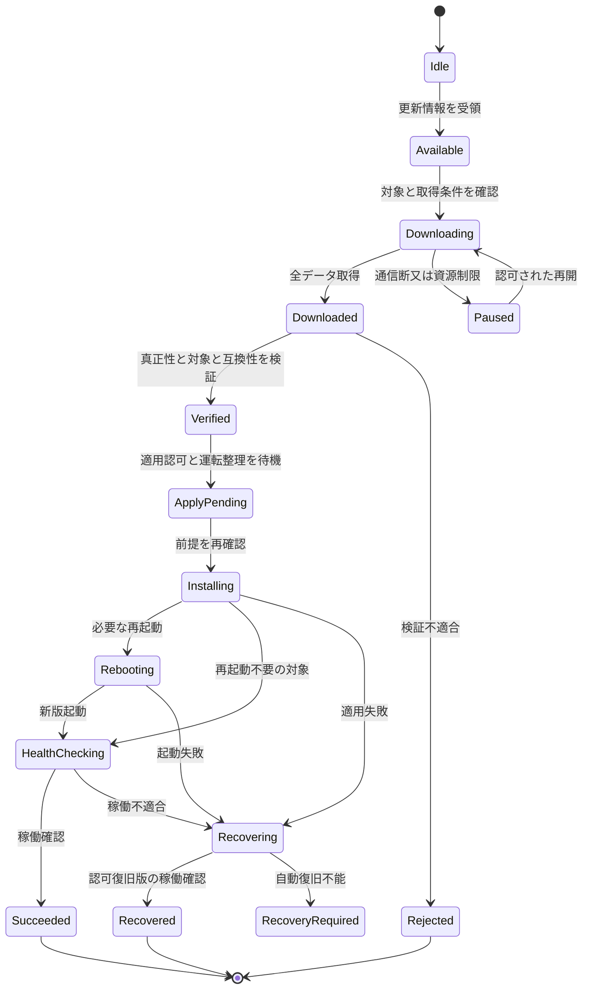

例示状態機械であり、既存更新実装を確認したものではない。各遷移の永続化・再開可否・取消し可能点・上位通知を確定する。取得だけの障害で稼働中の通常運転を停止させない。適用開始後の中断を取得中断と同じ扱いにしない。ダウンロード済み配布物がある場合の上位断中の適用許可は、事前運用ポリシーと現在認可の有効性に従い判断する。

容量・CPU・帯域の予算を通常通信と分け、取得集中によるG側通信への干渉を評価する。Web資産、API、設定schema、更新機構の互換性をリリース契約に含める。アプリ又はWebの旧版で未知の操作を送らず、非互換時は更新要求・限定表示・読取専用等の規定処置とする。

## 20.13 代表ユースケース

### SYS-UC-16：宅内Web UIで監視する

ブラウザが直接又はルータ経由でGWへ接続し、ローカル認証後に権限内の状態Viewを取得する。クラウド不通でも、当該ローカルネットワークとGWが稼働する範囲で基本監視を行う。状態不明・古いデータ・接続不能を区別し、過剰な実機読出しを発生させない。

### SYS-UC-17：アプリからリモート操作する

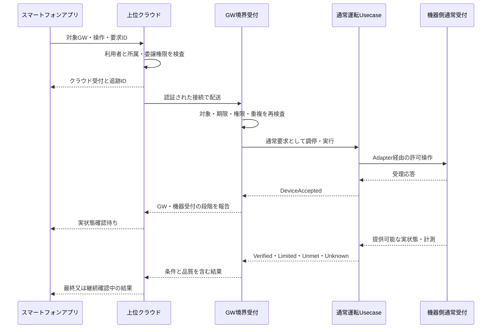

通常運転UsecaseはArbiter→Orchestrator→DPC/FLCをまとめた表記である。上位サーバが停止しても機器側保護は継続し、完了結果の配送不能と機器操作未実行を混同しない。

### SYS-UC-18：クラウドとWeb UIの設定変更が競合する

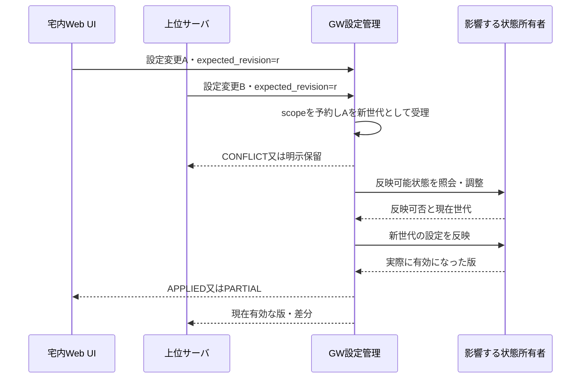

本図ではAが先に確定する例だが、ローカルが常に優先する規則ではない。決めるのは操作者の権限、競合scope、反映条件及び運用ポリシーであり、到着経路だけで優先度を付与しない。

### SYS-UC-19：GW内部機能を操作する

上位サーバから再探索等の操作を受け、許可リスト・状態・競合を確認してJobを発行する。GW応答喪失時はJob IDで復帰後に照会し、同じ再起動を無条件に繰り返さない。機器運転が必要な部分は通常制御へ委譲し、診断経路から生電文を注入しない。

### SYS-UC-20：FW配信サーバから取得・適用する

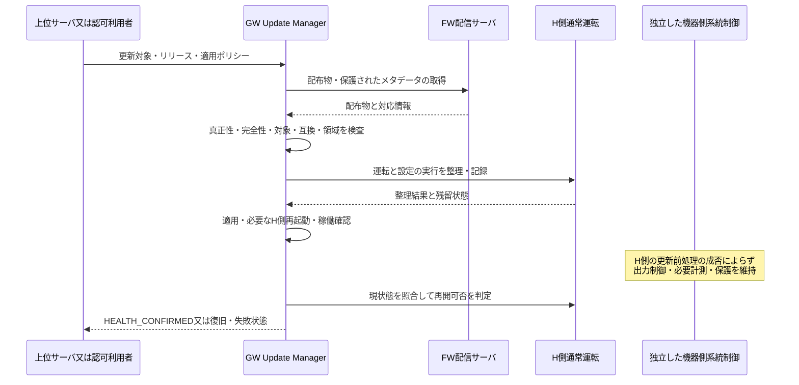

配信サーバは画像を送るだけで直接適用しない。署名・対象領域の検査に失敗した画像は、管理者操作でも通常経路から適用できない。

### SYS-UC-21：上位不通・再接続

ローカル監視と利用可能な自律制御を継続し、リモート画面にはオフラインと最終観測を表示する。結果・イベントの保持には上限を設ける。再接続時は世代と現在状態を同期し、期限切れ・旧所有者・競合した設定を破棄又は再承認へ送る。

### SYS-UC-22：通信設定変更後に応答経路を失う

適用前に変更Jobを記録し、確認チャネルと復旧方針を決める。新経路確認が得られない場合は、当該設定で許された復旧手順へ移行する。G側への影響が判明した共有資源の変更を、ローカル画面の便利機能として無条件実行しない。

## 20.14 障害・利用可能性マトリクス

| 条件 | 宅内Web UI | リモートアプリ | FW | 通常運転・系統制御 |
|---|---|---|---|---|
| 上位管理サービス停止 | GWと宅内経路が生存すれば利用可 | 未同期・操作不可を表示 | 独立FW経路と事前ポリシー次第 | 自律HEMSの成立条件で継続、G側は独立 |
| FW配信サービス停止 | 通常継続 | 通常監視・許可操作は継続 | 取得保留・再試行制限 | 稼働中FWを維持、G側は独立 |
| WAN断 | 宅内LAN又は直接接続は利用可 | 最終受信値とオフライン | 取得中断 | 外部入力依存の計画を縮退、OCUは適用仕様 |
| 宅内ルータ停止 | ルータ経由不可、直接は対応HW・機能次第 | GWオフライン | 通常のWAN取得不可 | G側の外部通信断を独立に処理 |
| 直接接続でSTA停止 | 直接画面は利用可 | GWオフラインになり得る | 保留 | G側へ影響しない前提を評価 |
| Webサービスのみ停止 | 画面不可 | 上位接続が独立なら利用可能な範囲を定義 | 実行中更新との関係を確認 | 表示障害と制御障害を分ける |
| H側FW適用・再起動 | 一時中断 | 適用中又は情報不明を表示 | 永続Jobから復旧 | 通常要求残留を別管理、G側は独立 |
| 機器通信断 | GWは見えるが機器状態不明 | 同じ状態を表示 | GW FWの状態とは別 | 物理結果不明・機器別縮退 |
| 共通電源・熱・NIC障害 | 影響範囲次第 | 影響範囲次第 | 影響範囲次第 | H限定故障と分けて評価 |

『利用可』にはローカル認可情報の有効性、端末到達性、GWの稼働が必要である。期限切れ資格を無制限に許すという意味ではない。

## 20.15 仕様を確定させる入口

最初に上位操作・公開データ・FW更新対象を台帳へ列挙し、許可scope、状態所有者、通信条件、影響するG側共通資源を対応付ける。続いて直接接続方式、ローカル認証、GW起点のクラウド接続、上位保留ポリシーを確定する。詳細は[Open Issues](#ap-open-issues)、[IF台帳](#ap-external-interface-register)、[Operation Catalog](#ap-northbound-operation-catalog)を参照。

## 20.19 R3導入・R4適用：方式選択状態の監視と保守境界

両方式でも本章のFW配信・上位管理・宅内Web UI・リモートアプリを維持する。監視Viewに設定方式と実際の有効方式、対象scope、スケジュール所有者、通信健全性、適用状態、切替進行、品質を追加する。PCS_DIRECTで非公開の情報はNOT_EXPOSED、取得不明はUNKNOWNとして表示し、無制限・未制御と断定しない。

通常ユーザーには読取と既存の許可操作を提供する。方式変更の入力欄を設ける場合も、施工・保守権限、対象機器の対応、G側の独立認可、現設定世代、実機確認、必要手続きを満たす専用Jobとする。クラウド受付・設定保存を切替完了として表示しない。実装する保守チャネルは未確定。

## 20.20 R3導入・R4適用：更新・復元・無線変更と方式

H側FW配信では方式binding、G側スケジュール原本・時刻・資格情報・FWを変更しない。GW_MANAGED用のG側更新が必要なら別の対象・承認・適用条件・復旧契約として管理し、本章の通常H側更新へ同梱しない。サーバ筐体は共用可能でも論理権限を分ける。

AP／STA切替・ネットワーク設定・GW再起動がG側サーバ通信又はPCS必須通信を止めるなら、通常Web接続変更として無条件許可しない。PCS_DIRECTでもPCSが使う共有ルータ等の影響は別評価する。監視経路の障害を理由に出力制御の方式を自動変更しない。

## 20.21 R4：全取得通信のルータ経由化と画面表示

宅内Web直接接続、ルータ経由Web、クラウド経由アプリ、FW配信と上位管理は維持する。PCS_DIRECTは「PCS自律取得方式（宅内ルータ経由・GW非経由）」と表示する。GW上位接続／PCS通常EL応答／PCSサーバ取得・適用を別の観測状態にする。FW転送・ネットワーク設定・AP/STA切替が共有ルータ経路を阻害する条件を評価し、画面の通信断から方式を自動変更しない。

<!-- R6:COMPLETION_ITEMS -->

> **R6の補完範囲：** 以下はレビューA1から追加した章節項の記入枠であり、数値・機種・機能採否・個別規格適用を推定した確定仕様ではない。各項末のリンクから、本章末尾の具体的な質問・必要資料・確定時点を確認できる。

**記入先・関連する規範候補別冊：** [外部・内部IF契約の具体化項目](#ap-interface-contract-detail) ／ [UI・警報・通知の規範候補台帳](#ap-ui-alarm-register)

## 20.22 公開IFの操作別確定

### 20.22.1 上位プロトコルとGW内部機能の公開一覧

**補完項目ID：** `SLOT-R6-20-01`。**対応観点：** C12, C13, C16（[レビューA1](sources/review/R5_Coverage_Review_A1.md)）。

R5の既存原則は保持するが、この項の全対象・具体条件・規範参照は未確定。

**本項に記載する仕様項目：**

- 接続開始側・ネットワーク・schema。
- 読取/設定/内部操作/制御/更新の実操作。
- 認可・結果・並行・エラー・期限。

**本項の完成判定：** 16件の論理IFを実契約へ展開し、公開操作台帳を実項目・権限・状態・結果へ対応付ける。

**具体的な不足：** [OQ-R6-20-01](#oq-r6-20-01)。採用値・参照版・対象外理由は回答後に本項又は版指定の規範別冊へ反映する。

### 20.22.2 FW対象・配信・適用・互換・復旧

**補完項目ID：** `SLOT-R6-20-04`。**対応観点：** C20, C34（[レビューA1](sources/review/R5_Coverage_Review_A1.md)）。

R5の既存原則は保持するが、この項の全対象・具体条件・規範参照は未確定。

**本項に記載する仕様項目：**

- 画像種別・HW/FW対象・H/G範囲。
- 署名/承認・互換・容量・適用条件。
- 中断・起動確認・復旧・通知。

**本項の完成判定：** 更新プロファイルを画像/対象/版/認可/段階/復旧条件で確定し、一般H更新からG変更を除外する。

**具体的な不足：** [OQ-R6-20-04](#oq-r6-20-04)。採用値・参照版・対象外理由は回答後に本項又は版指定の規範別冊へ反映する。

### 20.22.3 オフライン・通知・認可失効の契約

**補完項目ID：** `SLOT-R6-20-05`。**対応観点：** C15, C21, C24（[レビューA1](sources/review/R5_Coverage_Review_A1.md)）。

R5の既存原則は保持するが、この項の全対象・具体条件・規範参照は未確定。

**本項に記載する仕様項目：**

- 要求TTL/重複/結果照会。
- オフライン画面とキャッシュ。
- 所属・失効・端末紛失・再接続。

**本項の完成判定：** 操作別キュー/TTL/冪等保持、再同期、端末・所有者変更時の失効と表示規則を確定する。

**具体的な不足：** [OQ-R6-20-05](#oq-r6-20-05)。採用値・参照版・対象外理由は回答後に本項又は版指定の規範別冊へ反映する。

## 20.23 UI・警報・操作性の製品契約

### 20.23.1 画面・表示項目・対応端末・操作確認

**補完項目ID：** `SLOT-R6-20-02`。**対応観点：** C02, C24（[レビューA1](sources/review/R5_Coverage_Review_A1.md)）。

R5の既存原則は保持するが、この項の全対象・具体条件・規範参照は未確定。

**本項に記載する仕様項目：**

- 画面ID・ロール・対象状態。
- 表示項目/単位/丸め/鮮度/欠測。
- 確認/取消し/結果不明・ブラウザ/OS。

**本項の完成判定：** 画面×項目×操作×ロール表と対応端末表、利用者タスクの受入条件を確定する。ピクセル設計はUI詳細へ配賦する。

**具体的な不足：** [OQ-R6-20-02](#oq-r6-20-02)。採用値・参照版・対象外理由は回答後に本項又は版指定の規範別冊へ反映する。

### 20.23.2 警報・通知・確認・抑止・解除

**補完項目ID：** `SLOT-R6-20-03`。**対応観点：** C19, C24（[レビューA1](sources/review/R5_Coverage_Review_A1.md)）。

R5の既存原則は保持するが、この項の全対象・具体条件・規範参照は未確定。

**本項に記載する仕様項目：**

- 警報ID・重大度・発生/解除条件。
- 通知先・再通知・時刻・鮮度。
- 確認済み/原因解消・抑止権限。

**本項の完成判定：** 警報台帳を故障ID・UI・上位イベントへ対応付け、確認済みが制約解除を意味しない条件を明記する。

**具体的な不足：** [OQ-R6-20-03](#oq-r6-20-03)。採用値・参照版・対象外理由は回答後に本項又は版指定の規範別冊へ反映する。

<!-- R6:OPEN_QUESTIONS -->

## Open Questions — 本ノートを完成させるための未決事項

以下は本章の具体的な未決事項。**担当者・回答期限の日付・採用値・承認結果は未確定**である。担当ロールと確定ゲートは提案。回答を得ただけでは閉じず、根拠確認・決定・本文と関連台帳への反映を行う。
全体索引：[Open Question横断台帳](#ap-open-question-register)。各質問の編集正本は[data/completion_items.json](data/completion_items.json)。

### OQ-R6-20-01 — 上位プロトコルとGW内部機能の公開一覧

**対象項：** [20.22.1 上位プロトコルとGW内部機能の公開一覧](#slot-r6-20-01)

**質問：** 上位管理が読み書きする実項目と内部操作はどれか。プロトコル、公開schema、役割権限、完了通知・エラーをどう固定するか。

**必要資料・完了条件：** 16件の論理IFを実契約へ展開し、公開操作台帳を実項目・権限・状態・結果へ対応付ける。

**決定担当：** 未割当（候補：クラウド/GW IF・セキュリティ設計）。承認者：未定。

**確定時点：** G2＝該当するIF・データ・操作等の詳細契約確定前（提案）。回答期限の日付：未定。

**未解決時の制約：** 「上位プロトコルとGW内部機能の公開一覧」を対象構成の確定保証・実装受入根拠として使用しない。

**既存ID：** SYS-TBD-013, SYS-TBD-017, PAR-UP-01, PAR-UP-02, PAR-UP-03, PAR-UP-13。

**状態：** OPEN。**回答：** 未記入。**決定記録：** 未記入。

### OQ-R6-20-02 — 画面・表示項目・対応端末・操作確認

**対象項：** [20.23.1 画面・表示項目・対応端末・操作確認](#slot-r6-20-02)

**質問：** 宅内Web・スマートフォン・本体表示で提供する画面と項目は何か。対応端末、更新周期、色以外の区別、重要操作確認、多言語等の適用をどう決めるか。

**必要資料・完了条件：** 画面×項目×操作×ロール表と対応端末表、利用者タスクの受入条件を確定する。ピクセル設計はUI詳細へ配賦する。

**決定担当：** 未割当（候補：UI/UX・製品企画・QA）。承認者：未定。

**確定時点：** G2＝該当するIF・データ・操作等の詳細契約確定前（提案）。回答期限の日付：未定。

**未解決時の制約：** 「画面・表示項目・対応端末・操作確認」を対象構成の確定保証・実装受入根拠として使用しない。

**既存ID：** SYS-TBD-015, SYS-TBD-022, PAR-UP-04, PAR-UP-05。

**状態：** OPEN。**回答：** 未記入。**決定記録：** 未記入。

### OQ-R6-20-03 — 警報・通知・確認・抑止・解除

**対象項：** [20.23.2 警報・通知・確認・抑止・解除](#slot-r6-20-03)

**質問：** 通信断、出力制限、Unknown、更新失敗、保存異常等をどの警報として誰へ通知するか。確認・抑止・再通知・解除の条件と優先順位は何か。

**必要資料・完了条件：** 警報台帳を故障ID・UI・上位イベントへ対応付け、確認済みが制約解除を意味しない条件を明記する。

**決定担当：** 未割当（候補：運用・UI・故障設計）。承認者：未定。

**確定時点：** G2＝該当するIF・データ・操作等の詳細契約確定前（提案）。回答期限の日付：未定。

**未解決時の制約：** 「警報・通知・確認・抑止・解除」を対象構成の確定保証・実装受入根拠として使用しない。

**既存ID：** SYS-TBD-008, SYS-TBD-022, SYS-TBD-029。

**状態：** OPEN。**回答：** 未記入。**決定記録：** 未記入。

### OQ-R6-20-04 — FW対象・配信・適用・互換・復旧

**対象項：** [20.22.2 FW対象・配信・適用・互換・復旧](#slot-r6-20-04)

**質問：** FW配信が扱う対象はH側のみか、独立G保守を含む別配布か。画像形式・検証・適用条件・旧版復帰と各画面の成功判定をどう定めるか。

**必要資料・完了条件：** 更新プロファイルを画像/対象/版/認可/段階/復旧条件で確定し、一般H更新からG変更を除外する。

**決定担当：** 未割当（候補：FW更新・セキュリティ・運用設計）。承認者：未定。

**確定時点：** G2＝該当するIF・データ・操作等の詳細契約確定前（提案）。回答期限の日付：未定。

**未解決時の制約：** 「FW対象・配信・適用・互換・復旧」を対象構成の確定保証・実装受入根拠として使用しない。

**既存ID：** SYS-TBD-018, SYS-TBD-023, PAR-UP-10, PAR-UP-12。

**状態：** OPEN。**回答：** 未記入。**決定記録：** 未記入。

### OQ-R6-20-05 — オフライン・通知・認可失効の契約

**対象項：** [20.22.3 オフライン・通知・認可失効の契約](#slot-r6-20-05)

**質問：** 上位断中にどの要求を保留し、何時まで同一要求と判断するか。オフライン認可の寿命と、アプリが表示できる過去状態の条件は何か。

**必要資料・完了条件：** 操作別キュー/TTL/冪等保持、再同期、端末・所有者変更時の失効と表示規則を確定する。

**決定担当：** 未割当（候補：クラウド・アプリ・セキュリティ）。承認者：未定。

**確定時点：** G2＝該当するIF・データ・操作等の詳細契約確定前（提案）。回答期限の日付：未定。

**未解決時の制約：** 「オフライン・通知・認可失効の契約」を対象構成の確定保証・実装受入根拠として使用しない。

**既存ID：** SYS-TBD-016, SYS-TBD-019, SYS-TBD-022, PAR-UP-14。

**状態：** OPEN。**回答：** 未記入。**決定記録：** 未記入。

---

# 21. 出力制御接続方式の選択・責務・切替

根拠：[CTX-R4](sources/USER_CONTEXT_R4.md)を最優先とし、[CTX-R3](sources/USER_CONTEXT_R3.md)の二方式要求を今回の機器・接続条件で限定する。R3原本と判断履歴は[sources/baseline/R3.zip](sources/baseline/R3.zip)に保持する。R4の経路・対応表は製品仕様案であり、特定機器の実装確認・JET判断を表さない。

## 21.1 変更後の適用表

**すべての出力制御サーバ通信は宅内ルータ経由。GWを介さない取得要求・応答はECHONET Lite接続PCSだけとする。**

| 本製品で使用する機器・接続構成 | 方式識別子 | 表示名 | スケジュール取得・保存・時刻適用の主体 | サーバ取得経路 |
|---|---|---|---|---|
| ECHONET Lite接続PCS | PCS_DIRECT | PCS自律取得方式（宅内ルータ経由・GW非経由） | PCS内の出力制御機能 | PCS ↔ 宅内ルータ ↔ インターネット ↔ 出力制御サーバ |
| RS-485接続PCS | GW_MANAGED | GW管理方式（宅内ルータ経由・RS-485指示） | GWのG側 | GW G側 ↔ 宅内ルータ ↔ インターネット ↔ 出力制御サーバ |
| その他のEL機器／計測器／仮想オブジェクト | この表からは割当てない | 対象外又は別途評価 | 推測しない | 自律取得を一般化しない |

機器種別・制約責務・通信方式は概念上異なる属性だが、**R4の対応する組合せはこの表で制限する。** RS-485 PCSのPCS_DIRECT、EL接続PCSのGW_MANAGED、ルータを通らない取得を現在の選択肢へ含めない。これはRS-485又はECHONET Lite規格自体の一般的な能力制約を主張するものではない。

R3のPCS_DIRECT識別子は参照互換のため保持する。「直接」は表示から外し、物理的直結の意味を持たせない。識別子保持は無条件の旧設定再利用ではなく、型式・実接続・取得主体をR4の表で再検証する。

同じPCSが複数IFを持つ場合、実際に採用する接続プロファイルで分類する。GWがRS-485 PCSをELオブジェクトとして公開しても、物理PCSをEL自律取得とみなさない。未登録・未確認の機器へ自動的にmodeを割り当てない。

## 21.2 EL接続PCSの自律取得と通常EL通信

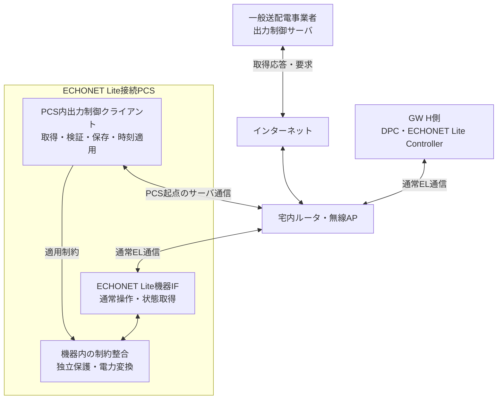

同じルータを通る二つの通信を区別する。

| 通信 | 始点・終点 | 意味 |
|---|---|---|
| 出力制御情報取得 | PCS内クライアント ↔ 出力制御サーバ | PCS自身が開始する取得要求と応答。サーバ通信仕様はTBD |
| 通常EL操作・観測 | GWのController ↔ PCSのEL機器IF | 許可された通常操作と公開状態。スケジュール原本変更ではない |

GWはPCSの取得要求の代理作成、サーバ応答の必須転送、PCS用スケジュール原本の管理をしない。PCSからサーバへの経路に、GWのNAT・ブリッジ・HTTPプロキシ等を必須にしない。宅内ルータが転送することと、GWがアプリケーション処理を代行することを混同しない。

### SYS-UC-23：ルータ経由のPCS取得と通常要求の共存

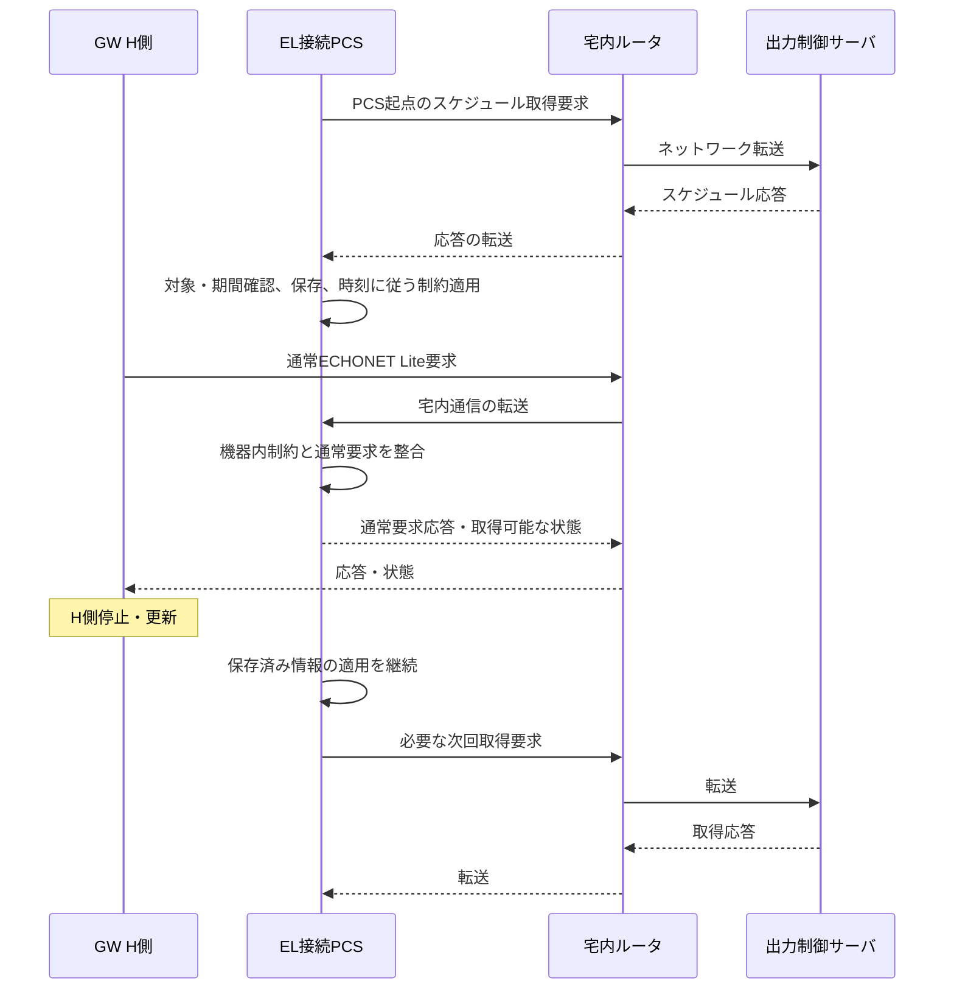

ルータはアプリケーションのスケジュール承認者ではない。図中の転送はネットワーク経路の説明であり、ルータがELやスケジュールをアプリケーション終端する実装要求ではない。共有ルータ・PCS電源等が健全な条件でGW非依存を検証する。取得版・適用状態がPCSから非公開なら、GWはNOT_EXPOSED／UNKNOWNと報告する。

## 21.3 RS-485接続PCSのGW管理

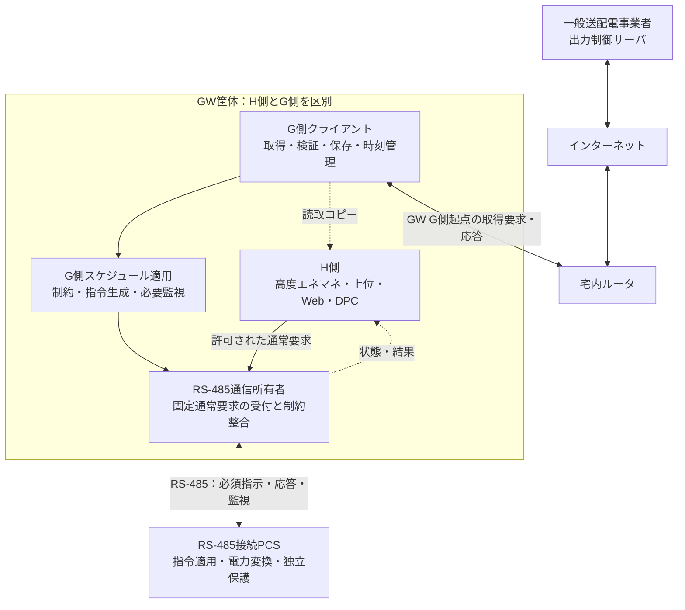

GW G側が取得・管理主体であり、単なるファイル転送機能ではない。PCSからサーバへの独自取得経路は本構成にない。RS-485上の具体電文、応答意味、設定順序、周期は未確定であり、Modbus等を仮定しない。

### SYS-UC-24：GW取得・管理からRS-485指示まで

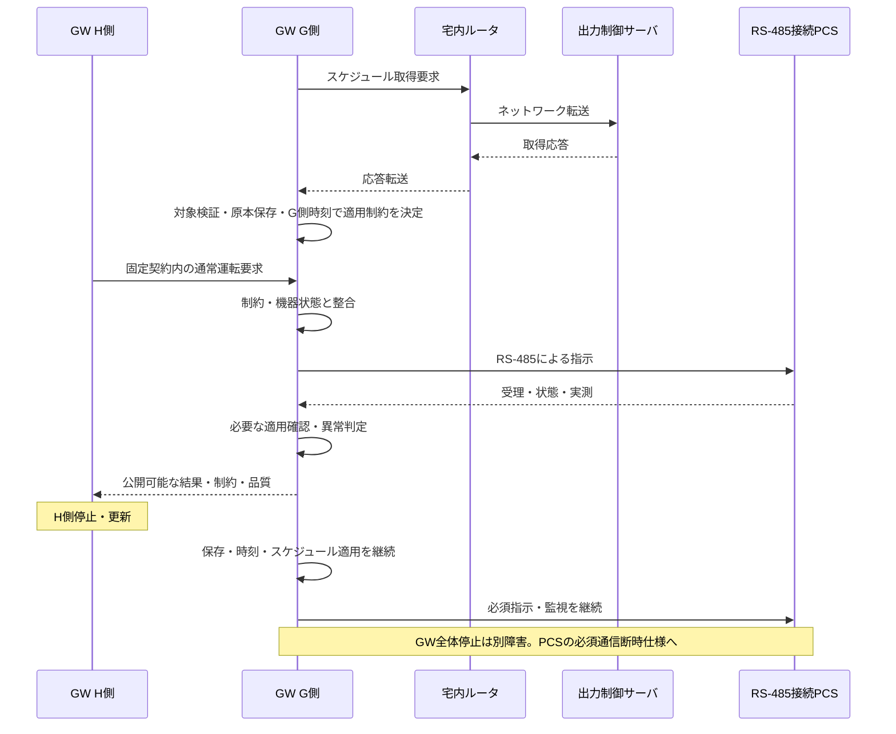

H側が通常PCS書込みを後から上書きして制約を解除できない所有構造にする。G側のネットワーク・RS-485通信をH側プロセスに依存させない。別CPUか同一CPUかは未確定であり、共通OS・NIC・reset・電源・driverの影響を評価する。

## 21.4 選択単位・混在・一意性

選択単位は`grid_control_scope_id`で表す設備／変換グループ／連系点等の範囲と、物理PCS・確認済み接続プロファイルのbindingである。R3と異なり、構成確認後も自由な二者択一ではなく21.1の適用表に制約される。

同じ宅内ルータ配下にEL自律取得PCSとRS-485のGW管理PCSが併存することは構成候補として扱える。ただし同一scopeの能動スケジュール適用主体は一つとする。保護機能、機器内の独立制限はこの排他で停止させない。

共通連系点の合算制約を複数PCSで成立させる場合、独立した計測・制約配分・適用所有者が必要かをプロファイルで確認する。ルータが同じことやGWが合計値を監視できることを、全体制約の保証にしない。別scopeへの同じID・容量の重複割当てを防ぐ。

## 21.5 設定・経路・状態のモデル

| 項目 | R4の扱い |
|---|---|
| normal_connection_class | ECHONET_LITE_PCS／RS485_PCS。物理PCSの採用接続で決定 |
| device_kind／physical_device_id | PCS自身か、非PCS／GW仮想公開かを区別 |
| supported_modes | R4適用表と機器・構成確認で得た許可集合。通常は対応する一方式 |
| desired／configured／active mode | 希望・承認保存・現実の適用を区別。未設定を補完しない |
| display_name | PCS_DIRECTはPCS自律取得方式（宅内ルータ経由・GW非経由） |
| router_profile_id／request_path／response_path | 宅内ルータを含む往復経路。PCS_DIRECTにはGW転送点を含めない |
| server_protocol_profile_id | サーバ通信契約。EL通信プロファイルとは別 |
| schedule_owner／constraint_owner／grid_control_scope_id | 原本・適用責任と最終強制の対応 |
| grid_control_epoch／configuration_revision | 系統構成世代。Arbiter epochとは別 |
| PCS取得能力の確認記録 | 型式・FW・メーカー根拠。ELクラス存在だけでは不可 |
| Job・取得・保持・適用・観測時刻・品質 | 受付／保存／実適用、不明・非公開を区別 |

[二方式テンプレート](data/grid_connection_profiles.json)はv2へ改版し、機器接続種別・ルータ必須・往復経路を追加した。両テンプレートはTEMPLATE_NOT_DEPLOYABLE、active_mode=null、確認記録は空欄である。[経路データ](data/grid_network_routes.json)も設計モデルであって実測データではない。

## 21.6 SYS-UC-25：施工・保守での対応構成の選択・変更

R4では、同一PCSの任意なPCS_DIRECT↔GW_MANAGED切替を製品要件としない。R3の管理切替手順は、**変更前後とも適用表に一致する機器交換・接続構成変更**をメーカー／保守手順が許す場合の条件付き契約として維持する。初期施工のみの対応でも、対応機種・製品要件で判断する。

| 段階 | 主な処理 | 不成立時 |
|---|---|---|
| 申請 | 実機ID、旧新接続種別・mode・scope、期待世代、認可主体・理由を登録 | 不明・一般権限・旧世代を拒否 |
| 事前検証 | R4適用表、ルータ経路、PCS取得能力又はGW必須指示、必要手続きを確認 | 適用外を保守権限で特例許可しない |
| 非能動準備 | 許可された機器手順で時刻・保存・接続・原本を確認 | 旧系の規定動作を維持 |
| 引継ぎ | 保持制約又は必要停止を成立させ旧主体を停止・フェンス | 新主体を無条件に有効化しない |
| 適用確認 | 構成世代を更新し、新しい対象機器・経路の適用を確認 | 不明・要復旧として記録 |
| 確定 | active状態を更新。H側は現状態で通常要求を再調停 | 古いログ・設定を盲目的再生しない |

サーバ・PCSの登録変更、旧取得の停止、新主体の確認手段は未確定。機器が切替をサポートしない場合はオンライン変更を提供しない。通信を跨ぐ切替が単一DB transactionで原子的に完了するとはしない。

## 21.7 構成の有効化・復旧状態

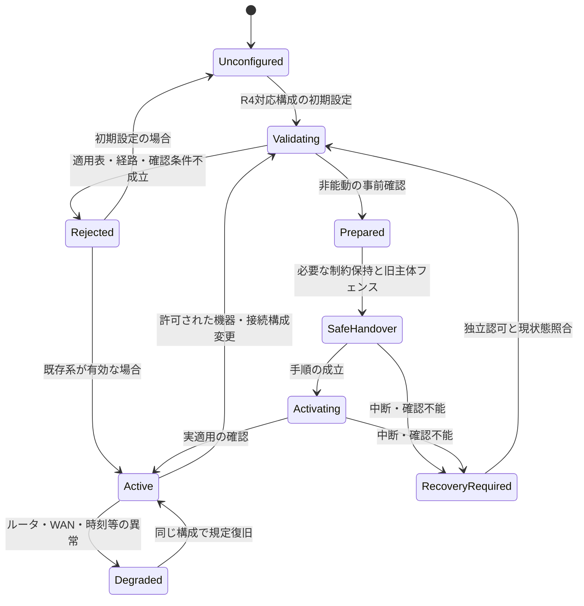

Modeの異なる自動遷移は存在しない。modeは21.1の構成表で決まる属性であり、この状態機械の状態遷移だけで別方式へ変わらない。未設定・結果不明から無制限運転を許さず、機器別の安全・保護契約を適用する。

## 21.8 障害マトリクス：ルータとGWを分ける

| 障害・条件 | EL接続PCS自律取得 | RS-485接続PCSのGW管理 |
|---|---|---|
| H側停止・更新 | PCS自身の取得・保存・適用を独立維持。通常EL制御／表示は停止し得る | G側の取得・保存・時刻・RS-485指示・必須監視を維持する設計要求 |
| GW全体電源断 | PCS・ルータ・必要電源が健全なら取得・適用にGWを要さない | G側は停止。PCSの必須通信喪失時の規定動作を確認 |
| WANのみ断・宅内LAN健全 | 新規取得不可。保持済み情報を規定に従い適用。通常EL通信は到達条件内で継続可能 | 新規取得不可。G側の保持済み適用とRS-485制御を規定に従い継続 |
| 宅内ルータ全停止 | 新規取得不可。LAN/APも停止する構成では通常EL監視も不可。PCSの保存情報とローカル動作へ | 新規取得不可。健全なGW・PCS・RS-485では保存情報の適用を継続可能。クラウドは途絶 |
| PCS側のLAN断のみ | PCSの新規取得と通常EL監視が失われ得る。GW自身のWAN正常とは両立する | RS-485機器には当該PCS側LAN経路はない。GW側LAN断はG側取得断として扱う |
| GW–PCSの通常EL通信のみ不通 | PCSのサーバ経路が健全なら自律取得を維持。両経路を同じ状態にしない | 該当しない。RS-485必須リンクは次行 |
| RS-485必須通信断 | 当該PCSの出力制御経路にはRS-485を使わない | G側又はPCSで規定の制限・停止・復旧へ。サーバ疎通で正常と判定しない |
| 保存済み情報の期限切れ／時刻異常 | PCS側の適用仕様に従う。無制限へ戻さない | G側・PCSの適用仕様に従う。無制限へ戻さない |
| FW取得・監視通信の集中 | 共有ルータ／無線／WANによる遅延・取得断を評価 | 同じ外部帯域とGW内共有NIC／driver・RS-485負荷も評価 |
| クラウド又はUIだけ不通 | 制御停止とは断定せず観測品質を不明・古いものとして表示 | 同左。H側監視サービスをG側必須処理にしない |

保持日数、検出時間、期限後処置、許容遅延を本改訂から新たに数値化しない。ルータ停止の間もスケジュールを「無期限に継続」する保証ではなく、保存情報・時刻・必要計測と適用プロファイルの有効範囲に限定する。

## 21.9 共有ルータと認証影響の扱い

GW非経由はHEMS更新からの非干渉設計を可能にする前提であり、共有ルータまで障害独立という意味ではない。GWのFW取得、ログ転送、上位監視増加、ネットワーク設定変更でPCS取得経路を阻害しないか、最大負荷・ルータ断・復旧を試験する。GWで管理できる通信量を制限し、ルータのQoSや帯域保証を未確認のまま必須前提にしない。

GW管理ではサーバ取得・時刻・保存・RS-485指令所有者をG側の変更管理に含める。H側更新でG側FW・原本・時計・bindingを変更せず、共有OS・NIC・driver・reset変更は別の影響評価へ進める。ルータが外部装置であることを理由に影響範囲から外さない。ただしルータそのものを自動的にJET登録対象と決めるものでもない。

原典の[認証影響分離](sources/architecture/04_JET_Isolation.md)の補正を維持する。物理CPU分離や本書の試験をJETの一律免除条件としない。公開資料の再検証・具体的なJET判断は本改訂で行っていない。

## 21.10 上位・Web・アプリへの表示

方式名には宅内ルータ経由を含める。GWの上位接続状態、PCSの通常EL接続状態、PCS又はGW G側の出力制御サーバ取得状態、保持・適用状態を別に表示する。GWがサーバへpingできることやELでPCSが応答することは、PCSの資格情報・取得・保存・適用の成功を証明しない。

未公開のPCS取得状態はNOT_EXPOSED、取得できたか確認不能ならUNKNOWNとする。表示の品質・観測時刻を残し、推定は推定と記す。監視のためにGWがPCSの代わりにサーバへ取得要求を送る機能は追加しない。

直接無線Web UIは端末–GWの用途として維持する。GWのAP／STA切替がG側のルータ接続を止める場合は、その操作を無影響な画面接続変更とはしない。上位からの構成変更には21.6の認可と適用表を要求する。

## 21.11 試験と静的モデルの範囲

既存T01〜T19とSYS-T01〜42を保持し、SYS-T29／30／31／33／39の条件をR4へ明示改訂した。SYS-T43〜50を追加して、ルータ経路、対象限定、不正構成、共通障害、FW負荷、経路別監視、旧設定移行を確認する。全システム試験はNOT_RUN。

`tools/validate_grid_selection.py`は文書テンプレートと合成データの適用条件だけを確認する。ルータやPCSへ接続しない。入力の確認済みフラグの真偽を実世界で検証するツールではなく、実機・切替・保護・認証試験ではない。各実機試験ではrouter設定／FW、経路図、端点、PCS/GW H/G版、接続契約、障害位置、時刻・保持・適用結果を記録する。

## 21.12 未確定事項・導入条件

R4で確定したのは宅内ルータ必須とGW非経由対象の限定である。型式、PCSの独立取得仕様、ルータ–PCS/GWの媒体・ネットワーク設定、G側実装、異常時数値、両IF機器のbinding、現地変更手順はSYS-TBD-024〜034等で確認する。

「EL接続PCSならすべて標準で自律取得できる」「同一PCSの二方式切替が実装済み」「R4移行時に既設機を自動修正できる」とはしない。R3の旧構成がR4適用外なら、記録と現在の制約維持を確認して認可された保守判断に移し、通常H側更新で稼働中のG構成を書き換えない。

<!-- R6:COMPLETION_ITEMS -->

> **R6の補完範囲：** 以下はレビューA1から追加した章節項の記入枠であり、数値・機種・機能採否・個別規格適用を推定した確定仕様ではない。各項末のリンクから、本章末尾の具体的な質問・必要資料・確定時点を確認できる。

**記入先・関連する規範候補別冊：** [R4機器接続別・ルータ経路プロファイル](#ap-grid-connection-profile) ／ [機器プロファイル拡張テンプレート](#ap-device-profile-extended)

## 21.13 現行対応表に基づく設置承認

### 21.13.1 機種別取得主体・公開状態・実経路

**補完項目ID：** `SLOT-R6-21-01`。**対応観点：** C04, C10, C17（[レビューA1](sources/review/R5_Coverage_Review_A1.md)）。

R5の既存原則は保持するが、この項の全対象・具体条件・規範参照は未確定。

**本項に記載する仕様項目：**

- EL PCS自律/GW G側管理の型式。
- ルータ・取得プロトコル・資格情報。
- 公開/非公開と可否確認。

**本項の完成判定：** 機器接続別の取得プロファイルと管理主体、公開項目の根拠を登録する。非公開はNOT_EXPOSEDと明記する。

**具体的な不足：** [OQ-R6-21-01](#oq-r6-21-01)。採用値・参照版・対象外理由は回答後に本項又は版指定の規範別冊へ反映する。

### 21.13.2 施工・保守の構成変更と故障時復旧

**補完項目ID：** `SLOT-R6-21-02`。**対応観点：** C09, C29, C34（[レビューA1](sources/review/R5_Coverage_Review_A1.md)）。

R5の既存原則は保持するが、この項の全対象・具体条件・規範参照は未確定。

**本項に記載する仕様項目：**

- 許可された機器接続の変更・scope一意性。
- 旧主体停止/新主体適用・途中電断。
- 必要手続き・復旧・実機確認。

**本項の完成判定：** 機器別変更プロファイル、必要手続き、途中失敗の回復表を確定する。自由なmode切替・自動フェイルオーバーは追加しない。

**具体的な不足：** [OQ-R6-21-02](#oq-r6-21-02)。採用値・参照版・対象外理由は回答後に本項又は版指定の規範別冊へ反映する。

<!-- R6:OPEN_QUESTIONS -->

## Open Questions — 本ノートを完成させるための未決事項

以下は本章の具体的な未決事項。**担当者・回答期限の日付・採用値・承認結果は未確定**である。担当ロールと確定ゲートは提案。回答を得ただけでは閉じず、根拠確認・決定・本文と関連台帳への反映を行う。
全体索引：[Open Question横断台帳](#ap-open-question-register)。各質問の編集正本は[data/completion_items.json](data/completion_items.json)。

### OQ-R6-21-01 — 機種別取得主体・公開状態・実経路

**対象項：** [21.13.1 機種別取得主体・公開状態・実経路](#slot-r6-21-01)

**質問：** EL接続PCSの自律取得能力・プロトコル・資格情報の管理仕様は何か。RS-485のGW管理と併せて、どの型式/版で実経路・公開状態を確認できるか。

**必要資料・完了条件：** 機器接続別の取得プロファイルと管理主体、公開項目の根拠を登録する。非公開はNOT_EXPOSEDと明記する。

**決定担当：** 未割当（候補：PCSメーカー・G側・ネットワーク設計）。承認者：未定。

**確定時点：** G1＝該当するアーキテクチャ・HW・安全境界の設計固定前（提案）。回答期限の日付：未定。

**未解決時の制約：** 「機種別取得主体・公開状態・実経路」を対象構成の確定保証・実装受入根拠として使用しない。

**既存ID：** SYS-TBD-024, SYS-TBD-029, SYS-TBD-033, PAR-GNET-04, PAR-GSEL-06。

**状態：** OPEN。**回答：** 未記入。**決定記録：** 未記入。

### OQ-R6-21-02 — 施工・保守の構成変更と故障時復旧

**対象項：** [21.13.2 施工・保守の構成変更と故障時復旧](#slot-r6-21-02)

**質問：** 構成変更をどの施工・保守手順で認可し、新旧主体の停止/適用を何で確認するか。中断時の保持状態・時間条件・ロールバック条件は何か。

**必要資料・完了条件：** 機器別変更プロファイル、必要手続き、途中失敗の回復表を確定する。自由なmode切替・自動フェイルオーバーは追加しない。

**決定担当：** 未割当（候補：施工・G側・認証/保守担当）。承認者：未定。

**確定時点：** G3＝該当する検証仕様・受入プロファイルの確定前（提案）。回答期限の日付：未定。

**未解決時の制約：** 「施工・保守の構成変更と故障時復旧」を対象構成の確定保証・実装受入根拠として使用しない。

**既存ID：** SYS-TBD-026, SYS-TBD-027, SYS-TBD-028, PAR-GSEL-01, PAR-GSEL-04。

**状態：** OPEN。**回答：** 未記入。**決定記録：** 未記入。

---

# 22. 物理・電気・機構・設置仕様

[網羅性レビューA1](sources/review/R5_Coverage_Review_A1.md)に基づく新設章。項目構造と確認先を具体化したものであり、機器の数値・規格適用・安全性・設計採用を確定したものではない。

既存HW仕様・機構仕様・運用手順等へ配賦する場合も、本章に文書ID・版・適用製品・該当箇所・受入方法を残す。未提供の関連文書が存在しないとは判断しない。記載した各項を完成させるための具体的な未決事項を本章末尾へ置く。

<!-- R6:COMPLETION_ITEMS -->

> **R6の補完範囲：** 以下はレビューA1から追加した章節項の記入枠であり、数値・機種・機能採否・個別規格適用を推定した確定仕様ではない。各項末のリンクから、本章末尾の具体的な質問・必要資料・確定時点を確認できる。

**記入先・関連する規範候補別冊：** [用語集・規範参照の確定台帳](#ap-normative-references-glossary) ／ [品質・利用目的・ライフサイクル受入の具体化項目](#ap-quality-acceptance-profiles)

## 22.1 電源・消費電力・電源事象

### 22.1.1 電源入力・定格・許容変動

**補完項目ID：** `SLOT-R6-22-01`。**対応観点：** C25（[レビューA1](sources/review/R5_Coverage_Review_A1.md)）。

R5では温度・電源・reset・設置条件をPAR-ENV-01で包括的に留保している。具体的な電源値は未提供。

**本項に記載する仕様項目：**

- 電源方式・供給元・定格/範囲。
- 電流・起動電流・消費電力の測定条件。
- 付属/指定電源・保護・接地の要否。

**本項の完成判定：** 製品型式別電源条件表を既存HW仕様のID/版へ結び付け、測定状態と受入基準を記入する。

**具体的な不足：** [OQ-R6-22-01](#oq-r6-22-01)。採用値・参照版・対象外理由は回答後に本項又は版指定の規範別冊へ反映する。

### 22.1.2 投入・瞬断・電圧低下・復電・停止

**補完項目ID：** `SLOT-R6-22-02`。**対応観点：** C09, C23, C25（[レビューA1](sources/review/R5_Coverage_Review_A1.md)）。

R5の既存原則は保持するが、この項の全対象・具体条件・規範参照は未確定。

**本項に記載する仕様項目：**

- 投入順序・起動許可・電断検出。
- H/Gのreset・brownout・保持範囲。
- 瞬断時間・再起動・データ完全性。

**本項の完成判定：** 電源事象×H/G/通信/データの期待状態表と条件値をHW・起動・保存仕様で整合させる。

**具体的な不足：** [OQ-R6-22-02](#oq-r6-22-02)。採用値・参照版・対象外理由は回答後に本項又は版指定の規範別冊へ反映する。

## 22.2 物理インターフェース・配線

### 22.2.1 端子・コネクタ・ケーブル・USB

**補完項目ID：** `SLOT-R6-22-03`。**対応観点：** C12, C25（[レビューA1](sources/review/R5_Coverage_Review_A1.md)）。

R5の既存原則は保持するが、この項の全対象・具体条件・規範参照は未確定。

**本項に記載する仕様項目：**

- 端子/コネクタ・ピン・極性・定格。
- ケーブル長/線種/終端/絶縁の適用。
- USB給電/ドングル/抜去・保守接続。

**本項の完成判定：** 端子・配線表と参照図面の版を確定し、誤接続防止、給電上限、設置検査項目へ配賦する。

**具体的な不足：** [OQ-R6-22-03](#oq-r6-22-03)。採用値・参照版・対象外理由は回答後に本項又は版指定の規範別冊へ反映する。

## 22.3 機構・設置・本体操作

### 22.3.1 外形・取付・放熱・保守空間

**補完項目ID：** `SLOT-R6-22-04`。**対応観点：** C25（[レビューA1](sources/review/R5_Coverage_Review_A1.md)）。

R5の既存原則は保持するが、この項の全対象・具体条件・規範参照は未確定。

**本項に記載する仕様項目：**

- 外形・質量・取付方向/方法。
- 周辺空間・放熱・アンテナ条件。
- 屋内/屋外設置・付属品・保守アクセス。

**本項の完成判定：** 製品構成別の機構・設置条件と図面参照を確定し、施工・温度評価・安全要求へ対応付ける。

**具体的な不足：** [OQ-R6-22-04](#oq-r6-22-04)。採用値・参照版・対象外理由は回答後に本項又は版指定の規範別冊へ反映する。

### 22.3.2 表示器・LED・ボタン・ラベル

**補完項目ID：** `SLOT-R6-22-05`。**対応観点：** C24, C25, C28（[レビューA1](sources/review/R5_Coverage_Review_A1.md)）。

R5の既存原則は保持するが、この項の全対象・具体条件・規範参照は未確定。

**本項に記載する仕様項目：**

- 本体I/Oの有無・意味・操作条件。
- 長押し/初期化/再起動・誤操作。
- 製品個体表示・注意・出荷表示。

**本項の完成判定：** 本体表示/操作表とラベル項目を実HWへ対応付け、UI・安全・製造出荷の表と整合する。

**具体的な不足：** [OQ-R6-22-05](#oq-r6-22-05)。採用値・参照版・対象外理由は回答後に本項又は版指定の規範別冊へ反映する。

<!-- R6:OPEN_QUESTIONS -->

## Open Questions — 本ノートを完成させるための未決事項

以下は本章の具体的な未決事項。**担当者・回答期限の日付・採用値・承認結果は未確定**である。担当ロールと確定ゲートは提案。回答を得ただけでは閉じず、根拠確認・決定・本文と関連台帳への反映を行う。
全体索引：[Open Question横断台帳](#ap-open-question-register)。各質問の編集正本は[data/completion_items.json](data/completion_items.json)。

### OQ-R6-22-01 — 電源入力・定格・許容変動

**対象項：** [22.1.1 電源入力・定格・許容変動](#slot-r6-22-01)

**質問：** GWの電源方式、定格・許容変動・最大電流/消費電力は何か。外付け電源、接地、接続保護をどのHW仕様に委ねるか。

**必要資料・完了条件：** 製品型式別電源条件表を既存HW仕様のID/版へ結び付け、測定状態と受入基準を記入する。

**決定担当：** 未割当（候補：HW・電源・製品安全担当）。承認者：未定。

**確定時点：** G1＝該当するアーキテクチャ・HW・安全境界の設計固定前（提案）。回答期限の日付：未定。

**未解決時の制約：** 「電源入力・定格・許容変動」を対象構成の確定保証・実装受入根拠として使用しない。

**既存ID：** PAR-ENV-01。

**状態：** OPEN。**回答：** 未記入。**決定記録：** 未記入。

### OQ-R6-22-02 — 投入・瞬断・電圧低下・復電・停止

**対象項：** [22.1.2 投入・瞬断・電圧低下・復電・停止](#slot-r6-22-02)

**質問：** 瞬断・電圧低下・復電時にH側/G側/PCS指令/保存データをどう扱うか。独立電源や保持機能は存在するか、どこまで保証するか。

**必要資料・完了条件：** 電源事象×H/G/通信/データの期待状態表と条件値をHW・起動・保存仕様で整合させる。

**決定担当：** 未割当（候補：HW・起動復旧・G側設計）。承認者：未定。

**確定時点：** G1＝該当するアーキテクチャ・HW・安全境界の設計固定前（提案）。回答期限の日付：未定。

**未解決時の制約：** 「投入・瞬断・電圧低下・復電・停止」を対象構成の確定保証・実装受入根拠として使用しない。

**既存ID：** TBD-011, PAR-ENV-01, PAR-DATA-02。

**状態：** OPEN。**回答：** 未記入。**決定記録：** 未記入。

### OQ-R6-22-03 — 端子・コネクタ・ケーブル・USB

**対象項：** [22.2.1 端子・コネクタ・ケーブル・USB](#slot-r6-22-03)

**質問：** RS-485、LAN、USB等の実コネクタと電気・配線条件は何か。USB給電・接続可能機器、RS-485終端・接地等はどの規範資料に従うか。

**必要資料・完了条件：** 端子・配線表と参照図面の版を確定し、誤接続防止、給電上限、設置検査項目へ配賦する。

**決定担当：** 未割当（候補：HW・通信・機構設計）。承認者：未定。

**確定時点：** G1＝該当するアーキテクチャ・HW・安全境界の設計固定前（提案）。回答期限の日付：未定。

**未解決時の制約：** 「端子・コネクタ・ケーブル・USB」を対象構成の確定保証・実装受入根拠として使用しない。

**既存ID：** SYS-TBD-002, PAR-RS-01, PAR-ENV-01。

**状態：** OPEN。**回答：** 未記入。**決定記録：** 未記入。

### OQ-R6-22-04 — 外形・取付・放熱・保守空間

**対象項：** [22.3.1 外形・取付・放熱・保守空間](#slot-r6-22-04)

**質問：** 外形、質量、取付方法・姿勢、放熱/保守空間、アンテナ・設置場所の制約は何か。既存筐体仕様のどこを参照するか。

**必要資料・完了条件：** 製品構成別の機構・設置条件と図面参照を確定し、施工・温度評価・安全要求へ対応付ける。

**決定担当：** 未割当（候補：機構・HW・施工設計）。承認者：未定。

**確定時点：** G1＝該当するアーキテクチャ・HW・安全境界の設計固定前（提案）。回答期限の日付：未定。

**未解決時の制約：** 「外形・取付・放熱・保守空間」を対象構成の確定保証・実装受入根拠として使用しない。

**既存ID：** PAR-ENV-01。

**状態：** OPEN。**回答：** 未記入。**決定記録：** 未記入。

### OQ-R6-22-05 — 表示器・LED・ボタン・ラベル

**対象項：** [22.3.2 表示器・LED・ボタン・ラベル](#slot-r6-22-05)

**質問：** GWにあるLED、ボタン、表示器、ラベルは何か。状態表示とボタン操作は何を意味し、工場初期化やG側再起動へどう影響するか。

**必要資料・完了条件：** 本体表示/操作表とラベル項目を実HWへ対応付け、UI・安全・製造出荷の表と整合する。

**決定担当：** 未割当（候補：機構・UI・製品安全・製造）。承認者：未定。

**確定時点：** G2＝該当するIF・データ・操作等の詳細契約確定前（提案）。回答期限の日付：未定。

**未解決時の制約：** 「表示器・LED・ボタン・ラベル」を対象構成の確定保証・実装受入根拠として使用しない。

**既存ID：** PAR-ENV-01, SYS-TBD-017。

**状態：** OPEN。**回答：** 未記入。**決定記録：** 未記入。

---

# 23. 環境・EMC・静電気・輸送保管仕様

[網羅性レビューA1](sources/review/R5_Coverage_Review_A1.md)に基づく新設章。項目構造と確認先を具体化したものであり、機器の数値・規格適用・安全性・設計採用を確定したものではない。

既存HW仕様・機構仕様・運用手順等へ配賦する場合も、本章に文書ID・版・適用製品・該当箇所・受入方法を残す。未提供の関連文書が存在しないとは判断しない。記載した各項を完成させるための具体的な未決事項を本章末尾へ置く。

<!-- R6:COMPLETION_ITEMS -->

> **R6の補完範囲：** 以下はレビューA1から追加した章節項の記入枠であり、数値・機種・機能採否・個別規格適用を推定した確定仕様ではない。各項末のリンクから、本章末尾の具体的な質問・必要資料・確定時点を確認できる。

**記入先・関連する規範候補別冊：** [用語集・規範参照の確定台帳](#ap-normative-references-glossary) ／ [品質・利用目的・ライフサイクル受入の具体化項目](#ap-quality-acceptance-profiles)

## 23.1 使用・保管環境

### 23.1.1 温湿度・結露・標高・汚損等の適用

**補完項目ID：** `SLOT-R6-23-01`。**対応観点：** C27（[レビューA1](sources/review/R5_Coverage_Review_A1.md)）。

R5の既存原則は保持するが、この項の全対象・具体条件・規範参照は未確定。

**本項に記載する仕様項目：**

- 動作/非動作/保管の区分。
- 温度・湿度・結露・必要な環境条件。
- 構成/負荷・評価基準・故障後動作。

**本項の完成判定：** 環境適用表へ対象/対象外と根拠、試験条件・合否・参照規格を登録する。数値はHW仕様と使用環境から決める。

**具体的な不足：** [OQ-R6-23-01](#oq-r6-23-01)。採用値・参照版・対象外理由は回答後に本項又は版指定の規範別冊へ反映する。

### 23.1.2 屋外・防塵防水・日射・腐食・放熱

**補完項目ID：** `SLOT-R6-23-02`。**対応観点：** C25, C27（[レビューA1](sources/review/R5_Coverage_Review_A1.md)）。

R5の既存原則は保持するが、この項の全対象・具体条件・規範参照は未確定。

**本項に記載する仕様項目：**

- 屋外採用と設置保護。
- 保護等級・日射/降雨/腐食等の適用。
- 筐体開閉/配線部・放熱との関係。

**本項の完成判定：** 屋内/屋外の製品構成別に適用範囲を決定し、保護等級等は根拠資料・検証方法とセットで確定する。

**具体的な不足：** [OQ-R6-23-02](#oq-r6-23-02)。採用値・参照版・対象外理由は回答後に本項又は版指定の規範別冊へ反映する。

## 23.2 電磁環境・静電気・電源耐性

### 23.2.1 EMC・ESD・サージ等の評価対象

**補完項目ID：** `SLOT-R6-23-03`。**対応観点：** C27, C31（[レビューA1](sources/review/R5_Coverage_Review_A1.md)）。

R5の既存原則は保持するが、この項の全対象・具体条件・規範参照は未確定。

**本項に記載する仕様項目：**

- 適用規格・ポート・接地・ケーブル。
- 放射/伝導・静電気・過渡の適用。
- 許容劣化・復旧・H/G制御への影響。

**本項の完成判定：** 適用規格・版・試験レベル・結合条件・判定基準を評価担当と確定し、G側成立条件と矛盾しないことを確認する。

**具体的な不足：** [OQ-R6-23-03](#oq-r6-23-03)。採用値・参照版・対象外理由は回答後に本項又は版指定の規範別冊へ反映する。

## 23.3 輸送・保管・梱包

### 23.3.1 振動・衝撃・保管・輸送後受入

**補完項目ID：** `SLOT-R6-23-04`。**対応観点：** C27, C28（[レビューA1](sources/review/R5_Coverage_Review_A1.md)）。

R5の既存原則は保持するが、この項の全対象・具体条件・規範参照は未確定。

**本項に記載する仕様項目：**

- 梱包状態・非梱包状態。
- 振動/衝撃・温湿度・保管期限の適用。
- 輸送後の外観/電気/通信/安全確認。

**本項の完成判定：** 梱包・物流条件と評価対象/対象外を決定し、製造出荷/施工前確認の受入項目へ参照する。

**具体的な不足：** [OQ-R6-23-04](#oq-r6-23-04)。採用値・参照版・対象外理由は回答後に本項又は版指定の規範別冊へ反映する。

<!-- R6:OPEN_QUESTIONS -->

## Open Questions — 本ノートを完成させるための未決事項

以下は本章の具体的な未決事項。**担当者・回答期限の日付・採用値・承認結果は未確定**である。担当ロールと確定ゲートは提案。回答を得ただけでは閉じず、根拠確認・決定・本文と関連台帳への反映を行う。
全体索引：[Open Question横断台帳](#ap-open-question-register)。各質問の編集正本は[data/completion_items.json](data/completion_items.json)。

### OQ-R6-23-01 — 温湿度・結露・標高・汚損等の適用

**対象項：** [23.1.1 温湿度・結露・標高・汚損等の適用](#slot-r6-23-01)

**質問：** 動作・保管の温湿度や結露条件は何か。標高・汚損等を適用対象にするか。H/G最大負荷と同居条件で何を保証するか。

**必要資料・完了条件：** 環境適用表へ対象/対象外と根拠、試験条件・合否・参照規格を登録する。数値はHW仕様と使用環境から決める。

**決定担当：** 未割当（候補：HW・環境試験・製品企画）。承認者：未定。

**確定時点：** G1＝該当するアーキテクチャ・HW・安全境界の設計固定前（提案）。回答期限の日付：未定。

**未解決時の制約：** 「温湿度・結露・標高・汚損等の適用」を対象構成の確定保証・実装受入根拠として使用しない。

**既存ID：** PAR-ENV-01, TBD-011。

**状態：** OPEN。**回答：** 未記入。**決定記録：** 未記入。

### OQ-R6-23-02 — 屋外・防塵防水・日射・腐食・放熱

**対象項：** [23.1.2 屋外・防塵防水・日射・腐食・放熱](#slot-r6-23-02)

**質問：** 屋外設置を正式採用するか。防塵防水、日射、雨水、腐食等の必要条件と、配線・筐体開閉時の制限は何か。

**必要資料・完了条件：** 屋内/屋外の製品構成別に適用範囲を決定し、保護等級等は根拠資料・検証方法とセットで確定する。

**決定担当：** 未割当（候補：機構・製品企画・安全/環境担当）。承認者：未定。

**確定時点：** G1＝該当するアーキテクチャ・HW・安全境界の設計固定前（提案）。回答期限の日付：未定。

**未解決時の制約：** 「屋外・防塵防水・日射・腐食・放熱」を対象構成の確定保証・実装受入根拠として使用しない。

**既存ID：** PAR-ENV-01。

**状態：** OPEN。**回答：** 未記入。**決定記録：** 未記入。

### OQ-R6-23-03 — EMC・ESD・サージ等の評価対象

**対象項：** [23.2.1 EMC・ESD・サージ等の評価対象](#slot-r6-23-03)

**質問：** 各ポート・設置条件でEMC、静電気、サージ等のどの試験が必要か。通信停止・reset・制御への影響にどの性能判定基準を用いるか。

**必要資料・完了条件：** 適用規格・版・試験レベル・結合条件・判定基準を評価担当と確定し、G側成立条件と矛盾しないことを確認する。

**決定担当：** 未割当（候補：EMC評価・HW・認証担当）。承認者：未定。

**確定時点：** G3＝該当する検証仕様・受入プロファイルの確定前（提案）。回答期限の日付：未定。

**未解決時の制約：** 「EMC・ESD・サージ等の評価対象」を対象構成の確定保証・実装受入根拠として使用しない。

**既存ID：** PAR-ENV-01, TBD-011。

**状態：** OPEN。**回答：** 未記入。**決定記録：** 未記入。

### OQ-R6-23-04 — 振動・衝撃・保管・輸送後受入

**対象項：** [23.3.1 振動・衝撃・保管・輸送後受入](#slot-r6-23-04)

**質問：** 輸送・保管で想定する荷姿・期間・振動/衝撃/環境条件は何か。輸送後に何が維持されれば合格とするか。

**必要資料・完了条件：** 梱包・物流条件と評価対象/対象外を決定し、製造出荷/施工前確認の受入項目へ参照する。

**決定担当：** 未割当（候補：機構・物流・製造品質）。承認者：未定。

**確定時点：** G3＝該当する検証仕様・受入プロファイルの確定前（提案）。回答期限の日付：未定。

**未解決時の制約：** 「振動・衝撃・保管・輸送後受入」を対象構成の確定保証・実装受入根拠として使用しない。

**既存ID：** PAR-ENV-01。

**状態：** OPEN。**回答：** 未記入。**決定記録：** 未記入。

---

# 24. 製品安全・危険源・遠隔操作安全

[網羅性レビューA1](sources/review/R5_Coverage_Review_A1.md)に基づく新設章。項目構造と確認先を具体化したものであり、機器の数値・規格適用・安全性・設計採用を確定したものではない。

既存HW仕様・機構仕様・運用手順等へ配賦する場合も、本章に文書ID・版・適用製品・該当箇所・受入方法を残す。未提供の関連文書が存在しないとは判断しない。記載した各項を完成させるための具体的な未決事項を本章末尾へ置く。

<!-- R6:COMPLETION_ITEMS -->

> **R6の補完範囲：** 以下はレビューA1から追加した章節項の記入枠であり、数値・機種・機能採否・個別規格適用を推定した確定仕様ではない。各項末のリンクから、本章末尾の具体的な質問・必要資料・確定時点を確認できる。

**記入先・関連する規範候補別冊：** [品質・利用目的・ライフサイクル受入の具体化項目](#ap-quality-acceptance-profiles) ／ [UI・警報・通知の規範候補台帳](#ap-ui-alarm-register)

## 24.1 安全の適用範囲と危険源

### 24.1.1 GW・PCS・負荷・利用者の危険源一覧

**補完項目ID：** `SLOT-R6-24-01`。**対応観点：** C26, C31（[レビューA1](sources/review/R5_Coverage_Review_A1.md)）。

R5は系統連系保護と通常制御を分離している。これをGW・負荷・利用者を含む製品安全全体の評価完了とはしない。

**本項に記載する仕様項目：**

- GW電源/熱/誤配線。
- 遠隔誤操作/誤登録/通信断/残留。
- PCS・負荷メーカー側との責任境界。

**本項の完成判定：** 危険源→原因→影響→防護主体→対策→検証→残留リスクの表を作り、製品安全担当が適用範囲をレビューする。

**具体的な不足：** [OQ-R6-24-01](#oq-r6-24-01)。採用値・参照版・対象外理由は回答後に本項又は版指定の規範別冊へ反映する。

## 24.2 安全状態・危険操作・復帰

### 24.2.1 故障・誤操作・通信断時の安全状態

**補完項目ID：** `SLOT-R6-24-02`。**対応観点：** C18, C26（[レビューA1](sources/review/R5_Coverage_Review_A1.md)）。

R5の既存原則は保持するが、この項の全対象・具体条件・規範参照は未確定。

**本項に記載する仕様項目：**

- 操作/機器ごとの許容継続・制限・停止。
- 通信断と実機指令残留。
- 再起動・復帰・再連系の権限。

**本項の完成判定：** 危険源と機器能力に対応した安全状態・失効/復帰表を定義する。GW内Leaseを機器側停止能力と同一視しない。

**具体的な不足：** [OQ-R6-24-02](#oq-r6-24-02)。採用値・参照版・対象外理由は回答後に本項又は版指定の規範別冊へ反映する。

### 24.2.2 遠隔操作・登録・変更の誤り防止

**補完項目ID：** `SLOT-R6-24-03`。**対応観点：** C10, C24, C26（[レビューA1](sources/review/R5_Coverage_Review_A1.md)）。

R5の既存原則は保持するが、この項の全対象・具体条件・規範参照は未確定。

**本項に記載する仕様項目：**

- 物理機器/回路同定・試運転。
- 重要操作の確認・権限・手動介入。
- 誤設定/復元・重複・旧要求の抑止。

**本項の完成判定：** 操作の危険度と防護条件をUI・設定・施工仕様へ配賦し、禁止/確認/限定操作の表と検証を定義する。

**具体的な不足：** [OQ-R6-24-03](#oq-r6-24-03)。採用値・参照版・対象外理由は回答後に本項又は版指定の規範別冊へ反映する。

## 24.3 安全根拠・残留リスク・情報提供

### 24.3.1 安全検証・注意表示・残留リスク承認

**補完項目ID：** `SLOT-R6-24-04`。**対応観点：** C26, C29, C32（[レビューA1](sources/review/R5_Coverage_Review_A1.md)）。

R5の既存原則は保持するが、この項の全対象・具体条件・規範参照は未確定。

**本項に記載する仕様項目：**

- 防護の確認資料と検証方法。
- 説明書/警告/施工条件への配賦。
- 残留リスクの評価者・承認・変更時再評価。

**本項の完成判定：** 安全要求と証拠・注意事項・承認者を対応付け、未解決の危険源をリリース可と扱わない判定条件を定める。

**具体的な不足：** [OQ-R6-24-04](#oq-r6-24-04)。採用値・参照版・対象外理由は回答後に本項又は版指定の規範別冊へ反映する。

<!-- R6:OPEN_QUESTIONS -->

## Open Questions — 本ノートを完成させるための未決事項

以下は本章の具体的な未決事項。**担当者・回答期限の日付・採用値・承認結果は未確定**である。担当ロールと確定ゲートは提案。回答を得ただけでは閉じず、根拠確認・決定・本文と関連台帳への反映を行う。
全体索引：[Open Question横断台帳](#ap-open-question-register)。各質問の編集正本は[data/completion_items.json](data/completion_items.json)。

### OQ-R6-24-01 — GW・PCS・負荷・利用者の危険源一覧

**対象項：** [24.1.1 GW・PCS・負荷・利用者の危険源一覧](#slot-r6-24-01)

**質問：** GW自身と接続PCS/空調/給湯を含め、想定危険源・予見される誤使用は何か。安全責任と適用する評価方法・規格は誰が決定するか。

**必要資料・完了条件：** 危険源→原因→影響→防護主体→対策→検証→残留リスクの表を作り、製品安全担当が適用範囲をレビューする。

**決定担当：** 未割当（候補：製品安全・HW・機器メーカー）。承認者：未定。

**確定時点：** G1＝該当するアーキテクチャ・HW・安全境界の設計固定前（提案）。回答期限の日付：未定。

**未解決時の制約：** 「GW・PCS・負荷・利用者の危険源一覧」を対象構成の確定保証・実装受入根拠として使用しない。

**既存ID：** 該当ID未付与。A1の補完指摘から追加した具体化項目。

**状態：** OPEN。**回答：** 未記入。**決定記録：** 未記入。

### OQ-R6-24-02 — 故障・誤操作・通信断時の安全状態

**対象項：** [24.2.1 故障・誤操作・通信断時の安全状態](#slot-r6-24-02)

**質問：** 各機器・操作で危険を避ける状態は何か。全停止が不適切な場合を含め、通信断・H停止・再起動後にどの制限と復帰条件を使うか。

**必要資料・完了条件：** 危険源と機器能力に対応した安全状態・失効/復帰表を定義する。GW内Leaseを機器側停止能力と同一視しない。

**決定担当：** 未割当（候補：製品安全・制御・PCS/負荷メーカー）。承認者：未定。

**確定時点：** G2＝該当するIF・データ・操作等の詳細契約確定前（提案）。回答期限の日付：未定。

**未解決時の制約：** 「故障・誤操作・通信断時の安全状態」を対象構成の確定保証・実装受入根拠として使用しない。

**既存ID：** TBD-007, TBD-002, SYS-TBD-008。

**状態：** OPEN。**回答：** 未記入。**決定記録：** 未記入。

### OQ-R6-24-03 — 遠隔操作・登録・変更の誤り防止

**対象項：** [24.2.2 遠隔操作・登録・変更の誤り防止](#slot-r6-24-03)

**質問：** 誤った住宅/機器への遠隔操作、計測点誤対応、設定復元後の意図しない再開を何で防ぐか。ローカル確認が必要な操作はどれか。

**必要資料・完了条件：** 操作の危険度と防護条件をUI・設定・施工仕様へ配賦し、禁止/確認/限定操作の表と検証を定義する。

**決定担当：** 未割当（候補：製品安全・UX・施工・設定設計）。承認者：未定。

**確定時点：** G2＝該当するIF・データ・操作等の詳細契約確定前（提案）。回答期限の日付：未定。

**未解決時の制約：** 「遠隔操作・登録・変更の誤り防止」を対象構成の確定保証・実装受入根拠として使用しない。

**既存ID：** SYS-TBD-017, SYS-TBD-034。

**状態：** OPEN。**回答：** 未記入。**決定記録：** 未記入。

### OQ-R6-24-04 — 安全検証・注意表示・残留リスク承認

**対象項：** [24.3.1 安全検証・注意表示・残留リスク承認](#slot-r6-24-04)

**質問：** どの安全根拠をメーカー資料と社内試験で示すか。残留リスクは誰が承認し、利用者・施工者に何を通知するか。

**必要資料・完了条件：** 安全要求と証拠・注意事項・承認者を対応付け、未解決の危険源をリリース可と扱わない判定条件を定める。

**決定担当：** 未割当（候補：製品安全責任者・QA・製品企画）。承認者：未定。

**確定時点：** G4＝該当製品のリリース・施工引渡し・サービス運用開始前（提案）。回答期限の日付：未定。

**未解決時の制約：** 「安全検証・注意表示・残留リスク承認」を対象構成の確定保証・実装受入根拠として使用しない。

**既存ID：** 該当ID未付与。A1の補完指摘から追加した具体化項目。

**状態：** OPEN。**回答：** 未記入。**決定記録：** 未記入。

---

# 25. 信頼性・可用性・保守性・耐久性

[網羅性レビューA1](sources/review/R5_Coverage_Review_A1.md)に基づく新設章。項目構造と確認先を具体化したものであり、機器の数値・規格適用・安全性・設計採用を確定したものではない。

既存HW仕様・機構仕様・運用手順等へ配賦する場合も、本章に文書ID・版・適用製品・該当箇所・受入方法を残す。未提供の関連文書が存在しないとは判断しない。記載した各項を完成させるための具体的な未決事項を本章末尾へ置く。

<!-- R6:COMPLETION_ITEMS -->

> **R6の補完範囲：** 以下はレビューA1から追加した章節項の記入枠であり、数値・機種・機能採否・個別規格適用を推定した確定仕様ではない。各項末のリンクから、本章末尾の具体的な質問・必要資料・確定時点を確認できる。

**記入先・関連する規範候補別冊：** [品質・利用目的・ライフサイクル受入の具体化項目](#ap-quality-acceptance-profiles) ／ [未確定パラメータ50件](#ap-parameter-register)

## 25.1 機能別のサービス品質

### 25.1.1 可用性・許容停止・復旧・データ損失

**補完項目ID：** `SLOT-R6-25-01`。**対応観点：** C22, C23（[レビューA1](sources/review/R5_Coverage_Review_A1.md)）。

R5の既存原則は保持するが、この項の全対象・具体条件・規範参照は未確定。

**本項に記載する仕様項目：**

- ローカル監視/通常制御/G制御/上位同期の別。
- 計画停止/外部依存/共有故障。
- 許容停止・復旧時間・許容データ損失。

**本項の完成判定：** 機能別品質表に前提・測定点・停止/復旧/損失限界を確定し、障害仕様・受入条件へ対応付ける。

**具体的な不足：** [OQ-R6-25-01](#oq-r6-25-01)。採用値・参照版・対象外理由は回答後に本項又は版指定の規範別冊へ反映する。

### 25.1.2 連続稼働・劣化・資源枯渇

**補完項目ID：** `SLOT-R6-25-02`。**対応観点：** C23（[レビューA1](sources/review/R5_Coverage_Review_A1.md)）。

R5の既存原則は保持するが、この項の全対象・具体条件・規範参照は未確定。

**本項に記載する仕様項目：**

- 連続稼働期間・負荷系列。
- メモリ/ハンドル/保存の成長。
- 故障率等の指標適用と観測条件。

**本項の完成判定：** 採用指標と長時間試験/解析条件を決める。MTBF等を根拠なく必須化せず、サービス別の成立条件を明記する。

**具体的な不足：** [OQ-R6-25-02](#oq-r6-25-02)。採用値・参照版・対象外理由は回答後に本項又は版指定の規範別冊へ反映する。

## 25.2 保守性・診断・修理

### 25.2.1 故障切分けと許可保守

**補完項目ID：** `SLOT-R6-25-03`。**対応観点：** C19, C23, C30（[レビューA1](sources/review/R5_Coverage_Review_A1.md)）。

R5の既存原則は保持するが、この項の全対象・具体条件・規範参照は未確定。

**本項に記載する仕様項目：**

- 必要診断・状態・版・証跡。
- 現地/リモート・権限・部品交換。
- 修復期限・交換単位・保守後確認。

**本項の完成判定：** 故障別の診断・保守・交換・確認表と支援体制への依存を定義し、秘密・G側境界を保つ。

**具体的な不足：** [OQ-R6-25-03](#oq-r6-25-03)。採用値・参照版・対象外理由は回答後に本項又は版指定の規範別冊へ反映する。

## 25.3 耐久性・製品寿命

### 25.3.1 使用寿命・書込み寿命・消耗部品

**補完項目ID：** `SLOT-R6-25-04`。**対応観点：** C15, C23（[レビューA1](sources/review/R5_Coverage_Review_A1.md)）。

R5の既存原則は保持するが、この項の全対象・具体条件・規範参照は未確定。

**本項に記載する仕様項目：**

- 製品使用年数/稼働条件の目標。
- Flash/RTC電池等の適用。
- 書込み回数・保持・交換・警報。

**本項の完成判定：** 部品根拠・負荷/容量計算・必要試験を用いて寿命条件を定義し、保守・サービス支援期間と区別する。

**具体的な不足：** [OQ-R6-25-04](#oq-r6-25-04)。採用値・参照版・対象外理由は回答後に本項又は版指定の規範別冊へ反映する。

<!-- R6:OPEN_QUESTIONS -->

## Open Questions — 本ノートを完成させるための未決事項

以下は本章の具体的な未決事項。**担当者・回答期限の日付・採用値・承認結果は未確定**である。担当ロールと確定ゲートは提案。回答を得ただけでは閉じず、根拠確認・決定・本文と関連台帳への反映を行う。
全体索引：[Open Question横断台帳](#ap-open-question-register)。各質問の編集正本は[data/completion_items.json](data/completion_items.json)。

### OQ-R6-25-01 — 可用性・許容停止・復旧・データ損失

**対象項：** [25.1.1 可用性・許容停止・復旧・データ損失](#slot-r6-25-01)

**質問：** H側更新、クラウド断、WAN断、G側故障別に、機能停止と復旧・データ損失をどの範囲まで許容するか。計画停止や外部要因をどう区分するか。

**必要資料・完了条件：** 機能別品質表に前提・測定点・停止/復旧/損失限界を確定し、障害仕様・受入条件へ対応付ける。

**決定担当：** 未割当（候補：製品企画・信頼性・運用）。承認者：未定。

**確定時点：** G3＝該当する検証仕様・受入プロファイルの確定前（提案）。回答期限の日付：未定。

**未解決時の制約：** 「可用性・許容停止・復旧・データ損失」を対象構成の確定保証・実装受入根拠として使用しない。

**既存ID：** PAR-UP-12, PAR-DATA-02, PAR-GRID-02。

**状態：** OPEN。**回答：** 未記入。**決定記録：** 未記入。

### OQ-R6-25-02 — 連続稼働・劣化・資源枯渇

**対象項：** [25.1.2 連続稼働・劣化・資源枯渇](#slot-r6-25-02)

**質問：** 連続稼働と故障/劣化の品質を何の指標で評価するか。最大負荷・再接続を含む期間、資源増加の合否、計画再起動の許否は何か。

**必要資料・完了条件：** 採用指標と長時間試験/解析条件を決める。MTBF等を根拠なく必須化せず、サービス別の成立条件を明記する。

**決定担当：** 未割当（候補：信頼性・組込みQA）。承認者：未定。

**確定時点：** G3＝該当する検証仕様・受入プロファイルの確定前（提案）。回答期限の日付：未定。

**未解決時の制約：** 「連続稼働・劣化・資源枯渇」を対象構成の確定保証・実装受入根拠として使用しない。

**既存ID：** PAR-ISO-01, SYS-TBD-020。

**状態：** OPEN。**回答：** 未記入。**決定記録：** 未記入。

### OQ-R6-25-03 — 故障切分けと許可保守

**対象項：** [25.2.1 故障切分けと許可保守](#slot-r6-25-03)

**質問：** 現地/リモートでどの故障を切り分け、何を交換可能にするか。保守担当が得られる情報・権限、復旧目標、保守後の確認範囲は何か。

**必要資料・完了条件：** 故障別の診断・保守・交換・確認表と支援体制への依存を定義し、秘密・G側境界を保つ。

**決定担当：** 未割当（候補：保守運用・品質・セキュリティ）。承認者：未定。

**確定時点：** G3＝該当する検証仕様・受入プロファイルの確定前（提案）。回答期限の日付：未定。

**未解決時の制約：** 「故障切分けと許可保守」を対象構成の確定保証・実装受入根拠として使用しない。

**既存ID：** TBD-014, SYS-TBD-017。

**状態：** OPEN。**回答：** 未記入。**決定記録：** 未記入。

### OQ-R6-25-04 — 使用寿命・書込み寿命・消耗部品

**対象項：** [25.3.1 使用寿命・書込み寿命・消耗部品](#slot-r6-25-04)

**質問：** 目標使用期間と負荷は何か。採用ストレージ等の耐久根拠、計測/ログ/更新の書込予算、交換が必要な部品と期限は何か。

**必要資料・完了条件：** 部品根拠・負荷/容量計算・必要試験を用いて寿命条件を定義し、保守・サービス支援期間と区別する。

**決定担当：** 未割当（候補：HW・保存設計・製品企画）。承認者：未定。

**確定時点：** G3＝該当する検証仕様・受入プロファイルの確定前（提案）。回答期限の日付：未定。

**未解決時の制約：** 「使用寿命・書込み寿命・消耗部品」を対象構成の確定保証・実装受入根拠として使用しない。

**既存ID：** PAR-DATA-02, PAR-UP-10。

**状態：** OPEN。**回答：** 未記入。**決定記録：** 未記入。

---

# 26. 製造・出荷・施工・引渡し・修理・廃棄

[網羅性レビューA1](sources/review/R5_Coverage_Review_A1.md)に基づく新設章。項目構造と確認先を具体化したものであり、機器の数値・規格適用・安全性・設計採用を確定したものではない。

既存HW仕様・機構仕様・運用手順等へ配賦する場合も、本章に文書ID・版・適用製品・該当箇所・受入方法を残す。未提供の関連文書が存在しないとは判断しない。記載した各項を完成させるための具体的な未決事項を本章末尾へ置く。

<!-- R6:COMPLETION_ITEMS -->

> **R6の補完範囲：** 以下はレビューA1から追加した章節項の記入枠であり、数値・機種・機能採否・個別規格適用を推定した確定仕様ではない。各項末のリンクから、本章末尾の具体的な質問・必要資料・確定時点を確認できる。

**記入先・関連する規範候補別冊：** [状態遷移・起動停止・操作許可の記入項目](#ap-state-permission-matrix) ／ [設定項目・既定値・反映・復元の一覧項目](#ap-configuration-register)

## 26.1 製造・初期書込み

### 26.1.1 個体識別・鍵投入・製造モード

**補完項目ID：** `SLOT-R6-26-01`。**対応観点：** C28, C21（[レビューA1](sources/review/R5_Coverage_Review_A1.md)）。

R5の既存原則は保持するが、この項の全対象・具体条件・規範参照は未確定。

**本項に記載する仕様項目：**

- 個体ID/型式/HW/FWの付与。
- 初期資格情報・証跡・再作業。
- 製造アクセス・閉鎖・秘密露出防止。

**本項の完成判定：** 製造プロファイルに投入主体・識別・秘密管理・再作業・閉鎖条件を記載し、手順書ID/版へ配賦する。

**具体的な不足：** [OQ-R6-26-01](#oq-r6-26-01)。採用値・参照版・対象外理由は回答後に本項又は版指定の規範別冊へ反映する。

### 26.1.2 出荷状態・検査・校正・梱包

**補完項目ID：** `SLOT-R6-26-02`。**対応観点：** C25, C28（[レビューA1](sources/review/R5_Coverage_Review_A1.md)）。

R5の既存原則は保持するが、この項の全対象・具体条件・規範参照は未確定。

**本項に記載する仕様項目：**

- 工場設定・未登録状態・更新状態。
- 出荷検査・校正要否・個体記録。
- ラベル/付属品/梱包と保管。

**本項の完成判定：** 出荷状態/検査/校正適用/記録/梱包の条件を確定し、機器が勝手に制御開始しない初期条件を起動仕様と整合する。

**具体的な不足：** [OQ-R6-26-02](#oq-r6-26-02)。採用値・参照版・対象外理由は回答後に本項又は版指定の規範別冊へ反映する。

## 26.2 施工・登録・試運転・引渡し

### 26.2.1 ネットワーク・機器・計測点の初期設定

**補完項目ID：** `SLOT-R6-26-03`。**対応観点：** C10, C29（[レビューA1](sources/review/R5_Coverage_Review_A1.md)）。

R5の既存原則は保持するが、この項の全対象・具体条件・規範参照は未確定。

**本項に記載する仕様項目：**

- 住宅/GW/利用者の登録。
- ルータ/直接Web/認証の設定。
- 物理機器と回路/計測点/取得主体の照合。

**本項の完成判定：** 施工UCを初期接続から構成承認まで完結させ、チェック項目・失敗時戻り先・記録・引渡し条件を定める。

**具体的な不足：** [OQ-R6-26-03](#oq-r6-26-03)。採用値・参照版・対象外理由は回答後に本項又は版指定の規範別冊へ反映する。

### 26.2.2 試運転・利用者引渡し・教育

**補完項目ID：** `SLOT-R6-26-04`。**対応観点：** C02, C29, C32（[レビューA1](sources/review/R5_Coverage_Review_A1.md)）。

R5の既存原則は保持するが、この項の全対象・具体条件・規範参照は未確定。

**本項に記載する仕様項目：**

- 観測・通常操作・取得状態の確認。
- 異常/通信断・未公開情報の説明。
- 利用者権限・説明資料・検収。

**本項の完成判定：** 試運転/引渡し条件表を安全・受入仕様へ対応付け、施工手順と利用者説明の文書ID/版を確定する。

**具体的な不足：** [OQ-R6-26-04](#oq-r6-26-04)。採用値・参照版・対象外理由は回答後に本項又は版指定の規範別冊へ反映する。

## 26.3 修理・交換・移設

### 26.3.1 本体/機器交換と所有者変更

**補完項目ID：** `SLOT-R6-26-05`。**対応観点：** C16, C30, C34（[レビューA1](sources/review/R5_Coverage_Review_A1.md)）。

R5の既存原則は保持するが、この項の全対象・具体条件・規範参照は未確定。

**本項に記載する仕様項目：**

- ID/履歴/設定の継承範囲。
- 旧資格・待機要求・クラウド所属失効。
- 新接続・認証構成・再試運転。

**本項の完成判定：** 交換/移設/所有者変更のデータ・資格・接続移行表と再試運転条件を記録する。

**具体的な不足：** [OQ-R6-26-05](#oq-r6-26-05)。採用値・参照版・対象外理由は回答後に本項又は版指定の規範別冊へ反映する。

## 26.4 撤去・廃棄・サービス終了

### 26.4.1 秘密・履歴の消去と廃止状態

**補完項目ID：** `SLOT-R6-26-06`。**対応観点：** C21, C30（[レビューA1](sources/review/R5_Coverage_Review_A1.md)）。

R5の既存原則は保持するが、この項の全対象・具体条件・規範参照は未確定。

**本項に記載する仕様項目：**

- 消去対象/残す記録・完了確認。
- FW/証明書/所有者/サーバ所属。
- 電源不可/破損/オフライン時の扱い。

**本項の完成判定：** 消去・失効・廃止のシステム機能と完了記録を規定し、廃棄手順・プライバシー要求へ配賦する。

**具体的な不足：** [OQ-R6-26-06](#oq-r6-26-06)。採用値・参照版・対象外理由は回答後に本項又は版指定の規範別冊へ反映する。

### 26.4.2 支援期間・クラウド終了後の機能

**補完項目ID：** `SLOT-R6-26-07`。**対応観点：** C23, C30（[レビューA1](sources/review/R5_Coverage_Review_A1.md)）。

R5の既存原則は保持するが、この項の全対象・具体条件・規範参照は未確定。

**本項に記載する仕様項目：**

- FW/脆弱性/保守支援期間。
- 上位/配信サービス終了と通知。
- ローカル監視/制御/G側機能の残存。

**本項の完成判定：** 支援・サービス終了時の機能/制約/通知/移行を製品方針と結び、GW機能と外部運用責務を分けて記載する。

**具体的な不足：** [OQ-R6-26-07](#oq-r6-26-07)。採用値・参照版・対象外理由は回答後に本項又は版指定の規範別冊へ反映する。

<!-- R6:OPEN_QUESTIONS -->

## Open Questions — 本ノートを完成させるための未決事項

以下は本章の具体的な未決事項。**担当者・回答期限の日付・採用値・承認結果は未確定**である。担当ロールと確定ゲートは提案。回答を得ただけでは閉じず、根拠確認・決定・本文と関連台帳への反映を行う。
全体索引：[Open Question横断台帳](#ap-open-question-register)。各質問の編集正本は[data/completion_items.json](data/completion_items.json)。

### OQ-R6-26-01 — 個体識別・鍵投入・製造モード

**対象項：** [26.1.1 個体識別・鍵投入・製造モード](#slot-r6-26-01)

**質問：** 個体IDと鍵/証明書をどの工程で投入し、再作業・不良品・重複をどう扱うか。出荷時に無効にする製造/開発機能と確認方法は何か。

**必要資料・完了条件：** 製造プロファイルに投入主体・識別・秘密管理・再作業・閉鎖条件を記載し、手順書ID/版へ配賦する。

**決定担当：** 未割当（候補：製造技術・セキュリティ・品質）。承認者：未定。

**確定時点：** G2＝該当するIF・データ・操作等の詳細契約確定前（提案）。回答期限の日付：未定。

**未解決時の制約：** 「個体識別・鍵投入・製造モード」を対象構成の確定保証・実装受入根拠として使用しない。

**既存ID：** 該当ID未付与。A1の補完指摘から追加した具体化項目。

**状態：** OPEN。**回答：** 未記入。**決定記録：** 未記入。

### OQ-R6-26-02 — 出荷状態・検査・校正・梱包

**対象項：** [26.1.2 出荷状態・検査・校正・梱包](#slot-r6-26-02)

**質問：** 出荷時の設定、運転可否、搭載FW・鍵、試験モード閉鎖を何で検査するか。GWが校正責任を持つ量はあるか。ラベル・付属品は何か。

**必要資料・完了条件：** 出荷状態/検査/校正適用/記録/梱包の条件を確定し、機器が勝手に制御開始しない初期条件を起動仕様と整合する。

**決定担当：** 未割当（候補：製造品質・HW・起動設計）。承認者：未定。

**確定時点：** G3＝該当する検証仕様・受入プロファイルの確定前（提案）。回答期限の日付：未定。

**未解決時の制約：** 「出荷状態・検査・校正・梱包」を対象構成の確定保証・実装受入根拠として使用しない。

**既存ID：** PAR-ENV-01, SYS-TBD-017。

**状態：** OPEN。**回答：** 未記入。**決定記録：** 未記入。

### OQ-R6-26-03 — ネットワーク・機器・計測点の初期設定

**対象項：** [26.2.1 ネットワーク・機器・計測点の初期設定](#slot-r6-26-03)

**質問：** 施工者はどの順序で住宅・GW・機器・計測点を登録するか。EL自律取得/RS-485 GW管理とルータ経路をどう確認し、未完了時に何を禁止するか。

**必要資料・完了条件：** 施工UCを初期接続から構成承認まで完結させ、チェック項目・失敗時戻り先・記録・引渡し条件を定める。

**決定担当：** 未割当（候補：施工・ネットワーク・機器担当）。承認者：未定。

**確定時点：** G2＝該当するIF・データ・操作等の詳細契約確定前（提案）。回答期限の日付：未定。

**未解決時の制約：** 「ネットワーク・機器・計測点の初期設定」を対象構成の確定保証・実装受入根拠として使用しない。

**既存ID：** SYS-TBD-026, SYS-TBD-031, SYS-TBD-034。

**状態：** OPEN。**回答：** 未記入。**決定記録：** 未記入。

### OQ-R6-26-04 — 試運転・利用者引渡し・教育

**対象項：** [26.2.2 試運転・利用者引渡し・教育](#slot-r6-26-04)

**質問：** 現地試運転では何を確認し、どの記録で利用開始を許すか。非公開のPCS状態や通信断時制限を利用者へどう説明し、引渡しを確認するか。

**必要資料・完了条件：** 試運転/引渡し条件表を安全・受入仕様へ対応付け、施工手順と利用者説明の文書ID/版を確定する。

**決定担当：** 未割当（候補：施工・製品企画・QA）。承認者：未定。

**確定時点：** G4＝該当製品のリリース・施工引渡し・サービス運用開始前（提案）。回答期限の日付：未定。

**未解決時の制約：** 「試運転・利用者引渡し・教育」を対象構成の確定保証・実装受入根拠として使用しない。

**既存ID：** SYS-TBD-029, SYS-TBD-027。

**状態：** OPEN。**回答：** 未記入。**決定記録：** 未記入。

### OQ-R6-26-05 — 本体/機器交換と所有者変更

**対象項：** [26.3.1 本体/機器交換と所有者変更](#slot-r6-26-05)

**質問：** GW/PCS/計測器交換、移設、所有者変更で、何のIDとデータを継承し何を失効させるか。G側構成・資格の再設定と検収は誰が行うか。

**必要資料・完了条件：** 交換/移設/所有者変更のデータ・資格・接続移行表と再試運転条件を記録する。

**決定担当：** 未割当（候補：保守・データ・セキュリティ・認証担当）。承認者：未定。

**確定時点：** G3＝該当する検証仕様・受入プロファイルの確定前（提案）。回答期限の日付：未定。

**未解決時の制約：** 「本体/機器交換と所有者変更」を対象構成の確定保証・実装受入根拠として使用しない。

**既存ID：** SYS-TBD-016, SYS-TBD-023, SYS-TBD-034。

**状態：** OPEN。**回答：** 未記入。**決定記録：** 未記入。

### OQ-R6-26-06 — 秘密・履歴の消去と廃止状態

**対象項：** [26.4.1 秘密・履歴の消去と廃止状態](#slot-r6-26-06)

**質問：** 廃棄・返却でどの秘密・履歴・所属情報を消すか。起動不能やオフラインで消去/失効ができない場合の隔離・確認・責任は何か。

**必要資料・完了条件：** 消去・失効・廃止のシステム機能と完了記録を規定し、廃棄手順・プライバシー要求へ配賦する。

**決定担当：** 未割当（候補：保守運用・セキュリティ・プライバシー担当）。承認者：未定。

**確定時点：** G4＝該当製品のリリース・施工引渡し・サービス運用開始前（提案）。回答期限の日付：未定。

**未解決時の制約：** 「秘密・履歴の消去と廃止状態」を対象構成の確定保証・実装受入根拠として使用しない。

**既存ID：** TBD-014, SYS-TBD-016。

**状態：** OPEN。**回答：** 未記入。**決定記録：** 未記入。

### OQ-R6-26-07 — 支援期間・クラウド終了後の機能

**対象項：** [26.4.2 支援期間・クラウド終了後の機能](#slot-r6-26-07)

**質問：** 製品支援とクラウド/FW配信をいつまで継続するか。終了後に残すローカル機能と出力制御の条件、利用者周知・移行手段は何か。

**必要資料・完了条件：** 支援・サービス終了時の機能/制約/通知/移行を製品方針と結び、GW機能と外部運用責務を分けて記載する。

**決定担当：** 未割当（候補：製品企画・サービス運用・セキュリティ）。承認者：未定。

**確定時点：** G4＝該当製品のリリース・施工引渡し・サービス運用開始前（提案）。回答期限の日付：未定。

**未解決時の制約：** 「支援期間・クラウド終了後の機能」を対象構成の確定保証・実装受入根拠として使用しない。

**既存ID：** SYS-TBD-012, SYS-TBD-023, SYS-TBD-010。

**状態：** OPEN。**回答：** 未記入。**決定記録：** 未記入。

---

# 27. セキュリティ・プライバシー・資格情報ライフサイクル

[網羅性レビューA1](sources/review/R5_Coverage_Review_A1.md)に基づく新設章。項目構造と確認先を具体化したものであり、機器の数値・規格適用・安全性・設計採用を確定したものではない。

既存HW仕様・機構仕様・運用手順等へ配賦する場合も、本章に文書ID・版・適用製品・該当箇所・受入方法を残す。未提供の関連文書が存在しないとは判断しない。記載した各項を完成させるための具体的な未決事項を本章末尾へ置く。

<!-- R6:COMPLETION_ITEMS -->

> **R6の補完範囲：** 以下はレビューA1から追加した章節項の記入枠であり、数値・機種・機能採否・個別規格適用を推定した確定仕様ではない。各項末のリンクから、本章末尾の具体的な質問・必要資料・確定時点を確認できる。

**記入先・関連する規範候補別冊：** [計測・状態・履歴データ辞書の具体化項目](#ap-data-dictionary) ／ [外部・内部IF契約の具体化項目](#ap-interface-contract-detail)

## 27.1 資産・信頼境界・脅威と対策

### 27.1.1 脅威分析と要求・検証の対応

**補完項目ID：** `SLOT-R6-27-01`。**対応観点：** C21, C31（[レビューA1](sources/review/R5_Coverage_Review_A1.md)）。

R5の既存原則は保持するが、この項の全対象・具体条件・規範参照は未確定。

**本項に記載する仕様項目：**

- 資産/主体/入口・H/G境界。
- 脅威・悪用/誤用・対策。
- 残留リスク・SYS/検証・適用基準。

**本項の完成判定：** 脅威→資産/境界→対策→要求→確認方法の表を作成し、採用するJC-STAR等の項目と区別して対応付ける。

**具体的な不足：** [OQ-R6-27-01](#oq-r6-27-01)。採用値・参照版・対象外理由は回答後に本項又は版指定の規範別冊へ反映する。

## 27.2 資格情報・認証・認可

### 27.2.1 生成・配布・更新・失効・漏えい復旧

**補完項目ID：** `SLOT-R6-27-02`。**対応観点：** C21, C28, C30（[レビューA1](sources/review/R5_Coverage_Review_A1.md)）。

R5の既存原則は保持するが、この項の全対象・具体条件・規範参照は未確定。

**本項に記載する仕様項目：**

- 利用者/サーバ/FW署名/G保守の資格区分。
- 初期投入・保管・rotation・失効。
- 時刻異常/オフライン/漏えい/復旧。

**本項の完成判定：** 鍵/証明書/アカウントのライフサイクル表と失効・復旧試験条件を製造/運用文書へ対応付ける。

**具体的な不足：** [OQ-R6-27-02](#oq-r6-27-02)。採用値・参照版・対象外理由は回答後に本項又は版指定の規範別冊へ反映する。

### 27.2.2 通信保護・Webセッション・機器混在

**補完項目ID：** `SLOT-R6-27-03`。**対応観点：** C12, C21（[レビューA1](sources/review/R5_Coverage_Review_A1.md)）。

R5の既存原則は保持するが、この項の全対象・具体条件・規範参照は未確定。

**本項に記載する仕様項目：**

- TLS/暗号/接続先識別の適用プロファイル。
- セッション/委譲/CSRF等のWeb対策。
- 未認証機器との共存・格下げ禁止。

**本項の完成判定：** IF別セキュリティプロファイルを確定し、失敗/混在/失効/セッションの受入条件を定義する。新たな標準暗号を全機器へ仮定しない。

**具体的な不足：** [OQ-R6-27-03](#oq-r6-27-03)。採用値・参照版・対象外理由は回答後に本項又は版指定の規範別冊へ反映する。

## 27.3 保守・更新・脆弱性対応

### 27.3.1 保守経路・製造アクセス・更新認証

**補完項目ID：** `SLOT-R6-27-04`。**対応観点：** C20, C21, C28（[レビューA1](sources/review/R5_Coverage_Review_A1.md)）。

R5の既存原則は保持するが、この項の全対象・具体条件・規範参照は未確定。

**本項に記載する仕様項目：**

- 量産でのSSH/デバッグ/診断の有無。
- 一時有効化・操作許可・監査。
- FW署名/互換・G側書込禁止。

**本項の完成判定：** 保守経路台帳と許可操作/有効化/失効条件を定義し、任意shellやG設定への迂回を防ぐ検証へ結ぶ。

**具体的な不足：** [OQ-R6-27-04](#oq-r6-27-04)。採用値・参照版・対象外理由は回答後に本項又は版指定の規範別冊へ反映する。

### 27.3.2 SBOM・脆弱性対応と機器の支援機能

**補完項目ID：** `SLOT-R6-27-05`。**対応観点：** C20, C21, C30, C31（[レビューA1](sources/review/R5_Coverage_Review_A1.md)）。

R5の既存原則は保持するが、この項の全対象・具体条件・規範参照は未確定。

**本項に記載する仕様項目：**

- 版/構成/依存部品識別。
- 脆弱性受付・影響調査・配布の責任。
- 支援期限・報告/診断と秘密除去。

**本項の完成判定：** 機器側支援機能と組織運用要求を対応付け、支援期限・通知・必要データの責任と正本を確定する。

**具体的な不足：** [OQ-R6-27-05](#oq-r6-27-05)。採用値・参照版・対象外理由は回答後に本項又は版指定の規範別冊へ反映する。

## 27.4 プライバシー・所有者・データ消去

### 27.4.1 個人/住宅データの収集・利用・公開・消去

**補完項目ID：** `SLOT-R6-27-06`。**対応観点：** C15, C21, C30（[レビューA1](sources/review/R5_Coverage_Review_A1.md)）。

R5の既存原則は保持するが、この項の全対象・具体条件・規範参照は未確定。

**本項に記載する仕様項目：**

- 計測・生活履歴・識別情報の分類。
- 目的/公開先/同意等の適用。
- 保存・抽出・消去・返却・所有者変更。

**本項の完成判定：** データ用途/アクセス/保持/消去表をデータ辞書・ライフサイクル手順へ対応付け、適用要求を担当者が確認する。

**具体的な不足：** [OQ-R6-27-06](#oq-r6-27-06)。採用値・参照版・対象外理由は回答後に本項又は版指定の規範別冊へ反映する。

<!-- R6:OPEN_QUESTIONS -->

## Open Questions — 本ノートを完成させるための未決事項

以下は本章の具体的な未決事項。**担当者・回答期限の日付・採用値・承認結果は未確定**である。担当ロールと確定ゲートは提案。回答を得ただけでは閉じず、根拠確認・決定・本文と関連台帳への反映を行う。
全体索引：[Open Question横断台帳](#ap-open-question-register)。各質問の編集正本は[data/completion_items.json](data/completion_items.json)。

### OQ-R6-27-01 — 脅威分析と要求・検証の対応

**対象項：** [27.1.1 脅威分析と要求・検証の対応](#slot-r6-27-01)

**質問：** どの資産と脅威を評価対象にするか。宅内/直接無線/上位/EL/RS-485/製造/保守の入口ごとに、対策と検証と残留リスクを誰が承認するか。

**必要資料・完了条件：** 脅威→資産/境界→対策→要求→確認方法の表を作成し、採用するJC-STAR等の項目と区別して対応付ける。

**決定担当：** 未割当（候補：セキュリティ・システム・品質）。承認者：未定。

**確定時点：** G1＝該当するアーキテクチャ・HW・安全境界の設計固定前（提案）。回答期限の日付：未定。

**未解決時の制約：** 「脅威分析と要求・検証の対応」を対象構成の確定保証・実装受入根拠として使用しない。

**既存ID：** TBD-012, SYS-TBD-010, PAR-SEC-01。

**状態：** OPEN。**回答：** 未記入。**決定記録：** 未記入。

### OQ-R6-27-02 — 生成・配布・更新・失効・漏えい復旧

**対象項：** [27.2.1 生成・配布・更新・失効・漏えい復旧](#slot-r6-27-02)

**質問：** 各資格情報の生成者・保存先・寿命・更新・失効・漏えい復旧をどう定めるか。時刻無効・上位断中の検証とG側資格の独立管理はどうするか。

**必要資料・完了条件：** 鍵/証明書/アカウントのライフサイクル表と失効・復旧試験条件を製造/運用文書へ対応付ける。

**決定担当：** 未割当（候補：セキュリティ・製造・運用）。承認者：未定。

**確定時点：** G2＝該当するIF・データ・操作等の詳細契約確定前（提案）。回答期限の日付：未定。

**未解決時の制約：** 「生成・配布・更新・失効・漏えい復旧」を対象構成の確定保証・実装受入根拠として使用しない。

**既存ID：** SYS-TBD-016, SYS-TBD-018, PAR-UP-14, PAR-UP-15。

**状態：** OPEN。**回答：** 未記入。**決定記録：** 未記入。

### OQ-R6-27-03 — 通信保護・Webセッション・機器混在

**対象項：** [27.2.2 通信保護・Webセッション・機器混在](#slot-r6-27-03)

**質問：** 各IFの暗号・認証・接続先識別・セッション方式を何にするか。従来EL機器と認証対応機器の許可操作、復号後の文脈保持をどう規定するか。

**必要資料・完了条件：** IF別セキュリティプロファイルを確定し、失敗/混在/失効/セッションの受入条件を定義する。新たな標準暗号を全機器へ仮定しない。

**決定担当：** 未割当（候補：セキュリティ・Web・機器IF設計）。承認者：未定。

**確定時点：** G2＝該当するIF・データ・操作等の詳細契約確定前（提案）。回答期限の日付：未定。

**未解決時の制約：** 「通信保護・Webセッション・機器混在」を対象構成の確定保証・実装受入根拠として使用しない。

**既存ID：** TBD-012, SYS-TBD-013, SYS-TBD-015, PAR-SEC-01。

**状態：** OPEN。**回答：** 未記入。**決定記録：** 未記入。

### OQ-R6-27-04 — 保守経路・製造アクセス・更新認証

**対象項：** [27.3.1 保守経路・製造アクセス・更新認証](#slot-r6-27-04)

**質問：** 量産機で残す保守・開発経路は何か。どの条件で一時有効化し、操作範囲・監査・自動無効化をどう制約するか。FW署名検証の失敗時は何を許すか。

**必要資料・完了条件：** 保守経路台帳と許可操作/有効化/失効条件を定義し、任意shellやG設定への迂回を防ぐ検証へ結ぶ。

**決定担当：** 未割当（候補：セキュリティ・製造・保守設計）。承認者：未定。

**確定時点：** G2＝該当するIF・データ・操作等の詳細契約確定前（提案）。回答期限の日付：未定。

**未解決時の制約：** 「保守経路・製造アクセス・更新認証」を対象構成の確定保証・実装受入根拠として使用しない。

**既存ID：** SYS-TBD-017, SYS-TBD-018。

**状態：** OPEN。**回答：** 未記入。**決定記録：** 未記入。

### OQ-R6-27-05 — SBOM・脆弱性対応と機器の支援機能

**対象項：** [27.3.2 SBOM・脆弱性対応と機器の支援機能](#slot-r6-27-05)

**質問：** SBOMや脆弱性対応でGWが提供する識別・診断・更新状態は何か。組織の受付・対応期限・承認と、機器の機能をどの文書へ分担するか。

**必要資料・完了条件：** 機器側支援機能と組織運用要求を対応付け、支援期限・通知・必要データの責任と正本を確定する。

**決定担当：** 未割当（候補：セキュリティ運用・リリース・製品企画）。承認者：未定。

**確定時点：** G4＝該当製品のリリース・施工引渡し・サービス運用開始前（提案）。回答期限の日付：未定。

**未解決時の制約：** 「SBOM・脆弱性対応と機器の支援機能」を対象構成の確定保証・実装受入根拠として使用しない。

**既存ID：** SYS-TBD-010, SYS-TBD-023。

**状態：** OPEN。**回答：** 未記入。**決定記録：** 未記入。

### OQ-R6-27-06 — 個人/住宅データの収集・利用・公開・消去

**対象項：** [27.4.1 個人/住宅データの収集・利用・公開・消去](#slot-r6-27-06)

**質問：** 収集する住宅・利用者データの目的・公開先・保持期間は何か。所有者変更、端末紛失、修理、廃棄での消去・失効と必要な通知をどう規定するか。

**必要資料・完了条件：** データ用途/アクセス/保持/消去表をデータ辞書・ライフサイクル手順へ対応付け、適用要求を担当者が確認する。

**決定担当：** 未割当（候補：プライバシー・製品運用・セキュリティ）。承認者：未定。

**確定時点：** G2＝該当するIF・データ・操作等の詳細契約確定前（提案）。回答期限の日付：未定。

**未解決時の制約：** 「個人/住宅データの収集・利用・公開・消去」を対象構成の確定保証・実装受入根拠として使用しない。

**既存ID：** TBD-014, SYS-TBD-016, SYS-TBD-023。

**状態：** OPEN。**回答：** 未記入。**決定記録：** 未記入。

---

# 改訂差分の要約 — R5

R5は、R4の第2.1節の見え方を補正する文書改訂である。H側ECHONET Lite Controllerから空調・給湯・計測器・PV／蓄電池等のPCSへ至る共通宅内LAN経路と、要求・応答・観測の往復を明示する。

出力制御の取得主体・ルータ経由条件、H/G責務、公開操作の範囲を変更しない。124要求・69システム試験・48未確定事項・50パラメータ・16外部IFのレコードはR4から不変。物理構成、機器適合、数値条件及び認証判断も未確定のまま保持する。

[今回の詳細](#ap-r5-diagram-changes)／[第02章](#ch-02)／[R4判断変更（履歴）](#ap-r4-decision-changes)。R4一式は[sources/baseline/R4.zip](sources/baseline/R4.zip)へ不変保存した。R1〜R3と添付アーキテクチャも不変保持する。

<!-- R6:OPEN_QUESTIONS -->

## Open Questions — 本ノートを完成させるための未決事項

本ノートに関係する質問を、下表の正本章で管理する。同じ質問を別IDで重複起票せず、回答・採用値・決定記録を参照元にも反映する。履歴本文は当時の状態であり、現在の未決事項が解消した証拠にはしない。

| Open Question・正本章 | 具体的に不足する判断 | 解消時に必要な成果物 |
|---|---|---|
| [OQ-R6-19-03](#oq-r6-19-03) | 第4.5節の明示補正以外に、履歴由来の構成・用語・保証が現行方針と競合していないか。誰が意味的整合レビューを完了判定するか。 | 現行章をR5の接続・責務・用語と突合し、差分記録を承認する。リンク検査だけで意味的合格にしない。 |

担当者・期限・状態はリンク先を正本とする。新たな数値や認証判断を本参照表だけで確定しない。

---

# 要求カタログ — SYS要求のレビュー用ビュー

原子要求の管理用正本は[data/requirements.json](data/requirements.json)。本ファイルは同データから生成する。章本文は責務・動作・例外の説明を補う。原典判断は履歴保持し、R4でのルータ必須・機器接続別限定を[R4判断差分](#ap-r4-decision-changes)へ記録する。機器・実装・認証承認とは分ける。

要求件数：**124件**。全件DRAFT_FOR_REVIEW。原典ARCH対応24件と追加具体化要求を区別する。正式USDM IDは全件未対応として明示している。

## SYS-RESP-001 — DER実行責務の名称

HEMS側のDER操作実行責務をDER Power Controllerとし、家庭全体の最適化・負荷実行・機器側最終制約／保護から分離すること。

**対象章：** [第03章](#ch-03)　**配賦：** H側DPC／構造設計
**根拠：** SOURCE_DERIVED / A01, A02　**原典：** ARCH-001
**検証：** 文書・契約レビュー。レビュー補足：責務・依存図レビュー。
**状態：** DRAFT_FOR_REVIEW。実装・試験・正式USDM対応の完了を示さない。

## SYS-GRID-001 — 独立した出力制御経路

一般送配電事業者のスケジュール実行をHEMSのArbiter／Orchestrator／通常更新に依存させないこと。全サーバ通信は宅内ルータ経由とし、ECHONET Lite接続PCSではPCS内の出力制御機能、RS-485接続PCSではGW G側の取得・管理・PCS指示へ配賦すること。

**対象章：** [第10章](#ch-10)　**配賦：** ECHONET Lite接続PCS内OCU／RS-485用GW G側
**根拠：** SOURCE_DERIVED / A01, A03, A08, CTX-R3, CTX-R4, SP-R4　**原典：** ARCH-002
**検証：** T01, T02。レビュー補足：T01、T02。
**状態：** DRAFT_FOR_REVIEW。実装・試験・正式USDM対応の完了を示さない。

## SYS-GRID-002 — 独立した系統連系保護

必要な機器側計測と保護動作をHEMSの動作・応答・承認に依存させず、通常APIから規定の復帰条件を迂回できないこと。

**対象章：** [第10章](#ch-10)　**配賦：** 機器側保護構成
**根拠：** SOURCE_DERIVED / A01, A03, A07　**原典：** ARCH-003
**検証：** T03。レビュー補足：T03。
**状態：** DRAFT_FOR_REVIEW。実装・試験・正式USDM対応の完了を示さない。

## SYS-BOUND-001 — 通常APIの禁止操作

通常HEMSのAPIから保護設定、出力制御原本、G側時計、対象ID・容量根拠、認証側FWを直接変更できないこと。必要な保守は独立経路で扱うこと。

**対象章：** [第05章](#ch-05)　**配賦：** H側API／機器側通常受付／保守境界
**根拠：** SOURCE_DERIVED / A01, A04, A06　**原典：** ARCH-004
**検証：** T04, T05。レビュー補足：T04、T05。
**状態：** DRAFT_FOR_REVIEW。実装・試験・正式USDM対応の完了を示さない。

## SYS-GRID-003 — 必須計測・時刻・保存の独立性

系統制御に必要な計測・時刻・保存・復旧をHEMSの停止・更新時にも適用プロファイル内で成立させ、HEMS用観測の欠損を無断代替しないこと。

**対象章：** [第10章](#ch-10)　**配賦：** PCS側／GW G側（選択プロファイルによる）
**根拠：** SOURCE_DERIVED / A04, A08　**原典：** ARCH-005
**検証：** T01, T06。レビュー補足：T01、T06。
**状態：** DRAFT_FOR_REVIEW。実装・試験・正式USDM対応の完了を示さない。

## SYS-AUTH-001 — 資源と変換グループの権威

通常制御権をresourceと競合するconversion_groupへ結び付け、同一scopeに一つの論理的権威と有効な実行系列を定めること。

**対象章：** [第03章](#ch-03)　**配賦：** Control Arbiter／Orchestrator
**根拠：** SOURCE_DERIVED / A02, A05, A06　**原典：** ARCH-006
**検証：** T07, T08。レビュー補足：T07、T08。
**状態：** DRAFT_FOR_REVIEW。実装・試験・正式USDM対応の完了を示さない。

## SYS-AUTH-002 — 最後の送信境界の再検査

送信境界でepoch・対象・期限を再検査し旧待機操作を送信しないこと。すでに送信された操作の完全取消しを仮定せず実機状態を照合すること。

**対象章：** [第05章](#ch-05)　**配賦：** DPC／共通送信境界
**根拠：** SOURCE_DERIVED / A02, A06　**原典：** ARCH-007
**検証：** T07。レビュー補足：T07。
**状態：** DRAFT_FOR_REVIEW。実装・試験・正式USDM対応の完了を示さない。

## SYS-ORCH-001 — ワークフローと補償の所有

複数機器の順序・並行度・進行・部分失敗をOrchestratorが所有し、機器単位実行と上位再計画を分離すること。補償は現権威・現制約で再評価すること。

**対象章：** [第06章](#ch-06)　**配賦：** Energy Orchestrator／EMS／DPC
**根拠：** SOURCE_DERIVED / A02, A03　**原典：** ARCH-008
**検証：** T09。レビュー補足：T09。
**状態：** DRAFT_FOR_REVIEW。実装・試験・正式USDM対応の完了を示さない。

## SYS-ADAPT-001 — Adapterの政策非所有

Adapterがactorごとの独自優先度や代替計画を判断せず、機器変換・通信・通常権威の契約検査を担うこと。

**対象章：** [第03章](#ch-03)　**配賦：** Device Adapter／Transport
**根拠：** SOURCE_DERIVED / A02, A06, A09　**原典：** ARCH-009
**検証：** T07。レビュー補足：コード・契約レビュー、T07。
**状態：** DRAFT_FOR_REVIEW。実装・試験・正式USDM対応の完了を示さない。

## SYS-CAP-001 — 機器別の実能力

操作の有無、値域、モード、更新間隔、機器内失効、結果確認を型式・FW・操作ごとのプロファイルで管理し、クラスだけから対応を推定しないこと。

**対象章：** [第04章](#ch-04)　**配賦：** Device Registry／DPC／Adapter
**根拠：** SOURCE_DERIVED / A05, A06　**原典：** ARCH-010
**検証：** T10, T11。レビュー補足：T10、T11。
**状態：** DRAFT_FOR_REVIEW。実装・試験・正式USDM対応の完了を示さない。

## SYS-RESULT-001 — 受理と達成の区別

Received、Authorized、Sent、DeviceAccepted、Verified、Limited、Unmet、Unknown等の意味を区別し、受理応答だけで物理目標達成を通知しないこと。

**対象章：** [第05章](#ch-05)　**配賦：** DPC／Orchestrator／外部公開
**根拠：** SOURCE_DERIVED / A03, A06　**原典：** ARCH-011
**検証：** T12。レビュー補足：T12。
**状態：** DRAFT_FOR_REVIEW。実装・試験・正式USDM対応の完了を示さない。

## SYS-TOPO-001 — 制約scopeの分離

resource、conversion_group、connection_point、protection_domainを区別し、制御・排他・容量・計測を適切なscopeへ関連付けること。

**対象章：** [第11章](#ch-11)　**配賦：** Domain Model／機器プロファイル
**根拠：** SOURCE_DERIVED / A05, A07　**原典：** ARCH-012
**検証：** T08, T13。レビュー補足：T08、T13。
**状態：** DRAFT_FOR_REVIEW。実装・試験・正式USDM対応の完了を示さない。

## SYS-CONST-001 — 古い制約コピー

HEMS参照用制約の欠損・失効を無制限へ変換せず、機器側の制約原本とHEMS側の品質を別々に管理すること。

**対象章：** [第08章](#ch-08)　**配賦：** EMS／Measurement／機器側制約
**根拠：** SOURCE_DERIVED / A06, A07　**原典：** ARCH-013
**検証：** T06, T14。レビュー補足：T06、T14。
**状態：** DRAFT_FOR_REVIEW。実装・試験・正式USDM対応の完了を示さない。

## SYS-CONST-002 — 負荷急変時の制約成立

負荷遮断・EV離脱・機器離脱時にも適用条件を満たす独立制約構成を確認し、HEMSの負荷継続だけを成立条件にしないこと。

**対象章：** [第11章](#ch-11)　**配賦：** 機器側／サイト側制約構成
**根拠：** SOURCE_DERIVED / A07, A09　**原典：** ARCH-014
**検証：** T13。レビュー補足：T13。
**状態：** DRAFT_FOR_REVIEW。実装・試験・正式USDM対応の完了を示さない。

## SYS-ISO-001 — 実行資源非干渉

契約で許したHEMS負荷・要求頻度・異常入力の範囲でG側の性能・失敗時動作を維持し、共有CPU・メモリ・通信等を評価すること。

**対象章：** [第15章](#ch-15)　**配賦：** 配置設計／共有資源所有者
**根拠：** SOURCE_DERIVED / A04, A08　**原典：** ARCH-015
**検証：** T15。レビュー補足：T15。
**状態：** DRAFT_FOR_REVIEW。実装・試験・正式USDM対応の完了を示さない。

## SYS-OTA-001 — 更新と書込み権限の分離

HEMS更新成果物と権限からG側FW・保護設定等を変更できず、必要な更新・署名検証・復旧境界を分離すること。

**対象章：** [第13章](#ch-13)　**配賦：** OTA／権限設計／機器側
**根拠：** SOURCE_DERIVED / A04, A08　**原典：** ARCH-016
**検証：** T04, T16。レビュー補足：T04、T16。
**状態：** DRAFT_FOR_REVIEW。実装・試験・正式USDM対応の完了を示さない。

## SYS-OTA-002 — 復帰後の再照合

HEMS再起動後は現在の機器状態・時計・プロファイル・権威を再確認し、旧ログや旧Leaseからコマンドを盲目的に再生しないこと。

**対象章：** [第13章](#ch-13)　**配賦：** Orchestrator／DPC／Arbiter
**根拠：** SOURCE_DERIVED / A03, A06, A08　**原典：** ARCH-017
**検証：** T16, T17。レビュー補足：T16、T17。
**状態：** DRAFT_FOR_REVIEW。実装・試験・正式USDM対応の完了を示さない。

## SYS-EXPIRY-001 — 機器内保持と利用者期限

通常要求の機器内保持・失効を実機能力として確認し、系統制約維持と利用者の終了条件を別々の受入項目とすること。

**対象章：** [第13章](#ch-13)　**配賦：** 機器プロファイル／DPC／製品仕様
**根拠：** SOURCE_DERIVED / A06, A08　**原典：** ARCH-018
**検証：** T17。レビュー補足：T17。
**状態：** DRAFT_FOR_REVIEW。実装・試験・正式USDM対応の完了を示さない。

## SYS-COEX-001 — 別操作元との共存

本体・別HEMS・メーカーサービスの操作と共存する条件を定義し、内部Single Writerで外部排他を保証したとせず、無限上書きを防ぐこと。

**対象章：** [第13章](#ch-13)　**配賦：** 設置構成／Arbiter／DPC
**根拠：** SOURCE_DERIVED / A03, A09　**原典：** ARCH-019
**検証：** T18。レビュー補足：T18。
**状態：** DRAFT_FOR_REVIEW。実装・試験・正式USDM対応の完了を示さない。

## SYS-CERT-001 — 認証・接続・版の構成台帳

JETの登録構成・申請主体・適用版、接続条件、AIF等の実装版、機器・HEMS・G側の版を関連付け、別評価を一語で取得済みとしないこと。

**対象章：** [第16章](#ch-16)　**配賦：** 構成管理／認証主体
**根拠：** SOURCE_DERIVED / A04, A05, A10　**原典：** ARCH-020
**検証：** T19。レビュー補足：T19。
**状態：** DRAFT_FOR_REVIEW。実装・試験・正式USDM対応の完了を示さない。

## SYS-ISO-002 — 共通原因の評価

HEMSとG側の共通電源・reset・時計・通信・熱を評価し、別CPUや筐体分離だけで非干渉完了と判定しないこと。

**対象章：** [第15章](#ch-15)　**配賦：** HW／OS／配置設計
**根拠：** SOURCE_DERIVED / A04, A08　**原典：** ARCH-021
**検証：** T15, T16。レビュー補足：T15、T16。
**状態：** DRAFT_FOR_REVIEW。実装・試験・正式USDM対応の完了を示さない。

## SYS-CHG-001 — 通常更新の前提確認

HEMS変更ごとにAPIの意味・値・モード・頻度・機器構成・共通基盤を比較し、社内非影響判断とメーカー／JET判断・製品リリースを分離すること。

**対象章：** [第16章](#ch-16)　**配賦：** 変更影響評価／製品承認
**根拠：** SOURCE_DERIVED / A04, A09, A10　**原典：** ARCH-022
**検証：** T19。レビュー補足：T19、変更影響評価。
**状態：** DRAFT_FOR_REVIEW。実装・試験・正式USDM対応の完了を示さない。

## SYS-TIME-001 — 保護と出力制御の時間分離

保護動作、遠隔出力制御、通常計画・観測・指令の周期・期限を分け、特定経路の停止時間や特定プロパティ間隔を全体へ流用しないこと。

**対象章：** [第14章](#ch-14)　**配賦：** 時間仕様／機器プロファイル
**根拠：** SOURCE_DERIVED / A01, A06, A07, A08　**原典：** ARCH-023
**検証：** T02, T03, T13。レビュー補足：T02、T03、T13。
**状態：** DRAFT_FOR_REVIEW。実装・試験・正式USDM対応の完了を示さない。

## SYS-LOG-001 — 相関を持つ証跡

要求ID、correlation、権威世代、時刻、対象scope、観測品質、プロファイル版、実行結果を対応付けて記録し、未取得理由を推測で確定しないこと。

**対象章：** [第09章](#ch-09)　**配賦：** ログ／全責務
**根拠：** SOURCE_DERIVED / A03, A06, A10　**原典：** ARCH-024
**検証：** T12, T19。レビュー補足：T12、T19。
**状態：** DRAFT_FOR_REVIEW。実装・試験・正式USDM対応の完了を示さない。

## SYS-SCOPE-001 — 製品と接続依存の範囲

GW製品の責務、機器側契約、設置システム全体の受入を分け、外部依存要求をGW内実装の指示と混同しないこと。

**対象章：** [第01章](#ch-01)　**配賦：** 仕様管理
**根拠：** SOURCE_DERIVED / A01, A08　**原典：** 追加具体化（原典ARCHの上書きなし）
**検証：** 文書・契約レビュー。レビュー補足：仕様・契約レビュー。
**状態：** DRAFT_FOR_REVIEW。実装・試験・正式USDM対応の完了を示さない。

## SYS-DEPLOY-001 — 接続種別に制約された二方式の配備

PCS_DIRECTはECHONET Lite接続PCSの自律取得に、GW_MANAGEDはRS-485接続PCSのGW管理に割り当て、いずれも宅内ルータ経由のサーバ接続を必須とすること。型式・FW・取得能力・接続／認証プロファイルを確認し、方式を通信種別と無関係に自由選択できる仕様としないこと。

**対象章：** [第15章](#ch-15)　**配賦：** アーキテクチャレビュー
**根拠：** USER_CONTEXT_DERIVED / A01, A08, A11, CTX-R3, CTX-R4, SP-R4　**原典：** 追加具体化（原典ARCHの上書きなし）
**検証：** T01, SYS-T05。レビュー補足：仕様・契約レビュー。
**状態：** DRAFT_FOR_REVIEW。実装・試験・正式USDM対応の完了を示さない。

## SYS-REQ-001 — 要求経路の統一

EnergyGoalは必要ならEMS計画を経由し、機器指定要求も通常Arbiter→Orchestrator→実行Controllerの経路を通すこと。

**対象章：** [第06章](#ch-06)　**配賦：** 要求受付／Arbiter／Orchestrator
**根拠：** SOURCE_DERIVED / A02, A03　**原典：** 追加具体化（原典ARCHの上書きなし）
**検証：** SYS-T10。レビュー補足：仕様・契約レビュー。
**状態：** DRAFT_FOR_REVIEW。実装・試験・正式USDM対応の完了を示さない。

## SYS-RS-001 — RS-485既存機能の独立扱い

RS-485接続PCSの既存通常制御・観測を中核機能として定義し、自律HEMS機能の無効化と一括で停止する依存を既定にしないこと。例外は適用構成で明示すること。

**対象章：** [第07章](#ch-07)　**配賦：** 既存PCS制御／機能設定
**根拠：** USER_CONTEXT_DERIVED / CTX　**原典：** 追加具体化（原典ARCHの上書きなし）
**検証：** SYS-T01。レビュー補足：仕様・契約レビュー。
**状態：** DRAFT_FOR_REVIEW。実装・試験・正式USDM対応の完了を示さない。

## SYS-RS-002 — RS-485通信仕様プロファイル

メーカー・型式・FW・採用PCS通信文書・局番・操作・応答の意味を特定し、未提示のプロトコルやレジスタを推定で固定しないこと。

**対象章：** [第07章](#ch-07)　**配賦：** RS-485接続仕様
**根拠：** USER_CONTEXT_DERIVED / CTX　**原典：** 追加具体化（原典ARCHの上書きなし）
**検証：** SYS-T01, SYS-T02。レビュー補足：仕様・契約レビュー。
**状態：** DRAFT_FOR_REVIEW。実装・試験・正式USDM対応の完了を示さない。

## SYS-RS-003 — RS-485通信役割の台帳

既存RS-485について通常操作専用・系統制御必須・共用要評価・不明を区別し、所有者・全書込み元・reset・更新範囲を台帳化すること。

**対象章：** [第04章](#ch-04)　**配賦：** 構成管理／既存実装調査
**根拠：** USER_CONTEXT_DERIVED / CTX, A08, A11　**原典：** 追加具体化（原典ARCHの上書きなし）
**検証：** SYS-T05。レビュー補足：仕様・契約レビュー。
**状態：** DRAFT_FOR_REVIEW。実装・試験・正式USDM対応の完了を示さない。

## SYS-RS-004 — 方式名で配置を決めない

通常専用RS-485はH側Adapterを候補にできる一方、必須出力制御通信はHEMS停止に依存させないこと。方式名だけで一律G側又は認証影響外と決定しないこと。

**対象章：** [第15章](#ch-15)　**配賦：** 配置設計
**根拠：** USER_CONTEXT_DERIVED / CTX, A01, A08　**原典：** 追加具体化（原典ARCHの上書きなし）
**検証：** T01, SYS-T05。レビュー補足：仕様・契約レビュー。
**状態：** DRAFT_FOR_REVIEW。実装・試験・正式USDM対応の完了を示さない。

## SYS-RS-005 — 生電文の迂回防止

RS-485通常指令は認可されたPort／Adapterと送信所有者を通し、既存Poller・診断・新機能からの無管理の二重Setや保護操作の迂回を防ぐこと。

**対象章：** [第07章](#ch-07)　**配賦：** 通常送信境界／既存移行
**根拠：** USER_CONTEXT_DERIVED / CTX, A02, A09　**原典：** 追加具体化（原典ARCHの上書きなし）
**検証：** SYS-T01, T04, T07。レビュー補足：仕様・契約レビュー。
**状態：** DRAFT_FOR_REVIEW。実装・試験・正式USDM対応の完了を示さない。

## SYS-RS-006 — 共有バス負荷と読出し

共用RS-485では通常指令だけでなく状態読出し・再試行・再初期化の影響を含めて、必須系統通信の時間・継続条件を評価すること。

**対象章：** [第14章](#ch-14)　**配賦：** RS-485所有者／性能設計
**根拠：** USER_CONTEXT_DERIVED / CTX, A08　**原典：** 追加具体化（原典ARCHの上書きなし）
**検証：** SYS-T04, SYS-T05, T15。レビュー補足：仕様・契約レビュー。
**状態：** DRAFT_FOR_REVIEW。実装・試験・正式USDM対応の完了を示さない。

## SYS-SEM-001 — 経路間の意味同等性

RS-485とECHONET Liteで操作の意味・単位・符号・結果を対応付けるが、能力・待ち時間を同じと仮定せず、目標電力を上限制限へ黙って変換しないこと。

**対象章：** [第07章](#ch-07)　**配賦：** DPC／両Adapter
**根拠：** USER_CONTEXT_DERIVED / CTX, A06　**原典：** 追加具体化（原典ARCHの上書きなし）
**検証：** SYS-T02。レビュー補足：仕様・契約レビュー。
**状態：** DRAFT_FOR_REVIEW。実装・試験・正式USDM対応の完了を示さない。

## SYS-EL-001 — Controller／Device役割の区別

GWから他社機器を操作するController側と、外部HEMSへ公開するDevice側を区別し、公開対象と実資源の対応を明示すること。

**対象章：** [第07章](#ch-07)　**配賦：** ECHONET Lite接続／外部公開
**根拠：** USER_CONTEXT_DERIVED / CTX　**原典：** 追加具体化（原典ARCHの上書きなし）
**検証：** SYS-T03。レビュー補足：仕様・契約レビュー。
**状態：** DRAFT_FOR_REVIEW。実装・試験・正式USDM対応の完了を示さない。

## SYS-EL-002 — 公開応答の意味

外部HEMSへの応答と内部の長時間の達成確認を区別し、採用規格の応答意味・時間を守ること。内部状態を独自の標準電文として追加しないこと。

**対象章：** [第07章](#ch-07)　**配賦：** ECHONET Lite公開仕様
**根拠：** USER_CONTEXT_DERIVED / CTX, A06　**原典：** 追加具体化（原典ARCHの上書きなし）
**検証：** SYS-T03, T12。レビュー補足：仕様・契約レビュー。
**状態：** DRAFT_FOR_REVIEW。実装・試験・正式USDM対応の完了を示さない。

## SYS-ROUTE-001 — 経路同一性と切替

同一機器の複数経路は同一性・操作同等性・旧権威・残留要求を確認して管理し、未確認の自動フェイルオーバーを必須機能にしないこと。

**対象章：** [第07章](#ch-07)　**配賦：** Device Registry／Arbiter／DPC
**根拠：** SYSTEM_SPEC_PROPOSAL / CTX, A05, A06　**原典：** 追加具体化（原典ARCHの上書きなし）
**検証：** SYS-T07, T17。レビュー補足：仕様・契約レビュー。
**状態：** DRAFT_FOR_REVIEW。実装・試験・正式USDM対応の完了を示さない。

## SYS-CAP-002 — UNKNOWNの限定運転

未知の能力・制約適用は確認済み操作又は読取専用等へ用途別に限定し、未知を無制限や対応済みにしないこと。一律停止指令にも置き換えないこと。

**対象章：** [第04章](#ch-04)　**配賦：** 機器対応判定／EMS
**根拠：** SOURCE_DERIVED / A05, A06　**原典：** 追加具体化（原典ARCHの上書きなし）
**検証：** T10, T14。レビュー補足：仕様・契約レビュー。
**状態：** DRAFT_FOR_REVIEW。実装・試験・正式USDM対応の完了を示さない。

## SYS-RESULT-002 — 原因不明の保持

出力が目標より小さいだけで電力会社抑制・熱・SoC等の原因を断定せず、取得できる根拠がなければreason=UNKNOWNとして扱うこと。

**対象章：** [第05章](#ch-05)　**配賦：** DPC／外部公開
**根拠：** SOURCE_DERIVED / A03, A09　**原典：** 追加具体化（原典ARCHの上書きなし）
**検証：** T12, T18。レビュー補足：仕様・契約レビュー。
**状態：** DRAFT_FOR_REVIEW。実装・試験・正式USDM対応の完了を示さない。

## SYS-RESULT-003 — 値の段階分離

要求値・送信値・確認できた設定値・実運転状態・実測を分け、取得不能な段階を未確認として公開・記録すること。

**対象章：** [第05章](#ch-05)　**配賦：** DPC／Measurement／ログ
**根拠：** SYSTEM_SPEC_PROPOSAL / A06, CTX　**原典：** 追加具体化（原典ARCHの上書きなし）
**検証：** SYS-T02, T12。レビュー補足：仕様・契約レビュー。
**状態：** DRAFT_FOR_REVIEW。実装・試験・正式USDM対応の完了を示さない。

## SYS-RETRY-001 — 再送と再計画の責任

通信再送、機器操作の再実行、複数機器補償、再計画を責務で分け、多層の無制限再送や二重補償を行わないこと。

**対象章：** [第13章](#ch-13)　**配賦：** Transport／DPC／Orchestrator／EMS
**根拠：** SOURCE_DERIVED / A02, A09　**原典：** 追加具体化（原典ARCHの上書きなし）
**検証：** T09, T12。レビュー補足：仕様・契約レビュー。
**状態：** DRAFT_FOR_REVIEW。実装・試験・正式USDM対応の完了を示さない。

## SYS-LOAD-001 — 負荷実行とDER実行

充電専用EV・給湯・空調等はFLCの責務とし、EV充放電等のDER操作と能力を区別して計画・実行すること。

**対象章：** [第08章](#ch-08)　**配賦：** Flexible Load Controller／DPC
**根拠：** SOURCE_DERIVED / A01, A02, A05　**原典：** 追加具体化（原典ARCHの上書きなし）
**検証：** SYS-T10, T13。レビュー補足：仕様・契約レビュー。
**状態：** DRAFT_FOR_REVIEW。実装・試験・正式USDM対応の完了を示さない。

## SYS-EMS-001 — 利用可能能力での計画

計画は利用可能Capability・観測品質・利用者条件・有効な参照制約に基づき、未対応機能を推測しないこと。内部自律要求も通常権威の対象とすること。

**対象章：** [第08章](#ch-08)　**配賦：** EMS／Arbiter
**根拠：** SOURCE_DERIVED / A03, A06　**原典：** 追加具体化（原典ARCHの上書きなし）
**検証：** SYS-T10, T10, T14。レビュー補足：仕様・契約レビュー。
**状態：** DRAFT_FOR_REVIEW。実装・試験・正式USDM対応の完了を示さない。

## SYS-MEAS-001 — 観測基準と品質

計測点、AC/DC、単位・符号、観測元、品質、実機時刻／受信時刻を区別し、古い値・不明値を新鮮な実測として扱わないこと。

**対象章：** [第09章](#ch-09)　**配賦：** Measurement Service
**根拠：** SOURCE_DERIVED / A02, A07　**原典：** 追加具体化（原典ARCHの上書きなし）
**検証：** T06, T12, SYS-T08。レビュー補足：仕様・契約レビュー。
**状態：** DRAFT_FOR_REVIEW。実装・試験・正式USDM対応の完了を示さない。

## SYS-MEAS-002 — 経路・オブジェクトの二重計上防止

同一Hybrid PCS、家庭全体と分岐、同一機器の異経路の計測をscopeで整理し、同じ物理量を独立出力として重複集計しないこと。

**対象章：** [第09章](#ch-09)　**配賦：** Measurement／Topology
**根拠：** USER_CONTEXT_DERIVED / A05, A07, CTX　**原典：** 追加具体化（原典ARCHの上書きなし）
**検証：** T08, SYS-T04, SYS-T08。レビュー補足：仕様・契約レビュー。
**状態：** DRAFT_FOR_REVIEW。実装・試験・正式USDM対応の完了を示さない。

## SYS-DATA-001 — 用途別保存

短期制御データ、エネルギー実績、監査記録、G側原本を用途別に定義し、保存期間・粒度・容量を未確認の一律値にしないこと。

**対象章：** [第09章](#ch-09)　**配賦：** データ仕様／製品運用
**根拠：** SYSTEM_SPEC_PROPOSAL / CTX, A11　**原典：** 追加具体化（原典ARCHの上書きなし）
**検証：** SYS-T08。レビュー補足：仕様・契約レビュー。
**状態：** DRAFT_FOR_REVIEW。実装・試験・正式USDM対応の完了を示さない。

## SYS-DATA-002 — 欠測を含む抽出

計測の欠測、機器交換、時刻異常、集計基準を保った抽出方式を定義し、取得不能を0として偽装しないこと。具体形式は適用要件で確定すること。

**対象章：** [第09章](#ch-09)　**配賦：** データ仕様／外部公開
**根拠：** SYSTEM_SPEC_PROPOSAL / CTX, A07　**原典：** 追加具体化（原典ARCHの上書きなし）
**検証：** SYS-T08。レビュー補足：仕様・契約レビュー。
**状態：** DRAFT_FOR_REVIEW。実装・試験・正式USDM対応の完了を示さない。

## SYS-CFG-001 — 運転調停と設定調停の分離

設定更新の反映可能状態・設定世代と通常制御権を区別し、設定RPCの受付だけでシステム全体の適用完了としないこと。

**対象章：** [第12章](#ch-12)　**配賦：** 設定Usecase／状態所有者
**根拠：** USER_CONTEXT_DERIVED / A02, CTX　**原典：** 追加具体化（原典ARCHの上書きなし）
**検証：** SYS-T06。レビュー補足：仕様・契約レビュー。
**状態：** DRAFT_FOR_REVIEW。実装・試験・正式USDM対応の完了を示さない。

## SYS-CFG-002 — 通常変更と緊急復旧

高優先度実行に影響する通常設定は保留・拒否・定義済み反映を行い、緊急復旧は独立Usecaseで認可すること。通常priorityでG側権限を取得できないこと。

**対象章：** [第12章](#ch-12)　**配賦：** 設定調停／復旧Usecase
**根拠：** USER_CONTEXT_DERIVED / A02, CTX　**原典：** 追加具体化（原典ARCHの上書きなし）
**検証：** SYS-T06, T04。レビュー補足：仕様・契約レビュー。
**状態：** DRAFT_FOR_REVIEW。実装・試験・正式USDM対応の完了を示さない。

## SYS-CFG-003 — 復元境界

バックアップ復元時は型式・FW・機器識別・プロファイル・設定世代を照合し、一般HEMS復元でG側設定・時計・FWを上書きしないこと。

**対象章：** [第12章](#ch-12)　**配賦：** 保守／設定管理
**根拠：** SYSTEM_SPEC_PROPOSAL / A08, CTX　**原典：** 追加具体化（原典ARCHの上書きなし）
**検証：** SYS-T06, T16。レビュー補足：仕様・契約レビュー。
**状態：** DRAFT_FOR_REVIEW。実装・試験・正式USDM対応の完了を示さない。

## SYS-PERF-001 — 操作ごとの時間契約

1秒周期要求を対象機器・操作・同時台数・保証段階に結び付け、計画演算周期から全機器の毎秒設定を導かないこと。

**対象章：** [第14章](#ch-14)　**配賦：** 性能設計／DPC／接続仕様
**根拠：** USER_CONTEXT_DERIVED / A06, CTX　**原典：** 追加具体化（原典ARCHの上書きなし）
**検証：** T11, SYS-T04。レビュー補足：仕様・契約レビュー。
**状態：** DRAFT_FOR_REVIEW。実装・試験・正式USDM対応の完了を示さない。

## SYS-PERF-002 — 有限な資源上限

キュー、最大頻度・バースト、再接続、保存容量等の上限と飽和時動作を定義すること。置換可能な要求だけを整理し、権威・期限を再検査すること。

**対象章：** [第14章](#ch-14)　**配賦：** Runtime／送信境界
**根拠：** SOURCE_DERIVED / A06, A09　**原典：** 追加具体化（原典ARCHの上書きなし）
**検証：** T05, T11, T15。レビュー補足：仕様・契約レビュー。
**状態：** DRAFT_FOR_REVIEW。実装・試験・正式USDM対応の完了を示さない。

## SYS-SEC-001 — 接続セキュリティ文脈

従来接続と認証・暗号化接続の識別を維持し、復号後も機器識別・認証状態・経路・鮮度を許可操作へ結び付けること。

**対象章：** [第14章](#ch-14)　**配賦：** Security／Transport Adapter
**根拠：** SOURCE_DERIVED / A08　**原典：** 追加具体化（原典ARCHの上書きなし）
**検証：** SYS-T09, T04。レビュー補足：仕様・契約レビュー。
**状態：** DRAFT_FOR_REVIEW。実装・試験・正式USDM対応の完了を示さない。

## SYS-SEC-002 — 評価体系の分離

JC-STAR等のセキュリティ・製品運用の評価を系統連系やECHONET Lite評価と別管理し、本添付にないレベル・適用版・運用期限を確定済みとしないこと。

**対象章：** [第14章](#ch-14)　**配賦：** セキュリティ要求／製品運用
**根拠：** USER_CONTEXT_DERIVED / A04, A08, CTX　**原典：** 追加具体化（原典ARCHの上書きなし）
**検証：** 文書・契約レビュー。レビュー補足：仕様・契約レビュー。
**状態：** DRAFT_FOR_REVIEW。実装・試験・正式USDM対応の完了を示さない。

## SYS-FAULT-001 — 通信断位置の区別

通常HEMSリンク、上位スケジュール通信、G側必須通信、G側計測・時刻の異常を分け、各適用プロファイルの動作で評価すること。

**対象章：** [第13章](#ch-13)　**配賦：** 接続プロファイル／障害管理
**根拠：** SOURCE_DERIVED / A08　**原典：** 追加具体化（原典ARCHの上書きなし）
**検証：** SYS-T05, T02, T06。レビュー補足：仕様・契約レビュー。
**状態：** DRAFT_FOR_REVIEW。実装・試験・正式USDM対応の完了を示さない。

## SYS-CERT-002 — 試験免除の非保証

分離構造や固定APIを将来のJET試験免除・手続き不要の保証にせず、原典の先行説明補正と個別確認の限界を保持すること。

**対象章：** [第16章](#ch-16)　**配賦：** 認証影響管理
**根拠：** SOURCE_DERIVED / A04, A12　**原典：** 追加具体化（原典ARCHの上書きなし）
**検証：** 文書・契約レビュー。レビュー補足：仕様・契約レビュー。
**状態：** DRAFT_FOR_REVIEW。実装・試験・正式USDM対応の完了を示さない。

## SYS-MIG-001 — 既存経路の棚卸し

As-Isの全書込み点・権威・workflow owner・必須系統通信を調査し、中央集約を既定解にせず、資源ごとに移行所有者を切り替えること。

**対象章：** [第18章](#ch-18)　**配賦：** 移行設計／既存調査
**根拠：** USER_CONTEXT_DERIVED / A11, CTX　**原典：** 追加具体化（原典ARCHの上書きなし）
**検証：** SYS-T01, T07。レビュー補足：仕様・契約レビュー。
**状態：** DRAFT_FOR_REVIEW。実装・試験・正式USDM対応の完了を示さない。

## SYS-MIG-002 — Legacy適用差

Domain／Port／テストを共通化しても、Legacyが分離条件を満たさなければNextと同じ非干渉・更新・運転保証を適用しないこと。

**対象章：** [第18章](#ch-18)　**配賦：** 製品構成管理／移行
**根拠：** SOURCE_DERIVED / A11　**原典：** 追加具体化（原典ARCHの上書きなし）
**検証：** 文書・契約レビュー。レビュー補足：仕様・契約レビュー。
**状態：** DRAFT_FOR_REVIEW。実装・試験・正式USDM対応の完了を示さない。

## SYS-BASE-001 — ドラフトと評価状態

原典のDEC・TBD・ARCH・T番号を維持し、本書の追加提案を識別すること。文書QA、実装、実機、認証判断を別状態で記録すること。

**対象章：** [第01章](#ch-01)　**配賦：** 文書・構成管理
**根拠：** SOURCE_DERIVED / A10, A11　**原典：** 追加具体化（原典ARCHの上書きなし）
**検証：** 文書・契約レビュー。レビュー補足：仕様・契約レビュー。
**状態：** DRAFT_FOR_REVIEW。実装・試験・正式USDM対応の完了を示さない。

## SYS-VERIFY-001 — 検証条件と証拠

要求・型式・版・接続・profile・測定点・閾値・評価窓・注入位置をrun_idへ関連付け、未確定又は未実施をPASSにしないこと。

**対象章：** [第17章](#ch-17)　**配賦：** 検証責任者
**根拠：** SOURCE_DERIVED / A10　**原典：** 追加具体化（原典ARCHの上書きなし）
**検証：** T19。レビュー補足：仕様・契約レビュー。
**状態：** DRAFT_FOR_REVIEW。実装・試験・正式USDM対応の完了を示さない。

## SYS-CTX-001 — 外部役割の分離

一般送配電事業者、FW配信、上位管理・監視、宅内Web UI、リモートアプリ、宅内ルータを論理的に識別し、同一物理基盤であっても通信・権限・障害・更新の責任を区別すること。

**対象章：** [第02章](#ch-02)　**配賦：** システム構成／サービス責任者
**根拠：** USER_CONTEXT_DERIVED / CTX-R2, SP-R2　**原典：** 追加具体化（原典ARCHの上書きなし）
**検証：** SYS-T11。レビュー補足：R2接続・権限・状態・負荷プロファイルで検証。閾値未確定で包括的PASSを付けない。。
**状態：** DRAFT_FOR_REVIEW。実装・試験・正式USDM対応の完了を示さない。

## SYS-CTX-002 — GWと外部サービスの保証境界

GW製品機能とクラウド・アプリ・ルータ・接続機器への依存条件を分け、接続開始方向、対象版、可用性、責任者を接続プロファイルで管理すること。

**対象章：** [第02章](#ch-02)　**配賦：** 製品・サービスIF管理
**根拠：** SYSTEM_SPEC_PROPOSAL / CTX-R2, SP-R2　**原典：** 追加具体化（原典ARCHの上書きなし）
**検証：** SYS-T11, SYS-T13。レビュー補足：R2接続・権限・状態・負荷プロファイルで検証。閾値未確定で包括的PASSを付けない。。
**状態：** DRAFT_FOR_REVIEW。実装・試験・正式USDM対応の完了を示さない。

## SYS-NORTH-001 — 用途別Usecaseへの振分け

上位と宅内からの要求を情報取得、通常運転、設定変更、GW内部操作、FW更新へ分類し、認可・相関を共通化しつつ各状態所有者へ配賦すること。通常運転以外を一律DPCへ通さないこと。

**対象章：** [第20章](#ch-20)　**配賦：** 要求受付／各Usecase
**根拠：** USER_CONTEXT_DERIVED / CTX-R2, SP-R2　**原典：** 追加具体化（原典ARCHの上書きなし）
**検証：** SYS-T11, SYS-T17。レビュー補足：R2接続・権限・状態・負荷プロファイルで検証。閾値未確定で包括的PASSを付けない。。
**状態：** DRAFT_FOR_REVIEW。実装・試験・正式USDM対応の完了を示さない。

## SYS-NORTH-002 — 操作者と配送主体の認可

上位接続主体と委譲された操作者、住宅・GW・所属世代、操作scopeを認証・認可し、自己申告のactorやpriorityだけで権限を付与しないこと。

**対象章：** [第20章](#ch-20)　**配賦：** 境界認可／上位サービス
**根拠：** SYSTEM_SPEC_PROPOSAL / CTX-R2, SP-R2　**原典：** 追加具体化（原典ARCHの上書きなし）
**検証：** SYS-T14, SYS-T16。レビュー補足：R2接続・権限・状態・負荷プロファイルで検証。閾値未確定で包括的PASSを付けない。。
**状態：** DRAFT_FOR_REVIEW。実装・試験・正式USDM対応の完了を示さない。

## SYS-NORTH-003 — オフライン要求の有限性

操作別にオフライン時の拒否又は明示的な期限付き保留を規定し、配送・実行時に期限、権限、所属・設定世代を再検査すること。旧要求を再接続だけで復活させないこと。

**対象章：** [第20章](#ch-20)　**配賦：** 上位キュー／GW受付
**根拠：** SYSTEM_SPEC_PROPOSAL / CTX-R2, SP-R2　**原典：** 追加具体化（原典ARCHの上書きなし）
**検証：** SYS-T16, SYS-T24。レビュー補足：R2接続・権限・状態・負荷プロファイルで検証。閾値未確定で包括的PASSを付けない。。
**状態：** DRAFT_FOR_REVIEW。実装・試験・正式USDM対応の完了を示さない。

## SYS-NORTH-004 — 重複排除と結果照合

要求の主体・対象・世代・種別をscopeに重複を管理し、同じキーで異なる内容を拒否すること。結果不明時は追跡IDで照合し、保証期間外の完全exactly-onceを主張しないこと。

**対象章：** [第20章](#ch-20)　**配賦：** GW要求記録／上位配送
**根拠：** SYSTEM_SPEC_PROPOSAL / CTX-R2, SP-R2　**原典：** 追加具体化（原典ARCHの上書きなし）
**検証：** SYS-T16, SYS-T21。レビュー補足：R2接続・権限・状態・負荷プロファイルで検証。閾値未確定で包括的PASSを付けない。。
**状態：** DRAFT_FOR_REVIEW。実装・試験・正式USDM対応の完了を示さない。

## SYS-NORTH-005 — 有限な監視・診断負荷

宅内・上位・アプリの監視を公開Viewへ集約し、Fresh Read・履歴・診断の取得量、頻度、並行度と中断条件を制限すること。端末増加に比例する無制限の実機ポーリングを生じさせないこと。

**対象章：** [第09章](#ch-09)　**配賦：** Query／Telemetry／資源管理
**根拠：** SYSTEM_SPEC_PROPOSAL / CTX-R2, SP-R2　**原典：** 追加具体化（原典ARCHの上書きなし）
**検証：** SYS-T18, SYS-T25。レビュー補足：R2接続・権限・状態・負荷プロファイルで検証。閾値未確定で包括的PASSを付けない。。
**状態：** DRAFT_FOR_REVIEW。実装・試験・正式USDM対応の完了を示さない。

## SYS-NORTH-006 — イベントの欠落と再同期

stream・起動世代・順序を識別し、重複・逆転・欠落・バッファあふれを検知して品質表示と状態再同期を行うこと。操作結果・設定監査と計測の保持方針を区別すること。

**対象章：** [第09章](#ch-09)　**配賦：** Telemetry／上位保存
**根拠：** SYSTEM_SPEC_PROPOSAL / CTX-R2, SP-R2　**原典：** 追加具体化（原典ARCHの上書きなし）
**検証：** SYS-T21, SYS-T28。レビュー補足：R2接続・権限・状態・負荷プロファイルで検証。閾値未確定で包括的PASSを付けない。。
**状態：** DRAFT_FOR_REVIEW。実装・試験・正式USDM対応の完了を示さない。

## SYS-NORTH-007 — チャネル非依存の操作権限と監査

宅内・上位・アプリの入口だけで優先度・管理権限を決めず、認可された操作者とscopeを用いること。要求、設定版、Job、配送主体、結果を相関して監査できること。

**対象章：** [第20章](#ch-20)　**配賦：** 認可／監査／通常調停
**根拠：** SYSTEM_SPEC_PROPOSAL / CTX-R2, SP-R2　**原典：** 追加具体化（原典ARCHの上書きなし）
**検証：** SYS-T14, SYS-T15, SYS-T21。レビュー補足：R2接続・権限・状態・負荷プロファイルで検証。閾値未確定で包括的PASSを付けない。。
**状態：** DRAFT_FOR_REVIEW。実装・試験・正式USDM対応の完了を示さない。

## SYS-CFG-004 — 設定世代の競合検査

同じ設定scopeに対する基準世代の検査と予約・commitを設定所有者で整合させ、古い世代の同時変更を競合又は明示的調整として処理すること。

**対象章：** [第12章](#ch-12)　**配賦：** Configuration Service
**根拠：** SYSTEM_SPEC_PROPOSAL / CTX-R2, SP-R2　**原典：** 追加具体化（原典ARCHの上書きなし）
**検証：** SYS-T15。レビュー補足：R2接続・権限・状態・負荷プロファイルで検証。閾値未確定で包括的PASSを付けない。。
**状態：** DRAFT_FOR_REVIEW。実装・試験・正式USDM対応の完了を示さない。

## SYS-CFG-005 — 希望・保存・有効設定の分離

クラウド希望値、GWの受理・保存設定、各反映先の有効設定を区別し、部分反映を公開すること。再接続・リストアで古いクラウド希望値を無条件適用しないこと。

**対象章：** [第12章](#ch-12)　**配賦：** Configuration Service／上位同期
**根拠：** SYSTEM_SPEC_PROPOSAL / CTX-R2, SP-R2　**原典：** 追加具体化（原典ARCHの上書きなし）
**検証：** SYS-T15, SYS-T28。レビュー補足：R2接続・権限・状態・負荷プロファイルで検証。閾値未確定で包括的PASSを付けない。。
**状態：** DRAFT_FOR_REVIEW。実装・試験・正式USDM対応の完了を示さない。

## SYS-CFG-006 — ネットワーク設定の到達性確認

経路を変更する設定について、事前検証、反映Job、確認チャネル、確定条件、認可された復旧を規定し、G側共有経路への影響を評価してから許可すること。

**対象章：** [第12章](#ch-12)　**配賦：** 接続管理／設定調停
**根拠：** SYSTEM_SPEC_PROPOSAL / CTX-R2, SP-R2　**原典：** 追加具体化（原典ARCHの上書きなし）
**検証：** SYS-T13, SYS-T22。レビュー補足：R2接続・権限・状態・負荷プロファイルで検証。閾値未確定で包括的PASSを付けない。。
**状態：** DRAFT_FOR_REVIEW。実装・試験・正式USDM対応の完了を示さない。

## SYS-GWOP-001 — 内部機能操作の許可リスト

GW内部機能操作を対象・パラメータ・状態・scope・権限・結果を持つ明示Usecaseとして公開し、任意shell・DB・メモリ・PCS生電文等の書込みへ拡張しないこと。

**対象章：** [第20章](#ch-20)　**配賦：** Lifecycle・Operation Service
**根拠：** USER_CONTEXT_DERIVED / CTX-R2, SP-R2　**原典：** 追加具体化（原典ARCHの上書きなし）
**検証：** SYS-T17, SYS-T23。レビュー補足：R2接続・権限・状態・負荷プロファイルで検証。閾値未確定で包括的PASSを付けない。。
**状態：** DRAFT_FOR_REVIEW。実装・試験・正式USDM対応の完了を示さない。

## SYS-GWOP-002 — 高影響操作と変更の排他

GW内部再起動・停止・設定反映・FW適用の共有影響scopeを調整し、前提状態、取消し、結果不明、復帰を管理すること。リセットや復元がG側へ及ぶものをH側操作として無条件許可しないこと。

**対象章：** [第12章](#ch-12)　**配賦：** ライフサイクル／設定／更新管理
**根拠：** SYSTEM_SPEC_PROPOSAL / CTX-R2, SP-R2　**原典：** 追加具体化（原典ARCHの上書きなし）
**検証：** SYS-T17, SYS-T20, SYS-T22。レビュー補足：R2接続・権限・状態・負荷プロファイルで検証。閾値未確定で包括的PASSを付けない。。
**状態：** DRAFT_FOR_REVIEW。実装・試験・正式USDM対応の完了を示さない。

## SYS-UI-001 — 直接無線の宅内Web UI

端末ブラウザからGWへ直接無線で接続する宅内監視・許可操作の利用構成を定義し、到達先、認証、開始・終了条件、クラウド不通時の利用範囲を規定すること。

**対象章：** [第20章](#ch-20)　**配賦：** Local Web UI／無線管理
**根拠：** USER_CONTEXT_DERIVED / CTX-R2, SP-R2　**原典：** 追加具体化（原典ARCHの上書きなし）
**検証：** SYS-T12。レビュー補足：R2接続・権限・状態・負荷プロファイルで検証。閾値未確定で包括的PASSを付けない。。
**状態：** DRAFT_FOR_REVIEW。実装・試験・正式USDM対応の完了を示さない。

## SYS-UI-002 — ルータ経由の宅内Web UI

端末から宅内ルータを介した無線接続でGWのWeb UIを利用する構成を定義し、端末隔離、セグメント、発見・到達、クラウド不要の条件を示すこと。

**対象章：** [第20章](#ch-20)　**配賦：** Local Web UI／接続プロファイル
**根拠：** USER_CONTEXT_DERIVED / CTX-R2, SP-R2　**原典：** 追加具体化（原典ARCHの上書きなし）
**検証：** SYS-T13。レビュー補足：R2接続・権限・状態・負荷プロファイルで検証。閾値未確定で包括的PASSを付けない。。
**状態：** DRAFT_FOR_REVIEW。実装・試験・正式USDM対応の完了を示さない。

## SYS-UI-003 — 直接接続とWANの独立した可用性

直接無線接続、ルータ接続、AP／STA同時動作、WAN到達、上位同期を別属性とし、直接接続をインターネット共有又は同時動作保証へ読み替えないこと。

**対象章：** [第02章](#ch-02)　**配賦：** 製品構成／無線管理
**根拠：** SYSTEM_SPEC_PROPOSAL / CTX-R2, SP-R2　**原典：** 追加具体化（原典ARCHの上書きなし）
**検証：** SYS-T12, SYS-T13, SYS-T22。レビュー補足：R2接続・権限・状態・負荷プロファイルで検証。閾値未確定で包括的PASSを付けない。。
**状態：** DRAFT_FOR_REVIEW。実装・試験・正式USDM対応の完了を示さない。

## SYS-UI-004 — クラウド非依存のローカル利用

基本画面・必要なローカルAPI・事前に確立したローカル認可を用い、外部サービス断でも条件内で宅内監視を可能とすること。クラウド不要を認証不要にせず、初回登録・失効条件を別定義すること。

**対象章：** [第20章](#ch-20)　**配賦：** Local Web UI／認可
**根拠：** SYSTEM_SPEC_PROPOSAL / CTX-R2, SP-R2　**原典：** 追加具体化（原典ARCHの上書きなし）
**検証：** SYS-T12, SYS-T23, SYS-T24。レビュー補足：R2接続・権限・状態・負荷プロファイルで検証。閾値未確定で包括的PASSを付けない。。
**状態：** DRAFT_FOR_REVIEW。実装・試験・正式USDM対応の完了を示さない。

## SYS-UI-005 — Web境界と互換性

直接・LAN接続でも接続先識別・暗号化・セッション・Origin等を保護し、CSRF・不正クロスオリジン・名前解決悪用等への対策と試験を定めること。Web資産とAPI非互換時の動作を規定すること。

**対象章：** [第14章](#ch-14)　**配賦：** Web／セキュリティ／リリース
**根拠：** SYSTEM_SPEC_PROPOSAL / CTX-R2, SP-R2　**原典：** 追加具体化（原典ARCHの上書きなし）
**検証：** SYS-T23, SYS-T27。レビュー補足：R2接続・権限・状態・負荷プロファイルで検証。閾値未確定で包括的PASSを付けない。。
**状態：** DRAFT_FOR_REVIEW。実装・試験・正式USDM対応の完了を示さない。

## SYS-APP-001 — クラウド経由リモートアプリ

スマートフォンアプリと上位クラウド及び対象GWを結ぶ監視・操作経路を定義し、対象住宅・GW、役割、操作結果を対応付けること。GWの直接WAN公開やスマートフォン中継を必須にしないこと。

**対象章：** [第20章](#ch-20)　**配賦：** アプリ／上位サービス／GW
**根拠：** USER_CONTEXT_DERIVED / CTX-R2, SP-R2　**原典：** 追加具体化（原典ARCHの上書きなし）
**検証：** SYS-T14, SYS-T24。レビュー補足：R2接続・権限・状態・負荷プロファイルで検証。閾値未確定で包括的PASSを付けない。。
**状態：** DRAFT_FOR_REVIEW。実装・試験・正式USDM対応の完了を示さない。

## SYS-APP-002 — 受付段階と鮮度の表示

アプリ・Web・上位でクラウド受付、GW受付、設定反映、内部Job完了、機器受理と達成、FW稼働確認を区別し、古い情報・接続不能・結果不明を明示すること。

**対象章：** [第20章](#ch-20)　**配賦：** 公開API／Web／アプリ
**根拠：** SYSTEM_SPEC_PROPOSAL / CTX-R2, SP-R2　**原典：** 追加具体化（原典ARCHの上書きなし）
**検証：** SYS-T21, SYS-T24。レビュー補足：R2接続・権限・状態・負荷プロファイルで検証。閾値未確定で包括的PASSを付けない。。
**状態：** DRAFT_FOR_REVIEW。実装・試験・正式USDM対応の完了を示さない。

## SYS-APP-003 — 所属変更と資格失効

所有者変更・GW再登録・紛失端末等の処理で所属世代、上位・ローカル資格、待機要求、履歴のアクセスを整合させること。失効通知を受信できない期間の権限寿命と制限を明示すること。

**対象章：** [第20章](#ch-20)　**配賦：** 認可／登録／上位アプリ
**根拠：** SYSTEM_SPEC_PROPOSAL / CTX-R2, SP-R2　**原典：** 追加具体化（原典ARCHの上書きなし）
**検証：** SYS-T14, SYS-T26。レビュー補足：R2接続・権限・状態・負荷プロファイルで検証。閾値未確定で包括的PASSを付けない。。
**状態：** DRAFT_FOR_REVIEW。実装・試験・正式USDM対応の完了を示さない。

## SYS-FW-001 — 配信と承認と適用の分離

FW配布物の承認・認証、配送、対象・適用時期の運用要求、GWでの検証・適用・復帰を別責務とし、配送成功を適用許可・更新成功と扱わないこと。

**対象章：** [第20章](#ch-20)　**配賦：** リリース管理／FWサーバ／Update Manager
**根拠：** USER_CONTEXT_DERIVED / CTX-R2, SP-R2, EXT-FW-01, EXT-FW-02　**原典：** 追加具体化（原典ARCHの上書きなし）
**検証：** SYS-T11, SYS-T19, SYS-T20。レビュー補足：R2接続・権限・状態・負荷プロファイルで検証。閾値未確定で包括的PASSを付けない。。
**状態：** DRAFT_FOR_REVIEW。実装・試験・正式USDM対応の完了を示さない。

## SYS-FW-002 — 配布物の対象・完全性・系列確認

FWと保護されたメタデータの真正性・完全性、対象機種・HW・依存版・領域・サイズ・許可更新系列・現在状態を検査し、検証不適合な配布物を通常経路から適用しないこと。

**対象章：** [第20章](#ch-20)　**配賦：** Update Manager／更新権限
**根拠：** SYSTEM_SPEC_PROPOSAL / CTX-R2, SP-R2, EXT-FW-01, EXT-FW-02　**原典：** 追加具体化（原典ARCHの上書きなし）
**検証：** SYS-T19。レビュー補足：R2接続・権限・状態・負荷プロファイルで検証。閾値未確定で包括的PASSを付けない。。
**状態：** DRAFT_FOR_REVIEW。実装・試験・正式USDM対応の完了を示さない。

## SYS-FW-003 — H/G更新権限と認可復旧

H側の配布物・キー・書込み経路からG側FW・設定へ到達できないこと。復旧用の版と設定schemaを認可し、任意ダウングレードと管理された復旧を区別すること。

**対象章：** [第13章](#ch-13)　**配賦：** 更新・起動機構／権限境界
**根拠：** SYSTEM_SPEC_PROPOSAL / CTX-R2, SP-R2, EXT-FW-01, EXT-FW-02　**原典：** 追加具体化（原典ARCHの上書きなし）
**検証：** SYS-T19, SYS-T20。レビュー補足：R2接続・権限・状態・負荷プロファイルで検証。閾値未確定で包括的PASSを付けない。。
**状態：** DRAFT_FOR_REVIEW。実装・試験・正式USDM対応の完了を示さない。

## SYS-FW-004 — 更新段階と永続復旧情報

取得、検証、適用待ち、適用、起動、稼働確認、復旧を別状態として記録・通知し、段階別に中断・取消し・再開を定義すること。正常終了前処理だけをG側継続の根拠にしないこと。

**対象章：** [第13章](#ch-13)　**配賦：** Update Manager／ライフサイクル
**根拠：** SYSTEM_SPEC_PROPOSAL / CTX-R2, SP-R2, EXT-FW-01, EXT-FW-02　**原典：** 追加具体化（原典ARCHの上書きなし）
**検証：** SYS-T20, SYS-T21。レビュー補足：R2接続・権限・状態・負荷プロファイルで検証。閾値未確定で包括的PASSを付けない。。
**状態：** DRAFT_FOR_REVIEW。実装・試験・正式USDM対応の完了を示さない。

## SYS-FW-005 — 配信障害と更新転送負荷の限定

FW配信断・取得失敗だけで現行の通常運転・監視を停止させないこと。転送・再試行・保存・CPUの上限とG側共有経路への非干渉条件を規定すること。

**対象章：** [第14章](#ch-14)　**配賦：** 更新通信／資源管理
**根拠：** SYSTEM_SPEC_PROPOSAL / CTX-R2, SP-R2, EXT-FW-01, EXT-FW-02　**原典：** 追加具体化（原典ARCHの上書きなし）
**検証：** SYS-T18, SYS-T25。レビュー補足：R2接続・権限・状態・負荷プロファイルで検証。閾値未確定で包括的PASSを付けない。。
**状態：** DRAFT_FOR_REVIEW。実装・試験・正式USDM対応の完了を示さない。

## SYS-STATE-001 — 内部情報の選択的公開

GW内部情報・状態を許可された公開Viewとして提供し、主体と住宅・GWのscopeで制限すること。秘密鍵・資格情報・不要な個人情報等を診断・ログに混入させないこと。

**対象章：** [第09章](#ch-09)　**配賦：** Query／診断／情報管理
**根拠：** USER_CONTEXT_DERIVED / CTX-R2, SP-R2　**原典：** 追加具体化（原典ARCHの上書きなし）
**検証：** SYS-T18, SYS-T23。レビュー補足：R2接続・権限・状態・負荷プロファイルで検証。閾値未確定で包括的PASSを付けない。。
**状態：** DRAFT_FOR_REVIEW。実装・試験・正式USDM対応の完了を示さない。

## SYS-STATE-002 — 観測とクラウドコピーの区別

実機観測、GW取得、クラウド受信、表示の時刻・品質と版を区別し、時刻不明を偽装しないこと。クラウドコピーを機器実状態又はGW有効設定の正本としないこと。

**対象章：** [第09章](#ch-09)　**配賦：** Measurement／上位保存／UI
**根拠：** SYSTEM_SPEC_PROPOSAL / CTX-R2, SP-R2　**原典：** 追加具体化（原典ARCHの上書きなし）
**検証：** SYS-T21, SYS-T28。レビュー補足：R2接続・権限・状態・負荷プロファイルで検証。閾値未確定で包括的PASSを付けない。。
**状態：** DRAFT_FOR_REVIEW。実装・試験・正式USDM対応の完了を示さない。

## SYS-SVC-001 — サービス・UI・FW互換性の管理

GW、Web/API、上位API、アプリ、設定schema、FW配布物、機器プロファイルの互換範囲をリリースへ関連付け、未知操作・非互換時の拒否又は限定動作を定義すること。

**対象章：** [第16章](#ch-16)　**配賦：** リリース・構成管理
**根拠：** SYSTEM_SPEC_PROPOSAL / CTX-R2, SP-R2　**原典：** 追加具体化（原典ARCHの上書きなし）
**検証：** SYS-T27。レビュー補足：R2接続・権限・状態・負荷プロファイルで検証。閾値未確定で包括的PASSを付けない。。
**状態：** DRAFT_FOR_REVIEW。実装・試験・正式USDM対応の完了を示さない。

## SYS-ISO-003 — 外部接続追加時の共有影響

ルータ、無線、NIC、帯域、clock、reset、電源等の共有依存を台帳化し、Web・上位設定・FW・内部操作による変更がG側独立性を壊さないことを確認すること。

**対象章：** [第15章](#ch-15)　**配賦：** 配置／共有資源／検証
**根拠：** SYSTEM_SPEC_PROPOSAL / CTX-R2, SP-R2　**原典：** 追加具体化（原典ARCHの上書きなし）
**検証：** SYS-T18, SYS-T22, SYS-T25。レビュー補足：R2接続・権限・状態・負荷プロファイルで検証。閾値未確定で包括的PASSを付けない。。
**状態：** DRAFT_FOR_REVIEW。実装・試験・正式USDM対応の完了を示さない。

## SYS-CHG-002 — クラウド・UI変更の非影響判定

クラウド・Web・アプリだけの変更でも、通常要求の頻度・モード・値域・対象・設定・共有資源の前提変化を評価し、名称だけで認証影響外又は試験不要と判断しないこと。

**対象章：** [第16章](#ch-16)　**配賦：** 変更管理／認証主体との確認
**根拠：** SYSTEM_SPEC_PROPOSAL / CTX-R2, SP-R2　**原典：** 追加具体化（原典ARCHの上書きなし）
**検証：** SYS-T27。レビュー補足：R2接続・権限・状態・負荷プロファイルで検証。閾値未確定で包括的PASSを付けない。。
**状態：** DRAFT_FOR_REVIEW。実装・試験・正式USDM対応の完了を示さない。

## SYS-GSEL-001 — 機器接続別の取得・適用契約

ECHONET Lite接続PCSではPCS_DIRECTとしてPCS内機能が宅内ルータ経由で取得・検証・保存・時刻適用を行うこと。RS-485接続PCSではGW_MANAGEDとしてGW G側が宅内ルータ経由で取得・管理し、RS-485によるPCS指示・必要監視を担うこと。後者を透過中継に縮めないこと。

**対象章：** [第21章](#ch-21)　**配賦：** プロファイル・PCS／GW G側
**根拠：** USER_CONTEXT_DERIVED / CTX-R3, SP-R3, CTX-R4, SP-R4　**原典：** 追加具体化（原典ARCHの上書きなし）
**検証：** SYS-T29, SYS-T30。レビュー補足：方式別プロファイル・選択条件・機器動作のレビュー。
**状態：** DRAFT_FOR_REVIEW。実装・試験・正式USDM対応の完了を示さない。

## SYS-GSEL-002 — 確認済み構成からの選択

方式をR4の機器接続別対応表と型式・HW/FW・取得能力・接続契約・認証構成へ結び付けること。RS-485接続PCSのPCS_DIRECT、ECHONET Lite接続PCSのGW_MANAGED、非PCSのPCS_DIRECT及び未確認の構成を現行対応範囲として自動有効化しないこと。

**対象章：** [第21章](#ch-21)　**配賦：** 製品構成管理
**根拠：** SYSTEM_SPEC_PROPOSAL / CTX-R3, SP-R3, CTX-R4, SP-R4　**原典：** 追加具体化（原典ARCHの上書きなし）
**検証：** SYS-T31。レビュー補足：方式別プロファイル・選択条件・機器動作のレビュー。
**状態：** DRAFT_FOR_REVIEW。実装・試験・正式USDM対応の完了を示さない。

## SYS-GSEL-003 — scopeと適用主体の一意性

同じスケジュール適用scopeの能動主体を一つとし、重複対象と共有変換グループを検査すること。PCSの保護・機器制限をこの排他に含めて無効化しないこと。

**対象章：** [第21章](#ch-21)　**配賦：** G側構成管理・PCS
**根拠：** SYSTEM_SPEC_PROPOSAL / CTX-R3, SP-R3　**原典：** 追加具体化（原典ARCHの上書きなし）
**検証：** SYS-T32, SYS-T41。レビュー補足：方式別プロファイル・選択条件・機器動作のレビュー。
**状態：** DRAFT_FOR_REVIEW。実装・試験・正式USDM対応の完了を示さない。

## SYS-GSEL-004 — 通常要求経路の非迂回

両方式で通常Arbiter・Orchestrator・DPCの役割を維持し、通常要求がPCS側又はG側の系統制約強制を迂回できないこと。

**対象章：** [第21章](#ch-21)　**配賦：** H側DPC・G側・PCS
**根拠：** SYSTEM_SPEC_PROPOSAL / CTX-R3, SP-R3　**原典：** 追加具体化（原典ARCHの上書きなし）
**検証：** SYS-T29, SYS-T30, SYS-T39。レビュー補足：方式別プロファイル・選択条件・機器動作のレビュー。
**状態：** DRAFT_FOR_REVIEW。実装・試験・正式USDM対応の完了を示さない。

## SYS-GSEL-005 — GW管理方式のH側非依存

GW_MANAGEDの取得・保存・時計・PCS指示・必要監視をH側停止・更新・高負荷に依存させないこと。実行配置と共有driver・resetを証拠化すること。

**対象章：** [第21章](#ch-21)　**配賦：** GW G側・配置設計
**根拠：** SYSTEM_SPEC_PROPOSAL / CTX-R3, SP-R3　**原典：** 追加具体化（原典ARCHの上書きなし）
**検証：** SYS-T30, SYS-T35, SYS-T39。レビュー補足：方式別プロファイル・選択条件・機器動作のレビュー。
**状態：** DRAFT_FOR_REVIEW。実装・試験・正式USDM対応の完了を示さない。

## SYS-GSEL-006 — 正本と資格情報の領域分離

スケジュール・時刻・対象情報・資格情報の正本を選択されたPCS側又はGW G側に保持し、H側は必要な読取コピーのみを利用すること。

**対象章：** [第21章](#ch-21)　**配賦：** PCS／GW G側・公開サービス
**根拠：** SYSTEM_SPEC_PROPOSAL / CTX-R3, SP-R3　**原典：** 追加具体化（原典ARCHの上書きなし）
**検証：** SYS-T29, SYS-T30, SYS-T37, SYS-T38。レビュー補足：方式別プロファイル・選択条件・機器動作のレビュー。
**状態：** DRAFT_FOR_REVIEW。実装・試験・正式USDM対応の完了を示さない。

## SYS-GSEL-007 — 適用条件内の施工保守による構成変更

方式に影響する変更を機器・接続構成の管理変更とし、独立認可・期待設定世代・R4適用表・必要手続き・実機確認を満たすこと。認可された保守であっても適用外の方式組合せを許可しないこと。同一PCSの任意切替を必須機能としないこと。

**対象章：** [第21章](#ch-21)　**配賦：** 系統保守・構成管理
**根拠：** SYSTEM_SPEC_PROPOSAL / CTX-R3, SP-R3, CTX-R4, SP-R4　**原典：** 追加具体化（原典ARCHの上書きなし）
**検証：** SYS-T31, SYS-T33, SYS-T40。レビュー補足：方式別プロファイル・選択条件・機器動作のレビュー。
**状態：** DRAFT_FOR_REVIEW。実装・試験・正式USDM対応の完了を示さない。

## SYS-GSEL-008 — 制約を維持する引継ぎ

新主体を非能動で準備し、切替中の確認済み制約保持又は必要停止を成立させ、旧適用主体の停止・フェンスを確認してから新主体を有効化すること。保護・最終制約を解除しないこと。

**対象章：** [第21章](#ch-21)　**配賦：** G側保守・PCS
**根拠：** SYSTEM_SPEC_PROPOSAL / CTX-R3, SP-R3　**原典：** 追加具体化（原典ARCHの上書きなし）
**検証：** SYS-T33, SYS-T34。レビュー補足：方式別プロファイル・選択条件・機器動作のレビュー。
**状態：** DRAFT_FOR_REVIEW。実装・試験・正式USDM対応の完了を示さない。

## SYS-GSEL-009 — 古い経路と残留指令の無効化

切替で系統構成世代を更新し、旧送信元・キュー・遅延応答・PCS残留を確認すること。PCS非対応の世代番号だけで実機の排他を保証しないこと。

**対象章：** [第21章](#ch-21)　**配賦：** 最終通信境界・PCS
**根拠：** SYSTEM_SPEC_PROPOSAL / CTX-R3, SP-R3　**原典：** 追加具体化（原典ARCHの上書きなし）
**検証：** SYS-T32, SYS-T34, SYS-T42。レビュー補足：方式別プロファイル・選択条件・機器動作のレビュー。
**状態：** DRAFT_FOR_REVIEW。実装・試験・正式USDM対応の完了を示さない。

## SYS-GSEL-010 — 自動方式切替の非採用

通信断・監視断・時刻異常を理由とする無条件の他方式への自動切替を行わず、同じ方式で保持情報と適用プロファイルの縮退・復旧に従うこと。

**対象章：** [第21章](#ch-21)　**配賦：** PCS／GW G側・運用
**根拠：** SYSTEM_SPEC_PROPOSAL / CTX-R3, SP-R3　**原典：** 追加具体化（原典ARCHの上書きなし）
**検証：** SYS-T36。レビュー補足：方式別プロファイル・選択条件・機器動作のレビュー。
**状態：** DRAFT_FOR_REVIEW。実装・試験・正式USDM対応の完了を示さない。

## SYS-GSEL-011 — H停止とGW全体喪失の区別

GW_MANAGEDでH側限定停止とGW全体電源断を区別し、後者ではPCSの必須通信喪失時動作を評価すること。H/G分離から全筐体無停止を保証しないこと。

**対象章：** [第21章](#ch-21)　**配賦：** G側・PCS・障害管理
**根拠：** SYSTEM_SPEC_PROPOSAL / CTX-R3, SP-R3　**原典：** 追加具体化（原典ARCHの上書きなし）
**検証：** SYS-T35, SYS-T36。レビュー補足：方式別プロファイル・選択条件・機器動作のレビュー。
**状態：** DRAFT_FOR_REVIEW。実装・試験・正式USDM対応の完了を示さない。

## SYS-GSEL-012 — 共用PCS通信の所有

共用ポート・設定を二主体が独立書込みしないこと。G側最終送信所有又は確認済みの機器側独立チャネルで制約を維持し、通常読出し・FW転送で必須通信を阻害しないこと。

**対象章：** [第21章](#ch-21)　**配賦：** G側通信・Adapter・PCS
**根拠：** SYSTEM_SPEC_PROPOSAL / CTX-R3, SP-R3　**原典：** 追加具体化（原典ARCHの上書きなし）
**検証：** SYS-T39。レビュー補足：方式別プロファイル・選択条件・機器動作のレビュー。
**状態：** DRAFT_FOR_REVIEW。実装・試験・正式USDM対応の完了を示さない。

## SYS-GSEL-013 — 表示状態と実適用の分離

desired/configured/active mode、機器接続種別、宅内ルータ経路、取得主体、scope、適用状態、観測時刻・品質、構成変更Jobを区別すること。PCS_DIRECTの表示をPCS自律取得方式（宅内ルータ経由・GW非経由）とし、GWのWAN到達やECHONET Lite応答からPCSのサーバ取得成功を推定しないこと。

**対象章：** [第21章](#ch-21)　**配賦：** Query・Telemetry・上位／Web／アプリ
**根拠：** SYSTEM_SPEC_PROPOSAL / CTX-R3, SP-R3, CTX-R4, SP-R4　**原典：** 追加具体化（原典ARCHの上書きなし）
**検証：** SYS-T38。レビュー補足：方式別プロファイル・選択条件・機器動作のレビュー。
**状態：** DRAFT_FOR_REVIEW。実装・試験・正式USDM対応の完了を示さない。

## SYS-GSEL-014 — 非公開状態の扱い

PCS_DIRECTで取得できないスケジュール版・制限理由等をUNKNOWN又はNOT_EXPOSEDとして扱い、推定を原本又は確定原因として公開しないこと。

**対象章：** [第21章](#ch-21)　**配賦：** 公開サービス
**根拠：** SYSTEM_SPEC_PROPOSAL / CTX-R3, SP-R3　**原典：** 追加具体化（原典ARCHの上書きなし）
**検証：** SYS-T38。レビュー補足：方式別プロファイル・選択条件・機器動作のレビュー。
**状態：** DRAFT_FOR_REVIEW。実装・試験・正式USDM対応の完了を示さない。

## SYS-GSEL-015 — H更新と方式bindingの不変

H側FW更新・一般バックアップ／リストアから方式binding、G側原本・資格・時刻・FWを変更しないこと。G側更新は独立した対象・認可・評価・復旧で管理すること。

**対象章：** [第21章](#ch-21)　**配賦：** H/G更新管理
**根拠：** SYSTEM_SPEC_PROPOSAL / CTX-R3, SP-R3　**原典：** 追加具体化（原典ARCHの上書きなし）
**検証：** SYS-T37, SYS-T40。レビュー補足：方式別プロファイル・選択条件・機器動作のレビュー。
**状態：** DRAFT_FOR_REVIEW。実装・試験・正式USDM対応の完了を示さない。

## SYS-GSEL-016 — 方式別の認証構成評価

二方式それぞれの機器・GW G側・計測・通信・FW・設定・適用版を評価し、一方の認証確認又は社内PASSを他方式へ無条件転用しないこと。

**対象章：** [第21章](#ch-21)　**配賦：** 認証主体・変更管理
**根拠：** SYSTEM_SPEC_PROPOSAL / CTX-R3, SP-R3　**原典：** 追加具体化（原典ARCHの上書きなし）
**検証：** SYS-T40。レビュー補足：方式別プロファイル・選択条件・機器動作のレビュー。
**状態：** DRAFT_FOR_REVIEW。実装・試験・正式USDM対応の完了を示さない。

## SYS-GSEL-017 — 共有scopeの全体制約

RS-485接続PCSのGW管理とECHONET Lite接続PCSの自律取得が同一住宅に混在する場合、各経路は宅内ルータを共有してよいが、重複するスケジュール適用scopeと共有PCS・連系点の容量配分を確認すること。HEMS最適化やルータを全体制約の唯一の適用主体にしないこと。

**対象章：** [第21章](#ch-21)　**配賦：** トポロジー・G側構成
**根拠：** SYSTEM_SPEC_PROPOSAL / CTX-R3, SP-R3, CTX-R4, SP-R4　**原典：** 追加具体化（原典ARCHの上書きなし）
**検証：** SYS-T41。レビュー補足：方式別プロファイル・選択条件・機器動作のレビュー。
**状態：** DRAFT_FOR_REVIEW。実装・試験・正式USDM対応の完了を示さない。

## SYS-GSEL-018 — 切替中断時の永続復旧

切替中のJobと構成世代を永続記録し、電断・再起動後は有効主体と実機状態を照合してから復旧すること。結果不明時の盲目的な旧方式復元又は新旧同時適用を禁止すること。

**対象章：** [第21章](#ch-21)　**配賦：** 系統構成管理・PCS
**根拠：** SYSTEM_SPEC_PROPOSAL / CTX-R3, SP-R3　**原典：** 追加具体化（原典ARCHの上書きなし）
**検証：** SYS-T34, SYS-T42。レビュー補足：方式別プロファイル・選択条件・機器動作のレビュー。
**状態：** DRAFT_FOR_REVIEW。実装・試験・正式USDM対応の完了を示さない。

## SYS-GSEL-019 — 機器交換と再登録

PCS又はGW交換・工場初期化・対象登録変更で旧資格・旧scope・旧設定を無条件に復元せず、対応プロファイルと現在の制約成立を再確認すること。

**対象章：** [第21章](#ch-21)　**配賦：** 保守・登録・移行
**根拠：** SYSTEM_SPEC_PROPOSAL / CTX-R3, SP-R3　**原典：** 追加具体化（原典ARCHの上書きなし）
**検証：** SYS-T31, SYS-T42。レビュー補足：方式別プロファイル・選択条件・機器動作のレビュー。
**状態：** DRAFT_FOR_REVIEW。実装・試験・正式USDM対応の完了を示さない。

## SYS-GSEL-020 — 選択と適用結果の監査

方式選択・変更の主体、理由、旧新mode・設定世代・scope、検証／切替各段階、認証等の確認記録、実機確認結果を相関付け、未完了・不明と完了を区別して保持すること。

**対象章：** [第21章](#ch-21)　**配賦：** 監査・構成管理
**根拠：** SYSTEM_SPEC_PROPOSAL / CTX-R3, SP-R3　**原典：** 追加具体化（原典ARCHの上書きなし）
**検証：** SYS-T33, SYS-T38, SYS-T40, SYS-T42。レビュー補足：方式別プロファイル・選択条件・機器動作のレビュー。
**状態：** DRAFT_FOR_REVIEW。実装・試験・正式USDM対応の完了を示さない。

## SYS-GNET-001 — 宅内ルータ必須経路

出力制御サーバ向けのPCS又はGW G側の取得要求と取得応答は、すべて宅内ルータを経由すること。ルータを省いた経路、GW経由のPCS代理取得、スマートフォンのテザリング等を自動的な代替経路として追加しないこと。

**対象章：** [第02章](#ch-02)　**配賦：** 通信構成・PCS／GW G側
**根拠：** USER_CONTEXT_DERIVED / CTX-R4, SP-R4　**原典：** 追加具体化（原典ARCHの上書きなし）
**検証：** SYS-T43, SYS-T44。レビュー補足：R4のルータ経路・機器接続別契約を資料・シミュレータ・実機で分けて確認。静的検査を実機試験と扱わない。。
**状態：** DRAFT_FOR_REVIEW。実装・試験・正式USDM対応の完了を示さない。

## SYS-GNET-002 — PCS自律取得の対象限定

GW非経由のPCS自律取得はECHONET Lite接続PCSだけを対象とし、GW H側・G側をアプリケーション代理取得者又は必須のIP転送・NAT・ブリッジとして介在させないこと。非PCS機器やGWの仮想公開オブジェクトへ自律取得権限を一般化しないこと。

**対象章：** [第21章](#ch-21)　**配賦：** 機器プロファイル・ネットワーク配置
**根拠：** USER_CONTEXT_DERIVED / CTX-R4, SP-R4　**原典：** 追加具体化（原典ARCHの上書きなし）
**検証：** SYS-T43, SYS-T45, SYS-T50。レビュー補足：R4のルータ経路・機器接続別契約を資料・シミュレータ・実機で分けて確認。静的検査を実機試験と扱わない。。
**状態：** DRAFT_FOR_REVIEW。実装・試験・正式USDM対応の完了を示さない。

## SYS-GNET-003 — RS-485のGW管理経路

RS-485接続PCSのスケジュール取得・管理は宅内ルータ経由でGW G側が担い、適用する制約又は制約適用済み指令をRS-485へ送出し、必要な監視を継続すること。PCS自身が出力制御サーバへ接続する経路を当該構成へ設けないこと。

**対象章：** [第21章](#ch-21)　**配賦：** GW G側・PCS通信所有者
**根拠：** USER_CONTEXT_DERIVED / CTX-R4, SP-R4　**原典：** 追加具体化（原典ARCHの上書きなし）
**検証：** SYS-T44, SYS-T48。レビュー補足：R4のルータ経路・機器接続別契約を資料・シミュレータ・実機で分けて確認。静的検査を実機試験と扱わない。。
**状態：** DRAFT_FOR_REVIEW。実装・試験・正式USDM対応の完了を示さない。

## SYS-GNET-004 — 通常EL通信と出力制御サーバ通信の分離

ECHONET LiteによるGW–PCSの通常操作・観測と、PCS–出力制御サーバの取得通信を別契約として識別すること。後者のプロトコル・資格情報・時刻・保存は機器プロファイルで確認し、ECHONET Liteクラス検出だけで取得能力を認定しないこと。

**対象章：** [第07章](#ch-07)　**配賦：** Device Registry・EL Adapter・PCS
**根拠：** SYSTEM_SPEC_PROPOSAL / CTX-R4, SP-R4　**原典：** 追加具体化（原典ARCHの上書きなし）
**検証：** SYS-T43, SYS-T45, SYS-T49。レビュー補足：R4のルータ経路・機器接続別契約を資料・シミュレータ・実機で分けて確認。静的検査を実機試験と扱わない。。
**状態：** DRAFT_FOR_REVIEW。実装・試験・正式USDM対応の完了を示さない。

## SYS-GNET-005 — ルータ共有障害と保持動作

WAN断、宅内ルータ全停止、片側LAN到達喪失、出力制御サーバ到達不能を、H側単独停止及びRS-485必須通信断から区別すること。PCS側又はGW G側は保持済み情報と適用プロファイルに従い縮退し、通信喪失を制約なし又は無制限出力へ変換しないこと。

**対象章：** [第13章](#ch-13)　**配賦：** 障害管理・PCS／GW G側
**根拠：** SYSTEM_SPEC_PROPOSAL / CTX-R4, SP-R4　**原典：** 追加具体化（原典ARCHの上書きなし）
**検証：** SYS-T46, SYS-T48。レビュー補足：R4のルータ経路・機器接続別契約を資料・シミュレータ・実機で分けて確認。静的検査を実機試験と扱わない。。
**状態：** DRAFT_FOR_REVIEW。実装・試験・正式USDM対応の完了を示さない。

## SYS-GNET-006 — ルータ混雑と変更影響

宅内ルータ・無線・WANをFW転送、上位監視、Web利用、両PCS経路で共有する影響を評価し、GW側で管理できる負荷を制限すること。家庭用ルータのQoS等を無条件保証せず、SSID・DHCP・DNS・経路・AP/STA変更で取得又は通常監視を失う条件を記録すること。

**対象章：** [第15章](#ch-15)　**配賦：** ネットワーク・更新・配置評価
**根拠：** SYSTEM_SPEC_PROPOSAL / CTX-R4, SP-R4　**原典：** 追加具体化（原典ARCHの上書きなし）
**検証：** SYS-T47, SYS-T48。レビュー補足：R4のルータ経路・機器接続別契約を資料・シミュレータ・実機で分けて確認。静的検査を実機試験と扱わない。。
**状態：** DRAFT_FOR_REVIEW。実装・試験・正式USDM対応の完了を示さない。

## SYS-GNET-007 — 経路別の可観測性

router到達、GWの上位到達、PCSの通常EL到達、PCSのサーバ取得、スケジュール保持・適用を別の状態・時刻・品質として公開すること。取得不能なPCS情報はUNKNOWN又はNOT_EXPOSEDとし、GWのpingやEL応答だけをPCS取得成功の根拠にしないこと。

**対象章：** [第20章](#ch-20)　**配賦：** Query・Web UI・クラウド・アプリ
**根拠：** SYSTEM_SPEC_PROPOSAL / CTX-R4, SP-R4　**原典：** 追加具体化（原典ARCHの上書きなし）
**検証：** SYS-T49。レビュー補足：R4のルータ経路・機器接続別契約を資料・シミュレータ・実機で分けて確認。静的検査を実機試験と扱わない。。
**状態：** DRAFT_FOR_REVIEW。実装・試験・正式USDM対応の完了を示さない。

## SYS-GNET-008 — 旧方式設定の再評価

R3以前のPCS_DIRECT／GW_MANAGED設定をR4へ移行する際、実機PCS・確認済み接続種別・宅内ルータ経路を照合すること。PCS_DIRECT識別子は互換のため保持しても意味と許可範囲を再評価し、不適合設定を黙って別方式へ変更又は再有効化しないこと。

**対象章：** [第18章](#ch-18)　**配賦：** 構成移行・独立保守
**根拠：** SYSTEM_SPEC_PROPOSAL / CTX-R4, SP-R4　**原典：** 追加具体化（原典ARCHの上書きなし）
**検証：** SYS-T45, SYS-T50。レビュー補足：R4のルータ経路・機器接続別契約を資料・シミュレータ・実機で分けて確認。静的検査を実機試験と扱わない。。
**状態：** DRAFT_FOR_REVIEW。実装・試験・正式USDM対応の完了を示さない。

## SYS-GNET-009 — 混在構成の独立所有

同一ルータ配下にRS-485用GW G側とECHONET Lite接続PCSが存在する場合、対象scope・取得主体・資格情報・スケジュール原本を分離し、GWがEL接続PCSの代理取得・代理適用を追加しないこと。共有連系点の適合は別途評価すること。

**対象章：** [第11章](#ch-11)　**配賦：** 系統構成・PCS／GW G側
**根拠：** SYSTEM_SPEC_PROPOSAL / CTX-R4, SP-R4　**原典：** 追加具体化（原典ARCHの上書きなし）
**検証：** SYS-T43, SYS-T44, SYS-T46。レビュー補足：R4のルータ経路・機器接続別契約を資料・シミュレータ・実機で分けて確認。静的検査を実機試験と扱わない。。
**状態：** DRAFT_FOR_REVIEW。実装・試験・正式USDM対応の完了を示さない。

## SYS-GNET-010 — 直接Web接続の非代替

端末–GWの直接無線Web接続は維持するが、出力制御サーバへのルータ非経由回線やEL接続PCSへの中継経路とみなさないこと。Web接続モード変更がG側のルータ接続に及ぼす影響を事前確認すること。

**対象章：** [第20章](#ch-20)　**配賦：** Local Web・無線管理
**根拠：** SYSTEM_SPEC_PROPOSAL / CTX-R4, SP-R4　**原典：** 追加具体化（原典ARCHの上書きなし）
**検証：** SYS-T47。レビュー補足：R4のルータ経路・機器接続別契約を資料・シミュレータ・実機で分けて確認。静的検査を実機試験と扱わない。。
**状態：** DRAFT_FOR_REVIEW。実装・試験・正式USDM対応の完了を示さない。

## SYS-GNET-011 — 経路を含む変更証拠

H側更新の非干渉評価に、実ルータ経路、端点、共有NIC・設定・負荷・電源・時刻・必須PCS通信を含めること。GW非経由でも共有ルータ故障を無影響と扱わず、文書上の分離をJET判断・試験不要の保証へ読み替えないこと。

**対象章：** [第16章](#ch-16)　**配賦：** リリース評価・認証主体
**根拠：** SYSTEM_SPEC_PROPOSAL / CTX-R4, SP-R4　**原典：** 追加具体化（原典ARCHの上書きなし）
**検証：** SYS-T47, SYS-T48。レビュー補足：R4のルータ経路・機器接続別契約を資料・シミュレータ・実機で分けて確認。静的検査を実機試験と扱わない。。
**状態：** DRAFT_FOR_REVIEW。実装・試験・正式USDM対応の完了を示さない。

## SYS-GNET-012 — 多重IF・仮想機器の分類

物理PCSが複数IFを持つ場合、選択済みの接続構成・物理ID・変換グループ・取得主体を一つのbindingで管理すること。GWがRS-485機器をELオブジェクトとして公開してもその実機をEL自律取得へ変更せず、異なる経路に同一scopeを重複登録しないこと。

**対象章：** [第04章](#ch-04)　**配賦：** 機器登録・構成管理
**根拠：** SYSTEM_SPEC_PROPOSAL / CTX-R4, SP-R4　**原典：** 追加具体化（原典ARCHの上書きなし）
**検証：** SYS-T45, SYS-T50。レビュー補足：R4のルータ経路・機器接続別契約を資料・シミュレータ・実機で分けて確認。静的検査を実機試験と扱わない。。
**状態：** DRAFT_FOR_REVIEW。実装・試験・正式USDM対応の完了を示さない。

<!-- R6:OPEN_QUESTIONS -->

## Open Questions — 本ノートを完成させるための未決事項

本ノートに関係する質問を、下表の正本章で管理する。同じ質問を別IDで重複起票せず、回答・採用値・決定記録を参照元にも反映する。履歴本文は当時の状態であり、現在の未決事項が解消した証拠にはしない。

| Open Question・正本章 | 具体的に不足する判断 | 解消時に必要な成果物 |
|---|---|---|
| [OQ-R6-19-01](#oq-r6-19-01) | 正式USDMの正本・IDは何か。124件のSYSと今回の補完項目を誰が要求へ対応付け、重複・不足・対象外を承認するか。 | USDM→機能→SYS/補完項目→設計→検証の対応を版付きで完成し、未記入を適合扱いしない。 |
| [OQ-R6-04-01](#oq-r6-04-01) | 既存GWの全機能は何か。高度エネマネ追加後に維持・変更・廃止する機能と初回採用機能はどれか。候補ではなく採用済みとできる根拠は何か。 | 機能一覧を既存仕様・コード調査と突合し、候補機能の採否・対象リリース・非対応理由を機能表で承認する。 |
| [OQ-R6-17-01](#oq-r6-17-01) | 既存69試験と追加項目を、どの構成と数値で判定するか。試験以外の確認方法を含め、要求ごとの合否基準と評価責任者は誰か。 | 受入プロファイルを実条件で記入し、各SYS/補完項目→方法→成果物の対応を完成する。実施状態はNOT_RUNと別管理する。 |

担当者・期限・状態はリンク先を正本とする。新たな数値や認証判断を本参照表だけで確定しない。

---

# 原典要求・システム仕様・試験の対応

原典[10_Requirements_Tests.md](sources/architecture/10_Requirements_Tests.md)のARCH番号と意味を保持する。下表は要求の継承・展開状況であり、試験合格・認証承認の対応表ではない。

| 原典ARCH | 原典の要求案 | SYS要求 | 主な章 | 検証 |
|---|---|---|---|---|
| ARCH-001 | HEMS側のDER操作実行責務をDER Power Controllerとして定義する | SYS-RESP-001 | [第03章](#ch-03) | 責務・依存図レビュー |
| ARCH-002 | 電力会社のスケジュール実行経路をHEMSのArbiter／Orchestratorに依存させない | SYS-GRID-001 | [第10章](#ch-10) | T01、T02 |
| ARCH-003 | 系統連系保護はHEMSの動作・応答・承認に依存しない | SYS-GRID-002 | [第10章](#ch-10) | T03 |
| ARCH-004 | 通常運転APIから系統制約・保護設定・G側時刻等を書き換えられない | SYS-BOUND-001 | [第05章](#ch-05) | T04、T05 |
| ARCH-005 | 系統制御に必要な計測・保存・時刻・復旧はHEMS停止時にも成立する | SYS-GRID-003 | [第10章](#ch-10) | T01、T06 |
| ARCH-006 | 通常運転の制御権を対象資源と変換グループに結び付ける | SYS-AUTH-001 | [第03章](#ch-03) | T07、T08 |
| ARCH-007 | 送信時に要求期限と権威世代を検査し、古い待ち要求を破棄する | SYS-AUTH-002 | [第05章](#ch-05) | T07 |
| ARCH-008 | 複数機器計画のWorkflow ownerと部分失敗時の動作を定める | SYS-ORCH-001 | [第06章](#ch-06) | T09 |
| ARCH-009 | ECHONET Lite Adapterが独自の運転優先度を持たない | SYS-ADAPT-001 | [第03章](#ch-03) | コード・契約レビュー、T07 |
| ARCH-010 | 機器能力・操作頻度・対応するモードを機器プロファイルで管理する | SYS-CAP-001 | [第04章](#ch-04) | T10、T11 |
| ARCH-011 | 受理・物理動作・目標達成・不明を区別して通知する | SYS-RESULT-001 | [第05章](#ch-05) | T12 |
| ARCH-012 | 機器単体・変換グループ・連系点制約を別のscopeで扱う | SYS-TOPO-001 | [第11章](#ch-11) | T08、T13 |
| ARCH-013 | 制約情報の欠損・期限切れを無制限として扱わない | SYS-CONST-001 | [第08章](#ch-08) | T06、T14 |
| ARCH-014 | 負荷の急変・EV離脱でも、適用する系統条件を満たす構成を採用する | SYS-CONST-002 | [第11章](#ch-11) | T13 |
| ARCH-015 | HEMSのCPU・通信・メモリ等の負荷でG側の性能を破らない | SYS-ISO-001 | [第15章](#ch-15) | T15 |
| ARCH-016 | HEMS OTAの署名・権限・イメージからG側を書き換えられない | SYS-OTA-001 | [第13章](#ch-13) | T04、T16 |
| ARCH-017 | HEMS再起動後に旧要求を盲目的に再送しない | SYS-OTA-002 | [第13章](#ch-13) | T16、T17 |
| ARCH-018 | 通常要求の機器側保持・失効を仕様として明示する | SYS-EXPIRY-001 | [第13章](#ch-13) | T17 |
| ARCH-019 | 本体操作・別制御元との共存を定義し、無条件な設定綱引きを防ぐ | SYS-COEX-001 | [第13章](#ch-13) | T18 |
| ARCH-020 | JET・接続条件・AIF・ソフトウェア版の対応を構成台帳で追跡する | SYS-CERT-001 | [第16章](#ch-16) | T19 |
| ARCH-021 | HEMS／G側の共通電源・reset・通信・熱の影響を評価する | SYS-ISO-002 | [第15章](#ch-15) | T15、T16 |
| ARCH-022 | HEMSの変更について、境界内の契約と動作前提を逸脱しないことを確認する | SYS-CHG-001 | [第16章](#ch-16) | T19、変更影響評価 |
| ARCH-023 | 保護動作と遠隔出力制御の時間条件を別々に定義する | SYS-TIME-001 | [第14章](#ch-14) | T02、T03、T13 |
| ARCH-024 | ログに要求ID、権威世代、計測品質、時刻、対象scopeを残す | SYS-LOG-001 | [第09章](#ch-09) | T12、T19 |

## 検証シナリオと要求の逆引き

原典T01〜T19とSYS-T01〜50を別名前空間で管理する。R1〜R3を継承し、R4で8件を追加、既存5件の条件を明示改訂。作成時は全件NOT_RUN。個別の状態は管理データを参照。受入条件の詳細は[Test Profiles](#ap-test-profiles)を参照。

| 試験ID | 来歴 | 対応SYS要求 | 実行状態 |
|---|---|---|---|
| T01 | SOURCE_INHERITED | SYS-GRID-001, SYS-GRID-003, SYS-DEPLOY-001, SYS-RS-004 | NOT_RUN |
| T02 | SOURCE_INHERITED | SYS-GRID-001, SYS-TIME-001, SYS-FAULT-001 | NOT_RUN |
| T03 | SOURCE_INHERITED | SYS-GRID-002, SYS-TIME-001 | NOT_RUN |
| T04 | SOURCE_INHERITED | SYS-BOUND-001, SYS-OTA-001, SYS-RS-005, SYS-CFG-002, SYS-SEC-001 | NOT_RUN |
| T05 | SOURCE_INHERITED | SYS-BOUND-001, SYS-PERF-002 | NOT_RUN |
| T06 | SOURCE_INHERITED | SYS-GRID-003, SYS-CONST-001, SYS-MEAS-001, SYS-FAULT-001 | NOT_RUN |
| T07 | SOURCE_INHERITED | SYS-AUTH-001, SYS-AUTH-002, SYS-ADAPT-001, SYS-RS-005, SYS-MIG-001 | NOT_RUN |
| T08 | SOURCE_INHERITED | SYS-AUTH-001, SYS-TOPO-001, SYS-MEAS-002 | NOT_RUN |
| T09 | SOURCE_INHERITED | SYS-ORCH-001, SYS-RETRY-001 | NOT_RUN |
| T10 | SOURCE_INHERITED | SYS-CAP-001, SYS-CAP-002, SYS-EMS-001 | NOT_RUN |
| T11 | SOURCE_INHERITED | SYS-CAP-001, SYS-PERF-001, SYS-PERF-002 | NOT_RUN |
| T12 | SOURCE_INHERITED | SYS-RESULT-001, SYS-LOG-001, SYS-EL-002, SYS-RESULT-002, SYS-RESULT-003, SYS-RETRY-001, SYS-MEAS-001 | NOT_RUN |
| T13 | SOURCE_INHERITED | SYS-TOPO-001, SYS-CONST-002, SYS-TIME-001, SYS-LOAD-001 | NOT_RUN |
| T14 | SOURCE_INHERITED | SYS-CONST-001, SYS-CAP-002, SYS-EMS-001 | NOT_RUN |
| T15 | SOURCE_INHERITED | SYS-ISO-001, SYS-ISO-002, SYS-RS-006, SYS-PERF-002 | NOT_RUN |
| T16 | SOURCE_INHERITED | SYS-OTA-001, SYS-OTA-002, SYS-ISO-002, SYS-CFG-003 | NOT_RUN |
| T17 | SOURCE_INHERITED | SYS-OTA-002, SYS-EXPIRY-001, SYS-ROUTE-001 | NOT_RUN |
| T18 | SOURCE_INHERITED | SYS-COEX-001, SYS-RESULT-002 | NOT_RUN |
| T19 | SOURCE_INHERITED | SYS-CERT-001, SYS-CHG-001, SYS-LOG-001, SYS-VERIFY-001 | NOT_RUN |
| SYS-T01 | SYSTEM_SPEC_ADDITION | SYS-RS-001, SYS-RS-002, SYS-RS-005, SYS-MIG-001 | NOT_RUN |
| SYS-T02 | SYSTEM_SPEC_ADDITION | SYS-RS-002, SYS-SEM-001, SYS-RESULT-003 | NOT_RUN |
| SYS-T03 | SYSTEM_SPEC_ADDITION | SYS-EL-001, SYS-EL-002 | NOT_RUN |
| SYS-T04 | SYSTEM_SPEC_ADDITION | SYS-RS-006, SYS-MEAS-002, SYS-PERF-001 | NOT_RUN |
| SYS-T05 | SYSTEM_SPEC_ADDITION | SYS-DEPLOY-001, SYS-RS-003, SYS-RS-004, SYS-RS-006, SYS-FAULT-001 | NOT_RUN |
| SYS-T06 | SYSTEM_SPEC_ADDITION | SYS-CFG-001, SYS-CFG-002, SYS-CFG-003 | NOT_RUN |
| SYS-T07 | SYSTEM_SPEC_ADDITION | SYS-ROUTE-001 | NOT_RUN |
| SYS-T08 | SYSTEM_SPEC_ADDITION | SYS-MEAS-001, SYS-MEAS-002, SYS-DATA-001, SYS-DATA-002 | NOT_RUN |
| SYS-T09 | SYSTEM_SPEC_ADDITION | SYS-SEC-001 | NOT_RUN |
| SYS-T10 | SYSTEM_SPEC_ADDITION | SYS-REQ-001, SYS-LOAD-001, SYS-EMS-001 | NOT_RUN |
| SYS-T11 | SYSTEM_SPEC_ADDITION | SYS-CTX-001, SYS-CTX-002, SYS-NORTH-001, SYS-FW-001 | NOT_RUN |
| SYS-T12 | SYSTEM_SPEC_ADDITION | SYS-UI-001, SYS-UI-003, SYS-UI-004 | NOT_RUN |
| SYS-T13 | SYSTEM_SPEC_ADDITION | SYS-CTX-002, SYS-CFG-006, SYS-UI-002, SYS-UI-003 | NOT_RUN |
| SYS-T14 | SYSTEM_SPEC_ADDITION | SYS-NORTH-002, SYS-NORTH-007, SYS-APP-001, SYS-APP-003 | NOT_RUN |
| SYS-T15 | SYSTEM_SPEC_ADDITION | SYS-NORTH-007, SYS-CFG-004, SYS-CFG-005 | NOT_RUN |
| SYS-T16 | SYSTEM_SPEC_ADDITION | SYS-NORTH-002, SYS-NORTH-003, SYS-NORTH-004 | NOT_RUN |
| SYS-T17 | SYSTEM_SPEC_ADDITION | SYS-NORTH-001, SYS-GWOP-001, SYS-GWOP-002 | NOT_RUN |
| SYS-T18 | SYSTEM_SPEC_ADDITION | SYS-NORTH-005, SYS-FW-005, SYS-STATE-001, SYS-ISO-003 | NOT_RUN |
| SYS-T19 | SYSTEM_SPEC_ADDITION | SYS-FW-001, SYS-FW-002, SYS-FW-003 | NOT_RUN |
| SYS-T20 | SYSTEM_SPEC_ADDITION | SYS-GWOP-002, SYS-FW-001, SYS-FW-003, SYS-FW-004 | NOT_RUN |
| SYS-T21 | SYSTEM_SPEC_ADDITION | SYS-NORTH-004, SYS-NORTH-006, SYS-NORTH-007, SYS-APP-002, SYS-FW-004, SYS-STATE-002 | NOT_RUN |
| SYS-T22 | SYSTEM_SPEC_ADDITION | SYS-CFG-006, SYS-GWOP-002, SYS-UI-003, SYS-ISO-003 | NOT_RUN |
| SYS-T23 | SYSTEM_SPEC_ADDITION | SYS-GWOP-001, SYS-UI-004, SYS-UI-005, SYS-STATE-001 | NOT_RUN |
| SYS-T24 | SYSTEM_SPEC_ADDITION | SYS-NORTH-003, SYS-UI-004, SYS-APP-001, SYS-APP-002 | NOT_RUN |
| SYS-T25 | SYSTEM_SPEC_ADDITION | SYS-NORTH-005, SYS-FW-005, SYS-ISO-003 | NOT_RUN |
| SYS-T26 | SYSTEM_SPEC_ADDITION | SYS-APP-003 | NOT_RUN |
| SYS-T27 | SYSTEM_SPEC_ADDITION | SYS-UI-005, SYS-SVC-001, SYS-CHG-002 | NOT_RUN |
| SYS-T28 | SYSTEM_SPEC_ADDITION | SYS-NORTH-006, SYS-CFG-005, SYS-STATE-002 | NOT_RUN |
| SYS-T29 | SYSTEM_SPEC_ADDITION | SYS-GSEL-001, SYS-GSEL-004, SYS-GSEL-006 | NOT_RUN |
| SYS-T30 | SYSTEM_SPEC_ADDITION | SYS-GSEL-001, SYS-GSEL-004, SYS-GSEL-005, SYS-GSEL-006 | NOT_RUN |
| SYS-T31 | SYSTEM_SPEC_ADDITION | SYS-GSEL-002, SYS-GSEL-007, SYS-GSEL-019 | NOT_RUN |
| SYS-T32 | SYSTEM_SPEC_ADDITION | SYS-GSEL-003, SYS-GSEL-009 | NOT_RUN |
| SYS-T33 | SYSTEM_SPEC_ADDITION | SYS-GSEL-007, SYS-GSEL-008, SYS-GSEL-020 | NOT_RUN |
| SYS-T34 | SYSTEM_SPEC_ADDITION | SYS-GSEL-008, SYS-GSEL-009, SYS-GSEL-018 | NOT_RUN |
| SYS-T35 | SYSTEM_SPEC_ADDITION | SYS-GSEL-005, SYS-GSEL-011 | NOT_RUN |
| SYS-T36 | SYSTEM_SPEC_ADDITION | SYS-GSEL-010, SYS-GSEL-011 | NOT_RUN |
| SYS-T37 | SYSTEM_SPEC_ADDITION | SYS-GSEL-006, SYS-GSEL-015 | NOT_RUN |
| SYS-T38 | SYSTEM_SPEC_ADDITION | SYS-GSEL-006, SYS-GSEL-013, SYS-GSEL-014, SYS-GSEL-020 | NOT_RUN |
| SYS-T39 | SYSTEM_SPEC_ADDITION | SYS-GSEL-004, SYS-GSEL-005, SYS-GSEL-012 | NOT_RUN |
| SYS-T40 | SYSTEM_SPEC_ADDITION | SYS-GSEL-007, SYS-GSEL-015, SYS-GSEL-016, SYS-GSEL-020 | NOT_RUN |
| SYS-T41 | SYSTEM_SPEC_ADDITION | SYS-GSEL-003, SYS-GSEL-017 | NOT_RUN |
| SYS-T42 | SYSTEM_SPEC_ADDITION | SYS-GSEL-009, SYS-GSEL-018, SYS-GSEL-019, SYS-GSEL-020 | NOT_RUN |
| SYS-T43 | SYSTEM_SPEC_ADDITION | SYS-GNET-001, SYS-GNET-002, SYS-GNET-004, SYS-GNET-009 | NOT_RUN |
| SYS-T44 | SYSTEM_SPEC_ADDITION | SYS-GNET-001, SYS-GNET-003, SYS-GNET-009 | NOT_RUN |
| SYS-T45 | SYSTEM_SPEC_ADDITION | SYS-GNET-002, SYS-GNET-004, SYS-GNET-008, SYS-GNET-012 | NOT_RUN |
| SYS-T46 | SYSTEM_SPEC_ADDITION | SYS-GNET-005, SYS-GNET-009 | NOT_RUN |
| SYS-T47 | SYSTEM_SPEC_ADDITION | SYS-GNET-006, SYS-GNET-010, SYS-GNET-011 | NOT_RUN |
| SYS-T48 | SYSTEM_SPEC_ADDITION | SYS-GNET-003, SYS-GNET-005, SYS-GNET-006, SYS-GNET-011 | NOT_RUN |
| SYS-T49 | SYSTEM_SPEC_ADDITION | SYS-GNET-004, SYS-GNET-007 | NOT_RUN |
| SYS-T50 | SYSTEM_SPEC_ADDITION | SYS-GNET-002, SYS-GNET-008, SYS-GNET-012 | NOT_RUN |

## 対応関係の限界

本表の全件対応は、要求が書面上どこへ展開されたかを示すだけである。閾値の確定、実装の存在、実機・保護動作、変更手続きの完了は別の証拠を要する。

<!-- R6:OPEN_QUESTIONS -->

## Open Questions — 本ノートを完成させるための未決事項

本ノートに関係する質問を、下表の正本章で管理する。同じ質問を別IDで重複起票せず、回答・採用値・決定記録を参照元にも反映する。履歴本文は当時の状態であり、現在の未決事項が解消した証拠にはしない。

| Open Question・正本章 | 具体的に不足する判断 | 解消時に必要な成果物 |
|---|---|---|
| [OQ-R6-19-01](#oq-r6-19-01) | 正式USDMの正本・IDは何か。124件のSYSと今回の補完項目を誰が要求へ対応付け、重複・不足・対象外を承認するか。 | USDM→機能→SYS/補完項目→設計→検証の対応を版付きで完成し、未記入を適合扱いしない。 |
| [OQ-R6-17-03](#oq-r6-17-03) | 新設章の各項を試験、解析、文書検査のどれで確認するか。社外評価・施工確認・寿命根拠の担当と対象外承認をどう定めるか。 | 新規受入計画を既存69件と重複なく配賦し、方法・環境・安全前提・対象外理由を登録する。実行手順の危険な代用はしない。 |

担当者・期限・状態はリンク先を正本とする。新たな数値や認証判断を本参照表だけで確定しない。

---

# 試験プロファイルと受入条件

これは未実施の試験計画。原典のT01〜T19を継承し、RS-485等の追加SYS-Tを分ける。実行データ正本：[test_catalog.json](data/test_catalog.json)。

## すべてのRunに必要な情報

run_id、宅内ルータ構成とFW、往復経路・端点・採用機器接続種別、要求ID、試験ID、対象HW/FW、HEMS/G側版、機器プロファイル、PCS_DIRECT/GW_MANAGED、grid_control_scope_id、G側実配置、grid_control_epoch、切替Job、route_role、配線・計測点、契約・認証適用版、設定、時計基準、初期状態、注入位置・条件、要求系列、観測品質、波形／イベント、閾値・評価窓、結果、評価者を記録する。

数値・プロファイル未確定で判定できないときはINCONCLUSIVE、未実施はNOT_RUN。対象外はNOT_APPLICABLEと根拠を記録する。文書・シミュレータの確認を実機保護の合格としない。

## 原典の試験を実行条件へ展開する際の注意

負の電力値は採用符号で充電の正常値になり得る。T05では負値という形式だけで異常とせず、operation・符号・許可範囲から正常／範囲外を判定する。物理切離しは通常クライアントが任意に切離し可能な構成での試験であり、必須G側通信を切った場合は別注入として扱う。活線・保護試験は専門の安全設備・手順・担当者で行う。

## T01 — HEMS停止・プロセスkill・再起動・物理切離し

**来歴：** SOURCE_INHERITED　**状態：** NOT_RUN

**期待結果：** G側のスケジュール実行、必要計測、保護が適用仕様内で成立する。

**要求：** SYS-GRID-001, SYS-GRID-003, SYS-DEPLOY-001, SYS-RS-004

**成立条件：** 対象構成・操作・経路・数値閾値を確定した受入プロファイルへ結び付ける。TBDのまま包括的PASSを付けない。

## T02 — 電力会社通信断、保存済みスケジュール、有効期限境界

**来歴：** SOURCE_INHERITED　**状態：** NOT_RUN

**期待結果：** 適用プロファイルの縮退・更新・失効処理に従う。

**要求：** SYS-GRID-001, SYS-TIME-001, SYS-FAULT-001

**成立条件：** 対象構成・操作・経路・数値閾値を確定した受入プロファイルへ結び付ける。TBDのまま包括的PASSを付けない。

## T03 — HEMS高負荷中に系統異常を模擬

**来歴：** SOURCE_INHERITED　**状態：** NOT_RUN

**期待結果：** 保護動作の独立性と規定の動作条件を確認。安全設備・専門環境で実施。

**要求：** SYS-GRID-002, SYS-TIME-001

**成立条件：** 対象構成・操作・経路・数値閾値を確定した受入プロファイルへ結び付ける。TBDのまま包括的PASSを付けない。

## T04 — HEMS資格情報・OTA経路からG側設定／FWへの書込みを試行

**来歴：** SOURCE_INHERITED　**状態：** NOT_RUN

**期待結果：** 認可されない。操作ログを残す。

**要求：** SYS-BOUND-001, SYS-OTA-001, SYS-RS-005, SYS-CFG-002, SYS-SEC-001

**成立条件：** 対象構成・操作・経路・数値閾値を確定した受入プロファイルへ結び付ける。TBDのまま包括的PASSを付けない。

## T05 — 過大値、負値、未対応モード、破損電文、旧版、最大頻度

**来歴：** SOURCE_INHERITED　**状態：** NOT_RUN

**期待結果：** 許可範囲外入力が拒否または定義済み動作となり、制約強制を破らない。

**要求：** SYS-BOUND-001, SYS-PERF-002

**成立条件：** 対象構成・操作・経路・数値閾値を確定した受入プロファイルへ結び付ける。TBDのまま包括的PASSを付けない。

## T06 — HEMS時計異常、計測停止、G側時計／保存異常を個別注入

**来歴：** SOURCE_INHERITED　**状態：** NOT_RUN

**期待結果：** 独立性、異常検出、適用されるG側動作を確認。

**要求：** SYS-GRID-003, SYS-CONST-001, SYS-MEAS-001, SYS-FAULT-001

**成立条件：** 対象構成・操作・経路・数値閾値を確定した受入プロファイルへ結び付ける。TBDのまま包括的PASSを付けない。

## T07 — 権威交代直前の送信待ち、Lease失効、旧応答到来

**来歴：** SOURCE_INHERITED　**状態：** NOT_RUN

**期待結果：** 旧要求が新規に送信されない。すでに送信済み分は実機状態で照合する。

**要求：** SYS-AUTH-001, SYS-AUTH-002, SYS-ADAPT-001, SYS-RS-005, SYS-MIG-001

**成立条件：** 対象構成・操作・経路・数値閾値を確定した受入プロファイルへ結び付ける。TBDのまま包括的PASSを付けない。

## T08 — 同じHybrid PCSの複数EOJへ競合要求

**来歴：** SOURCE_INHERITED　**状態：** NOT_RUN

**期待結果：** グループ資源の容量・排他を破らず、二重計上しない。

**要求：** SYS-AUTH-001, SYS-TOPO-001, SYS-MEAS-002

**成立条件：** 対象構成・操作・経路・数値閾値を確定した受入プロファイルへ結び付ける。TBDのまま包括的PASSを付けない。

## T09 — 複数機器計画の一部のみ受理・実行

**来歴：** SOURCE_INHERITED　**状態：** NOT_RUN

**期待結果：** 部分状態を保持し、二重補償をせず、現在条件で再計画する。

**要求：** SYS-ORCH-001, SYS-RETRY-001

**成立条件：** 対象構成・操作・経路・数値閾値を確定した受入プロファイルへ結び付ける。TBDのまま包括的PASSを付けない。

## T10 — 未対応プロパティ・機器版変更・Capability欠損

**来歴：** SOURCE_INHERITED　**状態：** NOT_RUN

**期待結果：** 推測で書込みを開始しない。用途に応じて限定・読取専用等へ。

**要求：** SYS-CAP-001, SYS-CAP-002, SYS-EMS-001

**成立条件：** 対象構成・操作・経路・数値閾値を確定した受入プロファイルへ結び付ける。TBDのまま包括的PASSを付けない。

## T11 — 高頻度の計画変更を入力

**来歴：** SOURCE_INHERITED　**状態：** NOT_RUN

**期待結果：** 機器／操作の最小更新間隔を守り、期限切れ要求を間引く。

**要求：** SYS-CAP-001, SYS-PERF-001, SYS-PERF-002

**成立条件：** 対象構成・操作・経路・数値閾値を確定した受入プロファイルへ結び付ける。TBDのまま包括的PASSを付けない。

## T12 — Set受理後に出力未達、応答だけ消失、計測だけ消失

**来歴：** SOURCE_INHERITED　**状態：** NOT_RUN

**期待結果：** Accepted／Verified／Unmet／Unknown等を正しく分離する。

**要求：** SYS-RESULT-001, SYS-LOG-001, SYS-EL-002, SYS-RESULT-002, SYS-RESULT-003, SYS-RETRY-001, SYS-MEAS-001

**成立条件：** 対象構成・操作・経路・数値閾値を確定した受入プロファイルへ結び付ける。TBDのまま包括的PASSを付けない。

## T13 — PV＋蓄電池＋V2H、負荷遮断、EV離脱、変換器制限

**来歴：** SOURCE_INHERITED　**状態：** NOT_RUN

**期待結果：** 連系点・機器・グループと過渡評価条件で適合判定する。

**要求：** SYS-TOPO-001, SYS-CONST-002, SYS-TIME-001, SYS-LOAD-001

**成立条件：** 対象構成・操作・経路・数値閾値を確定した受入プロファイルへ結び付ける。TBDのまま包括的PASSを付けない。

## T14 — HEMS参照用制約が古い・不明・取得不能

**来歴：** SOURCE_INHERITED　**状態：** NOT_RUN

**期待結果：** G側制約を緩和せず、HEMSが明示した縮退方針で動作する。

**要求：** SYS-CONST-001, SYS-CAP-002, SYS-EMS-001

**成立条件：** 対象構成・操作・経路・数値閾値を確定した受入プロファイルへ結び付ける。TBDのまま包括的PASSを付けない。

## T15 — CPU最大負荷、メモリ圧迫、帯域集中、温度・電源条件

**来歴：** SOURCE_INHERITED　**状態：** NOT_RUN

**期待結果：** G側の時間・通信・電力制御・保護性能が範囲内にある。

**要求：** SYS-ISO-001, SYS-ISO-002, SYS-RS-006, SYS-PERF-002

**成立条件：** 対象構成・操作・経路・数値閾値を確定した受入プロファイルへ結び付ける。TBDのまま包括的PASSを付けない。

## T16 — OTA中断、H側watchdog、ロールバック、電源断復帰

**来歴：** SOURCE_INHERITED　**状態：** NOT_RUN

**期待結果：** G側の不正変更を防止。共有故障とH側限定故障を区別する。

**要求：** SYS-OTA-001, SYS-OTA-002, SYS-ISO-002, SYS-CFG-003

**成立条件：** 対象構成・操作・経路・数値閾値を確定した受入プロファイルへ結び付ける。TBDのまま包括的PASSを付けない。

## T17 — HEMS停止時に実機が最後の通常要求を保持

**来歴：** SOURCE_INHERITED　**状態：** NOT_RUN

**期待結果：** 期限・SoC・運転残留の仕様と利用者要求の整合を確認する。

**要求：** SYS-OTA-002, SYS-EXPIRY-001, SYS-ROUTE-001

**成立条件：** 対象構成・操作・経路・数値閾値を確定した受入プロファイルへ結び付ける。TBDのまま包括的PASSを付けない。

## T18 — 本体操作・メーカークラウドとの同時操作

**来歴：** SOURCE_INHERITED　**状態：** NOT_RUN

**期待結果：** 定義した優先関係・共存条件に従い、設定の無限上書きを起こさない。

**要求：** SYS-COEX-001, SYS-RESULT-002

**成立条件：** 対象構成・操作・経路・数値閾値を確定した受入プロファイルへ結び付ける。TBDのまま包括的PASSを付けない。

## T19 — リリース前後の構成・依存・要求・結果を照合

**来歴：** SOURCE_INHERITED　**状態：** NOT_RUN

**期待結果：** 変更影響と適用試験版を追跡でき、未確定事項が隠されていない。

**要求：** SYS-CERT-001, SYS-CHG-001, SYS-LOG-001, SYS-VERIFY-001

**成立条件：** 対象構成・操作・経路・数値閾値を確定した受入プロファイルへ結び付ける。TBDのまま包括的PASSを付けない。

## SYS-T01 — 既存RS-485通常制御・監視とHEMS無効／停止／再起動の回帰

**来歴：** SYSTEM_SPEC_ADDITION　**状態：** NOT_RUN

**期待結果：** 適用構成で保証する既存運転を維持し、旧・新書込みの二重化がなく、G側必須依存の有無を別に判定する。

**要求：** SYS-RS-001, SYS-RS-002, SYS-RS-005, SYS-MIG-001

**成立条件：** 対象構成・操作・経路・数値閾値を確定した受入プロファイルへ結び付ける。TBDのまま包括的PASSを付けない。

## SYS-T02 — 両経路の同一意味操作、目標／上限差、符号・単位・未対応・丸め

**来歴：** SYSTEM_SPEC_ADDITION　**状態：** NOT_RUN

**期待結果：** 機器別能力を守り、未対応を成功扱いせず、要求・送信・設定・観測の段階を対応付ける。

**要求：** SYS-RS-002, SYS-SEM-001, SYS-RESULT-003

**成立条件：** 対象構成・操作・経路・数値閾値を確定した受入プロファイルへ結び付ける。TBDのまま包括的PASSを付けない。

## SYS-T03 — GWのController／Device共存、外部HEMS→RS-485、自己公開・重複検出

**来歴：** SYSTEM_SPEC_ADDITION　**状態：** NOT_RUN

**期待結果：** 通常受付と調停を迂回せず、公開プロトコルの応答と達成確認を分け、制御ループを起こさない。

**要求：** SYS-EL-001, SYS-EL-002

**成立条件：** 対象構成・操作・経路・数値閾値を確定した受入プロファイルへ結び付ける。TBDのまま包括的PASSを付けない。

## SYS-T04 — RS-485＋ECHONET Liteの混在、最大台数・要求集中・計測の重複

**来歴：** SYSTEM_SPEC_ADDITION　**状態：** NOT_RUN

**期待結果：** 機器ごとの待ち時間・期限・部分実行を守り、遅い経路が保証条件を壊さず、二重集計しない。

**要求：** SYS-RS-006, SYS-MEAS-002, SYS-PERF-001

**成立条件：** 対象構成・操作・経路・数値閾値を確定した受入プロファイルへ結び付ける。TBDのまま包括的PASSを付けない。

## SYS-T05 — route_roleを確定したRS-485の通常リンク断／G必須通信断／共有サービス再起動

**来歴：** SYSTEM_SPEC_ADDITION　**状態：** NOT_RUN

**期待結果：** 注入点ごとに適用仕様の動作を確認する。HEMS停止で必須経路が失われたなら分離要件未達を記録する。

**要求：** SYS-DEPLOY-001, SYS-RS-003, SYS-RS-004, SYS-RS-006, SYS-FAULT-001

**成立条件：** 対象構成・操作・経路・数値閾値を確定した受入プロファイルへ結び付ける。TBDのまま包括的PASSを付けない。

## SYS-T06 — 高優先度実行中の通常設定、緊急復旧、部分反映、旧設定リストア

**来歴：** SYSTEM_SPEC_ADDITION　**状態：** NOT_RUN

**期待結果：** 受付・保存・適用を区別し、許可状態と世代を守り、緊急処理や復元でG側設定を書き換えない。

**要求：** SYS-CFG-001, SYS-CFG-002, SYS-CFG-003

**成立条件：** 対象構成・操作・経路・数値閾値を確定した受入プロファイルへ結び付ける。TBDのまま包括的PASSを付けない。

## SYS-T07 — 同一物理設備の二経路、装置交換、採用する場合の経路切替

**来歴：** SYSTEM_SPEC_ADDITION　**状態：** NOT_RUN

**期待結果：** 同一性と旧権威・残留要求を照合し、未確認の自動切替・二重Set・古い設定の流用をしない。

**要求：** SYS-ROUTE-001

**成立条件：** 対象構成・操作・経路・数値閾値を確定した受入プロファイルへ結び付ける。TBDのまま包括的PASSを付けない。

## SYS-T08 — 欠測、時刻異常、積算リセット、機器交換、保存飽和、データ抽出

**来歴：** SYSTEM_SPEC_ADDITION　**状態：** NOT_RUN

**期待結果：** 欠測を0にせず基準・品質・履歴を保持し、保存負荷で独立系統制御を壊さない。

**要求：** SYS-MEAS-001, SYS-MEAS-002, SYS-DATA-001, SYS-DATA-002

**成立条件：** 対象構成・操作・経路・数値閾値を確定した受入プロファイルへ結び付ける。TBDのまま包括的PASSを付けない。

## SYS-T09 — 認証・暗号化機器と従来機器の混在、復号後の共通処理、経路切替

**来歴：** SYSTEM_SPEC_ADDITION　**状態：** NOT_RUN

**期待結果：** 接続識別・認証状態・鮮度が保持され、許可操作が別経路やデータ値だけで昇格しない。

**要求：** SYS-SEC-001

**成立条件：** 対象構成・操作・経路・数値閾値を確定した受入プロファイルへ結び付ける。TBDのまま包括的PASSを付けない。

## SYS-T10 — 全体目標・直接要求・自律HEMS、DERとFlexible Loadの混合実行

**来歴：** SYSTEM_SPEC_ADDITION　**状態：** NOT_RUN

**期待結果：** Arbiter→Orchestrator→DPC/FLCの責務を守り、機器能力で制限された部分結果と再計画を管理する。

**要求：** SYS-REQ-001, SYS-LOAD-001, SYS-EMS-001

**成立条件：** 対象構成・操作・経路・数値閾値を確定した受入プロファイルへ結び付ける。TBDのまま包括的PASSを付けない。

## SYS-T11 — 外部サーバ役割と5操作種別の配送を全接続経路で照合

**来歴：** SYSTEM_SPEC_ADDITION　**状態：** NOT_RUN

**期待結果：** 上位監視・通常運転・設定・内部操作・FW更新が各所有者へ分離され、配信主体が系統制約解除や任意書込み権を得ない。

**要求：** SYS-CTX-001, SYS-CTX-002, SYS-NORTH-001, SYS-FW-001

**成立条件：** 対象構成・操作・経路・数値閾値を確定した受入プロファイルへ結び付ける。TBDのまま包括的PASSを付けない。

## SYS-T12 — 直接無線で端末を接続しWAN・外部DNS・CDN・上位認証接続を遮断

**来歴：** SYSTEM_SPEC_ADDITION　**状態：** NOT_RUN

**期待結果：** 対応プロファイルと有効なローカル認可の下で基本Web監視・許可操作が成立し、未認証操作を拒否する。直接接続がWAN又はAP/STA同時性を保証しない表示になる。

**要求：** SYS-UI-001, SYS-UI-003, SYS-UI-004

**成立条件：** 対象構成・操作・経路・数値閾値を確定した受入プロファイルへ結び付ける。TBDのまま包括的PASSを付けない。

## SYS-T13 — ルータ経由監視、端末隔離、別セグメント、AP/STA切替、到達先変更

**来歴：** SYSTEM_SPEC_ADDITION　**状態：** NOT_RUN

**期待結果：** 到達条件を満たす構成でWebが動作し、非到達・WAN断を区別する。直接公開ポートを必須化せず、設定反映の到達確認と復旧条件に従う。

**要求：** SYS-CTX-002, SYS-CFG-006, SYS-UI-002, SYS-UI-003

**成立条件：** 対象構成・操作・経路・数値閾値を確定した受入プロファイルへ結び付ける。TBDのまま包括的PASSを付けない。

## SYS-T14 — リモートアプリの利用者・住宅・GW・ロール違い、所属失効

**来歴：** SYSTEM_SPEC_ADDITION　**状態：** NOT_RUN

**期待結果：** 別住宅・未許可機能を操作・参照できず、上位サービス認証と操作者認可を区別する。正常操作は通常経路と追跡IDを保持する。

**要求：** SYS-NORTH-002, SYS-NORTH-007, SYS-APP-001, SYS-APP-003

**成立条件：** 対象構成・操作・経路・数値閾値を確定した受入プロファイルへ結び付ける。TBDのまま包括的PASSを付けない。

## SYS-T15 — ローカルと上位が同じ基準設定世代で競合し、一部反映を遅延・失敗

**来歴：** SYSTEM_SPEC_ADDITION　**状態：** NOT_RUN

**期待結果：** 設定scopeの予約・commitが整合し、競合を明示する。保存値・有効値・各反映先世代が追跡でき、全反映前にAPPLIEDとしない。

**要求：** SYS-NORTH-007, SYS-CFG-004, SYS-CFG-005

**成立条件：** 対象構成・操作・経路・数値閾値を確定した受入プロファイルへ結び付ける。TBDのまま包括的PASSを付けない。

## SYS-T16 — 上位保留要求の期限切れ・重複・逆順・同一キー異内容・再認可

**来歴：** SYSTEM_SPEC_ADDITION　**状態：** NOT_RUN

**期待結果：** 期限と主体・対象・所属世代を実行時まで検査する。重複の無条件再実行や同一キーで異内容の置換を行わず、結果不明は照会で整合する。

**要求：** SYS-NORTH-002, SYS-NORTH-003, SYS-NORTH-004

**成立条件：** 対象構成・操作・経路・数値閾値を確定した受入プロファイルへ結び付ける。TBDのまま包括的PASSを付けない。

## SYS-T17 — GW内部再探索・H側再起動・停止と設定/FWの競合、未許可操作

**来歴：** SYSTEM_SPEC_ADDITION　**状態：** NOT_RUN

**期待結果：** 許可されたJobだけ実行し、対象scopeを調整する。任意shell・DB・生電文・G側resetを通常経路で実行できず、復帰と完了を独立確認する。

**要求：** SYS-NORTH-001, SYS-GWOP-001, SYS-GWOP-002

**成立条件：** 対象構成・操作・経路・数値閾値を確定した受入プロファイルへ結び付ける。TBDのまま包括的PASSを付けない。

## SYS-T18 — 多数のWeb/アプリ監視とFresh Read・履歴・診断・FW取得を同時最大実行

**来歴：** SYSTEM_SPEC_ADDITION　**状態：** NOT_RUN

**期待結果：** データのscope・秘密除去を維持し、有限な頻度・容量・並行度とbackpressureで制御する。G側と通常操作の確定済み時間条件を破らない。

**要求：** SYS-NORTH-005, SYS-FW-005, SYS-STATE-001, SYS-ISO-003

**成立条件：** 対象構成・操作・経路・数値閾値を確定した受入プロファイルへ結び付ける。TBDのまま包括的PASSを付けない。

## SYS-T19 — FWの署名/真正性不適合、改変、別機種・領域・依存版・旧系列を入力

**来歴：** SYSTEM_SPEC_ADDITION　**状態：** NOT_RUN

**期待結果：** 保護メタデータと画像・対象を照合し、通常管理者経路でも不適合を拒否する。H側経路からG側へ書けず、許可復旧以外の任意ダウングレードを拒否する。

**要求：** SYS-FW-001, SYS-FW-002, SYS-FW-003

**成立条件：** 対象構成・操作・経路・数値閾値を確定した受入プロファイルへ結び付ける。TBDのまま包括的PASSを付けない。

## SYS-T20 — FW取得・適用・起動・稼働確認の各段階で通信断・中断・電断・並行再起動

**来歴：** SYSTEM_SPEC_ADDITION　**状態：** NOT_RUN

**期待結果：** 段階とJobを復元し、認可された継続・復旧又は復旧要求を返す。取得完了と更新成功を区別し、G側の継続をH側前処理の成功に依存させない。

**要求：** SYS-GWOP-002, SYS-FW-001, SYS-FW-003, SYS-FW-004

**成立条件：** 対象構成・操作・経路・数値閾値を確定した受入プロファイルへ結び付ける。TBDのまま包括的PASSを付けない。

## SYS-T21 — クラウドACKのみ、GW受理のみ、実機受理後未達、観測欠損、通知逆転

**来歴：** SYSTEM_SPEC_ADDITION　**状態：** NOT_RUN

**期待結果：** Web/アプリが受付段階・設定反映・Job・更新稼働確認と実機達成を区別する。時刻・品質・相関を保持し、現在値又は成功を偽装しない。

**要求：** SYS-NORTH-004, SYS-NORTH-006, SYS-NORTH-007, SYS-APP-002, SYS-FW-004, SYS-STATE-002

**成立条件：** 対象構成・操作・経路・数値閾値を確定した受入プロファイルへ結び付ける。TBDのまま包括的PASSを付けない。

## SYS-T22 — SSID/IP/route/上位接続先変更で応答経路を断ち、共用G側依存も照合

**来歴：** SYSTEM_SPEC_ADDITION　**状態：** NOT_RUN

**期待結果：** 段階反映と新経路確認又は認可復旧に従う。共有資源の影響未評価なら制限し、正常H操作と称してG側時計・通信・resetを破らない。

**要求：** SYS-CFG-006, SYS-GWOP-002, SYS-UI-003, SYS-ISO-003

**成立条件：** 対象構成・操作・経路・数値閾値を確定した受入プロファイルへ結び付ける。TBDのまま包括的PASSを付けない。

## SYS-T23 — 直接AP/LANで未認可Webアクセス、CSRF/Origin/Host悪用、診断秘密混入を試験環境で検証

**来歴：** SYSTEM_SPEC_ADDITION　**状態：** NOT_RUN

**期待結果：** 対象プロファイルの認証・接続先識別・暗号・セッション対策を維持し、越権・秘密の公開・任意内部操作を拒否する。ローカルのクラウド独立性を認証迂回にしない。

**要求：** SYS-GWOP-001, SYS-UI-004, SYS-UI-005, SYS-STATE-001

**成立条件：** 対象構成・操作・経路・数値閾値を確定した受入プロファイルへ結び付ける。TBDのまま包括的PASSを付けない。

## SYS-T24 — 上位管理サービス停止・WAN断・再接続と操作期限境界

**来歴：** SYSTEM_SPEC_ADDITION　**状態：** NOT_RUN

**期待結果：** 条件内のローカル監視・自律制御を継続し、アプリは最終値/オフラインを表示する。旧操作を復活させず、FW経路やG側独立性を不必要に失わない。

**要求：** SYS-NORTH-003, SYS-UI-004, SYS-APP-001, SYS-APP-002

**成立条件：** 対象構成・操作・経路・数値閾値を確定した受入プロファイルへ結び付ける。TBDのまま包括的PASSを付けない。

## SYS-T25 — FW配信サービスのみ停止、低速化、容量不足、再接続集中

**来歴：** SYSTEM_SPEC_ADDITION　**状態：** NOT_RUN

**期待結果：** FW取得を保留/制限し、稼働中の監視・通常運転を止めない。確定した帯域・CPU・保存予算とG側非干渉条件を維持する。

**要求：** SYS-NORTH-005, SYS-FW-005, SYS-ISO-003

**成立条件：** 対象構成・操作・経路・数値閾値を確定した受入プロファイルへ結び付ける。TBDのまま包括的PASSを付けない。

## SYS-T26 — 所有者変更・GW再登録の後、旧アプリ/ローカル資格/保留要求で操作

**来歴：** SYSTEM_SPEC_ADDITION　**状態：** NOT_RUN

**期待結果：** 新所属世代へ一致しない要求と参照を拒否し、旧同期設定を復元しない。失効情報未到達期間は定義した寿命・操作制限に従う。

**要求：** SYS-APP-003

**成立条件：** 対象構成・操作・経路・数値閾値を確定した受入プロファイルへ結び付ける。TBDのまま包括的PASSを付けない。

## SYS-T27 — GW/Web/API/クラウド/アプリ版を混在させ、クラウド要求頻度や共通OSを変更

**来歴：** SYSTEM_SPEC_ADDITION　**状態：** NOT_RUN

**期待結果：** 互換範囲を検査し未知操作を拒否又は限定する。バイナリ変更有無だけで非影響とせず、要求負荷・更新領域・共有資源の変更を記録する。

**要求：** SYS-UI-005, SYS-SVC-001, SYS-CHG-002

**成立条件：** 対象構成・操作・経路・数値閾値を確定した受入プロファイルへ結び付ける。TBDのまま包括的PASSを付けない。

## SYS-T28 — イベントバッファあふれ・GW再起動・順序逆転・再同期と旧希望設定復元

**来歴：** SYSTEM_SPEC_ADDITION　**状態：** NOT_RUN

**期待結果：** 欠落と起動世代を明示して現在状態を再同期する。G側原本を変更せず、有効設定世代を古いクラウドコピーで上書きしない。

**要求：** SYS-NORTH-006, SYS-CFG-005, SYS-STATE-002

**成立条件：** 対象構成・操作・経路・数値閾値を確定した受入プロファイルへ結び付ける。TBDのまま包括的PASSを付けない。

## SYS-T29 — EL接続PCSが宅内ルータ経由で自律取得・適用中にGW通常操作・H停止・GW全停止を分けて実施

**来歴：** SYSTEM_SPEC_ADDITION　**状態：** NOT_RUN

**期待結果：** PCSがGWをアプリケーション中継又は必須IP転送に使わず取得・適用し、GW通常要求で制約が解除されない。ルータ及びPCS電源が維持された試験条件を明記する。

**要求：** SYS-GSEL-001, SYS-GSEL-004, SYS-GSEL-006

**成立条件：** 対象構成・操作・経路・数値閾値を確定した受入プロファイルへ結び付ける。TBDのまま包括的PASSを付けない。

## SYS-T30 — RS-485接続PCSに対しGW G側が宅内ルータ経由で取得・保存・適用・指示し、H側を停止

**来歴：** SYSTEM_SPEC_ADDITION　**状態：** NOT_RUN

**期待結果：** G側の取得・時計・保存・RS-485指示・必須監視が成立し、H側を必須中継にしない。実行配置が未成立なら分離試験を合格にしない。

**要求：** SYS-GSEL-001, SYS-GSEL-004, SYS-GSEL-005, SYS-GSEL-006

**成立条件：** 対象構成・操作・経路・数値閾値を確定した受入プロファイルへ結び付ける。TBDのまま包括的PASSを付けない。

## SYS-T31 — R4適用表外の組合せ、未選択・未対応PCS・不一致FW・旧世代・認可不足で有効化要求

**来歴：** SYSTEM_SPEC_ADDITION　**状態：** NOT_RUN

**期待結果：** RS-485のPCS_DIRECT、EL接続PCSのGW_MANAGED、非PCS自律取得、ルータ無しを拒否する。既存適用を無断変更せず、自動PCS_DIRECTや無制限へ補完しない。

**要求：** SYS-GSEL-002, SYS-GSEL-007, SYS-GSEL-019

**成立条件：** 対象構成・操作・経路・数値閾値を確定した受入プロファイルへ結び付ける。TBDのまま包括的PASSを付けない。

## SYS-T32 — 同一scopeへPCS_DIRECTとGW_MANAGEDを同時有効化し、旧経路遅延指示も注入

**来歴：** SYSTEM_SPEC_ADDITION　**状態：** NOT_RUN

**期待結果：** 重複有効化を拒否又は規定の要復旧へ。旧系列を確認済みの機器手段でフェンスし、PCS保護を停止しない。

**要求：** SYS-GSEL-003, SYS-GSEL-009

**成立条件：** 対象構成・操作・経路・数値閾値を確定した受入プロファイルへ結び付ける。TBDのまま包括的PASSを付けない。

## SYS-T33 — R4適用表を満たす初期配備又は承認済み機器・接続構成変更を実施

**来歴：** SYSTEM_SPEC_ADDITION　**状態：** NOT_RUN

**期待結果：** 変更後の実機接続種別と方式を照合し、制約保持、旧主体フェンス、適用確認、監査を行う。同一PCSの自由な両方向切替を合格条件としない。切替非対応構成では手順を限定する。

**要求：** SYS-GSEL-007, SYS-GSEL-008, SYS-GSEL-020

**成立条件：** 対象構成・操作・経路・数値閾値を確定した受入プロファイルへ結び付ける。TBDのまま包括的PASSを付けない。

## SYS-T34 — 準備・旧主体停止・新主体有効化の各境界で通信断・電断・確認応答喪失

**来歴：** SYSTEM_SPEC_ADDITION　**状態：** NOT_RUN

**期待結果：** 永続Jobと実機状態を照合し、未確認の二重有効化や盲目的ロールバックをしない。プロファイルの安全状態と復旧手順を維持する。

**要求：** SYS-GSEL-008, SYS-GSEL-009, SYS-GSEL-018

**成立条件：** 対象構成・操作・経路・数値閾値を確定した受入プロファイルへ結び付ける。TBDのまま包括的PASSを付けない。

## SYS-T35 — PCS_DIRECT／GW_MANAGEDでH限定停止とGW全筐体停止を分けて注入

**来歴：** SYSTEM_SPEC_ADDITION　**状態：** NOT_RUN

**期待結果：** H限定障害では独立性を確認。GW_MANAGEDの全体停止ではPCSの必須通信断時動作を評価し、継続不能を誤って非干渉PASSにしない。

**要求：** SYS-GSEL-005, SYS-GSEL-011

**成立条件：** 対象構成・操作・経路・数値閾値を確定した受入プロファイルへ結び付ける。TBDのまま包括的PASSを付けない。

## SYS-T36 — 両方式でサーバ通信断・保持期限境界・時刻異常・監視断を注入

**来歴：** SYSTEM_SPEC_ADDITION　**状態：** NOT_RUN

**期待結果：** 選択中の方式で規定縮退・復旧を行い、無条件100%復帰・他方式自動切替を行わない。

**要求：** SYS-GSEL-010, SYS-GSEL-011

**成立条件：** 対象構成・操作・経路・数値閾値を確定した受入プロファイルへ結び付ける。TBDのまま包括的PASSを付けない。

## SYS-T37 — H側OTA／一般バックアップ復元／初期化に古い方式bindingやG設定を混入

**来歴：** SYSTEM_SPEC_ADDITION　**状態：** NOT_RUN

**期待結果：** H側権限では方式・G原本・資格・時刻・FWを変更できず、G更新は独立した認可に従う。

**要求：** SYS-GSEL-006, SYS-GSEL-015

**成立条件：** 対象構成・操作・経路・数値閾値を確定した受入プロファイルへ結び付ける。TBDのまま包括的PASSを付けない。

## SYS-T38 — Web／クラウド／アプリへ方式・適用情報を配信し、PCS非公開・古いコピー・切替途中を含める

**来歴：** SYSTEM_SPEC_ADDITION　**状態：** NOT_RUN

**期待結果：** 設定と有効方式、Job、品質を分離。NOT_EXPOSED／UNKNOWNを正しく表示し、設定受付を切替完了としない。

**要求：** SYS-GSEL-006, SYS-GSEL-013, SYS-GSEL-014, SYS-GSEL-020

**成立条件：** 対象構成・操作・経路・数値閾値を確定した受入プロファイルへ結び付ける。TBDのまま包括的PASSを付けない。

## SYS-T39 — GW管理のRS-485必須経路に通常Set・読出し負荷を集中し、共有ルータにFW転送負荷を加える

**来歴：** SYSTEM_SPEC_ADDITION　**状態：** NOT_RUN

**期待結果：** 最終送信所有者と資源契約が制約の上書きを防ぎ、規定の指示・監視・取得条件又は縮退条件を満たす。ルータ側の未知のQoS能力を前提にしない。

**要求：** SYS-GSEL-004, SYS-GSEL-005, SYS-GSEL-012

**成立条件：** 対象構成・操作・経路・数値閾値を確定した受入プロファイルへ結び付ける。TBDのまま包括的PASSを付けない。

## SYS-T40 — 二方式間変更、H/Gの各更新、共有driver／reset変更で構成・認証証拠を照合

**来歴：** SYSTEM_SPEC_ADDITION　**状態：** NOT_RUN

**期待結果：** 方式・接続・ソフト・計測・設定ごとに影響評価し、片方式の認証／試験結果やH単独判定を無条件流用しない。

**要求：** SYS-GSEL-007, SYS-GSEL-015, SYS-GSEL-016, SYS-GSEL-020

**成立条件：** 対象構成・操作・経路・数値閾値を確定した受入プロファイルへ結び付ける。TBDのまま包括的PASSを付けない。

## SYS-T41 — 独立scopeと共有PCS／共通連系点で二方式を混在させ容量配分・負荷離脱を試験

**来歴：** SYSTEM_SPEC_ADDITION　**状態：** NOT_RUN

**期待結果：** 重複scopeを検出し、確認済み全体制約でのみ稼働。個別上限の重複配分を合計適合としない。

**要求：** SYS-GSEL-003, SYS-GSEL-017

**成立条件：** 対象構成・操作・経路・数値閾値を確定した受入プロファイルへ結び付ける。TBDのまま包括的PASSを付けない。

## SYS-T42 — 切替未完了中の再起動、GW／PCS交換、旧資格・旧binding・遅延応答の復元

**来歴：** SYSTEM_SPEC_ADDITION　**状態：** NOT_RUN

**期待結果：** 実対象・現在世代・所有者を再照合し、旧制御を復活させない。結果不明は要復旧と監査に残す。

**要求：** SYS-GSEL-009, SYS-GSEL-018, SYS-GSEL-019, SYS-GSEL-020

**成立条件：** 対象構成・操作・経路・数値閾値を確定した受入プロファイルへ結び付ける。TBDのまま包括的PASSを付けない。

## SYS-T43 — EL接続PCSの取得要求・応答とGWからの通常EL通信を別に追跡しGWを停止

**来歴：** SYSTEM_SPEC_ADDITION　**状態：** NOT_RUN

**期待結果：** PCS→宅内ルータ→出力制御サーバと逆向き応答を確認し、GWの代理取得・IP中継に依存しない。通常EL通信とサーバ通信を別のプロトコル契約として照合する。

**要求：** SYS-GNET-001, SYS-GNET-002, SYS-GNET-004, SYS-GNET-009

**成立条件：** 対象構成・操作・経路・数値閾値を確定した受入プロファイルへ結び付ける。TBDのまま包括的PASSを付けない。

## SYS-T44 — RS-485 PCSのGW取得・適用・応答経路を追跡する

**来歴：** SYSTEM_SPEC_ADDITION　**状態：** NOT_RUN

**期待結果：** GW G側→宅内ルータ→サーバ→宅内ルータ→G側→RS-485 PCSの責務・経路が一致し、PCS自身のサーバ取得経路がない。受理・適用・実測を区別する。

**要求：** SYS-GNET-001, SYS-GNET-003, SYS-GNET-009

**成立条件：** 対象構成・操作・経路・数値閾値を確定した受入プロファイルへ結び付ける。TBDのまま包括的PASSを付けない。

## SYS-T45 — 機器接続種別・mode・ルータ経路・取得能力を不整合にした構成を検査する

**来歴：** SYSTEM_SPEC_ADDITION　**状態：** NOT_RUN

**期待結果：** EL検出のみ、RS-485のPCS_DIRECT、非PCS自律取得、EL接続PCSのGW_MANAGED、未知の型式・経路を有効化しない。分類は本製品の対応範囲として判定する。

**要求：** SYS-GNET-002, SYS-GNET-004, SYS-GNET-008, SYS-GNET-012

**成立条件：** 対象構成・操作・経路・数値閾値を確定した受入プロファイルへ結び付ける。TBDのまま包括的PASSを付けない。

## SYS-T46 — WANのみ断、ルータ全停止、PCS側だけのLAN断を個別に注入し保持期限境界を通す

**来歴：** SYSTEM_SPEC_ADDITION　**状態：** NOT_RUN

**期待結果：** 取得主体が保持済みスケジュールで規定の継続／縮退を行い、期限切れも機器別規定へ進む。RS-485健全性とEL通常通信喪失を別表示し、無制限復帰・自動方式変更をしない。

**要求：** SYS-GNET-005, SYS-GNET-009

**成立条件：** 対象構成・操作・経路・数値閾値を確定した受入プロファイルへ結び付ける。TBDのまま包括的PASSを付けない。

## SYS-T47 — FW取得・監視集中・ルータ設定変更・GW直接Webモード変更を行う

**来歴：** SYSTEM_SPEC_ADDITION　**状態：** NOT_RUN

**期待結果：** 共有通信の資源上限・再接続・縮退を確認する。直接Webをサーバ回線の代替にせず、SSID／経路変更をG側無影響と自動判定しない。外部ルータの制御不能条件を記録する。

**要求：** SYS-GNET-006, SYS-GNET-010, SYS-GNET-011

**成立条件：** 対象構成・操作・経路・数値閾値を確定した受入プロファイルへ結び付ける。TBDのまま包括的PASSを付けない。

## SYS-T48 — H限定停止、GW全電断、ルータ電断、RS-485断を個別に注入する

**来歴：** SYSTEM_SPEC_ADDITION　**状態：** NOT_RUN

**期待結果：** EL自律取得のGW非依存とルータ依存、GW管理のH非依存とGW／RS-485依存を別判定する。保存・時刻・必要計測・通信断時処置を実配置で確認する。

**要求：** SYS-GNET-003, SYS-GNET-005, SYS-GNET-006, SYS-GNET-011

**成立条件：** 対象構成・操作・経路・数値閾値を確定した受入プロファイルへ結び付ける。TBDのまま包括的PASSを付けない。

## SYS-T49 — GW WAN正常だがPCSサーバ取得不能、EL応答正常だがPCS情報非公開等を組み合わせる

**来歴：** SYSTEM_SPEC_ADDITION　**状態：** NOT_RUN

**期待結果：** 画面・クラウドはGW上位接続、PCS通常接続、PCSサーバ取得・適用の状態と鮮度を区別し、非公開・未観測をUNKNOWN／NOT_EXPOSEDとする。

**要求：** SYS-GNET-004, SYS-GNET-007

**成立条件：** 対象構成・操作・経路・数値閾値を確定した受入プロファイルへ結び付ける。TBDのまま包括的PASSを付けない。

## SYS-T50 — R3設定復元、GW仮想ELオブジェクト、両IF PCS、同一scope二重登録を評価する

**来歴：** SYSTEM_SPEC_ADDITION　**状態：** NOT_RUN

**期待結果：** 旧設定をR4の物理PCS・接続種別・ルータ経路に照合し、仮想EL公開を独立PCS取得と誤分類しない。不適合設定を盲目的に再有効化・別方式変更せず、復旧は認可された手順に従う。

**要求：** SYS-GNET-002, SYS-GNET-008, SYS-GNET-012

**成立条件：** 対象構成・操作・経路・数値閾値を確定した受入プロファイルへ結び付ける。TBDのまま包括的PASSを付けない。

<!-- R6:OPEN_QUESTIONS -->

## Open Questions — 本ノートを完成させるための未決事項

本ノートに関係する質問を、下表の正本章で管理する。同じ質問を別IDで重複起票せず、回答・採用値・決定記録を参照元にも反映する。履歴本文は当時の状態であり、現在の未決事項が解消した証拠にはしない。

| Open Question・正本章 | 具体的に不足する判断 | 解消時に必要な成果物 |
|---|---|---|
| [OQ-R6-17-01](#oq-r6-17-01) | 既存69試験と追加項目を、どの構成と数値で判定するか。試験以外の確認方法を含め、要求ごとの合否基準と評価責任者は誰か。 | 受入プロファイルを実条件で記入し、各SYS/補完項目→方法→成果物の対応を完成する。実施状態はNOT_RUNと別管理する。 |
| [OQ-R6-17-02](#oq-r6-17-02) | 自家消費、充電期限、快適性、監視・操作について、どの住宅条件とシナリオで利用目的の達成を確認するか。未達や制限の説明が適切なことをどう判定するか。 | 目的別Validationシナリオを製品企画・利用者代表の確認へ回し、指標・条件・受入者を決める。 |
| [OQ-R6-17-03](#oq-r6-17-03) | 新設章の各項を試験、解析、文書検査のどれで確認するか。社外評価・施工確認・寿命根拠の担当と対象外承認をどう定めるか。 | 新規受入計画を既存69件と重複なく配賦し、方法・環境・安全前提・対象外理由を登録する。実行手順の危険な代用はしない。 |

担当者・期限・状態はリンク先を正本とする。新たな数値や認証判断を本参照表だけで確定しない。

---

# 判断状態・未確定事項の台帳

管理データ：[data/open_issues.json](data/open_issues.json)。以下の原典判断は当時の履歴。R4の現在の配置選択方針は[R4判断差分](#ap-r4-decision-changes)で明示変更した。機器・認証の未確認事項は解消していない。

## 原典の設計判断

| ID | 内容 | 原典の状態 |
|---|---|---|
| DEC-001 | HEMS側の旧PCS ControllerをDER Power Controllerへ改名 | ユーザー合意。会話上2026-10-05 |
| DEC-002 | HEMS／高度エネマネの更新と系統連系保護・遠隔出力制御の影響を分離する | ユーザーの設計目標 |
| DEC-003 | 通常運転要求と電力会社の制約を別経路にする | 本パッケージの推奨案 |
| DEC-004 | 基準案はPCSメーカー側の確認済み系統制御を利用する | 本パッケージの推奨案。機器・製品要求で要確認 |
| DEC-005 | 通常運転のArbiterと機器側の最終制約強制を分ける | 本パッケージの推奨案 |
| DEC-006 | Certification Isolation Boundaryを正式設計名候補とする | 命名提案。JETの正式名称ではない |
| DEC-007 | DER／Flexible Load／Measurementの責務を分ける | 本パッケージの推奨案 |
| DEC-008 | 変換グループと連系点を独立してモデル化する | 本パッケージの推奨案 |
| DEC-009 | 物理CPU分離・筐体内外の配置 | 未確定。案A／案B／同一CPUの比較が必要 |
| DEC-010 | 将来のJET変更審査を説明だけで済ませられること | 未確定。保証・承認事項ではない |

## 原典の未確定事項

| ID | 未確定事項 | 解消条件・確認先 | 状態 |
|---|---|---|---|
| TBD-001 | 初期接続するPV・蓄電池・V2H・燃料電池の型式とFW | 製品計画、メーカー資料、実機。機器プロファイルを登録 | OPEN |
| TBD-002 | 各機器の通常操作が出力制御を迂回しないか | メーカーの設計説明・試験。API／モード／例外経路を確定 | OPEN |
| TBD-003 | 電力会社の適用方式・容量基準・対象設備範囲 | 対象一般送配電事業者と接続契約。設備／連系点を特定 | OPEN |
| TBD-004 | JET登録構成・変更申請主体・適用版 | メーカー／認証主体／JET。2026-10改正との関係を確認 | OPEN |
| TBD-005 | G側をPCS外部へ新設する必要性 | 全体制約を強制できるかを確認し、配置案を選択 | OPEN |
| TBD-006 | 系統制御用CT・計測範囲・故障時動作 | 配線図、対応計測器、認証構成で確定 | OPEN |
| TBD-007 | HEMS停止時の通常要求保持・失効 | 機器仕様と実機。用途ごとのSLAと制限を決定 | OPEN |
| TBD-008 | 各操作の最小更新間隔・実応答 | AIF／メーカー／実機。1秒要求は対象ごとに可否判定 | OPEN |
| TBD-009 | 複数クラウド・本体UI・純正アプリの競合 | 運用・機器側優先関係・設置条件で確定 | OPEN |
| TBD-010 | As-Isの実際の権威・ワークフロー所有者・迂回経路 | 既存コード・設計を調査し、マップを作成 | OPEN |
| TBD-011 | HEMSとG側で共有するCPU・NIC・電源・reset等 | ハードウェア／OS設計と故障評価で確定 | OPEN |
| TBD-012 | 認証・暗号化対応機器と従来機器の混在方式 | 通信設計・メーカー仕様・セキュリティ要求で確定 | OPEN |
| TBD-013 | JETへ提出する非影響説明と必要試験の範囲 | 事前相談により文書化。社内判断だけで確定しない | OPEN |
| TBD-014 | 運用ログ保持期間・個人情報・障害解析アクセス | 製品運用要求で確定 | OPEN |

## 本書で追加した確認事項

| ID | 未確定事項 | 解消条件 | 確認担当の役割 | 状態 |
|---|---|---|---|---|
| SYS-TBD-001 | 既存RS-485のroute_role・必須系統通信・全書込み元 | 既存コード・配線・通信仕様・メーカーにより通常／必須／共用と所有者・再起動範囲を記録する | 既存実装・HW・PCS担当 | OPEN |
| SYS-TBD-002 | RS-485の型式別プロトコル・操作・応答意味・タイミング | 採用文書・FWを特定し、共通操作・状態・値変換・実機確認をプロファイルへ登録する | PCS通信仕様担当 | OPEN |
| SYS-TBD-003 | RS-485 GW管理構成のG側独立性が現行実装で成立するか | RS-485はGW_MANAGEDへ配賦する要求を確定済みとし、既存取得・管理・必須通信がH側停止／更新に依存しない実装かをコード・配線・メーカー資料で確認する。PCS_DIRECT適用可否をRS-485の選択肢として再開しない | アーキテクチャ・認証主体 | OPEN |
| SYS-TBD-004 | GWのECHONET Lite Device側公開と実資源の対応 | 既存公開仕様・対象EOJ・対応機器・応答・自己検出・競合経路を特定する | 外部IF・ECHONET Lite担当 | OPEN |
| SYS-TBD-005 | 自律HEMS無効時の既存機能維持と適用構成 | 従来保証を確認し、停止／継続／失効の境界を製品版ごとに定義する | 製品・既存機能担当 | OPEN |
| SYS-TBD-006 | RS-485／ECHONET Lite混在の資源・周期・最大台数 | 操作別待ち時間、バス・ネットワーク負荷、処理期限、評価窓を確定して試験条件にする | 性能・接続試験担当 | OPEN |
| SYS-TBD-007 | 複数経路の同一性と経路切替を採用する範囲 | 二重登録・権威・残留・観測元を定義し、非対応を含むサポート判断を記録する | 機器管理・製品担当 | OPEN |
| SYS-TBD-008 | 結果Unknownの保持期間・再確認・終端・利用者通知 | 用途と機器能力からタイムアウト後の結果不明管理・手動対応を定め、機器停止と分離する | 制御契約・UI担当 | OPEN |
| SYS-TBD-009 | 通常設定変更の反映状態・保留期限・緊急復旧契約 | 既存RPC・設定所有者を調査し、受付／適用・世代・部分失敗と保守境界を確定する | 設定・運用・既存実装担当 | OPEN |
| SYS-TBD-010 | 長期保存・制度・JC-STAR等の持越し要求の適用範囲 | 製品／制度／運用文書を特定し、保持期間、出力形式、評価版を新規確定値としてレビューする | 製品要求・運用・セキュリティ担当 | OPEN |
| SYS-TBD-011 | 正式USDMとのID対応・製品承認者 | 本書の追加要求をUSDM要求・理由と対応付け、未紐付けを解消し版・承認状態を記録する | 要求管理・製品責任者 | OPEN |
| SYS-TBD-012 | 上位管理・FW配信の物理配置、事業主体、役割・運用責任 | 同一基盤／別基盤、認証主体、署名・配布・適用認可、障害責任をサービス構成表へ登録 | 製品・クラウド・運用責任者 | OPEN |
| SYS-TBD-013 | 上位接続プロトコル・接続開始方向・FQDN/ポート/IPv4/IPv6 | 現行IFを取得し、GW起点案と既存方式を比較して公開範囲・暗号・再接続を接続プロファイル化 | ネットワーク・クラウド・セキュリティ担当 | OPEN |
| SYS-TBD-014 | 直接無線方式・ルータ接続・AP/STA同時能力と切替 | HW/ドライバ/設置条件を確認し直接方式、STA、同時利用、切替時WAN/G側影響と製品保証を決定 | HW・無線・組込み担当 | OPEN |
| SYS-TBD-015 | Web資産の配置・ローカル到達・認証・TLS・オフライン利用 | GW内配信案、名前解決・証明書・初回登録・ローカル資格・復旧を実機/ブラウザで評価して決定 | Web・認証・製品UX担当 | OPEN |
| SYS-TBD-016 | 利用者・上位サービス認証、所属・委譲・失効の契約 | ロール/scope、所有者世代、オフライン権限寿命、紛失・引渡しを認可方式と結び付ける | 認証・セキュリティ・運用担当 | OPEN |
| SYS-TBD-017 | GW内部操作・設定・情報の公開可能な実項目 | 現行RPC/DB/設定キー/サービスを棚卸し、許可リスト、結果、影響scope、秘密除去を決定 | GW機能・製品仕様・保守担当 | OPEN |
| SYS-TBD-018 | FW更新対象・承認/署名・画像検証・適用/復旧方式 | H/G/PCS対象を明示しHW条件、信頼基点、配布物モデル、許可更新系列、失効、起動・復旧を決定 | FW・起動・セキュリティ・認証担当 | OPEN |
| SYS-TBD-019 | クラウド保存・イベント保持・要求キュー・再接続方針 | 操作別保留、保持容量/期間、重複排除期間、gap/再同期を運用SLAへ対応付ける | クラウド・データ・運用担当 | OPEN |
| SYS-TBD-020 | 監視/操作/更新の数値SLAと上限 | 端末数、鮮度、報告周期、待ち時間、取得量、更新帯域・容量を負荷評価して確定 | 性能・QA・製品担当 | OPEN |
| SYS-TBD-021 | 通信設定で到達性を失う場合の確認・復旧条件 | 新接続の確認者・期限、物理/直接入口、旧状態への復旧範囲、G側共有資源の変更可否を決定 | ネットワーク・ライフサイクル・運用担当 | OPEN |
| SYS-TBD-022 | リモートアプリの実装形態・通知・オフライン閲覧・ローカル切替 | 必須のクラウド経路と任意拡張を分け、画面状態・対応OS・切替時重複/認可を定義 | アプリ・UX・クラウド担当 | OPEN |
| SYS-TBD-023 | サービス/Web/API/FW/アプリの互換とリリース・データ運用 | 互換表、段階展開、非互換時処置、プライバシー/公開範囲、変更影響責任を確定 | リリース・製品運用・セキュリティ担当 | OPEN |
| SYS-TBD-024 | R4のEL自律取得／RS-485 GW管理に対応する型式・HW/FW | EL接続PCSの独立サーバ取得能力・ルータ接続と、RS-485 PCSのGW指示契約を各機器で確認する。二方式の自由な全組合せを求めない | 製品・PCSメーカー | OPEN |
| SYS-TBD-025 | GW_MANAGEDのG側実配置と必須通信・計測の独立性 | CPU/OS/reset/NIC/RS-485/時計/保存/更新の依存を特定し、H停止・筐体停止を別々に評価 | HW・組込み・アーキテクチャ | OPEN |
| SYS-TBD-026 | 接続構成に制約された施工・保守変更の認可と復旧 | R4適用表を満たす機器交換・接続構成変更について初期設定のみか保守変更可能かを確認する。適用外の方式を認可だけで開放せず、旧主体の停止・適用確認・失敗復旧を定義する | 保守・セキュリティ・PCSメーカー | OPEN |
| SYS-TBD-027 | 方式ごとの対象登録・認証構成・切替手続き | 適用契約・ID・資格情報・必要手続き・登録構成の差と確認主体を記録し、一方の承認を転用しない | 認証主体・メーカー・一般送配電事業者 | OPEN |
| SYS-TBD-028 | 保持・時刻・必須通信・切替の具体数値 | 適用仕様と型式ごとに期限、許容誤差、監視、引継ぎ状態・復旧期限を決定 | 制御・試験・メーカー | OPEN |
| SYS-TBD-029 | PCS側公開情報と各画面に出せる方式・適用状態 | 公開プロパティ、スケジュール版、理由、時刻・品質・保守Job表示を確定し、非公開を推定で埋めない | 公開API・UI・メーカー | OPEN |
| SYS-TBD-030 | 複数scopeでの二方式混在と共通連系点制約 | 共有物理PCS・設備ID・容量・必要計測と全体制約所有者を確認し、対応する混在構成を限定 | 系統構成・製品・メーカー | OPEN |
| SYS-TBD-031 | ルータ–GW／EL接続PCSの有線無線・LAN分離・アドレス・発見条件 | 実ネットワーク図とメーカー仕様から接続メディア、セグメント、通常EL到達、WAN経路、名前解決・認証を確定する | ネットワーク・HW・PCSメーカー | OPEN |
| SYS-TBD-032 | 共有ルータ故障・帯域競合と各取得主体の縮退条件 | WAN断、ルータ全停止、LAN片側断、FW負荷を区別し、保持期間・再取得・期限・異常表示を対応機器別に決める | 通信・制御・試験 | OPEN |
| SYS-TBD-033 | EL接続PCSのサーバ取得プロトコル・資格・公開情報 | EL通信とは別のメーカー仕様で取得実装、端点、時刻・保存・適用・非公開情報を確認する | PCSメーカー・系統接続担当 | OPEN |
| SYS-TBD-034 | 両IF PCS・仮想EL公開・既設R3設定の対応付けと移行 | 物理ID、選択済み通常接続、取得主体とscopeを台帳化する。R4適用外は保守判断と安全復旧へ渡し、自動切替しない | 製品・既存実装・保守 | OPEN |

## レビューの優先順

最初にSYS-TBD-001〜003、SYS-TBD-024〜034と原典TBD-001〜006を確認する。R4対応表の機器対応・ルータ実経路・G側実配置・構成変更・認証構成が不明なまま、更新非影響や切替完了を確定しない。原典TBD-005は外部化要否の履歴であり、現在は両方式ごとの成立構成を確認する。

<!-- R6:OPEN_QUESTIONS -->

## Open Questions — 本ノートを完成させるための未決事項

本ノートに関係する質問を、下表の正本章で管理する。同じ質問を別IDで重複起票せず、回答・採用値・決定記録を参照元にも反映する。履歴本文は当時の状態であり、現在の未決事項が解消した証拠にはしない。

| Open Question・正本章 | 具体的に不足する判断 | 解消時に必要な成果物 |
|---|---|---|
| [OQ-R6-19-02](#oq-r6-19-02) | 各OQの実担当者、回答期限、提案G0〜G4の採否と正式レビュー日をどう定めるか。未決のまま許される作業と停止する判断はどこか。 | OQへ担当・期限・決定者を記入し、回答→根拠確認→承認→本文/台帳/テスト反映の閉鎖手順を合意する。 |
| [OQ-R6-19-01](#oq-r6-19-01) | 正式USDMの正本・IDは何か。124件のSYSと今回の補完項目を誰が要求へ対応付け、重複・不足・対象外を承認するか。 | USDM→機能→SYS/補完項目→設計→検証の対応を版付きで完成し、未記入を適合扱いしない。 |

担当者・期限・状態はリンク先を正本とする。新たな数値や認証判断を本参照表だけで確定しない。

---

# パラメータ・受入閾値台帳

全件未確定。`null`は未確定であり、0、無制限、未使用を意味しない。対象構成、根拠文書・版、確認者、決定日を追加して確定する。原典の数値例を製品閾値としてコピーしない。

| ID | パラメータ | 単位／形式 | 適用scope | 確認根拠 | 関連TBD | 値 |
|---|---|---|---|---|---|---|
| PAR-PLAN-01 | 計画演算周期・期限 | s | strategy | 対象の1秒要求と製品保証段階 | SYS-TBD-006 | TBD |
| PAR-MEAS-01 | 取得周期と機器内更新周期 | s | device/quantity | メーカー仕様と実測 | TBD-008 | TBD |
| PAR-MEAS-02 | 制御に用いる最大鮮度 | s | operation/quantity | 遅延・時計品質・用途 | SYS-TBD-006 | TBD |
| PAR-CMD-01 | 最小設定更新間隔 | s | device/operation/profile | 適用AIF又はPCS仕様とFW | TBD-008 | TBD |
| PAR-CMD-02 | 最大バースト・同時要求 | count | route/operation | 負荷・機器状態遷移 | SYS-TBD-006 | TBD |
| PAR-CMD-03 | 応答期限 | s | transaction/profile | プロトコルと最悪応答 | SYS-TBD-002 | TBD |
| PAR-CMD-04 | 再試行回数・間隔 | count/s | transaction/operation | 機器内実行・残留・応答 | SYS-TBD-002 | TBD |
| PAR-RESULT-01 | 達成確認窓・許容差 | s/W or quantity unit | operation/measurement point | 測定基準と物理応答 | TBD-008 | TBD |
| PAR-RESULT-02 | Unknownの再確認期限・保持 | s | operation/usecase | 機器確認能力と利用者契約 | SYS-TBD-008 | TBD |
| PAR-AUTH-01 | Lease・冪等情報の期間 | s | authority/request | 再起動・時計・機器保持 | TBD-007 | TBD |
| PAR-RS-01 | 接続条件・局数 | profile/count | bus | 採用PCS通信仕様・台帳 | SYS-TBD-002 | TBD |
| PAR-RS-02 | 制御・監視・必須通信のバス予算 | ratio/time | bus/route_role | 全電文種と最悪時再試行 | SYS-TBD-006 | TBD |
| PAR-EL-01 | 接続台数・探索・取得予算 | count/time | network/profile | 接続版と混在・実機確認 | SYS-TBD-006 | TBD |
| PAR-GRID-01 | スケジュール取得・適用・有効期限 | profile-specific | grid_connection_profile | 一般送配電事業者・機器仕様 | TBD-003 | TBD |
| PAR-GRID-02 | G側必須通信異常時動作・時間 | profile-specific | grid_required_route | 適用構成と正式仕様 | TBD-004 | TBD |
| PAR-GRID-03 | 系統連系保護の条件・動作時間 | profile-specific | protection_domain | 対象機器・認証構成 | TBD-004 | TBD |
| PAR-GRID-04 | 過渡応答・許容差・評価窓 | profile-specific | scope/quantity | 適用プロファイル | TBD-003 | TBD |
| PAR-GRID-05 | 制約の容量基準・対象scope | W/profile | resource/group/PCC | 契約・配線・対象設備 | TBD-003 | TBD |
| PAR-CFG-01 | 設定反映状態・保留期限 | state/s | configuration usecase | 高優先度実行と復旧契約 | SYS-TBD-009 | TBD |
| PAR-DATA-01 | 短期・長期・監査の保持期間 | duration | dataset | 製品／制度／運用要求 | SYS-TBD-010 | TBD |
| PAR-DATA-02 | 保存粒度・容量・書込み予算 | time/bytes | dataset/device | データ定義・容量・寿命 | SYS-TBD-010 | TBD |
| PAR-ISO-01 | CPU・メモリ・キュー・帯域予算 | resource-specific | H/G/shared | 配置と最大負荷評価 | TBD-011 | TBD |
| PAR-ENV-01 | 温度・電源・reset・設置条件 | profile-specific | product/configuration | HW・共有故障評価 | TBD-011 | TBD |
| PAR-SEC-01 | 認証・暗号化・資格情報・保守許可 | profile-specific | connection/security | メーカー・脅威分析・採用規格 | TBD-012 | TBD |
| PAR-UP-01 | 上位要求・イベント・再接続の頻度とburst | profile-specific | upper-connection | R2の対象構成・採用IF・製品運用と負荷/復旧評価 | SYS-TBD-020 | TBD |
| PAR-UP-02 | オフライン要求のTTLと保留上限 | s/count | operation-kind | R2の対象構成・採用IF・製品運用と負荷/復旧評価 | SYS-TBD-019 | TBD |
| PAR-UP-03 | 重複排除・結果照会の保持期間 | s | principal/target/operation | R2の対象構成・採用IF・製品運用と負荷/復旧評価 | SYS-TBD-019 | TBD |
| PAR-UP-04 | 監視取得・報告・画面更新周期と鮮度 | s | measurement/view | R2の対象構成・採用IF・製品運用と負荷/復旧評価 | SYS-TBD-020 | TBD |
| PAR-UP-05 | Web/アプリの同時セッション数・認可寿命 | count/s | access-profile | R2の対象構成・採用IF・製品運用と負荷/復旧評価 | SYS-TBD-016 | TBD |
| PAR-UP-06 | 履歴/診断のページサイズ・容量・同時Job上限 | bytes/count | query-job | R2の対象構成・採用IF・製品運用と負荷/復旧評価 | SYS-TBD-020 | TBD |
| PAR-UP-07 | イベント保存量・監査優先度・再同期窓 | bytes/s | event-stream | R2の対象構成・採用IF・製品運用と負荷/復旧評価 | SYS-TBD-019 | TBD |
| PAR-UP-08 | 直接無線の稼働条件・有効時間・接続数 | profile-specific | local-direct | R2の対象構成・採用IF・製品運用と負荷/復旧評価 | SYS-TBD-014 | TBD |
| PAR-UP-09 | ネットワーク変更の確認期限・復旧猶予 | s | network-config | R2の対象構成・採用IF・製品運用と負荷/復旧評価 | SYS-TBD-021 | TBD |
| PAR-UP-10 | FW画像/一時保存/復旧領域の必要容量 | bytes | update-target | R2の対象構成・採用IF・製品運用と負荷/復旧評価 | SYS-TBD-018 | TBD |
| PAR-UP-11 | FW転送帯域・再試行・CPU予算 | profile-specific | update-session | R2の対象構成・採用IF・製品運用と負荷/復旧評価 | SYS-TBD-020 | TBD |
| PAR-UP-12 | FW適用・起動・稼働確認・復旧期限 | s | update-phase | R2の対象構成・採用IF・製品運用と負荷/復旧評価 | SYS-TBD-018 | TBD |
| PAR-UP-13 | 高影響内部Jobの期限・並行実行・取消し条件 | profile-specific | gw-operation | R2の対象構成・採用IF・製品運用と負荷/復旧評価 | SYS-TBD-017 | TBD |
| PAR-UP-14 | オフライン認可・失効伝達・所有者変更の期限 | s | authorization-scope | R2の対象構成・採用IF・製品運用と負荷/復旧評価 | SYS-TBD-016 | TBD |
| PAR-UP-15 | TLS/鍵/接続先識別/ローカル名前解決プロファイル | profile-specific | local-and-cloud | R2の対象構成・採用IF・製品運用と負荷/復旧評価 | SYS-TBD-015 | TBD |
| PAR-UP-16 | GW/Web/API/クラウド/アプリの互換範囲 | version-profile | release | R2の対象構成・採用IF・製品運用と負荷/復旧評価 | SYS-TBD-023 | TBD |
| PAR-GSEL-01 | 方式切替準備・旧主体停止確認・適用確認の各期限 | s | grid-scope/switch-phase | 方式ごとの適用仕様・機器・実行配置・保守手順の確認 | SYS-TBD-026 | TBD |
| PAR-GSEL-02 | スケジュール保持・期限・時刻許容差 | profile-specific | mode/utility/device | 方式ごとの適用仕様・機器・実行配置・保守手順の確認 | SYS-TBD-028 | TBD |
| PAR-GSEL-03 | G側PCS指示・監視周期と通信断時動作条件 | profile-specific | mode/required-route | 方式ごとの適用仕様・機器・実行配置・保守手順の確認 | SYS-TBD-028 | TBD |
| PAR-GSEL-04 | 切替中の制約保持・必要停止・復旧条件 | profile-specific | grid-scope | 方式ごとの適用仕様・機器・実行配置・保守手順の確認 | SYS-TBD-026 | TBD |
| PAR-GSEL-05 | GW G側のCPU・通信・保存・バス負荷上限 | profile-specific | deployment | 方式ごとの適用仕様・機器・実行配置・保守手順の確認 | SYS-TBD-025 | TBD |
| PAR-GSEL-06 | 方式・適用状態の公開項目と最大観測経過時間 | profile-specific | mode/device | 方式ごとの適用仕様・機器・実行配置・保守手順の確認 | SYS-TBD-029 | TBD |
| PAR-GNET-01 | 宅内ルータ経路の必須LAN/WAN・名前解決・アドレス条件 | profile-specific | router/GW/EL_PCS | R4の実配線・機器仕様・ネットワーク条件と受入試験で決定 | SYS-TBD-031 | TBD |
| PAR-GNET-02 | 取得経路断の検出・再接続・再取得条件 | profile-specific | mode/device/network | R4の実配線・機器仕様・ネットワーク条件と受入試験で決定 | SYS-TBD-032 | TBD |
| PAR-GNET-03 | FW・監視の送信量／並行数と取得通信の共存予算 | profile-specific | shared_router/NIC/WAN | R4の実配線・機器仕様・ネットワーク条件と受入試験で決定 | SYS-TBD-032 | TBD |
| PAR-GNET-04 | PCS独立取得状態の公開項目と鮮度・不明判定 | profile-specific | EL_PCS/UI/cloud | R4の実配線・機器仕様・ネットワーク条件と受入試験で決定 | SYS-TBD-033 | TBD |

## 数値の扱い

1秒は先行ユーザー要求の対象候補であり、送信・達成・全機器共通保証ではない。添付の60秒は特定AIF・操作の説明例、5分は引用元の定義する内部通信異常の例である。いずれも適用文書・実機・経路・版を確認して該当プロファイルへ登録する。今回これらの規格を再検証していない。

<!-- R6:OPEN_QUESTIONS -->

## Open Questions — 本ノートを完成させるための未決事項

本ノートに関係する質問を、下表の正本章で管理する。同じ質問を別IDで重複起票せず、回答・採用値・決定記録を参照元にも反映する。履歴本文は当時の状態であり、現在の未決事項が解消した証拠にはしない。

| Open Question・正本章 | 具体的に不足する判断 | 解消時に必要な成果物 |
|---|---|---|
| [OQ-R6-14-01](#oq-r6-14-01) | 1秒要求の対象と保証段階、接続台数、最悪負荷、遅延・精度・許容差は何か。どの測定点・統計条件で合否を判定するか。 | 50件の既存パラメータを必要な個別値へ展開し、構成・閾値・根拠・測定・判定を同じプロファイルへ固定する。 |
| [OQ-R6-14-02](#oq-r6-14-02) | 監視、FW取得、再接続、履歴抽出、通常EL操作を同時実行する最大条件は何か。予算超過時に何を制限し、どのG側期限を守るか。 | 資源予算と過負荷時動作表を作成し、対象ルータ条件を含めた合成負荷試験の受入条件を定義する。 |
| [OQ-R6-22-01](#oq-r6-22-01) | GWの電源方式、定格・許容変動・最大電流/消費電力は何か。外付け電源、接地、接続保護をどのHW仕様に委ねるか。 | 製品型式別電源条件表を既存HW仕様のID/版へ結び付け、測定状態と受入基準を記入する。 |
| [OQ-R6-23-01](#oq-r6-23-01) | 動作・保管の温湿度や結露条件は何か。標高・汚損等を適用対象にするか。H/G最大負荷と同居条件で何を保証するか。 | 環境適用表へ対象/対象外と根拠、試験条件・合否・参照規格を登録する。数値はHW仕様と使用環境から決める。 |
| [OQ-R6-25-01](#oq-r6-25-01) | H側更新、クラウド断、WAN断、G側故障別に、機能停止と復旧・データ損失をどの範囲まで許容するか。計画停止や外部要因をどう区分するか。 | 機能別品質表に前提・測定点・停止/復旧/損失限界を確定し、障害仕様・受入条件へ対応付ける。 |

担当者・期限・状態はリンク先を正本とする。新たな数値や認証判断を本参照表だけで確定しない。

---

# DER機器・接続・認証プロファイル — RS-485／ECHONET Lite拡張テンプレート

未記入テンプレート。原典[Device_Profile](sources/architecture/templates/Device_Profile.md)を置換せず、本書の接続具体化を追補する。すべてのTBD／UNKNOWNは未確認であり、対応済みの例ではない。

## 1. 構成と同一性

| 項目 | 記入欄 |
|---|---|
| Profile ID／revision／資料確認日 | TBD |
| メーカー・型式・HW・FW | TBD |
| physical_device_id／resource_id | TBD |
| conversion_group_id／connection_point_id | TBD |
| PCS_DIRECT／GW_MANAGED・G側実配置・確認状態 | TBD |
| route_id／通信方式 | TBD |
| 同一物理設備に対する他経路・確認根拠 | TBD |
| 初期対応Usecase・製品構成 | TBD |

## 2. RS-485の場合

| 項目 | 記入欄 |
|---|---|
| 通信仕様名称・版・根拠ファイル | TBD |
| ポート／バス／局番・対応装置 | TBD |
| route_role | UNKNOWN |
| 既存書込み元・読出し元の一覧 | TBD |
| 最後の共通送信境界・所有者 | TBD |
| 通常電文とG側必須電文・必要観測の区別 | TBD |
| 通信・Driver更新、再初期化、resetの影響 | TBD |
| 接続台数・バス時間予算・再試行 | TBD |
| H側限定切離しとGW全体停止のそれぞれの動作根拠 | TBD |

## 3. ECHONET Liteの場合

| 項目 | 記入欄 |
|---|---|
| ノード識別・クラス・EOJ | TBD |
| 実装Lite／APPENDIX／AIF版 | TBD |
| Controller側の対象／GWのDevice側公開 | TBD |
| プロパティマップ・対応モード・メーカー資料 | TBD |
| Transport・認証／暗号化状態 | TBD |
| 外部公開と実resource/groupの対応 | TBD |
| 本体UI・純正サービス・別HEMSとの共存 | TBD |

未使用の方式欄は、根拠付きでNOT_APPLICABLEとする。空欄や未記入を対象外と読み替えない。

## 4. 通常操作・観測の対応

| 共通操作又は量 | 対応 | 機器固有操作／取得 | 単位・符号・計測点 | 許可状態・順序 | 最小間隔 | 応答と達成確認 |
|---|---|---|---|---|---|---|
| 運転状態読取 | UNKNOWN | TBD | TBD | TBD | TBD | TBD |
| 実電力・SoC等 | UNKNOWN | TBD | TBD | TBD | TBD | TBD |
| 運転モード要求 | UNKNOWN | TBD | TBD | TBD | TBD | TBD |
| 充放電の目標電力 | UNKNOWN | TBD | TBD | TBD | TBD | TBD |
| 通常運転の電力上限 | UNKNOWN | TBD | TBD | TBD | TBD | TBD |
| PV通常出力制限 | UNKNOWN | TBD | TBD | TBD | TBD | TBD |
| Q／力率等 | UNKNOWN | TBD | TBD | TBD | TBD | TBD |
| 要求の解除・機器内期限 | UNKNOWN | TBD | TBD | TBD | TBD | TBD |
| 制限理由 | UNKNOWN | TBD | TBD | TBD | TBD | TBD |

電力目標と電力上限を同一操作にしない。変換できない操作は拒否し、確認できない結果は不明とする。機器内期限未対応ならGW内部Leaseで補えたとしない。

## 5. 系統・認証・強制経路

| 項目 | 記入欄 |
|---|---|
| 一般送配電事業者・接続／契約条件 | TBD |
| GridApplicabilityと根拠 | UNKNOWN |
| 制約quantity／scope／容量基準 | TBD |
| 出力制御ユニット・最終強制所有者 | TBD |
| 必須計測・G側時刻・永続状態 | TBD |
| 通常操作が制約・保護を迂回しない根拠 | TBD |
| 認証申請主体・登録構成・ソフト識別 | TBD |
| 適用仕様・試験版・必要な変更手続き | TBD |
| HEMS停止時に継続する機能と依存資源 | TBD |
| 複数PCS・連系点全体制約の成立根拠 | TBD |

## 6. 異常・残留・性能

| 条件 | 実機／G側動作 | HEMS動作 | 閾値・証拠・判定 |
|---|---|---|---|
| 通常操作リンク断 | TBD | TBD | TBD |
| 上位スケジュール通信断 | TBD | TBD | TBD |
| G側必須通信断 | TBD | TBD | TBD |
| 最終要求の保持／期限切れ | TBD | TBD | TBD |
| 本体操作・別クラウド | TBD | TBD | TBD |
| HEMSクラッシュ・OTA | TBD | TBD | TBD |
| 時計・計測・保存異常 | TBD | TBD | TBD |
| バス／ネットワーク最大負荷 | TBD | TBD | TBD |
| EV離脱・負荷急変・共通故障 | TBD | TBD | TBD |

## 7. 評価状態

資料確認：TBD。シミュレータ：NOT_RUN。実機・HIL：NOT_RUN。認証構成：TBD。製品対応承認：TBD。

## R4の必須追補

現在の対象はEL接続PCS=PCS_DIRECT（PCS自律取得）、RS-485接続PCS=GW_MANAGED。サーバ取得は全て宅内ルータ経由。R3以前の通信種別によらないmode選択・PCS直接という表示を有効な仕様としない。物理PCSとGW仮想EL公開、多重IFの採用bindingを区別する。

記入・確認欄：物理PCS ID／接続種別／mode／router profile／往復経路／取得主体／通常EL契約とサーバ通信契約／PCS自律取得能力根拠／共有ルータ・NIC・WAN負荷／WAN・LAN・GW・RS-485の個別故障条件／R3設定移行判定／未完了事項。

方式変更を受け付ける操作が記載されていても、適用表外の組合せを権限だけで許可しない。監視Viewから実機能力を推定せず、不明・非公開・古い情報を区別する。

<!-- R6:OPEN_QUESTIONS -->

## Open Questions — 本ノートを完成させるための未決事項

本ノートに関係する質問を、下表の正本章で管理する。同じ質問を別IDで重複起票せず、回答・採用値・決定記録を参照元にも反映する。履歴本文は当時の状態であり、現在の未決事項が解消した証拠にはしない。

| Open Question・正本章 | 具体的に不足する判断 | 解消時に必要な成果物 |
|---|---|---|
| [OQ-R6-04-02](#oq-r6-04-02) | 初回対応するPCS・空調・給湯・計測器・USB機器はどの型式/版か。全機能対応、観測のみ、非対応をどの組合せで保証するか。 | 機器プロファイルと製品構成表に実型式・版・操作・制限・確認資料を登録する。 |
| [OQ-R6-07-01](#oq-r6-07-01) | 既存PCSの実プロトコル、電文/レジスタ、応答の意味、局数・配線条件は何か。通常操作とG側必須通信をどの送信者・予算で管理するか。 | PCS別接続仕様の版と電文対応を確定し、RS-485全書込点・最終送信境界・通信負荷表を登録する。 |
| [OQ-R6-07-02](#oq-r6-07-02) | 機器ごとのEL/AIF版・実装プロパティ・更新間隔は何か。GWのDevice側は何を公開し、RS-485資源や他社PCSとの対応と不可応答をどう定義するか。 | 対応するEL機器と操作・観測表を埋め、Controller/Device共存、公開能力の上限、未対応応答を確認する。 |
| [OQ-R6-21-01](#oq-r6-21-01) | EL接続PCSの自律取得能力・プロトコル・資格情報の管理仕様は何か。RS-485のGW管理と併せて、どの型式/版で実経路・公開状態を確認できるか。 | 機器接続別の取得プロファイルと管理主体、公開項目の根拠を登録する。非公開はNOT_EXPOSEDと明記する。 |

担当者・期限・状態はリンク先を正本とする。新たな数値や認証判断を本参照表だけで確定しない。

---

# 配置・通信所有・認証影響の対応テンプレート

本書独自の台帳方式。機器・コード・配線を調査するための未記入表であり、実配置の報告ではない。

## 1. 配置選択

| 項目 | 内容 |
|---|---|
| 製品構成ID・HW／ソフト版 | TBD |
| 出力制御接続方式 | TBD：PCS_DIRECT／GW_MANAGEDから対応構成に従い選択 |
| G側実配置・CPU／OS | TBD：方式選択とは別に確定 |
| grid_control_scope_id・設定版・有効所有者 | TBD |
| G側機能の所有者・装置 | TBD |
| 最終制約・保護・必要計測の所有者 | TBD |
| メーカー／認証申請主体 | TBD |
| 採用判断・承認者・根拠 | TBD |

## 2. 経路所有権

| route_id | 接続先・装置 | 方式・仕様版 | route_role | 送信／読出し所有者 | HEMS停止時 | 更新・reset範囲 | 依存証拠 |
|---|---|---|---|---|---|---|---|
| TBD | TBD | RS-485／その他を記入 | UNKNOWN | TBD | TBD | TBD | TBD |
| TBD | TBD | ECHONET Lite／その他を記入 | UNKNOWN | TBD | TBD | TBD | TBD |

route_roleはNORMAL_OPERATION_ONLY、GRID_CONTROL_REQUIRED、SHARED_REQUIRES_REVIEW、UNKNOWN。役割が複数の電文に跨るなら電文群・観測群を分けた明細を添付する。

## 3. 論理責務と実配置

| 論理責務 | 状態正本 | 実プロセス／装置 | 共有資源 | 現行書込み点 | To-Be所有者 | 切替条件 |
|---|---|---|---|---|---|---|
| Control Arbiter | 権威・epoch・Lease | TBD | TBD | TBD | TBD | TBD |
| Orchestrator | 採用計画と進行 | TBD | TBD | TBD | TBD | TBD |
| DPC | 個別DER実行 | TBD | TBD | TBD | TBD | TBD |
| FLC | 負荷実行 | TBD | TBD | TBD | TBD | TBD |
| Measurement | HEMS観測品質 | TBD | TBD | TBD | TBD | TBD |
| RS-485 Adapter／Transport | 通信 | TBD | TBD | TBD | TBD | TBD |
| ECHONET Lite Adapter | 通信・公開対応 | TBD | TBD | TBD | TBD | TBD |
| OCU／系統制約／保護 | 原本・必要状態 | TBD | TBD | TBD | TBD | TBD |

## 4. 選択方式の成立確認

- [ ] 通常APIが出力制御と保護を迂回しない根拠がある。
- [ ] HEMSを必須にしないスケジュール・計測・時刻・保持・機器通信がある。
- [ ] 既存RS-485の切離し・再起動で何が停止するかを特定した。
- [ ] G側必須通信と通常操作通信を別々の故障注入点として評価した。
- [ ] 負荷急変・複数PCSのscopeを機器側／サイト側で成立させられる。
- [ ] HEMS更新の対象・権限・resetと共有資源の評価がある。
- [ ] 機器・認証構成・許可操作の組合せを確認した。

未チェックは未確認。満たせない事項がある場合は、両方式いずれも適合PASSにせず、未達・実配置変更・サポート制限をレビューする。

## R2追加：上位・無線・更新の配置と依存（未記入）

| 論理要素 | 配置・実行主体 | 接続開始側 | H/G共通資源 | 書込み・reset scope | 版・根拠 | 状態 |
|---|---|---|---|---|---|---|
| 上位接続Adapter | TBD | TBD | TBD | TBD | TBD | UNCONFIRMED |
| Local Web UI Service | TBD | ブラウザ起点案 | TBD | TBD | TBD | UNCONFIRMED |
| 直接無線／STA | TBD | TBD | TBD | TBD | TBD | UNCONFIRMED |
| FW Update Manager | TBD | GW取得案 | TBD | TBD | TBD | UNCONFIRMED |
| 配信・署名・適用認可 | TBD | 機能別 | TBD | TBD | TBD | UNCONFIRMED |
| 上位設定・内部操作 | TBD | 論理要求と接続方向を分離 | TBD | TBD | TBD | UNCONFIRMED |

同一物理サーバでも操作権限の共有を前提にしない。同一無線チップでもAP／STA同時利用・無影響な切替を仮定しない。

## R3追加：切替と全体停止

PCS_DIRECTはPCS内取得・適用、GW_MANAGEDはGW G側取得・適用を配賦する。H側切離しとGW全体切離しを別試験条件にする。旧主体フェンス・新主体確認・安全状態・復旧手順・認証／登録確認は[方式プロファイル](#ap-grid-connection-profile)に記録する。

## R4の必須追補

現在の対象はEL接続PCS=PCS_DIRECT（PCS自律取得）、RS-485接続PCS=GW_MANAGED。サーバ取得は全て宅内ルータ経由。R3以前の通信種別によらないmode選択・PCS直接という表示を有効な仕様としない。物理PCSとGW仮想EL公開、多重IFの採用bindingを区別する。

記入・確認欄：物理PCS ID／接続種別／mode／router profile／往復経路／取得主体／通常EL契約とサーバ通信契約／PCS自律取得能力根拠／共有ルータ・NIC・WAN負荷／WAN・LAN・GW・RS-485の個別故障条件／R3設定移行判定／未完了事項。

方式変更を受け付ける操作が記載されていても、適用表外の組合せを権限だけで許可しない。監視Viewから実機能力を推定せず、不明・非公開・古い情報を区別する。

<!-- R6:OPEN_QUESTIONS -->

## Open Questions — 本ノートを完成させるための未決事項

本ノートに関係する質問を、下表の正本章で管理する。同じ質問を別IDで重複起票せず、回答・採用値・決定記録を参照元にも反映する。履歴本文は当時の状態であり、現在の未決事項が解消した証拠にはしない。

| Open Question・正本章 | 具体的に不足する判断 | 解消時に必要な成果物 |
|---|---|---|
| [OQ-R6-15-01](#oq-r6-15-01) | GW_MANAGEDのG側を実際にどこへ配置するか。H側停止・更新に共倒れする資源は何か。独立通常チャネルを採用するなら非迂回を何で確認するか。 | 配備・依存・更新単位・故障注入点の台帳を実HW/OS/PCS資料で埋め、成立と未達を分類する。 |
| [OQ-R6-15-02](#oq-r6-15-02) | 非干渉を説明する入力・負荷・故障条件と比較Baselineは何か。共有ルータ・電源・OS変更をどの評価へ含め、誰が判断するか。 | 前提条件、各変更区分、必要な資料と試験の一覧をメーカー/評価担当と整理する。試験免除の確約にはしない。 |

担当者・期限・状態はリンク先を正本とする。新たな数値や認証判断を本参照表だけで確定しない。

---

# HEMSリリース変更影響評価 — システム仕様R1追補

原典[Release_Impact_Checklist](sources/architecture/templates/Release_Impact_Checklist.md)と併用する。JET公式様式ではない。未記入チェックを合格扱いしない。

## 識別

| 項目 | 記入欄 |
|---|---|
| Release ID・製品構成・HW | TBD |
| HEMS旧版／新版・G側／PCS版 | TBD |
| 接続プロファイル旧版／新版 | TBD |
| 適用System Spec／USDM／Architecture版 | TBD |
| 配置案とその確認記録 | TBD |
| 変更主体・評価担当・レビュー担当 | TBD |

## RS-485／ECHONET Liteの差分

- [ ] RS-485のroute_role、全書込み元、読出し負荷、必須系統電文が変わるかを確認した。
- [ ] Driver・Adapter・再送・待ち時間・ポート再初期化・resetの差分を確認した。
- [ ] ECHONET LiteのController／Device双方と実resource/groupの対応差分を確認した。
- [ ] 電力目標／上限／モードの意味、許可値、頻度、同時数、再接続の差分を確認した。
- [ ] 同一資源の二経路、外部操作元、旧命令残留を確認した。
- [ ] 既存RS-485機能の回帰と混在構成の性能条件を確認した。

## 非影響の根拠

- [ ] 同一ハッシュだけでなく、設定・構成・共有資源・環境条件を評価した。
- [ ] 添付のJET説明補正に従い、CPU分離又は固定APIを試験免除の公式条件と記載していない。
- [ ] 機器側の系統制約・保護と、利用者指定期限で通常運転が終わることを別に評価した。
- [ ] 未確定の型式・パラメータ・適用版・Unknown結果を隠していない。

## 試験記録

| run_id | 原典T／追加SYS-T | 対象構成・閾値 | 結果 | 証拠 |
|---|---|---|---|---|
| TBD | TBD | TBD | NOT_RUN | TBD |

## 独立した判断

社内非影響評価：TBD。製品品質・リリース承認：TBD。メーカー／認証申請主体の判断：TBD。JETの判断が必要な場合の記録：TBD。

相談済みを試験合格に、社内PASSをJET承認に読み替えない。判断主体・日付・根拠資料・適用範囲を記録する。

## R2追加：外部サービス・モニタリング・配信の変更評価

記録する版はGW／G側／PCSに加え、クラウドAPI、Web資産、アプリ互換範囲、FW配布物とメタデータ、設定schema、認可ポリシー、無線・接続プロファイルである。下記は未記入チェック項目。

- [ ] 上位の指令・設定頻度、対象、モード系列の変更が許可契約内である。
- [ ] Web・アプリの監視負荷、履歴・診断、FW転送の同時最大条件を確認した。
- [ ] 設定変更・内部再起動・一般リストアからG側へ到達しない。
- [ ] 配信資格と配布物の承認／署名権限、H/G書込みscopeを確認した。
- [ ] AP／STA切替・ネットワーク設定・共通OS更新のG側依存を確認した。
- [ ] 旧Web／アプリ／クラウド版との互換と、非互換時の限定動作を確認した。
- [ ] 所属変更・失効・オフライン保留要求・旧設定同期を評価した。

チェックは未実施。社内判断、製品リリース承認、メーカー／JETの判断を別欄で記録する。

## R3追加：方式・scope・認証構成の変更

- [ ] 旧新PCS_DIRECT／GW_MANAGED、対象scope・設定世代・取得／適用主体を記録した。
- [ ] PCS内機能／GW G側・必須計測／通信・資格情報・時刻／保持の構成を確認した。
- [ ] 一方の方式の認証・試験を他方へ自動転用していない。
- [ ] 方式変更の認可・必要手続き・新経路準備・旧主体停止確認・制約保持・実適用確認を評価した。
- [ ] H側FW／一般リストアでmode binding・G側設定や原本を変更しない。
- [ ] GW全体停止時のPCS動作をH単独更新の独立性と区別した。
- [ ] 切替中断／再起動・旧世代・機器交換・同時二主体を検証した。

全欄未記入。方式選択要求の受領は、実装の適合又は現地切替の承認を意味しない。

## R4の必須追補

現在の対象はEL接続PCS=PCS_DIRECT（PCS自律取得）、RS-485接続PCS=GW_MANAGED。サーバ取得は全て宅内ルータ経由。R3以前の通信種別によらないmode選択・PCS直接という表示を有効な仕様としない。物理PCSとGW仮想EL公開、多重IFの採用bindingを区別する。

記入・確認欄：物理PCS ID／接続種別／mode／router profile／往復経路／取得主体／通常EL契約とサーバ通信契約／PCS自律取得能力根拠／共有ルータ・NIC・WAN負荷／WAN・LAN・GW・RS-485の個別故障条件／R3設定移行判定／未完了事項。

方式変更を受け付ける操作が記載されていても、適用表外の組合せを権限だけで許可しない。監視Viewから実機能力を推定せず、不明・非公開・古い情報を区別する。

<!-- R6:OPEN_QUESTIONS -->

## Open Questions — 本ノートを完成させるための未決事項

本ノートに関係する質問を、下表の正本章で管理する。同じ質問を別IDで重複起票せず、回答・採用値・決定記録を参照元にも反映する。履歴本文は当時の状態であり、現在の未決事項が解消した証拠にはしない。

| Open Question・正本章 | 具体的に不足する判断 | 解消時に必要な成果物 |
|---|---|---|
| [OQ-R6-16-02](#oq-r6-16-02) | H/G、機器FW、ルータ条件、外部API変更をどの基準で分類するか。メーカー・JET等への相談要否と製品リリースの承認者・必要証拠は何か。 | 製品別の変更判定表と承認経路を記録し、社内合格・認証判断・配布承認を独立に追跡する。 |
| [OQ-R6-15-02](#oq-r6-15-02) | 非干渉を説明する入力・負荷・故障条件と比較Baselineは何か。共有ルータ・電源・OS変更をどの評価へ含め、誰が判断するか。 | 前提条件、各変更区分、必要な資料と試験の一覧をメーカー/評価担当と整理する。試験免除の確約にはしない。 |
| [OQ-R6-20-04](#oq-r6-20-04) | FW配信が扱う対象はH側のみか、独立G保守を含む別配布か。画像形式・検証・適用条件・旧版復帰と各画面の成功判定をどう定めるか。 | 更新プロファイルを画像/対象/版/認可/段階/復旧条件で確定し、一般H更新からG変更を除外する。 |

担当者・期限・状態はリンク先を正本とする。新たな数値や認証判断を本参照表だけで確定しない。

---

# 外部IF・上位契約台帳

R1〜R3の16件を維持し、R4でIF-GRID-01〜03・IF-RS-01・IF-EL-01へルータ経由・機器接続別対応を明示改訂した。論理サービスとTCP接続を一対一に固定せず、用途別責務は[第20章](#ch-20)による。管理データは[data/external_interfaces.json](data/external_interfaces.json)。

| ID | 導入 | 契約 | 主体→相手 | 情報・機能 | 条件 |
|---|---|---|---|---|---|
| IF-NORTH-01 | R1 | 通常運転の上位受付 | クラウド／外部HEMS／UI→GW通常要求受付 | EnergyGoal・ControlRequest・意味的結果 | 既存の通常操作を維持 |
| IF-NORMAL-01 | R1 | 機器側通常受付 | GW通常制御→機器側通常受付 | 許可された通常操作と結果 | G側制約非迂回 |
| IF-RS-01 | R1 | RS-485 PCS接続 | GW通信所有者→RS-485接続PCS | 電文・応答・計測 | 本構成ではGW G側の必須系統指示・監視を含む。通常指令との共用、バス所有、再初期化範囲、具体プロトコルを確認 |
| IF-EL-01 | R1 | ECHONET Lite機器操作 | GW Controller Role→他社機器 | 規格・プロファイルの操作と観測 | GWの通常操作・観測用契約。対象PCSのサーバ取得は別のIF-GRID-01でPCS自身が実施。非PCS機器に取得機能を一般化しない |
| IF-EL-02 | R1 | ECHONET Lite GW公開 | 外部HEMS→GW Device Role | 公開機器オブジェクトへのアクセス | 受理と実行を分離 |
| IF-GRID-01 | R1 | 宅内ルータ経由の出力制御取得 | EL接続PCS内OCU又はRS-485用GW G側→一般送配電事業者 出力制御サーバ | スケジュール等の取得・応答 | 全通信は宅内ルータ経由。EL接続PCSだけがGW非経由で自律取得。RS-485 PCSはGW G側が取得・管理。同一scopeの二重能動適用を禁止 |
| IF-OBS-01 | R1 | 観測の戻り | 機器／G側→GW観測サービス | 公開可能な状態・計測・制約コピー | 読取。G側の原本は独立 |
| IF-MAINT-01 | R1 | 独立G側保守 | 独立認可主体→G側／機器 | 許可された設定・FW保守 | 通常管理からの権限昇格禁止 |
| IF-UP-MGMT-01 | R2 | 上位管理・監視 | 上位サーバ→GW管理境界 | 設定／内部Job／情報／結果／通常要求の配送 | GW起点セッション案。論理要求方向と接続方向は別 |
| IF-LOCAL-DIRECT-01 | R2 | 直接無線Web | 宅内ブラウザ→GW Web/API | 画面資産・状態・許可操作 | 接続方式・認可・IPはTBD。WAN共有を含まない |
| IF-LOCAL-LAN-01 | R2 | ルータ経由Web | 宅内ブラウザ→ルータ経由GW Web/API | 画面資産・状態・許可操作 | LAN到達・端末隔離・名前解決を確認 |
| IF-APP-CLOUD-01 | R2 | リモートアプリ | スマートフォンアプリ→上位クラウド | 利用者認証・所属・監視・操作結果 | GW直WAN公開は不要。局所経路切替は未採用 |
| IF-FW-DIST-01 | R2 | FW配送 | GW Update Manager→FW配信サーバ | 画像と保護されたメタデータ | GW取得案。配送者は直接適用者ではない |
| IF-FW-CTL-01 | R2 | FW適用の運用契約 | 上位又は認可利用者→GW Update Manager | 対象/配布物/方針の要求・Job状態 | 論理契約。別TCP接続が必須という意味ではない |
| IF-GRID-02 | R3 | GW G側からPCSへの出力制御契約 | GW G側→RS-485接続PCSの確認済み出力制御受付 | scope付き制約又は制約適用済み指令・応答・適用監視 | RS-485 PCSのGW_MANAGED専用。最終指令所有・通常操作非迂回・通信断時動作を確認。電文プロトコルは未確定 |
| IF-GRID-03 | R3 | R4対応表内の系統構成選択・適用確認 | 認可された系統保守主体→系統構成の所有者／PCS・GW G側 | 方式変更要求・期待世代・切替Job・実適用確認 | 機器・接続構成に整合する選択のみ。一般設定APIとは別認可。適用外の方式を保守権限だけで許可しない。配送チャネル未確定 |

## 未確定欄

物理配置、通信プロトコル、接続開始側、FQDN/IP・ポート・IPv4/IPv6、暗号・接続先識別、認証と委譲、公開操作・データ、数値制限、期限・再送・重複、結果、障害・復旧、版・互換、監査、試験条件を各プロファイルで確定する。nullは未確定であり、無認証・無制限の意味ではない。

宅内という接続名だけで管理権限を付けず、IF-MAINT-01を通常上位APIの管理者フラグで有効にしない。FW適用の論理契約を別TCP接続の必須要件と読み替えない。

## R5追補：IF-EL-01の通常機器接続

IF-EL-01のレコードと許可範囲はR4から変更しない。対象はPCSだけでなく、空調・給湯・計測器等の対応EL機器である。H側のEL Controller → H側LAN接続 → 宅内ルータLAN／AP → 各機器EL IFの往復経路を[第2.1節の拡大図](#fig-02-01-el)で明示する。DPCはPV・蓄電池等、FLCは空調・給湯等、Measurement／Device Stateは計測・状態・品質を担当する。PCSサーバ取得はIF-GRID-01の別契約であり、通常EL経路へ統合しない。

<!-- R6:OPEN_QUESTIONS -->

## Open Questions — 本ノートを完成させるための未決事項

本ノートに関係する質問を、下表の正本章で管理する。同じ質問を別IDで重複起票せず、回答・採用値・決定記録を参照元にも反映する。履歴本文は当時の状態であり、現在の未決事項が解消した証拠にはしない。

| Open Question・正本章 | 具体的に不足する判断 | 解消時に必要な成果物 |
|---|---|---|
| [OQ-R6-03-02](#oq-r6-03-02) | H内及びH/G APIの必須項目、エラー体系、旧版互換、頻度・キュー上限をどの契約に固定するか。G側が受ける通常要求の許可リストは何か。 | Internal IF契約を操作単位で埋め、正規/不正/過負荷/再起動の契約試験条件を定義する。 |
| [OQ-R6-20-01](#oq-r6-20-01) | 上位管理が読み書きする実項目と内部操作はどれか。プロトコル、公開schema、役割権限、完了通知・エラーをどう固定するか。 | 16件の論理IFを実契約へ展開し、公開操作台帳を実項目・権限・状態・結果へ対応付ける。 |
| [OQ-R6-07-01](#oq-r6-07-01) | 既存PCSの実プロトコル、電文/レジスタ、応答の意味、局数・配線条件は何か。通常操作とG側必須通信をどの送信者・予算で管理するか。 | PCS別接続仕様の版と電文対応を確定し、RS-485全書込点・最終送信境界・通信負荷表を登録する。 |
| [OQ-R6-07-02](#oq-r6-07-02) | 機器ごとのEL/AIF版・実装プロパティ・更新間隔は何か。GWのDevice側は何を公開し、RS-485資源や他社PCSとの対応と不可応答をどう定義するか。 | 対応するEL機器と操作・観測表を埋め、Controller/Device共存、公開能力の上限、未対応応答を確認する。 |

担当者・期限・状態はリンク先を正本とする。新たな数値や認証判断を本参照表だけで確定しない。

---

# 上位・Web・アプリの操作カタログ（採用候補）

これは具体的な採用API一覧ではなく、公開可否と配賦を確定するための台帳。既存上位API・GW内部機能は未監査。ロール名は例示であり、採用値ではない。操作ごとに端末・上位・保守ロールを選び、すべての画面に全操作を公開しない。

| ID | 種類 | 操作候補 | 実行所有者 | 認可条件案 | 重要な前提・結果 |
|---|---|---|---|---|---|
| OP-01 | Query | GW機能・接続・機器状態の取得 | 公開View所有者 | VIEWER相当の認可 | 品質・時刻・scope・アクセス除外 |
| OP-02 | Query | 履歴の期間指定取得 | 履歴・Query Service | 閲覧可能期間と設備scope | ページング・容量・欠測・推定表示 |
| OP-03 | Query/Job | 許可された診断情報の取得 | 診断Job所有者 | SUPPORT相当の限定認可 | 秘密除去・同時上限・監査 |
| OP-04 | ControlRequest | 機器指定の通常運転 | Arbiter→Orchestrator→DPC/FLC | 利用者又はサービスの設備操作権 | 期限・Capability・機器結果確認 |
| OP-05 | EnergyGoal | 家庭全体目標の変更 | EMS→通常運転経路 | エネマネ方針変更権 | 達成可能性・部分結果・再計画 |
| OP-06 | ConfigChange | 許可されたGW通常設定変更 | Configuration Service | 対象キーとscopeへの書込み権 | 基準世代・反映可能状態・有効版 |
| OP-07 | ConfigChange | 無線・上位接続先等の変更 | 接続設定所有者 | 専用の高影響設定権 | 到達確認・復旧・G側共有評価 |
| OP-08 | GWOperation | 機器再探索 | Discovery Job所有者 | 許可内部操作権 | 実行時の帯域・上限・取消し |
| OP-09 | GWOperation | HEMS開始／停止 | HEMS Lifecycle所有者 | 操作scopeに対応する権限 | 残留要求・無効後の既存通常機能 |
| OP-10 | GWOperation | H側サービス／H側再起動 | Lifecycle所有者 | 高影響操作権・追加認可 | reset scope・実行整理・復帰確認 |
| OP-11 | ConfigChange/Job | 通常HEMS設定の復元 | 設定・復旧Usecase | 復元対象に対する専用権限 | schema/所属/機器版照合・G側除外 |
| OP-12 | UpdateRequest | FW確認／取得／検証 | Update Manager | 更新取得権 | 対象・容量・署名・更新系列 |
| OP-13 | UpdateRequest | FW適用と必要な復旧 | Update Manager／起動機構 | 更新適用認可 | H/G領域・稼働確認・独立制御 |
| OP-14 | Lifecycle | 所有者引渡し／GW登録変更 | 所有者管理・GW登録機能 | 現所有者又は認可保守の手続き | 所属世代・旧資格・待機要求・履歴scope |

## 不許可の境界

通常経路に、任意shell、任意内部RPC、DB/メモリ/Blackboardの無制限書込み、生PCS指令注入、保護設定・G側時刻・スケジュール原本・G側FWの書換えを公開しない。高いpriorityや「管理者」で境界を解除しない。

計測や状態が必要な問い合わせは読出し契約とし、実機を変える操作をGET等の名称だけで無害扱いしない。内部操作の途中で通常運転が必要なら、そのステップは正規の調停・実行へ配賦する。

各行の追加記入欄：対応版、対象キー・パラメータ、形式、条件、scope、取消し可否、期限、冪等性、影響範囲、同時実行、状態遷移、監査、公開チャネル、受入試験。全件APPROVAL_PENDING。

## R3追加：出力制御方式の公開・保守操作

| ID | 操作候補 | 対象権限 | 結果・注意 |
|---|---|---|---|
| OP-GSEL-READ | 方式・scope・所有者・適用状態の照会 | 認可された通常監視 | 設定と有効方式、品質、非公開・不明を分離 |
| OP-GSEL-MAINT | 方式変更の管理Job申請・状態照会 | 独立した系統施工・保守権限 | 上位／宅内チャネルの採否はTBD。一般設定権限で直接変更不可 |

原典の14候補は維持し、追加2候補の採否を別途決める。配送受付・設定保存・PCS実適用確認を区別する。

## R4の必須追補

現在の対象はEL接続PCS=PCS_DIRECT（PCS自律取得）、RS-485接続PCS=GW_MANAGED。サーバ取得は全て宅内ルータ経由。R3以前の通信種別によらないmode選択・PCS直接という表示を有効な仕様としない。物理PCSとGW仮想EL公開、多重IFの採用bindingを区別する。

記入・確認欄：物理PCS ID／接続種別／mode／router profile／往復経路／取得主体／通常EL契約とサーバ通信契約／PCS自律取得能力根拠／共有ルータ・NIC・WAN負荷／WAN・LAN・GW・RS-485の個別故障条件／R3設定移行判定／未完了事項。

方式変更を受け付ける操作が記載されていても、適用表外の組合せを権限だけで許可しない。監視Viewから実機能力を推定せず、不明・非公開・古い情報を区別する。

<!-- R6:OPEN_QUESTIONS -->

## Open Questions — 本ノートを完成させるための未決事項

本ノートに関係する質問を、下表の正本章で管理する。同じ質問を別IDで重複起票せず、回答・採用値・決定記録を参照元にも反映する。履歴本文は当時の状態であり、現在の未決事項が解消した証拠にはしない。

| Open Question・正本章 | 具体的に不足する判断 | 解消時に必要な成果物 |
|---|---|---|
| [OQ-R6-20-01](#oq-r6-20-01) | 上位管理が読み書きする実項目と内部操作はどれか。プロトコル、公開schema、役割権限、完了通知・エラーをどう固定するか。 | 16件の論理IFを実契約へ展開し、公開操作台帳を実項目・権限・状態・結果へ対応付ける。 |
| [OQ-R6-12-02](#oq-r6-12-02) | 製品が管理する全設定キーと既定値は何か。製造/施工/通常/系統保守の変更権限と、機能・機種別の有効条件は何か。 | 設定項目一覧へ実キー・型・範囲・既定値・保存先・変更条件を登録し、G側項目を一般H設定から区別する。 |
| [OQ-R6-20-02](#oq-r6-20-02) | 宅内Web・スマートフォン・本体表示で提供する画面と項目は何か。対応端末、更新周期、色以外の区別、重要操作確認、多言語等の適用をどう決めるか。 | 画面×項目×操作×ロール表と対応端末表、利用者タスクの受入条件を確定する。ピクセル設計はUI詳細へ配賦する。 |
| [OQ-R6-20-04](#oq-r6-20-04) | FW配信が扱う対象はH側のみか、独立G保守を含む別配布か。画像形式・検証・適用条件・旧版復帰と各画面の成功判定をどう定めるか。 | 更新プロファイルを画像/対象/版/認可/段階/復旧条件で確定し、一般H更新からG変更を除外する。 |

担当者・期限・状態はリンク先を正本とする。新たな数値や認証判断を本参照表だけで確定しない。

---

# R2レビュー記録の読取りについて

> 履歴資料。R4の現在方針は[R4判断差分](#ap-r4-decision-changes)と[R4レビュー](#ap-r4-review-checklist)を適用する。旧版の選択範囲を現在の承認条件にしない。

R2当時の入口を履歴として残す。R3では配置優先方針を変更したため、現行レビューは[R3入口](#ap-r3-review-checklist)を使う。以下の配置案A優先という記述は現在の選択方針ではない。

# R2レビュー入口 — 構成追加と未確定の線引き

R2ではFW配信、上位管理、宅内Web UIの直接／ルータ接続、クラウド経由スマートフォンアプリを追加した。システム図だけではなく、要求受付、設定世代、内部Job、情報の鮮度、FW適用、障害、権限、共有資源、試験へ展開した。

## 維持する判断

原典の配置案A優先、案B条件付き、通常Arbiter→Orchestrator→DPC/FLC、G側の出力制御・保護独立、RS-485実態の要確認、JET試験免除の非保証を維持する。文書更新でこれらを実装済み・承認済みにはしない。

## 追加提案の承認対象

| 検討対象 | 提案 | 承認前に必要な確認 |
|---|---|---|
| 宅内画面 | GW内Web資産とローカルAPI | 既存UI配置、メモリ、認証、TLS、ブラウザ・無線 |
| 上位接続 | GW起点の認証セッション | 既存プロトコル、ネットワーク設計、運用 |
| 内部操作 | 専用Usecase/Jobの許可リスト | 既存の設定・RPC・書込み点・reset範囲 |
| 同時設定 | 世代検査、希望/保存/有効の分離 | 実際の設定scope、反映先、部分失敗 |
| FW | 配布/承認/適用の分離 | 対象H/G/PCS、現在の更新・鍵・起動機構 |
| リモート | アプリ→クラウド→GW | ロール、所属、状態、失効、互換版 |
| オフライン | 条件付きローカル継続、有限な保留 | 操作TTL、認可寿命、保存容量、SLA |

## 優先して埋める台帳

最初に[操作カタログ](#ap-northbound-operation-catalog)の公開対象・禁止対象と、[IF台帳](#ap-external-interface-register)の実プロトコル／接続開始方向を確定する。並行してFW更新領域と無線接続能力を調べる。ネットワークや内部再起動がG側へ作用する経路は、R1から未確定のRS-485役割・配置条件と併せて評価する。

詳細仕様に進めることと、全項目を一度に実装・一般公開することは別である。製品構成／リリースの採用範囲を明示して段階適用する。

<!-- R6:OPEN_QUESTIONS -->

## Open Questions — 本ノートを完成させるための未決事項

本ノートに関係する質問を、下表の正本章で管理する。同じ質問を別IDで重複起票せず、回答・採用値・決定記録を参照元にも反映する。履歴本文は当時の状態であり、現在の未決事項が解消した証拠にはしない。

| Open Question・正本章 | 具体的に不足する判断 | 解消時に必要な成果物 |
|---|---|---|
| [OQ-R6-20-01](#oq-r6-20-01) | 上位管理が読み書きする実項目と内部操作はどれか。プロトコル、公開schema、役割権限、完了通知・エラーをどう固定するか。 | 16件の論理IFを実契約へ展開し、公開操作台帳を実項目・権限・状態・結果へ対応付ける。 |
| [OQ-R6-20-02](#oq-r6-20-02) | 宅内Web・スマートフォン・本体表示で提供する画面と項目は何か。対応端末、更新周期、色以外の区別、重要操作確認、多言語等の適用をどう決めるか。 | 画面×項目×操作×ロール表と対応端末表、利用者タスクの受入条件を確定する。ピクセル設計はUI詳細へ配賦する。 |
| [OQ-R6-20-04](#oq-r6-20-04) | FW配信が扱う対象はH側のみか、独立G保守を含む別配布か。画像形式・検証・適用条件・旧版復帰と各画面の成功判定をどう定めるか。 | 更新プロファイルを画像/対象/版/認可/段階/復旧条件で確定し、一般H更新からG変更を除外する。 |

担当者・期限・状態はリンク先を正本とする。新たな数値や認証判断を本参照表だけで確定しない。

---

# R3 — 判断・要求の変更記録

> 履歴資料。R4の現在方針は[R4判断差分](#ap-r4-decision-changes)と[R4レビュー](#ap-r4-review-checklist)を適用する。旧版の選択範囲を現在の承認条件にしない。

ユーザー明示の[CTX-R3](sources/USER_CONTEXT_R3.md)をR2の配置優先方針に優先する。原典・R1・R2は履歴として保持する。**文書への追加要求と、実装・認証・保守切替の承認を分ける。**

| 論点 | R2まで | R3の有効方針 | 確定度 |
|---|---|---|---|
| 原典DEC-004の配置優先 | 案A優先、案Bは条件付き候補 | PCS_DIRECT／GW_MANAGEDを両方選択対象とし、全体の固定優先をなくす | 両方式選択はユーザー要求 |
| 原典DEC-009の物理配置 | 未確定 | 未確定のまま。選択方式とCPU配置を分ける | 未確定 |
| G側取得・管理の配賦 | 機器側を基準 | 選択プロファイルによりPCS側又はGW G側 | 具体化案 |
| 方式切替 | 未記述 | scope排他・独立認可・管理切替・適用確認 | 提案 |
| 自動フェイルオーバー | 未記述 | 既定では行わない。必要なら別要求 | 提案 |
| JET変更判断 | 個別確認、免除非保証 | 維持。方式ごとの構成を確認 | 元の限界を維持 |

[data/revision_changes.json](data/revision_changes.json)に既存レコードのbefore/afterを保持する。SYS-GRID-001、SYS-GRID-003の配賦、SYS-DEPLOY-001、SYS-TBD-003、IF-GRID-01を明示改訂した。残るR2要求89件、既存試験47件、未確定事項36件、パラメータ40件、IF13件は変更せず保持する。

原典DEC-004の原文を削除・承認済みへ書き換えない。Open Issues別冊に表示される原典判断は歴史的記録であり、配置優先の現在方針は本表と第21章による。決定データは[decision_overrides.json](data/decision_overrides.json)。

<!-- R6:OPEN_QUESTIONS -->

## Open Questions — 本ノートを完成させるための未決事項

本ノートに関係する質問を、下表の正本章で管理する。同じ質問を別IDで重複起票せず、回答・採用値・決定記録を参照元にも反映する。履歴本文は当時の状態であり、現在の未決事項が解消した証拠にはしない。

| Open Question・正本章 | 具体的に不足する判断 | 解消時に必要な成果物 |
|---|---|---|
| [OQ-R6-19-03](#oq-r6-19-03) | 第4.5節の明示補正以外に、履歴由来の構成・用語・保証が現行方針と競合していないか。誰が意味的整合レビューを完了判定するか。 | 現行章をR5の接続・責務・用語と突合し、差分記録を承認する。リンク検査だけで意味的合格にしない。 |
| [OQ-R6-21-02](#oq-r6-21-02) | 構成変更をどの施工・保守手順で認可し、新旧主体の停止/適用を何で確認するか。中断時の保持状態・時間条件・ロールバック条件は何か。 | 機器別変更プロファイル、必要手続き、途中失敗の回復表を確定する。自由なmode切替・自動フェイルオーバーは追加しない。 |

担当者・期限・状態はリンク先を正本とする。新たな数値や認証判断を本参照表だけで確定しない。

---

# R4 出力制御接続・配備プロファイル

正本テンプレートは[data/grid_connection_profiles.json](data/grid_connection_profiles.json)、経路モデルは[data/grid_network_routes.json](data/grid_network_routes.json)。schema v2／R4。未記入・非稼働テンプレートであり実機設定ではない。

| 適用接続 | mode | 原本・適用主体 | 取得往復経路 | 通常制御 |
|---|---|---|---|---|
| ECHONET Lite接続PCS | PCS_DIRECT | PCS内機能 | PCS↔宅内ルータ↔インターネット↔出力制御サーバ | GWのEL通常操作・観測 |
| RS-485接続PCS | GW_MANAGED | GW G側 | G側↔宅内ルータ↔インターネット↔出力制御サーバ | 固定通常契約とG側必須RS-485経路で整合 |

PCS_DIRECTの表示はPCS自律取得方式（宅内ルータ経由・GW非経由）。いずれもルータを省略しない。二方式の自由な全機器対応はない。

## 配備前に確認する値

物理ID、接続種別、取得主体、対象scope、型式・HW/FW、ルータ–PCS/GWの媒体・経路・隔離条件、サーバ通信プロトコル・資格、PCS内取得能力、必要時刻・保存・異常時動作、PCS指令契約、制約計測点、認証構成、独立保守、H/G更新境界、実機試験・判断記録を記入する。

modeの互換値を保持していてもR3 bindingを再検証する。GW仮想EL公開でRS-485 PCSを自律取得へ再分類しない。両IFの実機は採用済み接続プロファイルを確認する。未記入又はmode不整合は有効化しない。

## 実行上の限界

内部mode／epoch／確認フラグだけで実機の排他や能力を証明しない。静的検査は宣言データの整合のみで、取得・PCS動作・JET適合を実証しない。

<!-- R6:OPEN_QUESTIONS -->

## Open Questions — 本ノートを完成させるための未決事項

本ノートに関係する質問を、下表の正本章で管理する。同じ質問を別IDで重複起票せず、回答・採用値・決定記録を参照元にも反映する。履歴本文は当時の状態であり、現在の未決事項が解消した証拠にはしない。

| Open Question・正本章 | 具体的に不足する判断 | 解消時に必要な成果物 |
|---|---|---|
| [OQ-R6-21-01](#oq-r6-21-01) | EL接続PCSの自律取得能力・プロトコル・資格情報の管理仕様は何か。RS-485のGW管理と併せて、どの型式/版で実経路・公開状態を確認できるか。 | 機器接続別の取得プロファイルと管理主体、公開項目の根拠を登録する。非公開はNOT_EXPOSEDと明記する。 |
| [OQ-R6-21-02](#oq-r6-21-02) | 構成変更をどの施工・保守手順で認可し、新旧主体の停止/適用を何で確認するか。中断時の保持状態・時間条件・ロールバック条件は何か。 | 機器別変更プロファイル、必要手続き、途中失敗の回復表を確定する。自由なmode切替・自動フェイルオーバーは追加しない。 |

担当者・期限・状態はリンク先を正本とする。新たな数値や認証判断を本参照表だけで確定しない。

---

# R3レビュー入口 — 二方式の選択

> 履歴資料。R4の現在方針は[R4判断差分](#ap-r4-decision-changes)と[R4レビュー](#ap-r4-review-checklist)を適用する。旧版の選択範囲を現在の承認条件にしない。

最初に[第02章](#ch-02)、[第21章](#ch-21)、[判断差分](#ap-r3-decision-changes)を読む。以下は未記入であり、完了・承認ではない。

- [ ] PCS直接／GW管理の両方を適用構成表へ追加した。
- [ ] GW筐体とH側の意味を区別し、G側の取得・保存・時計・指示・監視を配賦した。
- [ ] 同じscopeの二重適用を防ぎ、保護・最終制約は維持する。
- [ ] 型式・FW・対象登録・認証構成ごとの対応を確認した。
- [ ] 初期施工／保守変更の可否、認可、旧主体停止確認、制約保持、復旧を決めた。
- [ ] 無条件自動切替・全筐体無停止・全既設機対応を保証していない。
- [ ] H側限定更新とG側更新、通信設定・共有driver・resetを区分した。
- [ ] Web・アプリ・クラウドに設定／有効方式・責任主体・品質を区別して表示する。
- [ ] 必須通信断・GW全体断・サーバ断・H側断・切替中断を別条件で試験する。
- [ ] SYS-TBD-024〜030とPAR-GSEL-*を対応機器プロファイルで確定した。

資料・実装・実機・セキュリティ・認証の評価は別の判断とする。文書QAは実機適合の証拠ではない。

<!-- R6:OPEN_QUESTIONS -->

## Open Questions — 本ノートを完成させるための未決事項

本ノートに関係する質問を、下表の正本章で管理する。同じ質問を別IDで重複起票せず、回答・採用値・決定記録を参照元にも反映する。履歴本文は当時の状態であり、現在の未決事項が解消した証拠にはしない。

| Open Question・正本章 | 具体的に不足する判断 | 解消時に必要な成果物 |
|---|---|---|
| [OQ-R6-21-01](#oq-r6-21-01) | EL接続PCSの自律取得能力・プロトコル・資格情報の管理仕様は何か。RS-485のGW管理と併せて、どの型式/版で実経路・公開状態を確認できるか。 | 機器接続別の取得プロファイルと管理主体、公開項目の根拠を登録する。非公開はNOT_EXPOSEDと明記する。 |
| [OQ-R6-19-03](#oq-r6-19-03) | 第4.5節の明示補正以外に、履歴由来の構成・用語・保証が現行方針と競合していないか。誰が意味的整合レビューを完了判定するか。 | 現行章をR5の接続・責務・用語と突合し、差分記録を承認する。リンク検査だけで意味的合格にしない。 |

担当者・期限・状態はリンク先を正本とする。新たな数値や認証判断を本参照表だけで確定しない。

---

# R4 判断・適用範囲の変更

最優先入力：[CTX-R4](sources/USER_CONTEXT_R4.md)。旧版：[R3 ZIP](sources/baseline/R3.zip)。現在の二方式詳細は[第21章](#ch-21)。

| 論点 | R3 | R4 |
|---|---|---|
| ネットワーク経路 | ルータ使用可能の説明だが取得図から省略 | 全て宅内ルータ必須。往復経路を図・データに明示 |
| GW非経由の取得対象 | 対応確認済みPCS一般を選択候補 | ECHONET Lite接続PCSだけ |
| RS-485 PCS | 通信役割により両方式を検討 | GW G側がルータ経由で取得・管理・RS-485指示 |
| 方式の選択 | 通信方式と独立に選択する表現 | 接続構成別適用表で選択を制限 |
| PCS_DIRECT表示 | PCS直接方式 | PCS自律取得方式（宅内ルータ経由・GW非経由）。識別子は保持 |
| 切替 | 同一機器でも両方向の管理切替を一般化 | 適用表内の機器交換・接続構成変更に条件付き適用。任意切替非要求 |
| 障害 | サーバ断・H停止・GW停止中心 | WANのみ断、ルータ全停止、片側LAN断、EL通常断、RS-485必須断を区別 |
| 上位／FW／Web／アプリ | R2の機能を維持 | 維持。共有ルータ負荷・状態の非推移性を追加 |
| 認証 | H/G非干渉と個別判断 | 維持。共有ルータを含む影響を評価し、試験不要を保証しない |

原典ARCH・DECの履歴は変更しない。現在の優先はCTX-R4 → R4本文・台帳 → 先行要求 → 不変の原典履歴。規格の一般的能力を制限したのではなく、本製品の現在の構成を限定した。

[data/revision_changes.json](data/revision_changes.json)にR3の既存レコードのbefore/afterを、[data/decision_overrides.json](data/decision_overrides.json)に判断履歴と上書き対象を記録する。原典・R1〜R3入力の不変性と、今回の未確認詳細を区別する。

<!-- R6:OPEN_QUESTIONS -->

## Open Questions — 本ノートを完成させるための未決事項

本ノートに関係する質問を、下表の正本章で管理する。同じ質問を別IDで重複起票せず、回答・採用値・決定記録を参照元にも反映する。履歴本文は当時の状態であり、現在の未決事項が解消した証拠にはしない。

| Open Question・正本章 | 具体的に不足する判断 | 解消時に必要な成果物 |
|---|---|---|
| [OQ-R6-19-03](#oq-r6-19-03) | 第4.5節の明示補正以外に、履歴由来の構成・用語・保証が現行方針と競合していないか。誰が意味的整合レビューを完了判定するか。 | 現行章をR5の接続・責務・用語と突合し、差分記録を承認する。リンク検査だけで意味的合格にしない。 |
| [OQ-R6-21-01](#oq-r6-21-01) | EL接続PCSの自律取得能力・プロトコル・資格情報の管理仕様は何か。RS-485のGW管理と併せて、どの型式/版で実経路・公開状態を確認できるか。 | 機器接続別の取得プロファイルと管理主体、公開項目の根拠を登録する。非公開はNOT_EXPOSEDと明記する。 |

担当者・期限・状態はリンク先を正本とする。新たな数値や認証判断を本参照表だけで確定しない。

---

# R4 レビュー入口

状態：DRAFT_FOR_REVIEW。チェック未実施は合格・承認ではない。

- [ ] 取得要求／応答の全経路が宅内ルータを通り、PCS自律取得側にGW proxy・NAT・bridgeがない。
- [ ] EL接続PCSだけがPCS_DIRECT、RS-485 PCSはGW_MANAGEDという製品対応表に一致する。
- [ ] 通常EL通信とPCSサーバ取得通信のプロトコル・責務・資格を区別した。
- [ ] GW仮想EL公開／両IF PCS／物理ID／scopeを照合し、分類・原本・適用主体を重複させていない。
- [ ] WANのみ断、ルータ全停止、片側LAN断、H停止、GW全停止、RS-485断を別々に試験する条件がある。
- [ ] 保持済みスケジュールの期限・時刻異常・制約維持を機器別プロファイルで確定した。
- [ ] FW・監視負荷、無線・経路設定変更、直接Web利用が取得経路へ与える影響を評価した。
- [ ] GW上位接続やEL応答からPCSサーバ取得成功を推定せず、不明・非公開・古い情報を表示する。
- [ ] R3 bindingを再検証し、不適合を自動切替・自動有効化していない。
- [ ] 同一PCSの任意切替、特定CPU配置、JET試験免除を承認済みと扱っていない。

読む順序：[第02章](#ch-02) → [第21章](#ch-21) → [判断差分](#ap-r4-decision-changes) → [接続テンプレート](#ap-grid-connection-profile) → [試験計画](#ap-test-profiles)。

<!-- R6:OPEN_QUESTIONS -->

## Open Questions — 本ノートを完成させるための未決事項

本ノートに関係する質問を、下表の正本章で管理する。同じ質問を別IDで重複起票せず、回答・採用値・決定記録を参照元にも反映する。履歴本文は当時の状態であり、現在の未決事項が解消した証拠にはしない。

| Open Question・正本章 | 具体的に不足する判断 | 解消時に必要な成果物 |
|---|---|---|
| [OQ-R6-02-01](#oq-r6-02-01) | 対象住宅のGW H/G、EL接続PCS、通常EL機器はどのLAN・AP・有線ポートへ接続するか。ルータの必要条件と外部サービスの運用責任は何か。 | 設置配線・ネットワークプロファイルとサービス責任表を確定し、R5の図の各端点を実接続先に対応付ける。 |
| [OQ-R6-21-01](#oq-r6-21-01) | EL接続PCSの自律取得能力・プロトコル・資格情報の管理仕様は何か。RS-485のGW管理と併せて、どの型式/版で実経路・公開状態を確認できるか。 | 機器接続別の取得プロファイルと管理主体、公開項目の根拠を登録する。非公開はNOT_EXPOSEDと明記する。 |
| [OQ-R6-21-02](#oq-r6-21-02) | 構成変更をどの施工・保守手順で認可し、新旧主体の停止/適用を何で確認するか。中断時の保持状態・時間条件・ロールバック条件は何か。 | 機器別変更プロファイル、必要手続き、途中失敗の回復表を確定する。自由なmode切替・自動フェイルオーバーは追加しない。 |

担当者・期限・状態はリンク先を正本とする。新たな数値や認証判断を本参照表だけで確定しない。

---

# R5 — 第2.1節の接続図修正

## 修正対象

R4では、空調・給湯・計測器が`EL <--> LOAD`でルータを省略して表示され、PCSの宅内EL通信とサーバ取得通信も一本の共用線に集約されていた。本文の経路条件と図の見え方をそろえるため、第2.1節を改修した。

| 項目 | R5の変更 |
|---|---|
| 全体構成 | 宅内ルータのLAN／APとWANを分け、H側EL Controller→H側LAN接続→ルータLAN／AP→全EL機器IFを追えるようにした |
| 対象機器 | 空調、給湯、計測器を個別表示。PCSのEL機器IFにPV・蓄電池クラス等を明記 |
| H側の担当 | DPC、FLC、Measurement／Device Stateを拡大図で明示。計測器を運転Actuatorにしない |
| PCS内の二契約 | 通常EL機器IFと出力制御クライアントを同一PCS内の別機能として表示 |
| 往復経路 | EL-N01〜04に要求・応答・対応通知の経路と戻り先を定義 |
| 関連文書 | 第03・07・09章から図と経路表を参照。外部IF別冊にIF-EL-01の説明を追加 |
| 生成物 | 統合版・MOC・README・Mermaidソースを同期。詳細はDOCUMENT_QAを参照 |

## 変更しない事項

R4の124要求、69件のシステム試験、48未確定事項、50パラメータ、16外部IFレコード、出力制御の接続プロファイル・経路・判断は変更しない。システム試験はすべてNOT_RUNのままである。新しい試験合格やJET判断を追加しない。

物理機器とELクラスの一対一対応、全プロパティの対応、有線／無線の選択、NIC数、IP・ポート・暗号化、プロセス配置、Wi-SUN等の別プロファイルの宅内ルータ経由化を本改訂だけで確定しない。

## 参照

[第2.1節・全体図](#fig-02-01-system)／[接続拡大図](#fig-02-01-el)／[往復経路表](#routes-02-01-el)／[通常EL経路台帳](data/echonet_normal_routes.json)／[文書QA](DOCUMENT_QA.md)。

<!-- R6:OPEN_QUESTIONS -->

## Open Questions — 本ノートを完成させるための未決事項

本ノートに関係する質問を、下表の正本章で管理する。同じ質問を別IDで重複起票せず、回答・採用値・決定記録を参照元にも反映する。履歴本文は当時の状態であり、現在の未決事項が解消した証拠にはしない。

| Open Question・正本章 | 具体的に不足する判断 | 解消時に必要な成果物 |
|---|---|---|
| [OQ-R6-02-01](#oq-r6-02-01) | 対象住宅のGW H/G、EL接続PCS、通常EL機器はどのLAN・AP・有線ポートへ接続するか。ルータの必要条件と外部サービスの運用責任は何か。 | 設置配線・ネットワークプロファイルとサービス責任表を確定し、R5の図の各端点を実接続先に対応付ける。 |
| [OQ-R6-07-02](#oq-r6-07-02) | 機器ごとのEL/AIF版・実装プロパティ・更新間隔は何か。GWのDevice側は何を公開し、RS-485資源や他社PCSとの対応と不可応答をどう定義するか。 | 対応するEL機器と操作・観測表を埋め、Controller/Device共存、公開能力の上限、未対応応答を確認する。 |

担当者・期限・状態はリンク先を正本とする。新たな数値や認証判断を本参照表だけで確定しない。

---

# 製品全機能・構成マトリクス

R6追加。網羅性レビューA1に基づく記入用の規範候補であり、値・機能採否・機器適合・承認は未確定。空欄・TBDを既定値や対象外として使わない。

## 記入項目

| フィールド | 完成に必要な内容 |
|---|---|
| 機能ID・名称・分類 | 製品の正式機能ID。下表のFN-DRAFTは棚卸し行であり、SYS要求の代用ではない |
| 目的・USDM | 利用者要求・理由・上位ID・対象シナリオ |
| 変更区分 | 既存維持／追加／変更／廃止と根拠 |
| 採用区分 | 初回必須／任意／将来／対象外。全候補の初回採用とはしない |
| 製品構成 | Legacy/Next、機種、HW/H/G/PCS/クラウド/アプリ版 |
| 成立条件 | 接続機器、Capability、LAN/WAN、認証、設定、状態、必要データ |
| 動作・例外 | 入力、開始/終了、正常/異常/取消し、結果、未達時の契約 |
| 受入と承認 | 関連SYS・UC・検証・利用目的確認・条件・承認者・日付 |

## R5から抽出した棚卸し開始行

下表は**母集団を完成させるための開始行**であり、既存製品の全機能を調査し終えた一覧ではない。採用・変更・適用構成・数値はすべてTBD。追加した項目がそのまま実装必須になるわけではない。

| 仮行ID | 棚卸しする機能群 | 入力で分かる位置付け | 対応章 | 担当OQ |
|---|---|---|---|---|
| FN-DRAFT-01 | RS-485接続PCSの既存制御・状態監視 | 既存機能の維持を検討する入力前提 | 04・07・18 | [OQ-R6-04-01](#oq-r6-04-01) |
| FN-DRAFT-02 | ECHONET Lite ControllerによるPCSの通常操作・観測 | R5の接続・責務に記載 | 02・07 | [OQ-R6-07-02](#oq-r6-07-02) |
| FN-DRAFT-03 | 空調・給湯等のEL操作 | FLCとEL Controllerの経路を記載 | 02・08 | [OQ-R6-08-03](#oq-r6-08-03) |
| FN-DRAFT-04 | 計測器・PCS・負荷状態の取得 | Measurement/Device Stateの経路を記載 | 02・09 | [OQ-R6-09-01](#oq-r6-09-01) |
| FN-DRAFT-05 | GWのECHONET Lite Device側公開 | 既存共存・仮想公開を検討 | 07・20 | [OQ-R6-07-02](#oq-r6-07-02) |
| FN-DRAFT-06 | 通常制御権・実行・結果管理 | 通常要求の共通契約を記載 | 05・06 | [OQ-R6-05-01](#oq-r6-05-01) |
| FN-DRAFT-07 | 自家消費・料金・購入電力・充電期限の最適化 | 第8章の候補。初回一括採用ではない | 08 | [OQ-R6-08-01](#oq-r6-08-01) |
| FN-DRAFT-08 | 計画評価・再計画・入力欠損時縮退 | 戦略枠組みを記載 | 08・13 | [OQ-R6-08-02](#oq-r6-08-02) |
| FN-DRAFT-09 | RS-485対象のGW G側出力制御 | R5の取得主体・ルータ経路条件 | 10・21 | [OQ-R6-21-01](#oq-r6-21-01) |
| FN-DRAFT-10 | EL接続PCSの自律取得状態参照 | PCS自律取得は機器側責務。非公開も許容 | 09・21 | [OQ-R6-21-01](#oq-r6-21-01) |
| FN-DRAFT-11 | 上位管理・監視・設定・内部操作 | R2〜R5で追加された公開契約 | 20 | [OQ-R6-20-01](#oq-r6-20-01) |
| FN-DRAFT-12 | 宅内Web UI・直接無線・ルータ経由 | 構成を記載。方式と画面内容は未決 | 02・20 | [OQ-R6-20-02](#oq-r6-20-02) |
| FN-DRAFT-13 | クラウド経由リモートアプリ | 構成を記載。実装/通知詳細は未決 | 20 | [OQ-R6-20-02](#oq-r6-20-02) |
| FN-DRAFT-14 | FW取得・検証・更新・復旧 | H/G境界を記載。実更新方式は未決 | 13・20 | [OQ-R6-20-04](#oq-r6-20-04) |
| FN-DRAFT-15 | 設定競合・保存・反映・リストア | 処理原則を記載。全設定キーは未決 | 12・20 | [OQ-R6-12-02](#oq-r6-12-02) |
| FN-DRAFT-16 | 短期/長期保存・監査・履歴出力 | 保持・抽出の原則を記載 | 09 | [OQ-R6-09-02](#oq-r6-09-02) |
| FN-DRAFT-17 | 故障・警報・診断・通知 | 故障分類はある。警報体系は補完対象 | 13・20 | [OQ-R6-20-03](#oq-r6-20-03) |
| FN-DRAFT-18 | IPv4/IPv6・Wi-SUN・USB関連 | 先行持越し要求。採否・機種条件を確認 | 07・18 | [OQ-R6-07-03](#oq-r6-07-03) |
| FN-DRAFT-19 | 製造初期化・施工・試運転 | ライフサイクル補完対象 | 26 | [OQ-R6-26-01](#oq-r6-26-01) |
| FN-DRAFT-20 | 修理・交換・移設・廃棄・サービス終了 | ライフサイクル補完対象 | 26 | [OQ-R6-26-05](#oq-r6-26-05) |
| FN-DRAFT-21 | 認証・認可・秘密・更新保護・失効 | 原則を記載。具体方式は未決 | 14・27 | [OQ-R6-27-01](#oq-r6-27-01) |

<!-- R6:OPEN_QUESTIONS -->

## Open Questions — 本ノートを完成させるための未決事項

本ノートに関係する質問を、下表の正本章で管理する。同じ質問を別IDで重複起票せず、回答・採用値・決定記録を参照元にも反映する。履歴本文は当時の状態であり、現在の未決事項が解消した証拠にはしない。

| Open Question・正本章 | 具体的に不足する判断 | 解消時に必要な成果物 |
|---|---|---|
| [OQ-R6-04-01](#oq-r6-04-01) | 既存GWの全機能は何か。高度エネマネ追加後に維持・変更・廃止する機能と初回採用機能はどれか。候補ではなく採用済みとできる根拠は何か。 | 機能一覧を既存仕様・コード調査と突合し、候補機能の採否・対象リリース・非対応理由を機能表で承認する。 |
| [OQ-R6-04-02](#oq-r6-04-02) | 初回対応するPCS・空調・給湯・計測器・USB機器はどの型式/版か。全機能対応、観測のみ、非対応をどの組合せで保証するか。 | 機器プロファイルと製品構成表に実型式・版・操作・制限・確認資料を登録する。 |
| [OQ-R6-08-01](#oq-r6-08-01) | 自家消費、料金、ピーク、充電期限のどの戦略を初回採用するか。機器構成・入力欠損・手動変更に応じた開始/解除/再開条件は何か。 | 戦略ごとの採否と機能仕様を機能表・UCへ展開し、入力/結果/異常分岐の未定を除く。 |
| [OQ-R6-18-01](#oq-r6-18-01) | As-Isのどの機能・通信・設定・挙動を維持するか。Legacyへ戻せない機能や、未確認の持越し項目をどの製品で対象外にするか。 | 既存機能母集団と完全なTo-Beの適用表を突合し、差分だけを正本にしない移行方針を確定する。 |

担当者・期限・状態はリンク先を正本とする。新たな数値や認証判断を本参照表だけで確定しない。

---

# 用語集・規範参照の確定台帳

R6追加。網羅性レビューA1に基づく記入用の規範候補であり、値・機能採否・機器適合・承認は未確定。空欄・TBDを既定値や対象外として使わない。

## 用語の既存定義と完成時の確認

| 用語 | R5での意味・境界 | 追加して確定するもの |
|---|---|---|
| H側 | 通常HEMS・上位管理・Web等を担う論理領域 | 実装配賦・共有資源。独立プロセス/CPUが採用済みではない |
| G側 | 出力制御の成立に必要な取得・保存・時刻・指示等の領域 | GW_MANAGEDの実配置・必要資源・メーカー責務 |
| PCS_DIRECT | EL接続PCSが宅内ルータ経由・GW非経由で取得 | 画面名は「PCS自律取得方式」。型式・版・独立取得能力 |
| GW_MANAGED | GW G側が宅内ルータ経由で取得しRS-485 PCSへ指示 | 電文・必要監視・状態・独立性・認証構成 |
| DPC | DER Power Controller。DER通常操作・結果確認 | 対応操作、機器、資源単位 |
| FLC | Flexible Load Controller。空調・給湯等の通常操作 | 対応機能、安全/快適性条件 |
| Arbiter | 通常要求の制御権と競合の調停 | 資源ごとの権威所有者・優先表 |
| Orchestrator | 操作順序・進行・部分失敗の所有者 | 実行系列・補償の具体表 |
| Measurement/Device State | 観測・品質・鮮度の扱い | 実データ辞書と公開範囲 |
| 受理／達成／Unknown | 異なる実行段階・確認可能性 | 画面/API名・確認窓・終端処理 |
| physical_device/resource/group/PCC | 実機・資源・変換グループ・連系点の区分 | 実設備との対応、表示名・外部ID |
| 機能搭載／有効／健全／利用可能 | 別の判定軸 | 判定表・反映時点 |

定義の正本は本編各章。辞書はその索引・表記統一を担い、独自の新しい定義で上書きしない。

## 規範参照の必要フィールド

| 項目 | 記入内容 |
|---|---|
| Reference ID | 一意ID、版、更新履歴 |
| 発行主体・文書 | 文書名、入手場所、管理責任者 |
| 適用位置 | 製品・接続プロファイル・年度/契約・条項/表 |
| 位置付け | 規範／参考／過去履歴／提案／未確認 |
| 適用判断 | APPLICABLE／NOT_APPLICABLE／UNKNOWN、理由と承認 |
| 展開先 | 機能・SYS・補完項目・設計文書・評価方法 |
| 変更管理 | 版変更の影響確認者・製品Baselineとの対応 |

## 参照先の棚卸し対象

USDM・製品外部仕様、既存GW仕様、HW/機構/電源/設置仕様、PCS通信仕様、EL/AIF接続仕様、系統接続契約と適用試験、製品安全・環境評価、セキュリティ運用、製造/施工/保守手順を対象にする。対象資料が未提供ならTBDとし、存在しない/適合済みと判断しない。

A1のISO/NASA参照は網羅性の比較枠である。正式適用版や全条項適合が今回確認済みになったわけではない。公開規格の再調査は行っていない。

<!-- R6:OPEN_QUESTIONS -->

## Open Questions — 本ノートを完成させるための未決事項

本ノートに関係する質問を、下表の正本章で管理する。同じ質問を別IDで重複起票せず、回答・採用値・決定記録を参照元にも反映する。履歴本文は当時の状態であり、現在の未決事項が解消した証拠にはしない。

| Open Question・正本章 | 具体的に不足する判断 | 解消時に必要な成果物 |
|---|---|---|
| [OQ-R6-01-03](#oq-r6-01-03) | 製品で使う用語、画面名、通信名、単位表記をどの辞書に統一するか。既存製品との同義語や禁止する曖昧語は何か。 | 用語集の版と責任者を決定し、本文・画面・IFで異なる意味の同語がないことをレビューする。 |
| [OQ-R6-01-04](#oq-r6-01-04) | HW仕様、通信仕様、運用手順、USDMなど、完成時に参照する正本のID・版・承認者は何か。未決を残せる文書ゲートはどこか。 | 関連文書台帳に規範/参考を明示し、各項の採用・対象外・保留と、対応OQの判断記録をそろえる。 |
| [OQ-R6-16-01](#oq-r6-16-01) | 対象製品の規格・制度・地域・適用版・条項は何か。採用、対象外、未確認を誰がどの資料で判断し、SYS要求と証拠をどう対応付けるか。 | 適用文書表と条項→SYS→評価証拠の対応を承認する。公開最新版を既設適用版へ自動転記しない。 |

担当者・期限・状態はリンク先を正本とする。新たな数値や認証判断を本参照表だけで確定しない。

---

# 外部・内部IF契約の具体化項目

R6追加。網羅性レビューA1に基づく記入用の規範候補であり、値・機能採否・機器適合・承認は未確定。空欄・TBDを既定値や対象外として使わない。

## 契約1件ごとの記入欄

| 分類 | 必須の記入内容 |
|---|---|
| 識別・適用 | IF ID・版・相手機種/版・scope・担当と規範資料 |
| 経路 | 接続開始側、媒体、LAN/WAN、アドレス/名前解決、ポート、到達性 |
| メッセージ | request/response/event、型、必須/任意、単位/範囲、世代、相関ID |
| 操作意味 | 前提・効果・失効・取消し・副作用・順序・機器内残留 |
| 認可 | 主体・対象・操作・接続先検証・秘密・G側禁止操作 |
| 結果 | 受付と適用と達成を区別する状態、エラーコード、公開不能 |
| 時間・容量 | 間隔・期限・再送・重複・同時数・キュー・過負荷 |
| 障害 | 切断、古い応答、時刻異常、再接続、部分失敗、復旧 |
| 互換・検証 | 下位/上位版、未知フィールド、変換、確認方法・試験条件 |

## 既存16契約の具体化対象

台帳のID・責務は維持する。以下は実プロトコルの採用表ではなく記入進捗の入口。

| IF ID | 契約 | 具体化状態 |
|---|---|---|
| IF-NORTH-01 | 通常運転の上位受付 | OPEN：実プロファイル未確定 |
| IF-NORMAL-01 | 機器側通常受付 | OPEN：実プロファイル未確定 |
| IF-RS-01 | RS-485 PCS接続 | OPEN：実プロファイル未確定 |
| IF-EL-01 | ECHONET Lite機器操作 | OPEN：実プロファイル未確定 |
| IF-EL-02 | ECHONET Lite GW公開 | OPEN：実プロファイル未確定 |
| IF-GRID-01 | 宅内ルータ経由の出力制御取得 | OPEN：実プロファイル未確定 |
| IF-OBS-01 | 観測の戻り | OPEN：実プロファイル未確定 |
| IF-MAINT-01 | 独立G側保守 | OPEN：実プロファイル未確定 |
| IF-UP-MGMT-01 | 上位管理・監視 | OPEN：実プロファイル未確定 |
| IF-LOCAL-DIRECT-01 | 直接無線Web | OPEN：実プロファイル未確定 |
| IF-LOCAL-LAN-01 | ルータ経由Web | OPEN：実プロファイル未確定 |
| IF-APP-CLOUD-01 | リモートアプリ | OPEN：実プロファイル未確定 |
| IF-FW-DIST-01 | FW配送 | OPEN：実プロファイル未確定 |
| IF-FW-CTL-01 | FW適用の運用契約 | OPEN：実プロファイル未確定 |
| IF-GRID-02 | GW G側からPCSへの出力制御契約 | OPEN：実プロファイル未確定 |
| IF-GRID-03 | R4対応表内の系統構成選択・適用確認 | OPEN：実プロファイル未確定 |

## 内部契約を追加する範囲

要求受付→Arbiter、Arbiter→Orchestrator、Orchestrator→DPC/FLC、観測公開、設定反映、内部機能Job、H→Gの通常受付、G→Hの読取コピーを記入対象にする。論理契約とOSプロセス数を対応付けない。既存JSON例は標準電文や実装済みschemaではないため、採用時に必須項目を確認する。

<!-- R6:OPEN_QUESTIONS -->

## Open Questions — 本ノートを完成させるための未決事項

本ノートに関係する質問を、下表の正本章で管理する。同じ質問を別IDで重複起票せず、回答・採用値・決定記録を参照元にも反映する。履歴本文は当時の状態であり、現在の未決事項が解消した証拠にはしない。

| Open Question・正本章 | 具体的に不足する判断 | 解消時に必要な成果物 |
|---|---|---|
| [OQ-R6-03-02](#oq-r6-03-02) | H内及びH/G APIの必須項目、エラー体系、旧版互換、頻度・キュー上限をどの契約に固定するか。G側が受ける通常要求の許可リストは何か。 | Internal IF契約を操作単位で埋め、正規/不正/過負荷/再起動の契約試験条件を定義する。 |
| [OQ-R6-07-01](#oq-r6-07-01) | 既存PCSの実プロトコル、電文/レジスタ、応答の意味、局数・配線条件は何か。通常操作とG側必須通信をどの送信者・予算で管理するか。 | PCS別接続仕様の版と電文対応を確定し、RS-485全書込点・最終送信境界・通信負荷表を登録する。 |
| [OQ-R6-07-02](#oq-r6-07-02) | 機器ごとのEL/AIF版・実装プロパティ・更新間隔は何か。GWのDevice側は何を公開し、RS-485資源や他社PCSとの対応と不可応答をどう定義するか。 | 対応するEL機器と操作・観測表を埋め、Controller/Device共存、公開能力の上限、未対応応答を確認する。 |
| [OQ-R6-20-01](#oq-r6-20-01) | 上位管理が読み書きする実項目と内部操作はどれか。プロトコル、公開schema、役割権限、完了通知・エラーをどう固定するか。 | 16件の論理IFを実契約へ展開し、公開操作台帳を実項目・権限・状態・結果へ対応付ける。 |
| [OQ-R6-21-01](#oq-r6-21-01) | EL接続PCSの自律取得能力・プロトコル・資格情報の管理仕様は何か。RS-485のGW管理と併せて、どの型式/版で実経路・公開状態を確認できるか。 | 機器接続別の取得プロファイルと管理主体、公開項目の根拠を登録する。非公開はNOT_EXPOSEDと明記する。 |

担当者・期限・状態はリンク先を正本とする。新たな数値や認証判断を本参照表だけで確定しない。

---

# 計測・状態・履歴データ辞書の具体化項目

R6追加。網羅性レビューA1に基づく記入用の規範候補であり、値・機能採否・機器適合・承認は未確定。空欄・TBDを既定値や対象外として使わない。

## 実データ項目ごとの定義欄

| フィールド | 必要な内容 |
|---|---|
| data_id・名称・目的 | 制御/表示/保存/監査/制度提出の用途と正本の所有者 |
| 対象 | 物理機器・資源・変換グループ・回路・計測点、AC/DC |
| 取得又は算出 | 元プロパティ/電文、読取・通知・GW算出・推定、依存項目 |
| 値 | 型、符号、単位、scale、範囲、分解能、精度/許容差、丸め |
| 時間・品質 | 計測時刻、受信時刻、更新/取得周期、最大経過時間、欠測・無効・未公開 |
| 集計 | 積算境界、機器交換/リセット、欠測処置、二重計上除外 |
| 保持・同期 | 粒度、保存期間、容量、電断時損失、再送/重複、満杯時の削除 |
| 公開・消去 | API/UI/ログごとの公開権限、秘密/個人情報、抽出、削除条件 |
| 確認 | 試験又は解析方法、データセット、規範資料、承認者 |

## 個別項目へ展開するデータ群

| 群 | 確認する内容 | 現在状態 |
|---|---|---|
| 電力・電力量・SoC等 | 実機で取得できる項目・点・方向・品質 | 実項目と閾値はOPEN |
| 通常実行の要求/設定/実測/結果 | source、対象、権威・世代、確認窓、Unknown | 意味原則を維持。型・値域はOPEN |
| 機器接続・発見・登録 | endpoint、実機ID、対応版、変更履歴 | 実フィールドはOPEN |
| 出力制御の取得・保存・適用 | 自律取得PCSの非公開とGW管理の正本を区別 | 公開可否・実項目はOPEN |
| システム・ネットワーク・更新 | H/G別稼働、LAN/WAN、更新段階、版 | 公開範囲・周期はOPEN |
| 監査・警報・診断 | 操作主体、相関、重要度、秘密除去、履歴 | フォーマット・保持・削除はOPEN |

設定値の辞書は[設定一覧](#ap-configuration-register)、警報IDは[UI・警報台帳](#ap-ui-alarm-register)へ参照し、同じ項目の値域を別々に管理しない。

<!-- R6:OPEN_QUESTIONS -->

## Open Questions — 本ノートを完成させるための未決事項

本ノートに関係する質問を、下表の正本章で管理する。同じ質問を別IDで重複起票せず、回答・採用値・決定記録を参照元にも反映する。履歴本文は当時の状態であり、現在の未決事項が解消した証拠にはしない。

| Open Question・正本章 | 具体的に不足する判断 | 解消時に必要な成果物 |
|---|---|---|
| [OQ-R6-09-01](#oq-r6-09-01) | 公開・保存・制御利用する全データ項目は何か。AC/DC、電力/電力量、符号・精度・時刻・欠測・推定の表現をどう統一するか。 | 実項目ごとの辞書に型・単位・基準点・所有者・品質・利用先を記入し、二重計上をレビューする。 |
| [OQ-R6-09-02](#oq-r6-09-02) | どの項目をどの粒度/期間保存するか。電断で許す損失、積算リセット・機器交換、容量枯渇時の削除・警報はどうするか。 | 用途別保持表、容量・寿命計算、電断/満杯/時刻補正の期待結果を定義する。 |
| [OQ-R6-09-03](#oq-r6-09-03) | オフライン中の履歴を何件/期間保持し、上位とどう整合するか。利用者へ出せる項目・形式と、修理/所有者変更で消す範囲は何か。 | 同期・抽出・消去仕様をデータ項目単位で確定し、欠測と取得不能をデータ0としないテストを定める。 |
| [OQ-R6-11-01](#oq-r6-11-01) | 制約と計測の基準点はどこか。PV/蓄電池/Hybrid PCSの共有容量と契約容量をどの配線図・機器仕様へ対応付けるか。 | 配線図、制約表、データ辞書を同じ資源ID・基準点で突合し、合算/非合算の対象を確定する。 |
| [OQ-R6-27-06](#oq-r6-27-06) | 収集する住宅・利用者データの目的・公開先・保持期間は何か。所有者変更、端末紛失、修理、廃棄での消去・失効と必要な通知をどう規定するか。 | データ用途/アクセス/保持/消去表をデータ辞書・ライフサイクル手順へ対応付け、適用要求を担当者が確認する。 |

担当者・期限・状態はリンク先を正本とする。新たな数値や認証判断を本参照表だけで確定しない。

---

# 設定項目・既定値・反映・復元の一覧項目

R6追加。網羅性レビューA1に基づく記入用の規範候補であり、値・機能採否・機器適合・承認は未確定。空欄・TBDを既定値や対象外として使わない。

## 設定キー1件ごとの記入欄

| 項目 | 完成に必要な内容 |
|---|---|
| 設定ID・キー・意味 | 実装APIとの名称対応、利用者に見せる名前 |
| 型・単位・範囲 | 必須/任意、範囲外処理、依存条件、列挙 |
| 既定値 | 工場既定値、移行既定値、未設定の扱いを分離 |
| 対象構成・権限 | 製品/版/機器・H/G・製造/施工/利用者/保守 |
| 保存・有効化 | 所望値・保存値・有効値・世代・正本・永続化 |
| 反映 | 即時/保留/拒否、状態条件、再起動、期限、並行調停 |
| 復元・消去 | 一般バックアップ、G側除外、版互換、初期化種別 |
| 結果と評価 | 受付/反映/部分反映、エラー、監査、検証方法 |

## 設定群を実キーへ展開する入口

| 設定群 | 既存の制約 | 未決事項 |
|---|---|---|
| 高度エネマネ有効・運転方針 | 既存制御の停止と同一視しない | 初期値、対象戦略、解除/再開 |
| 機器・回路・変換グループ | 物理同一性を通信アドレスだけで決めない | 実キー、登録権限、交換 |
| H側ネットワーク・サービス | 到達性と共通ルータへの影響を確認 | 値域、変更確認、復旧猶予 |
| 保存・公開・通知 | 正本/品質/権限を維持 | 保持、粒度、通知先 |
| 施工・系統構成 | 通常H設定の権限では変更しない | 独立認可、対象情報、確認・復旧 |
| G側FW・時計・スケジュール原本等 | 一般Hバックアップから書き戻さない | 別保守の正本・手続き・復元 |

この表は個別キーと既定値の確定版ではない。無記入をfalse/0/無制限と解釈しない。一般設定リセット、工場初期化、秘密消去、廃棄処理の作用範囲を分ける。

<!-- R6:OPEN_QUESTIONS -->

## Open Questions — 本ノートを完成させるための未決事項

本ノートに関係する質問を、下表の正本章で管理する。同じ質問を別IDで重複起票せず、回答・採用値・決定記録を参照元にも反映する。履歴本文は当時の状態であり、現在の未決事項が解消した証拠にはしない。

| Open Question・正本章 | 具体的に不足する判断 | 解消時に必要な成果物 |
|---|---|---|
| [OQ-R6-12-02](#oq-r6-12-02) | 製品が管理する全設定キーと既定値は何か。製造/施工/通常/系統保守の変更権限と、機能・機種別の有効条件は何か。 | 設定項目一覧へ実キー・型・範囲・既定値・保存先・変更条件を登録し、G側項目を一般H設定から区別する。 |
| [OQ-R6-12-03](#oq-r6-12-03) | 同時変更や高優先度運転中の設定を、何秒/どの状態まで保留するか。緊急復旧で割り込める操作と部分反映の回復手順は何か。 | 操作別の反映条件、世代競合、保留期限、部分反映・緊急変更の決定表と確認方法を確定する。 |
| [OQ-R6-12-04](#oq-r6-12-04) | 一般設定バックアップと初期化で何を保存・削除するか。G側FW/時計/設定/資格情報をどう除外し、異機種・旧版への復元をどう判定するか。 | 対象項目と版互換表、初期化種別、復元前検査・失敗後状態を定義し、製造・廃棄と整合させる。 |
| [OQ-R6-26-05](#oq-r6-26-05) | GW/PCS/計測器交換、移設、所有者変更で、何のIDとデータを継承し何を失効させるか。G側構成・資格の再設定と検収は誰が行うか。 | 交換/移設/所有者変更のデータ・資格・接続移行表と再試運転条件を記録する。 |

担当者・期限・状態はリンク先を正本とする。新たな数値や認証判断を本参照表だけで確定しない。

---

# 状態遷移・起動停止・操作許可の記入項目

R6追加。網羅性レビューA1に基づく記入用の規範候補であり、値・機能採否・機器適合・承認は未確定。空欄・TBDを既定値や対象外として使わない。

## 状態の分離

GW製品の状態、H側の準備/稼働、G側の制約適用、機器側保護、通信、登録、時計、設定、実行権威を別軸とし、その組合せで公開・操作の可否を定義する。以下の状態名は分類用であり、実装状態名の採用宣言ではない。

## 具体化する状態×操作表

| 状況 | 表示・観測 | 設定・内部操作 | 通常運転・自律EMS | G側に関する既存境界 |
|---|---|---|---|---|
| 工場初期・未登録 | 公開範囲TBD | 施工/登録の認可TBD | 解禁条件TBD | H側の初期化で系統原本を無条件消去しない |
| H起動中・G稼働 | 表示開始/品質TBD | 受付/保留TBD | 状態照合・権威再確認まで該当操作を開始しない | G稼働をH準備待ちにしない |
| H稼働・G異常 | 理由・公開状態TBD | 復旧の別認可TBD | 対象scopeの許可/縮退TBD | H推定で系統原本や保護を代替しない |
| 時刻無効 | 表示時刻品質TBD | 時計修復の権限TBD | 期限依存操作の許可TBD | G時計をH一般設定で変更しない |
| 機器不在・データ不足 | 不在/欠測を明示 | 登録/再探索条件TBD | 戦略別の縮退/禁止TBD | 必須計測の異常を通常欠測だけとして扱わない |
| 通常 | 更新/表示条件TBD | 操作別認可 | 現在の能力・制御権・制約に従う | 独立制約を迂回しない |
| 高度エネマネ無効 | 既存監視の維持範囲TBD | 再有効化条件TBD | 自律要求停止と実機残留の処置を分ける | G側のスケジュール適用を止めない |
| WAN断・LAN継続 | ローカル表示範囲TBD | 上位とローカルの条件を分離 | ローカル許可/縮退TBD | 保存情報の有効性・時刻・異常時動作に従う |
| H更新・復帰 | 停止/表示状態TBD | 更新Job/保守認可 | 旧要求を盲目的再生しない | 正常終了の前処理にG継続を依存させない |
| 廃止・返却・移設 | 記録と消去範囲TBD | 独立した廃止/再登録認可 | 再利用の解禁条件TBD | 系統構成変更を一般リセットで代用しない |

## 遷移レコード

`遷移ID / 現状態(複数軸) / イベント / guard / 認可 / 事前処理 / 出力 / 保存・破棄する状態 / 次状態 / 期限 / 失敗後状態 / 通知 / 検証`を記入する。

## 具体化する起動・停止系列

初回施工起動、設定済み通常起動、片側障害起動、FW更新後起動、時計無効・PCS不在起動、通常停止、電断復帰、工場初期化後、構成変更中断からの復旧を区別する。電源回路やOSサービスの実装順序を、本表だけから採用しない。

<!-- R6:OPEN_QUESTIONS -->

## Open Questions — 本ノートを完成させるための未決事項

本ノートに関係する質問を、下表の正本章で管理する。同じ質問を別IDで重複起票せず、回答・採用値・決定記録を参照元にも反映する。履歴本文は当時の状態であり、現在の未決事項が解消した証拠にはしない。

| Open Question・正本章 | 具体的に不足する判断 | 解消時に必要な成果物 |
|---|---|---|
| [OQ-R6-12-01](#oq-r6-12-01) | 工場初期、未登録、時刻無効、PCS不在、H/G片側未起動で、各機能をいつ開始してよいか。起動完了条件と待ち期限・失敗後の動作は何か。 | 状態遷移表と状態×操作許可表を埋め、初回/通常/縮退起動・停止系列をレビューする。 |
| [OQ-R6-12-03](#oq-r6-12-03) | 同時変更や高優先度運転中の設定を、何秒/どの状態まで保留するか。緊急復旧で割り込める操作と部分反映の回復手順は何か。 | 操作別の反映条件、世代競合、保留期限、部分反映・緊急変更の決定表と確認方法を確定する。 |
| [OQ-R6-13-01](#oq-r6-13-01) | 全故障の検出条件・復帰条件・再試行の上限は何か。同じ故障の頻発、正常応答の一時回復、遅延応答をどう扱うか。 | 故障・警報対応表と復旧の決定表を作り、各閾値と通知・試験IDを結び付ける。 |
| [OQ-R6-22-02](#oq-r6-22-02) | 瞬断・電圧低下・復電時にH側/G側/PCS指令/保存データをどう扱うか。独立電源や保持機能は存在するか、どこまで保証するか。 | 電源事象×H/G/通信/データの期待状態表と条件値をHW・起動・保存仕様で整合させる。 |
| [OQ-R6-21-02](#oq-r6-21-02) | 構成変更をどの施工・保守手順で認可し、新旧主体の停止/適用を何で確認するか。中断時の保持状態・時間条件・ロールバック条件は何か。 | 機器別変更プロファイル、必要手続き、途中失敗の回復表を確定する。自由なmode切替・自動フェイルオーバーは追加しない。 |

担当者・期限・状態はリンク先を正本とする。新たな数値や認証判断を本参照表だけで確定しない。

---

# UI・警報・通知の規範候補台帳

R6追加。網羅性レビューA1に基づく記入用の規範候補であり、値・機能採否・機器適合・承認は未確定。空欄・TBDを既定値や対象外として使わない。

## 画面・利用者タスクの定義項目

| 項目 | 記入内容 |
|---|---|
| 画面ID・対象端末 | 宅内ブラウザ/直接Web/アプリ/本体、対応OS・ブラウザ・画面条件 |
| ロール・状態 | 使用主体、操作権限、オフライン/未登録/更新中等 |
| 表示 | データID、意味、単位・丸め、観測/受信時刻、欠測・未公開・品質 |
| 操作 | API・設定キー・確認・取消し・連打/重複・タイムアウト |
| 結果 | クラウド受付/GW受付/機器受理/達成/不明、設定保存/反映を区別 |
| 使用性 | 利用者タスク、理解・完了条件、必要なアクセシビリティ/多言語の適用判断 |

画面群の候補は、住宅全体監視、機器別状態、制御結果、設定、接続、警報、更新状態、認可された保守である。画面枚数・アプリのローカル自動切替は未確定。

## 警報・イベントの定義項目

`警報ID / 対象scope / 対応故障ID / 重大度 / 検出条件・時間 / 解除条件・時間 / 通知先 / 再通知 / 確認済み / 抑止権限・期間 / 保存 / 公開文字列 / 確認方法`を記入する。

| 警報候補群 | R5から引き継ぐ区別 | 今回の状態 |
|---|---|---|
| ネットワーク・接続 | WAN、LAN、H/G、通常EL、RS-485、上位サービスを分ける | ID・閾値・通知先はOPEN |
| 機器実行・観測 | 未達、不明、機器拒否、計測欠測を分ける | 重大度・再確認・再通知はOPEN |
| 系統関連の公開状態 | 読取コピー・非公開・不明を区別する | 公開項目と意味・鮮度はOPEN |
| 更新・設定 | 受付・適用・部分反映・失敗・復旧を分ける | 画面と警報の対応はOPEN |
| 保存・容量・寿命 | データ欠損、容量枯渇、部品劣化の根拠を分ける | 対象と検出能力はOPEN |

警報の確認・抑止は、PCSの系統制約解除や保護復帰の認可ではない。根拠のない推定原因を確定故障名として表示しない。

<!-- R6:OPEN_QUESTIONS -->

## Open Questions — 本ノートを完成させるための未決事項

本ノートに関係する質問を、下表の正本章で管理する。同じ質問を別IDで重複起票せず、回答・採用値・決定記録を参照元にも反映する。履歴本文は当時の状態であり、現在の未決事項が解消した証拠にはしない。

| Open Question・正本章 | 具体的に不足する判断 | 解消時に必要な成果物 |
|---|---|---|
| [OQ-R6-20-02](#oq-r6-20-02) | 宅内Web・スマートフォン・本体表示で提供する画面と項目は何か。対応端末、更新周期、色以外の区別、重要操作確認、多言語等の適用をどう決めるか。 | 画面×項目×操作×ロール表と対応端末表、利用者タスクの受入条件を確定する。ピクセル設計はUI詳細へ配賦する。 |
| [OQ-R6-20-03](#oq-r6-20-03) | 通信断、出力制限、Unknown、更新失敗、保存異常等をどの警報として誰へ通知するか。確認・抑止・再通知・解除の条件と優先順位は何か。 | 警報台帳を故障ID・UI・上位イベントへ対応付け、確認済みが制約解除を意味しない条件を明記する。 |
| [OQ-R6-13-01](#oq-r6-13-01) | 全故障の検出条件・復帰条件・再試行の上限は何か。同じ故障の頻発、正常応答の一時回復、遅延応答をどう扱うか。 | 故障・警報対応表と復旧の決定表を作り、各閾値と通知・試験IDを結び付ける。 |
| [OQ-R6-24-03](#oq-r6-24-03) | 誤った住宅/機器への遠隔操作、計測点誤対応、設定復元後の意図しない再開を何で防ぐか。ローカル確認が必要な操作はどれか。 | 操作の危険度と防護条件をUI・設定・施工仕様へ配賦し、禁止/確認/限定操作の表と検証を定義する。 |

担当者・期限・状態はリンク先を正本とする。新たな数値や認証判断を本参照表だけで確定しない。

---

# 品質・利用目的・ライフサイクル受入の具体化項目

R6追加。網羅性レビューA1に基づく記入用の規範候補であり、値・機能採否・機器適合・承認は未確定。空欄・TBDを既定値や対象外として使わない。

## 品質プロファイルの共通記入欄

| フィールド | 内容 |
|---|---|
| profile_id / revision | 対象製品・設定・接続・適用する機能/要求/項目 |
| 条件 | 機器型式・FW、台数、環境、初期状態、ネットワーク・同時負荷 |
| 測定対象 | 計測点・開始終了・品質・時間窓・統計の選択 |
| 合否 | 閾値・許容差・成功/未達/対象外の条件、根拠資料 |
| 方法 | 試験/解析/検査/実演、必要設備・安全条件・評価責任 |
| 文書・証拠 | 設計/試験仕様ID・版、実施結果と未実施を別管理 |

## 利用目的の確認に追加する候補

| 利用目的 | 条件として決めること | 合否指標の扱い |
|---|---|---|
| 自家消費等の計画 | 採用戦略・住宅・計測・負荷/発電・機器制約 | 指標と閾値OPEN。全住宅一律の改善保証はしない |
| 指定期限の充電 | 初期状態・容量・能力・制約・利用者期限 | 成立/不成立の結果と説明条件OPEN |
| 快適性と負荷調整 | 採用機器・操作・利用者設定 | 許容範囲と本人操作優先をOPENで定義 |
| 宅内監視・リモート操作 | 対応端末・認可・鮮度・WAN断 | 誤った成功/現在値を示さない条件と時間OPEN |
| 更新・復旧 | 画像/対象/障害点・G側独立性 | 復旧時間、データ損失、状態判定OPEN |
| 施工・引渡し | 登録/計測点・取得経路・安全条件 | 引渡し可否の確認項目OPEN |

## 既存試験と補完項目の関係

既存69件の試験は`data/test_catalog.json`でNOT_RUNのまま保持する。新設章の項目は、既存試験へ条件を追補するか、新しい検査/解析/試験を追加するかをOQ-R6-17-03で決定する。本表は実施結果や新しいSYS-Tの採番を先取りしない。

機能別可用性・耐久性は第25章、物理・環境は第22・23章、安全は第24章、製造/施工/廃棄は第26章、セキュリティは第27章の各項へ確認方法を配賦する。

<!-- R6:OPEN_QUESTIONS -->

## Open Questions — 本ノートを完成させるための未決事項

本ノートに関係する質問を、下表の正本章で管理する。同じ質問を別IDで重複起票せず、回答・採用値・決定記録を参照元にも反映する。履歴本文は当時の状態であり、現在の未決事項が解消した証拠にはしない。

| Open Question・正本章 | 具体的に不足する判断 | 解消時に必要な成果物 |
|---|---|---|
| [OQ-R6-17-01](#oq-r6-17-01) | 既存69試験と追加項目を、どの構成と数値で判定するか。試験以外の確認方法を含め、要求ごとの合否基準と評価責任者は誰か。 | 受入プロファイルを実条件で記入し、各SYS/補完項目→方法→成果物の対応を完成する。実施状態はNOT_RUNと別管理する。 |
| [OQ-R6-17-02](#oq-r6-17-02) | 自家消費、充電期限、快適性、監視・操作について、どの住宅条件とシナリオで利用目的の達成を確認するか。未達や制限の説明が適切なことをどう判定するか。 | 目的別Validationシナリオを製品企画・利用者代表の確認へ回し、指標・条件・受入者を決める。 |
| [OQ-R6-17-03](#oq-r6-17-03) | 新設章の各項を試験、解析、文書検査のどれで確認するか。社外評価・施工確認・寿命根拠の担当と対象外承認をどう定めるか。 | 新規受入計画を既存69件と重複なく配賦し、方法・環境・安全前提・対象外理由を登録する。実行手順の危険な代用はしない。 |
| [OQ-R6-14-01](#oq-r6-14-01) | 1秒要求の対象と保証段階、接続台数、最悪負荷、遅延・精度・許容差は何か。どの測定点・統計条件で合否を判定するか。 | 50件の既存パラメータを必要な個別値へ展開し、構成・閾値・根拠・測定・判定を同じプロファイルへ固定する。 |
| [OQ-R6-25-01](#oq-r6-25-01) | H側更新、クラウド断、WAN断、G側故障別に、機能停止と復旧・データ損失をどの範囲まで許容するか。計画停止や外部要因をどう区分するか。 | 機能別品質表に前提・測定点・停止/復旧/損失限界を確定し、障害仕様・受入条件へ対応付ける。 |

担当者・期限・状態はリンク先を正本とする。新たな数値や認証判断を本参照表だけで確定しない。

---

# R6改訂内容・保持範囲・未確定の扱い

## 入力と作業範囲

R5一式と[網羅性レビューA1](sources/review/R5_Coverage_Review_A1.md)を基準に、[CTX-R6](sources/USER_CONTEXT_R6.md)の不足項目・各ノート末尾の質問を具体化した。

## 追加・補強

本編は21章を維持・補強し、第22〜27章を新設した。34のレビュー観点を85個の補完項目と85件のOpen Questionへ対応付けた。物理・電気、環境、安全、品質、ライフサイクル、セキュリティは独立章、機能/状態/IF/データ/設定/UI/受入は既存章と規範候補別冊へ追補した。

## 既存文の明示補正（A1 AUD-12）

対象：第4.5節 NORMAL_OPERATION_ONLYの配置説明。

**変更前：** PCS_DIRECTの通常専用経路でH側Adapterを候補にできる。相手機器の非迂回と共通資源影響は別途確認

**変更後：** RS-485接続PCSはGW_MANAGEDに限定する。機器が通常専用チャネルと必須系統チャネルを独立提供する場合だけ、通常チャネルの分離配置を第15.7節に従って評価する。必須経路全体を通常専用に分類しない

第15.4/15.7節で既に示された現行条件にそろえた。原典やR5の履歴を改ざんせず、新しいPCS_DIRECT対象を追加しない。これは文書内の補正であり、実装適合や正式な設計承認を意味しない。

## 保持するもの

124 SYS要求、69試験、48既存未決、50既存パラメータ、16外部IF、接続経路データ、R5のMermaid/SVG/PNGは変更しない。初版作成時の新しい質問はすべてOPENで、未確認値・担当者・日程・機器・認証判断を埋めていない。原典・旧版・A1原本はsources以下へ保存した。

## ノート末尾の適用範囲

現行の本編・別冊・README/MOC・編集案内・文書QA・図案内・統合版にOpen Questions節を設ける。本編には質問本文・解消条件・担当候補・確定時点・進行制限を置く。別冊等は同じ質問を正本章へ参照し、二重の回答正本を作らない。sources以下は不変の根拠資料のため、末尾を変更しない。

## 完了していないこと

具体的な数値・機種・機能採否・規範版の確定、正式SYS/USDM化、実装・実機・セキュリティ/安全評価、JET等の判断、全規格条項監査。追加見出しと質問の配置をもって製品仕様完成とはしない。

<!-- R6:OPEN_QUESTIONS -->

## Open Questions — 本ノートを完成させるための未決事項

本ノートに関係する質問を、下表の正本章で管理する。同じ質問を別IDで重複起票せず、回答・採用値・決定記録を参照元にも反映する。履歴本文は当時の状態であり、現在の未決事項が解消した証拠にはしない。

| Open Question・正本章 | 具体的に不足する判断 | 解消時に必要な成果物 |
|---|---|---|
| [OQ-R6-19-03](#oq-r6-19-03) | 第4.5節の明示補正以外に、履歴由来の構成・用語・保証が現行方針と競合していないか。誰が意味的整合レビューを完了判定するか。 | 現行章をR5の接続・責務・用語と突合し、差分記録を承認する。リンク検査だけで意味的合格にしない。 |

担当者・期限・状態はリンク先を正本とする。新たな数値や認証判断を本参照表だけで確定しない。

---

# 網羅性34観点とR6章節項・Open Questionの対応

基準：[レビューA1](sources/review/R5_Coverage_Review_A1.md)。34観点は同レビューのチェック観点で、ISO等の正式な条項数・指定目次ではない。

**R6の判定は「項目配置済み・具体仕様はOPEN」**。見出しを追加したことを、数値確定・機能承認・適合確認・製品完成に読み替えない。主要項目がR5にある観点も、残る具体化質問を結び付けた。

| 観点 | R5の評価 | R6の記載先（章節項） | 対応Open Question |
|---|---|---|---|
| C01 文書目的・システム境界・対象外 | 主要項目あり | [1.9.1 利用者・施工者・運用者・保守者の役割](#slot-r6-01-01) [1.9.2 製品価値と対象外の判定](#slot-r6-01-02) | [OQ-R6-01-01](#oq-r6-01-01) [OQ-R6-01-02](#oq-r6-01-02) |
| C02 利用者・施工者・運用者・保守者と利用環境 | 部分的 | [1.9.1 利用者・施工者・運用者・保守者の役割](#slot-r6-01-01) [2.8.2 宅内直接Webとルータ接続の成立条件](#slot-r6-02-02) [6.11.2 横断条件・同時事象・利用場面](#slot-r6-06-02) [17.10.2 利用者目的に対するValidation](#slot-r6-17-02) [20.23.1 画面・表示項目・対応端末・操作確認](#slot-r6-20-02) [26.2.2 試運転・利用者引渡し・教育](#slot-r6-26-04) | [OQ-R6-01-01](#oq-r6-01-01) [OQ-R6-02-02](#oq-r6-02-02) [OQ-R6-06-02](#oq-r6-06-02) [OQ-R6-17-02](#oq-r6-17-02) [OQ-R6-20-02](#oq-r6-20-02) [OQ-R6-26-04](#oq-r6-26-04) |
| C03 用語・略語・規範参照・関連文書の優先関係 | 部分的 | [1.10.1 用語・略語・数値表記](#slot-r6-01-03) [1.10.2 規範別冊の版と仕様完成条件](#slot-r6-01-04) [16.10.1 文書版・条項・要求・証拠の対応](#slot-r6-16-01) [19.10.1 上位USDMと双方向トレーサビリティ](#slot-r6-19-01) [19.10.3 現行仕様と履歴の意味的整合](#slot-r6-19-03) | [OQ-R6-01-03](#oq-r6-01-03) [OQ-R6-01-04](#oq-r6-01-04) [OQ-R6-16-01](#oq-r6-16-01) [OQ-R6-19-01](#oq-r6-19-01) [OQ-R6-19-03](#oq-r6-19-03) |
| C04 製品構成・対応機器・機能適用範囲 | 部分的 | [2.8.1 実ネットワークと接続先の実体](#slot-r6-02-01) [4.10.1 既存・追加・変更・廃止機能の母集団](#slot-r6-04-01) [4.10.2 機器・ソフトウェア・接続の対応組合せ](#slot-r6-04-02) [18.10.1 As-Is確認と新旧製品への機能配賦](#slot-r6-18-01) [21.13.1 機種別取得主体・公開状態・実経路](#slot-r6-21-01) | [OQ-R6-02-01](#oq-r6-02-01) [OQ-R6-04-01](#oq-r6-04-01) [OQ-R6-04-02](#oq-r6-04-02) [OQ-R6-18-01](#oq-r6-18-01) [OQ-R6-21-01](#oq-r6-21-01) |
| C05 既存・追加・将来・対象外を含む全機能一覧 | 部分的 | [1.9.2 製品価値と対象外の判定](#slot-r6-01-02) [4.10.1 既存・追加・変更・廃止機能の母集団](#slot-r6-04-01) [6.11.1 機能とUCの双方向対応](#slot-r6-06-01) [8.6.1 高度エネマネ戦略の採否・適用・解除](#slot-r6-08-01) [17.10.2 利用者目的に対するValidation](#slot-r6-17-02) [18.10.1 As-Is確認と新旧製品への機能配賦](#slot-r6-18-01) | [OQ-R6-01-02](#oq-r6-01-02) [OQ-R6-04-01](#oq-r6-04-01) [OQ-R6-06-01](#oq-r6-06-01) [OQ-R6-08-01](#oq-r6-08-01) [OQ-R6-17-02](#oq-r6-17-02) [OQ-R6-18-01](#oq-r6-18-01) |
| C06 論理構成・責務・状態正本・配賦 | 主要項目あり | [3.10.1 実装配賦・状態所有者一覧](#slot-r6-03-01) [15.9.1 G側実装と共有資源の依存表](#slot-r6-15-01) | [OQ-R6-03-01](#oq-r6-03-01) [OQ-R6-15-01](#oq-r6-15-01) |
| C07 通常要求・権限・競合・並行実行・結果 | 主要項目あり | [5.11.1 優先関係・同順位・取消し・並行実行](#slot-r6-05-01) [5.11.2 結果・確認窓・不明状態の終端](#slot-r6-05-02) | [OQ-R6-05-01](#oq-r6-05-01) [OQ-R6-05-02](#oq-r6-05-02) |
| C08 ユースケース・代替系・異常系・横断動作 | 主要項目あり | [6.11.1 機能とUCの双方向対応](#slot-r6-06-01) [6.11.2 横断条件・同時事象・利用場面](#slot-r6-06-02) | [OQ-R6-06-01](#oq-r6-06-01) [OQ-R6-06-02](#oq-r6-06-02) |
| C09 起動・終了・状態遷移・運転許可条件 | 部分的 | [6.11.2 横断条件・同時事象・利用場面](#slot-r6-06-02) [12.8.1 起動完了・未登録・縮退・停止](#slot-r6-12-01) [12.9.2 同時変更・部分反映・緊急変更](#slot-r6-12-03) [21.13.2 施工・保守の構成変更と故障時復旧](#slot-r6-21-02) [22.1.2 投入・瞬断・電圧低下・復電・停止](#slot-r6-22-02) | [OQ-R6-06-02](#oq-r6-06-02) [OQ-R6-12-01](#oq-r6-12-01) [OQ-R6-12-03](#oq-r6-12-03) [OQ-R6-21-02](#oq-r6-21-02) [OQ-R6-22-02](#oq-r6-22-02) |
| C10 機器探索・登録・交換・識別管理 | 部分的 | [4.10.2 機器・ソフトウェア・接続の対応組合せ](#slot-r6-04-02) [4.11.1 探索・登録・解除・交換・同一性](#slot-r6-04-03) [7.12.1 RS-485電文・接続条件・送信所有権](#slot-r6-07-01) [7.12.2 ECHONET Lite Controller/Deviceの対象能力](#slot-r6-07-02) [21.13.1 機種別取得主体・公開状態・実経路](#slot-r6-21-01) [24.2.2 遠隔操作・登録・変更の誤り防止](#slot-r6-24-03) [26.2.1 ネットワーク・機器・計測点の初期設定](#slot-r6-26-03) | [OQ-R6-04-02](#oq-r6-04-02) [OQ-R6-04-03](#oq-r6-04-03) [OQ-R6-07-01](#oq-r6-07-01) [OQ-R6-07-02](#oq-r6-07-02) [OQ-R6-21-01](#oq-r6-21-01) [OQ-R6-24-03](#oq-r6-24-03) [OQ-R6-26-03](#oq-r6-26-03) |
| C11 高度エネマネ・DER・負荷の機能別動作 | 部分的 | [8.6.1 高度エネマネ戦略の採否・適用・解除](#slot-r6-08-01) [8.6.2 予測・計画・目標未達の扱い](#slot-r6-08-02) [8.6.3 DER/負荷の個別操作と快適性条件](#slot-r6-08-03) | [OQ-R6-08-01](#oq-r6-08-01) [OQ-R6-08-02](#oq-r6-08-02) [OQ-R6-08-03](#oq-r6-08-03) |
| C12 外部通信インターフェース | 部分的 | [2.8.1 実ネットワークと接続先の実体](#slot-r6-02-01) [2.8.2 宅内直接Webとルータ接続の成立条件](#slot-r6-02-02) [7.12.1 RS-485電文・接続条件・送信所有権](#slot-r6-07-01) [7.12.2 ECHONET Lite Controller/Deviceの対象能力](#slot-r6-07-02) [7.12.3 IPv4/IPv6・Wi-SUN・USB等の持越し要求](#slot-r6-07-03) [20.22.1 上位プロトコルとGW内部機能の公開一覧](#slot-r6-20-01) [22.2.1 端子・コネクタ・ケーブル・USB](#slot-r6-22-03) [27.2.2 通信保護・Webセッション・機器混在](#slot-r6-27-03) | [OQ-R6-02-01](#oq-r6-02-01) [OQ-R6-02-02](#oq-r6-02-02) [OQ-R6-07-01](#oq-r6-07-01) [OQ-R6-07-02](#oq-r6-07-02) [OQ-R6-07-03](#oq-r6-07-03) [OQ-R6-20-01](#oq-r6-20-01) [OQ-R6-22-03](#oq-r6-22-03) [OQ-R6-27-03](#oq-r6-27-03) |
| C13 内部境界・H/G間契約 | 部分的 | [3.10.1 実装配賦・状態所有者一覧](#slot-r6-03-01) [3.10.2 H内・H/G境界契約の具体項目](#slot-r6-03-02) [5.11.1 優先関係・同順位・取消し・並行実行](#slot-r6-05-01) [7.12.1 RS-485電文・接続条件・送信所有権](#slot-r6-07-01) [12.9.1 設定キー・型・範囲・既定値・権限](#slot-r6-12-02) [15.9.1 G側実装と共有資源の依存表](#slot-r6-15-01) [20.22.1 上位プロトコルとGW内部機能の公開一覧](#slot-r6-20-01) | [OQ-R6-03-01](#oq-r6-03-01) [OQ-R6-03-02](#oq-r6-03-02) [OQ-R6-05-01](#oq-r6-05-01) [OQ-R6-07-01](#oq-r6-07-01) [OQ-R6-12-02](#oq-r6-12-02) [OQ-R6-15-01](#oq-r6-15-01) [OQ-R6-20-01](#oq-r6-20-01) |
| C14 計測・状態のデータ辞書 | 部分的 | [9.12.1 実項目・型・単位・品質・計測点](#slot-r6-09-01) [11.7.1 基準点・容量・変換グループの対応](#slot-r6-11-01) | [OQ-R6-09-01](#oq-r6-09-01) [OQ-R6-11-01](#oq-r6-11-01) |
| C15 保存・履歴・エクスポート・データ完全性 | 部分的 | [9.13.1 保存容量・集計・電断時完全性](#slot-r6-09-02) [9.13.2 上位同期・履歴エクスポート・削除](#slot-r6-09-03) [20.22.3 オフライン・通知・認可失効の契約](#slot-r6-20-05) [25.3.1 使用寿命・書込み寿命・消耗部品](#slot-r6-25-04) [27.4.1 個人/住宅データの収集・利用・公開・消去](#slot-r6-27-06) | [OQ-R6-09-02](#oq-r6-09-02) [OQ-R6-09-03](#oq-r6-09-03) [OQ-R6-20-05](#oq-r6-20-05) [OQ-R6-25-04](#oq-r6-25-04) [OQ-R6-27-06](#oq-r6-27-06) |
| C16 設定項目・既定値・反映・復元 | 部分的 | [12.9.1 設定キー・型・範囲・既定値・権限](#slot-r6-12-02) [12.9.2 同時変更・部分反映・緊急変更](#slot-r6-12-03) [12.9.3 バックアップ・工場初期化・移行](#slot-r6-12-04) [20.22.1 上位プロトコルとGW内部機能の公開一覧](#slot-r6-20-01) [26.3.1 本体/機器交換と所有者変更](#slot-r6-26-05) | [OQ-R6-12-02](#oq-r6-12-02) [OQ-R6-12-03](#oq-r6-12-03) [OQ-R6-12-04](#oq-r6-12-04) [OQ-R6-20-01](#oq-r6-20-01) [OQ-R6-26-05](#oq-r6-26-05) |
| C17 出力制御・保護・通常制御との分離 | 主要項目あり | [10.8.1 エリア・契約・スケジュール仕様の版](#slot-r6-10-01) [10.8.2 通常API非迂回・保護・復帰の確認](#slot-r6-10-02) [11.7.1 基準点・容量・変換グループの対応](#slot-r6-11-01) [11.7.2 混在設備・過渡・実出力の合否](#slot-r6-11-02) [15.9.1 G側実装と共有資源の依存表](#slot-r6-15-01) [15.9.2 非干渉評価の範囲と根拠文書](#slot-r6-15-02) [21.13.1 機種別取得主体・公開状態・実経路](#slot-r6-21-01) | [OQ-R6-10-01](#oq-r6-10-01) [OQ-R6-10-02](#oq-r6-10-02) [OQ-R6-11-01](#oq-r6-11-01) [OQ-R6-11-02](#oq-r6-11-02) [OQ-R6-15-01](#oq-r6-15-01) [OQ-R6-15-02](#oq-r6-15-02) [OQ-R6-21-01](#oq-r6-21-01) |
| C18 障害検出・縮退・復旧 | 主要項目あり | [13.9.1 検出閾値・重大度・復帰・再発](#slot-r6-13-01) [13.9.2 更新中断・起動不能・実機残留要求](#slot-r6-13-02) [24.2.1 故障・誤操作・通信断時の安全状態](#slot-r6-24-02) | [OQ-R6-13-01](#oq-r6-13-01) [OQ-R6-13-02](#oq-r6-13-02) [OQ-R6-24-02](#oq-r6-24-02) |
| C19 警報・通知・運用診断 | 部分的 | [13.9.1 検出閾値・重大度・復帰・再発](#slot-r6-13-01) [20.23.2 警報・通知・確認・抑止・解除](#slot-r6-20-03) [25.2.1 故障切分けと許可保守](#slot-r6-25-03) | [OQ-R6-13-01](#oq-r6-13-01) [OQ-R6-20-03](#oq-r6-20-03) [OQ-R6-25-03](#oq-r6-25-03) |
| C20 FW配信・更新・保守・互換性 | 主要項目あり | [13.9.2 更新中断・起動不能・実機残留要求](#slot-r6-13-02) [16.10.2 変更手続きと社内リリース判定](#slot-r6-16-02) [18.10.2 版互換・設定移行・旧経路停止](#slot-r6-18-02) [20.22.2 FW対象・配信・適用・互換・復旧](#slot-r6-20-04) [27.3.1 保守経路・製造アクセス・更新認証](#slot-r6-27-04) [27.3.2 SBOM・脆弱性対応と機器の支援機能](#slot-r6-27-05) | [OQ-R6-13-02](#oq-r6-13-02) [OQ-R6-16-02](#oq-r6-16-02) [OQ-R6-18-02](#oq-r6-18-02) [OQ-R6-20-04](#oq-r6-20-04) [OQ-R6-27-04](#oq-r6-27-04) [OQ-R6-27-05](#oq-r6-27-05) |
| C21 セキュリティ・プライバシー | 部分的 | [9.13.2 上位同期・履歴エクスポート・削除](#slot-r6-09-03) [20.22.3 オフライン・通知・認可失効の契約](#slot-r6-20-05) [26.1.1 個体識別・鍵投入・製造モード](#slot-r6-26-01) [26.4.1 秘密・履歴の消去と廃止状態](#slot-r6-26-06) [27.1.1 脅威分析と要求・検証の対応](#slot-r6-27-01) [27.2.1 生成・配布・更新・失効・漏えい復旧](#slot-r6-27-02) [27.2.2 通信保護・Webセッション・機器混在](#slot-r6-27-03) [27.3.1 保守経路・製造アクセス・更新認証](#slot-r6-27-04) [27.3.2 SBOM・脆弱性対応と機器の支援機能](#slot-r6-27-05) [27.4.1 個人/住宅データの収集・利用・公開・消去](#slot-r6-27-06) | [OQ-R6-09-03](#oq-r6-09-03) [OQ-R6-20-05](#oq-r6-20-05) [OQ-R6-26-01](#oq-r6-26-01) [OQ-R6-26-06](#oq-r6-26-06) [OQ-R6-27-01](#oq-r6-27-01) [OQ-R6-27-02](#oq-r6-27-02) [OQ-R6-27-03](#oq-r6-27-03) [OQ-R6-27-04](#oq-r6-27-04) [OQ-R6-27-05](#oq-r6-27-05) [OQ-R6-27-06](#oq-r6-27-06) |
| C22 性能・時間・精度・容量の定量契約 | 部分的 | [5.11.2 結果・確認窓・不明状態の終端](#slot-r6-05-02) [8.6.2 予測・計画・目標未達の扱い](#slot-r6-08-02) [9.12.1 実項目・型・単位・品質・計測点](#slot-r6-09-01) [9.13.1 保存容量・集計・電断時完全性](#slot-r6-09-02) [11.7.2 混在設備・過渡・実出力の合否](#slot-r6-11-02) [14.11.1 機能別の時間・精度・容量プロファイル](#slot-r6-14-01) [14.11.2 同時最大負荷・上限・飽和動作](#slot-r6-14-02) [17.10.1 全要求の検証方法と受入プロファイル](#slot-r6-17-01) [25.1.1 可用性・許容停止・復旧・データ損失](#slot-r6-25-01) | [OQ-R6-05-02](#oq-r6-05-02) [OQ-R6-08-02](#oq-r6-08-02) [OQ-R6-09-01](#oq-r6-09-01) [OQ-R6-09-02](#oq-r6-09-02) [OQ-R6-11-02](#oq-r6-11-02) [OQ-R6-14-01](#oq-r6-14-01) [OQ-R6-14-02](#oq-r6-14-02) [OQ-R6-17-01](#oq-r6-17-01) [OQ-R6-25-01](#oq-r6-25-01) |
| C23 信頼性・可用性・保守性・耐久性 | 不足 | [9.13.1 保存容量・集計・電断時完全性](#slot-r6-09-02) [13.9.2 更新中断・起動不能・実機残留要求](#slot-r6-13-02) [14.11.2 同時最大負荷・上限・飽和動作](#slot-r6-14-02) [15.9.2 非干渉評価の範囲と根拠文書](#slot-r6-15-02) [17.10.3 補完項目の評価配賦と適用除外](#slot-r6-17-03) [22.1.2 投入・瞬断・電圧低下・復電・停止](#slot-r6-22-02) [25.1.1 可用性・許容停止・復旧・データ損失](#slot-r6-25-01) [25.1.2 連続稼働・劣化・資源枯渇](#slot-r6-25-02) [25.2.1 故障切分けと許可保守](#slot-r6-25-03) [25.3.1 使用寿命・書込み寿命・消耗部品](#slot-r6-25-04) [26.4.2 支援期間・クラウド終了後の機能](#slot-r6-26-07) | [OQ-R6-09-02](#oq-r6-09-02) [OQ-R6-13-02](#oq-r6-13-02) [OQ-R6-14-02](#oq-r6-14-02) [OQ-R6-15-02](#oq-r6-15-02) [OQ-R6-17-03](#oq-r6-17-03) [OQ-R6-22-02](#oq-r6-22-02) [OQ-R6-25-01](#oq-r6-25-01) [OQ-R6-25-02](#oq-r6-25-02) [OQ-R6-25-03](#oq-r6-25-03) [OQ-R6-25-04](#oq-r6-25-04) [OQ-R6-26-07](#oq-r6-26-07) |
| C24 画面・操作性・人間工学・対応端末 | 部分的 | [2.8.2 宅内直接Webとルータ接続の成立条件](#slot-r6-02-02) [20.23.1 画面・表示項目・対応端末・操作確認](#slot-r6-20-02) [20.23.2 警報・通知・確認・抑止・解除](#slot-r6-20-03) [20.22.3 オフライン・通知・認可失効の契約](#slot-r6-20-05) [22.3.2 表示器・LED・ボタン・ラベル](#slot-r6-22-05) [24.2.2 遠隔操作・登録・変更の誤り防止](#slot-r6-24-03) | [OQ-R6-02-02](#oq-r6-02-02) [OQ-R6-20-02](#oq-r6-20-02) [OQ-R6-20-03](#oq-r6-20-03) [OQ-R6-20-05](#oq-r6-20-05) [OQ-R6-22-05](#oq-r6-22-05) [OQ-R6-24-03](#oq-r6-24-03) |
| C25 物理・電気・機構・取付 | 不足 | [17.10.3 補完項目の評価配賦と適用除外](#slot-r6-17-03) [22.1.1 電源入力・定格・許容変動](#slot-r6-22-01) [22.1.2 投入・瞬断・電圧低下・復電・停止](#slot-r6-22-02) [22.2.1 端子・コネクタ・ケーブル・USB](#slot-r6-22-03) [22.3.1 外形・取付・放熱・保守空間](#slot-r6-22-04) [22.3.2 表示器・LED・ボタン・ラベル](#slot-r6-22-05) [23.1.2 屋外・防塵防水・日射・腐食・放熱](#slot-r6-23-02) [26.1.2 出荷状態・検査・校正・梱包](#slot-r6-26-02) | [OQ-R6-17-03](#oq-r6-17-03) [OQ-R6-22-01](#oq-r6-22-01) [OQ-R6-22-02](#oq-r6-22-02) [OQ-R6-22-03](#oq-r6-22-03) [OQ-R6-22-04](#oq-r6-22-04) [OQ-R6-22-05](#oq-r6-22-05) [OQ-R6-23-02](#oq-r6-23-02) [OQ-R6-26-02](#oq-r6-26-02) |
| C26 製品安全・遠隔操作安全・誤操作 | 不足 | [8.6.3 DER/負荷の個別操作と快適性条件](#slot-r6-08-03) [10.8.2 通常API非迂回・保護・復帰の確認](#slot-r6-10-02) [17.10.3 補完項目の評価配賦と適用除外](#slot-r6-17-03) [24.1.1 GW・PCS・負荷・利用者の危険源一覧](#slot-r6-24-01) [24.2.1 故障・誤操作・通信断時の安全状態](#slot-r6-24-02) [24.2.2 遠隔操作・登録・変更の誤り防止](#slot-r6-24-03) [24.3.1 安全検証・注意表示・残留リスク承認](#slot-r6-24-04) | [OQ-R6-08-03](#oq-r6-08-03) [OQ-R6-10-02](#oq-r6-10-02) [OQ-R6-17-03](#oq-r6-17-03) [OQ-R6-24-01](#oq-r6-24-01) [OQ-R6-24-02](#oq-r6-24-02) [OQ-R6-24-03](#oq-r6-24-03) [OQ-R6-24-04](#oq-r6-24-04) |
| C27 環境・EMC・静電気・輸送保管条件 | 不足 | [17.10.3 補完項目の評価配賦と適用除外](#slot-r6-17-03) [23.1.1 温湿度・結露・標高・汚損等の適用](#slot-r6-23-01) [23.1.2 屋外・防塵防水・日射・腐食・放熱](#slot-r6-23-02) [23.2.1 EMC・ESD・サージ等の評価対象](#slot-r6-23-03) [23.3.1 振動・衝撃・保管・輸送後受入](#slot-r6-23-04) | [OQ-R6-17-03](#oq-r6-17-03) [OQ-R6-23-01](#oq-r6-23-01) [OQ-R6-23-02](#oq-r6-23-02) [OQ-R6-23-03](#oq-r6-23-03) [OQ-R6-23-04](#oq-r6-23-04) |
| C28 製造・個体識別・初期書込・出荷 | 不足 | [17.10.3 補完項目の評価配賦と適用除外](#slot-r6-17-03) [22.3.2 表示器・LED・ボタン・ラベル](#slot-r6-22-05) [23.3.1 振動・衝撃・保管・輸送後受入](#slot-r6-23-04) [26.1.1 個体識別・鍵投入・製造モード](#slot-r6-26-01) [26.1.2 出荷状態・検査・校正・梱包](#slot-r6-26-02) [27.2.1 生成・配布・更新・失効・漏えい復旧](#slot-r6-27-02) [27.3.1 保守経路・製造アクセス・更新認証](#slot-r6-27-04) | [OQ-R6-17-03](#oq-r6-17-03) [OQ-R6-22-05](#oq-r6-22-05) [OQ-R6-23-04](#oq-r6-23-04) [OQ-R6-26-01](#oq-r6-26-01) [OQ-R6-26-02](#oq-r6-26-02) [OQ-R6-27-02](#oq-r6-27-02) [OQ-R6-27-04](#oq-r6-27-04) |
| C29 施工・初期設定・試運転・引渡し | 部分的 | [12.8.1 起動完了・未登録・縮退・停止](#slot-r6-12-01) [17.10.3 補完項目の評価配賦と適用除外](#slot-r6-17-03) [21.13.2 施工・保守の構成変更と故障時復旧](#slot-r6-21-02) [24.3.1 安全検証・注意表示・残留リスク承認](#slot-r6-24-04) [26.2.1 ネットワーク・機器・計測点の初期設定](#slot-r6-26-03) [26.2.2 試運転・利用者引渡し・教育](#slot-r6-26-04) | [OQ-R6-12-01](#oq-r6-12-01) [OQ-R6-17-03](#oq-r6-17-03) [OQ-R6-21-02](#oq-r6-21-02) [OQ-R6-24-04](#oq-r6-24-04) [OQ-R6-26-03](#oq-r6-26-03) [OQ-R6-26-04](#oq-r6-26-04) |
| C30 修理交換・移設・廃棄・サービス終了 | 部分的 | [12.9.3 バックアップ・工場初期化・移行](#slot-r6-12-04) [17.10.3 補完項目の評価配賦と適用除外](#slot-r6-17-03) [18.10.2 版互換・設定移行・旧経路停止](#slot-r6-18-02) [25.2.1 故障切分けと許可保守](#slot-r6-25-03) [26.3.1 本体/機器交換と所有者変更](#slot-r6-26-05) [26.4.1 秘密・履歴の消去と廃止状態](#slot-r6-26-06) [26.4.2 支援期間・クラウド終了後の機能](#slot-r6-26-07) [27.2.1 生成・配布・更新・失効・漏えい復旧](#slot-r6-27-02) [27.3.2 SBOM・脆弱性対応と機器の支援機能](#slot-r6-27-05) [27.4.1 個人/住宅データの収集・利用・公開・消去](#slot-r6-27-06) | [OQ-R6-12-04](#oq-r6-12-04) [OQ-R6-17-03](#oq-r6-17-03) [OQ-R6-18-02](#oq-r6-18-02) [OQ-R6-25-03](#oq-r6-25-03) [OQ-R6-26-05](#oq-r6-26-05) [OQ-R6-26-06](#oq-r6-26-06) [OQ-R6-26-07](#oq-r6-26-07) [OQ-R6-27-02](#oq-r6-27-02) [OQ-R6-27-05](#oq-r6-27-05) [OQ-R6-27-06](#oq-r6-27-06) |
| C31 適用規格・制度・認証への要件対応 | 部分的 | [1.10.2 規範別冊の版と仕様完成条件](#slot-r6-01-04) [10.8.1 エリア・契約・スケジュール仕様の版](#slot-r6-10-01) [15.9.2 非干渉評価の範囲と根拠文書](#slot-r6-15-02) [16.10.1 文書版・条項・要求・証拠の対応](#slot-r6-16-01) [16.10.2 変更手続きと社内リリース判定](#slot-r6-16-02) [17.10.3 補完項目の評価配賦と適用除外](#slot-r6-17-03) [23.2.1 EMC・ESD・サージ等の評価対象](#slot-r6-23-03) [24.1.1 GW・PCS・負荷・利用者の危険源一覧](#slot-r6-24-01) [27.1.1 脅威分析と要求・検証の対応](#slot-r6-27-01) [27.3.2 SBOM・脆弱性対応と機器の支援機能](#slot-r6-27-05) | [OQ-R6-01-04](#oq-r6-01-04) [OQ-R6-10-01](#oq-r6-10-01) [OQ-R6-15-02](#oq-r6-15-02) [OQ-R6-16-01](#oq-r6-16-01) [OQ-R6-16-02](#oq-r6-16-02) [OQ-R6-17-03](#oq-r6-17-03) [OQ-R6-23-03](#oq-r6-23-03) [OQ-R6-24-01](#oq-r6-24-01) [OQ-R6-27-01](#oq-r6-27-01) [OQ-R6-27-05](#oq-r6-27-05) |
| C32 要求検証・利用目的の妥当性確認・受入 | 部分的 | [1.9.2 製品価値と対象外の判定](#slot-r6-01-02) [6.11.1 機能とUCの双方向対応](#slot-r6-06-01) [8.6.2 予測・計画・目標未達の扱い](#slot-r6-08-02) [11.7.2 混在設備・過渡・実出力の合否](#slot-r6-11-02) [17.10.1 全要求の検証方法と受入プロファイル](#slot-r6-17-01) [17.10.2 利用者目的に対するValidation](#slot-r6-17-02) [17.10.3 補完項目の評価配賦と適用除外](#slot-r6-17-03) [24.3.1 安全検証・注意表示・残留リスク承認](#slot-r6-24-04) [26.2.2 試運転・利用者引渡し・教育](#slot-r6-26-04) | [OQ-R6-01-02](#oq-r6-01-02) [OQ-R6-06-01](#oq-r6-06-01) [OQ-R6-08-02](#oq-r6-08-02) [OQ-R6-11-02](#oq-r6-11-02) [OQ-R6-17-01](#oq-r6-17-01) [OQ-R6-17-02](#oq-r6-17-02) [OQ-R6-17-03](#oq-r6-17-03) [OQ-R6-24-04](#oq-r6-24-04) [OQ-R6-26-04](#oq-r6-26-04) |
| C33 要求属性・双方向トレース・未決管理 | 部分的 | [1.10.2 規範別冊の版と仕様完成条件](#slot-r6-01-04) [17.10.1 全要求の検証方法と受入プロファイル](#slot-r6-17-01) [19.10.1 上位USDMと双方向トレーサビリティ](#slot-r6-19-01) [19.10.2 OQの責任者・期限・決定ゲート](#slot-r6-19-02) | [OQ-R6-01-04](#oq-r6-01-04) [OQ-R6-17-01](#oq-r6-17-01) [OQ-R6-19-01](#oq-r6-19-01) [OQ-R6-19-02](#oq-r6-19-02) |
| C34 変更整合・新旧互換・拡張・持越し要求 | 部分的 | [4.11.1 探索・登録・解除・交換・同一性](#slot-r6-04-03) [7.12.3 IPv4/IPv6・Wi-SUN・USB等の持越し要求](#slot-r6-07-03) [12.9.3 バックアップ・工場初期化・移行](#slot-r6-12-04) [16.10.2 変更手続きと社内リリース判定](#slot-r6-16-02) [18.10.1 As-Is確認と新旧製品への機能配賦](#slot-r6-18-01) [18.10.2 版互換・設定移行・旧経路停止](#slot-r6-18-02) [19.10.3 現行仕様と履歴の意味的整合](#slot-r6-19-03) [20.22.2 FW対象・配信・適用・互換・復旧](#slot-r6-20-04) [21.13.2 施工・保守の構成変更と故障時復旧](#slot-r6-21-02) [26.3.1 本体/機器交換と所有者変更](#slot-r6-26-05) | [OQ-R6-04-03](#oq-r6-04-03) [OQ-R6-07-03](#oq-r6-07-03) [OQ-R6-12-04](#oq-r6-12-04) [OQ-R6-16-02](#oq-r6-16-02) [OQ-R6-18-01](#oq-r6-18-01) [OQ-R6-18-02](#oq-r6-18-02) [OQ-R6-19-03](#oq-r6-19-03) [OQ-R6-20-04](#oq-r6-20-04) [OQ-R6-21-02](#oq-r6-21-02) [OQ-R6-26-05](#oq-r6-26-05) |

## 完成とするために残ること

適用/対象外と理由、製品・機器の実構成、値・範囲・既定値、規範資料の版、確認方法と合否、判断者と記録がそろい、対応OQの回答が本文・SYS/USDM・試験へ反映された時点で完成判定する。試験の未実施と、試験条件の未確定は別である。

<!-- R6:OPEN_QUESTIONS -->

## Open Questions — 本ノートを完成させるための未決事項

本ノートに関係する質問を、下表の正本章で管理する。同じ質問を別IDで重複起票せず、回答・採用値・決定記録を参照元にも反映する。履歴本文は当時の状態であり、現在の未決事項が解消した証拠にはしない。

| Open Question・正本章 | 具体的に不足する判断 | 解消時に必要な成果物 |
|---|---|---|
| [OQ-R6-19-02](#oq-r6-19-02) | 各OQの実担当者、回答期限、提案G0〜G4の採否と正式レビュー日をどう定めるか。未決のまま許される作業と停止する判断はどこか。 | OQへ担当・期限・決定者を記入し、回答→根拠確認→承認→本文/台帳/テスト反映の閉鎖手順を合意する。 |
| [OQ-R6-19-01](#oq-r6-19-01) | 正式USDMの正本・IDは何か。124件のSYSと今回の補完項目を誰が要求へ対応付け、重複・不足・対象外を承認するか。 | USDM→機能→SYS/補完項目→設計→検証の対応を版付きで完成し、未記入を適合扱いしない。 |

担当者・期限・状態はリンク先を正本とする。新たな数値や認証判断を本参照表だけで確定しない。

---

# Open Question横断台帳・既存TBDとの対応

R6の具体化質問は**85件**。初版作成時はすべて未回答・OPEN。個別の現在状態は正本章の質問カードで確認する。既存48件のTBDや50件のパラメータを削除・解消・改番したものではなく、章の完成に必要な問いへ分解・対応付けた管理ビューである。単純に48＋85件を独立課題の合計とは数えない。

質問と項目の正本：[data/completion_items.json](data/completion_items.json)。章末尾と本一覧は生成ビュー。回答欄・担当者・期限等を正本で更新し、`python tools/rebuild_views.py`で同期する。

## 提案する確定ゲート

| ゲート | 確定時点の案 |
|---|---|
| G0 | 製品スコープ・機能採否・要求Baselineの承認前 |
| G1 | 該当するアーキテクチャ・HW・安全境界の設計固定前 |
| G2 | 該当するIF・データ・操作等の詳細契約確定前 |
| G3 | 該当する検証仕様・受入プロファイルの確定前 |
| G4 | 該当製品のリリース・施工引渡し・サービス運用開始前 |

G0〜G4は本改訂で提案した文書完成の判断時点であり、既存プロジェクトの承認済み日程や役職ではない。担当者名・実日付・承認者は未定。OQ-R6-19-02で正式な管理方法へ対応付ける。

## 質問一覧

| OQ・正本章 | 具体的な質問 | 担当候補／確定ゲート |
|---|---|---|
| [OQ-R6-01-01](#oq-r6-01-01) 1.9.1 利用者・施工者・運用者・保守者の役割 | 初回製品で誰が利用・施工・管理・保守するか。各ロールの操作権限、本人確認、委譲と責任をどこまで分けるか。 | 製品企画・運用・セキュリティ G0（提案） |
| [OQ-R6-01-02](#oq-r6-01-02) 1.9.2 製品価値と対象外の判定 | 既存運転維持、宅内監視、リモート操作、高度エネマネについて、どの条件で何を達成すれば商品として合格とするか。非対応用途は何か。 | 製品企画・要求責任者 G0（提案） |
| [OQ-R6-01-03](#oq-r6-01-03) 1.10.1 用語・略語・数値表記 | 製品で使う用語、画面名、通信名、単位表記をどの辞書に統一するか。既存製品との同義語や禁止する曖昧語は何か。 | システム設計・製品企画 G1（提案） |
| [OQ-R6-01-04](#oq-r6-01-04) 1.10.2 規範別冊の版と仕様完成条件 | HW仕様、通信仕様、運用手順、USDMなど、完成時に参照する正本のID・版・承認者は何か。未決を残せる文書ゲートはどこか。 | 要求責任者・品質保証 G0（提案） |
| [OQ-R6-02-01](#oq-r6-02-01) 2.8.1 実ネットワークと接続先の実体 | 対象住宅のGW H/G、EL接続PCS、通常EL機器はどのLAN・AP・有線ポートへ接続するか。ルータの必要条件と外部サービスの運用責任は何か。 | ネットワーク・製品運用・施工設計 G1（提案） |
| [OQ-R6-02-02](#oq-r6-02-02) 2.8.2 宅内直接Webとルータ接続の成立条件 | 直接無線Webはどの無線方式を使うか。ルータ接続と同時利用できるか。クラウド断でも利用できる画面と認証条件は何か。 | 無線・Web・セキュリティ設計 G1（提案） |
| [OQ-R6-03-01](#oq-r6-03-01) 3.10.1 実装配賦・状態所有者一覧 | Arbiter、Orchestrator、DPC/FLC、Measurement、設定・更新・G側を誰が実装し、どの状態の唯一の更新者となるか。既存Core以外の処理はどこへ配賦するか。 | システム・ソフト構造設計 G1（提案） |
| [OQ-R6-03-02](#oq-r6-03-02) 3.10.2 H内・H/G境界契約の具体項目 | H内及びH/G APIの必須項目、エラー体系、旧版互換、頻度・キュー上限をどの契約に固定するか。G側が受ける通常要求の許可リストは何か。 | ソフトIF設計・G側設計 G2（提案） |
| [OQ-R6-04-01](#oq-r6-04-01) 4.10.1 既存・追加・変更・廃止機能の母集団 | 既存GWの全機能は何か。高度エネマネ追加後に維持・変更・廃止する機能と初回採用機能はどれか。候補ではなく採用済みとできる根拠は何か。 | 製品企画・既存製品担当 G0（提案） |
| [OQ-R6-04-02](#oq-r6-04-02) 4.10.2 機器・ソフトウェア・接続の対応組合せ | 初回対応するPCS・空調・給湯・計測器・USB機器はどの型式/版か。全機能対応、観測のみ、非対応をどの組合せで保証するか。 | 機器接続・製品企画 G1（提案） |
| [OQ-R6-04-03](#oq-r6-04-03) 4.11.1 探索・登録・解除・交換・同一性 | 探索した機器をいつ登録し、書込を許すか。交換・アドレス変更・多重IF・GW仮想EL公開をどう識別し、旧要求と履歴を扱うか。 | 機器接続・施工・データ設計 G2（提案） |
| [OQ-R6-05-01](#oq-r6-05-01) 5.11.1 優先関係・同順位・取消し・並行実行 | 利用者、本体操作、各クラウド、既存運転、高度エネマネが競合するとき、操作別の優先順位と同順位処理をどう決めるか。途中実行の取消しをどこまで保証するか。 | 制御設計・製品企画 G2（提案） |
| [OQ-R6-05-02](#oq-r6-05-02) 5.11.2 結果・確認窓・不明状態の終端 | 各操作の達成をどの計測点・許容差・確認時間で判定するか。応答や観測がない場合にUnknownを何時まで保持し、何を利用者へ返すか。 | 制御・測定・UI設計 G3（提案） |
| [OQ-R6-06-01](#oq-r6-06-01) 6.11.1 機能とUCの双方向対応 | 採用した全機能に代表UCがあるか。既存RS-485監視、内部操作、設定、FW、各EMS戦略に未記載の正常・異常系列はないか。 | 要求・システム設計・テスト設計 G2（提案） |
| [OQ-R6-06-02](#oq-r6-06-02) 6.11.2 横断条件・同時事象・利用場面 | クラウド設定と宅内操作、FW更新と系統スケジュール切替、機器離脱と再計画が同時に発生したとき、どの系列を受入対象にするか。 | システム・結合テスト設計 G3（提案） |
| [OQ-R6-07-01](#oq-r6-07-01) 7.12.1 RS-485電文・接続条件・送信所有権 | 既存PCSの実プロトコル、電文/レジスタ、応答の意味、局数・配線条件は何か。通常操作とG側必須通信をどの送信者・予算で管理するか。 | PCSメーカー・GW通信設計 G2（提案） |
| [OQ-R6-07-02](#oq-r6-07-02) 7.12.2 ECHONET Lite Controller/Deviceの対象能力 | 機器ごとのEL/AIF版・実装プロパティ・更新間隔は何か。GWのDevice側は何を公開し、RS-485資源や他社PCSとの対応と不可応答をどう定義するか。 | ECHONET Lite・機器接続設計 G2（提案） |
| [OQ-R6-07-03](#oq-r6-07-03) 7.12.3 IPv4/IPv6・Wi-SUN・USB等の持越し要求 | IPv4/IPv6、Wi-SUN、USB通信ドングル、USBバックアップ等をどの製品で採用するか。経路優先度、抜去・ハング時動作、認証あり/なし混在をどう規定するか。 | 通信・組込み・製品企画 G1（提案） |
| [OQ-R6-08-01](#oq-r6-08-01) 8.6.1 高度エネマネ戦略の採否・適用・解除 | 自家消費、料金、ピーク、充電期限のどの戦略を初回採用するか。機器構成・入力欠損・手動変更に応じた開始/解除/再開条件は何か。 | エネルギーマネジメント・製品企画 G0（提案） |
| [OQ-R6-08-02](#oq-r6-08-02) 8.6.2 予測・計画・目標未達の扱い | 採用戦略の予測データ・料金データはどこから取得し、どの品質まで使うか。最適解が得られない/期限に間に合わない場合、どの代替動作と通知にするか。 | EMS・データ・テスト設計 G2（提案） |
| [OQ-R6-08-03](#oq-r6-08-03) 8.6.3 DER/負荷の個別操作と快適性条件 | 空調・給湯・蓄電池等の何を操作するか。設定範囲、快適性、終了時の運転残留、本体操作尊重を機種別にどう制約するか。 | 機器制御・製品安全 G2（提案） |
| [OQ-R6-09-01](#oq-r6-09-01) 9.12.1 実項目・型・単位・品質・計測点 | 公開・保存・制御利用する全データ項目は何か。AC/DC、電力/電力量、符号・精度・時刻・欠測・推定の表現をどう統一するか。 | 計測・データ・制御設計 G2（提案） |
| [OQ-R6-09-02](#oq-r6-09-02) 9.13.1 保存容量・集計・電断時完全性 | どの項目をどの粒度/期間保存するか。電断で許す損失、積算リセット・機器交換、容量枯渇時の削除・警報はどうするか。 | データ・組込み・製品運用 G3（提案） |
| [OQ-R6-09-03](#oq-r6-09-03) 9.13.2 上位同期・履歴エクスポート・削除 | オフライン中の履歴を何件/期間保持し、上位とどう整合するか。利用者へ出せる項目・形式と、修理/所有者変更で消す範囲は何か。 | クラウド・データ・プライバシー担当 G2（提案） |
| [OQ-R6-10-01](#oq-r6-10-01) 10.8.1 エリア・契約・スケジュール仕様の版 | 対象エリア・連系契約・設備範囲・正式仕様の版は何か。取得・保持・適用・期限切れ・通信異常時の値と条件は何か。 | 系統連系担当・PCSメーカー G1（提案） |
| [OQ-R6-10-02](#oq-r6-10-02) 10.8.2 通常API非迂回・保護・復帰の確認 | 対象PCSの通常操作で出力制約や保護を上書きできない根拠は何か。独立計測・保護復帰・必要通信を誰が担い、H停止時に何を維持するか。 | PCSメーカー・G側・安全設計 G1（提案） |
| [OQ-R6-11-01](#oq-r6-11-01) 11.7.1 基準点・容量・変換グループの対応 | 制約と計測の基準点はどこか。PV/蓄電池/Hybrid PCSの共有容量と契約容量をどの配線図・機器仕様へ対応付けるか。 | 電力・計測・施工設計 G1（提案） |
| [OQ-R6-11-02](#oq-r6-11-02) 11.7.2 混在設備・過渡・実出力の合否 | 異なる取得主体のPCSが同じ連系点にある場合、誰が全体制約を強制するか。負荷急変時に使う評価窓・許容差・応答条件と対応外組合せは何か。 | 電力制御・PCSメーカー・評価担当 G3（提案） |
| [OQ-R6-12-01](#oq-r6-12-01) 12.8.1 起動完了・未登録・縮退・停止 | 工場初期、未登録、時刻無効、PCS不在、H/G片側未起動で、各機能をいつ開始してよいか。起動完了条件と待ち期限・失敗後の動作は何か。 | システム・起動/復旧設計 G2（提案） |
| [OQ-R6-12-02](#oq-r6-12-02) 12.9.1 設定キー・型・範囲・既定値・権限 | 製品が管理する全設定キーと既定値は何か。製造/施工/通常/系統保守の変更権限と、機能・機種別の有効条件は何か。 | 設定・製品企画・セキュリティ G2（提案） |
| [OQ-R6-12-03](#oq-r6-12-03) 12.9.2 同時変更・部分反映・緊急変更 | 同時変更や高優先度運転中の設定を、何秒/どの状態まで保留するか。緊急復旧で割り込める操作と部分反映の回復手順は何か。 | 設定・制御・運用設計 G2（提案） |
| [OQ-R6-12-04](#oq-r6-12-04) 12.9.3 バックアップ・工場初期化・移行 | 一般設定バックアップと初期化で何を保存・削除するか。G側FW/時計/設定/資格情報をどう除外し、異機種・旧版への復元をどう判定するか。 | 設定・更新・保守設計 G2（提案） |
| [OQ-R6-13-01](#oq-r6-13-01) 13.9.1 検出閾値・重大度・復帰・再発 | 全故障の検出条件・復帰条件・再試行の上限は何か。同じ故障の頻発、正常応答の一時回復、遅延応答をどう扱うか。 | 信頼性・組込み・運用設計 G3（提案） |
| [OQ-R6-13-02](#oq-r6-13-02) 13.9.2 更新中断・起動不能・実機残留要求 | FW適用中断や起動不能から何を条件に復旧するか。H/G更新範囲、復帰先版、残る機器指令と保存データの処置は何か。 | 更新・G側・保守設計 G3（提案） |
| [OQ-R6-14-01](#oq-r6-14-01) 14.11.1 機能別の時間・精度・容量プロファイル | 1秒要求の対象と保証段階、接続台数、最悪負荷、遅延・精度・許容差は何か。どの測定点・統計条件で合否を判定するか。 | 性能・制御・品質保証 G3（提案） |
| [OQ-R6-14-02](#oq-r6-14-02) 14.11.2 同時最大負荷・上限・飽和動作 | 監視、FW取得、再接続、履歴抽出、通常EL操作を同時実行する最大条件は何か。予算超過時に何を制限し、どのG側期限を守るか。 | 性能・ネットワーク・G側設計 G3（提案） |
| [OQ-R6-15-01](#oq-r6-15-01) 15.9.1 G側実装と共有資源の依存表 | GW_MANAGEDのG側を実際にどこへ配置するか。H側停止・更新に共倒れする資源は何か。独立通常チャネルを採用するなら非迂回を何で確認するか。 | HW・OS・G側・既存製品担当 G1（提案） |
| [OQ-R6-15-02](#oq-r6-15-02) 15.9.2 非干渉評価の範囲と根拠文書 | 非干渉を説明する入力・負荷・故障条件と比較Baselineは何か。共有ルータ・電源・OS変更をどの評価へ含め、誰が判断するか。 | 品質・認証担当・G側設計 G3（提案） |
| [OQ-R6-16-01](#oq-r6-16-01) 16.10.1 文書版・条項・要求・証拠の対応 | 対象製品の規格・制度・地域・適用版・条項は何か。採用、対象外、未確認を誰がどの資料で判断し、SYS要求と証拠をどう対応付けるか。 | 品質・認証・製品企画 G1（提案） |
| [OQ-R6-16-02](#oq-r6-16-02) 16.10.2 変更手続きと社内リリース判定 | H/G、機器FW、ルータ条件、外部API変更をどの基準で分類するか。メーカー・JET等への相談要否と製品リリースの承認者・必要証拠は何か。 | 品質保証・認証申請主体・リリース担当 G4（提案） |
| [OQ-R6-17-01](#oq-r6-17-01) 17.10.1 全要求の検証方法と受入プロファイル | 既存69試験と追加項目を、どの構成と数値で判定するか。試験以外の確認方法を含め、要求ごとの合否基準と評価責任者は誰か。 | 品質保証・試験設計・要求責任者 G3（提案） |
| [OQ-R6-17-02](#oq-r6-17-02) 17.10.2 利用者目的に対するValidation | 自家消費、充電期限、快適性、監視・操作について、どの住宅条件とシナリオで利用目的の達成を確認するか。未達や制限の説明が適切なことをどう判定するか。 | 製品企画・利用者代表・QA G3（提案） |
| [OQ-R6-17-03](#oq-r6-17-03) 17.10.3 補完項目の評価配賦と適用除外 | 新設章の各項を試験、解析、文書検査のどれで確認するか。社外評価・施工確認・寿命根拠の担当と対象外承認をどう定めるか。 | QA・製品安全・製造/施工担当 G3（提案） |
| [OQ-R6-18-01](#oq-r6-18-01) 18.10.1 As-Is確認と新旧製品への機能配賦 | As-Isのどの機能・通信・設定・挙動を維持するか。Legacyへ戻せない機能や、未確認の持越し項目をどの製品で対象外にするか。 | 既存製品・移行設計・製品企画 G1（提案） |
| [OQ-R6-18-02](#oq-r6-18-02) 18.10.2 版互換・設定移行・旧経路停止 | どの新旧版の組合せとデータ移行をサポートするか。旧Pollerと新経路の書込権移譲、旧R3 mode設定、切戻し時の適合をどう確認するか。 | 移行・更新・クラウド/機器IF設計 G2（提案） |
| [OQ-R6-19-01](#oq-r6-19-01) 19.10.1 上位USDMと双方向トレーサビリティ | 正式USDMの正本・IDは何か。124件のSYSと今回の補完項目を誰が要求へ対応付け、重複・不足・対象外を承認するか。 | 要求責任者・製品承認者 G0（提案） |
| [OQ-R6-19-02](#oq-r6-19-02) 19.10.2 OQの責任者・期限・決定ゲート | 各OQの実担当者、回答期限、提案G0〜G4の採否と正式レビュー日をどう定めるか。未決のまま許される作業と停止する判断はどこか。 | PM・要求責任者・各領域担当 G0（提案） |
| [OQ-R6-19-03](#oq-r6-19-03) 19.10.3 現行仕様と履歴の意味的整合 | 第4.5節の明示補正以外に、履歴由来の構成・用語・保証が現行方針と競合していないか。誰が意味的整合レビューを完了判定するか。 | システム設計・レビュー担当 G1（提案） |
| [OQ-R6-20-01](#oq-r6-20-01) 20.22.1 上位プロトコルとGW内部機能の公開一覧 | 上位管理が読み書きする実項目と内部操作はどれか。プロトコル、公開schema、役割権限、完了通知・エラーをどう固定するか。 | クラウド/GW IF・セキュリティ設計 G2（提案） |
| [OQ-R6-20-02](#oq-r6-20-02) 20.23.1 画面・表示項目・対応端末・操作確認 | 宅内Web・スマートフォン・本体表示で提供する画面と項目は何か。対応端末、更新周期、色以外の区別、重要操作確認、多言語等の適用をどう決めるか。 | UI/UX・製品企画・QA G2（提案） |
| [OQ-R6-20-03](#oq-r6-20-03) 20.23.2 警報・通知・確認・抑止・解除 | 通信断、出力制限、Unknown、更新失敗、保存異常等をどの警報として誰へ通知するか。確認・抑止・再通知・解除の条件と優先順位は何か。 | 運用・UI・故障設計 G2（提案） |
| [OQ-R6-20-04](#oq-r6-20-04) 20.22.2 FW対象・配信・適用・互換・復旧 | FW配信が扱う対象はH側のみか、独立G保守を含む別配布か。画像形式・検証・適用条件・旧版復帰と各画面の成功判定をどう定めるか。 | FW更新・セキュリティ・運用設計 G2（提案） |
| [OQ-R6-20-05](#oq-r6-20-05) 20.22.3 オフライン・通知・認可失効の契約 | 上位断中にどの要求を保留し、何時まで同一要求と判断するか。オフライン認可の寿命と、アプリが表示できる過去状態の条件は何か。 | クラウド・アプリ・セキュリティ G2（提案） |
| [OQ-R6-21-01](#oq-r6-21-01) 21.13.1 機種別取得主体・公開状態・実経路 | EL接続PCSの自律取得能力・プロトコル・資格情報の管理仕様は何か。RS-485のGW管理と併せて、どの型式/版で実経路・公開状態を確認できるか。 | PCSメーカー・G側・ネットワーク設計 G1（提案） |
| [OQ-R6-21-02](#oq-r6-21-02) 21.13.2 施工・保守の構成変更と故障時復旧 | 構成変更をどの施工・保守手順で認可し、新旧主体の停止/適用を何で確認するか。中断時の保持状態・時間条件・ロールバック条件は何か。 | 施工・G側・認証/保守担当 G3（提案） |
| [OQ-R6-22-01](#oq-r6-22-01) 22.1.1 電源入力・定格・許容変動 | GWの電源方式、定格・許容変動・最大電流/消費電力は何か。外付け電源、接地、接続保護をどのHW仕様に委ねるか。 | HW・電源・製品安全担当 G1（提案） |
| [OQ-R6-22-02](#oq-r6-22-02) 22.1.2 投入・瞬断・電圧低下・復電・停止 | 瞬断・電圧低下・復電時にH側/G側/PCS指令/保存データをどう扱うか。独立電源や保持機能は存在するか、どこまで保証するか。 | HW・起動復旧・G側設計 G1（提案） |
| [OQ-R6-22-03](#oq-r6-22-03) 22.2.1 端子・コネクタ・ケーブル・USB | RS-485、LAN、USB等の実コネクタと電気・配線条件は何か。USB給電・接続可能機器、RS-485終端・接地等はどの規範資料に従うか。 | HW・通信・機構設計 G1（提案） |
| [OQ-R6-22-04](#oq-r6-22-04) 22.3.1 外形・取付・放熱・保守空間 | 外形、質量、取付方法・姿勢、放熱/保守空間、アンテナ・設置場所の制約は何か。既存筐体仕様のどこを参照するか。 | 機構・HW・施工設計 G1（提案） |
| [OQ-R6-22-05](#oq-r6-22-05) 22.3.2 表示器・LED・ボタン・ラベル | GWにあるLED、ボタン、表示器、ラベルは何か。状態表示とボタン操作は何を意味し、工場初期化やG側再起動へどう影響するか。 | 機構・UI・製品安全・製造 G2（提案） |
| [OQ-R6-23-01](#oq-r6-23-01) 23.1.1 温湿度・結露・標高・汚損等の適用 | 動作・保管の温湿度や結露条件は何か。標高・汚損等を適用対象にするか。H/G最大負荷と同居条件で何を保証するか。 | HW・環境試験・製品企画 G1（提案） |
| [OQ-R6-23-02](#oq-r6-23-02) 23.1.2 屋外・防塵防水・日射・腐食・放熱 | 屋外設置を正式採用するか。防塵防水、日射、雨水、腐食等の必要条件と、配線・筐体開閉時の制限は何か。 | 機構・製品企画・安全/環境担当 G1（提案） |
| [OQ-R6-23-03](#oq-r6-23-03) 23.2.1 EMC・ESD・サージ等の評価対象 | 各ポート・設置条件でEMC、静電気、サージ等のどの試験が必要か。通信停止・reset・制御への影響にどの性能判定基準を用いるか。 | EMC評価・HW・認証担当 G3（提案） |
| [OQ-R6-23-04](#oq-r6-23-04) 23.3.1 振動・衝撃・保管・輸送後受入 | 輸送・保管で想定する荷姿・期間・振動/衝撃/環境条件は何か。輸送後に何が維持されれば合格とするか。 | 機構・物流・製造品質 G3（提案） |
| [OQ-R6-24-01](#oq-r6-24-01) 24.1.1 GW・PCS・負荷・利用者の危険源一覧 | GW自身と接続PCS/空調/給湯を含め、想定危険源・予見される誤使用は何か。安全責任と適用する評価方法・規格は誰が決定するか。 | 製品安全・HW・機器メーカー G1（提案） |
| [OQ-R6-24-02](#oq-r6-24-02) 24.2.1 故障・誤操作・通信断時の安全状態 | 各機器・操作で危険を避ける状態は何か。全停止が不適切な場合を含め、通信断・H停止・再起動後にどの制限と復帰条件を使うか。 | 製品安全・制御・PCS/負荷メーカー G2（提案） |
| [OQ-R6-24-03](#oq-r6-24-03) 24.2.2 遠隔操作・登録・変更の誤り防止 | 誤った住宅/機器への遠隔操作、計測点誤対応、設定復元後の意図しない再開を何で防ぐか。ローカル確認が必要な操作はどれか。 | 製品安全・UX・施工・設定設計 G2（提案） |
| [OQ-R6-24-04](#oq-r6-24-04) 24.3.1 安全検証・注意表示・残留リスク承認 | どの安全根拠をメーカー資料と社内試験で示すか。残留リスクは誰が承認し、利用者・施工者に何を通知するか。 | 製品安全責任者・QA・製品企画 G4（提案） |
| [OQ-R6-25-01](#oq-r6-25-01) 25.1.1 可用性・許容停止・復旧・データ損失 | H側更新、クラウド断、WAN断、G側故障別に、機能停止と復旧・データ損失をどの範囲まで許容するか。計画停止や外部要因をどう区分するか。 | 製品企画・信頼性・運用 G3（提案） |
| [OQ-R6-25-02](#oq-r6-25-02) 25.1.2 連続稼働・劣化・資源枯渇 | 連続稼働と故障/劣化の品質を何の指標で評価するか。最大負荷・再接続を含む期間、資源増加の合否、計画再起動の許否は何か。 | 信頼性・組込みQA G3（提案） |
| [OQ-R6-25-03](#oq-r6-25-03) 25.2.1 故障切分けと許可保守 | 現地/リモートでどの故障を切り分け、何を交換可能にするか。保守担当が得られる情報・権限、復旧目標、保守後の確認範囲は何か。 | 保守運用・品質・セキュリティ G3（提案） |
| [OQ-R6-25-04](#oq-r6-25-04) 25.3.1 使用寿命・書込み寿命・消耗部品 | 目標使用期間と負荷は何か。採用ストレージ等の耐久根拠、計測/ログ/更新の書込予算、交換が必要な部品と期限は何か。 | HW・保存設計・製品企画 G3（提案） |
| [OQ-R6-26-01](#oq-r6-26-01) 26.1.1 個体識別・鍵投入・製造モード | 個体IDと鍵/証明書をどの工程で投入し、再作業・不良品・重複をどう扱うか。出荷時に無効にする製造/開発機能と確認方法は何か。 | 製造技術・セキュリティ・品質 G2（提案） |
| [OQ-R6-26-02](#oq-r6-26-02) 26.1.2 出荷状態・検査・校正・梱包 | 出荷時の設定、運転可否、搭載FW・鍵、試験モード閉鎖を何で検査するか。GWが校正責任を持つ量はあるか。ラベル・付属品は何か。 | 製造品質・HW・起動設計 G3（提案） |
| [OQ-R6-26-03](#oq-r6-26-03) 26.2.1 ネットワーク・機器・計測点の初期設定 | 施工者はどの順序で住宅・GW・機器・計測点を登録するか。EL自律取得/RS-485 GW管理とルータ経路をどう確認し、未完了時に何を禁止するか。 | 施工・ネットワーク・機器担当 G2（提案） |
| [OQ-R6-26-04](#oq-r6-26-04) 26.2.2 試運転・利用者引渡し・教育 | 現地試運転では何を確認し、どの記録で利用開始を許すか。非公開のPCS状態や通信断時制限を利用者へどう説明し、引渡しを確認するか。 | 施工・製品企画・QA G4（提案） |
| [OQ-R6-26-05](#oq-r6-26-05) 26.3.1 本体/機器交換と所有者変更 | GW/PCS/計測器交換、移設、所有者変更で、何のIDとデータを継承し何を失効させるか。G側構成・資格の再設定と検収は誰が行うか。 | 保守・データ・セキュリティ・認証担当 G3（提案） |
| [OQ-R6-26-06](#oq-r6-26-06) 26.4.1 秘密・履歴の消去と廃止状態 | 廃棄・返却でどの秘密・履歴・所属情報を消すか。起動不能やオフラインで消去/失効ができない場合の隔離・確認・責任は何か。 | 保守運用・セキュリティ・プライバシー担当 G4（提案） |
| [OQ-R6-26-07](#oq-r6-26-07) 26.4.2 支援期間・クラウド終了後の機能 | 製品支援とクラウド/FW配信をいつまで継続するか。終了後に残すローカル機能と出力制御の条件、利用者周知・移行手段は何か。 | 製品企画・サービス運用・セキュリティ G4（提案） |
| [OQ-R6-27-01](#oq-r6-27-01) 27.1.1 脅威分析と要求・検証の対応 | どの資産と脅威を評価対象にするか。宅内/直接無線/上位/EL/RS-485/製造/保守の入口ごとに、対策と検証と残留リスクを誰が承認するか。 | セキュリティ・システム・品質 G1（提案） |
| [OQ-R6-27-02](#oq-r6-27-02) 27.2.1 生成・配布・更新・失効・漏えい復旧 | 各資格情報の生成者・保存先・寿命・更新・失効・漏えい復旧をどう定めるか。時刻無効・上位断中の検証とG側資格の独立管理はどうするか。 | セキュリティ・製造・運用 G2（提案） |
| [OQ-R6-27-03](#oq-r6-27-03) 27.2.2 通信保護・Webセッション・機器混在 | 各IFの暗号・認証・接続先識別・セッション方式を何にするか。従来EL機器と認証対応機器の許可操作、復号後の文脈保持をどう規定するか。 | セキュリティ・Web・機器IF設計 G2（提案） |
| [OQ-R6-27-04](#oq-r6-27-04) 27.3.1 保守経路・製造アクセス・更新認証 | 量産機で残す保守・開発経路は何か。どの条件で一時有効化し、操作範囲・監査・自動無効化をどう制約するか。FW署名検証の失敗時は何を許すか。 | セキュリティ・製造・保守設計 G2（提案） |
| [OQ-R6-27-05](#oq-r6-27-05) 27.3.2 SBOM・脆弱性対応と機器の支援機能 | SBOMや脆弱性対応でGWが提供する識別・診断・更新状態は何か。組織の受付・対応期限・承認と、機器の機能をどの文書へ分担するか。 | セキュリティ運用・リリース・製品企画 G4（提案） |
| [OQ-R6-27-06](#oq-r6-27-06) 27.4.1 個人/住宅データの収集・利用・公開・消去 | 収集する住宅・利用者データの目的・公開先・保持期間は何か。所有者変更、端末紛失、修理、廃棄での消去・失効と必要な通知をどう規定するか。 | プライバシー・製品運用・セキュリティ G2（提案） |

## 既存TBD 48件との対応

| 既存ID | 既存の未決内容 | 具体化するR6 OQ |
|---|---|---|
| TBD-001 | 初期接続するPV・蓄電池・V2H・燃料電池の型式とFW | [OQ-R6-04-02](#oq-r6-04-02) / [OQ-R6-08-01](#oq-r6-08-01) / [OQ-R6-08-03](#oq-r6-08-03) |
| TBD-002 | 各機器の通常操作が出力制御を迂回しないか | [OQ-R6-03-02](#oq-r6-03-02) / [OQ-R6-10-02](#oq-r6-10-02) / [OQ-R6-24-02](#oq-r6-24-02) |
| TBD-003 | 電力会社の適用方式・容量基準・対象設備範囲 | [OQ-R6-10-01](#oq-r6-10-01) / [OQ-R6-11-01](#oq-r6-11-01) |
| TBD-004 | JET登録構成・変更申請主体・適用版 | [OQ-R6-10-01](#oq-r6-10-01) / [OQ-R6-16-01](#oq-r6-16-01) |
| TBD-005 | G側をPCS外部へ新設する必要性 | [OQ-R6-11-02](#oq-r6-11-02) |
| TBD-006 | 系統制御用CT・計測範囲・故障時動作 | [OQ-R6-09-01](#oq-r6-09-01) / [OQ-R6-10-02](#oq-r6-10-02) / [OQ-R6-11-01](#oq-r6-11-01) |
| TBD-007 | HEMS停止時の通常要求保持・失効 | [OQ-R6-05-01](#oq-r6-05-01) / [OQ-R6-08-03](#oq-r6-08-03) / [OQ-R6-13-02](#oq-r6-13-02) / [OQ-R6-24-02](#oq-r6-24-02) |
| TBD-008 | 各操作の最小更新間隔・実応答 | [OQ-R6-05-02](#oq-r6-05-02) / [OQ-R6-07-02](#oq-r6-07-02) |
| TBD-009 | 複数クラウド・本体UI・純正アプリの競合 | [OQ-R6-05-01](#oq-r6-05-01) / [OQ-R6-08-03](#oq-r6-08-03) |
| TBD-010 | As-Isの実際の権威・ワークフロー所有者・迂回経路 | [OQ-R6-03-01](#oq-r6-03-01) / [OQ-R6-04-01](#oq-r6-04-01) / [OQ-R6-18-01](#oq-r6-18-01) |
| TBD-011 | HEMSとG側で共有するCPU・NIC・電源・reset等 | [OQ-R6-03-02](#oq-r6-03-02) / [OQ-R6-14-02](#oq-r6-14-02) / [OQ-R6-15-01](#oq-r6-15-01) / [OQ-R6-22-02](#oq-r6-22-02) / [OQ-R6-23-01](#oq-r6-23-01) / [OQ-R6-23-03](#oq-r6-23-03) |
| TBD-012 | 認証・暗号化対応機器と従来機器の混在方式 | [OQ-R6-07-03](#oq-r6-07-03) / [OQ-R6-27-01](#oq-r6-27-01) / [OQ-R6-27-03](#oq-r6-27-03) |
| TBD-013 | JETへ提出する非影響説明と必要試験の範囲 | [OQ-R6-15-02](#oq-r6-15-02) / [OQ-R6-16-02](#oq-r6-16-02) |
| TBD-014 | 運用ログ保持期間・個人情報・障害解析アクセス | [OQ-R6-09-02](#oq-r6-09-02) / [OQ-R6-09-03](#oq-r6-09-03) / [OQ-R6-25-03](#oq-r6-25-03) / [OQ-R6-26-06](#oq-r6-26-06) / [OQ-R6-27-06](#oq-r6-27-06) |
| SYS-TBD-001 | 既存RS-485のroute_role・必須系統通信・全書込み元 | [OQ-R6-03-01](#oq-r6-03-01) / [OQ-R6-07-01](#oq-r6-07-01) |
| SYS-TBD-002 | RS-485の型式別プロトコル・操作・応答意味・タイミング | [OQ-R6-07-01](#oq-r6-07-01) / [OQ-R6-22-03](#oq-r6-22-03) |
| SYS-TBD-003 | RS-485 GW管理構成のG側独立性が現行実装で成立するか | [OQ-R6-10-02](#oq-r6-10-02) / [OQ-R6-15-01](#oq-r6-15-01) |
| SYS-TBD-004 | GWのECHONET Lite Device側公開と実資源の対応 | [OQ-R6-04-03](#oq-r6-04-03) / [OQ-R6-07-02](#oq-r6-07-02) |
| SYS-TBD-005 | 自律HEMS無効時の既存機能維持と適用構成 | [OQ-R6-01-02](#oq-r6-01-02) / [OQ-R6-04-01](#oq-r6-04-01) / [OQ-R6-08-01](#oq-r6-08-01) / [OQ-R6-12-01](#oq-r6-12-01) / [OQ-R6-17-02](#oq-r6-17-02) / [OQ-R6-18-01](#oq-r6-18-01) |
| SYS-TBD-006 | RS-485／ECHONET Lite混在の資源・周期・最大台数 | [OQ-R6-04-02](#oq-r6-04-02) / [OQ-R6-07-03](#oq-r6-07-03) / [OQ-R6-08-02](#oq-r6-08-02) / [OQ-R6-14-01](#oq-r6-14-01) / [OQ-R6-17-01](#oq-r6-17-01) |
| SYS-TBD-007 | 複数経路の同一性と経路切替を採用する範囲 | [OQ-R6-04-03](#oq-r6-04-03) / [OQ-R6-18-02](#oq-r6-18-02) |
| SYS-TBD-008 | 結果Unknownの保持期間・再確認・終端・利用者通知 | [OQ-R6-05-02](#oq-r6-05-02) / [OQ-R6-13-01](#oq-r6-13-01) / [OQ-R6-20-03](#oq-r6-20-03) / [OQ-R6-24-02](#oq-r6-24-02) |
| SYS-TBD-009 | 通常設定変更の反映状態・保留期限・緊急復旧契約 | [OQ-R6-06-02](#oq-r6-06-02) / [OQ-R6-12-02](#oq-r6-12-02) / [OQ-R6-12-03](#oq-r6-12-03) |
| SYS-TBD-010 | 長期保存・制度・JC-STAR等の持越し要求の適用範囲 | [OQ-R6-07-03](#oq-r6-07-03) / [OQ-R6-08-01](#oq-r6-08-01) / [OQ-R6-09-01](#oq-r6-09-01) / [OQ-R6-09-02](#oq-r6-09-02) / [OQ-R6-16-01](#oq-r6-16-01) / [OQ-R6-18-01](#oq-r6-18-01) / [OQ-R6-26-07](#oq-r6-26-07) / [OQ-R6-27-01](#oq-r6-27-01) / [OQ-R6-27-05](#oq-r6-27-05) |
| SYS-TBD-011 | 正式USDMとのID対応・製品承認者 | [OQ-R6-01-02](#oq-r6-01-02) / [OQ-R6-01-04](#oq-r6-01-04) / [OQ-R6-04-01](#oq-r6-04-01) / [OQ-R6-06-01](#oq-r6-06-01) / [OQ-R6-17-01](#oq-r6-17-01) / [OQ-R6-17-02](#oq-r6-17-02) / [OQ-R6-19-01](#oq-r6-19-01) / [OQ-R6-19-02](#oq-r6-19-02) |
| SYS-TBD-012 | 上位管理・FW配信の物理配置、事業主体、役割・運用責任 | [OQ-R6-01-01](#oq-r6-01-01) / [OQ-R6-02-01](#oq-r6-02-01) / [OQ-R6-26-07](#oq-r6-26-07) |
| SYS-TBD-013 | 上位接続プロトコル・接続開始方向・FQDN/ポート/IPv4/IPv6 | [OQ-R6-20-01](#oq-r6-20-01) / [OQ-R6-27-03](#oq-r6-27-03) |
| SYS-TBD-014 | 直接無線方式・ルータ接続・AP/STA同時能力と切替 | [OQ-R6-02-02](#oq-r6-02-02) |
| SYS-TBD-015 | Web資産の配置・ローカル到達・認証・TLS・オフライン利用 | [OQ-R6-02-02](#oq-r6-02-02) / [OQ-R6-20-02](#oq-r6-20-02) / [OQ-R6-27-03](#oq-r6-27-03) |
| SYS-TBD-016 | 利用者・上位サービス認証、所属・委譲・失効の契約 | [OQ-R6-01-01](#oq-r6-01-01) / [OQ-R6-20-05](#oq-r6-20-05) / [OQ-R6-26-05](#oq-r6-26-05) / [OQ-R6-26-06](#oq-r6-26-06) / [OQ-R6-27-02](#oq-r6-27-02) / [OQ-R6-27-06](#oq-r6-27-06) |
| SYS-TBD-017 | GW内部操作・設定・情報の公開可能な実項目 | [OQ-R6-12-02](#oq-r6-12-02) / [OQ-R6-20-01](#oq-r6-20-01) / [OQ-R6-22-05](#oq-r6-22-05) / [OQ-R6-24-03](#oq-r6-24-03) / [OQ-R6-25-03](#oq-r6-25-03) / [OQ-R6-26-02](#oq-r6-26-02) / [OQ-R6-27-04](#oq-r6-27-04) |
| SYS-TBD-018 | FW更新対象・承認/署名・画像検証・適用/復旧方式 | [OQ-R6-06-02](#oq-r6-06-02) / [OQ-R6-12-04](#oq-r6-12-04) / [OQ-R6-13-02](#oq-r6-13-02) / [OQ-R6-20-04](#oq-r6-20-04) / [OQ-R6-27-02](#oq-r6-27-02) / [OQ-R6-27-04](#oq-r6-27-04) |
| SYS-TBD-019 | クラウド保存・イベント保持・要求キュー・再接続方針 | [OQ-R6-09-03](#oq-r6-09-03) / [OQ-R6-20-05](#oq-r6-20-05) |
| SYS-TBD-020 | 監視/操作/更新の数値SLAと上限 | [OQ-R6-14-01](#oq-r6-14-01) / [OQ-R6-25-02](#oq-r6-25-02) |
| SYS-TBD-021 | 通信設定で到達性を失う場合の確認・復旧条件 | [OQ-R6-12-03](#oq-r6-12-03) |
| SYS-TBD-022 | リモートアプリの実装形態・通知・オフライン閲覧・ローカル切替 | [OQ-R6-20-02](#oq-r6-20-02) / [OQ-R6-20-03](#oq-r6-20-03) / [OQ-R6-20-05](#oq-r6-20-05) |
| SYS-TBD-023 | サービス/Web/API/FW/アプリの互換とリリース・データ運用 | [OQ-R6-09-03](#oq-r6-09-03) / [OQ-R6-12-04](#oq-r6-12-04) / [OQ-R6-16-02](#oq-r6-16-02) / [OQ-R6-18-02](#oq-r6-18-02) / [OQ-R6-20-04](#oq-r6-20-04) / [OQ-R6-26-05](#oq-r6-26-05) / [OQ-R6-26-07](#oq-r6-26-07) / [OQ-R6-27-05](#oq-r6-27-05) / [OQ-R6-27-06](#oq-r6-27-06) |
| SYS-TBD-024 | R4のEL自律取得／RS-485 GW管理に対応する型式・HW/FW | [OQ-R6-04-02](#oq-r6-04-02) / [OQ-R6-21-01](#oq-r6-21-01) |
| SYS-TBD-025 | GW_MANAGEDのG側実配置と必須通信・計測の独立性 | [OQ-R6-03-02](#oq-r6-03-02) / [OQ-R6-12-01](#oq-r6-12-01) / [OQ-R6-15-01](#oq-r6-15-01) |
| SYS-TBD-026 | 接続構成に制約された施工・保守変更の認可と復旧 | [OQ-R6-12-02](#oq-r6-12-02) / [OQ-R6-21-02](#oq-r6-21-02) / [OQ-R6-26-03](#oq-r6-26-03) |
| SYS-TBD-027 | 方式ごとの対象登録・認証構成・切替手続き | [OQ-R6-16-01](#oq-r6-16-01) / [OQ-R6-16-02](#oq-r6-16-02) / [OQ-R6-21-02](#oq-r6-21-02) / [OQ-R6-26-04](#oq-r6-26-04) |
| SYS-TBD-028 | 保持・時刻・必須通信・切替の具体数値 | [OQ-R6-21-02](#oq-r6-21-02) |
| SYS-TBD-029 | PCS側公開情報と各画面に出せる方式・適用状態 | [OQ-R6-20-03](#oq-r6-20-03) / [OQ-R6-21-01](#oq-r6-21-01) / [OQ-R6-26-04](#oq-r6-26-04) |
| SYS-TBD-030 | 複数scopeでの二方式混在と共通連系点制約 | [OQ-R6-11-02](#oq-r6-11-02) |
| SYS-TBD-031 | ルータ–GW／EL接続PCSの有線無線・LAN分離・アドレス・発見条件 | [OQ-R6-02-01](#oq-r6-02-01) / [OQ-R6-26-03](#oq-r6-26-03) |
| SYS-TBD-032 | 共有ルータ故障・帯域競合と各取得主体の縮退条件 | [OQ-R6-06-02](#oq-r6-06-02) / [OQ-R6-13-01](#oq-r6-13-01) / [OQ-R6-14-02](#oq-r6-14-02) / [OQ-R6-15-02](#oq-r6-15-02) |
| SYS-TBD-033 | EL接続PCSのサーバ取得プロトコル・資格・公開情報 | [OQ-R6-21-01](#oq-r6-21-01) |
| SYS-TBD-034 | 両IF PCS・仮想EL公開・既設R3設定の対応付けと移行 | [OQ-R6-04-03](#oq-r6-04-03) / [OQ-R6-12-04](#oq-r6-12-04) / [OQ-R6-18-02](#oq-r6-18-02) / [OQ-R6-24-03](#oq-r6-24-03) / [OQ-R6-26-03](#oq-r6-26-03) / [OQ-R6-26-05](#oq-r6-26-05) |

## 既存パラメータ50件との対応

| 既存ID | 既存の未決内容 | 具体化するR6 OQ |
|---|---|---|
| PAR-PLAN-01 | 計画演算周期・期限 | [OQ-R6-08-02](#oq-r6-08-02) / [OQ-R6-14-01](#oq-r6-14-01) |
| PAR-MEAS-01 | 取得周期と機器内更新周期 | [OQ-R6-09-01](#oq-r6-09-01) |
| PAR-MEAS-02 | 制御に用いる最大鮮度 | [OQ-R6-08-02](#oq-r6-08-02) / [OQ-R6-09-01](#oq-r6-09-01) |
| PAR-CMD-01 | 最小設定更新間隔 | [OQ-R6-14-01](#oq-r6-14-01) |
| PAR-CMD-02 | 最大バースト・同時要求 | [OQ-R6-14-01](#oq-r6-14-01) |
| PAR-CMD-03 | 応答期限 | [OQ-R6-07-01](#oq-r6-07-01) |
| PAR-CMD-04 | 再試行回数・間隔 | [OQ-R6-13-01](#oq-r6-13-01) |
| PAR-RESULT-01 | 達成確認窓・許容差 | [OQ-R6-05-02](#oq-r6-05-02) |
| PAR-RESULT-02 | Unknownの再確認期限・保持 | [OQ-R6-05-02](#oq-r6-05-02) |
| PAR-AUTH-01 | Lease・冪等情報の期間 | [OQ-R6-05-01](#oq-r6-05-01) |
| PAR-RS-01 | 接続条件・局数 | [OQ-R6-07-01](#oq-r6-07-01) / [OQ-R6-22-03](#oq-r6-22-03) |
| PAR-RS-02 | 制御・監視・必須通信のバス予算 | [OQ-R6-07-01](#oq-r6-07-01) |
| PAR-EL-01 | 接続台数・探索・取得予算 | [OQ-R6-07-02](#oq-r6-07-02) |
| PAR-GRID-01 | スケジュール取得・適用・有効期限 | [OQ-R6-10-01](#oq-r6-10-01) |
| PAR-GRID-02 | G側必須通信異常時動作・時間 | [OQ-R6-10-01](#oq-r6-10-01) / [OQ-R6-25-01](#oq-r6-25-01) |
| PAR-GRID-03 | 系統連系保護の条件・動作時間 | [OQ-R6-10-02](#oq-r6-10-02) |
| PAR-GRID-04 | 過渡応答・許容差・評価窓 | [OQ-R6-11-02](#oq-r6-11-02) |
| PAR-GRID-05 | 制約の容量基準・対象scope | [OQ-R6-11-01](#oq-r6-11-01) |
| PAR-CFG-01 | 設定反映状態・保留期限 | [OQ-R6-12-01](#oq-r6-12-01) / [OQ-R6-12-03](#oq-r6-12-03) |
| PAR-DATA-01 | 短期・長期・監査の保持期間 | [OQ-R6-09-02](#oq-r6-09-02) |
| PAR-DATA-02 | 保存粒度・容量・書込み予算 | [OQ-R6-09-02](#oq-r6-09-02) / [OQ-R6-22-02](#oq-r6-22-02) / [OQ-R6-25-01](#oq-r6-25-01) / [OQ-R6-25-04](#oq-r6-25-04) |
| PAR-ISO-01 | CPU・メモリ・キュー・帯域予算 | [OQ-R6-03-02](#oq-r6-03-02) / [OQ-R6-14-02](#oq-r6-14-02) / [OQ-R6-25-02](#oq-r6-25-02) |
| PAR-ENV-01 | 温度・電源・reset・設置条件 | [OQ-R6-22-01](#oq-r6-22-01) / [OQ-R6-22-02](#oq-r6-22-02) / [OQ-R6-22-03](#oq-r6-22-03) / [OQ-R6-22-04](#oq-r6-22-04) / [OQ-R6-22-05](#oq-r6-22-05) / [OQ-R6-23-01](#oq-r6-23-01) / [OQ-R6-23-02](#oq-r6-23-02) / [OQ-R6-23-03](#oq-r6-23-03) / [OQ-R6-23-04](#oq-r6-23-04) / [OQ-R6-26-02](#oq-r6-26-02) |
| PAR-SEC-01 | 認証・暗号化・資格情報・保守許可 | [OQ-R6-27-01](#oq-r6-27-01) / [OQ-R6-27-03](#oq-r6-27-03) |
| PAR-UP-01 | 上位要求・イベント・再接続の頻度とburst | [OQ-R6-20-01](#oq-r6-20-01) |
| PAR-UP-02 | オフライン要求のTTLと保留上限 | [OQ-R6-20-01](#oq-r6-20-01) |
| PAR-UP-03 | 重複排除・結果照会の保持期間 | [OQ-R6-20-01](#oq-r6-20-01) |
| PAR-UP-04 | 監視取得・報告・画面更新周期と鮮度 | [OQ-R6-20-02](#oq-r6-20-02) |
| PAR-UP-05 | Web/アプリの同時セッション数・認可寿命 | [OQ-R6-20-02](#oq-r6-20-02) |
| PAR-UP-06 | 履歴/診断のページサイズ・容量・同時Job上限 | [OQ-R6-09-03](#oq-r6-09-03) |
| PAR-UP-07 | イベント保存量・監査優先度・再同期窓 | [OQ-R6-09-03](#oq-r6-09-03) |
| PAR-UP-08 | 直接無線の稼働条件・有効時間・接続数 | [OQ-R6-02-02](#oq-r6-02-02) |
| PAR-UP-09 | ネットワーク変更の確認期限・復旧猶予 | [OQ-R6-12-03](#oq-r6-12-03) |
| PAR-UP-10 | FW画像/一時保存/復旧領域の必要容量 | [OQ-R6-13-02](#oq-r6-13-02) / [OQ-R6-20-04](#oq-r6-20-04) / [OQ-R6-25-04](#oq-r6-25-04) |
| PAR-UP-11 | FW転送帯域・再試行・CPU予算 | [OQ-R6-14-02](#oq-r6-14-02) |
| PAR-UP-12 | FW適用・起動・稼働確認・復旧期限 | [OQ-R6-13-02](#oq-r6-13-02) / [OQ-R6-20-04](#oq-r6-20-04) / [OQ-R6-25-01](#oq-r6-25-01) |
| PAR-UP-13 | 高影響内部Jobの期限・並行実行・取消し条件 | [OQ-R6-20-01](#oq-r6-20-01) |
| PAR-UP-14 | オフライン認可・失効伝達・所有者変更の期限 | [OQ-R6-20-05](#oq-r6-20-05) / [OQ-R6-27-02](#oq-r6-27-02) |
| PAR-UP-15 | TLS/鍵/接続先識別/ローカル名前解決プロファイル | [OQ-R6-27-02](#oq-r6-27-02) |
| PAR-UP-16 | GW/Web/API/クラウド/アプリの互換範囲 | [OQ-R6-18-02](#oq-r6-18-02) |
| PAR-GSEL-01 | 方式切替準備・旧主体停止確認・適用確認の各期限 | [OQ-R6-21-02](#oq-r6-21-02) |
| PAR-GSEL-02 | スケジュール保持・期限・時刻許容差 | [OQ-R6-10-01](#oq-r6-10-01) |
| PAR-GSEL-03 | G側PCS指示・監視周期と通信断時動作条件 | [OQ-R6-10-02](#oq-r6-10-02) |
| PAR-GSEL-04 | 切替中の制約保持・必要停止・復旧条件 | [OQ-R6-21-02](#oq-r6-21-02) |
| PAR-GSEL-05 | GW G側のCPU・通信・保存・バス負荷上限 | [OQ-R6-15-02](#oq-r6-15-02) |
| PAR-GSEL-06 | 方式・適用状態の公開項目と最大観測経過時間 | [OQ-R6-21-01](#oq-r6-21-01) |
| PAR-GNET-01 | 宅内ルータ経路の必須LAN/WAN・名前解決・アドレス条件 | [OQ-R6-02-01](#oq-r6-02-01) |
| PAR-GNET-02 | 取得経路断の検出・再接続・再取得条件 | [OQ-R6-13-01](#oq-r6-13-01) |
| PAR-GNET-03 | FW・監視の送信量／並行数と取得通信の共存予算 | [OQ-R6-14-02](#oq-r6-14-02) |
| PAR-GNET-04 | PCS独立取得状態の公開項目と鮮度・不明判定 | [OQ-R6-21-01](#oq-r6-21-01) |

<!-- R6:OPEN_QUESTIONS -->

## Open Questions — 本ノートを完成させるための未決事項

本ノートに関係する質問を、下表の正本章で管理する。同じ質問を別IDで重複起票せず、回答・採用値・決定記録を参照元にも反映する。履歴本文は当時の状態であり、現在の未決事項が解消した証拠にはしない。

| Open Question・正本章 | 具体的に不足する判断 | 解消時に必要な成果物 |
|---|---|---|
| [OQ-R6-19-02](#oq-r6-19-02) | 各OQの実担当者、回答期限、提案G0〜G4の採否と正式レビュー日をどう定めるか。未決のまま許される作業と停止する判断はどこか。 | OQへ担当・期限・決定者を記入し、回答→根拠確認→承認→本文/台帳/テスト反映の閉鎖手順を合意する。 |
| [OQ-R6-19-01](#oq-r6-19-01) | 正式USDMの正本・IDは何か。124件のSYSと今回の補完項目を誰が要求へ対応付け、重複・不足・対象外を承認するか。 | USDM→機能→SYS/補完項目→設計→検証の対応を版付きで完成し、未記入を適合扱いしない。 |

担当者・期限・状態はリンク先を正本とする。新たな数値や認証判断を本参照表だけで確定しない。

---

# 二段の機能一覧・既存SYS要求・R6棚卸しの対応

**規範候補・配賦案。** 本表は上位の目的・機能と、GWの実行責任を対応付ける。自動生成ビューで、編集正本は [function_catalog_r7.json](data/function_catalog_r7.json)。既存SYS要求と試験を新しい件数に置き換えない。

## 1. 全体機能からGW・外部要素への配賦

| 全体機能 | 関係するGW機能 | 外部要素の責任／誤ってGWへ配賦しない条件 |
|---|---|---|
| [S-FN-001](#s-fn-001) エネルギー・設備状態の把握 | [GW-FN-008](#gw-fn-008)、[GW-FN-009](#gw-fn-009)、[GW-FN-012](#gw-fn-012)、[GW-FN-016](#gw-fn-016) | 機器・計測器＋GW＋表示先。対応する計測能力と計測点が確定する構成 |
| [S-FN-002](#s-fn-002) 宅内モニタリング・操作 | [GW-FN-001](#gw-fn-001)、[GW-FN-018](#gw-fn-018) | 端末ブラウザ＋GW＋宅内LAN/AP（直接無線は別経路）。直接無線／ルータ経由。採用条件は個別確定 |
| [S-FN-003](#s-fn-003) リモートモニタリング・操作 | [GW-FN-001](#gw-fn-001)、[GW-FN-009](#gw-fn-009)、[GW-FN-017](#gw-fn-017)、[GW-FN-019](#gw-fn-019) | アプリ＋クラウド＋宅内ルータ＋GW＋対象機器。GWはアプリの実装主体ではない |
| [S-FN-004](#s-fn-004) PV・蓄電池等の通常運転 | [GW-FN-001](#gw-fn-001)、[GW-FN-002](#gw-fn-002)、[GW-FN-003](#gw-fn-003)、[GW-FN-004](#gw-fn-004)、[GW-FN-010](#gw-fn-010)、[GW-FN-011](#gw-fn-011)、[GW-FN-012](#gw-fn-012) | GW＋PCS／DER。RS-485／ELの能力と更新間隔を別確認 |
| [S-FN-005](#s-fn-005) 空調・給湯等の負荷操作 | [GW-FN-001](#gw-fn-001)、[GW-FN-002](#gw-fn-002)、[GW-FN-003](#gw-fn-003)、[GW-FN-005](#gw-fn-005)、[GW-FN-010](#gw-fn-010)、[GW-FN-012](#gw-fn-012) | GW＋空調・給湯等。必要なELプロパティ・機器能力を確認 |
| [S-FN-006](#s-fn-006) 高度エネマネ運転計画 | [GW-FN-002](#gw-fn-002)、[GW-FN-003](#gw-fn-003)、[GW-FN-004](#gw-fn-004)、[GW-FN-005](#gw-fn-005)、[GW-FN-006](#gw-fn-006) | GW＋対応機器＋採用時の外部情報源。候補戦略を初回必須としない |
| [S-FN-007](#s-fn-007) 計画評価・再計画 | [GW-FN-003](#gw-fn-003)、[GW-FN-004](#gw-fn-004)、[GW-FN-005](#gw-fn-005)、[GW-FN-007](#gw-fn-007)、[GW-FN-008](#gw-fn-008)、[GW-FN-026](#gw-fn-026) | GW＋機器状態／観測。達成条件と原因不明の扱いを区別 |
| [S-FN-008](#s-fn-008) 設備登録・接続構成管理 | [GW-FN-010](#gw-fn-010)、[GW-FN-011](#gw-fn-011)、[GW-FN-012](#gw-fn-012)、[GW-FN-029](#gw-fn-029)、[GW-FN-031](#gw-fn-031) | GW＋機器＋認可された施工／管理主体。検出だけで全操作対応にしない |
| [S-FN-009](#s-fn-009) 設定変更・保存・復元 | [GW-FN-001](#gw-fn-001)、[GW-FN-017](#gw-fn-017)、[GW-FN-020](#gw-fn-020)、[GW-FN-021](#gw-fn-021)、[GW-FN-030](#gw-fn-030) | 操作端末／上位＋GWの設定所有者。G側系統設定は通常設定と別契約 |
| [S-FN-010](#s-fn-010) GW内部機能の操作 | [GW-FN-001](#gw-fn-001)、[GW-FN-017](#gw-fn-017)、[GW-FN-022](#gw-fn-022) | 利用主体／上位＋GW。任意shell・内部RPCの無制限公開ではない |
| [S-FN-011](#s-fn-011) FW配信・適用・復旧 | [GW-FN-023](#gw-fn-023)、[GW-FN-024](#gw-fn-024) | リリース承認主体＋FWサーバ＋GW。対象領域とG側独立更新を別管理 |
| [S-FN-012](#s-fn-012) RS-485 PCSの遠隔出力制御 | [GW-FN-011](#gw-fn-011)、[GW-FN-014](#gw-fn-014)、[GW-FN-015](#gw-fn-015)、[GW-FN-028](#gw-fn-028) | 出力制御サーバ＋ルータ＋GW G側＋RS-485 PCS。GW_MANAGED。H側通常EMSから独立 |
| [S-FN-013](#s-fn-013) EL接続PCSの自律出力制御 | [GW-FN-016](#gw-fn-016)、[GW-FN-028](#gw-fn-028) | 出力制御サーバ＋ルータ＋EL接続PCS。PCS_DIRECTはEL接続PCSのみ。GW配賦は参照・非迂回支援 |
| [S-FN-014](#s-fn-014) PCS側の系統連系保護 | [GW-FN-016](#gw-fn-016)、[GW-FN-028](#gw-fn-028) | PCS等の確認対象保護機能。GWは状態参照と迂回防止のみ。保護そのものはGW機能に数えない |
| [S-FN-015](#s-fn-015) 競合・通信断・停止・復旧の協調 | [GW-FN-002](#gw-fn-002)、[GW-FN-003](#gw-fn-003)、[GW-FN-004](#gw-fn-004)、[GW-FN-007](#gw-fn-007)、[GW-FN-015](#gw-fn-015)、[GW-FN-020](#gw-fn-020)、[GW-FN-022](#gw-fn-022)、[GW-FN-024](#gw-fn-024)、[GW-FN-026](#gw-fn-026)、[GW-FN-032](#gw-fn-032) | GW H/G＋PCS＋ネットワーク＋各サービス。H停止・GW全体停止・ルータ停止を分離 |
| [S-FN-016](#s-fn-016) 警報・通知・診断 | [GW-FN-008](#gw-fn-008)、[GW-FN-009](#gw-fn-009)、[GW-FN-016](#gw-fn-016)、[GW-FN-017](#gw-fn-017)、[GW-FN-019](#gw-fn-019)、[GW-FN-022](#gw-fn-022)、[GW-FN-025](#gw-fn-025) | GW＋クラウド／UI＋機器。情報の鮮度・権限・通知先を個別確定 |
| [S-FN-017](#s-fn-017) 履歴の保存・提出・利用 | [GW-FN-008](#gw-fn-008)、[GW-FN-009](#gw-fn-009) | GW＋採用するクラウド保存／利用先。保持期間・形式・制度対象は未決 |
| [S-FN-018](#s-fn-018) 外部HEMSとの機器公開連携 | [GW-FN-013](#gw-fn-013) | 外部HEMS＋GW＋実機対応。仮想EL公開でRS-485 PCSの取得主体を変更しない |
| [S-FN-019](#s-fn-019) 利用者識別・権限・所属管理 | [GW-FN-001](#gw-fn-001)、[GW-FN-017](#gw-fn-017)、[GW-FN-025](#gw-fn-025)、[GW-FN-027](#gw-fn-027)、[GW-FN-028](#gw-fn-028)、[GW-FN-030](#gw-fn-030) | 利用者＋GW／クラウド／製造保守の各認可境界。4分類は今回確定。具体権限・委譲は未承認 |
| [S-FN-020](#s-fn-020) 製造・施工・保守・交換・廃棄支援 | [GW-FN-010](#gw-fn-010)、[GW-FN-020](#gw-fn-020)、[GW-FN-022](#gw-fn-022)、[GW-FN-025](#gw-fn-025)、[GW-FN-027](#gw-fn-027)、[GW-FN-029](#gw-fn-029)、[GW-FN-030](#gw-fn-030)、[GW-FN-032](#gw-fn-032) | メーカー／メンテナンス／ユーザ＋GW＋支援基盤。詳細機能はR6補完対象。製造試験設備等をGW内部と混同しない |
| [S-FN-021](#s-fn-021) 通信・周辺機器の構成と復旧 | [GW-FN-021](#gw-fn-021)、[GW-FN-026](#gw-fn-026)、[GW-FN-031](#gw-fn-031) | GW＋宅内ルータ＋周辺機器。IPv4/IPv6・Wi-SUN・USBの全対応を未確認で宣言しない |

S-FN-013に対するGW-FN-016は状態参照だけ、GW-FN-028は非迂回の境界支援だけであり、GWがPCSのスケジュールを取得・適用するという意味ではない。S-FN-014の保護成立責任もPCS等に残る。クラウドの認証・アプリの画面はGWへ転記しない。

## 2. R6の21棚卸し行との対応

R6のFN-DRAFTは調査開始行であり、採用済み要件ではない。本表は内容を捨てずに二段の一覧へ展開した対応である。

| R6開始行 | R7の関係するGW機能 |
|---|---|
| FN-DRAFT-01 | [GW-FN-011](#gw-fn-011) |
| FN-DRAFT-02 | [GW-FN-004](#gw-fn-004)、[GW-FN-012](#gw-fn-012) |
| FN-DRAFT-03 | [GW-FN-005](#gw-fn-005)、[GW-FN-012](#gw-fn-012) |
| FN-DRAFT-04 | [GW-FN-008](#gw-fn-008)、[GW-FN-012](#gw-fn-012) |
| FN-DRAFT-05 | [GW-FN-013](#gw-fn-013) |
| FN-DRAFT-06 | [GW-FN-001](#gw-fn-001)、[GW-FN-002](#gw-fn-002)、[GW-FN-003](#gw-fn-003)、[GW-FN-004](#gw-fn-004) |
| FN-DRAFT-07 | [GW-FN-006](#gw-fn-006) |
| FN-DRAFT-08 | [GW-FN-007](#gw-fn-007) |
| FN-DRAFT-09 | [GW-FN-014](#gw-fn-014)、[GW-FN-015](#gw-fn-015) |
| FN-DRAFT-10 | [GW-FN-016](#gw-fn-016) |
| FN-DRAFT-11 | [GW-FN-001](#gw-fn-001)、[GW-FN-017](#gw-fn-017)、[GW-FN-020](#gw-fn-020)、[GW-FN-022](#gw-fn-022) |
| FN-DRAFT-12 | [GW-FN-018](#gw-fn-018) |
| FN-DRAFT-13 | [GW-FN-019](#gw-fn-019) |
| FN-DRAFT-14 | [GW-FN-023](#gw-fn-023)、[GW-FN-024](#gw-fn-024) |
| FN-DRAFT-15 | [GW-FN-020](#gw-fn-020)、[GW-FN-021](#gw-fn-021)、[GW-FN-030](#gw-fn-030) |
| FN-DRAFT-16 | [GW-FN-009](#gw-fn-009)、[GW-FN-025](#gw-fn-025) |
| FN-DRAFT-17 | [GW-FN-025](#gw-fn-025)、[GW-FN-026](#gw-fn-026) |
| FN-DRAFT-18 | [GW-FN-031](#gw-fn-031) |
| FN-DRAFT-19 | [GW-FN-029](#gw-fn-029) |
| FN-DRAFT-20 | [GW-FN-030](#gw-fn-030)、[GW-FN-032](#gw-fn-032) |
| FN-DRAFT-21 | [GW-FN-001](#gw-fn-001)、[GW-FN-027](#gw-fn-027)、[GW-FN-028](#gw-fn-028) |

## 3. 既存124 SYS要求との対応

「機能関連なし」は要求削除ではない。品質・構成・証拠・管理要求等への配賦又は対応見直しが必要な行として保持する。関連SYS要求に含めたことは正式な要求分解承認ではない。試験IDはR6の値から転記し、未実施を合格にしない。

| SYS要求 | 全体機能 | GW機能 | R6検証参照／分類 |
|---|---|---|---|
| [SYS-RESP-001](#ap-requirements-catalog) | [S-FN-004](#s-fn-004)、[S-FN-006](#s-fn-006)、[S-FN-007](#s-fn-007)、[S-FN-015](#s-fn-015) | [GW-FN-004](#gw-fn-004) | 責務・依存図レビュー |
| [SYS-GRID-001](#ap-requirements-catalog) | [S-FN-012](#s-fn-012)、[S-FN-013](#s-fn-013) | [GW-FN-014](#gw-fn-014) | T01、T02 |
| [SYS-GRID-002](#ap-requirements-catalog) | [S-FN-014](#s-fn-014) | GW機能への直接配賦なし | T03 |
| [SYS-BOUND-001](#ap-requirements-catalog) | [S-FN-012](#s-fn-012)、[S-FN-013](#s-fn-013)、[S-FN-014](#s-fn-014)、[S-FN-019](#s-fn-019) | [GW-FN-028](#gw-fn-028) | T04、T05 |
| [SYS-GRID-003](#ap-requirements-catalog) | [S-FN-012](#s-fn-012) | [GW-FN-014](#gw-fn-014) | T01、T06 |
| [SYS-AUTH-001](#ap-requirements-catalog) | [S-FN-004](#s-fn-004)、[S-FN-005](#s-fn-005)、[S-FN-006](#s-fn-006)、[S-FN-015](#s-fn-015) | [GW-FN-002](#gw-fn-002) | T07、T08 |
| [SYS-AUTH-002](#ap-requirements-catalog) | [S-FN-004](#s-fn-004)、[S-FN-005](#s-fn-005)、[S-FN-006](#s-fn-006)、[S-FN-015](#s-fn-015) | [GW-FN-002](#gw-fn-002) | T07 |
| [SYS-ORCH-001](#ap-requirements-catalog) | [S-FN-004](#s-fn-004)、[S-FN-005](#s-fn-005)、[S-FN-006](#s-fn-006)、[S-FN-007](#s-fn-007)、[S-FN-015](#s-fn-015) | [GW-FN-003](#gw-fn-003) | T09 |
| [SYS-ADAPT-001](#ap-requirements-catalog) | 横断要求等・要配賦レビュー | GW機能への直接配賦なし | T07 |
| [SYS-CAP-001](#ap-requirements-catalog) | [S-FN-001](#s-fn-001)、[S-FN-004](#s-fn-004)、[S-FN-005](#s-fn-005)、[S-FN-008](#s-fn-008)、[S-FN-020](#s-fn-020)、[S-FN-021](#s-fn-021) | [GW-FN-010](#gw-fn-010)、[GW-FN-012](#gw-fn-012)、[GW-FN-031](#gw-fn-031) | T10、T11 |
| [SYS-RESULT-001](#ap-requirements-catalog) | [S-FN-004](#s-fn-004)、[S-FN-006](#s-fn-006)、[S-FN-007](#s-fn-007)、[S-FN-015](#s-fn-015) | [GW-FN-004](#gw-fn-004) | T12 |
| [SYS-TOPO-001](#ap-requirements-catalog) | 横断要求等・要配賦レビュー | GW機能への直接配賦なし | T08、T13 |
| [SYS-CONST-001](#ap-requirements-catalog) | [S-FN-006](#s-fn-006)、[S-FN-007](#s-fn-007)、[S-FN-015](#s-fn-015) | [GW-FN-006](#gw-fn-006)、[GW-FN-007](#gw-fn-007) | T06、T14 |
| [SYS-CONST-002](#ap-requirements-catalog) | 横断要求等・要配賦レビュー | GW機能への直接配賦なし | T13 |
| [SYS-ISO-001](#ap-requirements-catalog) | 横断要求等・要配賦レビュー | GW機能への直接配賦なし | T15 |
| [SYS-OTA-001](#ap-requirements-catalog) | [S-FN-011](#s-fn-011)、[S-FN-012](#s-fn-012)、[S-FN-013](#s-fn-013)、[S-FN-014](#s-fn-014)、[S-FN-015](#s-fn-015)、[S-FN-019](#s-fn-019) | [GW-FN-024](#gw-fn-024)、[GW-FN-028](#gw-fn-028) | T04、T16 |
| [SYS-OTA-002](#ap-requirements-catalog) | [S-FN-011](#s-fn-011)、[S-FN-015](#s-fn-015)、[S-FN-020](#s-fn-020) | [GW-FN-024](#gw-fn-024)、[GW-FN-032](#gw-fn-032) | T16、T17 |
| [SYS-EXPIRY-001](#ap-requirements-catalog) | [S-FN-007](#s-fn-007)、[S-FN-015](#s-fn-015)、[S-FN-021](#s-fn-021) | [GW-FN-026](#gw-fn-026) | T17 |
| [SYS-COEX-001](#ap-requirements-catalog) | [S-FN-004](#s-fn-004)、[S-FN-005](#s-fn-005)、[S-FN-006](#s-fn-006)、[S-FN-015](#s-fn-015) | [GW-FN-002](#gw-fn-002) | T18 |
| [SYS-CERT-001](#ap-requirements-catalog) | 横断要求等・要配賦レビュー | GW機能への直接配賦なし | T19 |
| [SYS-ISO-002](#ap-requirements-catalog) | 横断要求等・要配賦レビュー | GW機能への直接配賦なし | T15、T16 |
| [SYS-CHG-001](#ap-requirements-catalog) | 横断要求等・要配賦レビュー | GW機能への直接配賦なし | T19 |
| [SYS-TIME-001](#ap-requirements-catalog) | 横断要求等・要配賦レビュー | GW機能への直接配賦なし | T02、T03、T13 |
| [SYS-LOG-001](#ap-requirements-catalog) | [S-FN-016](#s-fn-016)、[S-FN-019](#s-fn-019)、[S-FN-020](#s-fn-020) | [GW-FN-025](#gw-fn-025) | T12、T19 |
| [SYS-SCOPE-001](#ap-requirements-catalog) | 横断要求等・要配賦レビュー | GW機能への直接配賦なし | 仕様・契約レビュー |
| [SYS-DEPLOY-001](#ap-requirements-catalog) | 横断要求等・要配賦レビュー | GW機能への直接配賦なし | T01、SYS-T05 |
| [SYS-REQ-001](#ap-requirements-catalog) | [S-FN-002](#s-fn-002)、[S-FN-003](#s-fn-003)、[S-FN-004](#s-fn-004)、[S-FN-005](#s-fn-005)、[S-FN-009](#s-fn-009)、[S-FN-010](#s-fn-010)、[S-FN-019](#s-fn-019) | [GW-FN-001](#gw-fn-001) | SYS-T10 |
| [SYS-RS-001](#ap-requirements-catalog) | [S-FN-004](#s-fn-004)、[S-FN-008](#s-fn-008)、[S-FN-012](#s-fn-012) | [GW-FN-011](#gw-fn-011) | SYS-T01 |
| [SYS-RS-002](#ap-requirements-catalog) | [S-FN-004](#s-fn-004)、[S-FN-008](#s-fn-008)、[S-FN-012](#s-fn-012) | [GW-FN-011](#gw-fn-011) | SYS-T01、SYS-T02 |
| [SYS-RS-003](#ap-requirements-catalog) | [S-FN-004](#s-fn-004)、[S-FN-008](#s-fn-008)、[S-FN-012](#s-fn-012) | [GW-FN-011](#gw-fn-011) | SYS-T05 |
| [SYS-RS-004](#ap-requirements-catalog) | 横断要求等・要配賦レビュー | GW機能への直接配賦なし | T01、SYS-T05 |
| [SYS-RS-005](#ap-requirements-catalog) | [S-FN-004](#s-fn-004)、[S-FN-008](#s-fn-008)、[S-FN-012](#s-fn-012) | [GW-FN-011](#gw-fn-011) | SYS-T01、T04、T07 |
| [SYS-RS-006](#ap-requirements-catalog) | [S-FN-004](#s-fn-004)、[S-FN-008](#s-fn-008)、[S-FN-012](#s-fn-012) | [GW-FN-011](#gw-fn-011) | SYS-T04、SYS-T05、T15 |
| [SYS-SEM-001](#ap-requirements-catalog) | [S-FN-004](#s-fn-004)、[S-FN-006](#s-fn-006)、[S-FN-007](#s-fn-007)、[S-FN-015](#s-fn-015) | [GW-FN-004](#gw-fn-004) | SYS-T02 |
| [SYS-EL-001](#ap-requirements-catalog) | [S-FN-001](#s-fn-001)、[S-FN-004](#s-fn-004)、[S-FN-005](#s-fn-005)、[S-FN-008](#s-fn-008)、[S-FN-018](#s-fn-018) | [GW-FN-012](#gw-fn-012)、[GW-FN-013](#gw-fn-013) | SYS-T03 |
| [SYS-EL-002](#ap-requirements-catalog) | [S-FN-018](#s-fn-018) | [GW-FN-013](#gw-fn-013) | SYS-T03、T12 |
| [SYS-ROUTE-001](#ap-requirements-catalog) | [S-FN-004](#s-fn-004)、[S-FN-005](#s-fn-005)、[S-FN-008](#s-fn-008)、[S-FN-020](#s-fn-020) | [GW-FN-010](#gw-fn-010) | SYS-T07、T17 |
| [SYS-CAP-002](#ap-requirements-catalog) | [S-FN-004](#s-fn-004)、[S-FN-005](#s-fn-005)、[S-FN-008](#s-fn-008)、[S-FN-015](#s-fn-015)、[S-FN-020](#s-fn-020) | [GW-FN-010](#gw-fn-010)、[GW-FN-032](#gw-fn-032) | T10、T14 |
| [SYS-RESULT-002](#ap-requirements-catalog) | [S-FN-004](#s-fn-004)、[S-FN-006](#s-fn-006)、[S-FN-007](#s-fn-007)、[S-FN-015](#s-fn-015) | [GW-FN-004](#gw-fn-004)、[GW-FN-007](#gw-fn-007) | T12、T18 |
| [SYS-RESULT-003](#ap-requirements-catalog) | [S-FN-004](#s-fn-004)、[S-FN-006](#s-fn-006)、[S-FN-007](#s-fn-007)、[S-FN-015](#s-fn-015) | [GW-FN-004](#gw-fn-004) | SYS-T02、T12 |
| [SYS-RETRY-001](#ap-requirements-catalog) | [S-FN-004](#s-fn-004)、[S-FN-005](#s-fn-005)、[S-FN-006](#s-fn-006)、[S-FN-007](#s-fn-007)、[S-FN-015](#s-fn-015)、[S-FN-021](#s-fn-021) | [GW-FN-003](#gw-fn-003)、[GW-FN-026](#gw-fn-026) | T09、T12 |
| [SYS-LOAD-001](#ap-requirements-catalog) | [S-FN-005](#s-fn-005)、[S-FN-006](#s-fn-006)、[S-FN-007](#s-fn-007) | [GW-FN-005](#gw-fn-005) | SYS-T10、T13 |
| [SYS-EMS-001](#ap-requirements-catalog) | [S-FN-006](#s-fn-006)、[S-FN-007](#s-fn-007)、[S-FN-015](#s-fn-015) | [GW-FN-006](#gw-fn-006)、[GW-FN-007](#gw-fn-007) | SYS-T10、T10、T14 |
| [SYS-MEAS-001](#ap-requirements-catalog) | [S-FN-001](#s-fn-001)、[S-FN-007](#s-fn-007)、[S-FN-016](#s-fn-016)、[S-FN-017](#s-fn-017) | [GW-FN-008](#gw-fn-008) | T06、T12、SYS-T08 |
| [SYS-MEAS-002](#ap-requirements-catalog) | [S-FN-001](#s-fn-001)、[S-FN-007](#s-fn-007)、[S-FN-016](#s-fn-016)、[S-FN-017](#s-fn-017) | [GW-FN-008](#gw-fn-008) | T08、SYS-T04、SYS-T08 |
| [SYS-DATA-001](#ap-requirements-catalog) | [S-FN-001](#s-fn-001)、[S-FN-003](#s-fn-003)、[S-FN-016](#s-fn-016)、[S-FN-017](#s-fn-017) | [GW-FN-009](#gw-fn-009) | SYS-T08 |
| [SYS-DATA-002](#ap-requirements-catalog) | [S-FN-001](#s-fn-001)、[S-FN-003](#s-fn-003)、[S-FN-016](#s-fn-016)、[S-FN-017](#s-fn-017) | [GW-FN-009](#gw-fn-009) | SYS-T08 |
| [SYS-CFG-001](#ap-requirements-catalog) | [S-FN-009](#s-fn-009)、[S-FN-015](#s-fn-015)、[S-FN-020](#s-fn-020) | [GW-FN-020](#gw-fn-020) | SYS-T06 |
| [SYS-CFG-002](#ap-requirements-catalog) | [S-FN-009](#s-fn-009)、[S-FN-015](#s-fn-015)、[S-FN-020](#s-fn-020) | [GW-FN-020](#gw-fn-020) | SYS-T06、T04 |
| [SYS-CFG-003](#ap-requirements-catalog) | [S-FN-009](#s-fn-009)、[S-FN-019](#s-fn-019)、[S-FN-020](#s-fn-020) | [GW-FN-030](#gw-fn-030) | SYS-T06、T16 |
| [SYS-PERF-001](#ap-requirements-catalog) | 横断要求等・要配賦レビュー | GW機能への直接配賦なし | T11、SYS-T04 |
| [SYS-PERF-002](#ap-requirements-catalog) | 横断要求等・要配賦レビュー | GW機能への直接配賦なし | T05、T11、T15 |
| [SYS-SEC-001](#ap-requirements-catalog) | [S-FN-008](#s-fn-008)、[S-FN-019](#s-fn-019)、[S-FN-020](#s-fn-020)、[S-FN-021](#s-fn-021) | [GW-FN-027](#gw-fn-027)、[GW-FN-031](#gw-fn-031) | SYS-T09、T04 |
| [SYS-SEC-002](#ap-requirements-catalog) | 横断要求等・要配賦レビュー | GW機能への直接配賦なし | 仕様・契約レビュー |
| [SYS-FAULT-001](#ap-requirements-catalog) | [S-FN-007](#s-fn-007)、[S-FN-015](#s-fn-015)、[S-FN-021](#s-fn-021) | [GW-FN-026](#gw-fn-026) | SYS-T05、T02、T06 |
| [SYS-CERT-002](#ap-requirements-catalog) | 横断要求等・要配賦レビュー | GW機能への直接配賦なし | 仕様・契約レビュー |
| [SYS-MIG-001](#ap-requirements-catalog) | 横断要求等・要配賦レビュー | GW機能への直接配賦なし | SYS-T01、T07 |
| [SYS-MIG-002](#ap-requirements-catalog) | [S-FN-008](#s-fn-008)、[S-FN-021](#s-fn-021) | [GW-FN-031](#gw-fn-031) | 仕様・契約レビュー |
| [SYS-BASE-001](#ap-requirements-catalog) | 横断要求等・要配賦レビュー | GW機能への直接配賦なし | 仕様・契約レビュー |
| [SYS-VERIFY-001](#ap-requirements-catalog) | 横断要求等・要配賦レビュー | GW機能への直接配賦なし | T19 |
| [SYS-CTX-001](#ap-requirements-catalog) | 横断要求等・要配賦レビュー | GW機能への直接配賦なし | SYS-T11 |
| [SYS-CTX-002](#ap-requirements-catalog) | 横断要求等・要配賦レビュー | GW機能への直接配賦なし | SYS-T11、SYS-T13 |
| [SYS-NORTH-001](#ap-requirements-catalog) | [S-FN-002](#s-fn-002)、[S-FN-003](#s-fn-003)、[S-FN-004](#s-fn-004)、[S-FN-005](#s-fn-005)、[S-FN-009](#s-fn-009)、[S-FN-010](#s-fn-010)、[S-FN-016](#s-fn-016)、[S-FN-019](#s-fn-019) | [GW-FN-001](#gw-fn-001)、[GW-FN-017](#gw-fn-017) | SYS-T11、SYS-T17 |
| [SYS-NORTH-002](#ap-requirements-catalog) | [S-FN-002](#s-fn-002)、[S-FN-003](#s-fn-003)、[S-FN-004](#s-fn-004)、[S-FN-005](#s-fn-005)、[S-FN-009](#s-fn-009)、[S-FN-010](#s-fn-010)、[S-FN-016](#s-fn-016)、[S-FN-019](#s-fn-019)、[S-FN-020](#s-fn-020) | [GW-FN-001](#gw-fn-001)、[GW-FN-017](#gw-fn-017)、[GW-FN-027](#gw-fn-027) | SYS-T14、SYS-T16 |
| [SYS-NORTH-003](#ap-requirements-catalog) | [S-FN-003](#s-fn-003)、[S-FN-009](#s-fn-009)、[S-FN-010](#s-fn-010)、[S-FN-016](#s-fn-016)、[S-FN-019](#s-fn-019) | [GW-FN-017](#gw-fn-017) | SYS-T16、SYS-T24 |
| [SYS-NORTH-004](#ap-requirements-catalog) | [S-FN-003](#s-fn-003)、[S-FN-009](#s-fn-009)、[S-FN-010](#s-fn-010)、[S-FN-016](#s-fn-016)、[S-FN-019](#s-fn-019) | [GW-FN-017](#gw-fn-017) | SYS-T16、SYS-T21 |
| [SYS-NORTH-005](#ap-requirements-catalog) | [S-FN-003](#s-fn-003)、[S-FN-009](#s-fn-009)、[S-FN-010](#s-fn-010)、[S-FN-016](#s-fn-016)、[S-FN-019](#s-fn-019)、[S-FN-020](#s-fn-020) | [GW-FN-017](#gw-fn-017)、[GW-FN-025](#gw-fn-025) | SYS-T18、SYS-T25 |
| [SYS-NORTH-006](#ap-requirements-catalog) | [S-FN-001](#s-fn-001)、[S-FN-003](#s-fn-003)、[S-FN-016](#s-fn-016)、[S-FN-017](#s-fn-017) | [GW-FN-009](#gw-fn-009)、[GW-FN-019](#gw-fn-019) | SYS-T21、SYS-T28 |
| [SYS-NORTH-007](#ap-requirements-catalog) | [S-FN-002](#s-fn-002)、[S-FN-003](#s-fn-003)、[S-FN-004](#s-fn-004)、[S-FN-005](#s-fn-005)、[S-FN-009](#s-fn-009)、[S-FN-010](#s-fn-010)、[S-FN-019](#s-fn-019)、[S-FN-020](#s-fn-020) | [GW-FN-001](#gw-fn-001)、[GW-FN-027](#gw-fn-027) | SYS-T14、SYS-T15、SYS-T21 |
| [SYS-CFG-004](#ap-requirements-catalog) | [S-FN-009](#s-fn-009)、[S-FN-015](#s-fn-015)、[S-FN-020](#s-fn-020) | [GW-FN-020](#gw-fn-020) | SYS-T15 |
| [SYS-CFG-005](#ap-requirements-catalog) | [S-FN-009](#s-fn-009)、[S-FN-015](#s-fn-015)、[S-FN-020](#s-fn-020) | [GW-FN-020](#gw-fn-020) | SYS-T15、SYS-T28 |
| [SYS-CFG-006](#ap-requirements-catalog) | [S-FN-009](#s-fn-009)、[S-FN-021](#s-fn-021) | [GW-FN-021](#gw-fn-021) | SYS-T13、SYS-T22 |
| [SYS-GWOP-001](#ap-requirements-catalog) | [S-FN-003](#s-fn-003)、[S-FN-009](#s-fn-009)、[S-FN-010](#s-fn-010)、[S-FN-015](#s-fn-015)、[S-FN-016](#s-fn-016)、[S-FN-019](#s-fn-019)、[S-FN-020](#s-fn-020) | [GW-FN-017](#gw-fn-017)、[GW-FN-022](#gw-fn-022) | SYS-T17、SYS-T23 |
| [SYS-GWOP-002](#ap-requirements-catalog) | [S-FN-010](#s-fn-010)、[S-FN-015](#s-fn-015)、[S-FN-016](#s-fn-016)、[S-FN-020](#s-fn-020) | [GW-FN-022](#gw-fn-022) | SYS-T17、SYS-T20、SYS-T22 |
| [SYS-UI-001](#ap-requirements-catalog) | [S-FN-002](#s-fn-002) | [GW-FN-018](#gw-fn-018) | SYS-T12 |
| [SYS-UI-002](#ap-requirements-catalog) | [S-FN-002](#s-fn-002) | [GW-FN-018](#gw-fn-018) | SYS-T13 |
| [SYS-UI-003](#ap-requirements-catalog) | [S-FN-002](#s-fn-002) | [GW-FN-018](#gw-fn-018) | SYS-T12、SYS-T13、SYS-T22 |
| [SYS-UI-004](#ap-requirements-catalog) | [S-FN-002](#s-fn-002) | [GW-FN-018](#gw-fn-018) | SYS-T12、SYS-T23、SYS-T24 |
| [SYS-UI-005](#ap-requirements-catalog) | [S-FN-002](#s-fn-002) | [GW-FN-018](#gw-fn-018) | SYS-T23、SYS-T27 |
| [SYS-APP-001](#ap-requirements-catalog) | [S-FN-003](#s-fn-003)、[S-FN-016](#s-fn-016) | [GW-FN-019](#gw-fn-019) | SYS-T14、SYS-T24 |
| [SYS-APP-002](#ap-requirements-catalog) | [S-FN-003](#s-fn-003)、[S-FN-016](#s-fn-016) | [GW-FN-019](#gw-fn-019) | SYS-T21、SYS-T24 |
| [SYS-APP-003](#ap-requirements-catalog) | [S-FN-009](#s-fn-009)、[S-FN-019](#s-fn-019)、[S-FN-020](#s-fn-020) | [GW-FN-027](#gw-fn-027)、[GW-FN-030](#gw-fn-030) | SYS-T14、SYS-T26 |
| [SYS-FW-001](#ap-requirements-catalog) | [S-FN-011](#s-fn-011) | [GW-FN-023](#gw-fn-023) | SYS-T11、SYS-T19、SYS-T20 |
| [SYS-FW-002](#ap-requirements-catalog) | [S-FN-011](#s-fn-011) | [GW-FN-023](#gw-fn-023) | SYS-T19 |
| [SYS-FW-003](#ap-requirements-catalog) | [S-FN-011](#s-fn-011)、[S-FN-015](#s-fn-015) | [GW-FN-024](#gw-fn-024) | SYS-T19、SYS-T20 |
| [SYS-FW-004](#ap-requirements-catalog) | [S-FN-011](#s-fn-011)、[S-FN-015](#s-fn-015) | [GW-FN-024](#gw-fn-024) | SYS-T20、SYS-T21 |
| [SYS-FW-005](#ap-requirements-catalog) | [S-FN-011](#s-fn-011) | [GW-FN-023](#gw-fn-023) | SYS-T18、SYS-T25 |
| [SYS-STATE-001](#ap-requirements-catalog) | [S-FN-001](#s-fn-001)、[S-FN-003](#s-fn-003)、[S-FN-007](#s-fn-007)、[S-FN-009](#s-fn-009)、[S-FN-010](#s-fn-010)、[S-FN-016](#s-fn-016)、[S-FN-017](#s-fn-017)、[S-FN-019](#s-fn-019)、[S-FN-020](#s-fn-020) | [GW-FN-008](#gw-fn-008)、[GW-FN-017](#gw-fn-017)、[GW-FN-025](#gw-fn-025) | SYS-T18、SYS-T23 |
| [SYS-STATE-002](#ap-requirements-catalog) | [S-FN-001](#s-fn-001)、[S-FN-003](#s-fn-003)、[S-FN-007](#s-fn-007)、[S-FN-016](#s-fn-016)、[S-FN-017](#s-fn-017) | [GW-FN-008](#gw-fn-008)、[GW-FN-019](#gw-fn-019) | SYS-T21、SYS-T28 |
| [SYS-SVC-001](#ap-requirements-catalog) | [S-FN-008](#s-fn-008)、[S-FN-020](#s-fn-020) | [GW-FN-029](#gw-fn-029) | SYS-T27 |
| [SYS-ISO-003](#ap-requirements-catalog) | 横断要求等・要配賦レビュー | GW機能への直接配賦なし | SYS-T18、SYS-T22、SYS-T25 |
| [SYS-CHG-002](#ap-requirements-catalog) | 横断要求等・要配賦レビュー | GW機能への直接配賦なし | SYS-T27 |
| [SYS-GSEL-001](#ap-requirements-catalog) | [S-FN-012](#s-fn-012) | [GW-FN-014](#gw-fn-014) | SYS-T29、SYS-T30 |
| [SYS-GSEL-002](#ap-requirements-catalog) | 横断要求等・要配賦レビュー | GW機能への直接配賦なし | SYS-T31 |
| [SYS-GSEL-003](#ap-requirements-catalog) | 横断要求等・要配賦レビュー | GW機能への直接配賦なし | SYS-T32、SYS-T41 |
| [SYS-GSEL-004](#ap-requirements-catalog) | [S-FN-012](#s-fn-012)、[S-FN-013](#s-fn-013)、[S-FN-014](#s-fn-014)、[S-FN-015](#s-fn-015)、[S-FN-019](#s-fn-019) | [GW-FN-015](#gw-fn-015)、[GW-FN-028](#gw-fn-028) | SYS-T29、SYS-T30、SYS-T39 |
| [SYS-GSEL-005](#ap-requirements-catalog) | [S-FN-012](#s-fn-012)、[S-FN-015](#s-fn-015) | [GW-FN-014](#gw-fn-014)、[GW-FN-015](#gw-fn-015) | SYS-T30、SYS-T35、SYS-T39 |
| [SYS-GSEL-006](#ap-requirements-catalog) | [S-FN-012](#s-fn-012)、[S-FN-013](#s-fn-013)、[S-FN-014](#s-fn-014)、[S-FN-019](#s-fn-019) | [GW-FN-014](#gw-fn-014)、[GW-FN-028](#gw-fn-028) | SYS-T29、SYS-T30、SYS-T37、SYS-T38 |
| [SYS-GSEL-007](#ap-requirements-catalog) | 横断要求等・要配賦レビュー | GW機能への直接配賦なし | SYS-T31、SYS-T33、SYS-T40 |
| [SYS-GSEL-008](#ap-requirements-catalog) | 横断要求等・要配賦レビュー | GW機能への直接配賦なし | SYS-T33、SYS-T34 |
| [SYS-GSEL-009](#ap-requirements-catalog) | 横断要求等・要配賦レビュー | GW機能への直接配賦なし | SYS-T32、SYS-T34、SYS-T42 |
| [SYS-GSEL-010](#ap-requirements-catalog) | 横断要求等・要配賦レビュー | GW機能への直接配賦なし | SYS-T36 |
| [SYS-GSEL-011](#ap-requirements-catalog) | [S-FN-012](#s-fn-012)、[S-FN-015](#s-fn-015)、[S-FN-020](#s-fn-020) | [GW-FN-015](#gw-fn-015)、[GW-FN-032](#gw-fn-032) | SYS-T35、SYS-T36 |
| [SYS-GSEL-012](#ap-requirements-catalog) | [S-FN-012](#s-fn-012)、[S-FN-015](#s-fn-015) | [GW-FN-015](#gw-fn-015) | SYS-T39 |
| [SYS-GSEL-013](#ap-requirements-catalog) | [S-FN-001](#s-fn-001)、[S-FN-013](#s-fn-013)、[S-FN-014](#s-fn-014)、[S-FN-016](#s-fn-016) | [GW-FN-016](#gw-fn-016) | SYS-T38 |
| [SYS-GSEL-014](#ap-requirements-catalog) | [S-FN-001](#s-fn-001)、[S-FN-013](#s-fn-013)、[S-FN-014](#s-fn-014)、[S-FN-016](#s-fn-016) | [GW-FN-016](#gw-fn-016) | SYS-T38 |
| [SYS-GSEL-015](#ap-requirements-catalog) | 横断要求等・要配賦レビュー | GW機能への直接配賦なし | SYS-T37、SYS-T40 |
| [SYS-GSEL-016](#ap-requirements-catalog) | 横断要求等・要配賦レビュー | GW機能への直接配賦なし | SYS-T40 |
| [SYS-GSEL-017](#ap-requirements-catalog) | 横断要求等・要配賦レビュー | GW機能への直接配賦なし | SYS-T41 |
| [SYS-GSEL-018](#ap-requirements-catalog) | 横断要求等・要配賦レビュー | GW機能への直接配賦なし | SYS-T34、SYS-T42 |
| [SYS-GSEL-019](#ap-requirements-catalog) | [S-FN-008](#s-fn-008)、[S-FN-009](#s-fn-009)、[S-FN-019](#s-fn-019)、[S-FN-020](#s-fn-020) | [GW-FN-029](#gw-fn-029)、[GW-FN-030](#gw-fn-030) | SYS-T31、SYS-T42 |
| [SYS-GSEL-020](#ap-requirements-catalog) | 横断要求等・要配賦レビュー | GW機能への直接配賦なし | SYS-T33、SYS-T38、SYS-T40、SYS-T42 |
| [SYS-GNET-001](#ap-requirements-catalog) | [S-FN-012](#s-fn-012) | [GW-FN-014](#gw-fn-014) | SYS-T43、SYS-T44 |
| [SYS-GNET-002](#ap-requirements-catalog) | [S-FN-013](#s-fn-013) | GW機能への直接配賦なし | SYS-T43、SYS-T45、SYS-T50 |
| [SYS-GNET-003](#ap-requirements-catalog) | [S-FN-012](#s-fn-012)、[S-FN-015](#s-fn-015) | [GW-FN-014](#gw-fn-014)、[GW-FN-015](#gw-fn-015) | SYS-T44、SYS-T48 |
| [SYS-GNET-004](#ap-requirements-catalog) | [S-FN-001](#s-fn-001)、[S-FN-004](#s-fn-004)、[S-FN-005](#s-fn-005)、[S-FN-008](#s-fn-008)、[S-FN-013](#s-fn-013)、[S-FN-014](#s-fn-014)、[S-FN-016](#s-fn-016) | [GW-FN-012](#gw-fn-012)、[GW-FN-016](#gw-fn-016) | SYS-T43、SYS-T45、SYS-T49 |
| [SYS-GNET-005](#ap-requirements-catalog) | [S-FN-007](#s-fn-007)、[S-FN-015](#s-fn-015)、[S-FN-021](#s-fn-021) | [GW-FN-026](#gw-fn-026) | SYS-T46、SYS-T48 |
| [SYS-GNET-006](#ap-requirements-catalog) | [S-FN-009](#s-fn-009)、[S-FN-021](#s-fn-021) | [GW-FN-021](#gw-fn-021) | SYS-T47、SYS-T48 |
| [SYS-GNET-007](#ap-requirements-catalog) | [S-FN-001](#s-fn-001)、[S-FN-013](#s-fn-013)、[S-FN-014](#s-fn-014)、[S-FN-016](#s-fn-016) | [GW-FN-016](#gw-fn-016) | SYS-T49 |
| [SYS-GNET-008](#ap-requirements-catalog) | 横断要求等・要配賦レビュー | GW機能への直接配賦なし | SYS-T45、SYS-T50 |
| [SYS-GNET-009](#ap-requirements-catalog) | 横断要求等・要配賦レビュー | GW機能への直接配賦なし | SYS-T43、SYS-T44、SYS-T46 |
| [SYS-GNET-010](#ap-requirements-catalog) | [S-FN-002](#s-fn-002) | [GW-FN-018](#gw-fn-018) | SYS-T47 |
| [SYS-GNET-011](#ap-requirements-catalog) | 横断要求等・要配賦レビュー | GW機能への直接配賦なし | SYS-T47、SYS-T48 |
| [SYS-GNET-012](#ap-requirements-catalog) | [S-FN-004](#s-fn-004)、[S-FN-005](#s-fn-005)、[S-FN-008](#s-fn-008)、[S-FN-018](#s-fn-018)、[S-FN-020](#s-fn-020) | [GW-FN-010](#gw-fn-010)、[GW-FN-013](#gw-fn-013) | SYS-T45、SYS-T50 |

## 4. 単一正本と完成条件

同じ詳細規定をI・II・IF・ロール表へ複製しない。機能の意味は機能ID、操作の通信契約はIF-ID、権限はポリシーID、対応機器は構成ID・版で参照する。採用、変更区分、必須／任意／将来／対象外、正式USDM、受入条件を確定して初めて対応機能とする。

## Open Questions — 本ノートの完成に必要な確認

既存OQの正本は `data/completion_items.json`。本一覧は参照で、別の回答正本を作らない。4利用者の確定事項は `data/known_answers_r7.json` を併読する。承認・数値・適合を未確認で補完しない。

| OQ・正本章 | 具体的な質問／未回答部分 | 必要資料・完了条件 |
|---|---|---|
| [OQ-R6-04-01](#oq-r6-04-01) | 既存GWの全機能は何か。高度エネマネ追加後に維持・変更・廃止する機能と初回採用機能はどれか。候補ではなく採用済みとできる根拠は何か。 | 機能一覧を既存仕様・コード調査と突合し、候補機能の採否・対象リリース・非対応理由を機能表で承認する。 |
| [OQ-R6-19-01](#oq-r6-19-01) | 正式USDMの正本・IDは何か。124件のSYSと今回の補完項目を誰が要求へ対応付け、重複・不足・対象外を承認するか。 | USDM→機能→SYS/補完項目→設計→検証の対応を版付きで完成し、未記入を適合扱いしない。 |
| [OQ-R6-17-01](#oq-r6-17-01) | 既存69試験と追加項目を、どの構成と数値で判定するか。試験以外の確認方法を含め、要求ごとの合否基準と評価責任者は誰か。 | 受入プロファイルを実条件で記入し、各SYS/補完項目→方法→成果物の対応を完成する。実施状態はNOT_RUNと別管理する。 |

---

# 利用者別機能・操作権限仕様（規範別冊候補）

文書ID：`SPKGW-ANNEX-ACCESS`。版：`R7-DRAFT`。**4利用者の名称はユーザー確定。以下の権限マトリクスは提案であり、実行認可として使用しない。** 正本候補は [role_access_r7.json](data/role_access_r7.json)。承認済み権限欄はすべてnullのまま。

## 1. 本編と別冊に何を書くか

本編Iには4分類・目的・利用場面・機能群別概要、本編IIにはGWが実施する認可・拒否・状態検査、本編IIIにはIFの認証・認可文脈、本編IVには最小権限・環境分離・監査等を記載する。この別冊が操作単位の詳細表を所有する。利用者マニュアル・施工保守手順・開発手順には具体操作を展開し、権限の新設は手順書側で行わない。

版・適用製品・承認・変更影響を持つ規範別冊として本体仕様の一部にする。単なる参考添付にしない。秘匿性の高い保守の具体手順は配布先を限定してよいが、禁止操作・認可境界まで本体から消さない。

## 2. 4利用者

| 利用者分類（確定） | 役割範囲の案（権限は未承認） |
|---|---|
| ユーザ | 所有・利用する住宅の監視、許可された通常運転・利用者設定 |
| メンテナンス | 委託された設備の施工・点検・診断・許可された復旧 |
| メーカー | 製品個体・リリース・配信・承認された保守の管理 |
| 開発者 | 開発・試験環境の検証と、別途認可された限定診断 |

ロールをユーザ＜メンテナンス＜メーカー＜開発者という単純な包含関係にしない。「メーカー」は全住宅への恒久アクセス、「開発者」は量産機の自由な操作を意味しない。製造・施工・運用の担当がどのロールを取るかは職務と委任で確定する。人の兼任・ロール切替、同一セッションでの併用、職務分離は未決。

## 3. 操作単位の権限マトリクス案

全セルは**レビュー案**。既存仕様の通常API非迂回原則を除き、新しい許可・禁止の採用を確定していない。空欄／nullは許可ではない。

| 操作ID／操作 | 関連GW機能 | ユーザ | メンテナンス | メーカー | 開発者 |
|---|---|---|---|---|---|
| ACCESS-DRAFT-01 住宅の状態・履歴閲覧 | [GW-FN-008](#gw-fn-008)、[GW-FN-009](#gw-fn-009)、[GW-FN-018](#gw-fn-018)、[GW-FN-019](#gw-fn-019) | 自住宅 | 委託対象・必要範囲 | 承認対象・必要範囲 | 試験データ／別途認可 |
| ACCESS-DRAFT-02 通常運転・利用者設定変更 | [GW-FN-001](#gw-fn-001)、[GW-FN-004](#gw-fn-004)、[GW-FN-005](#gw-fn-005)、[GW-FN-006](#gw-fn-006)、[GW-FN-020](#gw-fn-020) | 範囲限定で候補 | 委託・保守条件付き | 個別委任時のみ候補 | 開発環境のみ候補 |
| ACCESS-DRAFT-03 機器登録・通信設定・試運転 | [GW-FN-010](#gw-fn-010)、[GW-FN-021](#gw-fn-021)、[GW-FN-029](#gw-fn-029) | 案内された初期設定範囲 | 施工権限付き | 製造／正規保守範囲 | 試験環境のみ |
| ACCESS-DRAFT-04 診断ログの取得・出力 | [GW-FN-025](#gw-fn-025) | 利用者向け診断のみ | 委託対象・秘密除去 | 承認された解析対象 | 匿名化／試験環境 |
| ACCESS-DRAFT-05 H側サービス再起動・復旧 | [GW-FN-022](#gw-fn-022)、[GW-FN-026](#gw-fn-026)、[GW-FN-032](#gw-fn-032) | 公開済みの限定操作のみ | 保守Job条件付き | 正規保守条件付き | 開発環境のみ |
| ACCESS-DRAFT-06 GW通常FWの適用要求 | [GW-FN-023](#gw-fn-023)、[GW-FN-024](#gw-fn-024) | 承認済み更新の操作候補 | 承認済み配布物のみ | 管理・承認条件付き | 試験機のみ |
| ACCESS-DRAFT-07 本番FWリリースの承認・配布 | [GW-FN-023](#gw-fn-023)、[GW-FN-024](#gw-fn-024) | 不可案 | 不可案 | 独立したリリース権限 | 成果物提出のみ候補 |
| ACCESS-DRAFT-08 設定バックアップ・リストア・初期化 | [GW-FN-020](#gw-fn-020)、[GW-FN-030](#gw-fn-030) | 利用者範囲のみ候補 | 保守範囲・再確認 | 正規保守範囲 | 試験環境のみ |
| ACCESS-DRAFT-09 所有者変更・関連付け・消去 | [GW-FN-027](#gw-fn-027)、[GW-FN-030](#gw-fn-030) | 本人確認・確認操作付き | 委任と記録付き | 承認された手続きのみ | 本番は原則不可案 |
| ACCESS-DRAFT-10 製造個体ID・資格情報投入 | [GW-FN-027](#gw-fn-027)、[GW-FN-029](#gw-fn-029) | 不可案 | 通常保守では不可案 | 製造専用権限 | 試験値のみ |
| ACCESS-DRAFT-11 開発診断・試験操作 | [GW-FN-022](#gw-fn-022)、[GW-FN-025](#gw-fn-025)、[GW-FN-029](#gw-fn-029) | 不可案 | 正規診断のみ | 正規診断又は試験設備 | 隔離環境・許可操作 |
| ACCESS-DRAFT-12 系統構成・G側設定・G側FW保守 | [GW-FN-028](#gw-fn-028) | 通常経路では不可 | 別経路・追加認可が必要 | 別経路・追加認可が必要 | 通常経路では不可 |
| ACCESS-DRAFT-13 通常APIで系統制約・保護を解除 | [GW-FN-028](#gw-fn-028) | 禁止 | 禁止 | 禁止 | 禁止 |

## 4. 条件付き権限

| 操作ID | 追加条件・境界 | 環境 |
|---|---|---|
| ACCESS-DRAFT-01 | 主体と住宅・機器・データのscopeを確認。メーカー／開発者へ全住宅を開放しない | 本番／開発等を個別指定 |
| ACCESS-DRAFT-02 | 本体操作と競合、契約条件、許可操作、現在状態を再確認 | 本番／開発等を個別指定 |
| ACCESS-DRAFT-03 | 電力計測対応・対象機器・変更世代を確認 | 本番／開発等を個別指定 |
| ACCESS-DRAFT-04 | 詳細ログ・住宅情報・資格情報の露出を別分類 | 本番／開発等を個別指定 |
| ACCESS-DRAFT-05 | G側を巻き込む操作をH限定と表示しない | 本番／開発等を個別指定 |
| ACCESS-DRAFT-06 | リリース承認・署名・適用・復旧は異なる責務 | 本番／開発等を個別指定 |
| ACCESS-DRAFT-07 | 開発者とリリース承認者の職務分離可否を決める。GWが署名秘密鍵を持つとはしない | 本番／開発等を個別指定 |
| ACCESS-DRAFT-08 | 所有者・系統設定・資格情報の移行を別確認 | 本番／開発等を個別指定 |
| ACCESS-DRAFT-09 | 旧セッション・待機要求・クラウド関連付けの失効条件を定義 | 本番／開発等を個別指定 |
| ACCESS-DRAFT-10 | 量産機の製造モード閉鎖と秘密取扱いを別定義 | 製造環境又は隔離された試験環境 |
| ACCESS-DRAFT-11 | 開発者ロールを量産機の裏口にしない。shell等の有無自体も未決 | 開発／試験。量産環境の例外は個別認可 |
| ACCESS-DRAFT-12 | 4ロールの上下関係では解禁しない。IF-MAINT-01／IF-GRID-03の適用・資格・変更手続きを別確認 | 本番／開発等を個別指定 |
| ACCESS-DRAFT-13 | 通常操作による迂回禁止は既存仕様。認可済み専用保守の設定変更を一律禁止する意味ではない | 本番／開発等を個別指定 |

判定は「誰」「何の操作」「どの住宅・GW・機器」「どのチャネル」「どの製品状態」「本番・製造・開発のどの環境」「いつまで」「誰の承認・委任か」を含める。GW操作の許可と実行順序・機器制御権の調停は分ける。

通常API経由の保護・出力制御の迂回は4ロールとも許可しない。専用のG側保守はIF-MAINT-01／IF-GRID-03の独立認可・対象・手続きを維持し、通常ロールの文字列だけで有効化しない。

## 5. 完成させる台帳フィールド

`policy_id / function_id / operation_id / target_scope / role / environment / channel / product_state / feature_profile / allowed_or_denied / value_range / delegation / expiry / additional_approval / audit / error_response / verification_id / applicable_document_revision`。

サーバやアプリに表示しないだけでなく、GWのAPI・公開IF・最終操作境界でも強制する。受信時と実行時に古い認可・期限・対象所属を再確認する。機械主体と人の代理権を別々に表現する。

## 6. 既存Open Questionの一部回答

OQ-R6-01-01の「誰が利用するか」のうち4分類の名称は今回の入力で回答済み。具体的権限、本人確認、委譲、兼任、対象範囲、承認者が残るため、質問全体はOPENを維持する。更新根拠は [CTX-R7](sources/USER_CONTEXT_R7.md) と [部分回答記録](data/known_answers_r7.json)。

## Open Questions — 本ノートの完成に必要な確認

既存OQの正本は `data/completion_items.json`。本一覧は参照で、別の回答正本を作らない。4利用者の確定事項は `data/known_answers_r7.json` を併読する。承認・数値・適合を未確認で補完しない。

| OQ・正本章 | 具体的な質問／未回答部分 | 必要資料・完了条件 |
|---|---|---|
| [OQ-R6-01-01](#oq-r6-01-01) | 【一部回答済み】4分類の名称は今回確定。権限・委譲・環境等は未決。 初回製品で誰が利用・施工・管理・保守するか。各ロールの操作権限、本人確認、委譲と責任をどこまで分けるか。 | ロール×利用局面×操作範囲表を承認し、第20・26・27章へ対応付ける。 |
| [OQ-R6-20-01](#oq-r6-20-01) | 上位管理が読み書きする実項目と内部操作はどれか。プロトコル、公開schema、役割権限、完了通知・エラーをどう固定するか。 | 16件の論理IFを実契約へ展開し、公開操作台帳を実項目・権限・状態・結果へ対応付ける。 |
| [OQ-R6-27-02](#oq-r6-27-02) | 各資格情報の生成者・保存先・寿命・更新・失効・漏えい復旧をどう定めるか。時刻無効・上位断中の検証とG側資格の独立管理はどうするか。 | 鍵/証明書/アカウントのライフサイクル表と失効・復旧試験条件を製造/運用文書へ対応付ける。 |
| [OQ-R6-27-04](#oq-r6-27-04) | 量産機で残す保守・開発経路は何か。どの条件で一時有効化し、操作範囲・監査・自動無効化をどう制約するか。FW署名検証の失敗時は何を許すか。 | 保守経路台帳と許可操作/有効化/失効条件を定義し、任意shellやG設定への迂回を防ぐ検証へ結ぶ。 |
| [OQ-R6-27-06](#oq-r6-27-06) | 収集する住宅・利用者データの目的・公開先・保持期間は何か。所有者変更、端末紛失、修理、廃棄での消去・失効と必要な通知をどう規定するか。 | データ用途/アクセス/保持/消去表をデータ辞書・ライフサイクル手順へ対応付け、適用要求を担当者が確認する。 |
| [OQ-R6-26-01](#oq-r6-26-01) | 個体IDと鍵/証明書をどの工程で投入し、再作業・不良品・重複をどう扱うか。出荷時に無効にする製造/開発機能と確認方法は何か。 | 製造プロファイルに投入主体・識別・秘密管理・再作業・閉鎖条件を記載し、手順書ID/版へ配賦する。 |

---

# 構成パターン・機能適用仕様（規範別冊候補）

文書ID：`SPKGW-ANNEX-CONFIG`。版：`R7-DRAFT`。既存の二方式・混在の記述を、3代表構成として整理した。**構成の説明と、当該機器組合せの対応承認は別。** 正本候補は [configuration_patterns_r7.json](data/configuration_patterns_r7.json)。

## 1. 本編と別冊の分担

本編Iは、機器構成で機能分担が変わる代表図・代表表、選択の規則、共通不変条件を記載する。別冊は型式、HW/H/G/PCS/クラウド/アプリ版、台数、計測点、能力、IF、制限、試験結果、認証範囲を管理する。施工手順は選択・登録・検査の手順であり、製品が対応する構成そのものを変更しない。

各設置サイトには承認された構成プロファイルの版と、実際に据え付けた個体・配線・設定を関連付ける。代表例の存在だけで任意メーカー・台数・混在を許可しない。

## 2. 責務が異なる代表3構成

### CFG-RS — RS-485接続PCS構成
| 項目 | 構成条件 |
|---|---|
| RS-485接続PCS | 1台以上（上限TBD） |
| EL接続PCS | なし |
| 空調・給湯・計測器 | 空調・給湯・計測器等は任意／機能成立条件に従う |
| 取得・適用主体 | GW G側 |
| サーバ通信経路 | GW G側 ⇄ 宅内ルータ ⇄ インターネット ⇄ 出力制御サーバ |
| 機器への経路 | GW G側 ⇄ RS-485 ⇄ PCS |
| 方式 | GW_MANAGED |
| 注意 | H側停止とGW全体停止を別評価。RS-485の必須系統通信を維持する。 |
**対応可否：** `TBD_NOT_APPROVED`。具体型式・版・台数・電力トポロジー・認証根拠は未確認。

### CFG-EL — ECHONET Lite接続PCS構成
| 項目 | 構成条件 |
|---|---|
| RS-485接続PCS | なし |
| EL接続PCS | 1台以上（上限TBD） |
| 空調・給湯・計測器 | 空調・給湯・計測器等は任意／機能成立条件に従う |
| 取得・適用主体 | 各対象PCSの出力制御機能 |
| サーバ通信経路 | PCS ⇄ 宅内ルータ ⇄ インターネット ⇄ 出力制御サーバ（GW非経由） |
| 機器への経路 | GW H側 EL Controller ⇄ 宅内LAN/AP ⇄ PCS EL機器IF |
| 方式 | PCS_DIRECT |
| 注意 | 通常EL操作とPCSサーバ通信を分ける。GWは代理取得しない。 |
**対応可否：** `TBD_NOT_APPROVED`。具体型式・版・台数・電力トポロジー・認証根拠は未確認。

### CFG-MIX — RS-485＋ECHONET Lite PCS混在構成
| 項目 | 構成条件 |
|---|---|
| RS-485接続PCS | 1台以上（上限TBD） |
| EL接続PCS | 1台以上（上限TBD） |
| 空調・給湯・計測器 | 空調・給湯・計測器等は任意／機能成立条件に従う |
| 取得・適用主体 | RS-485対象はGW G側、EL対象は当該PCS |
| サーバ通信経路 | 上記2取得経路が同じ宅内ルータを経由する |
| 機器への経路 | RS-485必須指令経路とEL通常操作経路を独立識別 |
| 方式 | PER_SCOPE_BOUND |
| 注意 | 同一scopeの二重適用は禁止。連系点合算制約がある場合の統括・保守的配分・サポート可否は未確定。 |
**対応可否：** `TBD_NOT_APPROVED`。具体型式・版・台数・電力トポロジー・認証根拠は未確認。

## 3. 構成と主な機能の対応

以下の「対象」はアーキテクチャ上の対象であって、実機動作・製品採用の承認ではない。空調・給湯・計測器は各構成で必要能力に従う。

| 機能／責務 | CFG-RS | CFG-EL | CFG-MIX |
|---|---|---|---|
| RS-485 PCS通常制御 | 対象 | 対象外 | RS-485対象のみ |
| EL PCS通常制御 | 対象外 | 対象 | EL対象のみ |
| GW G側の取得・管理・指示 | RS-485対象 | PCS向け適用なし | RS-485対象のみ |
| PCS自身のサーバ取得 | RS-485 PCSは対象外 | 各EL PCSが担当 | 各EL PCSが担当 |
| 空調・給湯・計測器の通常EL接続 | 必要機器があれば対象 | 必要機器があれば対象 | 必要機器があれば対象 |
| 高度エネマネ戦略 | 必要能力と採用戦略次第 | 必要能力と採用戦略次第 | 必要能力・全体制約次第 |
| 宅内Web・上位・アプリ・FW | 接続・採用条件による | 接続・採用条件による | 接続・採用条件による |
| 系統連系保護 | PCS等の責任 | PCS等の責任 | 各保護領域で確認 |

## 4. 組合せを増やす軸と、増やさない軸

PVのみ／蓄電池のみ／双方／Hybrid PCS、RS-485／EL／混在、単台／複数、空調・給湯・計測の能力、上位サービス採否を独立した構成属性にする。Hybrid PCSの複数ELオブジェクトを複数物理PCSと数えない。

全パターンを掛け合わせて図を増やす必要はない。責務・制御経路・保証条件が変わる分類だけを本編へ、機種差・台数差・プロパティ差は別冊の表へ置く。WAN断等の一時的な故障状態は原則として新しい販売構成ではなく、既存構成の運用状態として扱う。

PCSなし構成は今回新たな対応範囲へ追加していない。必要なら別途機能採否・制御対象なし時のUI・製品価値を確認する。

## 5. 全構成で維持する条件

出力制御サーバとの通信はすべて宅内ルータ経由。EL接続PCSだけがGW非経由で取得し、RS-485 PCSはGW G側が取得・管理・指示する。通常EL通信とサーバ取得を混同しない。空調・給湯・計測器へ出力制御クライアントを一般化しない。

同一制御scopeに二つの能動適用主体を置かない。混在構成で連系点全体に制約がある場合、独立PCSの上限を設定しただけでは全体適合の確認にならない。対応する統括構成・配分又は対象外判断を必要とする。未確認の自動方式切替や代理取得を追加しない。

## 6. 正式な構成プロファイルに必要な項目

`configuration_id / revision / product_model / HW_version / H_FW / G_FW / device_model_FW / device_count / physical_device_id / resource_group / measurement_point / power_topology / router_profile / normal_route / grid_fetch_owner / grid_scope / feature_ids / function_status / supported_operations / limits / interface_versions / verification_evidence / certification_basis / approval_record`。

機能状態は対応／条件付き／非対応／未確認を区別する。TBDを「非対応」又は「対応」に黙って置換しない。機器プロファイル、構成一覧、機能一覧、役割表、試験をIDで対応させる。

## Open Questions — 本ノートの完成に必要な確認

既存OQの正本は `data/completion_items.json`。本一覧は参照で、別の回答正本を作らない。4利用者の確定事項は `data/known_answers_r7.json` を併読する。承認・数値・適合を未確認で補完しない。

| OQ・正本章 | 具体的な質問／未回答部分 | 必要資料・完了条件 |
|---|---|---|
| [OQ-R6-04-02](#oq-r6-04-02) | 初回対応するPCS・空調・給湯・計測器・USB機器はどの型式/版か。全機能対応、観測のみ、非対応をどの組合せで保証するか。 | 機器プロファイルと製品構成表に実型式・版・操作・制限・確認資料を登録する。 |
| [OQ-R6-21-01](#oq-r6-21-01) | EL接続PCSの自律取得能力・プロトコル・資格情報の管理仕様は何か。RS-485のGW管理と併せて、どの型式/版で実経路・公開状態を確認できるか。 | 機器接続別の取得プロファイルと管理主体、公開項目の根拠を登録する。非公開はNOT_EXPOSEDと明記する。 |
| [OQ-R6-11-02](#oq-r6-11-02) | 異なる取得主体のPCSが同じ連系点にある場合、誰が全体制約を強制するか。負荷急変時に使う評価窓・許容差・応答条件と対応外組合せは何か。 | 混在構成の成立/非対応表、過渡評価プロファイル、必要な計測・強制経路を確定する。 |
| [OQ-R6-07-02](#oq-r6-07-02) | 機器ごとのEL/AIF版・実装プロパティ・更新間隔は何か。GWのDevice側は何を公開し、RS-485資源や他社PCSとの対応と不可応答をどう定義するか。 | 対応するEL機器と操作・観測表を埋め、Controller/Device共存、公開能力の上限、未対応応答を確認する。 |
| [OQ-R6-15-01](#oq-r6-15-01) | GW_MANAGEDのG側を実際にどこへ配置するか。H側停止・更新に共倒れする資源は何か。独立通常チャネルを採用するなら非迂回を何で確認するか。 | 配備・依存・更新単位・故障注入点の台帳を実HW/OS/PCS資料で埋め、成立と未達を分類する。 |
| [OQ-R6-26-03](#oq-r6-26-03) | 施工者はどの順序で住宅・GW・機器・計測点を登録するか。EL自律取得/RS-485 GW管理とルータ経路をどう確認し、未完了時に何を禁止するか。 | 施工UCを初期接続から構成承認まで完結させ、チェック項目・失敗時戻り先・記録・引渡し条件を定める。 |

---

# R7 — 機能の二段一覧・4利用者・機器構成の文書分担

## 1. 確認結果

R6には第4.10節の記入枠と、Product_Function_Matrixの21棚卸し行が存在した。全体とGWを区別したI/IIそれぞれの一覧は未作成だった。前回の5部構成は回答中の提案であり、R6の27章が既に5部へ物理再編されていたわけではない。

## 2. 今回実施したこと

5部の入口ノートを作り、Iへ全体21機能群、IIへGW32機能群を明示した。両者の配賦、既存124 SYS要求、R6の21棚卸し行、OQの関係を生成表へ展開した。

利用者名はユーザ／メンテナンス／メーカー／開発者の4種類に固定した。権限表13操作群は提案で、承認欄は未記入。機器構成はRS-485主体／EL PCS主体／混在の3代表型を示すが、機種・版・台数の対応承認は未実施。

## 3. 保持したもの

既存27詳細章は番号・ファイル・内容を維持し、既存29別冊の本文も維持した。85 OQ、124 SYS要求、69試験、48既存TBD、50パラメータ、16 IF、R5図資産、現行ルータ／取得主体ルールを変更しない。

既存OQ-R6-01-01は4分類の名称部分が回答済みであることを部分回答台帳に記録した。権限・委任等が未決のため、原質問全体をCLOSEDにしない。

## 4. 再編の範囲

今回は5部で読める入口・一覧と規範候補別冊を追加する改訂であり、27詳細章をすべて切り分けて新章番号へ移動する作業は行っていない。旧章が複数Partに関係する場合は参照でつなぐ。既存リンク・IDの大規模改番を避ける。

## 5. 出典と提案の区別

主たる根拠はR6実ファイルと今回のユーザー指示。一般的な分解・配賦、役割と権限、規範IF・構成管理の文書分担を考える補助として下記公開一次資料を2026-10-07に確認した。これらをSPK-GWの正式採用規格や認証条件として追加したものではない。

- NASA, [4.3 Logical Decomposition](https://www.nasa.gov/reference/4-3-logical-decomposition/): 上位機能を要素へ分解・配賦する考え方。
- NASA, [6.3 Interface Management](https://www.nasa.gov/reference/6-3-interface-management/): 境界の定義・相手との合意・変更管理。
- NASA, [6.5 Configuration Management](https://www.nasa.gov/reference/6-5-configuration-management/): 構成の識別・基準化・変更管理。
- NIST, [RBAC FAQs](https://csrc.nist.gov/projects/role-based-access-control/faqs): 人への役割割当と役割への権限割当を区別する考え方。4種類の具体名称・権限内容はこの資料の規定ではない。

## 6. 未完了のこと

既存実装の全機能監査、機能採否、正式USDM化、具体的権限の承認、機種・構成対応の承認、性能・安全・認証評価、実機試験は未実施。機能一覧の件数は製品完成度ではない。新規図の作成・描画は行っていない。

## Open Questions — 本ノートの完成に必要な確認

既存OQの正本は `data/completion_items.json`。本一覧は参照で、別の回答正本を作らない。4利用者の確定事項は `data/known_answers_r7.json` を併読する。承認・数値・適合を未確認で補完しない。

| OQ・正本章 | 具体的な質問／未回答部分 | 必要資料・完了条件 |
|---|---|---|
| [OQ-R6-04-01](#oq-r6-04-01) | 既存GWの全機能は何か。高度エネマネ追加後に維持・変更・廃止する機能と初回採用機能はどれか。候補ではなく採用済みとできる根拠は何か。 | 機能一覧を既存仕様・コード調査と突合し、候補機能の採否・対象リリース・非対応理由を機能表で承認する。 |
| [OQ-R6-01-01](#oq-r6-01-01) | 【一部回答済み】4分類の名称は今回確定。権限・委譲・環境等は未決。 初回製品で誰が利用・施工・管理・保守するか。各ロールの操作権限、本人確認、委譲と責任をどこまで分けるか。 | ロール×利用局面×操作範囲表を承認し、第20・26・27章へ対応付ける。 |
| [OQ-R6-04-02](#oq-r6-04-02) | 初回対応するPCS・空調・給湯・計測器・USB機器はどの型式/版か。全機能対応、観測のみ、非対応をどの組合せで保証するか。 | 機器プロファイルと製品構成表に実型式・版・操作・制限・確認資料を登録する。 |
| [OQ-R6-19-01](#oq-r6-19-01) | 正式USDMの正本・IDは何か。124件のSYSと今回の補完項目を誰が要求へ対応付け、重複・不足・対象外を承認するか。 | USDM→機能→SYS/補完項目→設計→検証の対応を版付きで完成し、未記入を適合扱いしない。 |

---

## Open Questions — 本ノートの完成に必要な確認

既存OQの正本は `data/completion_items.json`。本一覧は参照で、別の回答正本を作らない。4利用者の確定事項は `data/known_answers_r7.json` を併読する。承認・数値・適合を未確認で補完しない。

| OQ・正本章 | 具体的な質問／未回答部分 | 必要資料・完了条件 |
|---|---|---|
| [OQ-R6-04-01](#oq-r6-04-01) | 既存GWの全機能は何か。高度エネマネ追加後に維持・変更・廃止する機能と初回採用機能はどれか。候補ではなく採用済みとできる根拠は何か。 | 機能一覧を既存仕様・コード調査と突合し、候補機能の採否・対象リリース・非対応理由を機能表で承認する。 |
| [OQ-R6-01-01](#oq-r6-01-01) | 【一部回答済み】4分類の名称は今回確定。権限・委譲・環境等は未決。 初回製品で誰が利用・施工・管理・保守するか。各ロールの操作権限、本人確認、委譲と責任をどこまで分けるか。 | ロール×利用局面×操作範囲表を承認し、第20・26・27章へ対応付ける。 |
| [OQ-R6-04-02](#oq-r6-04-02) | 初回対応するPCS・空調・給湯・計測器・USB機器はどの型式/版か。全機能対応、観測のみ、非対応をどの組合せで保証するか。 | 機器プロファイルと製品構成表に実型式・版・操作・制限・確認資料を登録する。 |
