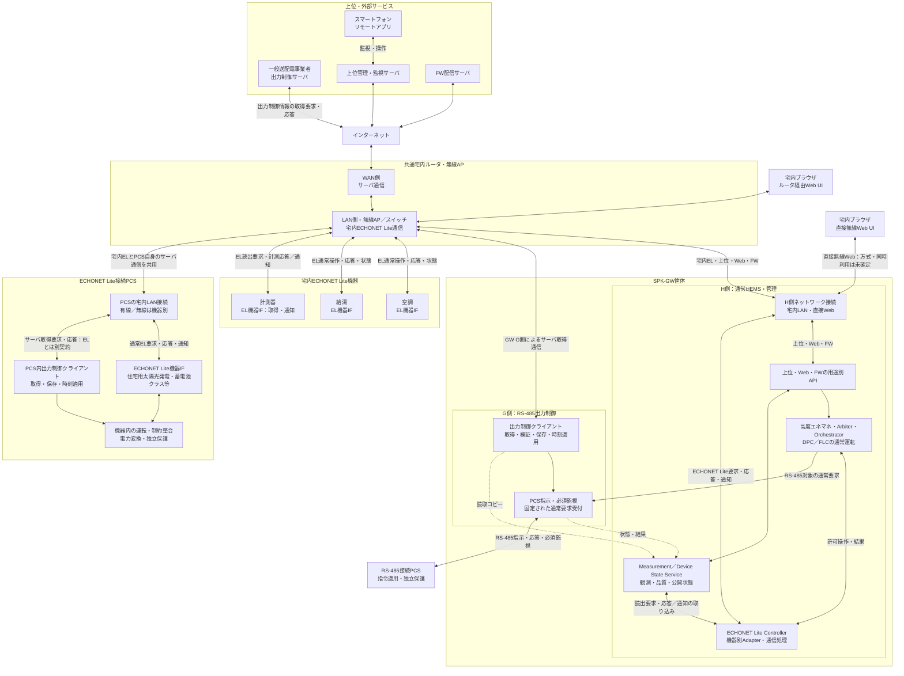
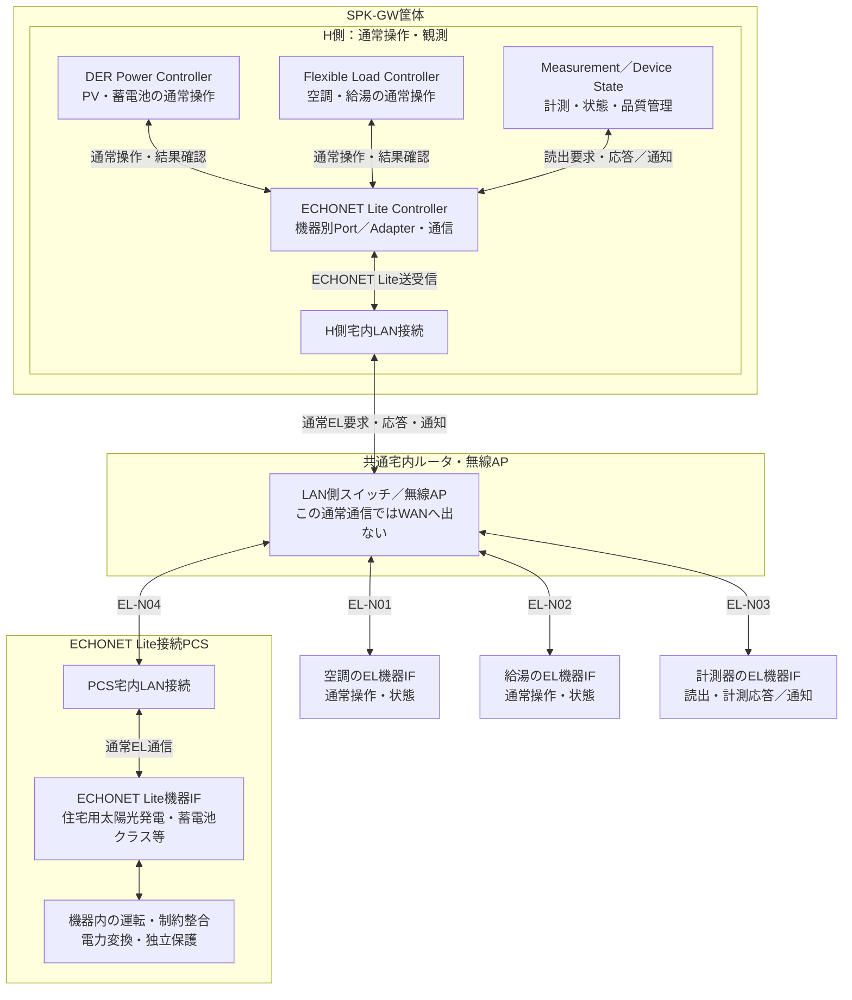
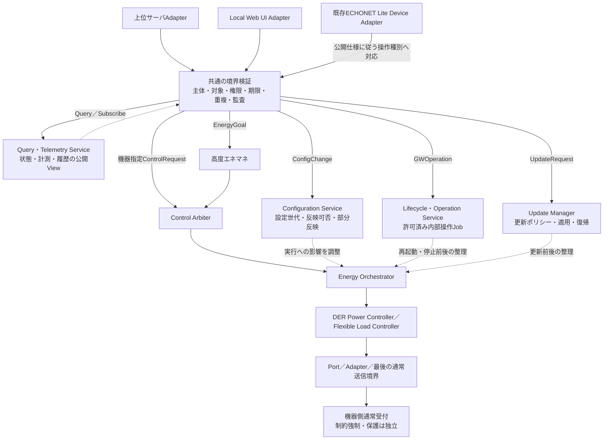

# 02. 外部サービス・宅内接続を含むシステム構成

根拠：[原典アーキテクチャ](../sources/architecture/01_Architecture.md)、[R2の外部サービス要求](../sources/USER_CONTEXT_R2.md)、[R3の二方式要求](../sources/USER_CONTEXT_R3.md)、[今回のルータ・対象限定CTX-R4](../sources/USER_CONTEXT_R4.md)。以下はR4の接続・取得主体を維持し、[CTX-R5](../sources/USER_CONTEXT_R5.md)に従って通常ECHONET Lite経路を明示したR5構成。R3のルータ省略図と通信種別によらない方式選択は引き続き不採用とする。物理サーバ数、通信詳細、CPU配置、型式適合は未確定である。

## 2.1 システムコンテキスト：共通宅内ルータを明示

**H側のECHONET Lite Controllerは、H側の宅内LAN接続 → 共通宅内ルータのLAN側・無線AP／スイッチ → 各機器のECHONET Lite機器IFという往復経路で、空調・給湯・計測器と、PV・蓄電池クラス等を公開するPCSに接続する。** PCS自身の出力制御スケジュール取得は、この通常EL通信とは別の契約・責任主体である。

R4の「EL Controllerと空調・給湯・計測器の間だけを直結表示する線」を廃止し、全体図と拡大図で同じ接続経路を示す。以下は共通宅内LANの代表構成を明示したものであり、既存のWi-SUN等のプロファイルを本図のルータLAN経由へ無条件に置換する改訂ではない。個別媒体・接続方式は既存の機器プロファイルで確認する。

### 2.1.1 全体構成

[拡大表示用SVG](../diagrams/02_01_System_Context.svg)／[PNG](../diagrams/02_01_System_Context.png)／[編集用Mermaid](../diagrams/02_01_System_Context.mmd)

図の双方向実線は通信又は要求・応答の往復、単方向実線は内部の処理・指令依存、破線は公開状態・読取コピーを表す。通常EL通信もPCS自身のサーバ通信も物理ネットワークを共有するが、通信の終端を同一視しない。

本図の宅内ルータは、**LAN側のスイッチ・無線APと、WAN側のインターネット接続を分けて表示**している。宅内EL通信はLAN側で各機器へ到達する経路であり、出力制御サーバや上位クラウドを経由しない。全ELフレームのIPルーティングを義務付ける図ではない。NIC数、無線／有線、物理ポート、共有スタック・OS配置は未確定である。

**出力制御サーバとPCS又はGWが、宅内ルータを飛び越えて接続する経路はない。** EL接続PCSの自律取得では、GWを取得代理にも必須IP転送器にも使わない。ルータは通信中継だけを担い、スケジュールの検証・保存・適用責任はPCS又はGW G側に残る。

端末–GWの直接無線Webは、通常EL機器接続とは別のローカル経路である。出力制御サーバのルータ非経由回線でも、全EL機器をGWの直接無線へ収容する構成でもない。SoftAP／Wi-Fi Direct、AP＋STA同時動作、Web資産の配置はSYS-TBD-014／015で確認する。

### 2.1.2 H側ECHONET Lite Controllerから各機器への接続拡大

[拡大表示用SVG](../diagrams/02_01_EL_Connections.svg)／[PNG](../diagrams/02_01_EL_Connections.png)／[編集用Mermaid](../diagrams/02_01_EL_Connections.mmd)

**図のDPC／FLC入力は、通常運転の受付・Arbiter・Orchestratorで許可された要求である。** ここでは上位の調停経路を省略し、機器への送受信経路に焦点を当てる。Measurement／Device State Serviceは計測取得・品質管理の担当であり、計測器をFLC配下の運転Actuatorとして扱わない。

「ECHONET Lite Controller」は通信上のController役割を示す。DPC・FLC・Measurementから利用される機器別Port／Adapterと通信処理の論理的なまとまりであり、単一プロセス・単一ソケット・専用NICへの集約を確定しない。Controller側の通信応答・通知は、要求の相関・対象機器を確認して、DPC／FLCの結果確認及びMeasurement／Device Stateの観測取り込みへ戻す。

この拡大図は宅内の通常EL通信だけを示す。PCS内出力制御クライアントとサーバへの別経路は図2.1.1及び経路表のGRID-EL-PCSを参照する。

PCSの箱は一つの物理構成の例である。「住宅用太陽光発電クラス」「蓄電池クラス」は公開され得る論理機器クラスであり、その数だけ独立PCSが存在する、全PCSが両クラスを公開する、全プロパティに対応するという意味ではない。物理機器・EOJ・resource・conversion_groupの対応は[第04章](04_Configurations_Profiles.md#ch-04)で管理する。

### 2.1.3 通信経路と担当責務の対応

下表のELはECHONET Liteを指す。応答は要求と逆方向、機器が対応する通知は機器から同じ宅内接続を通ってControllerへ届く。全機器に通知機能や書込み能力があるとは仮定しない。

| 経路ID | 対象・用途 | H側の意味的な担当 | 要求の往路 | 応答・通知と結果の戻り先 |
|---|---|---|---|---|
| EL-N01 | 空調の通常操作・状態確認 | FLC。観測品質はMeasurement／Device State | FLC → EL Controller → H側LAN接続 → 宅内ルータLAN／AP → 空調EL機器IF | 空調 → 同じ宅内経路を逆順 → EL Controller → FLCの結果確認／観測サービス |
| EL-N02 | 給湯の通常操作・状態確認 | FLC。観測品質はMeasurement／Device State | FLC → EL Controller → H側LAN接続 → 宅内ルータLAN／AP → 給湯EL機器IF | 給湯 → 同じ宅内経路を逆順 → EL Controller → FLCの結果確認／観測サービス |
| EL-N03 | 計測器の読出・計測通知 | Measurement／Device State | 観測サービス → EL Controller → H側LAN接続 → 宅内ルータLAN／AP → 計測器EL機器IF | 計測器 → 同じ宅内経路を逆順 → EL Controller → 観測サービス。DPC/FLCの運転命令とは分ける |
| EL-N04 | PV・蓄電池等のPCS通常操作・状態確認 | DPC。観測品質はMeasurement／Device State | DPC → EL Controller → H側LAN接続 → 宅内ルータLAN／AP → PCSのLAN接続 → PCSのEL機器IF | PCS EL機器IF → 同じ宅内経路を逆順 → EL Controller → DPCの結果確認／観測サービス |
| GRID-EL-PCS | EL接続PCSの出力制御情報取得 | PCS内出力制御クライアント。H側は取得主体でない | PCSクライアント → PCSのLAN接続 → 宅内ルータLAN側 → WAN側 → インターネット → 出力制御サーバ | サーバ → インターネット → ルータWAN側 → LAN側 → PCSのLAN接続 → PCSクライアント。GW非経由 |
| GRID-RS-GW | RS-485接続PCS用の出力制御情報取得 | GW G側 | GW G側 → 宅内ルータLAN側 → WAN側 → インターネット → 出力制御サーバ | サーバ → 同じネットワーク経路を逆順 → GW G側。適用指示・必須監視はRS-485でPCSへ |

**EL-N04とGRID-EL-PCSは、同じPCS・LAN接続・宅内ルータを使っていても別通信である。** EL ControllerはPCS内の出力制御クライアントへスケジュールを代理取得・転送しない。PCSの通常EL応答を受信できたことだけで、PCS自身のサーバ取得成功やスケジュール適用を判定しない。

この対応表を機械可読化したものは[通常EL経路台帳](../data/echonet_normal_routes.json)。既存の[出力制御経路台帳](../data/grid_network_routes.json)はR4から変更しない。公開プロパティ、通信頻度、媒体、宛先、認証・暗号化方式は既存プロファイル／TBDに従い、本改訂では新たに決定しない。

## 2.2 経路・役割・現在の対応範囲

| 接続用途 | 通信経路 | アプリケーション責任主体 |
|---|---|---|
| EL接続PCSの出力制御情報取得 | PCS → 宅内ルータ → インターネット → 出力制御サーバ。応答は逆順 | PCS内の出力制御機能。GWは非経由 |
| RS-485接続PCS用の情報取得 | GW G側 → 宅内ルータ → インターネット → 出力制御サーバ。応答は逆順 | GW G側 |
| RS-485接続PCSへの出力指示 | GW G側 → RS-485 → PCS。状態・応答は逆順 | G側の必須指令・監視とPCS機器制御 |
| 空調・給湯の通常操作・観測 | H側FLC ↔ EL Controller ↔ H側LAN接続 ↔ 宅内ルータLAN／AP ↔ 空調・給湯のEL機器IF | FLC・EL Adapter／Controller・機器側通常受付 |
| 計測器の読出・計測通知 | H側Measurement／Device State ↔ EL Controller ↔ H側LAN接続 ↔ 宅内ルータLAN／AP ↔ 計測器のEL機器IF | 観測サービス・EL Adapter／Controller・計測器 |
| EL接続PCSの通常操作・観測 | H側DPC ↔ EL Controller ↔ H側LAN接続 ↔ 宅内ルータLAN／AP ↔ PCSのLAN接続 ↔ PCSのEL機器IF | DPC・EL Adapter／Controller・機器側通常受付 |
| 上位監視・設定・内部機能操作 | GW H側 ↔ 宅内ルータ ↔ インターネット ↔ 上位サーバ | 用途別APIと各状態所有者 |
| FW配信 | GW更新機能 ↔ 宅内ルータ ↔ インターネット ↔ FWサーバ | 配布・検証・適用を別責務化 |
| 宅内Web | 端末 ↔ GW直接無線、又は端末 ↔ 宅内ルータ ↔ GW | Local Web／ローカル認可 |
| リモートアプリ | スマートフォン ↔ クラウド ↔ インターネット ↔ 宅内ルータ ↔ GW | クラウドとGW用途別API |

通常EL通信とPCSサーバ通信は、同じ物理NIC・ルータを使う場合でも別契約である。サーバ通信がECHONET Liteそのものであるとは規定しない。PCSネットワーク接続の存在、クラス検出、通常Setの成功だけで、独立したサーバ取得・保存・適用が確認できたとしない。

| 外部要素 | 追加・維持する責任境界 |
|---|---|
| 一般送配電事業者サーバ | 取得対象のスケジュール情報。H側通常APIの権限には統合しない |
| FW配信サーバ | 配布物とメタデータ。配信成功を適用許可としない |
| 上位管理・監視サーバ | 許可設定・内部操作・状態公開・アプリ仲介。任意shell／DB／保護設定を開放しない |
| 宅内Web UI／アプリ | 操作受付・達成・設定反映・不明を区別。同一LANだから管理者とはしない |
| 宅内ルータ／AP | 全出力制御取得経路の共通依存。停止・混雑・設定変更時の挙動を評価する |

メーカーの上位クラウドとFW配信サーバの物理共置を禁止しないが、役割・権限・配布承認・障害・更新の責任は区別する。ルータ障害対策として別回線、GW代理取得、テザリング、自動方式切替を暗黙に追加しない。

## 2.3 GW内の用途別経路

QueryはArbiterやDPCの運転権を取得する操作ではない。必要時の実機再取得は、取得能力・優先度・頻度を持つ観測契約で処理する。内部操作が機器を運転させる場合、その部分だけを通常運転のArbiter→Orchestrator経路へ委譲する。設定変更と更新は各所有者で認可・状態遷移を管理し、運転との資源競合を協調する。ここでも箱は論理責務であり、専用プロセスの追加を義務付けない。

## 2.4 独立する制御責務

| 経路 | 適用責務 | H側の役割 |
|---|---|---|
| 通常運転 | 受付 → 必要ならEMS → Arbiter → Orchestrator → DPC/FLC → Adapter／固定通常受付 | 制御要求・結果・観測 |
| EL接続PCSの出力制御 | PCS内の取得・時刻・保存・適用 → 機器制約 | 読取可能情報だけを参照。代理取得・適用しない |
| RS-485接続PCSの出力制御 | GW G側の取得・管理・適用 → RS-485 → PCS | 固定された通常要求・読取コピーだけ |
| 系統連系保護 | 必要な独立計測 → 機器側保護・解列・規定復帰 | 保護の承認を行わない |

## 2.5 RS-485経路の確定点と残る設計

今回、RS-485接続PCSの出力制御はGW管理方式へ配賦する。必須指示・必要監視を含むため、全経路をNORMAL_OPERATION_ONLYとすることはできない。通常通信との共用方法、送信所有者、電文、CPU／OS／driver、再初期化・更新範囲は未確定である。既存実装がG側非干渉要件を満たすという実績ではない。

GWがRS-485 PCSを仮想ELオブジェクトとして外部公開しても、実PCSの通信経路・取得主体を変更しない。両IFを備える物理PCSは接続プロファイルで選択済み経路と取得主体を確認する。検出順序で自動分類しない。

## 2.6 IF・識別子・互換性

IF-GRID-01に宅内ルータ必須と機器接続別の取得主体を明示する。IF-GRID-02は本構成のGW G側–RS-485 PCSの必須指令・監視契約。IF-EL-01は通常の機器操作・観測であり、サーバ取得とは分離する。R3のPCS_DIRECT識別子は保持するが、表示名は「PCS自律取得方式（宅内ルータ経由・GW非経由）」とする。

[外部IF台帳](../appendices/External_Interface_Register.md)、[第21章](21_Grid_Connection_Selection.md#ch-21)、[R4経路データ](../data/grid_network_routes.json)を同時に適用する。新しいプロトコル、ポート、TLS設定等はこの変更から推定しない。

## 2.7 ルータ共有の障害範囲

GW非経由とはGW障害からの責務・経路分離であり、ルータやWANまで別系統という意味ではない。WAN断ではLANが残る場合と、ルータ全停止でLAN/APも失う場合を分ける。RS-485はルータを介さない機器間リンクだが、GW・PCS電源と実装が健全な条件でのみ継続できる。保持済みスケジュール、有効期限、時刻、必須通信異常の動作は[第13章](13_Fault_Recovery_OTA.md#ch-13)と第21章で定義する。

<!-- R6:COMPLETION_ITEMS -->

> **R6の補完範囲：** 以下はレビューA1から追加した章節項の記入枠であり、数値・機種・機能採否・個別規格適用を推定した確定仕様ではない。各項末のリンクから、本章末尾の具体的な質問・必要資料・確定時点を確認できる。

**記入先・関連する規範候補別冊：** [外部・内部IF契約の具体化項目](../appendices/Interface_Contract_Detail.md) ／ [機器プロファイル拡張テンプレート](../appendices/Device_Profile_Extended.md)

## 2.8 設置コンテキストの適用条件

### 2.8.1 実ネットワークと接続先の実体

**補完項目ID：** `SLOT-R6-02-01`。**対応観点：** C04, C12（[レビューA1](../sources/review/R5_Coverage_Review_A1.md)）。

全出力制御サーバ通信は宅内ルータ経由。EL接続PCSは自律取得、RS-485接続PCSはGW G側管理というR5条件を維持する。

**本項に記載する仕様項目：**

- 宅内ルータLAN/WANとGW H/G・PCSの接続。
- 有線/無線・同一LAN・発見条件。
- 上位とFW配信の事業主体・停止範囲。

**本項の完成判定：** 設置配線・ネットワークプロファイルとサービス責任表を確定し、R5の図の各端点を実接続先に対応付ける。

**具体的な不足：** [OQ-R6-02-01](#oq-r6-02-01)。採用値・参照版・対象外理由は回答後に本項又は版指定の規範別冊へ反映する。

### 2.8.2 宅内直接Webとルータ接続の成立条件

**補完項目ID：** `SLOT-R6-02-02`。**対応観点：** C02, C12, C24（[レビューA1](../sources/review/R5_Coverage_Review_A1.md)）。

R5の既存原則は保持するが、この項の全対象・具体条件・規範参照は未確定。

**本項に記載する仕様項目：**

- 直接無線方式・AP/STA能力。
- Web資産の配置・名前解決。
- 同時稼働・WAN断・LAN断の利用可能範囲。

**本項の完成判定：** 直接接続/宅内ルータ/リモートの構成別機能表と到達・再接続の確認方法を定義する。

**具体的な不足：** [OQ-R6-02-02](#oq-r6-02-02)。採用値・参照版・対象外理由は回答後に本項又は版指定の規範別冊へ反映する。

<!-- R6:OPEN_QUESTIONS -->

## Open Questions — 本ノートを完成させるための未決事項

以下は本章の具体的な未決事項。**担当者・回答期限の日付・採用値・承認結果は未確定**である。担当ロールと確定ゲートは提案。回答を得ただけでは閉じず、根拠確認・決定・本文と関連台帳への反映を行う。
全体索引：[Open Question横断台帳](../appendices/Open_Question_Register.md)。各質問の編集正本は[data/completion_items.json](../data/completion_items.json)。

### OQ-R6-02-01 — 実ネットワークと接続先の実体

**対象項：** [2.8.1 実ネットワークと接続先の実体](#slot-r6-02-01)

**質問：** 対象住宅のGW H/G、EL接続PCS、通常EL機器はどのLAN・AP・有線ポートへ接続するか。ルータの必要条件と外部サービスの運用責任は何か。

**必要資料・完了条件：** 設置配線・ネットワークプロファイルとサービス責任表を確定し、R5の図の各端点を実接続先に対応付ける。

**決定担当：** 未割当（候補：ネットワーク・製品運用・施工設計）。承認者：未定。

**確定時点：** G1＝該当するアーキテクチャ・HW・安全境界の設計固定前（提案）。回答期限の日付：未定。

**未解決時の制約：** 「実ネットワークと接続先の実体」を対象構成の確定保証・実装受入根拠として使用しない。

**既存ID：** SYS-TBD-012, SYS-TBD-031, PAR-GNET-01。

**状態：** OPEN。**回答：** 未記入。**決定記録：** 未記入。

### OQ-R6-02-02 — 宅内直接Webとルータ接続の成立条件

**対象項：** [2.8.2 宅内直接Webとルータ接続の成立条件](#slot-r6-02-02)

**質問：** 直接無線Webはどの無線方式を使うか。ルータ接続と同時利用できるか。クラウド断でも利用できる画面と認証条件は何か。

**必要資料・完了条件：** 直接接続/宅内ルータ/リモートの構成別機能表と到達・再接続の確認方法を定義する。

**決定担当：** 未割当（候補：無線・Web・セキュリティ設計）。承認者：未定。

**確定時点：** G1＝該当するアーキテクチャ・HW・安全境界の設計固定前（提案）。回答期限の日付：未定。

**未解決時の制約：** 「宅内直接Webとルータ接続の成立条件」を対象構成の確定保証・実装受入根拠として使用しない。

**既存ID：** SYS-TBD-014, SYS-TBD-015, PAR-UP-08。

**状態：** OPEN。**回答：** 未記入。**決定記録：** 未記入。
