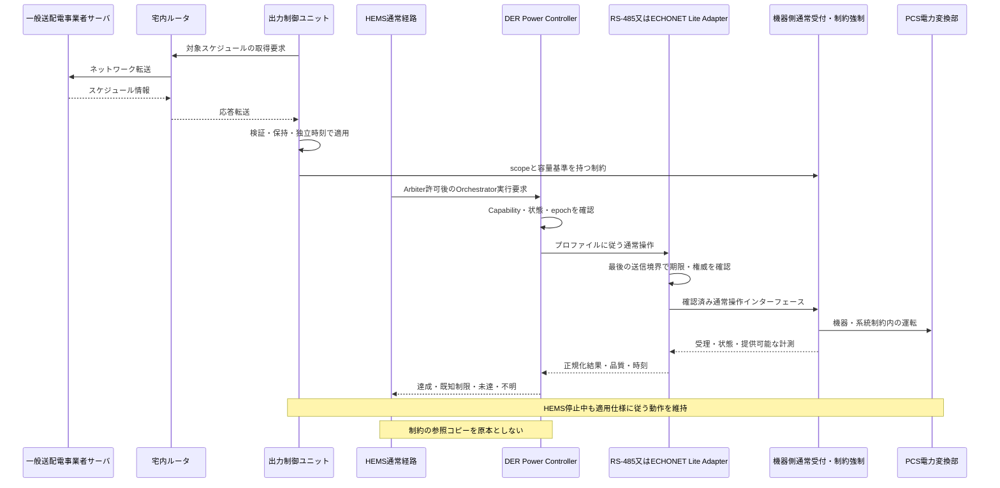

# 06. システムユースケース・横断振る舞い

根拠：[03_Command_Flows.md](../sources/architecture/03_Command_Flows.md) ／ [06_Contracts.md](../sources/architecture/06_Contracts.md) ／ [10_Requirements_Tests.md](../sources/architecture/10_Requirements_Tests.md)。ユーザー明示事項・本書の具体化案は本文で区別する。

## 6.1 原典UCの継承

UC-01〜07の目的・責務・経路を維持する。以下はシステム仕様形式への展開であり、特定実機で成立済みという記録ではない。機器設定順序、完了閾値、許容時間はプロファイルを参照する。

| ID | 起点・前提 | 正常な振る舞い | 代替・異常・終了条件 |
|---|---|---|---|
| UC-01 | クラウドから家庭全体のEnergyGoal。対象時間・権限・Capabilityが有効 | 受付→EMS計画案→Arbiter資源権威→Orchestrator→DPC/FLC→各実機。観測から計画評価し結果を通知 | 全体／部分不許可は再計画。操作は物理的に原子的でない。部分達成と残差を報告 |
| UC-02 | 特定DERへの直接的な通常要求 | 受付→Arbiter→Orchestrator→DPC→Adapter→通常受付。DPCが状態・実測を照合 | 最適化を省略しても調停は省略しない。受理と達成を分離。Unsupported／Unknownを明示 |
| UC-03 | 時刻・計測・予測更新による自律HEMS | EMSが目標・計画案を作りUC-01と同じ通常権威経路で実行 | 内部トリガーを無条件の最高優先にしない。観測欠損時は適用戦略を縮退 |
| UC-04 | 電力会社のスケジュール制約と通常要求が共存 | OCUが独立して取得・保存・適用。機器側が通常要求と制約を整合し運転 | HEMSの許可・応答を待たない。制限理由が取得できないときは推測しない |
| UC-05 | 機器制限・故障・本体操作で計画から逸脱 | Adapter観測→DPCの不一致評価→Orchestratorの部分状態→EMS再計画→Arbiter再認可 | 過去値への無条件復帰・無限設定綱引きをしない。理由不明はUNKNOWN |
| UC-06 | HEMSのOTA・再起動 | 可能な範囲で通常実行を整理し更新。G側は独立動作。復帰後状態照合し再調停 | 正常終了前処理なしのクラッシュも評価。旧ログをコマンド列として再生しない |
| UC-07 | 電気的異常による保護 | 独立計測→機器側保護→停止／必要な解列。公開状態をHEMSへ | HEMSの権威・承認を待たない。復帰条件を通常APIで解除しない |

## 6.2 UC-04：通常操作と出力制御の同時実行

図のSはEL接続PCS内の取得機能又はRS-485用GW G側に対応する。詳細な物理・ネットワーク経路は第21章の二つの図を適用する。RS-485とECHONET Liteの双方について、通常操作の共通意味論を検証する。ただし操作能力・待ち時間・機器内の確認方法まで同一とはしない。制御対象が別々の装置に分散する場合は各対応構成へ展開する。

## 6.3 本書で追加したUC：USER_CONTEXT_DERIVED／SYSTEM_SPEC_PROPOSAL

| ID | 追加するシナリオ | 主要な要求 | 検証 |
|---|---|---|---|
| SYS-UC-08 | 既存RS-485 PCSへの通常要求・観測 | 既存プロトコルの意味を保ち、共通ControlRequest／結果へ対応付ける。生電文迂回を禁止 | SYS-T01、SYS-T02 |
| SYS-UC-09 | 同一意味の要求を他社ECHONET Lite機器へ実行 | 実装能力・許可間隔に基づき変換。電力目標と電力上限を取り違えない | SYS-T02、T10〜T12 |
| SYS-UC-10 | 外部HEMSがGWのDevice側公開を操作 | 公開対象と実資源を対応付け、通常受付・調停を通す。標準プロトコル上の応答と非同期結果を区別 | SYS-T03 |
| SYS-UC-11 | RS-485と他社機器の混在計画 | 機器ごとの時間・能力差と部分実行を管理。同じ物理量を二重計上しない | SYS-T04、T09、T13 |
| SYS-UC-12 | 制御中の通常設定変更と障害復旧変更 | 通常変更は可否・保留・反映時点を判断。復旧変更は独立Usecaseとして認可 | SYS-T06 |
| SYS-UC-13 | 同一資源の通信経路切替／装置交換 | 自動切替は必須機能にしない。採用時は旧経路の権威と残留要求を照合してから新経路へ | SYS-T07、T07、T17 |
| SYS-UC-14 | 計測保存・抽出の欠測／容量異常 | 欠測をゼロ化せず、短期制御と長期履歴の対象を区別。保存異常で系統制御を止めない | SYS-T08、T15 |
| SYS-UC-15 | HEMS機能を無効化して既存運転を継続 | 自律EMS停止とGW全停止を分け、既存通常制御と観測の適用範囲を確認 | SYS-T01 |

## 6.4 部分失敗と補償

複数機器に対する一つの計画は、要求がまとめて許可されても実機操作まで同時に成功するとは限らない。許可単位・実行順序・並行度を定義し、成功したステップ、受理のみ、結果不明、未送信をOrchestratorが管理する。

補償は、現在の権威・制約・機器状態で許される新しい操作として発行する。実行不明の操作を未実行と仮定して他機器へ二重に配分しない。再計画の責任はEMS、進行・補償管理はOrchestrator、機器単位の状態照合はDPCに置く。

## 6.5 ユースケース記述の完成条件

トリガー、対象構成、前提、受付条件、権威、順序、出力・状態、異常分岐、タイミング参照、ログ、検証IDを持つ。未確定の待ち時間等はPAR-*へリンクする。UC説明の例示値を合否閾値へ流用しない。

## 6.6 R2追加：上位サービス・UIのユースケース

既存UCのIDと責務を維持し、新規SYS-UC-16〜SYS-UC-22を[第20章](20_Northbound_Monitoring_FW.md#ch-20)に記載する。宅内Web監視、アプリ遠隔操作、同時設定変更、GW内部操作、FW取得・適用、上位不通・復旧、ネットワーク設定変更を対象とする。GW自身の操作とPCSの運転要求を区別する。

同じ意味の通常運転要求はWeb／アプリ／上位サービスの入口で形式変換されても本章の調停・実行を通る。ローカル端末というだけで常に最優先とはしない。認可された利用者と機能・設備scopeからポリシーを決める。

## 6.9 R3追加ユースケースの所在

[第21章](21_Grid_Connection_Selection.md#ch-21)にEL接続PCS自律取得（SYS-UC-23）、GW取得・管理・PCS指示（SYS-UC-24）、施工・保守での方式選択／変更（SYS-UC-25）を追加する。既存UCの通常運転経路は維持する。UC-04等の出力制御ユニットは選択プロファイルの所有者へ配賦し、H側への依存は追加しない。

## 6.10 R4：ルータを含む取得の往復

SYS-UC-23はEL接続PCS→宅内ルータ→サーバと逆向き応答、SYS-UC-24はGW G側→宅内ルータ→サーバと逆向き応答→RS-485指示である。第21章にルータを含む両シーケンスを掲載する。サーバからの情報方向をサーバ起点push接続と混同しない。

<!-- R6:COMPLETION_ITEMS -->

> **R6の補完範囲：** 以下はレビューA1から追加した章節項の記入枠であり、数値・機種・機能採否・個別規格適用を推定した確定仕様ではない。各項末のリンクから、本章末尾の具体的な質問・必要資料・確定時点を確認できる。

**記入先・関連する規範候補別冊：** [製品全機能・構成マトリクス](../appendices/Product_Function_Matrix.md) ／ [品質・利用目的・ライフサイクル受入の具体化項目](../appendices/Quality_Acceptance_Profiles.md)

## 6.11 全機能の正常・代替・異常シナリオ

### 6.11.1 機能とUCの双方向対応

**補完項目ID：** `SLOT-R6-06-01`。**対応観点：** C05, C08, C32（[レビューA1](../sources/review/R5_Coverage_Review_A1.md)）。

R5の既存原則は保持するが、この項の全対象・具体条件・規範参照は未確定。

**本項に記載する仕様項目：**

- 機能IDとUC ID。
- 入力・トリガー・開始/終了・前後状態。
- 正常/代替/異常/取消しと結果通知。

**本項の完成判定：** 機能→UC→SYS→確認方法の双方向表を完成し、各UCに前提・結果・例外を記載する。

**具体的な不足：** [OQ-R6-06-01](#oq-r6-06-01)。採用値・参照版・対象外理由は回答後に本項又は版指定の規範別冊へ反映する。

### 6.11.2 横断条件・同時事象・利用場面

**補完項目ID：** `SLOT-R6-06-02`。**対応観点：** C02, C08, C09（[レビューA1](../sources/review/R5_Coverage_Review_A1.md)）。

R5の既存原則は保持するが、この項の全対象・具体条件・規範参照は未確定。

**本項に記載する仕様項目：**

- 更新中の出力制御と設定変更。
- 初回起動・施工と監視。
- 通信断・権威交代・再接続の順序。

**本項の完成判定：** 横断シナリオ表を作成し、担当・順序・観測・タイムアウト・失敗後状態を指定する。

**具体的な不足：** [OQ-R6-06-02](#oq-r6-06-02)。採用値・参照版・対象外理由は回答後に本項又は版指定の規範別冊へ反映する。

<!-- R6:OPEN_QUESTIONS -->

## Open Questions — 本ノートを完成させるための未決事項

以下は本章の具体的な未決事項。**担当者・回答期限の日付・採用値・承認結果は未確定**である。担当ロールと確定ゲートは提案。回答を得ただけでは閉じず、根拠確認・決定・本文と関連台帳への反映を行う。
全体索引：[Open Question横断台帳](../appendices/Open_Question_Register.md)。各質問の編集正本は[data/completion_items.json](../data/completion_items.json)。

### OQ-R6-06-01 — 機能とUCの双方向対応

**対象項：** [6.11.1 機能とUCの双方向対応](#slot-r6-06-01)

**質問：** 採用した全機能に代表UCがあるか。既存RS-485監視、内部操作、設定、FW、各EMS戦略に未記載の正常・異常系列はないか。

**必要資料・完了条件：** 機能→UC→SYS→確認方法の双方向表を完成し、各UCに前提・結果・例外を記載する。

**決定担当：** 未割当（候補：要求・システム設計・テスト設計）。承認者：未定。

**確定時点：** G2＝該当するIF・データ・操作等の詳細契約確定前（提案）。回答期限の日付：未定。

**未解決時の制約：** 「機能とUCの双方向対応」を対象構成の確定保証・実装受入根拠として使用しない。

**既存ID：** SYS-TBD-011。

**状態：** OPEN。**回答：** 未記入。**決定記録：** 未記入。

### OQ-R6-06-02 — 横断条件・同時事象・利用場面

**対象項：** [6.11.2 横断条件・同時事象・利用場面](#slot-r6-06-02)

**質問：** クラウド設定と宅内操作、FW更新と系統スケジュール切替、機器離脱と再計画が同時に発生したとき、どの系列を受入対象にするか。

**必要資料・完了条件：** 横断シナリオ表を作成し、担当・順序・観測・タイムアウト・失敗後状態を指定する。

**決定担当：** 未割当（候補：システム・結合テスト設計）。承認者：未定。

**確定時点：** G3＝該当する検証仕様・受入プロファイルの確定前（提案）。回答期限の日付：未定。

**未解決時の制約：** 「横断条件・同時事象・利用場面」を対象構成の確定保証・実装受入根拠として使用しない。

**既存ID：** SYS-TBD-009, SYS-TBD-018, SYS-TBD-032。

**状態：** OPEN。**回答：** 未記入。**決定記録：** 未記入。
