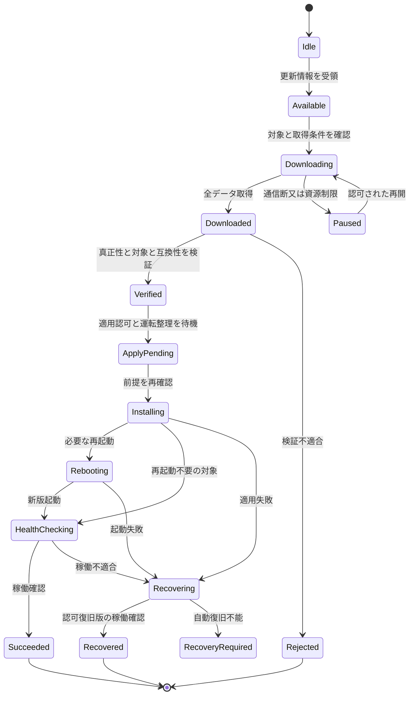
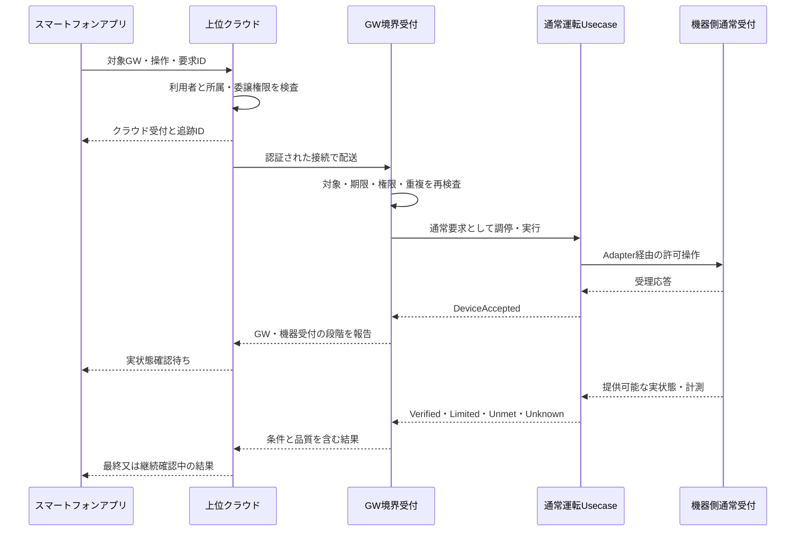
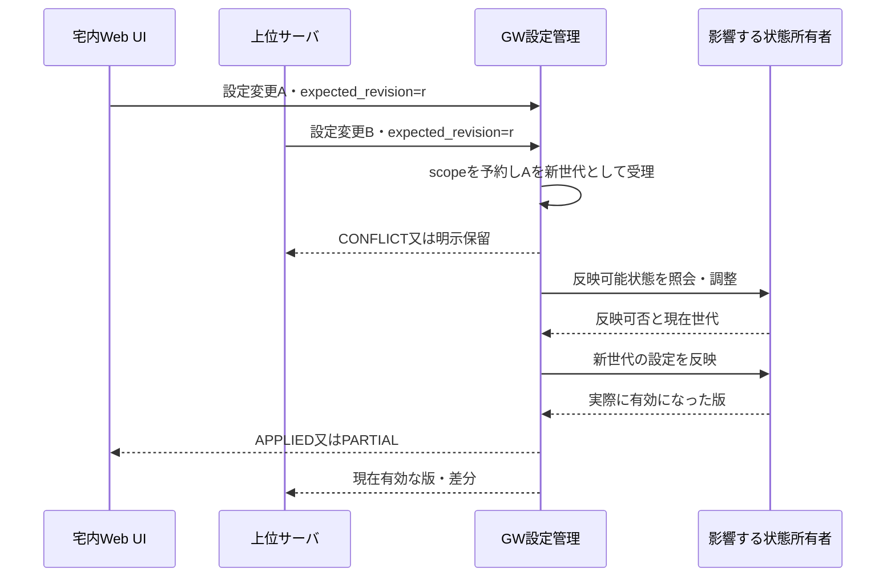
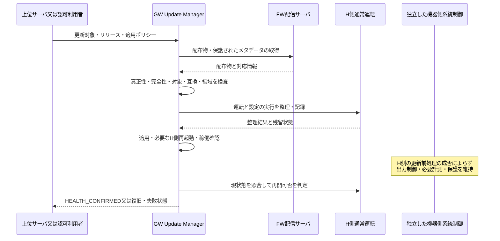

# 20. 上位管理・宅内Web UI・リモートアプリ・FW配信

本章は[R2追加要求](../sources/USER_CONTEXT_R2.md)を具体化した設計案。原典アーキテクチャに存在したCloud／UI／OTAを拡張するが、個別のクラウド・プロトコル・AP方式・FW方式を実装事実として補わない。R1第01〜19章のIDを維持するため、機能横断の北向き契約を第20章に追加した。

## 20.1 上位サービスの責務と操作種別

上位サーバの役割はPCSへ指令を中継することに限らない。GWの設定、GW自身の機能・サービスのライフサイクル、GW内部情報、機器状態、実績、FW更新ジョブを区別して扱う。

| 操作種別案 | 主な対象 | GW内の所有者 | 上位へ返す結果 |
|---|---|---|---|
| Query／Subscribe | 設定参照、稼働状態、計測、履歴、許可診断情報 | Query・Telemetry Serviceと各状態所有者 | データ・観測時刻・品質・版・欠測 |
| EnergyGoal／ControlRequest | 家庭目標、DER・負荷の通常運転 | EMS／Arbiter／Orchestrator／DPC・FLC | GW受付、許可、送信、受理、達成・制限・未達・不明 |
| ConfigChange | 運転方針、GW通常設定、対応機器設定、許可ネットワーク設定 | Configuration Serviceと変更調停 | 受付、保留、保存、反映中、反映済み、競合、部分失敗 |
| GWOperation | HEMS機能開始停止、探索、許可診断、H側サービス再起動等 | Lifecycle・Operation Service | Job受付、待機、実行、完了・失敗・結果不明 |
| UpdateRequest | 更新確認・取得・適用要求・状態取得 | Update Manager | 発見、取得、検証、待機、適用、再起動、稼働確認、復旧 |

内部操作例は採用候補であり、製品がすべてを公開する保証ではない。運転に作用する内部操作は、機器操作部分に通常運転契約を適用する。再起動／設定反映／FW適用が同じ資源へ同時に作用する場合は、変更・保守の実行枠を一意に取得して直列化又は定義済みの中断を行う。読出しも資源負荷を持つが、通常運転権限の一律取得は要求しない。

## 20.2 上位サーバとの境界契約

上位サーバは利用者・運用者の認証、住宅／GW所属、アプリとの公開契約、GW向け配送、受領データの履歴・公開Viewを担当する。GW側はサーバの接続主体を認証し、委譲された操作者、対象、機能範囲、期限、所有者／所属世代、操作ポリシーを検査する。

`actor_id`を任意の文字列として受け取っただけで認証済みとしない。委譲の検証方法、ローカル保有の権限と照合する方法、失効を伝達できない期間の許可条件はSYS-TBD-016で決める。GWがユーザーのクラウドパスワードを保持する仕様にはしない。

クラウドサービスの認証成功は、当該利用者がどの住宅のどの機器・設定・内部機能を操作できるかの認可成功とは別である。操作者由来情報と、配送した上位サービスの識別を監査で分離する。

接続はGW起点の認証されたセッションを推奨する。上位からの要求を既存セッション／ポーリング応答で受け取る案を許容するが、具体方式は未決である。ルータのポート転送やUPnPによる外部公開をリモート監視の前提にしない。認可サーバの証明書検証失敗時に平文・未認証へ自動的に格下げしない。

## 20.3 宅内Web UI：直接接続とルータ経由

| 接続プロファイル案 | 経路 | クラウドの要否 | 確定が必要な事項 |
|---|---|---|---|
| LOCAL_DIRECT | ブラウザ端末↔GWの直接無線↔GW Web/API | 基本監視・許可されたローカル操作は不要とする案 | SoftAP等の具体方式、開始条件、資格情報、IP・名前解決、終了条件 |
| LOCAL_ROUTER | ブラウザ端末↔宅内ルータ/AP↔GW Web/API | 同上 | GWのSTA等の接続、端末隔離・別セグメント、到達先発見、対応帯域 |
| REMOTE_CLOUD | スマートフォンアプリ↔クラウド↔GW | 必要 | アプリ認証、GW所属、上位プロトコル、通信不成立時表示 |

**直接無線接続は、GWがルータ・インターネット共有機能を提供することを意味しない。** SoftAPとSTAの同時動作も必須とはしない。直接接続への切替でWANが切れる機種では、リモート監視・FW取得の中断とローカル機能の継続を明示する。

宅内Web UIはブラウザ上で実行され、基本画面資産とローカルAPIはGW内から提供する案とする。外部CDN・クラウドログイン・外部DNSが不通でも、事前に確立したローカル認証と到達手段で基本監視を利用できる条件を定義する。初回ペアリング／所有者登録と登録済み端末の日常操作は別フローにする。

「クラウド不要」は認証不要の意味ではない。端末に設定された無線接続資格と、Webアプリの利用者・操作権限を区別する。ローカル保守・復旧入口も有効期間・物理的操作又は同等の認可・監査を定め、恒常的な無認証入口にしない。

TLSと証明書の信頼確立、名前解決、端末ごとの到達方法は未選定である。検証警告の無視を通常運用にせず、暗号化・接続先識別・セッション保護が成立する製品プロファイルを決定する。Cookie等を使う場合のCSRF対策、Origin／Hostの検証、認可されないクロスオリジン読出し、DNS rebinding、XSS、セッション失効を設計・試験項目にする。具体実装方式は本書で固定しない。

## 20.4 リモート監視・操作アプリ

スマートフォンはクラウドへ接続し、クラウドが対象GWとの情報・要求を仲介する。スマートフォンをFW配信や電力会社スケジュールの必須中継器にしない。アプリが宅内に存在しても、明示的な対応仕様なしに直接操作へ自動切替しない。

アプリは「クラウド接続可」「GWとクラウドの同期状態」「GWと実機の接続状態」「表示データの品質」を別々に表示可能とする。クラウドに値が残っているだけで『現在値・オンライン・運転達成』と表示しない。

アプリに持たせる主な契約は、所属住宅／GWの選択、許可操作の提示、操作の影響と確認、受付と結果の表示、古い情報の識別、ログアウト／所有者変更／紛失端末の失効である。プッシュ通知を採用する場合も通知の到達を操作成功の根拠にしない。アプリのオフライン閲覧・通知方式・ローカル切替は未確定事項に残す。

## 20.5 クラウド・GW・実機の結果を分ける

| 対象 | 例示する結果 | 読み替えてはいけないこと |
|---|---|---|
| 配送 | CLOUD_ACCEPTED、QUEUED、DELIVERED_TO_GW | 実機が動作した |
| GW受付 | RECEIVED、AUTHORIZED、REJECTED、EXPIRED | 配信元の計画どおりに達成した |
| 通常運転 | SENT、DEVICE_ACCEPTED、VERIFIED、LIMITED、UNMET、UNKNOWN | 受理応答だけでVERIFIED |
| 設定 | PERSISTED、APPLY_PENDING、APPLIED、PARTIAL、CONFLICT | 保存済みだから全担当機能へ反映済み |
| 内部操作 | JOB_ACCEPTED、RUNNING、SUCCEEDED、FAILED、UNKNOWN | 再起動要求への応答だけで復帰成功 |
| 更新 | DOWNLOADED、VERIFIED、INSTALLING、REBOOTING、HEALTH_CONFIRMED、RECOVERED | ダウンロード完了だけで更新完了 |

名称はR2の内部契約案であり、R1の機器制御結果モデルを置き換えない。操作種類ごとにその状態モデルへ対応させる。CloudとGWで別IDを使うなら対応を保存し、アプリに同一操作として追跡可能な公開IDを返す。公開状態が不明な場合はタイムアウトと失敗を混同せず、状態照会で後から照合できるようにする。

## 20.6 設定変更：クラウドとローカルの同時操作

クラウドの希望値とGWの現在有効値を別に管理する。推奨するConfigChangeは、対象キー集合、期待する基準世代、希望値、反映条件、失効期限、要求ID、操作主体を持つ。

同じ設定scopeを基準世代rで変更する要求が競合した場合、設定所有者が検査と予約／commitを直列化し、先に確定した変更により後続が古くなればCONFLICT又は明示的な再調整へ送る。部分キー変更・複数scopeの統合規則を別に決め、単純な最後書込み勝ちでローカル変更を消さない。

GW側には受理した設定版・保存版・有効版を区別し、各反映先の有効世代を持たせる。全必要反映先の確認が揃う前にAPPLIEDとしない。設定値を保持していても効果が停止・無効になっている場合、その状態も公開する。

クラウドに保存された希望設定を再接続時に無条件で復元しない。所有者変更・ソフト版・設定schema・実機構成・現在世代を照合する。変更の履歴と現在有効な値を正規の経路で同期する。

## 20.7 ネットワーク設定変更と到達性

SSID、鍵、IP、ルート、DNS、上位接続先の変更では応答経路自身が切れる。通常の設定成功応答だけで完了にしない。提案フローは「事前検証→復旧情報の保存→段階反映→新経路で確認→確定又は認可された旧状態への復旧」である。

旧状態への復旧はG側設定の巻戻しを含めない。共有NIC／ルータ／G側通信への影響がある設定は、独立性・変更管理を事前評価して許可を決める。端末のブラウザが到達できた確認と、GWが上位へ接続できた確認は別であり、何をもってcommitするかを設定プロファイルへ明記する。

直接接続、物理操作、期限付き保守入口等による復旧案を比較し、確認猶予や旧経路保持をSYS-TBD-021で確定する。ネットワーク変更でcloud操作が不明になっても無条件再送して再び経路を変更しない。

## 20.8 GW内部機能への操作

公開可能な操作の候補は、HEMS開始／停止、機器再探索、許可されたH側サービス再起動、ログ取得ジョブ、診断レベル変更、H側再起動、通常設定の復元等である。**候補の列挙は全操作の製品対応宣言ではない。**

操作台帳に対象、許可ロール、パラメータ、前提状態、競合scope、最大実行時間、取消し可否、再実行安全性、影響範囲、完了確認、失敗時動作を持つ。高影響操作は追加確認又は専用運用権限を要求する。

『内部機能への操作』を任意RPCメソッド、任意shell、無制限ファイルアクセス、メモリ／Blackboard書換え、任意PCS電文送信へ一般化しない。対象リセットがH側限定か装置全体かは配線・実装で確認し、G側までリセットする操作を名称だけでH側操作扱いしない。保護設定・スケジュール原本・G側時刻・FWへの保守は別の認可・変更経路へ分ける。

## 20.9 内部情報・状態の公開View

GW設定の有効版、機能有効／停止／縮退、サービスの健全性、接続状態、通信エラー、機器情報、実行中ジョブ、FW・schema版、CPU／メモリ／保存使用量等を公開候補として分類する。診断アクセスで秘密鍵、トークン、パスワード、他住宅の個人データを返さない。

実機→GW観測→クラウド保管→アプリ表示を段階として扱い、少なくとも情報源、観測又は取得時刻、GW受信時刻、クラウド受信時刻、時計品質、データ品質、必要な版を保持する。観測時刻不明を受信時刻で偽装しない。

監視は共有された状態Viewから応答し、ブラウザのタブ数／スマートフォン数だけPCSポーリング頻度が増える構成を避ける。明示的なFresh Readが必要なら有限な再取得ジョブにし、操作周期とG側通信を圧迫させない。履歴抽出・診断ファイル取得はページング、容量、同時ジョブ、キャンセル条件を持つ。

イベントはstream識別、GW起動世代、連番等で重複・順序逆転・再起動を区別する案とする。有限バッファのあふれではdrop／gapを示してスナップショット再同期へ移行し、欠測を隠さない。計測サンプルと操作結果・設定監査は別の保持優先度を持つ。

## 20.10 オフライン・再送・所有者変更

その場の通常運転操作は、対象GWがオフラインのときに長期間無制限に保留しない案を既定とする。拒否、又は明示された短い期限付き保留のいずれかを操作ごとに確定する。将来の予約運転は別のスケジュール契約で扱う。

同一要求の再送には同じidempotency_keyを使い、同じキーで内容が違う場合は拒否する。重複排除は主体・住宅／GW・所属世代・操作種別をscopeに持ち、保持期間を定義する。保証期間外は結果不明・要再照合として扱い、実機までの完全なexactly-onceを主張しない。

配送時と実行時に期限・権限・設定世代等を検査する。再ログイン・再接続を理由に古い操作を復活させない。所有者変更／GW再登録では所属世代を更新し、旧所有者のセッション・待機要求・クラウド関連付け・ローカル資格を規定の手順で失効させる。オフラインで失効通知を受けられない期間は、認可情報の寿命と操作制限を明示し、即時失効を無条件に保証しない。

## 20.11 FW配信・更新の責任を分ける

| 責務 | 担当案 | 注意 |
|---|---|---|
| 配布物の作成・承認／署名 | リリース権限を持つ主体 | 配信サーバの接続資格と同一の信頼でよいとはしない |
| FW画像・メタデータ配送 | FW配信サーバ | 同一クラウド基盤も可。配送成功は適用成功ではない |
| 更新対象・適用時期の運用要求 | 上位サーバ又は認可ローカル操作 | 自動更新、確認要求、保守時間は製品方針で確定 |
| 配布物検証・最終適用可否 | GW Update Manager | 外部からの『強制』だけで検証や領域境界を解除しない |
| 適用・起動・稼働確認・復旧 | GW更新機構及び必要な起動機構 | A/B等の具体方式は未確定。成功・復旧・復旧不能を区別 |

上記の分担はRFC 9019／9124を補助参考とした設計案。[外部参考](../sources/R2_External_References.md)。SUIT等の完全実装を要求するものではない。

最低限の検証対象は、配布物・メタデータの真正性と完全性、対応機種・HW・現在FW／依存版、対象コンポーネントと更新領域、許可された更新系列、サイズ、保存容量、適用前条件とする。配信URLや『最新版』という名称を認可の根拠にしない。通信路の認証と配布物の認証を分け、信頼できるメタデータと画像を対応付ける。

通常H側の更新権限でG側FW・保護設定へ書けないことを維持する。FW配信サーバがG側用配布物も保有する場合でも、H側キーや経路では適用できない。接続PCS／G側のFW更新はユーザーから対象と明示されていないため、通常GW更新への自動包含はしない。対象範囲はSYS-TBD-018で確定する。

復旧用の旧版も無条件に許すのではなく、信頼された承認・安全な更新系列・設定schema互換の範囲で認可する。耐ロールバックを無視した任意ダウングレードと、事前に定義した復旧の両方を『ロールバック』だけで曖昧にしない。実現する機構はHW条件を踏まえて決める。

## 20.12 FW更新の状態と障害

例示状態機械であり、既存更新実装を確認したものではない。各遷移の永続化・再開可否・取消し可能点・上位通知を確定する。取得だけの障害で稼働中の通常運転を停止させない。適用開始後の中断を取得中断と同じ扱いにしない。ダウンロード済み配布物がある場合の上位断中の適用許可は、事前運用ポリシーと現在認可の有効性に従い判断する。

容量・CPU・帯域の予算を通常通信と分け、取得集中によるG側通信への干渉を評価する。Web資産、API、設定schema、更新機構の互換性をリリース契約に含める。アプリ又はWebの旧版で未知の操作を送らず、非互換時は更新要求・限定表示・読取専用等の規定処置とする。

## 20.13 代表ユースケース

### SYS-UC-16：宅内Web UIで監視する

ブラウザが直接又はルータ経由でGWへ接続し、ローカル認証後に権限内の状態Viewを取得する。クラウド不通でも、当該ローカルネットワークとGWが稼働する範囲で基本監視を行う。状態不明・古いデータ・接続不能を区別し、過剰な実機読出しを発生させない。

### SYS-UC-17：アプリからリモート操作する

通常運転UsecaseはArbiter→Orchestrator→DPC/FLCをまとめた表記である。上位サーバが停止しても機器側保護は継続し、完了結果の配送不能と機器操作未実行を混同しない。

### SYS-UC-18：クラウドとWeb UIの設定変更が競合する

本図ではAが先に確定する例だが、ローカルが常に優先する規則ではない。決めるのは操作者の権限、競合scope、反映条件及び運用ポリシーであり、到着経路だけで優先度を付与しない。

### SYS-UC-19：GW内部機能を操作する

上位サーバから再探索等の操作を受け、許可リスト・状態・競合を確認してJobを発行する。GW応答喪失時はJob IDで復帰後に照会し、同じ再起動を無条件に繰り返さない。機器運転が必要な部分は通常制御へ委譲し、診断経路から生電文を注入しない。

### SYS-UC-20：FW配信サーバから取得・適用する

配信サーバは画像を送るだけで直接適用しない。署名・対象領域の検査に失敗した画像は、管理者操作でも通常経路から適用できない。

### SYS-UC-21：上位不通・再接続

ローカル監視と利用可能な自律制御を継続し、リモート画面にはオフラインと最終観測を表示する。結果・イベントの保持には上限を設ける。再接続時は世代と現在状態を同期し、期限切れ・旧所有者・競合した設定を破棄又は再承認へ送る。

### SYS-UC-22：通信設定変更後に応答経路を失う

適用前に変更Jobを記録し、確認チャネルと復旧方針を決める。新経路確認が得られない場合は、当該設定で許された復旧手順へ移行する。G側への影響が判明した共有資源の変更を、ローカル画面の便利機能として無条件実行しない。

## 20.14 障害・利用可能性マトリクス

| 条件 | 宅内Web UI | リモートアプリ | FW | 通常運転・系統制御 |
|---|---|---|---|---|
| 上位管理サービス停止 | GWと宅内経路が生存すれば利用可 | 未同期・操作不可を表示 | 独立FW経路と事前ポリシー次第 | 自律HEMSの成立条件で継続、G側は独立 |
| FW配信サービス停止 | 通常継続 | 通常監視・許可操作は継続 | 取得保留・再試行制限 | 稼働中FWを維持、G側は独立 |
| WAN断 | 宅内LAN又は直接接続は利用可 | 最終受信値とオフライン | 取得中断 | 外部入力依存の計画を縮退、OCUは適用仕様 |
| 宅内ルータ停止 | ルータ経由不可、直接は対応HW・機能次第 | GWオフライン | 通常のWAN取得不可 | G側の外部通信断を独立に処理 |
| 直接接続でSTA停止 | 直接画面は利用可 | GWオフラインになり得る | 保留 | G側へ影響しない前提を評価 |
| Webサービスのみ停止 | 画面不可 | 上位接続が独立なら利用可能な範囲を定義 | 実行中更新との関係を確認 | 表示障害と制御障害を分ける |
| H側FW適用・再起動 | 一時中断 | 適用中又は情報不明を表示 | 永続Jobから復旧 | 通常要求残留を別管理、G側は独立 |
| 機器通信断 | GWは見えるが機器状態不明 | 同じ状態を表示 | GW FWの状態とは別 | 物理結果不明・機器別縮退 |
| 共通電源・熱・NIC障害 | 影響範囲次第 | 影響範囲次第 | 影響範囲次第 | H限定故障と分けて評価 |

『利用可』にはローカル認可情報の有効性、端末到達性、GWの稼働が必要である。期限切れ資格を無制限に許すという意味ではない。

## 20.15 仕様を確定させる入口

最初に上位操作・公開データ・FW更新対象を台帳へ列挙し、許可scope、状態所有者、通信条件、影響するG側共通資源を対応付ける。続いて直接接続方式、ローカル認証、GW起点のクラウド接続、上位保留ポリシーを確定する。詳細は[Open Issues](../appendices/Open_Issues.md)、[IF台帳](../appendices/External_Interface_Register.md)、[Operation Catalog](../appendices/Northbound_Operation_Catalog.md)を参照。

## 20.19 R3導入・R4適用：方式選択状態の監視と保守境界

両方式でも本章のFW配信・上位管理・宅内Web UI・リモートアプリを維持する。監視Viewに設定方式と実際の有効方式、対象scope、スケジュール所有者、通信健全性、適用状態、切替進行、品質を追加する。PCS_DIRECTで非公開の情報はNOT_EXPOSED、取得不明はUNKNOWNとして表示し、無制限・未制御と断定しない。

通常ユーザーには読取と既存の許可操作を提供する。方式変更の入力欄を設ける場合も、施工・保守権限、対象機器の対応、G側の独立認可、現設定世代、実機確認、必要手続きを満たす専用Jobとする。クラウド受付・設定保存を切替完了として表示しない。実装する保守チャネルは未確定。

## 20.20 R3導入・R4適用：更新・復元・無線変更と方式

H側FW配信では方式binding、G側スケジュール原本・時刻・資格情報・FWを変更しない。GW_MANAGED用のG側更新が必要なら別の対象・承認・適用条件・復旧契約として管理し、本章の通常H側更新へ同梱しない。サーバ筐体は共用可能でも論理権限を分ける。

AP／STA切替・ネットワーク設定・GW再起動がG側サーバ通信又はPCS必須通信を止めるなら、通常Web接続変更として無条件許可しない。PCS_DIRECTでもPCSが使う共有ルータ等の影響は別評価する。監視経路の障害を理由に出力制御の方式を自動変更しない。

## 20.21 R4：全取得通信のルータ経由化と画面表示

宅内Web直接接続、ルータ経由Web、クラウド経由アプリ、FW配信と上位管理は維持する。PCS_DIRECTは「PCS自律取得方式（宅内ルータ経由・GW非経由）」と表示する。GW上位接続／PCS通常EL応答／PCSサーバ取得・適用を別の観測状態にする。FW転送・ネットワーク設定・AP/STA切替が共有ルータ経路を阻害する条件を評価し、画面の通信断から方式を自動変更しない。

<!-- R6:COMPLETION_ITEMS -->

> **R6の補完範囲：** 以下はレビューA1から追加した章節項の記入枠であり、数値・機種・機能採否・個別規格適用を推定した確定仕様ではない。各項末のリンクから、本章末尾の具体的な質問・必要資料・確定時点を確認できる。

**記入先・関連する規範候補別冊：** [外部・内部IF契約の具体化項目](../appendices/Interface_Contract_Detail.md) ／ [UI・警報・通知の規範候補台帳](../appendices/UI_Alarm_Register.md)

## 20.22 公開IFの操作別確定

### 20.22.1 上位プロトコルとGW内部機能の公開一覧

**補完項目ID：** `SLOT-R6-20-01`。**対応観点：** C12, C13, C16（[レビューA1](../sources/review/R5_Coverage_Review_A1.md)）。

R5の既存原則は保持するが、この項の全対象・具体条件・規範参照は未確定。

**本項に記載する仕様項目：**

- 接続開始側・ネットワーク・schema。
- 読取/設定/内部操作/制御/更新の実操作。
- 認可・結果・並行・エラー・期限。

**本項の完成判定：** 16件の論理IFを実契約へ展開し、公開操作台帳を実項目・権限・状態・結果へ対応付ける。

**具体的な不足：** [OQ-R6-20-01](#oq-r6-20-01)。採用値・参照版・対象外理由は回答後に本項又は版指定の規範別冊へ反映する。

### 20.22.2 FW対象・配信・適用・互換・復旧

**補完項目ID：** `SLOT-R6-20-04`。**対応観点：** C20, C34（[レビューA1](../sources/review/R5_Coverage_Review_A1.md)）。

R5の既存原則は保持するが、この項の全対象・具体条件・規範参照は未確定。

**本項に記載する仕様項目：**

- 画像種別・HW/FW対象・H/G範囲。
- 署名/承認・互換・容量・適用条件。
- 中断・起動確認・復旧・通知。

**本項の完成判定：** 更新プロファイルを画像/対象/版/認可/段階/復旧条件で確定し、一般H更新からG変更を除外する。

**具体的な不足：** [OQ-R6-20-04](#oq-r6-20-04)。採用値・参照版・対象外理由は回答後に本項又は版指定の規範別冊へ反映する。

### 20.22.3 オフライン・通知・認可失効の契約

**補完項目ID：** `SLOT-R6-20-05`。**対応観点：** C15, C21, C24（[レビューA1](../sources/review/R5_Coverage_Review_A1.md)）。

R5の既存原則は保持するが、この項の全対象・具体条件・規範参照は未確定。

**本項に記載する仕様項目：**

- 要求TTL/重複/結果照会。
- オフライン画面とキャッシュ。
- 所属・失効・端末紛失・再接続。

**本項の完成判定：** 操作別キュー/TTL/冪等保持、再同期、端末・所有者変更時の失効と表示規則を確定する。

**具体的な不足：** [OQ-R6-20-05](#oq-r6-20-05)。採用値・参照版・対象外理由は回答後に本項又は版指定の規範別冊へ反映する。

## 20.23 UI・警報・操作性の製品契約

### 20.23.1 画面・表示項目・対応端末・操作確認

**補完項目ID：** `SLOT-R6-20-02`。**対応観点：** C02, C24（[レビューA1](../sources/review/R5_Coverage_Review_A1.md)）。

R5の既存原則は保持するが、この項の全対象・具体条件・規範参照は未確定。

**本項に記載する仕様項目：**

- 画面ID・ロール・対象状態。
- 表示項目/単位/丸め/鮮度/欠測。
- 確認/取消し/結果不明・ブラウザ/OS。

**本項の完成判定：** 画面×項目×操作×ロール表と対応端末表、利用者タスクの受入条件を確定する。ピクセル設計はUI詳細へ配賦する。

**具体的な不足：** [OQ-R6-20-02](#oq-r6-20-02)。採用値・参照版・対象外理由は回答後に本項又は版指定の規範別冊へ反映する。

### 20.23.2 警報・通知・確認・抑止・解除

**補完項目ID：** `SLOT-R6-20-03`。**対応観点：** C19, C24（[レビューA1](../sources/review/R5_Coverage_Review_A1.md)）。

R5の既存原則は保持するが、この項の全対象・具体条件・規範参照は未確定。

**本項に記載する仕様項目：**

- 警報ID・重大度・発生/解除条件。
- 通知先・再通知・時刻・鮮度。
- 確認済み/原因解消・抑止権限。

**本項の完成判定：** 警報台帳を故障ID・UI・上位イベントへ対応付け、確認済みが制約解除を意味しない条件を明記する。

**具体的な不足：** [OQ-R6-20-03](#oq-r6-20-03)。採用値・参照版・対象外理由は回答後に本項又は版指定の規範別冊へ反映する。

<!-- R6:OPEN_QUESTIONS -->

## Open Questions — 本ノートを完成させるための未決事項

以下は本章の具体的な未決事項。**担当者・回答期限の日付・採用値・承認結果は未確定**である。担当ロールと確定ゲートは提案。回答を得ただけでは閉じず、根拠確認・決定・本文と関連台帳への反映を行う。
全体索引：[Open Question横断台帳](../appendices/Open_Question_Register.md)。各質問の編集正本は[data/completion_items.json](../data/completion_items.json)。

### OQ-R6-20-01 — 上位プロトコルとGW内部機能の公開一覧

**対象項：** [20.22.1 上位プロトコルとGW内部機能の公開一覧](#slot-r6-20-01)

**質問：** 上位管理が読み書きする実項目と内部操作はどれか。プロトコル、公開schema、役割権限、完了通知・エラーをどう固定するか。

**必要資料・完了条件：** 16件の論理IFを実契約へ展開し、公開操作台帳を実項目・権限・状態・結果へ対応付ける。

**決定担当：** 未割当（候補：クラウド/GW IF・セキュリティ設計）。承認者：未定。

**確定時点：** G2＝該当するIF・データ・操作等の詳細契約確定前（提案）。回答期限の日付：未定。

**未解決時の制約：** 「上位プロトコルとGW内部機能の公開一覧」を対象構成の確定保証・実装受入根拠として使用しない。

**既存ID：** SYS-TBD-013, SYS-TBD-017, PAR-UP-01, PAR-UP-02, PAR-UP-03, PAR-UP-13。

**状態：** OPEN。**回答：** 未記入。**決定記録：** 未記入。

### OQ-R6-20-02 — 画面・表示項目・対応端末・操作確認

**対象項：** [20.23.1 画面・表示項目・対応端末・操作確認](#slot-r6-20-02)

**質問：** 宅内Web・スマートフォン・本体表示で提供する画面と項目は何か。対応端末、更新周期、色以外の区別、重要操作確認、多言語等の適用をどう決めるか。

**必要資料・完了条件：** 画面×項目×操作×ロール表と対応端末表、利用者タスクの受入条件を確定する。ピクセル設計はUI詳細へ配賦する。

**決定担当：** 未割当（候補：UI/UX・製品企画・QA）。承認者：未定。

**確定時点：** G2＝該当するIF・データ・操作等の詳細契約確定前（提案）。回答期限の日付：未定。

**未解決時の制約：** 「画面・表示項目・対応端末・操作確認」を対象構成の確定保証・実装受入根拠として使用しない。

**既存ID：** SYS-TBD-015, SYS-TBD-022, PAR-UP-04, PAR-UP-05。

**状態：** OPEN。**回答：** 未記入。**決定記録：** 未記入。

### OQ-R6-20-03 — 警報・通知・確認・抑止・解除

**対象項：** [20.23.2 警報・通知・確認・抑止・解除](#slot-r6-20-03)

**質問：** 通信断、出力制限、Unknown、更新失敗、保存異常等をどの警報として誰へ通知するか。確認・抑止・再通知・解除の条件と優先順位は何か。

**必要資料・完了条件：** 警報台帳を故障ID・UI・上位イベントへ対応付け、確認済みが制約解除を意味しない条件を明記する。

**決定担当：** 未割当（候補：運用・UI・故障設計）。承認者：未定。

**確定時点：** G2＝該当するIF・データ・操作等の詳細契約確定前（提案）。回答期限の日付：未定。

**未解決時の制約：** 「警報・通知・確認・抑止・解除」を対象構成の確定保証・実装受入根拠として使用しない。

**既存ID：** SYS-TBD-008, SYS-TBD-022, SYS-TBD-029。

**状態：** OPEN。**回答：** 未記入。**決定記録：** 未記入。

### OQ-R6-20-04 — FW対象・配信・適用・互換・復旧

**対象項：** [20.22.2 FW対象・配信・適用・互換・復旧](#slot-r6-20-04)

**質問：** FW配信が扱う対象はH側のみか、独立G保守を含む別配布か。画像形式・検証・適用条件・旧版復帰と各画面の成功判定をどう定めるか。

**必要資料・完了条件：** 更新プロファイルを画像/対象/版/認可/段階/復旧条件で確定し、一般H更新からG変更を除外する。

**決定担当：** 未割当（候補：FW更新・セキュリティ・運用設計）。承認者：未定。

**確定時点：** G2＝該当するIF・データ・操作等の詳細契約確定前（提案）。回答期限の日付：未定。

**未解決時の制約：** 「FW対象・配信・適用・互換・復旧」を対象構成の確定保証・実装受入根拠として使用しない。

**既存ID：** SYS-TBD-018, SYS-TBD-023, PAR-UP-10, PAR-UP-12。

**状態：** OPEN。**回答：** 未記入。**決定記録：** 未記入。

### OQ-R6-20-05 — オフライン・通知・認可失効の契約

**対象項：** [20.22.3 オフライン・通知・認可失効の契約](#slot-r6-20-05)

**質問：** 上位断中にどの要求を保留し、何時まで同一要求と判断するか。オフライン認可の寿命と、アプリが表示できる過去状態の条件は何か。

**必要資料・完了条件：** 操作別キュー/TTL/冪等保持、再同期、端末・所有者変更時の失効と表示規則を確定する。

**決定担当：** 未割当（候補：クラウド・アプリ・セキュリティ）。承認者：未定。

**確定時点：** G2＝該当するIF・データ・操作等の詳細契約確定前（提案）。回答期限の日付：未定。

**未解決時の制約：** 「オフライン・通知・認可失効の契約」を対象構成の確定保証・実装受入根拠として使用しない。

**既存ID：** SYS-TBD-016, SYS-TBD-019, SYS-TBD-022, PAR-UP-14。

**状態：** OPEN。**回答：** 未記入。**決定記録：** 未記入。
