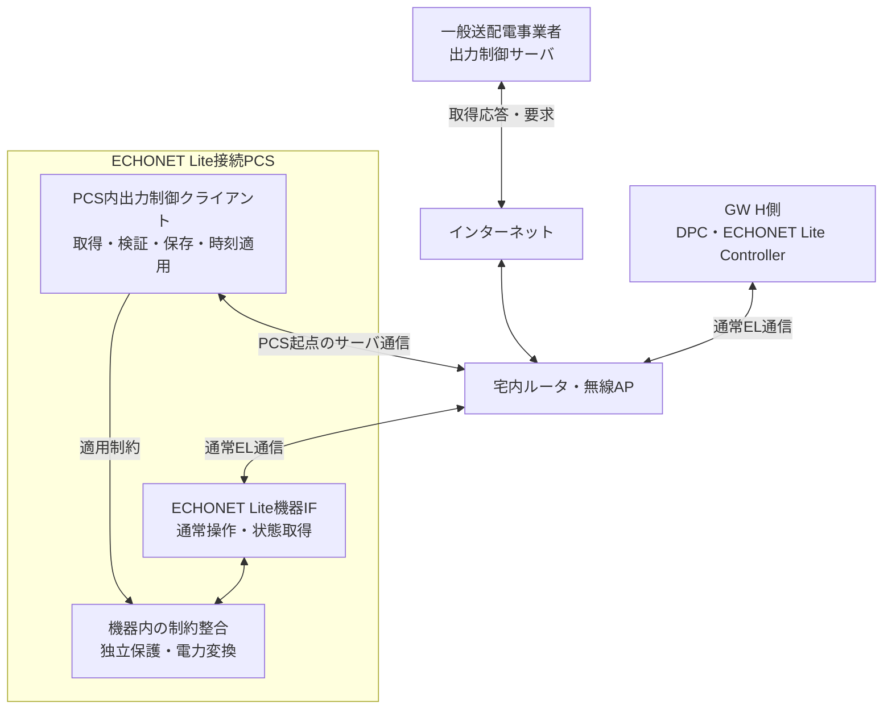
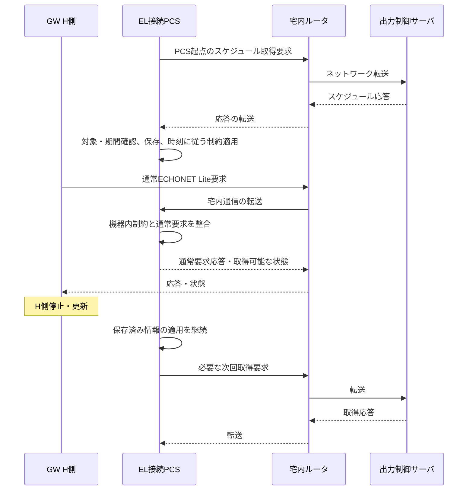
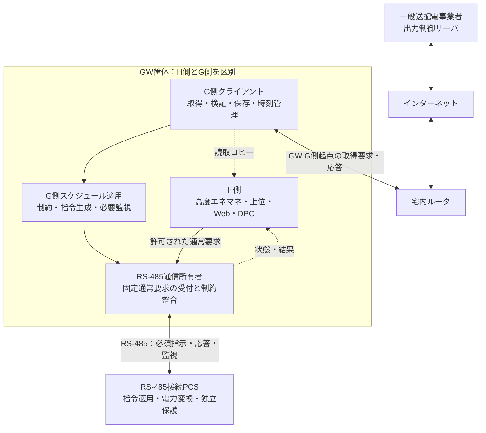
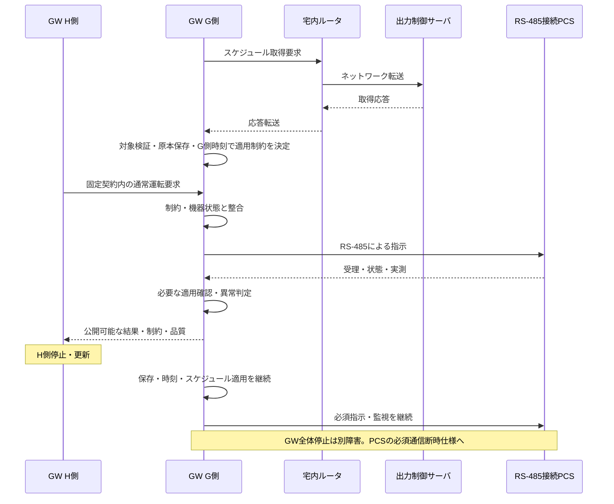
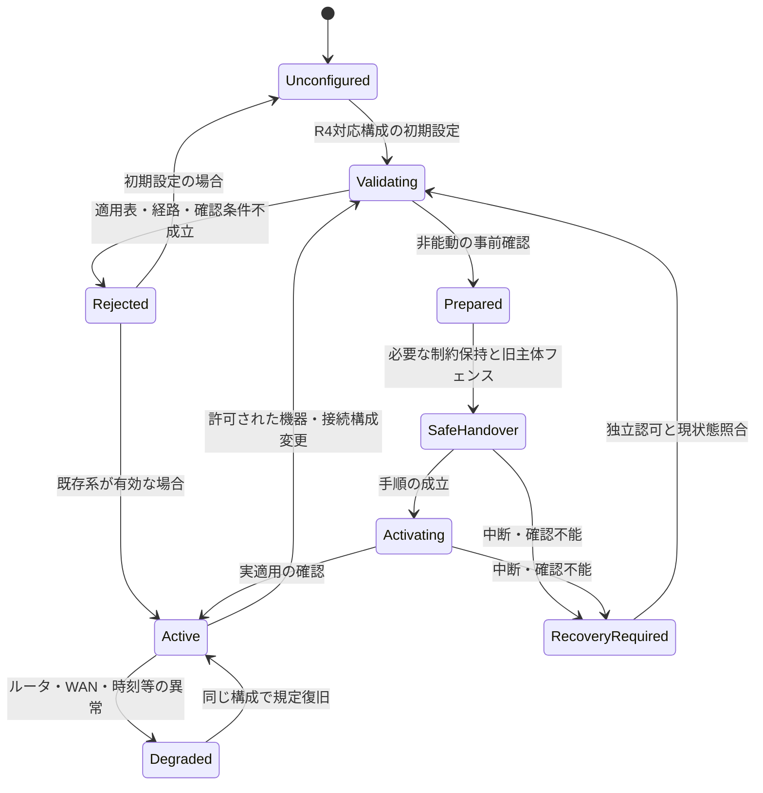

# 21. 出力制御接続方式の選択・責務・切替

根拠：[CTX-R4](../sources/USER_CONTEXT_R4.md)を最優先とし、[CTX-R3](../sources/USER_CONTEXT_R3.md)の二方式要求を今回の機器・接続条件で限定する。R3原本と判断履歴は[sources/baseline/R3.zip](../sources/baseline/R3.zip)に保持する。R4の経路・対応表は製品仕様案であり、特定機器の実装確認・JET判断を表さない。

## 21.1 変更後の適用表

**すべての出力制御サーバ通信は宅内ルータ経由。GWを介さない取得要求・応答はECHONET Lite接続PCSだけとする。**

| 本製品で使用する機器・接続構成 | 方式識別子 | 表示名 | スケジュール取得・保存・時刻適用の主体 | サーバ取得経路 |
|---|---|---|---|---|
| ECHONET Lite接続PCS | PCS_DIRECT | PCS自律取得方式（宅内ルータ経由・GW非経由） | PCS内の出力制御機能 | PCS ↔ 宅内ルータ ↔ インターネット ↔ 出力制御サーバ |
| RS-485接続PCS | GW_MANAGED | GW管理方式（宅内ルータ経由・RS-485指示） | GWのG側 | GW G側 ↔ 宅内ルータ ↔ インターネット ↔ 出力制御サーバ |
| その他のEL機器／計測器／仮想オブジェクト | この表からは割当てない | 対象外又は別途評価 | 推測しない | 自律取得を一般化しない |

機器種別・制約責務・通信方式は概念上異なる属性だが、**R4の対応する組合せはこの表で制限する。** RS-485 PCSのPCS_DIRECT、EL接続PCSのGW_MANAGED、ルータを通らない取得を現在の選択肢へ含めない。これはRS-485又はECHONET Lite規格自体の一般的な能力制約を主張するものではない。

R3のPCS_DIRECT識別子は参照互換のため保持する。「直接」は表示から外し、物理的直結の意味を持たせない。識別子保持は無条件の旧設定再利用ではなく、型式・実接続・取得主体をR4の表で再検証する。

同じPCSが複数IFを持つ場合、実際に採用する接続プロファイルで分類する。GWがRS-485 PCSをELオブジェクトとして公開しても、物理PCSをEL自律取得とみなさない。未登録・未確認の機器へ自動的にmodeを割り当てない。

## 21.2 EL接続PCSの自律取得と通常EL通信

同じルータを通る二つの通信を区別する。

| 通信 | 始点・終点 | 意味 |
|---|---|---|
| 出力制御情報取得 | PCS内クライアント ↔ 出力制御サーバ | PCS自身が開始する取得要求と応答。サーバ通信仕様はTBD |
| 通常EL操作・観測 | GWのController ↔ PCSのEL機器IF | 許可された通常操作と公開状態。スケジュール原本変更ではない |

GWはPCSの取得要求の代理作成、サーバ応答の必須転送、PCS用スケジュール原本の管理をしない。PCSからサーバへの経路に、GWのNAT・ブリッジ・HTTPプロキシ等を必須にしない。宅内ルータが転送することと、GWがアプリケーション処理を代行することを混同しない。

### SYS-UC-23：ルータ経由のPCS取得と通常要求の共存

ルータはアプリケーションのスケジュール承認者ではない。図中の転送はネットワーク経路の説明であり、ルータがELやスケジュールをアプリケーション終端する実装要求ではない。共有ルータ・PCS電源等が健全な条件でGW非依存を検証する。取得版・適用状態がPCSから非公開なら、GWはNOT_EXPOSED／UNKNOWNと報告する。

## 21.3 RS-485接続PCSのGW管理

GW G側が取得・管理主体であり、単なるファイル転送機能ではない。PCSからサーバへの独自取得経路は本構成にない。RS-485上の具体電文、応答意味、設定順序、周期は未確定であり、Modbus等を仮定しない。

### SYS-UC-24：GW取得・管理からRS-485指示まで

H側が通常PCS書込みを後から上書きして制約を解除できない所有構造にする。G側のネットワーク・RS-485通信をH側プロセスに依存させない。別CPUか同一CPUかは未確定であり、共通OS・NIC・reset・電源・driverの影響を評価する。

## 21.4 選択単位・混在・一意性

選択単位は`grid_control_scope_id`で表す設備／変換グループ／連系点等の範囲と、物理PCS・確認済み接続プロファイルのbindingである。R3と異なり、構成確認後も自由な二者択一ではなく21.1の適用表に制約される。

同じ宅内ルータ配下にEL自律取得PCSとRS-485のGW管理PCSが併存することは構成候補として扱える。ただし同一scopeの能動スケジュール適用主体は一つとする。保護機能、機器内の独立制限はこの排他で停止させない。

共通連系点の合算制約を複数PCSで成立させる場合、独立した計測・制約配分・適用所有者が必要かをプロファイルで確認する。ルータが同じことやGWが合計値を監視できることを、全体制約の保証にしない。別scopeへの同じID・容量の重複割当てを防ぐ。

## 21.5 設定・経路・状態のモデル

| 項目 | R4の扱い |
|---|---|
| normal_connection_class | ECHONET_LITE_PCS／RS485_PCS。物理PCSの採用接続で決定 |
| device_kind／physical_device_id | PCS自身か、非PCS／GW仮想公開かを区別 |
| supported_modes | R4適用表と機器・構成確認で得た許可集合。通常は対応する一方式 |
| desired／configured／active mode | 希望・承認保存・現実の適用を区別。未設定を補完しない |
| display_name | PCS_DIRECTはPCS自律取得方式（宅内ルータ経由・GW非経由） |
| router_profile_id／request_path／response_path | 宅内ルータを含む往復経路。PCS_DIRECTにはGW転送点を含めない |
| server_protocol_profile_id | サーバ通信契約。EL通信プロファイルとは別 |
| schedule_owner／constraint_owner／grid_control_scope_id | 原本・適用責任と最終強制の対応 |
| grid_control_epoch／configuration_revision | 系統構成世代。Arbiter epochとは別 |
| PCS取得能力の確認記録 | 型式・FW・メーカー根拠。ELクラス存在だけでは不可 |
| Job・取得・保持・適用・観測時刻・品質 | 受付／保存／実適用、不明・非公開を区別 |

[二方式テンプレート](../data/grid_connection_profiles.json)はv2へ改版し、機器接続種別・ルータ必須・往復経路を追加した。両テンプレートはTEMPLATE_NOT_DEPLOYABLE、active_mode=null、確認記録は空欄である。[経路データ](../data/grid_network_routes.json)も設計モデルであって実測データではない。

## 21.6 SYS-UC-25：施工・保守での対応構成の選択・変更

R4では、同一PCSの任意なPCS_DIRECT↔GW_MANAGED切替を製品要件としない。R3の管理切替手順は、**変更前後とも適用表に一致する機器交換・接続構成変更**をメーカー／保守手順が許す場合の条件付き契約として維持する。初期施工のみの対応でも、対応機種・製品要件で判断する。

| 段階 | 主な処理 | 不成立時 |
|---|---|---|
| 申請 | 実機ID、旧新接続種別・mode・scope、期待世代、認可主体・理由を登録 | 不明・一般権限・旧世代を拒否 |
| 事前検証 | R4適用表、ルータ経路、PCS取得能力又はGW必須指示、必要手続きを確認 | 適用外を保守権限で特例許可しない |
| 非能動準備 | 許可された機器手順で時刻・保存・接続・原本を確認 | 旧系の規定動作を維持 |
| 引継ぎ | 保持制約又は必要停止を成立させ旧主体を停止・フェンス | 新主体を無条件に有効化しない |
| 適用確認 | 構成世代を更新し、新しい対象機器・経路の適用を確認 | 不明・要復旧として記録 |
| 確定 | active状態を更新。H側は現状態で通常要求を再調停 | 古いログ・設定を盲目的再生しない |

サーバ・PCSの登録変更、旧取得の停止、新主体の確認手段は未確定。機器が切替をサポートしない場合はオンライン変更を提供しない。通信を跨ぐ切替が単一DB transactionで原子的に完了するとはしない。

## 21.7 構成の有効化・復旧状態

Modeの異なる自動遷移は存在しない。modeは21.1の構成表で決まる属性であり、この状態機械の状態遷移だけで別方式へ変わらない。未設定・結果不明から無制限運転を許さず、機器別の安全・保護契約を適用する。

## 21.8 障害マトリクス：ルータとGWを分ける

| 障害・条件 | EL接続PCS自律取得 | RS-485接続PCSのGW管理 |
|---|---|---|
| H側停止・更新 | PCS自身の取得・保存・適用を独立維持。通常EL制御／表示は停止し得る | G側の取得・保存・時刻・RS-485指示・必須監視を維持する設計要求 |
| GW全体電源断 | PCS・ルータ・必要電源が健全なら取得・適用にGWを要さない | G側は停止。PCSの必須通信喪失時の規定動作を確認 |
| WANのみ断・宅内LAN健全 | 新規取得不可。保持済み情報を規定に従い適用。通常EL通信は到達条件内で継続可能 | 新規取得不可。G側の保持済み適用とRS-485制御を規定に従い継続 |
| 宅内ルータ全停止 | 新規取得不可。LAN/APも停止する構成では通常EL監視も不可。PCSの保存情報とローカル動作へ | 新規取得不可。健全なGW・PCS・RS-485では保存情報の適用を継続可能。クラウドは途絶 |
| PCS側のLAN断のみ | PCSの新規取得と通常EL監視が失われ得る。GW自身のWAN正常とは両立する | RS-485機器には当該PCS側LAN経路はない。GW側LAN断はG側取得断として扱う |
| GW–PCSの通常EL通信のみ不通 | PCSのサーバ経路が健全なら自律取得を維持。両経路を同じ状態にしない | 該当しない。RS-485必須リンクは次行 |
| RS-485必須通信断 | 当該PCSの出力制御経路にはRS-485を使わない | G側又はPCSで規定の制限・停止・復旧へ。サーバ疎通で正常と判定しない |
| 保存済み情報の期限切れ／時刻異常 | PCS側の適用仕様に従う。無制限へ戻さない | G側・PCSの適用仕様に従う。無制限へ戻さない |
| FW取得・監視通信の集中 | 共有ルータ／無線／WANによる遅延・取得断を評価 | 同じ外部帯域とGW内共有NIC／driver・RS-485負荷も評価 |
| クラウド又はUIだけ不通 | 制御停止とは断定せず観測品質を不明・古いものとして表示 | 同左。H側監視サービスをG側必須処理にしない |

保持日数、検出時間、期限後処置、許容遅延を本改訂から新たに数値化しない。ルータ停止の間もスケジュールを「無期限に継続」する保証ではなく、保存情報・時刻・必要計測と適用プロファイルの有効範囲に限定する。

## 21.9 共有ルータと認証影響の扱い

GW非経由はHEMS更新からの非干渉設計を可能にする前提であり、共有ルータまで障害独立という意味ではない。GWのFW取得、ログ転送、上位監視増加、ネットワーク設定変更でPCS取得経路を阻害しないか、最大負荷・ルータ断・復旧を試験する。GWで管理できる通信量を制限し、ルータのQoSや帯域保証を未確認のまま必須前提にしない。

GW管理ではサーバ取得・時刻・保存・RS-485指令所有者をG側の変更管理に含める。H側更新でG側FW・原本・時計・bindingを変更せず、共有OS・NIC・driver・reset変更は別の影響評価へ進める。ルータが外部装置であることを理由に影響範囲から外さない。ただしルータそのものを自動的にJET登録対象と決めるものでもない。

原典の[認証影響分離](../sources/architecture/04_JET_Isolation.md)の補正を維持する。物理CPU分離や本書の試験をJETの一律免除条件としない。公開資料の再検証・具体的なJET判断は本改訂で行っていない。

## 21.10 上位・Web・アプリへの表示

方式名には宅内ルータ経由を含める。GWの上位接続状態、PCSの通常EL接続状態、PCS又はGW G側の出力制御サーバ取得状態、保持・適用状態を別に表示する。GWがサーバへpingできることやELでPCSが応答することは、PCSの資格情報・取得・保存・適用の成功を証明しない。

未公開のPCS取得状態はNOT_EXPOSED、取得できたか確認不能ならUNKNOWNとする。表示の品質・観測時刻を残し、推定は推定と記す。監視のためにGWがPCSの代わりにサーバへ取得要求を送る機能は追加しない。

直接無線Web UIは端末–GWの用途として維持する。GWのAP／STA切替がG側のルータ接続を止める場合は、その操作を無影響な画面接続変更とはしない。上位からの構成変更には21.6の認可と適用表を要求する。

## 21.11 試験と静的モデルの範囲

既存T01〜T19とSYS-T01〜42を保持し、SYS-T29／30／31／33／39の条件をR4へ明示改訂した。SYS-T43〜50を追加して、ルータ経路、対象限定、不正構成、共通障害、FW負荷、経路別監視、旧設定移行を確認する。全システム試験はNOT_RUN。

`tools/validate_grid_selection.py`は文書テンプレートと合成データの適用条件だけを確認する。ルータやPCSへ接続しない。入力の確認済みフラグの真偽を実世界で検証するツールではなく、実機・切替・保護・認証試験ではない。各実機試験ではrouter設定／FW、経路図、端点、PCS/GW H/G版、接続契約、障害位置、時刻・保持・適用結果を記録する。

## 21.12 未確定事項・導入条件

R4で確定したのは宅内ルータ必須とGW非経由対象の限定である。型式、PCSの独立取得仕様、ルータ–PCS/GWの媒体・ネットワーク設定、G側実装、異常時数値、両IF機器のbinding、現地変更手順はSYS-TBD-024〜034等で確認する。

「EL接続PCSならすべて標準で自律取得できる」「同一PCSの二方式切替が実装済み」「R4移行時に既設機を自動修正できる」とはしない。R3の旧構成がR4適用外なら、記録と現在の制約維持を確認して認可された保守判断に移し、通常H側更新で稼働中のG構成を書き換えない。

<!-- R6:COMPLETION_ITEMS -->

> **R6の補完範囲：** 以下はレビューA1から追加した章節項の記入枠であり、数値・機種・機能採否・個別規格適用を推定した確定仕様ではない。各項末のリンクから、本章末尾の具体的な質問・必要資料・確定時点を確認できる。

**記入先・関連する規範候補別冊：** [R4機器接続別・ルータ経路プロファイル](../appendices/Grid_Connection_Profile.md) ／ [機器プロファイル拡張テンプレート](../appendices/Device_Profile_Extended.md)

## 21.13 現行対応表に基づく設置承認

### 21.13.1 機種別取得主体・公開状態・実経路

**補完項目ID：** `SLOT-R6-21-01`。**対応観点：** C04, C10, C17（[レビューA1](../sources/review/R5_Coverage_Review_A1.md)）。

R5の既存原則は保持するが、この項の全対象・具体条件・規範参照は未確定。

**本項に記載する仕様項目：**

- EL PCS自律/GW G側管理の型式。
- ルータ・取得プロトコル・資格情報。
- 公開/非公開と可否確認。

**本項の完成判定：** 機器接続別の取得プロファイルと管理主体、公開項目の根拠を登録する。非公開はNOT_EXPOSEDと明記する。

**具体的な不足：** [OQ-R6-21-01](#oq-r6-21-01)。採用値・参照版・対象外理由は回答後に本項又は版指定の規範別冊へ反映する。

### 21.13.2 施工・保守の構成変更と故障時復旧

**補完項目ID：** `SLOT-R6-21-02`。**対応観点：** C09, C29, C34（[レビューA1](../sources/review/R5_Coverage_Review_A1.md)）。

R5の既存原則は保持するが、この項の全対象・具体条件・規範参照は未確定。

**本項に記載する仕様項目：**

- 許可された機器接続の変更・scope一意性。
- 旧主体停止/新主体適用・途中電断。
- 必要手続き・復旧・実機確認。

**本項の完成判定：** 機器別変更プロファイル、必要手続き、途中失敗の回復表を確定する。自由なmode切替・自動フェイルオーバーは追加しない。

**具体的な不足：** [OQ-R6-21-02](#oq-r6-21-02)。採用値・参照版・対象外理由は回答後に本項又は版指定の規範別冊へ反映する。

<!-- R6:OPEN_QUESTIONS -->

## Open Questions — 本ノートを完成させるための未決事項

以下は本章の具体的な未決事項。**担当者・回答期限の日付・採用値・承認結果は未確定**である。担当ロールと確定ゲートは提案。回答を得ただけでは閉じず、根拠確認・決定・本文と関連台帳への反映を行う。
全体索引：[Open Question横断台帳](../appendices/Open_Question_Register.md)。各質問の編集正本は[data/completion_items.json](../data/completion_items.json)。

### OQ-R6-21-01 — 機種別取得主体・公開状態・実経路

**対象項：** [21.13.1 機種別取得主体・公開状態・実経路](#slot-r6-21-01)

**質問：** EL接続PCSの自律取得能力・プロトコル・資格情報の管理仕様は何か。RS-485のGW管理と併せて、どの型式/版で実経路・公開状態を確認できるか。

**必要資料・完了条件：** 機器接続別の取得プロファイルと管理主体、公開項目の根拠を登録する。非公開はNOT_EXPOSEDと明記する。

**決定担当：** 未割当（候補：PCSメーカー・G側・ネットワーク設計）。承認者：未定。

**確定時点：** G1＝該当するアーキテクチャ・HW・安全境界の設計固定前（提案）。回答期限の日付：未定。

**未解決時の制約：** 「機種別取得主体・公開状態・実経路」を対象構成の確定保証・実装受入根拠として使用しない。

**既存ID：** SYS-TBD-024, SYS-TBD-029, SYS-TBD-033, PAR-GNET-04, PAR-GSEL-06。

**状態：** OPEN。**回答：** 未記入。**決定記録：** 未記入。

### OQ-R6-21-02 — 施工・保守の構成変更と故障時復旧

**対象項：** [21.13.2 施工・保守の構成変更と故障時復旧](#slot-r6-21-02)

**質問：** 構成変更をどの施工・保守手順で認可し、新旧主体の停止/適用を何で確認するか。中断時の保持状態・時間条件・ロールバック条件は何か。

**必要資料・完了条件：** 機器別変更プロファイル、必要手続き、途中失敗の回復表を確定する。自由なmode切替・自動フェイルオーバーは追加しない。

**決定担当：** 未割当（候補：施工・G側・認証/保守担当）。承認者：未定。

**確定時点：** G3＝該当する検証仕様・受入プロファイルの確定前（提案）。回答期限の日付：未定。

**未解決時の制約：** 「施工・保守の構成変更と故障時復旧」を対象構成の確定保証・実装受入根拠として使用しない。

**既存ID：** SYS-TBD-026, SYS-TBD-027, SYS-TBD-028, PAR-GSEL-01, PAR-GSEL-04。

**状態：** OPEN。**回答：** 未記入。**決定記録：** 未記入。
