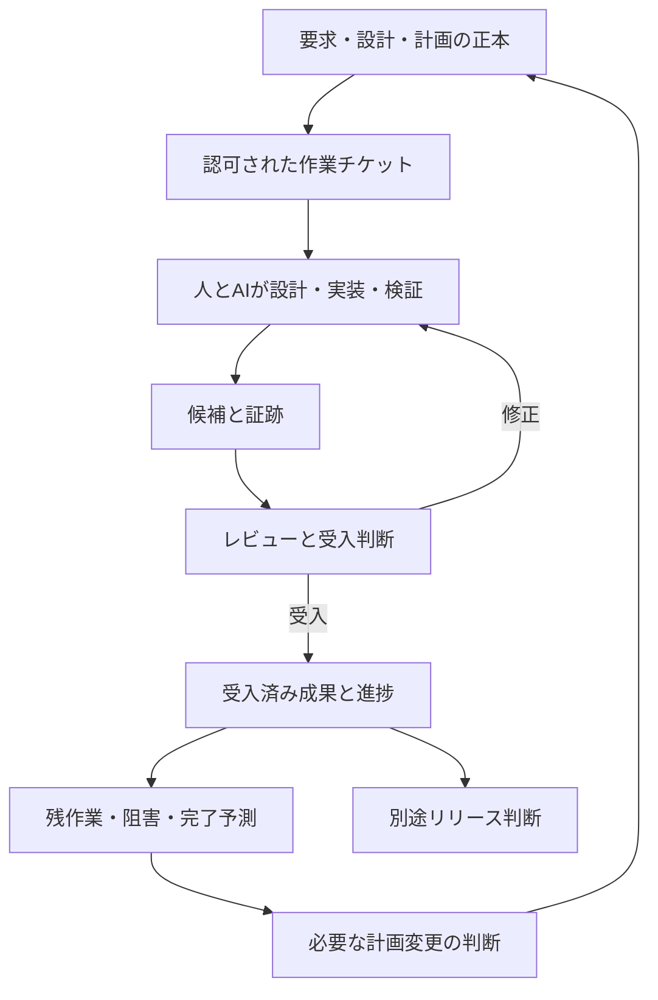

# STD-00 AI協働開発STD MOC

本書は標準の入口である。具体的な規則は各STD、適用値は [PROJECT_PROFILE](../PROJECT_PROFILE.md)、日常の手順は [OPERATION_GUIDE](../OPERATION_GUIDE.md) を参照する。

## 1. 標準一覧

| ID | ノート | そろえること |
| --- | --- | --- |
| STD-01 | [ガバナンス](STD-01_GOVERNANCE.md) | 役割、権限、R0/R1/R2、採用と正本 |
| STD-02 | [Copilot利用](STD-02_COPILOT_USAGE.md) | 入口、コンテキスト、モード差、情報保護 |
| STD-03 | [作業管理](STD-03_WORK_CONTROL.md) | チケット、READY、状態、引継ぎ、並列作業 |
| STD-04 | [要求・変更](STD-04_REQUIREMENTS_AND_CHANGE.md) | 要求からの追跡、差分影響、仕様変更 |
| STD-05 | [設計](STD-05_DESIGN.md) | As-Is/To-Be、責務、I/F、状態、異常時 |
| STD-06 | [実装](STD-06_IMPLEMENTATION.md) | 範囲内変更、C/Yocto、実装時の確認 |
| STD-07 | [検証・受入](STD-07_VERIFICATION_AND_ACCEPTANCE.md) | 結果区分、証跡、レビュー、DoD |
| STD-08 | [進捗管理](STD-08_PROGRESS_MANAGEMENT.md) | 正本、受入済み進捗、残作業、依存、予測 |
| STD-09 | [構成・リリース](STD-09_CONFIGURATION_AND_RELEASE.md) | 版と配布物の同一性、依存、復旧、出荷 |
| STD-10 | [セキュリティ・委託先](STD-10_SECURITY_AND_SUPPLIER.md) | 機密、脆弱性、部品情報、委託先の回答 |
| STD-11 | [リスク・例外](STD-11_RISK_AND_EXCEPTIONS.md) | リスク、判断、例外、計画変更の追跡 |
| STD-12 | [測定・改善](STD-12_MEASUREMENT_AND_IMPROVEMENT.md) | 効果、手戻り、待ち時間、能力と改善 |

## 2. 作業別に読む組合せ

全STDを毎回投入すると参照負担が増える。共通の01・03とPROJECT_PROFILEを基礎に、今回の作業に必要なものだけ追加する。

| 今回の作業 | 追加するSTD | 主な記録 |
| --- | --- | --- |
| 誤記修正・小さな説明追加 | 07 | T-01内の差分・目視確認 |
| 要求・USDM・外部仕様の検討 | 04、必要なら05 | T-01、T-02、既存仕様 |
| 既存境界内の機能実装 | 04、05、06、07 | T-01、必要部分のT-02〜04 |
| 構造・制御権・状態の変更 | 04、05、07、11 | T-02、T-03、T-07 |
| レビュー・受入の準備 | 07、必要な技術STD | T-04、T-01受入欄 |
| 日次・週次の進捗更新 | 08 | T-01、T-05、採用済みT-06 |
| 遅延・範囲・納期の変更提案 | 08、11 | T-05、T-06、T-07 |
| 依存更新・製品リリース | 07、09、10 | T-08、試験・構成情報 |
| 脆弱性・委託先回答 | 04、07、10、11 | T-09、必要なT-02・04・07 |
| AI利用の振り返り | 12 | T-10、週報への改善事項 |

## 3. 全体の流れ

## 4. テンプレートと記入例

| ID | テンプレート | 使う時 |
| --- | --- | --- |
| T-01 | [作業チケット](../templates/T-01_WORK_TICKET.md) | 通常作業の基本。必要項目を集約 |
| T-02 | [差分・影響分析](../templates/T-02_CHANGE_IMPACT.md) | 変更が仕様・設計・既存機能へ及ぶ時 |
| T-03 | [設計メモ](../templates/T-03_DESIGN_NOTE.md) | 構造、状態、I/F、判断を説明する時 |
| T-04 | [検証・レビュー記録](../templates/T-04_VERIFICATION_RECORD.md) | 証跡をチケットから分けると読みやすい時 |
| T-05 | [進捗報告](../templates/T-05_PROGRESS_REPORT.md) | 日次/週次/重要な状況変化 |
| T-06 | [計画ベースライン](../templates/T-06_PLAN_BASELINE.md) | 計画採用時・承認された計画変更時 |
| T-07 | [判断・リスク・例外](../templates/T-07_DECISION_RISK_EXCEPTION.md) | 判断を後から追えるようにする時 |
| T-08 | [リリース記録](../templates/T-08_RELEASE_RECORD.md) | 内部評価版・製品版を配布する時 |
| T-09 | [委託先技術回答](../templates/T-09_SUPPLIER_RESPONSE.md) | ブラックボックス部分の根拠を受け取る時 |
| T-10 | [AI能力・効果ログ](../templates/T-10_AI_CAPABILITY_LOG.md) | 代表作業から改善を学ぶ時。任意 |

- [EX-01 HEMS変更チケットの記入例](../examples/EX-01_WORK_TICKET.md)
- [EX-02 進捗報告の記入例](../examples/EX-02_PROGRESS_REPORT.md)

## 5. 共通語彙

| 区分 | 値・意味 |
| --- | --- |
| 本パッケージの文書状態 | DRAFT_FOR_ADOPTION：標準としての導入案 |
| チケットstate | DRAFT、READY、IN_PROGRESS、IN_REVIEW、CHANGES_REQUESTED、ACCEPTED、CANCELLED |
| 阻害 | impediment=NONE / BLOCKED。stateを消さない |
| 検証結果 | PASS、FAIL、NOT_RUN、BLOCKED、INCONCLUSIVE |
| N/A | 本当に適用外の項目。理由を添える。未実施の代用にしない |
| UNKNOWN / UNSET | 不明または未設定。確認担当と必要な時点を示す |
| 事実・予測・判断 | それぞれ出所／前提／権限者を明記して区別 |

## 6. 最小限の運用

開始時にPROJECT_PROFILEと計画を整え、日常は**作業チケット→証跡→週報**を回す。別冊は、その内容を分けることで確認しやすくなる場合だけ作る。規則の意味や実際の権限を変える省略は、STD-11に従う。

## 参照

- [公式情報・作成根拠](../REFERENCES.md)
- [パッケージの入口](../../README_START_HERE.md)
