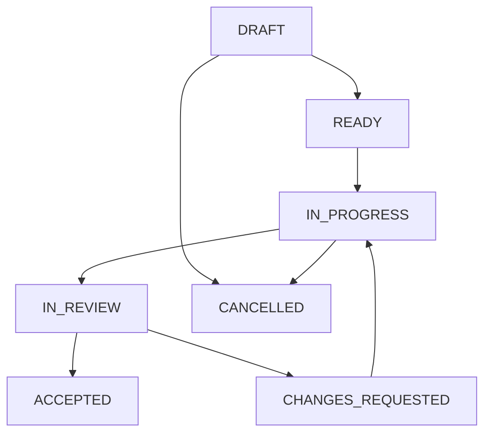

# STD-03 作業チケット・実行・引継ぎ標準

## 1. 作業の単位

**WORK-01（MUST）** 変更を、成果と受入条件が説明できる作業単位で管理する。実装、設計、試験、調査、進捗更新のいずれも対象とする。小さな変更は認可済み親チケットの作業ログに含めてよく、1ファイル・1プロンプトごとのチケット化は不要。

**WORK-02（SHOULD）** 通常チケットは半日〜2営業日程度で評価可能な単位から始める。これは見積りの初期目安であり、強制的な工数制限ではない。長いタスクは「何を確定・検証したら次へ進めるか」で分割し、親子双方を進捗分母へ二重計上しない。

正本は [PROJECT_PROFILE](../PROJECT_PROFILE.md) の `progress_source_of_truth` に従う。Markdown運用なら [T-01](../templates/T-01_WORK_TICKET.md) を実記録先へコピーする。既存Issueを正本にする場合、同じ内容のMarkdownチケットを別の正本として作らない。

## 2. READY条件

**WORK-03（MUST）** 本作業に着手する前に、次をチケットまたは参照元で確認する。明示されたユーザー依頼や既存の委任記録を認可根拠として転記してよく、書式を整えるためだけに承認を取り直さない。

| 項目 | 最小の内容 |
| --- | --- |
| Identity | チケットID、所有者、対象製品・版、作業種別 |
| Goal | 目的、受入条件、非対象 |
| Input | 採用済み要求・設計への参照、基準commitまたは識別可能なスナップショット |
| Scope | 変更可能な対象、制約、R0/R1/R2、必要な権限 |
| Work | 実施順序、検証方法、依存、期限または確認予定 |
| Authority | `task_authorized_by`、`task_authorization_ref`、認可された範囲 |

要求・基準・実機が不足する場合は、その不足を解決する調査チケットを作れる。調査の成果は「判断材料の確定」であり、製品実装完了と扱わない。R2の試作認可と製品への採用認可を区別する。

## 3. 状態と遷移

| state | 意味 | 遷移時の根拠 |
| --- | --- | --- |
| DRAFT | 目的・範囲・依存等を整理中 | 不足項目が見える |
| READY | READY条件と作業認可がある | 認可者または既存委任参照がある |
| IN_PROGRESS | 実際に作業している | 開始時点、担当、基準版を記録 |
| IN_REVIEW | 受入判定できる候補を提出した | 変更と検証記録がある。未実施も正確に明記 |
| CHANGES_REQUESTED | 評価で修正が必要と判断された | 指摘と再評価条件を記録 |
| ACCEPTED | 人の受入責任者が受入条件の成立を確認した | 対象版、判断者、日時、根拠がそろう |
| CANCELLED | 作業を取りやめた | 中止理由と、計画分母の扱いを記録 |

図は主要経路を示す。READY・IN_REVIEW・CHANGES_REQUESTEDからの中止も、担当権限者の判断記録があれば可能。

**WORK-04（MUST）** `impediment: NONE | BLOCKED` を状態と別に持つ。阻害発生時も元のstateを残し、理由、発生日時、解除担当、次回確認日を記録する。例：`state: IN_PROGRESS`、`impediment: BLOCKED`、理由「実機が未到着」。

**WORK-05（MUST）** AIは根拠がある事実状態を更新できる。READYは有効な認可を確認した上で、ACCEPTEDは人の受入判断を確認した上で転記する。依頼文や承認ログがなければ承認者名・判断日時を作らない。

**WORK-06（MUST）** ACCEPTED後の修正は追補チケットを作り、元の受入記録を保持する。受入を撤回する必要がある場合は、撤回者・理由・対象版を記録して再開する。過去の受入判断を無かったことにしない。

## 4. 1回の実行サイクル

1. **読む**：PROJECT_PROFILE、該当STD、チケット、要求・設計、実際の差分を読む。
2. **照合する**：基準版、未コミット変更、他の作業者、依存、認可範囲を確認する。
3. **計画する**：今回の完了目標、編集対象、検証、止める条件を短く示す。
4. **実行する**：認可済み範囲で設計・実装・検証・修正を進める。
5. **照合し直す**：成果物と受入条件、設計・テスト・文書の整合を確認する。
6. **記録する**：変更、証跡、残作業、次の行動を正本へ反映する。
7. **提出する**：評価可能ならIN_REVIEW。未完了なら現状態を維持し、阻害や引継ぎを残す。

作業途中の軽微な手順変更や新しいテストの追加で、同じチケットの実行認可を取り直す必要はない。受入条件・範囲・R2境界・合意納期を変える場合は、変更提案を記録して該当判断を受ける。

## 5. コンテキストと引継ぎ

**WORK-07（MUST）** セッション終了・担当変更・長い中断では、次の6点をチケット末尾に残す。会話全文の保存は必須ではない。

- 現状態、阻害、認可範囲。
- 基準版と現在の候補版、未コミット差分の場所。
- 実施済みの変更と、その証跡。
- 実行した検証と、実行していない検証。
- 未解決事項と判断待ち。
- 次に読むもの、次に行う1〜3手順。

再開担当は、記録した候補版と実物の一致を確認する。新セッションのAIが前回の会話や添付を保持していると仮定しない。

## 6. 複数担当・並列作業

**WORK-08（SHOULD）** 並列タスクには編集対象、依存、統合担当、出力を割り当てる。別ブランチ・worktree等で変更を分離する。統合担当は他の担当者の未完了変更を削除しない。

同じ正本を複数担当が更新する場合は、担当範囲または編集順を決める。要約した進捗表とチケットが食い違った場合、設定された正本へ戻って再集計する。

## 7. 異常時の扱い

| 観測 | 対応 |
| --- | --- |
| 参照版が違う | 差分を確認し、影響する作業だけ止める。必要なら計画を更新 |
| ビルド・試験環境がない | NOT_RUNまたはBLOCKEDを記録し、できる静的確認を続ける |
| 認可範囲外の修正が必要 | 根拠と代案を提示し、該当範囲の判断を待つ |
| ツールが権限で拒否した | 拒否対象と理由を記録。許可された代替作業を進める |
| 検証で想定外の不具合を発見 | 本件への影響を評価し、範囲内で修正または関連チケットへ分離 |

## 関連ノート

- [STD-01 ガバナンス](STD-01_GOVERNANCE.md)
- [STD-07 検証と受入](STD-07_VERIFICATION_AND_ACCEPTANCE.md)
- [STD-08 進捗管理](STD-08_PROGRESS_MANAGEMENT.md)
- [T-01 作業チケット](../templates/T-01_WORK_TICKET.md)
