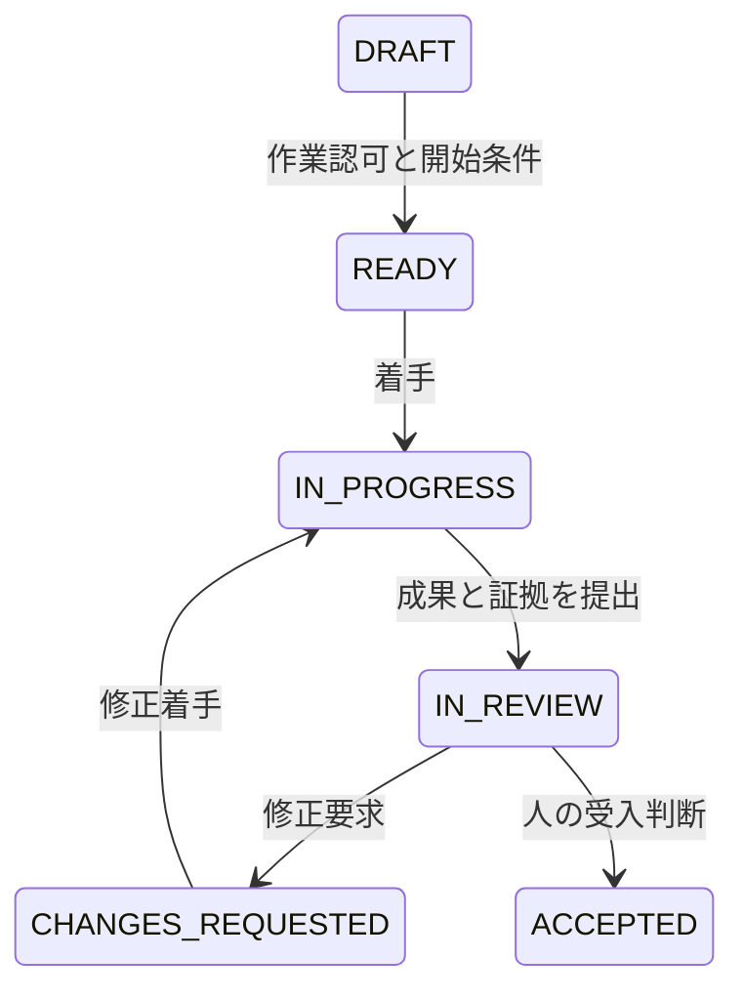

# STD-08 開発進捗管理標準

採用・業務承認前の標準案。適用設定は [PROJECT_PROFILE](../PROJECT_PROFILE.md) に記録する。
必須はMUST、推奨はSHOULD、任意はMAYとして [STD-01](STD-01_GOVERNANCE.md) に従う。

## 1. 目的と原則

実開発の状態、成果の受入、依存関係、予測を、根拠付きで同じ時点から説明できるようにする。
人とAIはともに計画・実行・観測・評価・改善を行える。計画の約束と成果の受入には、人の責任者を置く。

- 必須：観測事実、仮説・予測、判断待ちを区別する。
- 必須：AIは進捗、試験PASS、承認、受入、外部ツールへの反映完了を推測で補わない。
- 必須：着手量、実装量、テスト合格、受入済み量を区別する。
- 必須：不明な値は `UNSET`、未観測、算出不可として残し、ゼロや完了に置換しない。
- 推奨：週報のための別集計を増やさず、作業票の観測結果から作る。

## 2. 正本を一つに決める

[PROJECT_PROFILE](../PROJECT_PROFILE.md) の次の設定を使用する。

| キー | 運用 |
|---|---|
| `progress_source_of_truth` | `MARKDOWN` または `ISSUE_TRACKER` の一つ |
| `progress_source_location` | 正本の保管先・プロジェクトURL等 |
| `baseline_id` | 有効な承認済み基準計画。未設定時は正式進捗率を算出しない |
| `progress_owner` / `acceptance_owner` | 進捗の管理責任者 / 成果の受入責任者 |
| `work_calendar` | 時間帯、稼働日、祝日等。暫定値と確定値を区別 |
| `wip_limit` / `report_cadence` | 同時進行数 / 更新頻度 |

`MARKDOWN` の初期保管先候補は `work/tickets`。既存Issue運用が正本なら `ISSUE_TRACKER` を選ぶ。
週報、ダッシュボード、会話は正本を参照したスナップショットであり、独立した第二の正本にしない。
正本を切り替えるときは、移行対象、切替時刻、未解決差異、管理責任者の承認を残す。

## 3. 作業状態と阻害状態

作業状態は [STD-03](STD-03_WORK_CONTROL.md) に従う。

| 状態 | 進捗上の意味 |
|---|---|
| `DRAFT` | 作業内容や認可条件を準備中 |
| `READY` | 必要条件を満たし、`task_authorized_by / task_authorization_ref` に作業認可が記録済み |
| `IN_PROGRESS` | 認可された作業を実施中 |
| `IN_REVIEW` | 成果と評価証拠を提出し、確認・受入判断を待つ |
| `CHANGES_REQUESTED` | 指摘に対する修正が必要 |
| `ACCEPTED` | 定義済み受入条件を満たし、人の受入判断が記録済み |
| `CANCELLED` | 中止の判断と理由を記録済み。完了量には含めない |

阻害は別属性 `impediment=NONE / BLOCKED` で表す。`BLOCKED` を作業状態に混ぜない。
阻害開始時刻、理由、解除条件、解除に動く担当者、次回確認予定を記録する。
状態を動かせないときも、観測事実と次の行動は更新する。

中止は認可された中止判断により `CANCELLED` とする。図は通常の受入経路を示す。

## 4. 作業票に必要な観測項目

[T-01](../templates/T-01_WORK_TICKET.md) に次の情報を持たせる。実体がIssueなら同等の欄でよい。

- 作業ID、基準計画ID、成果物、担当Actor、受入者、要求・設計・検証への参照。
- 作業状態、阻害属性、最終観測時刻、観測元の版・コミット・実行ID。
- 凍結済み重み `baseline_weight`、受入条件、受入判断者・日時・参照、必要な試験結果。
- 計画期限、最新予測、予測根拠・幅・前提。実着手・実完了・受入日時は別に保存。
- 先行作業、外部依存、待ち理由、待ち開始・終了、次に行う具体的な一手。
- 未確認事項と、必要な追加観測。会話だけが根拠なら、その旨を明示。

試験結果は `PASS / FAIL / NOT_RUN / BLOCKED / INCONCLUSIVE` を用いる。
`PASS` は観測した試験の判定であり、作業の受入やリリースの判断を代行しない。

## 5. 正式進捗率は受入済み成果で計算する

これは本プロジェクトで採用する進捗の定義であり、GitHubの標準指標や外部制度の必須算式ではない。承認済み基準計画の、重複しない末端作業集合を $B$、作業 $i$ の凍結重みを $w_i>0$ とする。

$$
P_{accepted}=100\frac{\sum_{i\in B}w_i\,a_i}{\sum_{i\in B}w_i},
\qquad a_i=\begin{cases}1 & \text{有効な受入記録を持つACCEPTED}\\0 & \text{それ以外}\end{cases}
$$

- 重みは計画時の相対規模等として事前に定義し、実績工数や自己申告完成度で毎回変えない。
- 親作業と子作業を両方分母に含めない。基準計画に含まれない追加作業を黙って混ぜない。
- `CANCELLED` も、承認済み基準計画を改訂するまでは旧分母に残り、分子には入らない。
- 分母が未承認、ゼロ、または重み・受入状態に未確認がある場合、正式値は「算出不可」とする。
- 受入条件は、成果物・必須評価・許容できる残課題・受入判断者を作業開始前に明記する。
- `ACCEPTED` は、必要な検証の証拠、指摘の処置、残存リスクの必要な承認、人の明示的受入記録を要する。
- 受入は `accept_decision=ACCEPT` と `accepted_by / accepted_at / acceptance_ref / candidate_revision` で対象と判断を特定する。
- 必須条件の未充足を許容する場合は、[STD-07](STD-07_VERIFICATION_AND_ACCEPTANCE.md) とSTD-11の有効な例外判断が必要。
- 許容可能な例外付きで受け入れた成果は、件数・重み・未充足条件・例外期限を別記する。受入済み集計に含めても、全条件を通常どおり充足した成果と同じ説明にしない。
- AIの自己評価、コード作成済み、CI緑、レビュー依頼済みだけでは `a_i=1` にしない。

受入済み成果に不具合を発見した場合は不具合票を起票し、影響と処置を受入者に提示する。
誤記の訂正や受入判断の取消が必要なら、人の判断と訂正履歴を残す。過去報告を無断で書き換えない。

## 6. 部分進捗と基準計画変更

部分進捗は別列に「設計確認済み」「必須試験8件中5件実施、3件未実施」等の観測結果を書く。
部分進捗を重みへ乗算して正式進捗率に混ぜない。参考の割合を出す場合も分母と算式を明記する。

承認済み基準計画の集計対象 $B$、重み、範囲、合意した期限・予算を変える場合に、[STD-04](STD-04_REQUIREMENTS_AND_CHANGE.md) と以下の基準変更手順を適用する。認可済み範囲内の実施手順の細分化、集計対象へ追加しない補助作業の起票、観測に基づく予測更新は通常作業として進められる。
AIは変更案と差分・影響を作れるが、基準計画を独断で切り替えない。親を分母から外して子を新たな集計対象へ変更する場合は、基準計画変更として扱う。

1. 旧基準ID、変更理由、追加・削除・重み差分、影響する要求と期限を記録する。
2. **同じ観測時点**について、旧分子/旧分母/旧進捗率と、新分子/新分母/新進捗率を併記する。
3. 人の変更承認と適用時点を記録して新基準を有効にする。承認前の新値は「変更案」と表示する。
4. 旧基準・旧報告を保持し、分母減による進捗率上昇を成果完成と説明しない。

基準計画には [T-06](../templates/T-06_PLAN_BASELINE.md) を使用する。

## 7. WIP・依存・待ち時間

WIPは、主担当ごとの `IN_PROGRESS / IN_REVIEW / CHANGES_REQUESTED` の作業数とする。
この状態にある `impediment=BLOCKED` の作業も含め、停止案件を見えなくしない。
初期候補は主担当あたり2件。これは推奨初期値であり、製品や組織に必須の数値ではない。
上限超過時は理由、解消行動、見直し時点を記録する。上限合わせだけの状態変更をしない。

| 観測対象 | 管理に使う意味 |
|---|---|
| 作業時間 | 人の投入工数とAI実行時間を分け、定義と取得方法を示す |
| 待ち時間 | レビュー、承認、依存先、環境等の理由別に追跡する |
| 手戻り | 修正要求後の変更量・人の修正工数・再試験を記録する |
| 依存関係 | 先行作業、外部回答、解除条件と次回確認予定を示す |
| ボトルネック | 滞留数、待ち時間、期限影響の観測から候補を示す |

待ち時間はカレンダー経過か稼働時間かを明示する。未設定の勤務日を仮定して確定値を作らない。
AIが挙げるボトルネックの原因は、観測で確認できるまでは仮説として表示する。

## 8. 期限と予測を分ける

計画期限は承認済みの約束、予測は現時点で見込む到達時点であり、別の値として保存する。
予測更新は観測の更新である。納期変更の承認や顧客への約束変更として扱わない。
予測には残作業、実績の範囲、依存先の回答見込み、カレンダー、不確実性を添える。
十分な実績がない場合は範囲または条件付き予測とし、根拠のない単一日付を確約しない。
契約・予算・納期の約束に影響する判断はR2として人へ提示する。

## 9. 最小限の更新周期

| タイミング | 最小の更新 |
|---|---|
| 作業終了時 | 変更した作業、観測結果と証拠、次の行動、阻害の有無 |
| 週次 | 受入済み進捗、WIP、期限と予測、待ち・依存、リスク、判断待ち |
| イベント時 | 阻害発生・解除、重大失敗、受入、範囲変更、期限影響を更新 |

頻度は推奨初期設定であり、運用開始時に `report_cadence` で確定する。
既認可のR0/R1範囲では、AIは毎回の許可を取り直さず観測結果と週報を更新できる。
人の承認欄、基準計画、約束、受入をAIが代筆して成立させてはならない。

## 10. 報告と実反映を区別する

[T-05](../templates/T-05_PROGRESS_REPORT.md) には、集計時点、対象範囲、情報源、未取得を必ず記す。
正本へ書き込んだ場合は、対象ID、変更内容、ツール結果、読戻し確認または更新版への参照を残す。
会話に報告文を表示しただけでは、Issue・ボード・正本の更新完了にしない。
アクセスできない場合は「反映待ち」とし、差分案を提示する。架空の更新URLや実行IDを作らない。
通知や外部送信は、承認済みの送信範囲・権限に従う。

## 11. 関連文書

- [STD-03 作業制御](STD-03_WORK_CONTROL.md)、[STD-07 検証・受入](STD-07_VERIFICATION_AND_ACCEPTANCE.md)
- [STD-11 リスク・例外](STD-11_RISK_AND_EXCEPTIONS.md)、[STD-12 測定・改善](STD-12_MEASUREMENT_AND_IMPROVEMENT.md)
- [EX-02 進捗報告の架空例](../examples/EX-02_PROGRESS_REPORT.md)
