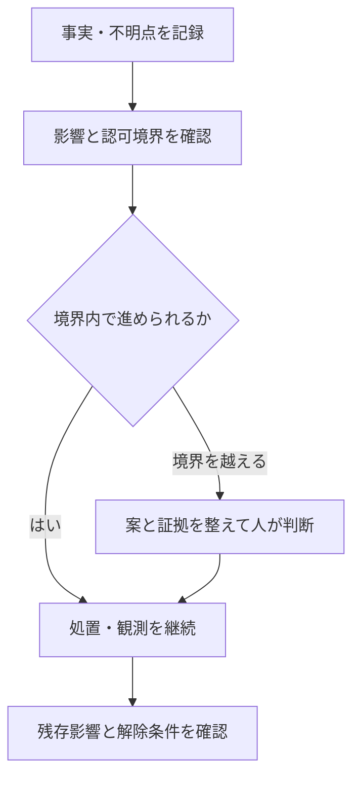

# STD-11 リスク・判断・例外管理標準

採用・業務承認前の標準案。適用設定は [PROJECT_PROFILE](../PROJECT_PROFILE.md) に記録する。
必須はMUST、推奨はSHOULD、任意はMAYとして [STD-01](STD-01_GOVERNANCE.md) に従う。

## 1. 目的

不確実な点、実際に起きた問題、必要な判断、標準からの逸脱を分けて記録し、継続できる作業を進める。
人とAIはともに発見・調査・対策案・観測・評価を担える。リスク受容、例外承認、約束変更の責任者は人とする。
文書の量を増やすことではなく、誰が何を確認し、どの条件で進められるかを明らかにする。

## 2. 四つの記録を区別する

| 種類 | 意味 | 閉じるために必要なもの |
|---|---|---|
| `RISK` | 今後、好ましくない結果が起きる不確実性 | 対策の確認、または残存リスクを引き受ける人の判断 |
| `ISSUE` | 現在、発生が確認された問題・不足 | 処置と確認結果。再発リスクが残るなら別途記録 |
| `DECISION` | 選択肢や方針について必要な判断 | 判断者、選択、理由、適用範囲・時点 |
| `EXCEPTION` | 特定の標準・手順からの限定的な逸脱 | 承認、代替策、範囲、期限、終了確認 |

不明点を「問題なし」に変えない。試験を実施できないことは、試験合格でもリスク受容でもない。
一つの事象から複数種類が生じる場合はIDで関連付け、同じ決定を複数の正本で管理しない。

## 3. 記録の粒度

[T-07](../templates/T-07_DECISION_RISK_EXCEPTION.md) を使い、小さい項目は一覧の一行でよい。
R2、受入を妨げる問題、例外承認、複数作業へ波及する項目は、判断根拠まで追える記録を残す。
発見したActor、担当Actor、責任を負う人、判断期限を分ける。AIを人の承認者として記録しない。
同じ人が開発・管理・評価を兼務する場合も、確認した時点と観点を記録する。

最小項目は次のとおり。

- ID、種類、要約、関連作業・要求・設計・リリース、対象版。
- 観測時刻、事実と証拠、仮説、未確認、影響する境界。
- 発生条件、影響、対応案、残存する不確実性。
- 担当Actor、人の責任者、次の行動、必要な判断と期限。
- 判断または承認の記録、処置結果、終了条件と確認証拠。

## 4. 作業影響区分とリスクの重大度を混同しない

R0/R1/R2は [STD-01](STD-01_GOVERNANCE.md) と [STD-03](STD-03_WORK_CONTROL.md) の作業認可境界である。
発生確率と被害の重大度は別に評価する。小さなコード差分でも、安全や認証認可に触れればR2になり得る。

| 区分 | 本標準での扱い |
|---|---|
| R0 | 動作不変の低影響作業。既認可内で自律継続 |
| R1 | 認可済み要求・設計・権限の範囲内の通常作業。既認可内で自律継続 |
| R2 | 要求、設計原理、安全、認証、認証認可、重要依存、外部公開、永続形式、納期・予算等への影響境界を人が承認 |

R2を発見しても、調査結果・選択肢・影響分析・検証案を具体化する作業まで一律に止めない。
既認可で安全に進められる調査を進め、境界を越える実行を保留する。
調査自体が機器出力、外部公開、秘密情報、破壊的変更等に影響する場合は、その調査の認可範囲を確認する。

## 5. 評価は簡単でも根拠を残す

影響、起こりやすさ、検知可能性、影響範囲、不明点を短く記す。点数計算は必須にしない。
`HIGH / MEDIUM / LOW / UNKNOWN` 等を使う場合、その定義はプロジェクトで決める。
未知の影響を `LOW` としない。根拠が不足する場合は `UNKNOWN` として、必要な調査を示す。

次は**推奨する初期のエスカレーション条件**であり、外部規格の義務や認証適合の判定基準ではない。

ここでいう影響は、承認済みの条件・上限・制御権・不変条件を変更または逸脱する恐れがある場合、あるいはその影響を判定できない場合を指す。承認済み仕様どおりの通常動作を実装・確認する作業は、それだけを理由に再承認対象としない。

- 安全、機器出力、権限境界、秘密情報、更新・復旧不能、永続データ損失への影響が考えられる。
- 出力制御・認証対象・規定動作への影響を、資料不足で判定できない。
- 不具合や脆弱性の影響版・対象機器・到達経路を特定できない。
- 重要依存先の回答がなく、承認済み期限に影響する見込みがある。
- 同じ未解決要因が複数の作業またはリリースへ波及する。

発生確率が低いという推測だけで、重大な影響への対応を省略しない。
「影響なし」も判断である。調べた版、経路、条件、除外根拠と限界を付ける。

## 6. 対応を選び、解除条件を決める

対応は、回避、低減、監視、依存先との分担、残存リスク受容等から具体的に選ぶ。
委託先へ調査を依頼しても、製品側の受入責任が自動的に移ったことにはしない。
対応作業を起票し、完了条件と確認方法を決める。「注意する」「対応予定」のみで閉じない。

| 決めること | 記録する内容 |
|---|---|
| 何を進めるか | 認可内で継続できる作業、必要な観測 |
| 何を保留するか | 境界を越える変更、受入、配布等の該当部分 |
| 何が分かれば進めるか | 必要証拠、判断者、解除条件 |
| いつ見直すか | 回答期限、条件変化、定期確認日 |
| 残るものは何か | 残存影響、不確実性、監視・復旧策 |

作業を阻害する場合は作業票に `impediment=BLOCKED` と本記録IDを付ける。
関係しないR0/R1作業は、認可範囲内で継続する。

## 7. 判断記録

判断案には、問題、選択肢、利点・欠点、推奨案、影響、未確認、必要な決定期限を付ける。
人へ尋ねる前に、既認可で調べられる資料を確認し、レビュー可能な案まで仕上げる。
認可済みの方針を毎回問い直さない。新しい証拠で境界が変わった場合に判断を求める。
承認には、判断者、日時、選んだ案、対象版・範囲、条件を記録する。
無応答、会話の相づち、AIが生成した承認欄を承認とみなさない。
承認された案と実装の対応が分からなくなったら、影響差分を示して扱いを確認する。

## 8. 例外は範囲と有効期限を限定する

例外申請には以下を必須とする。

1. 逸脱する標準IDと条項、通常手順、今回守れない理由。
2. 対象製品・版・作業・環境、対象外、開始条件。
3. 影響と残存リスク、代替確認、監視、復旧・取消方法。
4. 有効期限または終了イベント、再確認日、終了させる担当者。
5. 人の承認者、承認日時、適用条件、承認対象となる案の参照。

例外が承認されるまで、該当する逸脱を実行しない。無関係な認可済み作業は継続してよい。
期限切れ、対象範囲超過、前提条件の変化があれば効力を失う。再承認を自動生成しない。
後から例外票を書いたことだけでは、先に行った未認可の操作は承認済みにならない。
上位の法令、契約、認証条件、組織の必須規則を、このSTDだけで免除できるとは扱わない。
その要件の責任者と根拠に従い、免除できない場合は代替策または計画変更を選ぶ。

## 9. 緊急時

事前に承認された緊急停止・復旧手順がある場合は、その範囲内で実行し、観測と操作履歴を残す。
緊急対応という名称で、新たな権限、配布先、公開、破壊操作を無制限に認可したことにしない。
事前手順がなく権限境界を越える場合は、具体的な対応案と影響を提示して人の判断を得る。
対応後は、状態、証拠、復旧確認、残存影響、再発防止の要否を記録する。
通知・報告の期日は、適用される組織・契約・制度の要件を確認する。独自の日数を制度要件として創作しない。

## 10. 終了・再開・週次確認

- 対応の実施、評価結果、残存影響、責任者の確認が追える状態にして閉じる。
- 技術試験の `PASS` と、残存リスク受容・成果受入・リリース判断を分ける。
- 例外終了時は通常手順へ戻った証拠、または正式に改訂した標準への参照を残す。
- 再発、新しい影響版、前提の変更が見つかったら再開するか、関連した新記録を作る。
- 週次では高影響、期限超過、阻害、期限切れ例外、担当未定を優先して確認する。
- 承認待ち時間を記録し、判断案不足と責任者不在等の原因を混同しない。

終了日時を埋めるために、証拠のない解決・受容を作らない。

## 11. 関連文書

- [STD-04 変更管理](STD-04_REQUIREMENTS_AND_CHANGE.md)、[STD-07 検証・受入](STD-07_VERIFICATION_AND_ACCEPTANCE.md)
- [STD-08 進捗管理](STD-08_PROGRESS_MANAGEMENT.md)、[STD-10 セキュリティ・委託先](STD-10_SECURITY_AND_SUPPLIER.md)
- [T-07 決定・リスク・課題・例外記録](../templates/T-07_DECISION_RISK_EXCEPTION.md)
